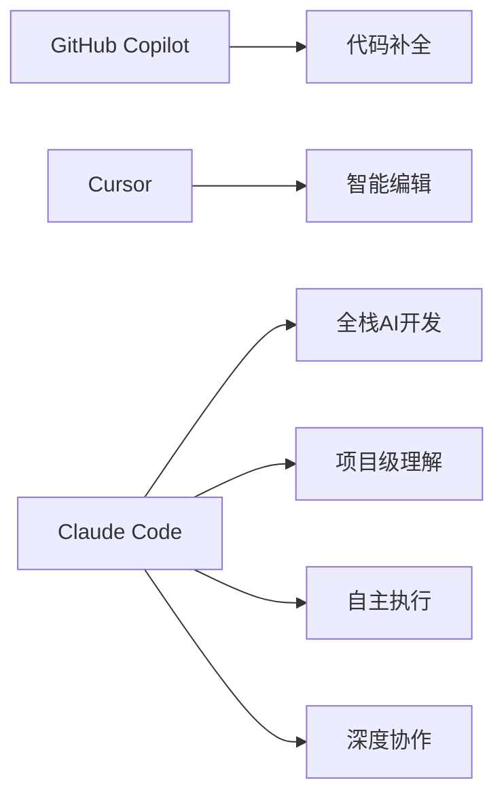

## 引言：编程正在发生革命

想象一下，如果有一个AI助手能够理解你的整个代码库，帮你写代码、调试问题、重构项目，甚至能够独立完成复杂的开发任务，这会是什么样的体验？

这不再是科幻小说，而是现实。**Claude Code** 正在重新定义我们对AI辅助编程的认知。

## 什么是Claude Code？

### 核心定义

**Claude Code** 是由Anthropic开发的智能编程助手，它不仅仅是一个代码生成工具，更是一个能够理解、分析和协作的AI开发伙伴。它直接运行在你的终端中，能够：

- 🎯 **理解整个项目**：分析你的完整代码库结构和上下文
- 🔧 **直接编辑文件**：实时修改、创建和管理项目文件
- 🚀 **执行系统命令**：运行测试、构建项目、管理依赖
- 💡 **智能决策**：基于项目需求做出最优的技术选择

### 与传统工具的根本区别

#### 传统IDE vs Claude Code

| 特性 | 传统IDE | Claude Code |
|------|---------|-------------|
| **交互方式** | 手动编码 | 自然语言对话 |
| **理解能力** | 语法高亮、自动补全 | 深度理解业务逻辑 |
| **工作范围** | 单文件编辑 | 全项目级别操作 |
| **学习曲线** | 需要学习具体语法 | 用自然语言描述需求 |
| **自动化程度** | 需要手动执行每个步骤 | 自动完成复杂工作流 |

#### Claude Code vs 其他AI编程工具



**Claude Code的独特优势：**

1. **项目级智能**：不仅理解单行代码，更理解整个项目架构
2. **自主执行能力**：可以独立完成复杂任务，而不只是提供建议
3. **深度上下文理解**：维护长期项目记忆，了解你的编程偏好
4. **真正的协作伙伴**：像与人类开发者协作一样工作

## Claude Code的核心特性

### 1. 智能项目理解

```bash
# 传统方式：手动分析项目结构
ls -la
cat README.md  
grep -r "TODO" .

# Claude Code方式：一句话搞定
claude "分析这个项目的架构，找出需要优化的地方"
```

Claude Code能够：
- 自动分析项目结构和依赖关系
- 理解代码的业务逻辑和设计模式
- 识别潜在的问题和改进机会
- 维护项目的上下文记忆

### 2. 自然语言编程

不再需要记忆复杂的API或语法，只需要用自然语言描述你的需求：

```
"创建一个用户认证系统，包括注册、登录和密码重置功能"
"优化数据库查询性能，减少N+1查询问题"  
"添加单元测试，覆盖率达到90%以上"
"重构这个组件，使用最新的React Hooks"
```

### 3. 端到端开发工作流

Claude Code不仅仅写代码，还能：

```bash
# 完整的开发工作流
claude "创建一个博客系统"
# → 分析需求
# → 设计架构
# → 创建数据库模型
# → 开发API接口
# → 实现前端界面
# → 编写测试用例
# → 配置部署脚本
# → 生成文档
```

### 4. 智能调试与优化

```python
# 当你遇到这样的错误
def process_users(users):
    results = []
    for user in users:
        # 这里有个Bug，但你找不到
        if user.is_active():
            results.append(user.get_profile())
    return results

# Claude Code会告诉你：
# "发现潜在的N+1查询问题，建议使用select_related优化"
# "user.get_profile()可能返回None，需要添加空值检查"
```

## Claude Code如何改变开发方式

### 编程思维的转变

#### 从"How"到"What"

**传统编程思维：**
```
我需要：
1. 创建数据库模型
2. 写SQL查询语句  
3. 实现API路由
4. 处理错误情况
5. 编写测试用例
```

**AI编程思维：**
```
我需要一个用户管理系统，
能够处理用户注册、登录和权限管理，
要求安全可靠，性能良好。
```

#### 从"编码者"到"架构师"

使用Claude Code，开发者的角色发生根本性转变：

- **专注于业务逻辑**：不再纠结于语法细节
- **系统性思考**：从更高层面设计和优化系统
- **快速原型验证**：快速实现想法并获得反馈
- **持续学习**：通过AI的建议学习最佳实践

### 开发效率的数量级提升

根据Anthropic和用户社区的数据：

- **代码编写速度**：提升 3-10倍
- **调试效率**：提升 5-15倍  
- **项目交付时间**：缩短 40-70%
- **代码质量**：显著提升（更少的bug，更好的架构）

## 适用场景与目标用户

### 完美适用的场景

#### 1. 快速原型开发
```bash
claude "创建一个简单的电商网站原型，包括商品展示和购物车功能"
# 30分钟内完成传统需要几天的工作
```

#### 2. 代码重构和优化
```bash
claude "这个老项目性能很差，帮我重构和优化"
# 自动识别性能瓶颈，提供优化方案
```

#### 3. 学习新技术
```bash
claude "我想学习Kubernetes，创建一个实际的部署示例"
# 边学边实践，理论与实际结合
```

#### 4. 团队协作开发
```bash
claude "分析这个PR的代码变更，给出review意见"
# 自动化代码审查，提升团队效率
```

### 目标用户群体

#### 🎯 初学者开发者
- **痛点**：语法不熟悉，不知道最佳实践
- **解决**：自然语言编程，边做边学
- **收益**：快速上手，避免常见陷阱

#### 🎯 经验开发者
- **痛点**：重复性工作多，需要快速实现想法
- **解决**：自动化繁琐任务，专注于核心逻辑
- **收益**：效率提升，更多时间用于创新

#### 🎯 技术负责人
- **痛点**：需要快速评估技术方案，指导团队
- **解决**：快速原型验证，自动化代码审查
- **收益**：更好的决策支持，团队效率提升

#### 🎯 创业团队
- **痛点**：资源有限，需要快速MVP
- **解决**：一个人顶一个团队，快速迭代
- **收益**：降低开发成本，加速产品上市

## Claude Code在AI编程生态中的位置

### AI编程工具进化史

```
第一代：代码补全 (GitHub Copilot)
    ↓
第二代：智能编辑 (Cursor, Codeium)
    ↓  
第三代：AI协作开发 (Claude Code) ←── 我们在这里
    ↓
未来：完全自主开发？
```

### 技术架构优势

Claude Code基于Anthropic最先进的AI模型：

- **Claude 4 Sonnet**：平衡性能和成本
- **Claude 4 Opus**：最强推理能力  
- **持续更新**：随着AI技术进步而改进

#### 核心技术能力

1. **上下文理解**：支持100K+代码行的项目分析
2. **多模态能力**：理解代码、文档、图片等多种输入
3. **推理能力**：不仅生成代码，更能解释为什么这样写
4. **安全性**：内置安全检查，避免生成有害代码

## 实际使用体验

### 一个真实的开发场景

让我们看看使用Claude Code开发一个简单博客系统的过程：

```bash
# 传统开发方式（预计需要1-2周）
1. 设计数据库表结构
2. 选择技术栈（前端/后端/数据库）
3. 搭建开发环境
4. 实现用户认证
5. 开发文章CRUD功能
6. 实现前端界面
7. 编写测试用例
8. 部署配置
9. 文档编写

# Claude Code方式（几个小时完成）
claude "创建一个现代化的博客系统，
支持用户注册登录、文章发布编辑、
评论功能，使用React+Node.js+MongoDB，
要求响应式设计，SEO友好"

# 结果：
# ✅ 完整的项目结构
# ✅ 用户认证系统
# ✅ 文章管理功能  
# ✅ 响应式前端界面
# ✅ 完整的测试套件
# ✅ 部署配置文件
# ✅ 详细的文档
```


## 未来展望：AI编程的下一步

### 短期发展（6-12个月）

1. **更深度的IDE集成**：VS Code、IntelliJ等深度整合
2. **团队协作功能**：多人实时AI编程协作
3. **更多语言支持**：覆盖更多编程语言和框架
4. **企业级功能**：权限管理、审计日志、合规检查

### 长期愿景（1-3年）

1. **自主架构设计**：AI独立完成复杂系统设计
2. **自动化运维**：从开发到部署全流程自动化
3. **智能需求理解**：从模糊需求到精确实现
4. **跨领域专业化**：专门针对不同行业的AI开发助手

### 对行业的影响

Claude Code不仅仅是一个工具，它正在重新定义：

- **软件开发的流程**：从瀑布式到AI驱动的敏捷开发
- **团队的组织结构**：更少但更高级的开发者
- **教育的方式**：从学习语法到学习架构思维
- **创新的速度**：想法到产品的时间大幅缩短

## 总结

Claude Code代表了AI编程工具的一次重大飞跃，它不仅仅是一个代码生成器，更是一个真正的AI开发伙伴。通过自然语言交互、深度项目理解和自主执行能力，Claude Code正在改变我们对编程的认知。

无论你是初学者还是资深开发者，无论你是独立开发者还是团队负责人，Claude Code都能显著提升你的开发效率和代码质量。

在下一篇文章中，我们将详细介绍如何安装和配置Claude Code，让你能够立即开始这个AI编程的旅程。

## 相关文章推荐

- [Claude Code安装配置完全指南](02-Claude-Code安装配置指南.md)
- [首次使用：创建你的第一个项目](03-首次使用创建第一个项目.md)
- [核心概念：理解AI编程工作流](05-核心概念理解AI编程工作流.md)

## 参考资源

- [Claude Code官方文档](https://docs.anthropic.com/en/docs/claude-code)
- [Anthropic开发者社区](https://community.anthropic.com)
- [Claude Code最佳实践指南](https://www.anthropic.com/engineering/claude-code-best-practices)

---

*本文是《Claude Code 完整教程系列》的第一部分。如果你想了解更多AI编程相关内容，欢迎关注我们的教程系列。*