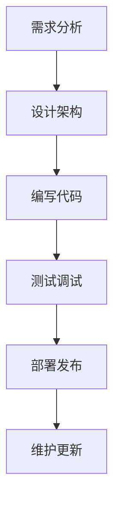
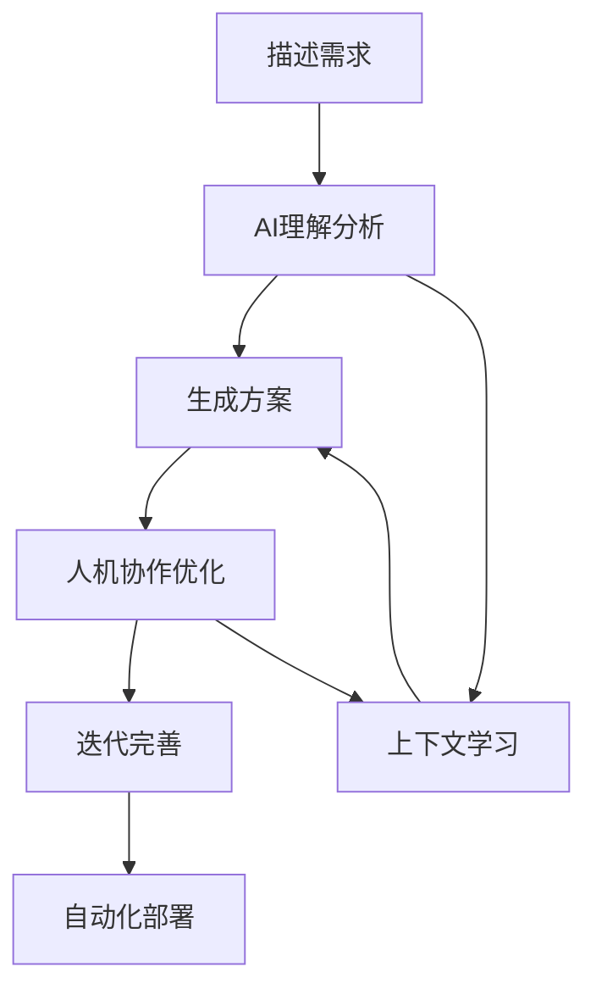
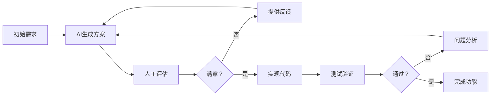

## 引言：从传统编程到AI编程的思维转变

在前面的文章中，我们已经体验了Claude Code的强大能力。但要真正掌握AI编程，我们需要理解其背后的核心概念和工作原理。

这篇文章将带你深入了解**AI编程的本质**，掌握与AI协作开发的精髓。

## AI编程的本质：从"编码"到"协作"

### 传统编程范式



**特点：**
- 线性流程，步骤分明
- 开发者独立完成所有工作
- 重点关注"如何实现"（How）
- 需要深入的技术细节知识

### AI编程范式



**特点：**
- 循环迭代，持续优化
- 人机协作，优势互补
- 重点关注"要什么"（What）
- 自然语言驱动开发

## 核心概念1：提示工程(Prompt Engineering)

### 什么是提示工程？

**提示工程**是与AI有效沟通的艺术和科学。在Claude Code中，你的每一句话都是一个提示（Prompt），它决定了AI的理解程度和输出质量。

### 优秀提示的特征

#### 1. 清晰具体

❌ **糟糕的提示：**
```
"做一个网站"
```

✅ **优秀的提示：**
```
"创建一个响应式的电商网站，包括：
- 商品展示页面（网格布局，支持筛选和搜索）
- 购物车功能（添加/删除/修改数量）
- 用户注册登录系统
- 支付集成（Stripe）
- 管理员后台
使用React + TypeScript + Tailwind CSS
数据库使用PostgreSQL"
```

#### 2. 结构化描述

✅ **使用结构化格式：**
```
"创建一个博客系统：

## 功能需求
1. 文章管理（CRUD）
2. 用户评论系统
3. 标签分类
4. 搜索功能

## 技术要求
- 前端：Next.js + TypeScript
- 后端：Node.js + Express
- 数据库：MongoDB
- 认证：JWT

## UI要求
- 响应式设计
- 深色模式支持
- 现代化界面

## 性能要求
- 首页加载时间 < 2秒
- SEO友好
- 移动端优化"
```

#### 3. 上下文相关

```bash
# 在项目上下文中提供信息
claude "基于当前的React项目，添加一个用户认证系统，
要求与现有的UI风格保持一致，
使用已经安装的Tailwind CSS，
认证状态要在整个应用中共享"
```

### 提示工程最佳实践

#### 1. 分层描述法

```
# 第一层：项目概述
"创建一个现代化的项目管理工具"

# 第二层：核心功能
"包括项目创建、任务分配、进度跟踪、团队协作功能"

# 第三层：技术细节
"使用微服务架构，前端React，后端Spring Boot，消息队列Redis"

# 第四层：具体要求
"支持实时通信，权限管理，数据可视化，移动端适配"
```

#### 2. 示例驱动法

```bash
claude "创建一个类似Trello的看板系统，参考这个功能：

用户可以：
1. 创建看板 → 如'产品开发看板'
2. 添加列表 → 如'待办'、'进行中'、'已完成'
3. 创建卡片 → 如'实现用户登录功能'
4. 拖拽卡片 → 从'待办'拖到'进行中'
5. 添加标签 → 如'高优先级'、'Bug'、'新功能'

界面要现代化，支持暗色主题，响应式设计"
```

#### 3. 约束条件法

```bash
claude "创建一个在线学习平台，约束条件：
- 必须支持离线功能
- 加载时间不超过3秒
- 支持10万+用户并发
- 遵循WCAG 2.1 AA无障碍标准
- 必须通过安全审计
- 部署在AWS，成本控制在$500/月以内"
```

## 核心概念2：上下文管理(Context Management)

### 什么是上下文？

在Claude Code中，**上下文**是AI理解你项目的基础，包括：

- 📁 **项目结构**：文件组织和架构
- 💾 **代码历史**：之前的开发决策
- 🎯 **项目目标**：业务需求和技术目标
- 🔧 **技术栈**：使用的框架和工具
- 📝 **编码风格**：代码规范和偏好

### 上下文的类型

#### 1. 即时上下文（当前对话）

```bash
# 建立即时上下文
claude "我正在开发一个React应用，使用TypeScript和Tailwind CSS，
当前遇到状态管理问题，有30多个组件需要共享用户信息，
请帮我设计一个优雅的解决方案"
```

#### 2. 项目上下文（CLAUDE.md文件）

```markdown
# 我的电商项目

## 项目概述
B2C电商平台，面向年轻消费者

## 技术栈
- 前端：Next.js 14 + TypeScript + Tailwind CSS
- 后端：Node.js + Prisma + PostgreSQL
- 部署：Vercel + Railway

## 编码偏好
- 使用函数式组件和Hooks
- 优先使用组合而非继承
- 所有异步操作要有错误处理
- 组件必须有TypeScript类型定义

## 项目结构
/pages - Next.js页面
/components - 可复用组件
/lib - 工具函数和配置
/styles - 全局样式
```

#### 3. 会话上下文（长期记忆）

Claude Code会记住：
- 你的编程偏好
- 常用的技术栈
- 项目的发展历史
- 之前解决的问题

### 上下文管理策略

#### 1. 主动提供上下文

```bash
# 而不是简单的
claude "添加登录功能"

# 提供丰富的上下文
claude "在当前的Next.js项目中添加登录功能：
- 项目已经使用了NextAuth.js
- UI组件使用shadcn/ui
- 已有用户注册页面在/pages/register
- 需要支持邮箱和Google登录
- 登录后重定向到/dashboard
- 要与现有的用户状态管理集成"
```

#### 2. 渐进式上下文构建

```bash
# 第一步：建立基础上下文
claude "我要创建一个内容管理系统"

# 第二步：添加技术上下文
claude "使用Headless CMS架构，前端Next.js，CMS使用Strapi"

# 第三步：添加业务上下文  
claude "面向中小企业客户，需要支持多语言，SEO优化很重要"

# 第四步：添加约束上下文
claude "团队只有2个开发者，优先考虑开发效率和维护性"
```

#### 3. 上下文同步

```bash
# 当项目发生重大变更时，同步上下文
claude "我们决定将状态管理从Redux改为Zustand，
请更新项目架构，并确保所有相关代码保持一致"
```

## 核心概念3：迭代开发流程

### AI编程的迭代特性

与传统编程不同，AI编程是高度迭代的过程：



### 迭代开发最佳实践

#### 1. 快速原型验证

```bash
# 第一次迭代：快速验证概念
claude "创建一个最简单的待办事项应用，只需要添加和删除功能，
使用纯HTML和JavaScript，不要复杂的框架"

# 验证可行性后，第二次迭代
claude "基于刚才的原型，升级为React应用，添加编辑和完成状态功能"

# 第三次迭代：完善功能
claude "添加数据持久化，使用localStorage保存数据"

# 第四次迭代：增强体验
claude "添加拖拽排序，优先级标记，到期提醒功能"
```

#### 2. 渐进式复杂度

```bash
# 从简单开始
claude "创建一个静态的个人简历页面"

# 逐步增加复杂度
claude "添加响应式设计和动画效果"
claude "集成CMS，让内容可以动态管理"
claude "添加联系表单和邮件发送功能"
claude "集成分析工具，跟踪访问数据"
```

#### 3. 问题驱动优化

```bash
# 发现问题时，具体描述并寻求解决方案
claude "用户反馈页面加载太慢，我用Chrome DevTools发现：
- 首页加载时间5.2秒
- 图片资源占用3.8MB
- JavaScript包大小1.2MB
- 有12个HTTP请求

请分析性能瓶颈并提供优化方案"
```

## 核心概念4：人机协作模式

### AI的优势与局限

#### AI擅长的任务

✅ **代码生成**：快速生成样板代码
✅ **模式识别**：识别最佳实践和设计模式  
✅ **知识整合**：结合多个技术栈的知识
✅ **错误诊断**：分析错误日志和调试信息
✅ **文档生成**：自动生成注释和文档

#### AI的局限性

❌ **业务逻辑判断**：无法理解复杂的业务规则
❌ **创新设计**：缺乏突破性的创意思维
❌ **用户体验直觉**：无法感知用户的真实体验
❌ **性能调优**：需要实际运行数据支持
❌ **安全风险评估**：可能忽略潜在的安全问题

### 有效协作策略

#### 1. 任务分工

**人类负责：**
- 需求定义和业务逻辑
- 架构决策和技术选型
- 用户体验设计
- 代码审查和质量把控
- 性能优化和安全检查

**AI负责：**
- 代码实现和样板生成
- 测试用例编写
- 文档和注释生成
- 错误排查和修复建议
- 重构和优化建议

#### 2. 协作工作流

```bash
# 步骤1：人类定义需求
claude "我需要一个用户权限管理系统，包括角色分配、权限控制等功能"

# 步骤2：AI提供技术方案
# Claude Code会分析需求，提供技术架构建议

# 步骤3：人类评估和调整
claude "这个方案很好，但我们的系统需要支持LDAP集成，请调整方案"

# 步骤4：AI实现代码
# Claude Code生成具体的代码实现

# 步骤5：人类测试和优化
claude "权限检查的性能有问题，每次请求都查询数据库，请优化"

# 步骤6：迭代完善
# 继续迭代直到满足需求
```

#### 3. 质量控制

```bash
# 代码审查
claude "请审查这段代码的安全性、性能和可维护性：
[粘贴代码]
重点关注：
1. SQL注入风险
2. 异常处理是否完善
3. 是否遵循SOLID原则
4. 是否有潜在的内存泄露"

# 测试覆盖率
claude "为这个用户服务类编写完整的单元测试，
要求覆盖所有公共方法，包括正常流程和异常情况"

# 性能分析
claude "分析这个查询语句的性能，并提供优化建议：
[粘贴SQL语句]"
```

## 核心概念5：学习与成长机制

### AI如何学习你的偏好

Claude Code通过以下方式学习和适应：

#### 1. 交互历史分析

```bash
# Claude Code会记住你的偏好
# 如果你经常这样表达：
claude "使用函数式编程风格"
claude "优先考虑类型安全"
claude "遵循Clean Code原则"

# AI会在后续建议中自动应用这些偏好
```

#### 2. 代码风格学习

```typescript
// 你的代码风格示例
export const UserService = {
  async findById(id: string): Promise<User | null> {
    try {
      const user = await db.user.findUnique({ where: { id } });
      return user;
    } catch (error) {
      logger.error('Failed to find user:', error);
      throw new ServiceError('User lookup failed');
    }
  }
};

// Claude Code会学习并应用类似的风格
```

#### 3. 技术栈偏好

```bash
# 明确表达你的技术偏好
claude "我的团队标准技术栈：
- 前端：React + TypeScript + Tailwind CSS
- 状态管理：Zustand（不用Redux）
- HTTP客户端：Axios
- 测试：Jest + React Testing Library
- 构建工具：Vite
请在所有建议中使用这些技术"
```

### 持续学习策略

#### 1. 主动反馈

```bash
# 积极反馈AI的建议
claude "这个解决方案很好，我特别喜欢使用装饰器模式的部分，
但是错误处理可以更优雅一些，请改进"

# 明确指出问题
claude "生成的代码有个问题：没有考虑并发情况下的数据竞争，
请添加适当的锁机制"
```

#### 2. 模式强化

```bash
# 当AI给出好的建议时，强化这个模式
claude "这种使用Builder模式创建复杂对象的方式很棒，
请在其他类似场景中也使用这种模式"
```

#### 3. 知识分享

```bash
# 分享你学到的新知识
claude "我刚学了一个新的React性能优化技巧：
使用React.memo和useCallback组合可以避免不必要的重渲染。
请在生成组件时考虑这个优化"
```

## 实践案例：构建一个完整的应用

让我们通过一个实际案例来演示这些核心概念的应用。

### 项目：构建一个团队协作平台

#### 第一步：需求澄清（提示工程）

```bash
claude "我要创建一个团队协作平台，类似Slack + Notion的结合：

## 核心功能
1. 实时消息系统
   - 频道和私聊
   - 文件分享
   - 消息搜索
   - 表情反应

2. 文档协作
   - Markdown编辑器
   - 实时协作编辑
   - 版本历史
   - 评论系统

3. 项目管理
   - 看板视图
   - 任务分配
   - 进度跟踪
   - 时间记录

## 技术要求
- 前端：React + TypeScript
- 实时通信：WebSocket
- 后端：Node.js + Express
- 数据库：PostgreSQL + Redis
- 认证：JWT + OAuth

## 约束条件
- 支持100+并发用户
- 响应时间 < 500ms
- 移动端友好
- 离线功能支持

请先提供整体架构设计，然后我们逐步实现"
```

#### 第二步：架构设计（上下文管理）

Claude Code会分析需求并提供详细的架构设计：

```
建议的微服务架构：

1. API Gateway (nginx)
2. 用户服务 (User Service)
3. 消息服务 (Message Service) 
4. 文档服务 (Document Service)
5. 项目服务 (Project Service)
6. 通知服务 (Notification Service)
7. 文件服务 (File Service)

技术栈详细选择：
- WebSocket: Socket.io
- 数据库: PostgreSQL主库 + Redis缓存
- 搜索: Elasticsearch
- 文件存储: AWS S3
- 队列: Redis Bull
```

#### 第三步：迭代开发（迭代流程）

```bash
# 迭代1：核心框架
claude "首先实现基础框架：
1. 用户认证系统
2. 基本的消息发送接收
3. 简单的UI界面
优先确保核心功能可用，暂时不考虑性能优化"

# 迭代2：功能完善
claude "基于第一版，添加：
1. 频道管理功能
2. 文件上传分享
3. 用户在线状态显示
4. 消息历史记录"

# 迭代3：体验优化
claude "优化用户体验：
1. 添加消息状态（已发送、已读）
2. 实现打字指示器
3. 添加表情反应功能
4. 优化加载性能"
```

#### 第四步：人机协作（协作模式）

```bash
# 人类：业务逻辑设计
claude "对于团队权限管理，我们的业务规则是：
- 团队所有者可以管理所有设置
- 管理员可以管理用户和频道
- 普通成员只能发送消息和查看内容
- 访客只有只读权限
请实现这套权限系统"

# AI：技术实现
# Claude Code会生成权限管理的代码实现

# 人类：质量把控
claude "请检查这个权限系统的安全性：
1. 是否有权限绕过的漏洞？
2. API接口是否都有权限验证？
3. 前端权限控制是否足够？
4. 是否存在越权访问的可能？"
```

## 成功的AI编程心态

### 1. 拥抱不确定性

AI编程的结果有时候会超出预期，有时候需要多次调整。保持开放的心态，将"意外"视为学习和改进的机会。

### 2. 保持好奇心

```bash
# 不要只接受结果，要理解原理
claude "这个算法的时间复杂度是多少？为什么选择这种数据结构？
还有其他的实现方式吗？各有什么优缺点？"
```

### 3. 建立反馈循环

```bash
# 定期评估和改进
claude "回顾一下我们这个项目：
1. 哪些决策是正确的？
2. 哪些地方可以改进？
3. 有什么经验教训？
4. 下个项目应该注意什么？"
```

### 4. 持续学习

AI编程不意味着不需要学习，相反，它要求我们学习更高层次的思维：

- 系统设计思维
- 产品思维
- 架构思维
- 用户体验思维

## 常见误区与解决方案

### 误区1：过度依赖AI

❌ **错误做法：**
```bash
"帮我做所有事情，我不想思考"
```

✅ **正确做法：**
```bash
"我想实现用户认证功能，我的考虑是使用JWT，
你觉得还需要考虑什么安全因素？有更好的方案吗？"
```

### 误区2：提示过于简单

❌ **错误做法：**
```bash
"写个登录页面"
```

✅ **正确做法：**
```bash
"为电商网站创建登录页面：
- 支持邮箱和手机号登录
- 包含'记住我'功能
- 集成Google/Facebook第三方登录
- 响应式设计，匹配现有UI风格
- 包含表单验证和错误处理
- 登录成功后根据用户角色重定向"
```

### 误区3：不验证AI的建议

❌ **错误做法：**
直接使用AI生成的代码，不理解其工作原理

✅ **正确做法：**
```bash
"这段代码看起来不错，但我有几个问题：
1. 为什么使用这个设计模式？
2. 这种实现方式的性能如何？
3. 有什么潜在的风险？
4. 在生产环境中需要注意什么？"
```

## 总结：掌握AI编程的精髓

AI编程不是简单的"人类提需求，AI写代码"，而是一种全新的协作开发模式。成功的AI编程需要：

### 核心技能

1. **提示工程**：学会用准确、清晰的语言与AI沟通
2. **上下文管理**：维护项目的完整上下文信息
3. **迭代思维**：采用快速迭代、持续优化的开发方式
4. **协作意识**：理解人机各自的优势，合理分工

### 关键原则

1. **具体胜于抽象**：提供具体、详细的需求描述
2. **迭代胜于完美**：快速实现，持续改进
3. **理解胜于接受**：理解AI的建议和原理
4. **协作胜于依赖**：与AI协作而非完全依赖

### 成长路径

1. **初学者**：学会基本的提示技巧，能够完成简单任务
2. **进阶者**：掌握上下文管理，能够完成复杂项目
3. **高手**：建立有效的协作模式，提升开发效率
4. **专家**：创新AI编程实践，引领团队发展

在下一篇文章中，我们将通过一个完整的项目案例，让你亲身体验AI编程工作流的全过程。

## 相关文章推荐

- [首次使用：创建你的第一个项目](03-首次使用创建第一个项目.md)
- [你的第一个完整项目实战](06-第一个完整项目实战.md)
- [文件操作与代码生成精讲](07-文件操作与代码生成精讲.md)
- [计划模式(Plan Mode)深度解析](15-计划模式Plan-Mode深度解析.md)

---

*本文是《Claude Code 完整教程系列》的第五部分。理解了这些核心概念，你就掌握了AI编程的精髓！*