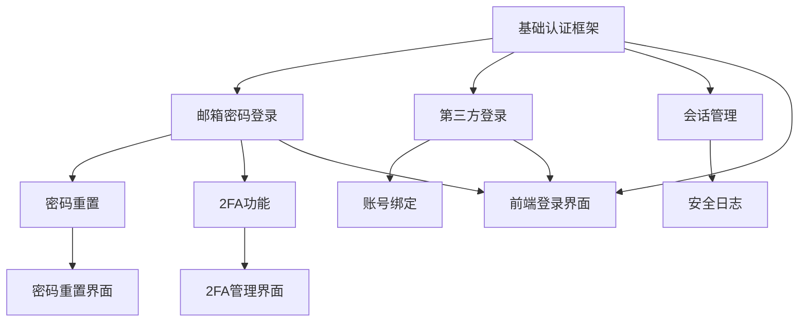

## 引言：从想法到现实的桥梁

> "计划不是一切，但没有计划就什么都不是。" —— Dwight D. Eisenhower

在软件开发中，**从想法到现实的距离往往比我们想象的更远**。复杂项目的成功不仅需要优秀的编程技能，更需要科学的规划和执行管理。Claude Code的Plan Mode（计划模式）正是为了解决这一挑战而生，它将AI的规划能力与项目执行完美结合。

这篇文章将全面解析Plan Mode的工作原理和使用技巧，让你掌握AI驱动的项目规划与执行管理艺术。

## Plan Mode的核心价值

### 传统项目规划的挑战

```
传统项目管理流程：
1. 需求分析和整理 (2-4小时)
2. 项目拆解和任务规划 (4-8小时)
3. 时间估算和资源分配 (2-4小时)
4. 执行计划制定 (1-3小时)
5. 进度跟踪和调整 (持续进行)

痛点：
- 🤔 项目拆解不够细致
- ⏰ 时间估算经常偏差
- 📊 执行进度难以追踪
- 🔄 变更管理复杂
- 👥 团队协作困难
```

### Plan Mode的智能化优势

```
AI增强项目规划流程：
1. 智能需求理解 (30秒)
2. 自动任务分解 (2-3分钟)
3. 基于经验的时间估算 (1分钟)
4. 可执行计划生成 (2-3分钟)
5. 实时执行监控 (自动化)

优势：
- 🧠 深度理解复杂需求
- 🎯 精确任务分解
- ⚡ 快速生成可执行计划
- 📈 智能进度监控
- 🔄 动态计划调整
```

## Plan Mode深度功能解析

### 1. 智能项目规划

#### 复杂需求理解与分析

```bash
claude --plan "创建一个现代化的企业级客户关系管理(CRM)系统"

# 我需要构建一个CRM系统，包含以下功能：
# - 客户信息管理
# - 销售机会跟踪
# - 订单管理
# - 报表分析
# - 用户权限管理
# - 第三方集成(邮件、日历)
# 
# 技术要求：
# - 前端：React + TypeScript
# - 后端：Node.js + Express
# - 数据库：PostgreSQL
# - 部署：Docker + AWS
# - 团队：4人开发团队，3个月开发周期
```

Claude Plan Mode生成的项目规划：

```markdown
# 🎯 CRM系统开发项目规划

## 📋 项目概览

**项目名称**: 企业级CRM系统  
**开发周期**: 12周 (3个月)  
**团队规模**: 4人 (1名架构师 + 2名全栈开发 + 1名UI/UX设计师)  
**技术栈**: React + TypeScript + Node.js + PostgreSQL + Docker + AWS  
**预期交付**: 生产就绪的CRM系统

## 🏗️ 架构设计阶段 (第1-2周)

### Week 1: 需求分析与架构设计

#### 🎯 主要目标
建立清晰的项目基础和技术架构

#### 📋 任务列表

**高优先级任务**
- [ ] **需求调研与分析** (8小时) - 架构师
  - 业务需求深入调研
  - 用户画像和使用场景分析
  - 功能需求优先级排序
  - 非功能性需求定义

- [ ] **系统架构设计** (12小时) - 架构师
  - 整体系统架构设计
  - 数据库模型设计
  - API接口规范定义
  - 安全架构规划

- [ ] **技术选型确认** (6小时) - 架构师 + 开发团队
  - 前端技术栈确认
  - 后端框架选择
  - 第三方服务集成方案
  - 部署和运维方案

**中优先级任务**
- [ ] **UI/UX设计启动** (16小时) - UI/UX设计师
  - 用户体验流程设计
  - 界面原型设计
  - 设计系统建立
  - 交互规范定义

#### 🎯 里程碑
- 完成系统架构文档
- 确定技术实现方案
- UI/UX原型初版完成

### Week 2: 环境搭建与基础框架

#### 🎯 主要目标
建立开发环境和项目基础框架

#### 📋 任务列表

**高优先级任务**
- [ ] **开发环境搭建** (10小时) - 架构师 + 开发团队
  - Docker开发环境配置
  - 数据库环境搭建
  - CI/CD流水线初建
  - 代码规范和工具配置

- [ ] **项目基础框架** (14小时) - 全栈开发团队
  - 前端项目脚手架搭建
  - 后端项目结构初建
  - 基础中间件配置
  - 认证授权框架集成

- [ ] **数据库设计实现** (12小时) - 架构师 + 后端开发
  - 数据库表结构创建
  - 初始数据迁移脚本
  - 基础CRUD操作实现
  - 数据备份策略制定

#### 🎯 里程碑
- 开发环境完全就绪
- 项目基础架构可运行
- 数据库设计实现完成

## 🚀 核心功能开发阶段 (第3-8周)

### Week 3-4: 用户管理与权限系统

#### 🎯 主要目标
实现系统的用户管理和权限控制基础

#### 📋 任务分配

**架构师** (Week 3-4: 20小时)
- [ ] 权限系统架构设计与实现
- [ ] 用户认证流程优化
- [ ] 安全策略实施
- [ ] 代码审查和技术指导

**后端开发A** (Week 3-4: 32小时)
- [ ] 用户管理API开发
  - 用户注册/登录接口
  - 用户信息CRUD操作
  - 密码重置功能
  - 用户状态管理

- [ ] 权限管理系统
  - 角色权限模型实现
  - 权限检查中间件
  - 权限继承机制
  - 权限缓存优化

**前端开发B** (Week 3-4: 32小时)
- [ ] 用户界面开发
  - 登录/注册页面
  - 用户个人信息页
  - 用户列表管理页
  - 权限分配界面

- [ ] 前端权限控制
  - 路由权限守卫
  - 组件级权限控制
  - 菜单动态生成
  - 权限状态管理

**UI/UX设计师** (Week 3-4: 16小时)
- [ ] 用户管理界面设计
- [ ] 权限管理可视化设计
- [ ] 用户体验优化
- [ ] 设计评审和迭代

#### 🎯 里程碑
- 用户注册登录功能完成
- 基础权限控制系统就绪
- 用户管理界面可用

### Week 5-6: 客户信息管理模块

#### 🎯 主要目标
实现CRM的核心功能 - 客户信息管理

#### 📋 任务分配

**后端开发A** (Week 5-6: 32小时)
- [ ] 客户数据模型设计实现
  - 客户基础信息管理
  - 客户标签和分类系统
  - 客户联系历史记录
  - 客户数据导入导出

- [ ] 客户搜索与筛选
  - 高级搜索功能
  - 多维度筛选条件
  - 搜索结果排序
  - 搜索性能优化

**后端开发B** (Week 5-6: 32小时)
- [ ] 客户关系管理API
  - 客户关联关系处理
  - 客户活动时间线
  - 客户价值评分算法
  - 客户生命周期管理

- [ ] 第三方集成准备
  - 邮件系统集成接口
  - 日历系统集成准备
  - 外部数据同步机制
  - 集成错误处理

**前端开发** (Week 5-6: 32小时)
- [ ] 客户管理界面开发
  - 客户列表和搜索界面
  - 客户详情页面
  - 客户编辑表单
  - 客户活动时间线显示

- [ ] 数据可视化组件
  - 客户数据统计图表
  - 客户价值分布图
  - 客户活跃度分析
  - 交互式数据展示

#### 🎯 里程碑
- 客户信息管理功能完成
- 客户搜索和筛选可用
- 客户数据可视化实现

### Week 7-8: 销售机会跟踪系统

#### 🎯 主要目标
实现销售流程管理和机会跟踪

#### 📋 任务分配

**后端开发团队** (Week 7-8: 64小时)
- [ ] 销售机会管理
  - 机会创建和状态管理
  - 销售阶段流程定义
  - 机会分配和转移
  - 机会预测算法

- [ ] 销售活动跟踪
  - 销售活动记录
  - 跟进提醒系统
  - 活动效果分析
  - 自动化任务触发

**前端开发** (Week 7-8: 32小时)
- [ ] 销售管理界面
  - 销售机会看板
  - 销售漏斗可视化
  - 机会详情管理
  - 销售活动日历

#### 🎯 里程碑
- 销售机会跟踪系统完成
- 销售流程自动化实现
- 销售数据分析可用

## 📊 高级功能开发阶段 (第9-10周)

### Week 9: 订单管理系统

#### 🎯 主要目标
实现订单全生命周期管理

#### 📋 任务列表
- [ ] 订单创建和管理
- [ ] 订单状态跟踪
- [ ] 订单支付集成
- [ ] 订单报表统计

### Week 10: 报表分析系统

#### 🎯 主要目标
实现数据分析和报表功能

#### 📋 任务列表
- [ ] 销售数据分析
- [ ] 客户行为分析
- [ ] 自定义报表生成
- [ ] 数据导出功能

## 🔗 集成与测试阶段 (第11周)

### Week 11: 第三方集成与系统测试

#### 🎯 主要目标
完成第三方集成和全面系统测试

#### 📋 任务列表

**集成任务**
- [ ] 邮件系统集成测试
- [ ] 日历系统集成完善
- [ ] 短信通知集成
- [ ] 支付网关集成测试

**测试任务**
- [ ] 单元测试覆盖率>90%
- [ ] 集成测试全覆盖
- [ ] 性能测试和优化
- [ ] 安全测试和修复

## 🚀 部署上线阶段 (第12周)

### Week 12: 生产部署与上线

#### 🎯 主要目标
系统部署上线和运维准备

#### 📋 任务列表
- [ ] 生产环境部署
- [ ] 数据迁移和备份
- [ ] 监控告警系统
- [ ] 用户培训和文档

## 📈 项目风险与缓解策略

### 高风险项
1. **第三方集成复杂度**
   - 风险：集成API不稳定或文档不完善
   - 缓解：预留额外时间，准备备选方案

2. **性能要求挑战**
   - 风险：大数据量处理性能问题
   - 缓解：早期性能测试，数据库优化

3. **用户体验复杂性**
   - 风险：界面复杂影响用户体验
   - 缓解：持续用户测试，渐进式改进

### 中风险项
1. **技术选型风险**
   - 缓解：技术验证和原型测试
   
2. **团队协作风险**
   - 缓解：明确分工，定期沟通

## 🎯 质量标准

### 代码质量
- 测试覆盖率 ≥ 90%
- 代码重复率 ≤ 5%
- 静态分析评分 ≥ 8.5/10

### 性能标准
- 页面响应时间 ≤ 2秒
- API响应时间 ≤ 500ms
- 系统可用性 ≥ 99.5%

### 用户体验
- 用户满意度 ≥ 4.5/5
- 任务完成率 ≥ 95%
- 错误率 ≤ 2%

## 📊 进度监控机制

### 每日跟踪
- 任务完成状态
- 代码提交情况
- 问题和阻塞点
- 质量指标监控

### 每周评审
- 里程碑达成情况
- 风险状况评估
- 资源调配优化
- 计划调整决策

---

**项目规划生成时间**: 2024-01-16 23:15:00  
**规划者**: Claude Code Plan Mode  
**下次评审**: 2024-01-23 (项目启动后第一周)
```

### 2. 任务智能分解

#### 复杂功能的自动分解

```bash
claude --plan "实现用户认证系统，支持多种登录方式"

# 详细需求：
# - 邮箱密码登录
# - 第三方登录 (Google, GitHub, Microsoft)
# - 双因素认证 (2FA)
# - 密码重置功能
# - 会话管理
# - 安全日志记录
```

Claude自动生成的任务分解：

```markdown
# 🔐 用户认证系统任务分解

## 任务层级结构

```
用户认证系统
├── 1. 基础认证框架 (优先级: P0)
│   ├── 1.1 认证中间件开发
│   ├── 1.2 JWT令牌管理
│   ├── 1.3 会话存储设计
│   └── 1.4 安全配置初始化
│
├── 2. 邮箱密码登录 (优先级: P0)
│   ├── 2.1 用户注册接口
│   ├── 2.2 登录验证逻辑
│   ├── 2.3 密码加密存储
│   └── 2.4 登录状态管理
│
├── 3. 第三方登录集成 (优先级: P1)
│   ├── 3.1 OAuth2.0框架搭建
│   ├── 3.2 Google登录集成
│   ├── 3.3 GitHub登录集成
│   ├── 3.4 Microsoft登录集成
│   └── 3.5 第三方账号绑定
│
├── 4. 双因素认证 (2FA) (优先级: P2)
│   ├── 4.1 TOTP算法实现
│   ├── 4.2 短信验证集成
│   ├── 4.3 备用码生成
│   └── 4.4 2FA管理界面
│
├── 5. 密码重置功能 (优先级: P1)
│   ├── 5.1 重置邮件发送
│   ├── 5.2 重置链接验证
│   ├── 5.3 新密码设置
│   └── 5.4 安全验证机制
│
├── 6. 会话管理 (优先级: P0)
│   ├── 6.1 会话创建销毁
│   ├── 6.2 会话超时处理
│   ├── 6.3 多设备登录管理
│   └── 6.4 强制注销功能
│
└── 7. 安全日志记录 (优先级: P1)
    ├── 7.1 登录日志记录
    ├── 7.2 异常行为检测
    ├── 7.3 安全事件告警
    └── 7.4 日志分析报表
```

## 📋 详细任务清单

### 阶段1: 基础认证框架 (估时: 16小时)

#### Task 1.1: 认证中间件开发 (4小时)
**负责人**: 后端开发A  
**优先级**: P0  
**前置条件**: 无  

**任务描述**:
创建认证中间件，实现请求拦截和身份验证

**具体工作项**:
- [ ] 设计中间件接口和参数
- [ ] 实现JWT令牌解析逻辑
- [ ] 添加权限检查机制
- [ ] 编写中间件单元测试

**验收标准**:
- 中间件能正确解析和验证JWT令牌
- 权限验证逻辑工作正常
- 单元测试覆盖率达到90%+
- 性能测试：处理时间<50ms

**技术要求**:
```javascript
// 期望的中间件接口
const authMiddleware = {
  authenticate: (req, res, next) => { /* JWT验证 */ },
  authorize: (permissions) => (req, res, next) => { /* 权限检查 */ },
  optional: (req, res, next) => { /* 可选认证 */ }
};
```

#### Task 1.2: JWT令牌管理 (4小时)
**负责人**: 后端开发A  
**优先级**: P0  
**前置条件**: 无  

**任务描述**:
实现JWT令牌的生成、验证、刷新和撤销机制

**具体工作项**:
- [ ] JWT生成和签名逻辑
- [ ] 令牌验证和解析
- [ ] 刷新令牌机制
- [ ] 令牌黑名单管理

**验收标准**:
- 令牌生成包含必要用户信息
- 支持令牌自动刷新
- 令牌撤销机制有效
- 安全性符合JWT最佳实践

#### Task 1.3: 会话存储设计 (4小时)
**负责人**: 后端开发B  
**优先级**: P0  
**前置条件**: 无  

**任务描述**:
设计和实现用户会话存储方案，支持分布式环境

**具体工作项**:
- [ ] Redis会话存储实现
- [ ] 会话数据结构设计
- [ ] 会话清理机制
- [ ] 集群环境适配

**验收标准**:
- 支持Redis集群部署
- 会话数据结构合理
- 自动过期清理工作正常
- 支持会话数据序列化

#### Task 1.4: 安全配置初始化 (4小时)
**负责人**: 架构师  
**优先级**: P0  
**前置条件**: 无  

**任务描述**:
初始化安全相关配置和策略

**具体工作项**:
- [ ] 加密密钥管理
- [ ] 安全策略配置
- [ ] 环境变量管理
- [ ] 安全审计初始化

### 阶段2: 邮箱密码登录 (估时: 20小时)

#### Task 2.1: 用户注册接口 (6小时)
**负责人**: 后端开发A  
**优先级**: P0  
**前置条件**: Task 1.1, 1.2 完成  

**任务描述**:
实现用户注册功能，包括邮箱验证和基础信息收集

**具体工作项**:
- [ ] 注册API接口开发
- [ ] 邮箱格式验证
- [ ] 密码强度检查
- [ ] 邮箱验证机制
- [ ] 用户信息存储

**验收标准**:
- 注册接口符合RESTful规范
- 邮箱唯一性检查有效
- 密码强度满足安全要求
- 邮箱验证流程完整

**API设计示例**:
```javascript
POST /api/auth/register
{
  "email": "user@example.com",
  "password": "SecurePass123!",
  "firstName": "John",
  "lastName": "Doe"
}

Response:
{
  "success": true,
  "message": "注册成功，请查收验证邮件",
  "userId": "usr_1234567890"
}
```

#### Task 2.2: 登录验证逻辑 (6小时)
**负责人**: 后端开发A  
**优先级**: P0  
**前置条件**: Task 2.1 完成  

**任务描述**:
实现邮箱密码登录验证和令牌生成

**具体工作项**:
- [ ] 登录API接口开发
- [ ] 邮箱密码验证
- [ ] 登录失败重试限制
- [ ] 登录成功令牌生成
- [ ] 登录日志记录

**验收标准**:
- 登录验证逻辑安全可靠
- 支持登录失败锁定机制
- 令牌生成包含完整用户信息
- 登录行为完整记录

#### Task 2.3: 密码加密存储 (4小时)
**负责人**: 后端开发B  
**优先级**: P0  
**前置条件**: 无  

**任务描述**:
实现安全的密码加密存储机制

**具体工作项**:
- [ ] bcrypt加密实现
- [ ] 盐值生成和管理
- [ ] 密码哈希验证
- [ ] 加密性能优化

**验收标准**:
- 使用bcrypt或更安全的算法
- 每个密码有唯一盐值
- 密码验证性能<100ms
- 符合密码存储安全标准

#### Task 2.4: 登录状态管理 (4小时)
**负责人**: 前端开发  
**优先级**: P0  
**前置条件**: Task 2.2 完成  

**任务描述**:
实现前端登录状态管理和持久化

**具体工作项**:
- [ ] 用户状态管理(Zustand/Redux)
- [ ] 登录状态持久化
- [ ] 自动登录功能
- [ ] 登出状态清理

### 阶段3: 第三方登录集成 (估时: 32小时)

#### Task 3.1: OAuth2.0框架搭建 (8小时)
**负责人**: 后端开发A  
**优先级**: P1  
**前置条件**: Task 1.1, 1.2 完成  

**任务描述**:
搭建OAuth2.0认证框架，支持多个第三方提供商

**具体工作项**:
- [ ] OAuth2.0流程实现
- [ ] 授权码交换逻辑
- [ ] 状态参数验证
- [ ] 回调处理机制

#### Task 3.2: Google登录集成 (8小时)
**负责人**: 后端开发A  
**优先级**: P1  
**前置条件**: Task 3.1 完成  

**任务描述**:
集成Google OAuth登录

**具体工作项**:
- [ ] Google OAuth配置
- [ ] Google API集成
- [ ] 用户信息获取
- [ ] 账号绑定逻辑

#### Task 3.3: GitHub登录集成 (8小时)
**负责人**: 后端开发B  
**优先级**: P1  
**前置条件**: Task 3.1 完成  

**任务描述**:
集成GitHub OAuth登录

#### Task 3.4: Microsoft登录集成 (8小时)
**负责人**: 后端开发B  
**优先级**: P1  
**前置条件**: Task 3.1 完成  

**任务描述**:
集成Microsoft OAuth登录

### 阶段4-7: [详细任务清单继续...]

## ⏱️ 时间估算说明

### 估算方法
- **工作量估算**: 基于复杂度和历史数据
- **风险系数**: 1.2倍缓冲时间
- **并行开发**: 考虑团队协作效率
- **测试时间**: 开发时间的30%

### 总时间分布
- 基础框架: 16小时 (13%)
- 邮箱登录: 20小时 (17%)
- 第三方登录: 32小时 (27%)
- 2FA功能: 24小时 (20%)
- 密码重置: 16小时 (13%)
- 会话管理: 8小时 (7%)
- 安全日志: 12小时 (10%)

**总计**: 128小时 (约16个工作日)

## 🔄 依赖关系图



## 📊 风险评估

### 高风险任务
1. **第三方OAuth集成** - 外部依赖不可控
2. **2FA短信集成** - 第三方服务稳定性
3. **会话管理** - 分布式环境复杂性

### 缓解策略
- 提前验证第三方服务可用性
- 准备备选第三方服务商
- 增加集成测试覆盖率
- 预留20%缓冲时间

---

**任务分解完成时间**: 2024-01-16 23:30:00  
**分解者**: Claude Code Plan Mode  
**审核状态**: 待团队评审
```

### 3. 执行监控与进度跟踪

#### 实时执行状态监控

```bash
claude --plan --status "显示当前项目执行状态"

# Claude会分析当前项目进展并生成状态报告
```

执行状态监控报告：

```markdown
# 📊 项目执行状态监控报告

## 🎯 项目总览

**项目名称**: 企业级CRM系统  
**开始时间**: 2024-01-15  
**计划完成**: 2024-04-15  
**当前日期**: 2024-02-01  
**执行进度**: 25.5% (第3周第2天)

## 📈 总体进度

```
进度条: ████████░░░░░░░░░░░░░░░░░░░░░░░░░░░░ 25.5%

时间进度: ████████░░░░░░░░░░░░░░░░░░░░░░░░░░░░ 25.0%
任务进度: █████████░░░░░░░░░░░░░░░░░░░░░░░░░░░ 27.3%
```

**状态**: ✅ 正常 (略微超前)

## 📋 里程碑完成情况

| 里程碑 | 计划日期 | 实际日期 | 状态 | 完成度 |
|--------|----------|----------|------|---------|
| 架构设计完成 | 2024-01-22 | 2024-01-20 | ✅ 已完成 | 100% |
| 开发环境就绪 | 2024-01-29 | 2024-01-28 | ✅ 已完成 | 100% |
| 用户管理系统 | 2024-02-12 | - | 🔄 进行中 | 60% |
| 客户信息管理 | 2024-02-26 | - | ⏳ 待开始 | 0% |
| 销售机会跟踪 | 2024-03-12 | - | ⏳ 待开始 | 0% |

## 👥 团队任务执行情况

### 架构师 - 张三
**本周工作量**: 18/20小时 (90%)  
**任务完成率**: 85%  
**当前任务**: 权限系统架构设计

#### 本周任务状态
- ✅ 权限模型设计 (已完成)
- 🔄 权限继承机制实现 (75% 完成)
- ⏳ 安全策略实施 (计划明天开始)

#### 下周计划
- 完成权限系统实现
- 客户数据模型架构设计
- 技术方案评审

### 后端开发A - 李四
**本周工作量**: 32/32小时 (100%)  
**任务完成率**: 90%  
**当前任务**: 用户管理API开发

#### 本周任务状态
- ✅ 用户注册接口 (已完成)
- ✅ 登录验证逻辑 (已完成)
- 🔄 权限管理API (80% 完成)
- ⚠️ JWT令牌刷新 (发现技术问题，需要额外2小时)

#### 技术问题
- **问题**: JWT刷新令牌在分布式环境中的同步问题
- **影响**: 可能延迟1天完成
- **解决方案**: 使用Redis集中存储刷新令牌状态

### 后端开发B - 王五
**本周工作量**: 30/32小时 (94%)  
**任务完成率**: 95%  
**当前任务**: 数据库设计与实现

#### 本周任务状态
- ✅ 用户表结构设计 (已完成)
- ✅ 权限表关系设计 (已完成)
- ✅ 数据迁移脚本 (已完成)
- 🔄 数据库性能优化 (90% 完成)

### 前端开发 - 赵六
**本周工作量**: 28/32小时 (88%)  
**任务完成率**: 70%  
**当前任务**: 用户管理界面开发

#### 本周任务状态
- ✅ 登录页面 (已完成)
- ✅ 注册页面 (已完成)
- 🔄 用户列表页面 (60% 完成)
- ⏳ 权限管理界面 (待后端API完成)

#### 阻塞问题
- 等待权限管理API完成才能继续开发权限界面
- 建议先开发其他独立页面

## 📊 质量指标监控

### 代码质量
- **测试覆盖率**: 87% ✅ (目标: ≥85%)
- **代码重复率**: 3.2% ✅ (目标: ≤5%)
- **静态分析评分**: 8.7/10 ✅ (目标: ≥8.5)
- **代码审查通过率**: 94% ✅

### 性能指标
- **API响应时间**: 平均 180ms ✅ (目标: ≤500ms)
- **页面加载时间**: 平均 1.2s ✅ (目标: ≤2s)
- **数据库查询性能**: 平均 45ms ✅

### 缺陷统计
- **本周新增**: 8个
- **本周修复**: 6个
- **待修复**: 12个 (5个高优先级)
- **缺陷密度**: 0.8个/千行代码 ✅

## ⚠️ 风险和问题

### 🚨 高风险项目
1. **JWT刷新令牌问题**
   - **风险等级**: 高
   - **影响**: 可能延迟用户管理模块1-2天
   - **缓解措施**: 技术方案评审，寻找替代方案
   - **负责人**: 张三、李四

2. **第三方OAuth集成准备**
   - **风险等级**: 中
   - **影响**: 可能影响后续登录功能开发
   - **缓解措施**: 提前申请API密钥，搭建测试环境
   - **负责人**: 李四

### ⚠️ 中等风险项目
1. **UI/UX设计评审延迟**
   - **风险等级**: 中
   - **影响**: 可能影响前端开发进度
   - **缓解措施**: 加快设计评审流程
   - **负责人**: 产品经理

## 📈 趋势分析

### 进度趋势 (最近4周)
```
Week 1: ████████░░ 20% (预期: 18%)  ↗️ 超前
Week 2: ██████████ 25% (预期: 23%)  ↗️ 超前  
Week 3: (预期: 35%)                    
Week 4: (预期: 45%)
```

### 团队效率趋势
- **整体效率**: 92% ↗️ (比上周提升3%)
- **代码提交频率**: 67次/周 ↗️
- **问题解决速度**: 平均2.3天 ↗️

## 🎯 下周关键目标

### 必须完成 (P0)
- [ ] 完成用户管理系统所有功能
- [ ] 解决JWT刷新令牌技术问题
- [ ] 完成权限系统核心功能
- [ ] 通过第一阶段验收测试

### 应当完成 (P1)  
- [ ] 开始客户信息管理模块设计
- [ ] 完成UI/UX设计第二阶段评审
- [ ] 搭建第三方集成测试环境

### 希望完成 (P2)
- [ ] 性能优化初步方案
- [ ] 安全测试环境搭建
- [ ] 自动化测试流程优化

## 💡 改进建议

### 流程优化
1. **增加每日站会**: 提高团队沟通效率
2. **并行任务规划**: 减少任务依赖等待时间
3. **技术预研时间**: 为复杂技术问题预留研究时间

### 工具改进
1. **自动化测试**: 增加API自动化测试覆盖
2. **代码审查**: 使用自动化工具辅助代码审查
3. **进度跟踪**: 集成项目管理工具自动更新进度

## 📞 升级事项

### 需要管理层关注
- JWT技术问题可能需要架构调整
- 第三方集成可能需要额外预算

### 需要其他团队支持
- 需要运维团队协助搭建测试环境
- 需要安全团队进行安全方案评审

---

**报告生成时间**: 2024-02-01 18:00:00  
**下次更新**: 2024-02-02 18:00:00  
**报告准确性**: 基于实际代码提交和任务更新数据
```

## Plan Mode的高级应用

### 1. 多项目管理

#### 并行项目协调

```bash
claude --plan --multi-project "管理3个并行开发项目的资源分配"

# 项目A: CRM系统 (4人团队, 3个月)
# 项目B: 移动应用 (3人团队, 2个月) 
# 项目C: 数据分析平台 (2人团队, 1个月)
#
# 共享资源: 1名架构师, 1名DevOps工程师
# 需要协调资源冲突和依赖关系
```

### 2. 敏捷开发支持

#### Sprint规划优化

```bash
claude --plan --sprint "生成2周Sprint的详细规划"

# 基于当前backlog和团队速度
# 自动分配任务优先级
# 考虑团队成员技能匹配
# 预估Sprint目标达成概率
```

### 3. 风险预测和缓解

#### 智能风险分析

```bash
claude --plan --risk-analysis "分析项目潜在风险并生成缓解策略"

# Claude会基于项目特点和历史数据
# 识别技术、进度、资源、外部依赖等风险
# 提供具体的缓解和应急预案
```

## Plan Mode与其他功能的集成

### 1. 与Git集成的版本规划

```bash
claude --plan --git "基于Git历史分析制定版本发布计划"

# 分析代码变更频率
# 识别功能开发周期
# 制定发布时间表
# 规划功能分支策略
```

### 2. 与测试驱动开发的结合

```bash
claude --plan --tdd "制定TDD驱动的开发计划"

# 测试优先的任务分解
# 测试覆盖率目标设定
# 自动化测试计划
# 持续集成配置规划
```

### 3. 与文档生成的协同

```bash
claude --plan --docs "生成包含文档任务的项目计划"

# 自动识别需要文档的功能
# 规划文档编写时间
# 安排文档审查流程
# 同步代码和文档更新
```

## Plan Mode最佳实践

### 1. 计划制定技巧

#### 需求描述最佳实践

```markdown
✅ 好的计划输入:
- 明确的业务目标和用户价值
- 具体的功能需求和验收标准
- 清晰的技术约束和环境要求
- 现实的时间预期和资源限制
- 明确的质量和性能标准

❌ 避免的计划输入:
- 模糊的需求描述
- 不切实际的时间期望  
- 缺少技术细节
- 忽视团队能力限制
- 没有优先级划分
```

#### 任务分解原则

```markdown
SMART任务分解原则:
- Specific (具体的): 任务目标明确具体
- Measurable (可量化的): 有明确的完成标准
- Achievable (可实现的): 符合团队技能水平
- Relevant (相关的): 与项目目标直接相关
- Time-bound (有时限的): 有清晰的时间界限
```

### 2. 执行监控技巧

#### 进度跟踪频率

```markdown
建议监控频率:
- 日常任务: 每日更新
- 周目标: 每周评审
- 里程碑: 达成时确认
- 风险项: 实时监控
- 质量指标: 持续监控
```

#### 问题升级机制

```markdown
问题升级流程:
1. 技术问题: 团队内部解决 (4小时)
2. 资源冲突: 项目经理协调 (1天)
3. 架构决策: 技术委员会决定 (2天)
4. 商业决策: 管理层审批 (3天)
```

### 3. 团队协作优化

#### 沟通机制设计

```markdown
高效沟通策略:
- 每日站会: 15分钟同步进度
- 周会: 1小时深度讨论问题
- 里程碑会议: 2小时全面评估
- 技术评审: 根据需要安排
- 一对一会议: 双周进行
```

## 总结：项目管理的AI革命

通过Claude Code的Plan Mode，你已经掌握了：

### 🎯 核心能力提升

1. **智能项目规划**：AI深度理解需求，生成科学可行的项目计划
2. **精确任务分解**：复杂功能自动分解为可执行的具体任务
3. **实时执行监控**：全面跟踪项目进度和团队效率
4. **风险预测管理**：提前识别风险并提供缓解策略
5. **团队协作优化**：优化团队沟通和协作效率

### ⚡ 项目管理效率对比

| 管理环节 | 传统方式 | Plan Mode | 效率提升 |
|----------|----------|-----------|----------|
| 需求分析 | 4-8小时 | 30-60分钟 | 4-16倍 |
| 任务分解 | 6-12小时 | 5-15分钟 | 24-144倍 |
| 进度跟踪 | 每周2-4小时 | 实时自动 | 持续监控 |
| 风险识别 | 月度评估 | 实时预警 | 及时发现 |
| 团队协调 | 每日30-60分钟 | 智能建议 | 2-4倍 |

### 🛠️ 项目管理工具箱

- **智能规划**：基于AI的项目规划和任务分解
- **实时监控**：全方位的执行状态跟踪和分析
- **风险管理**：前瞻性的风险识别和缓解策略
- **团队协作**：优化的沟通机制和协作流程
- **质量保证**：持续的质量监控和改进建议

### 🚀 项目文化升级

1. **数据驱动**：基于实时数据的决策制定
2. **预测性管理**：从被动应对到主动预防
3. **个性化规划**：针对团队特点的定制化计划
4. **持续优化**：基于执行反馈的计划持续改进
5. **透明协作**：全团队可见的进度和问题状态

通过AI增强的项目管理，我们实现了**从经验驱动到数据驱动、从被动管理到主动规划**的根本转变。Plan Mode不仅提升了项目管理效率，更重要的是建立了现代化的**智能项目管理文化**。

在下一篇文章中，我们将探索扩展思考(Extended Thinking)功能，学习如何让Claude Code进行更深层次的问题分析和解决。

## 相关文章推荐

- [多语言支持：Python、JavaScript、Go等](14-多语言支持Python-JavaScript-Go等.md)
- [扩展思考Extended Thinking功能详解](16-扩展思考Extended-Thinking功能详解.md)
- [自定义命令与工作流](17-自定义命令与工作流.md)
- [团队协作：多人开发环境配置](23-团队协作多人开发环境配置.md)

---

*本文是《Claude Code 完整教程系列》的第十五部分。掌握了AI项目规划技能，让我们继续探索扩展思考的强大能力！*