## 引言：思考的艺术与科学

> "思考是人类最高贵的活动，深度思考则是解决复杂问题的关键。" —— Einstein

在软件开发的世界里，**最复杂的挑战往往不是编写代码本身，而是如何分析问题、设计解决方案、权衡各种选择**。Claude Code的Extended Thinking（扩展思考）功能正是为了应对这一挑战而生，它让AI能够进行深层次的分析、推理和决策支持。

这篇文章将全面解析Extended Thinking的工作机制和应用技巧，让你学会如何利用AI进行深度思考和复杂问题解决。

## Extended Thinking的核心价值

### 传统问题解决的局限

```
传统问题分析流程：
1. 表面问题识别 (30分钟)
2. 简单方案设计 (1-2小时)
3. 单一视角评估 (30分钟)
4. 快速实施决定 (即时)

局限性：
- 🔍 分析深度不够
- 🤔 缺乏多角度思考
- ⚠️ 忽视潜在风险
- 📊 决策依据不充分
- 🔄 缺少反思机制
```

### Extended Thinking的智能优势

```
AI增强思考流程：
1. 多层次问题分析 (深入本质)
2. 多角度方案探索 (全面考虑)
3. 系统性影响评估 (综合权衡)
4. 基于证据的决策 (理性选择)
5. 持续反思优化 (动态调整)

优势：
- 🧠 深度分析问题本质
- 🔍 多维度综合考虑
- 📈 系统性影响评估
- 💡 创新解决方案
- 🔄 持续思考优化
```

## Extended Thinking功能深度解析

### 1. 复杂问题的多层次分析

#### 问题本质探索

```bash
claude --extended-thinking "我们的Web应用在高并发情况下经常出现响应缓慢的问题"

# 启动扩展思考模式，深入分析问题
```

Claude的扩展思考过程：

```markdown
# 🧠 扩展思考：Web应用高并发性能问题分析

## 🎯 思考启动

**问题表述**: Web应用在高并发情况下响应缓慢
**思考目标**: 深入分析根本原因，制定系统性解决方案
**思考角度**: 技术架构、系统设计、业务场景、用户体验

---

## 📊 第一层分析：问题现象梳理

### 当前已知信息
- 问题触发条件：高并发场景
- 表现症状：响应时间增长
- 影响范围：整个Web应用

### 需要补充的关键信息 🤔
让我思考一下还需要了解什么...

1. **具体性能指标**
   - 正常情况下的响应时间是多少？
   - 高并发时的具体响应时间？
   - 并发用户数量阈值？
   - 错误率变化情况？

2. **系统架构特征**
   - 当前技术栈是什么？
   - 是否使用了负载均衡？
   - 数据库类型和配置？
   - 缓存策略如何？

3. **业务场景特点**
   - 高并发场景的具体特征？
   - 是否有特定的业务操作造成瓶颈？
   - 用户行为模式如何？

---

## 🔍 第二层分析：潜在原因推理

基于常见的Web性能问题，让我系统性地分析可能的根本原因...

### A. 数据库层面问题 (概率: 40%)

#### 可能原因分析
1. **SQL查询效率问题**
   - 缺少必要的数据库索引
   - SQL查询语句未优化
   - 存在N+1查询问题
   - 复杂关联查询过多

2. **数据库连接管理**
   - 数据库连接池配置不当
   - 连接数超过数据库限制
   - 连接泄漏问题
   - 长时间持有连接

3. **数据库锁竞争**
   - 表级锁或行级锁竞争激烈
   - 事务时间过长
   - 死锁频繁发生

#### 推理依据
- 高并发通常会放大数据库性能问题
- 数据库往往是系统性能瓶颈
- 数据库优化通常能带来显著改善

### B. 应用服务器问题 (概率: 30%)

#### 可能原因分析
1. **资源竞争问题**
   - CPU使用率过高
   - 内存不足或内存泄漏
   - 磁盘I/O瓶颈
   - 网络带宽限制

2. **并发处理机制**
   - 线程池配置不当
   - 同步代码块造成阻塞
   - 全局状态竞争
   - GC(垃圾回收)压力大

3. **应用架构问题**
   - 单体架构缺乏水平扩展
   - 服务间同步调用过多
   - 缺乏有效的负载均衡

#### 推理依据
- 应用服务器直接处理用户请求
- 并发处理能力直接影响响应时间
- 资源管理是高并发的关键

### C. 网络和基础设施问题 (概率: 20%)

#### 可能原因分析
1. **网络层面**
   - 网络带宽不足
   - 网络延迟增加
   - DNS解析时间长
   - CDN配置问题

2. **负载均衡问题**
   - 负载均衡策略不当
   - 健康检查配置问题
   - 后端服务器能力不均

3. **基础设施限制**
   - 服务器硬件配置不足
   - 云服务实例规格限制
   - 存储I/O性能瓶颈

### D. 前端和客户端问题 (概率: 10%)

#### 可能原因分析
1. **前端性能**
   - JavaScript执行效率低
   - DOM操作过于频繁
   - 大量同步请求
   - 资源加载优化不当

2. **缓存策略**
   - 静态资源缓存策略不当
   - API响应缓存缺失
   - 浏览器缓存配置问题

---

## 🎯 第三层分析：系统性影响评估

让我从更宏观的角度思考这个问题的影响...

### 业务影响分析

#### 直接影响
- **用户体验下降**: 响应缓慢导致用户不满
- **转化率下降**: 页面加载慢影响业务转化
- **用户流失风险**: 长期性能问题可能导致用户流失

#### 间接影响
- **技术债务积累**: 性能问题可能掩盖其他技术问题
- **运维成本增加**: 需要更多监控和应急处理
- **团队压力**: 开发团队需要投入更多精力解决问题

### 解决方案的约束条件

#### 技术约束
- 现有技术栈的兼容性
- 团队技术能力限制
- 系统稳定性要求
- 数据一致性保证

#### 业务约束
- 开发时间限制
- 预算成本考虑
- 业务连续性要求
- 用户影响最小化

#### 组织约束
- 团队资源分配
- 项目优先级平衡
- 决策审批流程
- 跨团队协调成本

---

## 💡 第四层分析：解决方案设计思考

基于前面的深度分析，让我设计一个系统性的解决方案...

### 方案设计原则

#### 1. 分层优化策略
按照影响程度和实施难度，分层次解决问题

#### 2. 快速胜利优先
优先实施能快速见效的改进措施

#### 3. 长期架构考虑
在解决当前问题的同时，考虑长期架构演进

#### 4. 风险最小化
确保优化过程不影响系统稳定性

### A. 短期优化方案 (1-2周实施)

#### 数据库优化 (最高优先级)
1. **索引优化**
   ```sql
   -- 分析慢查询日志
   SHOW PROCESSLIST;
   EXPLAIN ANALYZE SELECT ...;
   
   -- 添加缺失的索引
   CREATE INDEX idx_user_created_at ON users(created_at);
   CREATE INDEX idx_order_status ON orders(status, created_at);
   ```

2. **查询优化**
   - 识别和优化慢查询
   - 解决N+1查询问题
   - 优化复杂关联查询
   - 实施查询结果缓存

3. **连接池调优**
   ```javascript
   // 数据库连接池配置优化
   const pool = new Pool({
     max: 20,          // 最大连接数
     min: 5,           // 最小连接数
     acquireTimeout: 60000,
     idleTimeout: 30000
   });
   ```

#### 应用层优化
1. **缓存策略增强**
   ```javascript
   // Redis缓存实施
   const Redis = require('redis');
   const client = Redis.createClient();
   
   // 热点数据缓存
   async function getCachedData(key) {
     let data = await client.get(key);
     if (!data) {
       data = await fetchFromDatabase(key);
       await client.setex(key, 300, JSON.stringify(data)); // 5分钟缓存
     }
     return JSON.parse(data);
   }
   ```

2. **异步处理优化**
   ```javascript
   // 异步任务队列
   const Queue = require('bull');
   const emailQueue = new Queue('email processing');
   
   // 将耗时操作移至后台处理
   app.post('/send-notification', async (req, res) => {
     await emailQueue.add('send', req.body);
     res.json({ status: 'queued' });
   });
   ```

### B. 中期架构优化 (1-2个月)

#### 微服务拆分
1. **服务识别和拆分**
   - 按业务域拆分服务
   - 识别高并发核心服务
   - 实施服务间异步通信

2. **负载均衡增强**
   ```nginx
   upstream app_servers {
     server app1.example.com weight=3;
     server app2.example.com weight=3;
     server app3.example.com weight=2;
   }
   
   server {
     location / {
       proxy_pass http://app_servers;
       proxy_set_header Host $host;
     }
   }
   ```

#### 数据层优化
1. **读写分离**
   - 主从数据库配置
   - 读操作路由到从库
   - 写操作保持主库

2. **数据分片策略**
   - 水平分片热点数据
   - 垂直分片业务数据
   - 实施分布式事务管理

### C. 长期架构演进 (3-6个月)

#### 云原生架构
1. **容器化部署**
   ```dockerfile
   FROM node:16-alpine
   WORKDIR /app
   COPY package*.json ./
   RUN npm ci --only=production
   COPY . .
   EXPOSE 3000
   CMD ["node", "server.js"]
   ```

2. **自动扩展机制**
   ```yaml
   apiVersion: autoscaling/v2
   kind: HorizontalPodAutoscaler
   metadata:
     name: app-hpa
   spec:
     scaleTargetRef:
       apiVersion: apps/v1
       kind: Deployment
       name: app-deployment
     minReplicas: 2
     maxReplicas: 20
     metrics:
     - type: Resource
       resource:
         name: cpu
         target:
           type: Utilization
           averageUtilization: 70
   ```

---

## 📈 第五层分析：实施风险评估

让我评估各种解决方案的风险和收益...

### 风险矩阵分析

| 解决方案 | 实施难度 | 风险等级 | 预期收益 | 实施时间 | 推荐指数 |
|----------|----------|----------|----------|----------|----------|
| 数据库索引优化 | 低 | 低 | 高 | 1-2天 | ⭐⭐⭐⭐⭐ |
| 缓存策略实施 | 中 | 低 | 高 | 1周 | ⭐⭐⭐⭐⭐ |
| 连接池调优 | 低 | 低 | 中 | 1天 | ⭐⭐⭐⭐ |
| 微服务拆分 | 高 | 高 | 高 | 2个月 | ⭐⭐⭐ |
| 读写分离 | 中 | 中 | 中 | 2周 | ⭐⭐⭐⭐ |
| 云原生架构 | 高 | 中 | 高 | 3-6个月 | ⭐⭐⭐ |

### 关键成功因素
1. **监控先行**: 建立完善的性能监控体系
2. **渐进实施**: 避免大规模系统变更的风险
3. **充分测试**: 每个优化都要经过充分测试
4. **回滚计划**: 为每个变更准备回滚方案

---

## 🎯 第六层分析：决策建议

基于深度分析，我的最终建议是...

### 立即执行 (本周内)
1. **启用数据库慢查询日志监控**
2. **分析当前系统瓶颈点**
3. **实施关键查询的索引优化**
4. **配置应用层缓存机制**

### 短期计划 (2-4周)
1. **完成数据库连接池调优**
2. **实施Redis分布式缓存**
3. **优化数据库查询语句**
4. **增强负载均衡配置**

### 中期规划 (2-3个月)
1. **评估微服务拆分可行性**
2. **实施数据库读写分离**
3. **建立完整的性能监控体系**
4. **制定容量规划策略**

### 长期愿景 (6个月+)
1. **云原生架构转型**
2. **自动化运维体系**
3. **智能扩缩容机制**
4. **全链路性能优化**

---

## 🔍 思考总结与反思

通过这次扩展思考，我发现...

### 问题的复杂性
这个看似简单的"响应缓慢"问题，实际上涉及到系统架构的多个层面，需要系统性的分析和解决。

### 解决方案的权衡
不同的解决方案在成本、风险、收益方面存在显著差异，需要基于实际情况做出明智选择。

### 持续优化的重要性
性能优化不是一次性工程，需要建立持续监控和优化的机制。

### 下一步思考方向
1. 如何建立更有效的性能监控体系？
2. 如何在保证稳定性的前提下进行架构演进？
3. 如何平衡短期修复和长期架构优化？

---

**扩展思考完成时间**: 2024-01-17 00:30:00  
**思考深度等级**: Level 6 (深度系统分析)  
**建议置信度**: 85% (基于常见架构模式和最佳实践)
```

### 2. 创新方案探索

#### 跳出传统思维框架

```bash
claude --extended-thinking "如何设计一个能够自适应不同编程语言和框架的通用代码审查系统？"

# 挑战传统的单一语言代码审查工具
# 探索跨语言、跨框架的通用解决方案
```

Claude的创新思维过程：

```markdown
# 🚀 创新探索：通用代码审查系统设计思考

## 🧠 创新思维启动

**挑战**: 传统代码审查工具局限于特定语言和框架
**目标**: 设计通用的、自适应的代码审查系统
**创新角度**: 技术架构、用户体验、AI应用、生态系统

---

## 💡 第一层思考：突破传统限制

### 传统代码审查工具的局限性分析

#### 语言特化问题
- SonarQube: 虽支持多语言，但规则引擎相对固化
- ESLint: JavaScript专用，配置复杂
- RuboCop: Ruby专用，不支持其他语言
- PMD: Java专用，规则集有限

#### 框架依赖问题
- 不同框架有不同的最佳实践
- 规则配置需要大量人工定制
- 跨框架项目难以统一审查标准
- 新框架出现时适配困难

#### 团队协作问题
- 多语言团队需要掌握多套工具
- 审查标准不统一
- 学习成本高
- 维护成本大

### 突破性思考方向

让我跳出传统思维，思考全新的解决方案...

---

## 🔍 第二层思考：核心技术创新

### A. 语言无关的抽象语法树(AST)分析

#### 创新理念
不再依赖特定语言的解析器，而是构建一个通用的代码语义理解层

#### 技术实现思路

```mermaid
graph TD
    A[源代码] --> B[语言检测器]
    B --> C[通用AST转换器]
    C --> D[语义分析引擎]
    D --> E[通用规则引擎]
    E --> F[审查报告生成器]
```


#### 核心技术组件

1. **智能语言检测**
```python
class LanguageDetector:
    def detect(self, code_content, file_extension, context):
        """
        基于多种信息源进行语言检测：
        - 文件扩展名
        - 语法特征
        - 导入语句模式
        - 上下文信息
        """
        confidence_scores = {}
        
        # 扩展名匹配
        ext_score = self._analyze_extension(file_extension)
        
        # 语法模式匹配
        syntax_score = self._analyze_syntax_patterns(code_content)
        
        # 关键字和库导入分析
        import_score = self._analyze_imports(code_content)
        
        # 项目上下文分析
        context_score = self._analyze_project_context(context)
        
        return self._combine_scores(ext_score, syntax_score, import_score, context_score)
```

2. **通用AST抽象层**
```typescript
interface UniversalASTNode {
  type: 'function' | 'class' | 'variable' | 'import' | 'expression' | 'statement';
  id: string;
  name?: string;
  children: UniversalASTNode[];
  metadata: {
    language: string;
    startLine: number;
    endLine: number;
    complexity?: number;
    dependencies?: string[];
    annotations?: any[];
  };
  semantics: {
    intent: string;        // 代码意图
    patterns: string[];    // 设计模式
    risks: string[];       // 潜在风险
    suggestions: string[]; // 优化建议
  };
}

class UniversalASTConverter {
  convert(sourceCode: string, language: string): UniversalASTNode {
    const parser = this.getParser(language);
    const nativeAST = parser.parse(sourceCode);
    return this.transformToUniversalAST(nativeAST, language);
  }
  
  private transformToUniversalAST(nativeAST: any, language: string): UniversalASTNode {
    // 将各种语言的AST转换为通用格式
    // 保留语义信息，抽象语法差异
  }
}
```

### B. AI驱动的智能规则学习

#### 创新理念
不再依赖预定义规则，而是通过AI学习最佳实践和代码模式

#### 智能学习机制
```python
class IntelligentRuleEngine:
    def __init__(self):
        self.pattern_learner = CodePatternLearner()
        self.best_practice_db = BestPracticeDatabase()
        self.rule_generator = DynamicRuleGenerator()
    
    def learn_from_codebase(self, codebase_path, quality_metrics):
        """从高质量代码库中学习模式"""
        
        # 1. 代码模式提取
        patterns = self.pattern_learner.extract_patterns(codebase_path)
        
        # 2. 质量关联分析
        quality_patterns = self.analyze_quality_correlation(patterns, quality_metrics)
        
        # 3. 最佳实践推导
        best_practices = self.derive_best_practices(quality_patterns)
        
        # 4. 动态规则生成
        rules = self.rule_generator.generate_rules(best_practices)
        
        return rules
    
    def adapt_to_project(self, project_context, team_preferences):
        """根据项目特点自适应规则"""
        
        # 分析项目特征
        project_features = self.analyze_project_features(project_context)
        
        # 结合团队偏好
        customized_rules = self.customize_rules(project_features, team_preferences)
        
        return customized_rules
```

### C. 跨语言设计模式识别

#### 创新理念
识别和评估跨语言的通用设计模式和反模式

#### 模式识别引擎
```typescript
class CrossLanguagePatternRecognizer {
  private patterns = new Map<string, PatternDefinition>();
  
  constructor() {
    this.initializeUniversalPatterns();
  }
  
  recognizePatterns(ast: UniversalASTNode): PatternMatch[] {
    const matches: PatternMatch[] = [];
    
    for (const [name, pattern] of this.patterns) {
      const match = this.matchPattern(ast, pattern);
      if (match.confidence > 0.8) {
        matches.push({
          patternName: name,
          location: match.location,
          quality: this.evaluatePatternQuality(match),
          suggestions: this.generateSuggestions(match)
        });
      }
    }
    
    return matches;
  }
  
  private initializeUniversalPatterns() {
    // 单例模式 - 跨语言通用
    this.patterns.set('singleton', {
      description: '单例模式',
      semanticSignature: [
        'private constructor',
        'static instance method',
        'global state management'
      ],
      antiPatterns: [
        'multiple instance creation',
        'thread safety issues',
        'testing difficulties'
      ],
      languages: ['java', 'javascript', 'python', 'csharp', 'go']
    });
    
    // 观察者模式 - 跨语言通用
    this.patterns.set('observer', {
      description: '观察者模式',
      semanticSignature: [
        'event subscription mechanism',
        'notification system',
        'loose coupling design'
      ],
      bestPractices: [
        'weak references to avoid memory leaks',
        'exception handling in notifications',
        'async notification support'
      ]
    });
  }
}
```

---

## 🎯 第三层思考：用户体验革新

### A. 智能配置系统

#### 零配置启动
```yaml
# smart-review.yml - 智能配置文件
auto_detect: true
languages: ['auto']  # 自动检测项目中的所有语言
frameworks: ['auto'] # 自动识别使用的框架

intelligence:
  learning_mode: true           # 启用智能学习
  adapt_to_team: true          # 适应团队习惯
  context_awareness: true       # 上下文感知
  
quality_goals:
  maintainability: high
  performance: medium
  security: high
  readability: high

team_profile:
  experience_level: mixed      # 团队经验水平
  coding_style: flexible      # 编码风格偏好
  review_strictness: moderate  # 审查严格程度
```

### B. 智能审查报告

#### 上下文感知的建议系统
```typescript
interface IntelligentSuggestion {
  issue: {
    type: 'bug' | 'vulnerability' | 'code-smell' | 'performance';
    severity: 'critical' | 'major' | 'minor' | 'info';
    description: string;
    location: CodeLocation;
  };
  
  context: {
    projectType: string;
    frameworkContext: string[];
    teamExperience: 'junior' | 'mixed' | 'senior';
    businessCriticality: 'low' | 'medium' | 'high';
  };
  
  suggestions: {
    primary: {
      description: string;
      codeExample: string;
      reasoning: string;
      effort: 'low' | 'medium' | 'high';
    };
    alternatives: Array<{
      description: string;
      codeExample: string;
      tradeoffs: string[];
    }>;
  };
  
  learning: {
    patternName: string;
    references: string[];
    relatedIssues: string[];
    teamPreviousDecisions: any[];
  };
}

class IntelligentReportGenerator {
  generateSuggestion(issue: CodeIssue, context: ProjectContext): IntelligentSuggestion {
    // 基于上下文生成智能建议
    const contextualSuggestion = this.contextAnalyzer.analyze(issue, context);
    
    // 学习团队历史决策
    const teamPreferences = this.teamLearner.getPreferences(context.teamId);
    
    // 生成个性化建议
    return this.suggestionEngine.generate(contextualSuggestion, teamPreferences);
  }
}
```

---

## 🚀 第四层思考：生态系统创新

### A. 插件化架构设计

#### 开放式规则生态系统
```typescript
interface ReviewPlugin {
  name: string;
  version: string;
  supportedLanguages: string[];
  supportedFrameworks: string[];
  
  initialize(config: PluginConfig): Promise<void>;
  analyze(ast: UniversalASTNode): Promise<ReviewResult[]>;
  cleanup(): Promise<void>;
}

class PluginEcosystem {
  private plugins = new Map<string, ReviewPlugin>();
  private marketplace = new PluginMarketplace();
  
  async installPlugin(pluginName: string, version?: string) {
    const plugin = await this.marketplace.download(pluginName, version);
    const validated = await this.validatePlugin(plugin);
    
    if (validated.safe) {
      this.plugins.set(pluginName, plugin);
      await plugin.initialize(this.getPluginConfig(pluginName));
    }
  }
  
  async analyzeWithPlugins(code: string, language: string): Promise<ReviewResult> {
    const applicablePlugins = this.getApplicablePlugins(language);
    const ast = this.astConverter.convert(code, language);
    
    const results = await Promise.all(
      applicablePlugins.map(plugin => plugin.analyze(ast))
    );
    
    return this.aggregateResults(results);
  }
}
```

### B. 社区驱动的知识共享

#### 知识图谱构建
```python
class CodeKnowledgeGraph:
    def __init__(self):
        self.graph = NetworkGraph()
        self.pattern_db = PatternDatabase()
        self.community_insights = CommunityInsights()
    
    def build_knowledge_graph(self):
        """构建代码知识图谱"""
        
        # 1. 从开源项目中提取模式
        patterns = self.extract_patterns_from_github()
        
        # 2. 分析模式之间的关系
        relationships = self.analyze_pattern_relationships(patterns)
        
        # 3. 整合社区最佳实践
        best_practices = self.community_insights.get_best_practices()
        
        # 4. 构建知识图谱
        self.graph.build(patterns, relationships, best_practices)
    
    def get_contextual_advice(self, code_context, user_profile):
        """基于知识图谱提供上下文建议"""
        
        # 查找相似的代码场景
        similar_contexts = self.graph.find_similar_contexts(code_context)
        
        # 过滤适合用户水平的建议
        filtered_advice = self.filter_by_user_level(similar_contexts, user_profile)
        
        # 生成个性化建议
        return self.generate_advice(filtered_advice)
```

---

## 📊 第五层思考：技术实现架构

### 系统架构设计


### 关键技术选型

#### 后端技术栈
```typescript
// 主要技术选择和理由
const techStack = {
  runtime: 'Node.js',              // 优秀的异步处理能力
  framework: 'NestJS',             // 企业级架构支持
  database: 'PostgreSQL',         // 复杂查询和事务支持
  cache: 'Redis',                  // 高性能缓存
  messageQueue: 'RabbitMQ',        // 可靠的消息处理
  ai: 'TensorFlow.js',            // 浏览器端AI推理
  search: 'Elasticsearch',         // 强大的搜索和分析
  monitoring: 'Prometheus + Grafana' // 完整的监控方案
};

// 微服务架构
const microservices = [
  'language-detection-service',    // 语言检测服务
  'ast-conversion-service',        // AST转换服务
  'pattern-analysis-service',      // 模式分析服务
  'rule-engine-service',           // 规则引擎服务
  'report-generation-service',     // 报告生成服务
  'plugin-management-service',     // 插件管理服务
  'user-preference-service',       // 用户偏好服务
  'integration-service'            // 外部集成服务
];
```

---

## 💡 第六层思考：商业模式创新

### A. 开源+商业双轨模式

#### 开源核心 + 商业增值
```yaml
开源组件:
  - 基础AST转换引擎
  - 通用规则引擎
  - 基础模式识别
  - 社区版插件

商业增值:
  - 高级AI分析
  - 企业级集成
  - 定制化规则
  - 技术支持
  - 云服务托管

社区驱动:
  - 插件生态系统
  - 知识库共建
  - 最佳实践分享
  - 开发者社区
```

### B. 数据网络效应

#### 越用越智能的系统
```python
class NetworkEffectEngine:
    def __init__(self):
        self.collective_intelligence = CollectiveIntelligence()
        self.privacy_controller = PrivacyController()
    
    def contribute_to_intelligence(self, user_data, privacy_settings):
        """用户贡献数据，系统变更智能"""
        
        # 隐私保护的数据提取
        anonymized_patterns = self.privacy_controller.anonymize(user_data)
        
        # 集体智慧学习
        self.collective_intelligence.learn(anonymized_patterns)
        
        # 反馈到所有用户
        improved_rules = self.collective_intelligence.get_improved_rules()
        
        return improved_rules
```

---

## 🎯 第七层思考：实施路线图

### 阶段一：MVP版本 (3个月)
```markdown
核心功能:
- 支持 JavaScript, Python, Java 三种语言
- 基础AST分析和通用规则引擎
- 简单的Web界面和CLI工具
- VS Code插件集成

技术目标:
- 准确率 > 85%
- 响应时间 < 2秒
- 支持 10+ 常见代码问题检测

团队配置:
- 2名后端开发工程师
- 1名前端开发工程师
- 1名AI算法工程师
- 1名产品经理
```

### 阶段二：扩展版本 (6个月)
```markdown
扩展功能:
- 支持 10+ 主流编程语言
- 智能学习和自适应规则
- 插件生态系统基础
- 企业版集成功能

技术目标:
- 准确率 > 90%
- 支持自定义规则配置
- 多语言项目混合分析

团队扩展:
- 增加2名后端工程师
- 增加1名DevOps工程师
- 增加1名技术写手
```

### 阶段三：企业版本 (12个月)
```markdown
企业功能:
- 完整的企业级集成
- 高级AI分析和建议
- 团队协作和知识管理
- 云服务和私有部署

商业目标:
- 获得100+企业客户
- 建立活跃的开发者社区
- 实现商业化盈利
```

---

## 🔍 创新思考总结

通过这次扩展思考，我发现了几个关键创新点:

### 1. 技术创新突破
- **语言无关的AST抽象**: 解决了多语言统一分析的根本问题
- **AI驱动的规则学习**: 从静态规则转向动态智能
- **跨语言模式识别**: 实现了真正的通用代码审查

### 2. 用户体验革新
- **零配置智能启动**: 大幅降低使用门槛
- **上下文感知建议**: 提供更有价值的个性化建议
- **社区驱动知识**: 集体智慧的力量

### 3. 商业模式创新
- **开源+商业双轨**: 平衡开放性和商业可持续性
- **数据网络效应**: 越用越智能的良性循环

### 4. 生态系统思维
- **插件化架构**: 支持社区扩展和定制
- **知识图谱**: 结构化的代码知识管理

### 下一步深度思考
1. 如何确保AI学习的规则质量和可解释性？
2. 如何在保护隐私的前提下实现集体智慧？
3. 如何建立可持续的开源社区生态？

这个创新方案的核心价值在于：**将代码审查从工具层面提升到智能层面，从单一语言扩展到通用平台，从静态规则演进到动态学习**。

---

**创新思考完成时间**: 2024-01-17 00:45:00  
**创新程度评级**: Level 8 (颠覆性创新)  
**可行性评估**: 75% (技术可行，需要大量投资)
```

### 3. 决策支持与权衡分析

#### 复杂决策的系统性分析

```bash
claude --extended-thinking "我们团队需要选择新的前端框架，在React、Vue、Angular、Svelte之间做选择"

# 需要考虑的因素：
# - 团队技能水平
# - 项目要求和约束
# - 长期维护性
# - 生态系统成熟度
# - 学习成本
```

Claude的决策分析过程：

```markdown
# 🎯 决策分析：前端框架选择的系统性权衡

## 🧠 决策分析启动

**决策问题**: 为团队项目选择最适合的前端框架
**选择范围**: React vs Vue vs Angular vs Svelte
**决策重要性**: 高 (影响长期技术架构)
**时间约束**: 2周内做出决定

---

## 📊 第一层分析：决策维度建立

### 关键评估维度确定

基于企业级前端开发的实际需求，我确定以下关键维度：

#### 技术维度 (权重: 40%)
1. **性能表现** (10%)
   - 运行时性能
   - 构建速度
   - 包体积大小
   - 内存使用情况

2. **开发效率** (15%)
   - 开发工具支持
   - 调试便利性
   - 热重载速度
   - 代码生成能力

3. **技术先进性** (15%)
   - 架构设计理念
   - 响应式设计支持
   - 现代化特性
   - 未来兼容性

#### 生态系统维度 (权重: 25%)
1. **社区活跃度** (10%)
   - GitHub stars和forks
   - NPM下载量
   - 社区贡献者数量
   - 问题响应速度

2. **生态丰富度** (15%)
   - UI组件库质量和数量
   - 工具链完整性
   - 第三方集成支持
   - 教程和文档质量

#### 团队适配维度 (权重: 20%)
1. **学习成本** (10%)
   - 概念复杂度
   - 上手难度
   - 从现有技术栈迁移成本
   - 团队培训时间

2. **团队技能匹配** (10%)
   - 当前团队技能基础
   - JavaScript/TypeScript熟练度
   - 相关框架经验
   - 学习能力和时间

#### 项目适配维度 (权重: 15%)
1. **项目需求匹配** (8%)
   - 复杂度要求
   - 性能要求
   - 维护要求
   - 扩展性要求

2. **企业级需求** (7%)
   - 长期支持保证
   - 企业级特性支持
   - 安全性考虑
   - 合规性要求

---

## 🔍 第二层分析：各框架深度评估

### React 深度分析

#### 技术优势 ⭐⭐⭐⭐⭐
```javascript
// React的技术特征
const reactFeatures = {
  architecture: 'Component-based + Virtual DOM',
  paradigm: 'Declarative + Functional/Class Components',
  stateManagement: 'Built-in useState/useReducer + Redux ecosystem',
  styling: 'CSS-in-JS ecosystem (styled-components, emotion)',
  typescript: 'Excellent support',
  
  strengths: [
    'Virtual DOM优化性能',
    'Hooks提供优雅的状态管理',
    '单向数据流清晰易懂',
    'JSX语法直观',
    'Server-side rendering支持(Next.js)'
  ],
  
  challenges: [
    '学习曲线相对较陡',
    '需要理解Virtual DOM概念',
    '状态管理需要额外学习Redux等',
    '过度灵活可能导致架构不一致'
  ]
};
```

#### 性能评估
```bash
# Lighthouse性能测试 (模拟数据)
React应用性能指标:
- First Contentful Paint: 1.2s
- Largest Contentful Paint: 2.1s  
- Time to Interactive: 2.8s
- Total Bundle Size: 250KB (gzipped)
- Runtime Memory Usage: 8-12MB

优化潜力: ⭐⭐⭐⭐ (React.memo, useMemo, code splitting)
```

#### 生态系统评估
```yaml
生态系统指标:
  GitHub Stars: 219k ⭐⭐⭐⭐⭐
  NPM Weekly Downloads: 20M ⭐⭐⭐⭐⭐
  活跃贡献者: 1,500+ ⭐⭐⭐⭐⭐
  
组件库生态:
  - Ant Design (企业级) ⭐⭐⭐⭐⭐
  - Material-UI ⭐⭐⭐⭐⭐
  - Chakra UI ⭐⭐⭐⭐
  - React Bootstrap ⭐⭐⭐⭐
  
工具链成熟度:
  - Create React App ⭐⭐⭐⭐
  - Next.js (全栈框架) ⭐⭐⭐⭐⭐
  - React DevTools ⭐⭐⭐⭐⭐
  - Storybook支持 ⭐⭐⭐⭐⭐
```

### Vue.js 深度分析

#### 技术优势 ⭐⭐⭐⭐⭐
```javascript
// Vue的技术特征
const vueFeatures = {
  architecture: 'Progressive Framework + MVVM',
  paradigm: 'Template-based + Options/Composition API',
  stateManagement: 'Built-in reactivity + Pinia/Vuex',
  styling: 'Scoped CSS + CSS-in-JS options',
  typescript: 'Good support, improving in Vue 3',
  
  strengths: [
    '学习曲线平缓',
    '模板语法贴近HTML',
    '双向数据绑定便捷',
    '渐进式框架设计',
    '优秀的开发者体验'
  ],
  
  challenges: [
    '生态系统相比React较小',
    '大型项目架构指导较少',
    'TypeScript支持不如React',
    '职业市场机会相对较少'
  ]
};
```

#### 性能评估
```bash
# Vue.js 性能指标
Vue应用性能指标:
- First Contentful Paint: 1.1s
- Largest Contentful Paint: 1.9s
- Time to Interactive: 2.5s  
- Total Bundle Size: 180KB (gzipped)
- Runtime Memory Usage: 6-10MB

优化潜力: ⭐⭐⭐⭐ (v-memo, keep-alive, lazy loading)
```

### Angular 深度分析

#### 技术优势 ⭐⭐⭐⭐
```typescript
// Angular的技术特征
const angularFeatures = {
  architecture: 'Full-featured MVC Framework',
  paradigm: 'Component + Service + Dependency Injection',
  stateManagement: 'RxJS + NgRx ecosystem',
  styling: 'Component CSS + Angular Material',
  typescript: 'Native TypeScript support',
  
  strengths: [
    '完整的企业级解决方案',
    '原生TypeScript支持',
    '强大的CLI工具',
    '依赖注入系统',
    '全面的测试支持'
  ],
  
  challenges: [
    '学习曲线非常陡峭',
    '框架复杂度高',
    '构建体积较大',
    '更新频率高导致维护压力',
    '开发调试相对复杂'
  ]
};
```

### Svelte 深度分析

#### 技术优势 ⭐⭐⭐⭐
```javascript
// Svelte的技术特征
const svelteFeatures = {
  architecture: 'Compile-time optimized components',
  paradigm: 'No Virtual DOM + Reactive assignments',
  stateManagement: 'Built-in stores + reactive statements',
  styling: 'Scoped CSS by default',
  typescript: 'Good support',
  
  strengths: [
    '编译时优化，运行时性能优秀',
    '包体积小，无运行时框架',
    '语法简洁直观',
    '内置状态管理',
    '学习成本相对较低'
  ],
  
  challenges: [
    '生态系统相对较新较小',
    '企业级应用案例较少',
    '工具链不如主流框架成熟',
    '团队招聘困难',
    '长期支持不确定'
  ]
};
```

---

## 📊 第三层分析：量化对比矩阵

### 综合评分矩阵

| 评估维度 | 权重 | React | Vue | Angular | Svelte |
|----------|------|-------|-----|---------|--------|
| **技术维度** | 40% | | | | |
| 性能表现 | 10% | 8.5 | 9.0 | 7.5 | 9.5 |
| 开发效率 | 15% | 8.0 | 9.0 | 7.0 | 8.5 |
| 技术先进性 | 15% | 8.5 | 8.0 | 8.0 | 9.0 |
| **生态系统** | 25% | | | | |
| 社区活跃度 | 10% | 10.0 | 8.5 | 8.0 | 7.0 |
| 生态丰富度 | 15% | 10.0 | 8.0 | 8.5 | 6.0 |
| **团队适配** | 20% | | | | |
| 学习成本 | 10% | 7.0 | 9.0 | 5.0 | 8.0 |
| 技能匹配 | 10% | 8.0 | 8.5 | 6.0 | 7.0 |
| **项目适配** | 15% | | | | |
| 需求匹配 | 8% | 9.0 | 8.5 | 9.0 | 8.0 |
| 企业级支持 | 7% | 9.0 | 8.0 | 10.0 | 6.0 |
| **加权总分** | 100% | **8.65** | **8.35** | **7.60** | **7.75** |

### 详细分析说明

#### React (8.65分) - 综合实力最强
**优势分析**:
- 生态系统最为成熟完整
- 企业级应用案例丰富  
- 社区活跃度最高
- 就业市场机会最多

**劣势分析**:
- 学习曲线相对较陡
- 需要额外学习状态管理库
- 配置复杂度较高

#### Vue.js (8.35分) - 平衡性最好
**优势分析**:
- 学习曲线最为平缓
- 开发效率和体验优秀
- 性能表现优异
- 中文社区和文档丰富

**劣势分析**:
- 生态系统相对较小
- 企业级项目经验相对不足
- TypeScript支持仍在完善

#### Angular (7.60分) - 企业级特性最全
**优势分析**:
- 企业级框架最为完整
- TypeScript原生支持
- 工具链非常完善
- 适合大型复杂项目

**劣势分析**:
- 学习曲线最为陡峭
- 框架复杂度过高
- 包体积和性能相对较差

#### Svelte (7.75分) - 技术创新度最高
**优势分析**:
- 性能表现最为优秀
- 包体积最小
- 语法最为简洁
- 编译时优化创新

**劣势分析**:
- 生态系统最为薄弱
- 企业级应用案例稀少
- 团队招聘困难
- 长期支持不确定

---

## 🎯 第四层分析：情景化决策建议

### 团队情况分析

假设团队具体情况如下（请根据实际情况调整）:

#### 团队画像
```yaml
团队规模: 6人前端团队
经验分布:
  - 2名senior (React经验丰富)
  - 3名mid-level (JavaScript基础扎实)
  - 1名junior (刚毕业)

技术背景:
  - React经验: 4人有经验
  - Vue经验: 1人有经验  
  - Angular经验: 0人有经验
  - TypeScript: 5人熟练

项目特点:
  - 企业级SaaS应用
  - 预计开发周期: 6个月
  - 后续需要长期维护
  - 性能要求较高
  - 需要与多个后端服务集成
```

### 针对性决策建议

基于以上分析，我的决策建议是：

#### 🏆 首选推荐: React (置信度: 85%)

**推荐理由**:
1. **团队匹配度最高**: 4/6成员有React经验，技术风险最低
2. **生态系统成熟**: 企业级组件库和工具链完善
3. **长期维护友好**: 社区活跃，持续更新，招聘容易
4. **项目需求适配**: 适合复杂的SaaS应用开发

**实施建议**:
```markdown
短期计划 (2周):
- 为团队提供React Hooks和现代模式培训
- 建立项目脚手架和开发规范
- 确定状态管理方案(Redux Toolkit)

中期计划 (1个月):  
- 完成核心组件库搭建
- 建立CI/CD和测试流程
- 团队code review标准化

风险缓解:
- 为无React经验成员提供专项培训
- 建立导师制度，资深成员指导新手
- 制定详细的代码规范和最佳实践文档
```

#### 🥈 备选方案: Vue.js (置信度: 75%)

**适用场景**: 如果团队更注重开发效率和学习成本

**推荐理由**:
1. **学习成本最低**: 有利于团队快速上手
2. **开发效率高**: 模板语法贴近前端开发习惯
3. **性能优秀**: 适合性能敏感的应用

**实施建议**:
```markdown
选择Vue的前提条件:
- 团队愿意投入时间学习新框架
- 项目对生态系统要求不是特别高
- 更注重短期开发效率

实施策略:
- 选择Vue 3 + Composition API
- 使用Vite作为构建工具
- 采用Pinia作为状态管理
- 建立基于Element Plus的组件库
```

#### ❌ 不推荐选择

**Angular**: 学习成本过高，团队无相关经验
**Svelte**: 生态系统不够成熟，企业级应用风险较大

---

## 🔄 第五层分析：决策风险评估

### 选择React的风险分析

#### 技术风险 (低)
- **风险**: 新成员学习成本
- **概率**: 40%
- **影响**: 中等
- **缓解**: 培训计划 + 导师制度

#### 项目风险 (低)
- **风险**: 过度设计复杂度
- **概率**: 30%  
- **影响**: 中等
- **缓解**: 代码审查 + 架构指导

#### 业务风险 (低)
- **风险**: 开发进度延期
- **概率**: 20%
- **影响**: 高
- **缓解**: 敏捷开发 + 里程碑管理

### 选择Vue的风险分析

#### 技术风险 (中)
- **风险**: 团队整体学习新框架
- **概率**: 60%
- **影响**: 中等
- **缓解**: 集中培训 + 实践项目

#### 项目风险 (中)
- **风险**: 复杂功能实现困难
- **概率**: 40%
- **影响**: 中等
- **缓解**: 技术预研 + 外部咨询

#### 业务风险 (中)
- **风险**: 后期维护成本上升
- **概率**: 50%
- **影响**: 中等
- **缓解**: 文档完善 + 知识传承

---

## 💡 第六层分析：决策实施路线图

### 选择React的实施计划

#### Phase 1: 准备阶段 (2周)
```markdown
Week 1:
- [ ] 团队技能评估和培训计划制定
- [ ] 项目脚手架搭建 (Create React App + TypeScript)
- [ ] 开发环境标准化配置
- [ ] 第三方库和工具选型确定

Week 2:  
- [ ] React Hooks深度培训
- [ ] 状态管理方案确定 (Redux Toolkit)
- [ ] 代码规范和ESLint配置
- [ ] 组件库架构设计
```

#### Phase 2: 开发阶段 (4个月)
```markdown
Month 1: 基础架构搭建
- 核心组件库开发
- 路由和权限管理
- API集成方案实施
- 基础页面开发

Month 2-3: 核心功能开发
- 业务功能逐步实现
- 组件库持续完善
- 性能优化和调试
- 单元测试覆盖

Month 4: 集成和优化
- 系统集成测试
- 性能调优和优化
- 用户体验优化
- 部署和发布准备
```

#### Phase 3: 维护阶段 (持续)
```markdown
持续改进:
- 性能监控和优化
- 新特性开发和维护
- 团队技能持续提升
- 技术债务管理
```

---

## 🎯 最终决策建议

### 决策结论

**推荐选择: React** 

### 关键决策依据

1. **风险最小化**: 团队有经验基础，技术风险可控
2. **长期价值最大化**: 生态成熟，维护和扩展便利
3. **业务目标匹配**: 适合企业级SaaS应用需求
4. **资源配置优化**: 充分利用团队现有技能

### 成功关键因素

1. **团队培训到位**: 确保所有成员掌握现代React开发
2. **架构设计合理**: 避免过度复杂的设计
3. **开发流程规范**: 建立完善的代码审查和测试流程
4. **持续优化改进**: 基于实际使用情况不断优化

### 备选预案

如果在实施过程中遇到重大阻碍，可以考虑：
1. **降级到Vue.js**: 如果学习成本超出预期
2. **混合策略**: 新功能用React，现有功能保持不变
3. **外部支持**: 引入React专家进行技术指导

---

## 🤔 决策反思

通过这次深度的决策分析过程，我意识到：

### 决策的复杂性
技术选型不仅仅是技术问题，更是团队、项目、业务的综合考量

### 数据驱动的价值
量化分析帮助我们避免主观偏见，做出更理性的决策

### 风险管理的重要性  
任何决策都有风险，关键是识别风险并制定相应的缓解策略

### 持续优化的必要性
决策不是一次性的，需要在实施过程中不断调整和优化

这个决策框架不仅适用于技术选型，也可以应用于其他复杂的技术决策场景。

---

**决策分析完成时间**: 2024-01-17 01:15:00  
**分析深度等级**: Level 6 (系统性决策分析)  
**建议可信度**: 85% (基于充分的量化分析和风险评估)
```

## Extended Thinking的应用场景

### 1. 架构设计决策

```bash
claude --extended-thinking "设计一个支持千万级用户的社交媒体平台架构"

# Extended Thinking会进行：
# - 多层次需求分析
# - 技术方案对比
# - 可扩展性评估
# - 成本效益分析
# - 风险评估和缓解策略
```

### 2. 性能优化策略

```bash
claude --extended-thinking "分析并解决大型React应用的性能瓶颈"

# 深度分析过程包括：
# - 性能监控数据分析
# - 瓶颈根因分析
# - 优化方案评估
# - 实施优先级排序
# - 效果预测和验证
```

### 3. 技术债务管理

```bash
claude --extended-thinking "制定技术债务偿还计划，平衡业务开发和代码质量"

# 系统性思考：
# - 技术债务评估和分类
# - 业务影响分析
# - 偿还成本效益分析
# - 渐进式改进策略
# - 预防机制建立
```

## Extended Thinking的最佳实践

### 1. 有效的问题描述

```markdown
✅ 好的Extended Thinking输入：
- 清晰的问题背景和上下文
- 明确的约束条件和限制
- 具体的目标和期望结果
- 相关的数据和信息
- 多角度思考的要求

❌ 避免的输入方式：
- 模糊不清的问题描述
- 缺少背景信息
- 没有明确的思考目标
- 忽略重要约束条件
- 单一维度的思考要求
```

### 2. 思考深度控制

```bash
# 不同深度的思考要求
claude --extended-thinking --depth=3  # 基础分析
claude --extended-thinking --depth=5  # 深度分析  
claude --extended-thinking --depth=7  # 系统性分析
claude --extended-thinking --depth=9  # 创新性探索
```

### 3. 多角度思考引导

```bash
claude --extended-thinking --perspectives="technical,business,user,security"
# 指定从技术、商业、用户、安全四个角度进行思考分析
```

## Extended Thinking与其他功能的协同

### 1. 与Plan Mode的结合

```bash
# 先用Extended Thinking深度分析问题
claude --extended-thinking "分析电商平台架构升级的全面方案"

# 然后用Plan Mode制定具体执行计划  
claude --plan "基于架构分析结果制定升级实施计划"
```

### 2. 与代码生成的协同

```bash
# Extended Thinking分析技术方案
claude --extended-thinking "设计高性能缓存系统"

# 基于分析结果生成具体实现
claude "根据缓存系统设计分析，生成Redis缓存层实现代码"
```

## 总结：思维的升华与扩展

通过Claude Code的Extended Thinking功能，你已经掌握了：

### 🎯 核心思维能力提升

1. **深度分析能力**：从表面现象深入到问题本质
2. **系统性思考**：全面考虑各种因素和相互关系
3. **创新思维模式**：跳出传统框架寻找创新解决方案
4. **决策支持系统**：基于数据和分析的理性决策
5. **风险预测管理**：前瞻性识别和管理潜在风险

### ⚡ 思考效率革命对比

| 思考类型 | 传统方式 | Extended Thinking | 效果提升 |
|----------|----------|-------------------|----------|
| 问题分析 | 表面分析 | 多层次深度分析 | 洞察力提升10倍+ |
| 方案设计 | 经验驱动 | 系统性创新探索 | 创新度提升5倍+ |
| 决策制定 | 主观判断 | 数据驱动分析 | 准确性提升3倍+ |
| 风险评估 | 后期发现 | 前瞻性识别 | 风险预防90%+ |
| 创新探索 | 偶然突破 | 系统性创新 | 创新效率5倍+ |

### 🛠️ 思维工具箱

- **多层次分析**：从现象到本质的递进分析
- **多角度思考**：技术、商业、用户、安全等全方位考虑
- **系统性建模**：复杂问题的结构化分析方法
- **创新探索**：突破传统框架的创新思维模式
- **决策支持**：量化分析和风险评估的决策框架

### 🚀 思维文化升级

1. **深度优于速度**：重视思考质量胜过反应速度
2. **系统胜过局部**：整体优化胜过局部最优
3. **数据驱动决策**：基于事实和分析而非直觉
4. **持续反思改进**：不断质疑和优化思考过程
5. **创新与务实并重**：既要创新突破又要可行落地

Extended Thinking不仅提升了问题解决能力，更重要的是培养了**深度思考的习惯和系统性分析的能力**。这种思维方式的转变将在职业发展的各个阶段都发挥重要作用。

在下一篇文章中，我们将学习自定义命令与工作流，探索如何让Claude Code更好地适应个人和团队的特定需求。

## 相关文章推荐

- [计划模式Plan Mode深度解析](15-计划模式Plan-Mode深度解析.md)
- [自定义命令与工作流](17-自定义命令与工作流.md)
- [子代理Sub-Agents系统深入](18-子代理Sub-Agents系统深入.md)
- [内存管理与上下文优化](19-内存管理与上下文优化.md)

---

*本文是《Claude Code 完整教程系列》的第十六部分。掌握了扩展思考技能，让我们继续探索自定义工作流的强大功能！*