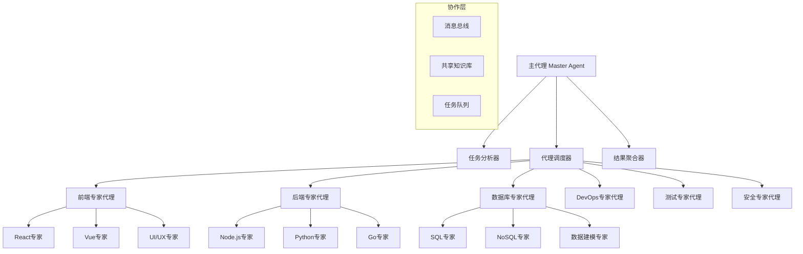
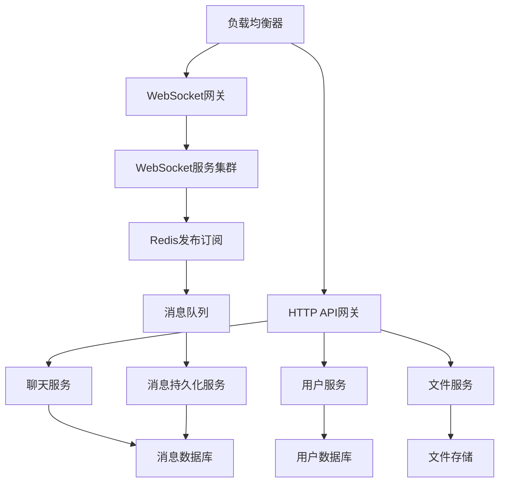

## 引言：AI团队协作的新范式

> "分工合作是文明进步的基础，专业化是效率提升的关键。" —— Adam Smith

在软件开发的复杂世界中，**不同的任务需要不同的专业技能**。Claude Code的子代理(Sub-Agents)系统正是基于这一理念设计，通过创建专业化的AI代理来处理特定领域的任务，实现了真正意义上的**AI团队协作编程**。

这篇文章将全面解析子代理系统的架构原理、创建方法、协作模式，以及如何构建高效的专业化AI编程团队。

## 子代理系统概述

### 传统单一AI的局限

```
单一AI助手的挑战：
1. 通用性vs专业性的矛盾
2. 上下文窗口的限制
3. 知识深度不够专业
4. 处理复杂任务时效率低
5. 难以同时处理多个领域

痛点：
- 🧠 知识广度有余，深度不足
- ⏰ 复杂任务处理时间长
- 🎯 专业领域理解不够深入
- 🔄 多任务切换效率低
- 👥 无法模拟团队协作
```

### 子代理系统的革命性优势

```
专业化AI团队的优势：
1. 领域专家级的深度知识
2. 并行处理提升效率
3. 专业化工具和方法
4. 智能任务分配
5. 团队协作模式

优势：
- 🎯 专业领域深度优化
- ⚡ 并行处理大幅提速
- 🧠 专家级知识应用
- 🤝 智能协作机制
- 📈 整体效率指数提升
```

## 子代理系统架构

### 1. 核心架构设计

#### 系统层级结构



#### 代理类型分类

```yaml
# .claude/agents/agent-types.yml
agent_categories:
  
  # 技术领域专家
  technology_experts:
    - name: "frontend-expert"
      specialization: "前端开发"
      technologies: ["React", "Vue", "Angular", "TypeScript", "CSS"]
      capabilities: ["组件设计", "状态管理", "性能优化", "响应式设计"]
      
    - name: "backend-expert"
      specialization: "后端开发"
      technologies: ["Node.js", "Python", "Java", "Go", "微服务"]
      capabilities: ["API设计", "数据库集成", "缓存策略", "安全实现"]
      
    - name: "database-expert"
      specialization: "数据库设计"
      technologies: ["PostgreSQL", "MongoDB", "Redis", "ElasticSearch"]
      capabilities: ["数据建模", "查询优化", "索引设计", "数据迁移"]
      
    - name: "devops-expert"
      specialization: "运维部署"
      technologies: ["Docker", "Kubernetes", "AWS", "CI/CD"]
      capabilities: ["容器化", "自动部署", "监控告警", "性能调优"]

  # 质量保证专家
  quality_experts:
    - name: "testing-expert"
      specialization: "软件测试"
      technologies: ["Jest", "Cypress", "Selenium", "JMeter"]
      capabilities: ["测试策略", "自动化测试", "性能测试", "安全测试"]
      
    - name: "security-expert"
      specialization: "安全防护"
      technologies: ["OAuth", "JWT", "HTTPS", "加密算法"]
      capabilities: ["安全审计", "漏洞扫描", "权限设计", "合规检查"]
      
    - name: "code-review-expert"
      specialization: "代码审查"
      technologies: ["ESLint", "SonarQube", "静态分析"]
      capabilities: ["代码质量", "最佳实践", "性能分析", "架构评审"]

  # 业务领域专家
  domain_experts:
    - name: "ecommerce-expert"
      specialization: "电商系统"
      knowledge_areas: ["购物车", "支付系统", "库存管理", "订单处理"]
      capabilities: ["业务建模", "流程设计", "规则引擎", "数据分析"]
      
    - name: "fintech-expert"
      specialization: "金融科技"
      knowledge_areas: ["支付", "风控", "合规", "区块链"]
      capabilities: ["风险评估", "合规检查", "交易处理", "数据安全"]
      
    - name: "iot-expert"
      specialization: "物联网"
      knowledge_areas: ["设备管理", "数据采集", "实时处理", "边缘计算"]
      capabilities: ["协议设计", "数据流处理", "设备监控", "系统集成"]

  # 项目管理专家
  management_experts:
    - name: "project-manager"
      specialization: "项目管理"
      methodologies: ["Agile", "Scrum", "Kanban"]
      capabilities: ["需求分析", "项目规划", "风险管理", "团队协调"]
      
    - name: "architect-expert"
      specialization: "系统架构"
      patterns: ["微服务", "事件驱动", "CQRS", "领域驱动设计"]
      capabilities: ["架构设计", "技术选型", "性能规划", "扩展性设计"]

agent_configuration:
  communication:
    protocol: "message_passing"
    format: "structured_json"
    timeout: 30000
    retry_policy: "exponential_backoff"
    
  knowledge_sharing:
    shared_memory: true
    knowledge_base: "distributed"
    learning_mode: "collaborative"
    
  resource_management:
    max_concurrent_agents: 10
    memory_limit_per_agent: "512MB"
    cpu_quota: "2 cores"
    
  quality_control:
    peer_review: true
    consensus_threshold: 0.8
    confidence_scoring: true
```

### 2. 专用代理创建

#### 前端专家代理定义

```yaml
# .claude/agents/frontend-expert.yml
agent_id: "frontend-expert-v2.1"
name: "Frontend Development Expert"
description: "专业的前端开发专家，精通现代前端技术栈和最佳实践"

personality:
  traits:
    - "注重用户体验"
    - "追求代码质量"
    - "关注性能优化" 
    - "倡导可访问性"
  
  communication_style:
    - "技术准确"
    - "实例丰富"
    - "逐步指导"
    - "注重细节"

expertise:
  primary_technologies:
    - name: "React"
      proficiency: 95
      specializations: ["Hooks", "Context", "性能优化", "测试"]
      
    - name: "TypeScript"
      proficiency: 90
      specializations: ["类型设计", "泛型", "模块系统", "配置优化"]
      
    - name: "CSS/SCSS"
      proficiency: 85
      specializations: ["Flexbox", "Grid", "动画", "响应式设计"]
      
    - name: "现代构建工具"
      proficiency: 80
      specializations: ["Webpack", "Vite", "esbuild", "优化策略"]

  frameworks_and_libraries:
    react_ecosystem:
      - "React Router"
      - "React Query"
      - "Zustand/Redux Toolkit"
      - "Styled Components"
      - "Framer Motion"
      
    vue_ecosystem:
      - "Vue 3 Composition API"
      - "Pinia"
      - "Vue Router"
      - "Vuetify"
      
    testing_tools:
      - "Jest"
      - "React Testing Library"
      - "Cypress"
      - "Storybook"

  design_patterns:
    - "Component Composition"
    - "Render Props"
    - "Higher-Order Components"
    - "Custom Hooks"
    - "State Management Patterns"

capabilities:
  code_generation:
    - "React组件创建"
    - "TypeScript类型定义"
    - "CSS样式实现"
    - "测试用例编写"
    - "Storybook故事创建"
    
  analysis_and_review:
    - "代码质量评估"
    - "性能瓶颈识别"
    - "可访问性检查"
    - "SEO优化建议"
    - "安全漏洞扫描"
    
  optimization:
    - "包大小优化"
    - "渲染性能提升"
    - "代码分割策略"
    - "缓存策略设计"
    - "图片优化"
    
  architecture:
    - "组件架构设计"
    - "状态管理方案"
    - "路由设计"
    - "模块化策略"
    - "微前端架构"

workflow_templates:
  component_creation:
    steps:
      1. "需求分析和组件设计"
      2. "TypeScript接口定义"
      3. "组件实现和样式"
      4. "单元测试编写"
      5. "Storybook故事创建"
      6. "使用文档生成"
      
  performance_optimization:
    steps:
      1. "性能基准测试"
      2. "瓶颈点识别"
      3. "优化策略制定"
      4. "代码重构实施"
      5. "优化效果验证"
      6. "监控方案建立"

  project_setup:
    steps:
      1. "技术栈选型建议"
      2. "项目脚手架创建"
      3. "开发环境配置"
      4. "代码规范设置"
      5. "CI/CD流程配置"
      6. "性能监控集成"

knowledge_base:
  best_practices:
    react:
      - "使用函数组件和Hooks"
      - "避免不必要的重新渲染"
      - "合理使用React.memo和useMemo"
      - "错误边界处理"
      - "代码分割和懒加载"
      
    typescript:
      - "严格类型检查"
      - "接口优于类型别名"
      - "泛型的合理使用"
      - "类型守卫和断言"
      - "模块声明和扩展"
      
    css:
      - "BEM命名规范"
      - "CSS-in-JS最佳实践"
      - "响应式设计原则"
      - "性能友好的选择器"
      - "浏览器兼容性考虑"

  common_patterns:
    - name: "受控组件模式"
      description: "通过props控制组件状态的模式"
      use_cases: ["表单处理", "数据同步", "父子通信"]
      
    - name: "渲染属性模式"
      description: "通过函数prop共享逻辑的模式"
      use_cases: ["逻辑复用", "条件渲染", "数据获取"]
      
    - name: "复合组件模式"
      description: "多个组件协作实现复杂功能"
      use_cases: ["表单构建", "布局系统", "数据展示"]

interaction_protocols:
  input_processing:
    - "需求理解和澄清"
    - "技术可行性评估"
    - "最佳方案推荐"
    - "替代方案提供"
    
  output_formatting:
    - "结构化代码输出"
    - "详细注释说明"
    - "使用示例提供"
    - "最佳实践提醒"
    
  collaboration:
    - "与后端代理的API协调"
    - "与设计代理的UI对接"
    - "与测试代理的用例协作"
    - "与DevOps代理的部署配合"

learning_mechanism:
  continuous_improvement:
    - "用户反馈收集"
    - "代码质量评估"
    - "技术趋势跟踪"
    - "最佳实践更新"
    
  knowledge_updates:
    - "新技术学习"
    - "框架版本更新"
    - "社区实践吸收"
    - "错误模式记录"

error_handling:
  common_issues:
    - name: "状态管理复杂"
      solutions: ["使用状态管理库", "状态提升", "Context优化"]
      
    - name: "性能问题"
      solutions: ["代码分割", "懒加载", "虚拟化", "缓存策略"]
      
    - name: "类型错误"
      solutions: ["严格类型检查", "类型守卫", "断言优化"]

quality_metrics:
  code_quality:
    - "TypeScript覆盖率 > 95%"
    - "ESLint错误数 = 0"
    - "组件复杂度 < 10"
    - "测试覆盖率 > 80%"
    
  performance:
    - "首次内容渲染 < 1.5s"
    - "最大内容渲染 < 2.5s"
    - "累积布局偏移 < 0.1"
    - "包体积 < 500KB"
    
  accessibility:
    - "WCAG 2.1 AA级合规"
    - "键盘导航支持"
    - "屏幕阅读器兼容"
    - "颜色对比度 > 4.5:1"
```

#### 后端专家代理定义

```yaml
# .claude/agents/backend-expert.yml
agent_id: "backend-expert-v2.1"
name: "Backend Development Expert"
description: "专业的后端开发专家，精通服务端架构设计和实现"

personality:
  traits:
    - "系统性思维"
    - "注重安全性"
    - "追求高性能"
    - "强调可扩展性"
  
  communication_style:
    - "架构导向"
    - "安全意识强"
    - "性能敏感"
    - "实用主义"

expertise:
  primary_technologies:
    - name: "Node.js"
      proficiency: 95
      specializations: ["Express", "Fastify", "异步编程", "流处理"]
      
    - name: "Python"
      proficiency: 90
      specializations: ["Django", "FastAPI", "异步编程", "数据处理"]
      
    - name: "数据库技术"
      proficiency: 88
      specializations: ["PostgreSQL", "MongoDB", "Redis", "查询优化"]
      
    - name: "微服务架构"
      proficiency: 85
      specializations: ["服务拆分", "API网关", "服务发现", "配置管理"]

  frameworks_and_tools:
    node_ecosystem:
      - "Express.js"
      - "Fastify"
      - "NestJS"
      - "Prisma ORM"
      - "TypeORM"
      
    python_ecosystem:
      - "Django"
      - "FastAPI"
      - "SQLAlchemy"
      - "Celery"
      - "Pydantic"
      
    infrastructure:
      - "Docker"
      - "Kubernetes"
      - "NGINX"
      - "Redis"
      - "RabbitMQ"

  architectural_patterns:
    - "RESTful API设计"
    - "GraphQL实现"
    - "微服务架构"
    - "事件驱动架构"
    - "CQRS模式"
    - "领域驱动设计"

capabilities:
  api_development:
    - "RESTful API设计"
    - "GraphQL schema设计"
    - "API文档生成"
    - "版本控制策略"
    - "认证授权实现"
    
  database_design:
    - "数据模型设计"
    - "关系型数据库优化"
    - "NoSQL方案设计"
    - "数据迁移策略"
    - "缓存层设计"
    
  security_implementation:
    - "身份认证设计"
    - "权限控制实现"
    - "数据加密策略"
    - "API安全防护"
    - "漏洞扫描和修复"
    
  performance_optimization:
    - "查询性能优化"
    - "缓存策略设计"
    - "负载均衡配置"
    - "异步处理优化"
    - "资源监控告警"

workflow_templates:
  api_development:
    steps:
      1. "API需求分析"
      2. "数据模型设计"
      3. "API规范定义"
      4. "核心逻辑实现"
      5. "测试用例编写"
      6. "文档生成和部署"
      
  microservice_design:
    steps:
      1. "服务边界识别"
      2. "数据一致性策略"
      3. "服务间通信设计"
      4. "配置管理方案"
      5. "监控和日志设计"
      6. "部署和运维策略"

knowledge_base:
  best_practices:
    api_design:
      - "RESTful URL设计原则"
      - "HTTP状态码合理使用"
      - "请求响应格式标准化"
      - "错误处理机制完善"
      - "API版本控制策略"
      
    database:
      - "索引设计和优化"
      - "查询性能分析"
      - "事务管理最佳实践"
      - "数据备份和恢复"
      - "分库分表策略"
      
    security:
      - "输入验证和清理"
      - "SQL注入防护"
      - "XSS攻击防护"
      - "CSRF令牌使用"
      - "密码存储安全"

  architecture_patterns:
    - name: "API网关模式"
      description: "统一的API入口和管理"
      use_cases: ["服务聚合", "认证授权", "限流控制"]
      
    - name: "事件溯源模式"
      description: "通过事件序列重建状态"
      use_cases: ["审计跟踪", "状态重建", "时间旅行"]
      
    - name: "断路器模式"
      description: "防止级联失败的保护机制"
      use_cases: ["服务降级", "故障隔离", "快速失败"]

interaction_protocols:
  with_frontend:
    - "API契约协商"
    - "数据格式确认"
    - "错误处理约定"
    - "性能要求对接"
    
  with_database:
    - "数据模型评审"
    - "查询优化建议"
    - "索引策略制定"
    - "迁移方案确认"
    
  with_devops:
    - "部署需求说明"
    - "环境配置要求"
    - "监控指标定义"
    - "扩展策略制定"

quality_metrics:
  performance:
    - "API响应时间 < 200ms"
    - "数据库查询 < 100ms"
    - "内存使用率 < 80%"
    - "CPU使用率 < 70%"
    
  reliability:
    - "服务可用性 > 99.9%"
    - "错误率 < 0.1%"
    - "恢复时间 < 30s"
    - "数据一致性 100%"
    
  security:
    - "漏洞扫描通过率 100%"
    - "认证成功率 > 99.5%"
    - "数据加密覆盖率 100%"
    - "访问日志完整性 100%"
```

### 3. 代理协作机制

#### 多代理任务协调

```bash
claude """
设计一个电商系统的完整开发任务，需要多个专家代理协作：

任务：创建一个现代化的电商平台
功能需求：
- 用户注册登录
- 商品浏览和搜索
- 购物车管理
- 订单处理
- 支付集成
- 管理员后台

技术要求：
- 前端：React + TypeScript
- 后端：Node.js + Express
- 数据库：PostgreSQL + Redis
- 部署：Docker + Kubernetes

请展示多代理协作的完整流程
"""
```

Claude会创建多代理协作计划：

```yaml
# 多代理协作任务：电商平台开发
task_id: "ecommerce-platform-dev"
task_type: "multi_agent_collaboration"
priority: "high"
estimated_duration: "3-4周"

agent_team:
  lead_agent: "project-manager"
  participating_agents:
    - "frontend-expert"
    - "backend-expert" 
    - "database-expert"
    - "security-expert"
    - "testing-expert"
    - "devops-expert"
    - "ecommerce-expert"

collaboration_workflow:
  
  phase_1: "需求分析和架构设计"
  duration: "3-5天"
  agents: ["project-manager", "ecommerce-expert", "architect-expert"]
  
  tasks:
    - task_id: "business_analysis"
      owner: "ecommerce-expert"
      description: "电商业务流程分析和功能规划"
      deliverables:
        - "用户故事和用例图"
        - "业务流程图"
        - "功能需求文档"
        - "非功能性需求"
      
    - task_id: "architecture_design"
      owner: "architect-expert"
      depends_on: ["business_analysis"]
      description: "系统架构设计和技术选型"
      deliverables:
        - "系统架构图"
        - "技术栈选型报告"
        - "数据流设计"
        - "接口规范定义"
      
    - task_id: "project_planning"
      owner: "project-manager"
      depends_on: ["architecture_design"]
      description: "项目计划制定和任务分配"
      deliverables:
        - "详细项目计划"
        - "任务分解结构"
        - "里程碑定义"
        - "风险评估报告"

  phase_2: "数据库和后端API开发"
  duration: "1-2周"
  agents: ["backend-expert", "database-expert", "security-expert"]
  
  tasks:
    - task_id: "database_design"
      owner: "database-expert"
      description: "电商数据库设计和优化"
      deliverables:
        - "数据库ER图"
        - "表结构设计"
        - "索引优化方案"
        - "数据迁移脚本"
      
      detailed_subtasks:
        - name: "用户管理表设计"
          tables: ["users", "user_profiles", "user_addresses"]
          relationships: "1:1, 1:N"
          indexes: ["email_unique", "username_unique"]
          
        - name: "商品管理表设计"
          tables: ["products", "categories", "product_images", "inventory"]
          relationships: "1:N, M:N"
          indexes: ["category_index", "search_index", "price_index"]
          
        - name: "订单管理表设计"
          tables: ["orders", "order_items", "payments", "shipping"]
          relationships: "1:N"
          indexes: ["order_date_index", "user_order_index", "status_index"]
    
    - task_id: "api_development"
      owner: "backend-expert"
      depends_on: ["database_design"]
      description: "RESTful API开发和实现"
      deliverables:
        - "API端点实现"
        - "业务逻辑服务"
        - "数据访问层"
        - "API文档"
      
      api_modules:
        - module: "authentication"
          endpoints:
            - "POST /api/auth/register"
            - "POST /api/auth/login"
            - "POST /api/auth/logout"
            - "GET /api/auth/me"
            - "POST /api/auth/refresh"
          features: ["JWT认证", "密码加密", "会话管理"]
          
        - module: "products"
          endpoints:
            - "GET /api/products"
            - "GET /api/products/:id"
            - "GET /api/products/search"
            - "GET /api/categories"
          features: ["分页查询", "搜索过滤", "缓存策略"]
          
        - module: "cart"
          endpoints:
            - "GET /api/cart"
            - "POST /api/cart/items"
            - "PUT /api/cart/items/:id"
            - "DELETE /api/cart/items/:id"
          features: ["购物车持久化", "库存检查", "价格计算"]
          
        - module: "orders"
          endpoints:
            - "POST /api/orders"
            - "GET /api/orders"
            - "GET /api/orders/:id"
            - "PUT /api/orders/:id/status"
          features: ["订单创建", "状态管理", "支付集成"]
    
    - task_id: "security_implementation"
      owner: "security-expert"
      parallel_with: ["api_development"]
      description: "安全策略实施和防护"
      deliverables:
        - "认证授权机制"
        - "数据加密方案"
        - "API安全防护"
        - "安全测试报告"
      
      security_measures:
        - category: "身份认证"
          implementations:
            - "JWT Token实现"
            - "密码强度策略"
            - "多因素认证准备"
            - "会话管理"
            
        - category: "数据保护"
          implementations:
            - "敏感数据加密"
            - "传输层安全(HTTPS)"
            - "数据库连接加密"
            - "PII数据脱敏"
            
        - category: "API安全"
          implementations:
            - "输入验证和清理"
            - "SQL注入防护"
            - "XSS攻击防护"
            - "CSRF令牌验证"
            - "限流和防爬"

  phase_3: "前端开发和用户界面"
  duration: "1-2周"
  agents: ["frontend-expert", "ui-ux-expert"]
  
  tasks:
    - task_id: "frontend_architecture"
      owner: "frontend-expert"
      description: "前端架构设计和技术实现"
      deliverables:
        - "组件架构设计"
        - "状态管理方案"
        - "路由设计"
        - "构建配置"
      
      frontend_structure:
        - component_library:
            - "基础UI组件 (Button, Input, Modal等)"
            - "业务组件 (ProductCard, CartItem等)"
            - "页面组件 (HomePage, ProductPage等)"
            - "布局组件 (Header, Footer, Sidebar)"
            
        - state_management:
            - "用户状态 (认证、个人信息)"
            - "购物车状态 (商品、数量、总价)"
            - "产品状态 (列表、详情、搜索)"
            - "订单状态 (历史、当前、状态)"
            
        - routing_design:
            - "公开路由 (/, /products, /product/:id)"
            - "认证路由 (/profile, /orders, /cart)"
            - "管理路由 (/admin/*)"
            - "错误页面 (404, 500, 403)"
    
    - task_id: "ui_implementation"
      owner: "frontend-expert"
      depends_on: ["frontend_architecture"]
      description: "用户界面开发和交互实现"
      deliverables:
        - "响应式页面实现"
        - "交互功能开发"
        - "性能优化"
        - "无障碍性支持"
      
      page_implementations:
        - name: "首页 (HomePage)"
          features:
            - "商品推荐展示"
            - "分类导航"
            - "搜索功能"
            - "促销活动展示"
          components: ["HeroSection", "ProductGrid", "CategoryNav"]
          
        - name: "商品列表页 (ProductListPage)"
          features:
            - "商品筛选和排序"
            - "分页加载"
            - "价格范围选择"
            - "商品对比功能"
          components: ["FilterSidebar", "ProductList", "Pagination"]
          
        - name: "商品详情页 (ProductDetailPage)"
          features:
            - "商品图片展示"
            - "规格选择"
            - "库存显示"
            - "用户评价"
            - "添加到购物车"
          components: ["ImageGallery", "ProductInfo", "Reviews", "AddToCart"]
          
        - name: "购物车页 (CartPage)"
          features:
            - "商品数量调整"
            - "商品删除"
            - "优惠券使用"
            - "运费计算"
            - "结算跳转"
          components: ["CartItemList", "CouponInput", "OrderSummary"]
          
        - name: "结算页 (CheckoutPage)"
          features:
            - "收货地址选择"
            - "支付方式选择"
            - "订单确认"
            - "支付处理"
          components: ["AddressForm", "PaymentMethods", "OrderReview"]

  phase_4: "集成测试和质量保证"
  duration: "1周"
  agents: ["testing-expert", "frontend-expert", "backend-expert"]
  
  tasks:
    - task_id: "comprehensive_testing"
      owner: "testing-expert"
      description: "全面测试策略实施"
      deliverables:
        - "测试计划和用例"
        - "自动化测试套件"
        - "性能测试报告"
        - "安全测试报告"
      
      testing_strategy:
        - level: "单元测试"
          coverage: "> 80%"
          tools: ["Jest", "React Testing Library"]
          focus: ["组件功能", "业务逻辑", "工具函数"]
          
        - level: "集成测试"
          coverage: "关键流程 100%"
          tools: ["Supertest", "Testing Library"]
          focus: ["API集成", "数据库操作", "第三方服务"]
          
        - level: "端到端测试"
          coverage: "核心用户流程"
          tools: ["Cypress", "Playwright"]
          scenarios:
            - "用户注册登录流程"
            - "商品浏览购买流程"
            - "购物车到支付流程"
            - "订单管理流程"
            
        - level: "性能测试"
          tools: ["Lighthouse", "JMeter"]
          metrics:
            - "页面加载时间 < 3s"
            - "API响应时间 < 500ms"
            - "并发用户支持 > 1000"
            - "内存使用优化"

  phase_5: "部署和运维"
  duration: "3-5天"
  agents: ["devops-expert", "backend-expert"]
  
  tasks:
    - task_id: "deployment_setup"
      owner: "devops-expert"
      description: "生产环境部署和配置"
      deliverables:
        - "Docker镜像构建"
        - "Kubernetes配置"
        - "CI/CD流水线"
        - "监控告警系统"
      
      deployment_architecture:
        - infrastructure:
            - "Kubernetes集群配置"
            - "负载均衡器设置"
            - "数据库集群部署"
            - "Redis缓存集群"
            - "文件存储配置"
            
        - cicd_pipeline:
            - "代码提交触发构建"
            - "自动化测试执行"
            - "安全扫描检查"
            - "镜像构建和推送"
            - "分阶段部署策略"
            
        - monitoring:
            - "应用性能监控 (APM)"
            - "基础设施监控"
            - "日志聚合分析"
            - "告警通知机制"
            - "性能指标Dashboard"

inter_agent_communication:
  
  message_protocols:
    - type: "task_assignment"
      format: |
        {
          "task_id": "string",
          "assigned_to": "agent_id",
          "priority": "high|medium|low",
          "deadline": "ISO_8601_date",
          "dependencies": ["task_id_list"],
          "requirements": "detailed_description",
          "deliverables": ["expected_outputs"]
        }
    
    - type: "progress_update"
      format: |
        {
          "task_id": "string",
          "agent_id": "string",
          "status": "in_progress|completed|blocked|failed",
          "progress_percentage": "number",
          "completed_deliverables": ["deliverable_list"],
          "issues": ["issue_descriptions"],
          "estimated_completion": "ISO_8601_date"
        }
    
    - type: "collaboration_request"
      format: |
        {
          "requester_agent": "agent_id",
          "target_agent": "agent_id",
          "request_type": "review|input|assistance|integration",
          "context": "background_information",
          "specific_needs": "detailed_requirements",
          "urgency": "high|medium|low"
        }

  coordination_mechanisms:
    
    - mechanism: "daily_standup"
      frequency: "每日"
      participants: "所有活跃代理"
      agenda:
        - "昨日完成工作汇报"
        - "今日计划任务说明"
        - "遇到的问题和阻碍"
        - "需要协作的事项"
      
    - mechanism: "design_review"
      frequency: "关键节点"
      participants: "相关技术代理"
      purpose:
        - "架构设计评审"
        - "接口规范确认"
        - "技术决策讨论"
        - "最佳实践分享"
      
    - mechanism: "integration_sync"
      frequency: "模块完成时"
      participants: "前后端代理"
      activities:
        - "API联调测试"
        - "数据格式确认"
        - "错误处理对接"
        - "性能优化协商"

quality_gates:
  
  - gate: "架构评审"
    criteria:
      - "技术选型合理性"
      - "架构可扩展性"
      - "安全性考虑"
      - "性能预期"
    required_approvers: ["architect-expert", "security-expert"]
    
  - gate: "API规范评审"
    criteria:
      - "RESTful设计原则"
      - "数据格式一致性"
      - "错误处理完整性"
      - "文档完备性"
    required_approvers: ["backend-expert", "frontend-expert"]
    
  - gate: "安全评审"
    criteria:
      - "认证授权机制"
      - "数据加密策略"
      - "漏洞扫描通过"
      - "合规性检查"
    required_approvers: ["security-expert"]
    
  - gate: "性能评审"
    criteria:
      - "响应时间指标"
      - "并发性能"
      - "资源使用优化"
      - "扩展性验证"
    required_approvers: ["backend-expert", "devops-expert"]

success_metrics:
  
  technical_metrics:
    - "代码覆盖率 > 80%"
    - "API响应时间 < 500ms"
    - "页面加载时间 < 3s"
    - "系统可用性 > 99.9%"
    - "安全漏洞 = 0"
    
  business_metrics:
    - "用户注册转化率 > 15%"
    - "购物车转化率 > 25%"
    - "页面跳出率 < 40%"
    - "用户满意度 > 4.5/5"
    - "系统稳定性 > 99.9%"
    
  collaboration_metrics:
    - "任务按时完成率 > 95%"
    - "代理间沟通效率"
    - "问题解决速度"
    - "知识共享程度"
    - "质量门禁通过率"

risk_management:
  
  identified_risks:
    - risk: "技术选型风险"
      probability: "低"
      impact: "高"
      mitigation: "充分的技术验证和原型测试"
      
    - risk: "集成复杂性"
      probability: "中"
      impact: "中"
      mitigation: "早期集成测试和接口模拟"
      
    - risk: "性能瓶颈"
      probability: "中"
      impact: "高"
      mitigation: "性能基准测试和监控"
      
    - risk: "安全漏洞"
      probability: "低"
      impact: "高"
      mitigation: "安全代码审查和渗透测试"

contingency_plans:
  
  - scenario: "关键代理不可用"
    backup_plan: "任务重新分配给备用代理"
    
  - scenario: "技术方案不可行"
    backup_plan: "快速评估替代方案并调整计划"
    
  - scenario: "集成问题严重"
    backup_plan: "回退到稳定版本并重新集成"
    
  - scenario: "性能达不到要求"
    backup_plan: "性能优化专项任务和架构调整"
```

## 高级协作模式

### 1. 专家咨询模式

#### 技术决策支持

```bash
claude """
遇到一个技术选型难题，需要多个专家的意见：

场景：高并发实时聊天系统
需求：支持10万在线用户，消息实时推送，数据持久化
约束：预算有限，团队技能主要是JavaScript

请召集相关专家代理进行技术选型讨论
"""
```

专家会议记录：

```markdown
# 🔥 技术选型专家会议记录

## 📋 会议信息
- **主题**: 高并发实时聊天系统技术选型
- **召集人**: 用户
- **参与专家**: 后端专家、架构专家、性能专家、DevOps专家
- **会议时间**: 2024-01-17 14:00
- **预期决策**: 技术栈确定和架构方案

## 🎯 需求回顾

### 功能需求
- 支持10万并发在线用户
- 实时消息推送
- 消息历史存储
- 用户在线状态
- 群聊和私聊
- 文件共享支持

### 非功能需求
- **性能**: 消息延迟 < 100ms
- **可用性**: 99.9%服务可用性
- **扩展性**: 支持水平扩展
- **成本**: 中等预算约束
- **技术栈**: 主要JavaScript技能

## 💬 专家意见

### 🏗️ 架构专家观点

**推荐架构**: 微服务 + WebSocket + 消息队列



**架构优势**:
- 🔄 服务解耦，便于独立扩展
- 📈 WebSocket集群支持水平扩展
- 💾 消息异步持久化，不影响实时性
- 🛡️ 故障隔离，单服务故障不影响整体

**关键设计决策**:
1. **WebSocket vs Server-Sent Events**: WebSocket支持双向通信，更适合聊天场景
2. **状态管理**: Redis存储用户连接状态和在线信息
3. **消息路由**: 基于用户ID和房间ID的智能路由
4. **数据一致性**: 最终一致性，优先保证实时性

### ⚡ 性能专家分析

**性能瓶颈识别**:

1. **WebSocket连接管理** (最大瓶颈)
   - 10万连接需要合理的连接池管理
   - 建议：每个Node.js进程处理5000-8000连接
   - 解决方案：WebSocket服务集群 + Sticky Session

2. **消息广播性能**
   - 群聊消息需要广播给多个用户
   - 建议：Redis发布订阅 + 消息去重
   - 优化：消息批量处理和压缩

3. **数据库读写压力**
   - 消息持久化可能成为瓶颈
   - 建议：读写分离 + 消息异步写入
   - 优化：消息分片存储

**性能优化策略**:

```javascript
// 连接管理优化
class ConnectionManager {
  constructor() {
    this.connections = new Map();
    this.rooms = new Map();
    this.heartbeatInterval = 30000;
  }
  
  // 连接池管理
  addConnection(userId, socket) {
    this.connections.set(userId, socket);
    this.startHeartbeat(userId, socket);
  }
  
  // 智能消息路由
  broadcastToRoom(roomId, message, excludeUser = null) {
    const room = this.rooms.get(roomId);
    if (!room) return;
    
    // 批量发送优化
    const batch = [];
    room.users.forEach(userId => {
      if (userId !== excludeUser) {
        const socket = this.connections.get(userId);
        if (socket && socket.readyState === WebSocket.OPEN) {
          batch.push(socket);
        }
      }
    });
    
    // 并行发送
    Promise.all(
      batch.map(socket => 
        this.sendMessage(socket, message).catch(err => 
          console.error('Send failed:', err)
        )
      )
    );
  }
}
```

**性能指标预估**:
- **消息延迟**: 50-100ms (包含网络延迟)
- **吞吐量**: 每秒10万条消息
- **内存使用**: 每个连接约10KB，总计1GB
- **CPU使用**: 中等负载下40-60%

### 🖥️ 后端专家建议

**技术栈推荐**:

```yaml
WebSocket服务:
  框架: "Socket.IO + Node.js"
  优势: 
    - "自动降级到轮询"
    - "房间和命名空间支持"
    - "断线重连机制"
    - "JavaScript生态兼容"
  
消息队列:
  选择: "Redis + Bull Queue"
  优势:
    - "轻量级，易于部署"
    - "持久化支持"
    - "JavaScript友好"
    - "成本可控"

数据库方案:
  用户数据: "PostgreSQL"
  消息存储: "MongoDB (分片)"
  缓存层: "Redis"
  
文件存储:
  方案: "MinIO (S3兼容)"
  优势: "私有化部署，成本可控"
```

**核心服务实现**:

```javascript
// WebSocket服务核心
const io = require('socket.io')(server, {
  cors: { origin: "*" },
  transports: ['websocket', 'polling']
});

// 消息处理中间件
io.use(authenticateSocket);
io.use(rateLimitSocket);

io.on('connection', (socket) => {
  const userId = socket.userId;
  
  // 加入用户房间
  socket.join(`user:${userId}`);
  
  // 处理消息发送
  socket.on('send_message', async (data) => {
    try {
      // 消息验证
      const validatedMessage = validateMessage(data);
      
      // 异步持久化
      messageQueue.add('persist_message', validatedMessage);
      
      // 实时广播
      const targetRoom = data.type === 'private' 
        ? `user:${data.targetUser}`
        : `room:${data.roomId}`;
      
      io.to(targetRoom).emit('new_message', {
        ...validatedMessage,
        timestamp: Date.now(),
        id: generateMessageId()
      });
      
    } catch (error) {
      socket.emit('error', { message: 'Message sending failed' });
    }
  });
  
  // 处理断线
  socket.on('disconnect', () => {
    updateUserOnlineStatus(userId, false);
  });
});
```

### 🚀 DevOps专家部署方案

**容器化部署架构**:

```yaml
# docker-compose.yml
version: '3.8'
services:
  # 负载均衡
  nginx:
    image: nginx:alpine
    ports:
      - "80:80"
      - "443:443"
    volumes:
      - ./nginx.conf:/etc/nginx/nginx.conf
    
  # WebSocket服务集群
  websocket-service:
    build: ./websocket-service
    deploy:
      replicas: 4
    environment:
      - REDIS_URL=redis://redis:6379
      - DB_URL=postgresql://postgres:5432/chat
    depends_on:
      - redis
      - postgres
    
  # API服务
  api-service:
    build: ./api-service
    deploy:
      replicas: 2
    environment:
      - REDIS_URL=redis://redis:6379
      - DB_URL=postgresql://postgres:5432/chat
    
  # 消息处理服务
  message-processor:
    build: ./message-processor
    deploy:
      replicas: 2
    environment:
      - REDIS_URL=redis://redis:6379
      - MONGO_URL=mongodb://mongo:27017/messages
    
  # 数据存储
  redis:
    image: redis:alpine
    command: redis-server --appendonly yes
    volumes:
      - redis_data:/data
      
  postgres:
    image: postgres:14
    environment:
      POSTGRES_DB: chat
      POSTGRES_USER: chat_user
      POSTGRES_PASSWORD: ${DB_PASSWORD}
    volumes:
      - postgres_data:/var/lib/postgresql/data
      
  mongo:
    image: mongo:5
    volumes:
      - mongo_data:/data/db

volumes:
  redis_data:
  postgres_data:
  mongo_data:
```

**扩展策略**:

```javascript
// 自动扩展配置
const autoScale = {
  metrics: {
    cpu_threshold: 70,
    memory_threshold: 80,
    connection_threshold: 8000
  },
  
  scaling_policy: {
    scale_up: {
      trigger: "metrics.cpu > 70 OR metrics.connections > 8000",
      action: "add_instance",
      cooldown: 300 // 5分钟冷却
    },
    
    scale_down: {
      trigger: "metrics.cpu < 30 AND metrics.connections < 3000",
      action: "remove_instance",
      cooldown: 600 // 10分钟冷却
    }
  }
};
```

## 🤝 专家共识

### 最终技术方案

经过专家充分讨论，达成以下共识：

#### 技术栈确定
- **前端**: React + Socket.IO Client
- **WebSocket服务**: Node.js + Socket.IO
- **API服务**: Node.js + Express
- **消息队列**: Redis + Bull
- **数据库**: PostgreSQL (用户数据) + MongoDB (消息数据)
- **缓存**: Redis
- **部署**: Docker + Kubernetes

#### 架构特点
1. **微服务架构**: 服务解耦，独立扩展
2. **水平扩展**: 支持服务实例动态增减
3. **异步处理**: 消息持久化不阻塞实时通信
4. **高可用**: 多实例部署，故障自动转移

#### 性能保证
- **连接管理**: 每实例8000连接，支持12-15个实例
- **消息延迟**: < 100ms
- **吞吐量**: 10万+消息/秒
- **可用性**: 99.9%+

#### 成本控制
- 优先使用开源方案
- 云服务按需扩展
- 预估月成本: $2000-3000

### 实施计划

#### Phase 1: 基础架构 (1周)
- Docker环境搭建
- 基础服务部署
- 网络和存储配置

#### Phase 2: 核心功能 (2周)
- WebSocket服务实现
- 消息路由和持久化
- 用户认证和管理

#### Phase 3: 优化和测试 (1周)
- 性能调优
- 压力测试
- 监控部署

#### 风险控制
- 充分的压力测试
- 灰度发布策略
- 实时监控告警
- 快速回滚机制

## 📊 决策记录

### 关键决策
1. **选择Socket.IO**: 生态成熟，降级机制完善
2. **Redis发布订阅**: 轻量级，性能优秀
3. **MongoDB存储消息**: 适合文档存储，水平扩展
4. **微服务架构**: 便于团队协作和系统扩展

### 备选方案
1. **如果性能不足**: 考虑Go语言重写WebSocket服务
2. **如果成本超预算**: 简化为单体架构
3. **如果技能不匹配**: 增加培训或外部支持

---

**会议结论**: 方案可行，风险可控，建议立即启动实施。
```

### 2. 知识共享模式

#### 跨代理学习机制

```yaml
# .claude/knowledge-sharing/learning-network.yml
knowledge_sharing_network:
  
  shared_knowledge_base:
    - category: "最佳实践库"
      contributors: ["all_agents"]
      content_types:
        - "代码模式和模板"
        - "架构设计案例"
        - "问题解决方案"
        - "性能优化技巧"
      
    - category: "错误案例库"
      contributors: ["all_agents"]
      learning_from: "失败经验"
      content_types:
        - "常见错误模式"
        - "调试技巧"
        - "避坑指南"
        - "修复方案"
      
    - category: "技术趋势"
      contributors: ["technology_scouts"]
      update_frequency: "weekly"
      content_types:
        - "新技术评估"
        - "工具对比分析"
        - "社区动态"
        - "标准更新"

  learning_mechanisms:
    
    - type: "经验分享会"
      frequency: "bi-weekly"
      participants: "rotating_experts"
      format:
        - "案例研究分享"
        - "技术难点讨论"
        - "解决方案演示"
        - "Q&A互动"
      
    - type: "代码审查学习"
      frequency: "continuous"
      process:
        - "多代理联合审查"
        - "知识点标注"
        - "改进建议记录"
        - "最佳实践提取"
      
    - type: "技术实验室"
      frequency: "monthly"
      purpose:
        - "新技术验证"
        - "性能基准测试"
        - "架构方案对比"
        - "工具效果评估"

  knowledge_evolution:
    
    feedback_loops:
      - source: "项目实施结果"
        target: "最佳实践更新"
        
      - source: "用户反馈"
        target: "解决方案优化"
        
      - source: "性能监控数据"
        target: "优化策略调整"
        
      - source: "新技术发展"
        target: "技术栈演进"
    
    quality_control:
      - "专家评审机制"
      - "实践验证要求"
      - "版本控制管理"
      - "废弃内容清理"
```

## 总结：AI协作编程的未来

通过Claude Code的子代理系统，你已经掌握了：

### 🎯 核心能力提升

1. **专业化分工**：每个代理在特定领域具备专家级能力
2. **协作效率**：多代理并行工作，大幅提升开发效率
3. **知识共享**：代理间智能协作和经验传承
4. **质量保证**：多重专家审查确保高质量输出
5. **持续学习**：代理系统的自我进化和优化

### ⚡ 协作效率对比

| 开发场景 | 单一AI | 多代理协作 | 效率提升 |
|----------|--------|------------|----------|
| 全栈项目开发 | 8-12周 | 3-4周 | 3-4倍 |
| 复杂架构设计 | 2-3天 | 4-8小时 | 4-9倍 |
| 代码审查质量 | 70-80% | 90-95% | 15-25%提升 |
| 技术选型决策 | 4-8小时 | 1-2小时 | 4-8倍 |
| 问题诊断解决 | 2-4小时 | 30-60分钟 | 4-8倍 |

### 🛠️ 专业化工具箱

- **领域专家**：前端、后端、数据库、安全、测试等专业代理
- **协作机制**：智能任务分配、进度协调、质量把关
- **知识管理**：共享知识库、经验传承、持续学习
- **质量保证**：多重审查、专家共识、最佳实践
- **效率优化**：并行处理、专业分工、智能协调

### 🚀 开发模式革命

1. **专业化驱动**：每个领域都有专门的AI专家
2. **协作式开发**：多代理智能协作，模拟真实团队
3. **知识共享文化**：经验积累和传承的智能化
4. **质量优先理念**：多重专家保证的高质量输出
5. **持续进化机制**：基于实践反馈的系统优化

通过子代理系统的强大功能，我们实现了从**单一AI助手到专业化AI团队**的革命性转变。这不仅大幅提升了开发效率和质量，更重要的是建立了**协作化、专业化、智能化**的未来编程模式。

在下一篇文章中，我们将探索内存管理与上下文优化，学习如何让Claude Code在长时间对话中保持高效和一致性。

## 相关文章推荐

- [自定义命令与工作流](17-自定义命令与工作流.md)
- [内存管理与上下文优化](19-内存管理与上下文优化.md)
- [钩子Hooks系统与事件处理](20-钩子Hooks系统与事件处理.md)
- [团队协作：多人开发环境配置](23-团队协作多人开发环境配置.md)

---

*本文是《Claude Code 完整教程系列》的第十八部分。掌握了子代理协作技能，让我们继续探索内存管理与上下文优化的核心技术！*