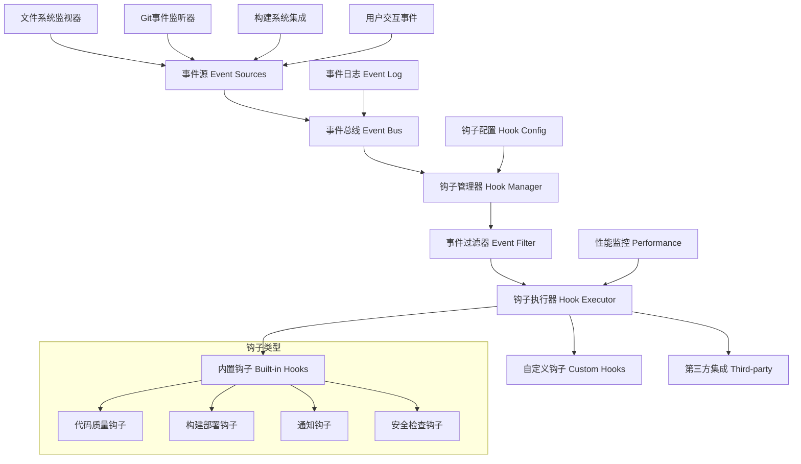

## 引言：事件驱动的智能开发

> "在编程中，最强大的模式之一就是事件驱动架构，它让系统能够优雅地响应变化。" —— Martin Fowler

在现代软件开发中，**事件驱动架构**已经成为构建响应式系统的核心模式。Claude Code的钩子(Hooks)系统正是基于这一理念设计，通过智能监听开发过程中的各种事件，**让AI助手能够在恰当的时机自动执行相应的操作**，实现真正的智能化开发体验。

这篇文章将全面解析Claude Code的钩子系统架构、事件处理机制，以及如何构建高效的自动化开发工作流。

## 钩子系统概述

### 传统开发工作流的局限

```
传统开发流程：
1. 编写代码 → 手动保存 → 手动测试
2. 提交代码 → 手动检查格式 → 手动运行CI
3. 部署应用 → 手动验证 → 手动通知团队
4. 发现问题 → 手动调试 → 手动修复

痛点：
- 🔄 重复性操作多，效率低下
- 🐛 容易遗漏关键步骤
- ⏰ 响应延迟，影响开发节奏
- 📊 缺少自动化质量保证
- 👥 团队协作缺乏同步机制
```

### Claude Code钩子系统的革新

```
事件驱动的智能工作流：
1. 文件变更 → 自动格式化 → 自动测试 → 质量检查
2. 代码提交 → 自动审查 → 自动构建 → 状态通知
3. 部署完成 → 自动验证 → 性能监控 → 团队通知
4. 错误发生 → 智能诊断 → 自动修复建议 → 学习优化

优势：
- ⚡ 零延迟自动响应
- 🎯 精确的事件匹配
- 🧠 智能上下文感知
- 🔗 无缝工具集成
- 📈 持续优化改进
```

## 钩子系统架构详解

### 1. 核心架构设计

#### 系统组件架构



#### 事件生命周期

```yaml
# .claude/hooks/event-lifecycle.yml
event_lifecycle:
  
  phases:
    - phase: "event_detection"
      description: "事件检测和捕获"
      components:
        - file_watcher: "监控文件系统变化"
        - git_monitor: "监听Git操作"
        - user_action_tracker: "跟踪用户交互"
        - build_system_integration: "集成构建系统事件"
      
    - phase: "event_processing"
      description: "事件处理和分发"
      steps:
        - event_validation: "验证事件格式和完整性"
        - context_enrichment: "丰富事件上下文信息"
        - priority_assignment: "分配事件优先级"
        - routing_decision: "确定路由目标"
      
    - phase: "hook_execution"
      description: "钩子执行和响应"
      strategies:
        - synchronous: "同步执行，阻塞后续操作"
        - asynchronous: "异步执行，不阻塞流程"
        - conditional: "条件执行，基于上下文判断"
        - batch: "批量执行，优化性能"
      
    - phase: "result_handling"
      description: "结果处理和反馈"
      actions:
        - success_logging: "记录成功执行日志"
        - error_handling: "处理执行错误"
        - notification: "发送状态通知"
        - metrics_collection: "收集性能指标"

event_types:
  file_events:
    - "file_created"
    - "file_modified"
    - "file_deleted"
    - "file_renamed"
    - "directory_changed"
  
  git_events:
    - "pre_commit"
    - "post_commit"
    - "pre_push"
    - "post_push"
    - "branch_created"
    - "branch_switched"
    - "merge_completed"
  
  build_events:
    - "build_started"
    - "build_completed"
    - "build_failed"
    - "test_started"
    - "test_completed"
    - "deployment_started"
    - "deployment_completed"
  
  user_events:
    - "project_opened"
    - "project_closed"
    - "command_executed"
    - "session_started"
    - "session_ended"

hook_registry:
  built_in_hooks:
    - name: "code_formatter"
      events: ["file_modified"]
      condition: "file.extension in ['.js', '.ts', '.py', '.go']"
      
    - name: "test_runner"
      events: ["file_modified", "pre_commit"]
      condition: "file.path contains '/src/' or event_type == 'pre_commit'"
      
    - name: "security_scanner"
      events: ["pre_commit", "pre_push"]
      condition: "changes.contains_sensitive_files or event_type == 'pre_push'"
      
    - name: "documentation_generator"
      events: ["post_commit"]
      condition: "changes.contains_api_changes"
  
  custom_hooks:
    path: ".claude/hooks/custom/"
    auto_discovery: true
    validation: "strict"
```

### 2. 事件监听机制

#### 文件系统事件监听

```yaml
# .claude/hooks/file-system-hooks.yml
file_system_monitoring:
  
  watchers:
    - name: "source_code_watcher"
      patterns:
        - "src/**/*.{js,ts,jsx,tsx,py,go,rs,java,cpp}"
        - "lib/**/*.{js,ts}"
        - "app/**/*.{js,ts,jsx,tsx}"
      events: ["modified", "created", "deleted"]
      debounce: 300  # 300ms防抖
      
    - name: "config_file_watcher"
      patterns:
        - "package.json"
        - "tsconfig.json"
        - "*.config.{js,ts,json}"
        - ".env*"
      events: ["modified"]
      immediate_trigger: true
      
    - name: "documentation_watcher"
      patterns:
        - "README.md"
        - "docs/**/*.md"
        - "*.md"
      events: ["modified", "created"]
      debounce: 1000

hooks:
  - name: "auto_format_on_save"
    trigger:
      watcher: "source_code_watcher"
      event: "modified"
    conditions:
      - file_size: "< 1MB"
      - not_binary: true
      - has_formatter: true
    
    execution:
      type: "synchronous"
      timeout: 5000
      script: |
        const filePath = event.file_path;
        const extension = path.extname(filePath);
        
        // 根据文件类型选择格式化工具
        const formatters = {
          '.js': 'prettier --write',
          '.ts': 'prettier --write',
          '.py': 'black --quiet',
          '.go': 'gofmt -w',
          '.rs': 'rustfmt',
          '.java': 'google-java-format --replace'
        };
        
        const formatter = formatters[extension];
        if (formatter) {
          await executeCommand(`${formatter} "${filePath}"`);
          console.log(`✅ 已格式化: ${filePath}`);
        }
    
    error_handling:
      strategy: "log_and_continue"
      max_retries: 2
      
  - name: "auto_test_on_change"
    trigger:
      watcher: "source_code_watcher" 
      event: "modified"
    conditions:
      - file_path: "not contains 'test'"
      - related_tests_exist: true
    
    execution:
      type: "asynchronous"
      debounce: 2000  # 2秒内多次变更只执行一次
      script: |
        const changedFile = event.file_path;
        const relatedTests = await findRelatedTests(changedFile);
        
        if (relatedTests.length > 0) {
          console.log(`🧪 运行相关测试: ${relatedTests.length} 个`);
          
          for (const testFile of relatedTests) {
            try {
              const result = await runTest(testFile);
              if (!result.success) {
                await notifyTestFailure(testFile, result.error);
              }
            } catch (error) {
              console.error(`测试执行失败: ${testFile}`, error);
            }
          }
        }

  - name: "dependency_check_on_package_change"
    trigger:
      watcher: "config_file_watcher"
      event: "modified"
      file_patterns: ["package.json", "requirements.txt", "go.mod", "Cargo.toml"]
    
    execution:
      type: "synchronous"
      priority: "high"
      script: |
        const configFile = event.file_path;
        console.log(`📦 检测到依赖配置变更: ${configFile}`);
        
        // 检查依赖安全性
        await runSecurityAudit(configFile);
        
        // 检查依赖版本兼容性
        await checkCompatibility(configFile);
        
        // 自动安装新依赖
        if (shouldAutoInstall()) {
          await installDependencies(configFile);
          console.log('✅ 依赖已自动更新');
        }

notification:
  channels:
    - type: "desktop_notification"
      events: ["test_failure", "security_warning"]
      
    - type: "status_bar"
      events: ["formatting_completed", "test_running"]
      
    - type: "log_output"
      events: "all"
      verbosity: "info"
```

#### Git事件钩子集成

```yaml
# .claude/hooks/git-hooks.yml
git_integration:
  
  hook_types:
    pre_commit:
      description: "提交前执行的检查和处理"
      blocking: true  # 失败时阻止提交
      timeout: 60000  # 60秒超时
      
    post_commit:
      description: "提交后执行的操作"
      blocking: false
      timeout: 30000
      
    pre_push:
      description: "推送前的最终检查"
      blocking: true
      timeout: 120000
      
    post_push:
      description: "推送后的通知和处理"
      blocking: false
      timeout: 30000

hooks:
  - name: "code_quality_check"
    type: "pre_commit"
    priority: 1
    
    checks:
      - name: "lint_check"
        description: "代码规范检查"
        script: |
          echo "🔍 运行ESLint检查..."
          
          # 获取暂存的文件
          const stagedFiles = await getStagedFiles(['.js', '.ts', '.jsx', '.tsx']);
          
          if (stagedFiles.length === 0) {
            console.log('没有需要检查的文件');
            return { success: true };
          }
          
          // 运行ESLint
          const lintResult = await runESLint(stagedFiles);
          
          if (lintResult.errorCount > 0) {
            console.error(`❌ ESLint发现 ${lintResult.errorCount} 个错误`);
            console.error(lintResult.output);
            return { success: false, message: '请修复ESLint错误后重新提交' };
          }
          
          if (lintResult.warningCount > 0) {
            console.warn(`⚠️ ESLint发现 ${lintResult.warningCount} 个警告`);
          }
          
          console.log('✅ 代码规范检查通过');
          return { success: true };
        
      - name: "type_check"
        description: "TypeScript类型检查"
        condition: "project.has_typescript"
        script: |
          echo "🔍 运行TypeScript类型检查..."
          
          const typeCheckResult = await runTypeScript(['--noEmit']);
          
          if (!typeCheckResult.success) {
            console.error('❌ TypeScript类型检查失败');
            console.error(typeCheckResult.output);
            return { success: false, message: '请修复类型错误后重新提交' };
          }
          
          console.log('✅ TypeScript类型检查通过');
          return { success: true };
      
      - name: "test_check"
        description: "运行相关测试"
        script: |
          echo "🧪 运行相关测试..."
          
          const changedFiles = await getStagedFiles();
          const relatedTests = await findRelatedTests(changedFiles);
          
          if (relatedTests.length === 0) {
            console.log('没有相关测试需要运行');
            return { success: true };
          }
          
          const testResult = await runTests(relatedTests);
          
          if (!testResult.success) {
            console.error(`❌ ${testResult.failedTests.length} 个测试失败`);
            console.error(testResult.output);
            return { success: false, message: '请确保所有测试通过后再提交' };
          }
          
          console.log(`✅ 所有测试通过 (${relatedTests.length}个)`);
          return { success: true };

  - name: "security_scan"
    type: "pre_commit"
    priority: 2
    
    script: |
      echo "🔒 执行安全扫描..."
      
      const changedFiles = await getStagedFiles();
      const securityIssues = [];
      
      // 检查敏感信息
      for (const file of changedFiles) {
        const content = await readFile(file);
        
        // 检查API密钥、密码等
        const sensitivePatterns = [
          /api[_-]?key\s*[:=]\s*['"]\S+['"]/i,
          /password\s*[:=]\s*['"]\S+['"]/i,
          /secret\s*[:=]\s*['"]\S+['"]/i,
          /token\s*[:=]\s*['"]\S+['"]/i
        ];
        
        for (const pattern of sensitivePatterns) {
          if (pattern.test(content)) {
            securityIssues.push({
              file,
              issue: '发现可能的敏感信息',
              line: findLineNumber(content, pattern)
            });
          }
        }
      }
      
      if (securityIssues.length > 0) {
        console.error('🚨 发现安全问题:');
        securityIssues.forEach(issue => {
          console.error(`- ${issue.file}:${issue.line} - ${issue.issue}`);
        });
        return { success: false, message: '请移除敏感信息后重新提交' };
      }
      
      console.log('✅ 安全检查通过');
      return { success: true };

  - name: "auto_documentation"
    type: "post_commit"
    
    script: |
      echo "📚 自动生成文档..."
      
      const commitMessage = await getLastCommitMessage();
      const changedFiles = await getChangedFiles('HEAD~1', 'HEAD');
      
      // 检查是否有API变更
      const apiFiles = changedFiles.filter(f => 
        f.includes('/api/') || f.includes('/routes/') || f.endsWith('.api.ts')
      );
      
      if (apiFiles.length > 0) {
        console.log('🔄 检测到API变更，更新API文档...');
        await generateApiDocumentation();
      }
      
      // 检查是否需要更新README
      const hasNewFeature = /feat\(/.test(commitMessage);
      if (hasNewFeature) {
        console.log('🔄 检测到新功能，更新README...');
        await updateReadme(commitMessage);
      }
      
      console.log('✅ 文档更新完成');

  - name: "build_and_test"
    type: "pre_push"
    
    script: |
      echo "🏗️ 执行完整构建和测试..."
      
      // 完整构建
      const buildResult = await runBuild();
      if (!buildResult.success) {
        console.error('❌ 构建失败');
        console.error(buildResult.output);
        return { success: false, message: '构建失败，请修复后重新推送' };
      }
      
      // 完整测试套件
      const testResult = await runAllTests();
      if (!testResult.success) {
        console.error('❌ 测试失败');
        console.error(testResult.output);
        return { success: false, message: '测试失败，请修复后重新推送' };
      }
      
      // 性能回归测试
      if (await hasPerformanceCriticalChanges()) {
        console.log('🚀 运行性能基准测试...');
        const perfResult = await runPerformanceTests();
        
        if (perfResult.hasRegression) {
          console.warn('⚠️ 检测到性能回归');
          console.warn(perfResult.details);
          // 性能回归不阻止推送，但记录警告
        }
      }
      
      console.log('✅ 构建和测试通过');
      return { success: true };

  - name: "deployment_notification"
    type: "post_push"
    branch: "main"
    
    script: |
      echo "📢 发送部署通知..."
      
      const branchName = await getCurrentBranch();
      const lastCommit = await getLastCommit();
      
      if (branchName === 'main') {
        // 触发自动部署
        await triggerDeployment({
          commit: lastCommit.hash,
          message: lastCommit.message,
          author: lastCommit.author
        });
        
        // 通知团队
        await sendSlackNotification({
          channel: '#deployments',
          message: `🚀 新部署已触发\n提交: ${lastCommit.message}\n作者: ${lastCommit.author}`
        });
      }
      
      console.log('✅ 通知发送完成');

error_handling:
  strategies:
    - type: "retry_with_backoff"
      max_attempts: 3
      base_delay: 1000
      
    - type: "graceful_degradation"
      fallback_actions: ["log_error", "notify_user"]
      
    - type: "automatic_rollback"
      conditions: ["critical_failure", "security_violation"]

monitoring:
  metrics:
    - hook_execution_time
    - hook_success_rate
    - hook_failure_reasons
    - git_operation_frequency
  
  alerts:
    - condition: "hook_failure_rate > 10%"
      action: "notify_maintainer"
      
    - condition: "hook_execution_time > 30s"
      action: "performance_review"
```

### 3. 自动化触发器设计

#### 智能条件判断系统

```yaml
# .claude/hooks/trigger-conditions.yml
trigger_system:
  
  condition_engine:
    language: "javascript"
    context_variables:
      - "event: 当前事件对象"
      - "file: 文件信息对象"
      - "project: 项目配置信息"
      - "git: Git状态信息"
      - "user: 用户偏好设置"
      - "history: 历史执行记录"
    
    built_in_functions:
      - "fileExists(path): 检查文件是否存在"
      - "hasExtension(file, ext): 检查文件扩展名"
      - "inDirectory(file, dir): 检查文件是否在目录中"
      - "matchPattern(str, pattern): 模式匹配"
      - "timeSince(timestamp): 计算时间差"
      - "getFileSize(file): 获取文件大小"

  condition_templates:
    - name: "source_code_files"
      condition: |
        hasExtension(file, ['.js', '.ts', '.jsx', '.tsx', '.py', '.go', '.rs']) &&
        !file.path.includes('node_modules') &&
        !file.path.includes('.git')
    
    - name: "test_files"
      condition: |
        (file.path.includes('/test/') || 
         file.path.includes('/__tests__/') || 
         file.name.includes('.test.') || 
         file.name.includes('.spec.')) &&
        hasExtension(file, ['.js', '.ts', '.jsx', '.tsx', '.py'])
    
    - name: "config_files"
      condition: |
        matchPattern(file.name, /^(package\.json|tsconfig\.json|.*\.config\.(js|ts|json))$/) ||
        matchPattern(file.name, /^\.env/) ||
        file.name === 'Dockerfile'
    
    - name: "working_hours"
      condition: |
        const hour = new Date().getHours();
        return hour >= 9 && hour <= 18;
    
    - name: "has_recent_activity"
      condition: |
        const lastActivity = history.getLastExecution('test_runner');
        return lastActivity && timeSince(lastActivity) < 300000; // 5分钟内

hooks_with_conditions:
  - name: "smart_formatter"
    triggers:
      - event: "file_modified"
        conditions:
          - use_template: "source_code_files"
          - additional: "getFileSize(file) < 1048576" # 1MB以下
          - additional: "!file.isReadOnly"
    
    execution:
      script: |
        // 智能选择格式化工具
        const formatters = {
          '.js': async () => await runPrettier(file.path),
          '.ts': async () => await runPrettier(file.path),
          '.py': async () => await runBlack(file.path),
          '.go': async () => await runGoFmt(file.path),
          '.rs': async () => await runRustFmt(file.path)
        };
        
        const formatter = formatters[file.extension];
        if (formatter) {
          await formatter();
          console.log(`✨ 已格式化: ${file.name}`);
        }

  - name: "intelligent_test_runner"
    triggers:
      - event: "file_modified"
        conditions:
          - use_template: "source_code_files"
          - additional: "!use_template('test_files')"  # 不是测试文件
          - additional: "project.hasTestFramework"
    
    execution:
      debounce: 2000
      script: |
        const relatedTests = await findRelatedTests(file.path);
        
        if (relatedTests.length === 0) {
          console.log('未找到相关测试，跳过测试运行');
          return;
        }
        
        console.log(`🧪 发现 ${relatedTests.length} 个相关测试`);
        
        // 智能测试选择：优先运行最近失败的测试
        const prioritizedTests = await prioritizeTests(relatedTests);
        
        for (const test of prioritizedTests) {
          const result = await runTest(test);
          if (!result.success) {
            await handleTestFailure(test, result);
            break; // 快速失败
          }
        }

  - name: "context_aware_security_scan"
    triggers:
      - event: "pre_commit"
        conditions:
          - additional: "git.hasFileChanges(['src/', 'lib/', 'api/'])"
          - additional: "!user.preferences.skipSecurityScan"
    
    execution:
      script: |
        const changedFiles = await git.getStagedFiles();
        const securityResults = [];
        
        for (const file of changedFiles) {
          // 基于文件类型的智能扫描
          const scanners = getSecurityScannersForFile(file);
          
          for (const scanner of scanners) {
            const result = await scanner.scan(file);
            if (result.hasIssues) {
              securityResults.push({
                file: file.path,
                scanner: scanner.name,
                issues: result.issues
              });
            }
          }
        }
        
        if (securityResults.length > 0) {
          await generateSecurityReport(securityResults);
          throw new Error('发现安全问题，请查看报告');
        }

  - name: "adaptive_documentation_generator"
    triggers:
      - event: "post_commit"
        conditions:
          - additional: "git.commitMessage.includes('feat:') || git.commitMessage.includes('fix:')"
          - additional: "git.hasFileChanges(['src/api/', 'src/components/'])"
    
    execution:
      script: |
        const commitType = extractCommitType(git.commitMessage);
        const changedFiles = await git.getChangedFiles();
        
        // 基于变更类型的智能文档生成
        if (commitType === 'feat') {
          // 新功能：更新功能文档
          await updateFeatureDocumentation(changedFiles);
          
          // 检查是否需要更新API文档
          const apiFiles = changedFiles.filter(f => f.includes('/api/'));
          if (apiFiles.length > 0) {
            await generateApiDocumentation(apiFiles);
          }
        }
        
        if (commitType === 'fix') {
          // Bug修复：更新已知问题列表
          await updateKnownIssues(git.commitMessage, changedFiles);
        }
        
        // 智能README更新
        if (shouldUpdateReadme(changedFiles, commitType)) {
          await updateReadmeAutomatically(commitType, git.commitMessage);
        }

conditional_execution:
  strategies:
    - name: "time_based"
      description: "基于时间的条件执行"
      examples:
        - condition: "isWorkingHours()"
          action: "run_full_test_suite"
        - condition: "isWeekend()"
          action: "skip_performance_tests"
    
    - name: "load_based" 
      description: "基于系统负载的条件执行"
      examples:
        - condition: "getCpuUsage() < 50"
          action: "run_expensive_operations"
        - condition: "getMemoryUsage() > 80"
          action: "defer_non_critical_tasks"
    
    - name: "context_based"
      description: "基于上下文的条件执行"
      examples:
        - condition: "isFeatureBranch()"
          action: "run_integration_tests"
        - condition: "isHotfixBranch()"
          action: "prioritize_security_scans"

optimization:
  performance:
    - cache_condition_results: true
    - parallel_evaluation: true
    - early_termination: true
    
  resource_management:
    - max_concurrent_hooks: 5
    - timeout_per_hook: 30000
    - memory_limit: "256MB"
    
  monitoring:
    - track_execution_time: true
    - log_condition_evaluation: true
    - alert_on_failures: true
```

### 4. 第三方工具集成

#### 流行工具集成配置

```yaml
# .claude/hooks/integrations.yml
tool_integrations:
  
  development_tools:
    - name: "eslint"
      type: "linter"
      hook_events: ["file_modified", "pre_commit"]
      configuration:
        command: "eslint"
        args: ["--fix", "--ext", ".js,.ts,.jsx,.tsx"]
        success_codes: [0]
        config_files: [".eslintrc.js", ".eslintrc.json"]
      integration:
        script: |
          const files = await getModifiedFiles(['.js', '.ts', '.jsx', '.tsx']);
          if (files.length === 0) return { success: true };
          
          const result = await executeESLint(files);
          
          if (result.errorCount > 0) {
            await showErrors(result.messages);
            return { success: false, message: `ESLint发现${result.errorCount}个错误` };
          }
          
          if (result.fixedCount > 0) {
            console.log(`✨ ESLint自动修复了${result.fixedCount}个问题`);
          }
          
          return { success: true };
    
    - name: "prettier"
      type: "formatter"
      hook_events: ["file_modified"]
      configuration:
        command: "prettier"
        args: ["--write"]
        file_extensions: [".js", ".ts", ".jsx", ".tsx", ".css", ".md"]
      integration:
        script: |
          const file = event.file_path;
          
          if (!shouldFormat(file)) {
            return { success: true, skipped: true };
          }
          
          try {
            await runPrettier(file);
            console.log(`💅 已格式化: ${path.basename(file)}`);
            return { success: true };
          } catch (error) {
            console.error(`格式化失败: ${error.message}`);
            return { success: false, error: error.message };
          }
    
    - name: "jest"
      type: "test_runner"
      hook_events: ["file_modified", "pre_commit"]
      configuration:
        command: "jest"
        args: ["--passWithNoTests"]
        watch_mode: true
      integration:
        script: |
          const changedFile = event.file_path;
          const relatedTests = await findJestTests(changedFile);
          
          if (relatedTests.length === 0) {
            return { success: true, message: '无相关测试' };
          }
          
          const testResult = await runJest(relatedTests);
          
          if (!testResult.success) {
            await displayTestResults(testResult);
            return { 
              success: false, 
              message: `${testResult.failureCount}个测试失败` 
            };
          }
          
          return { 
            success: true, 
            message: `${testResult.passCount}个测试通过` 
          };

  build_tools:
    - name: "webpack"
      type: "bundler"
      hook_events: ["pre_commit", "pre_push"]
      configuration:
        command: "webpack"
        config_file: "webpack.config.js"
        mode_mapping:
          development: "--mode=development"
          production: "--mode=production"
      integration:
        script: |
          const mode = process.env.NODE_ENV || 'development';
          
          console.log(`📦 运行Webpack构建 (${mode})...`);
          
          const buildResult = await runWebpack({ mode });
          
          if (!buildResult.success) {
            console.error('❌ Webpack构建失败');
            console.error(buildResult.errors);
            return { success: false };
          }
          
          // 分析构建结果
          const stats = buildResult.stats;
          console.log(`✅ 构建成功 - 耗时: ${stats.time}ms`);
          console.log(`📊 Bundle大小: ${formatSize(stats.assets[0].size)}`);
          
          // 检查Bundle大小警告
          if (stats.assets[0].size > 500000) { // 500KB
            console.warn('⚠️ Bundle大小超过500KB，考虑优化');
          }
          
          return { success: true, stats };
    
    - name: "docker"
      type: "containerization"
      hook_events: ["post_commit", "pre_push"]
      configuration:
        dockerfile: "Dockerfile"
        image_tag_template: "{{repository}}:{{branch}}-{{commit}}"
      integration:
        script: |
          const branch = await git.getCurrentBranch();
          const commit = await git.getShortCommitHash();
          const imageTag = `${project.name}:${branch}-${commit}`;
          
          console.log(`🐳 构建Docker镜像: ${imageTag}`);
          
          const buildResult = await dockerBuild({
            tag: imageTag,
            context: '.',
            dockerfile: 'Dockerfile'
          });
          
          if (!buildResult.success) {
            console.error('❌ Docker构建失败');
            return { success: false };
          }
          
          console.log('✅ Docker镜像构建成功');
          
          // 可选：推送到registry
          if (branch === 'main' && process.env.DOCKER_PUSH === 'true') {
            await dockerPush(imageTag);
            console.log('📤 镜像已推送到registry');
          }
          
          return { success: true, imageTag };

  quality_tools:
    - name: "sonarqube"
      type: "code_quality"
      hook_events: ["pre_push"]
      configuration:
        server_url: "${SONAR_HOST_URL}"
        project_key: "${SONAR_PROJECT_KEY}"
        token: "${SONAR_TOKEN}"
      integration:
        script: |
          console.log('📊 运行SonarQube质量分析...');
          
          const analysisResult = await runSonarScanner({
            projectKey: process.env.SONAR_PROJECT_KEY,
            sources: 'src',
            exclusions: '**/node_modules/**,**/coverage/**'
          });
          
          if (!analysisResult.success) {
            console.error('❌ SonarQube分析失败');
            return { success: false };
          }
          
          // 获取质量门禁状态
          const qualityGate = await getSonarQualityGate();
          
          if (qualityGate.status === 'ERROR') {
            console.error('❌ 代码质量不符合要求');
            console.error(`问题: ${qualityGate.conditions.map(c => c.metricKey).join(', ')}`);
            return { success: false, message: '代码质量检查失败' };
          }
          
          console.log('✅ 代码质量检查通过');
          return { success: true };
    
    - name: "snyk"
      type: "security_scanner"
      hook_events: ["pre_commit", "dependency_update"]
      configuration:
        api_token: "${SNYK_TOKEN}"
        severity_threshold: "high"
      integration:
        script: |
          console.log('🔒 运行Snyk安全扫描...');
          
          const scanResult = await runSnyk({
            command: 'test',
            severityThreshold: 'high',
            json: true
          });
          
          if (scanResult.vulnerabilities.length > 0) {
            console.error(`🚨 发现${scanResult.vulnerabilities.length}个安全漏洞`);
            
            // 显示高严重性漏洞
            const highSeverityVulns = scanResult.vulnerabilities.filter(
              v => v.severity === 'high' || v.severity === 'critical'
            );
            
            if (highSeverityVulns.length > 0) {
              console.error('高严重性漏洞:');
              highSeverityVulns.forEach(v => {
                console.error(`- ${v.title} (${v.severity})`);
              });
              
              return { success: false, message: '发现高严重性安全漏洞' };
            }
          }
          
          console.log('✅ 安全扫描通过');
          return { success: true };

  notification_tools:
    - name: "slack"
      type: "notification"
      hook_events: ["build_completed", "deployment_finished", "test_failed"]
      configuration:
        webhook_url: "${SLACK_WEBHOOK_URL}"
        channel: "#dev-notifications"
        username: "Claude Code Bot"
      integration:
        script: |
          const message = formatSlackMessage(event);
          
          await sendSlackNotification({
            webhookUrl: process.env.SLACK_WEBHOOK_URL,
            channel: '#dev-notifications',
            username: 'Claude Code Bot',
            text: message.text,
            attachments: message.attachments
          });
          
          return { success: true };
    
    - name: "email"
      type: "notification"
      hook_events: ["critical_error", "security_alert"]
      configuration:
        smtp_server: "${SMTP_SERVER}"
        from_email: "${FROM_EMAIL}"
        recipients: ["${TEAM_EMAIL}"]
      integration:
        script: |
          const emailContent = generateEmailContent(event);
          
          await sendEmail({
            from: process.env.FROM_EMAIL,
            to: process.env.TEAM_EMAIL.split(','),
            subject: emailContent.subject,
            html: emailContent.html
          });
          
          return { success: true };

integration_lifecycle:
  discovery:
    - "扫描项目配置文件"
    - "检测已安装工具"
    - "自动配置集成"
  
  validation:
    - "验证工具可用性"
    - "检查配置正确性"
    - "测试集成连通性"
  
  optimization:
    - "分析执行性能"
    - "优化调用频率"
    - "缓存工具输出"
  
  monitoring:
    - "跟踪集成状态"
    - "收集性能指标"
    - "报告异常情况"
```

### 5. 高级钩子模式

#### 复合钩子和链式执行

```yaml
# .claude/hooks/advanced-patterns.yml
advanced_hook_patterns:
  
  composite_hooks:
    - name: "comprehensive_pre_commit"
      description: "组合多个检查的预提交钩子"
      type: "composite"
      
      sub_hooks:
        - name: "format_check"
          type: "synchronous"
          required: true
          script: |
            return await runCodeFormatter();
        
        - name: "lint_check"
          type: "synchronous"
          required: true
          depends_on: ["format_check"]
          script: |
            return await runLinter();
        
        - name: "type_check"
          type: "synchronous"
          required: true
          condition: "project.hasTypeScript"
          script: |
            return await runTypeChecker();
        
        - name: "test_check"
          type: "asynchronous"
          required: false
          timeout: 60000
          script: |
            return await runRelatedTests();
      
      execution_strategy: "fail_fast"
      rollback_on_failure: true
      
      success_criteria:
        all_required: true
        min_optional_success: 0
  
  pipeline_hooks:
    - name: "ci_cd_pipeline"
      description: "完整的CI/CD流水线钩子"
      type: "pipeline"
      
      stages:
        - name: "preparation"
          description: "准备阶段"
          hooks:
            - name: "environment_check"
              script: |
                await validateEnvironment();
                await setupTempDirectories();
                return { success: true };
            
            - name: "dependency_cache"
              script: |
                const cacheKey = await generateCacheKey();
                const restored = await restoreCache(cacheKey);
                return { success: true, cached: restored };
        
        - name: "build"
          description: "构建阶段"
          depends_on: ["preparation"]
          parallel: false
          hooks:
            - name: "compile"
              script: |
                const result = await compileProject();
                if (!result.success) {
                  throw new Error(`编译失败: ${result.error}`);
                }
                return result;
            
            - name: "bundle"
              depends_on: ["compile"]
              script: |
                return await createBundle();
        
        - name: "test"
          description: "测试阶段"
          depends_on: ["build"]
          parallel: true
          hooks:
            - name: "unit_tests"
              script: |
                return await runUnitTests();
            
            - name: "integration_tests"
              script: |
                return await runIntegrationTests();
            
            - name: "e2e_tests"
              condition: "branch === 'main'"
              script: |
                return await runE2ETests();
        
        - name: "quality"
          description: "质量检查阶段"
          depends_on: ["test"]
          parallel: true
          hooks:
            - name: "code_coverage"
              script: |
                const coverage = await calculateCoverage();
                if (coverage.total < 80) {
                  throw new Error(`代码覆盖率不足: ${coverage.total}%`);
                }
                return { success: true, coverage };
            
            - name: "security_scan"
              script: |
                return await runSecurityScan();
            
            - name: "performance_test"
              condition: "hasPerformanceCriticalChanges()"
              script: |
                return await runPerformanceTests();
        
        - name: "deploy"
          description: "部署阶段"
          depends_on: ["quality"]
          condition: "branch === 'main' && allTestsPassed()"
          hooks:
            - name: "staging_deploy"
              script: |
                return await deployToStaging();
            
            - name: "smoke_test"
              depends_on: ["staging_deploy"]
              script: |
                return await runSmokeTests();
            
            - name: "production_deploy"
              depends_on: ["smoke_test"]
              manual_approval: true
              script: |
                return await deployToProduction();
      
      failure_handling:
        strategy: "stop_on_first_failure"
        cleanup_actions:
          - "cleanupTempFiles"
          - "sendFailureNotification"
          - "rollbackPartialDeploy"
  
  conditional_chains:
    - name: "smart_deployment_chain"
      description: "智能部署决策链"
      type: "conditional_chain"
      
      decision_tree:
        root:
          condition: "event.type === 'push' && event.branch === 'main'"
          success_node: "check_changes"
          failure_node: "skip_deployment"
        
        check_changes:
          condition: "hasSignificantChanges()"
          success_node: "run_tests"
          failure_node: "docs_only_deploy"
        
        run_tests:
          action: "executeFullTestSuite"
          success_node: "check_performance"
          failure_node: "notify_failure"
        
        check_performance:
          condition: "!hasPerformanceRegression()"
          success_node: "staging_deploy"
          failure_node: "performance_review"
        
        staging_deploy:
          action: "deployToStaging"
          success_node: "staging_verification"
          failure_node: "rollback_staging"
        
        staging_verification:
          action: "runStagingTests"
          success_node: "production_deploy"
          failure_node: "staging_investigation"
        
        production_deploy:
          condition: "isBusinessHours() || hasHotfix()"
          action: "deployToProduction"
          success_node: "success_notification"
          failure_node: "schedule_deploy"
      
      actions:
        executeFullTestSuite:
          script: |
            const result = await runAllTests();
            return { success: result.allPassed, details: result };
        
        deployToStaging:
          script: |
            const deployResult = await deploy('staging');
            return { success: deployResult.success, url: deployResult.url };
        
        runStagingTests:
          script: |
            const testResult = await runStagingVerification();
            return { success: testResult.allPassed };
        
        deployToProduction:
          script: |
            const prodResult = await deploy('production');
            await sendDeploymentNotification(prodResult);
            return { success: prodResult.success };

  reactive_hooks:
    - name: "adaptive_performance_monitor"
      description: "自适应性能监控钩子"
      type: "reactive"
      
      triggers:
        - event: "application_start"
        - event: "high_load_detected"
        - event: "performance_degradation"
      
      reactive_logic:
        script: |
          const performanceMetrics = await getCurrentPerformanceMetrics();
          
          // 根据当前性能状态调整监控策略
          if (performanceMetrics.cpu > 80) {
            // 高CPU使用率：增加监控频率
            await adjustMonitoringInterval(1000); // 每秒
            await enableDetailedProfiling();
            
            // 可能触发自动扩容
            if (performanceMetrics.duration > 5000) {
              await triggerAutoScaling();
            }
          } else if (performanceMetrics.cpu < 30) {
            // 低CPU使用率：减少监控频率
            await adjustMonitoringInterval(5000); // 每5秒
            await disableDetailedProfiling();
          }
          
          // 智能告警
          const anomalies = await detectPerformanceAnomalies(performanceMetrics);
          if (anomalies.length > 0) {
            await sendIntelligentAlert(anomalies);
          }
          
          return { success: true, adjustments_made: true };
      
      learning_component:
        enabled: true
        script: |
          // 从历史数据学习最优配置
          const historicalData = await getHistoricalPerformanceData();
          const optimalSettings = await machineLearningOptimization(historicalData);
          
          // 应用学习到的配置
          await applyOptimalSettings(optimalSettings);

execution_engine:
  scheduler:
    type: "priority_based"
    max_concurrent: 10
    
  resource_management:
    cpu_limit: "50%"
    memory_limit: "512MB"
    timeout_default: 30000
    
  error_recovery:
    retry_strategy: "exponential_backoff"
    max_retries: 3
    circuit_breaker: true
    
  monitoring:
    metrics_collection: true
    performance_tracking: true
    failure_analysis: true
```

## 实际应用案例

### 案例1：全自动化代码质量保证

```bash
claude """
为一个React项目设置完整的代码质量自动化钩子系统：

项目特点：
- TypeScript + React项目
- 使用ESLint + Prettier
- Jest + React Testing Library测试
- 团队有5名开发者

要求：
1. 文件保存时自动格式化
2. 提交前代码质量检查
3. 推送前完整测试
4. 自动生成测试覆盖率报告
5. 集成Slack通知

请提供完整的钩子配置
"""
```

Claude生成的配置：

```yaml
# .claude/hooks/react-project-hooks.yml
project_info:
  name: "react-quality-automation"
  type: "react_typescript"
  team_size: 5
  
quality_automation:
  
  file_level_hooks:
    - name: "auto_format_on_save"
      trigger:
        event: "file_modified"
        conditions:
          - file.extension in ['.ts', '.tsx', '.js', '.jsx']
          - not file.path.includes('node_modules')
          - not file.isReadOnly
      
      execution:
        type: "synchronous"
        debounce: 500
        script: |
          console.log(`🎨 格式化文件: ${file.name}`);
          
          // 运行Prettier
          const prettierResult = await runPrettier(file.path);
          if (!prettierResult.success) {
            console.error(`Prettier失败: ${prettierResult.error}`);
            return { success: false };
          }
          
          // 运行ESLint自动修复
          const eslintResult = await runESLint(file.path, ['--fix']);
          if (eslintResult.fixedCount > 0) {
            console.log(`🔧 ESLint自动修复了 ${eslintResult.fixedCount} 个问题`);
          }
          
          return { success: true };
    
    - name: "real_time_type_check"
      trigger:
        event: "file_modified"
        conditions:
          - file.extension in ['.ts', '.tsx']
          - user.preferences.realTimeTypeCheck !== false
      
      execution:
        type: "asynchronous"
        debounce: 1000
        script: |
          // 增量类型检查（仅检查相关文件）
          const affectedFiles = await getTypeScriptAffectedFiles(file.path);
          
          const typeCheckResult = await runTypeScript({
            files: affectedFiles,
            incremental: true,
            noEmit: true
          });
          
          if (typeCheckResult.diagnostics.length > 0) {
            await showTypeErrors(typeCheckResult.diagnostics);
          }
          
          return { success: typeCheckResult.diagnostics.length === 0 };

  pre_commit_hooks:
    - name: "comprehensive_quality_check"
      execution:
        type: "pipeline"
        timeout: 120000
        
        stages:
          - name: "code_style"
            parallel: true
            hooks:
              - name: "prettier_check"
                script: |
                  const files = await getStagedFiles(['.ts', '.tsx', '.js', '.jsx', '.css', '.md']);
                  
                  for (const file of files) {
                    const formatted = await checkPrettierFormatted(file);
                    if (!formatted) {
                      console.error(`❌ 文件格式不正确: ${file}`);
                      console.log('提示: 运行 `npm run format` 修复格式问题');
                      return { success: false };
                    }
                  }
                  
                  console.log('✅ 代码格式检查通过');
                  return { success: true };
              
              - name: "eslint_check"
                script: |
                  const files = await getStagedFiles(['.ts', '.tsx', '.js', '.jsx']);
                  
                  const eslintResult = await runESLint(files);
                  
                  if (eslintResult.errorCount > 0) {
                    console.error(`❌ ESLint发现 ${eslintResult.errorCount} 个错误:`);
                    eslintResult.messages.forEach(msg => {
                      console.error(`  ${msg.filePath}: ${msg.message}`);
                    });
                    return { success: false };
                  }
                  
                  if (eslintResult.warningCount > 0) {
                    console.warn(`⚠️ ESLint发现 ${eslintResult.warningCount} 个警告`);
                  }
                  
                  console.log('✅ ESLint检查通过');
                  return { success: true };
          
          - name: "type_checking"
            depends_on: ["code_style"]
            hooks:
              - name: "typescript_check"
                script: |
                  console.log('🔍 运行TypeScript类型检查...');
                  
                  const typeCheckResult = await runTypeScript({
                    noEmit: true,
                    incremental: true
                  });
                  
                  if (typeCheckResult.diagnostics.length > 0) {
                    console.error('❌ TypeScript类型错误:');
                    typeCheckResult.diagnostics.forEach(diagnostic => {
                      console.error(`  ${diagnostic.file}: ${diagnostic.message}`);
                    });
                    return { success: false };
                  }
                  
                  console.log('✅ TypeScript类型检查通过');
                  return { success: true };
          
          - name: "testing"
            depends_on: ["type_checking"]
            parallel: true
            hooks:
              - name: "unit_tests"
                script: |
                  console.log('🧪 运行相关单元测试...');
                  
                  const changedFiles = await getStagedFiles();
                  const relatedTests = await findRelatedJestTests(changedFiles);
                  
                  if (relatedTests.length === 0) {
                    console.log('没有相关测试需要运行');
                    return { success: true };
                  }
                  
                  const testResult = await runJest({
                    tests: relatedTests,
                    coverage: false,
                    verbose: true
                  });
                  
                  if (!testResult.success) {
                    console.error(`❌ ${testResult.failedTests.length} 个测试失败`);
                    testResult.failedTests.forEach(test => {
                      console.error(`  ${test.name}: ${test.error}`);
                    });
                    return { success: false };
                  }
                  
                  console.log(`✅ ${testResult.passedTests.length} 个测试通过`);
                  return { success: true };
              
              - name: "component_tests"
                condition: "hasStagedComponentFiles()"
                script: |
                  console.log('🎭 运行组件测试...');
                  
                  const componentFiles = await getStagedFiles(['.tsx'], {
                    include: ['src/components/', 'src/pages/']
                  });
                  
                  const componentTests = await findComponentTests(componentFiles);
                  
                  if (componentTests.length > 0) {
                    const result = await runJest({
                      tests: componentTests,
                      environment: 'jsdom'
                    });
                    
                    if (!result.success) {
                      console.error('❌ 组件测试失败');
                      return { success: false };
                    }
                  }
                  
                  console.log('✅ 组件测试通过');
                  return { success: true };
          
          - name: "security_check"
            depends_on: ["testing"]
            hooks:
              - name: "dependency_audit"
                script: |
                  console.log('🔒 检查依赖安全性...');
                  
                  const auditResult = await runNpmAudit();
                  
                  const highVulnerabilities = auditResult.vulnerabilities.filter(
                    v => v.severity === 'high' || v.severity === 'critical'
                  );
                  
                  if (highVulnerabilities.length > 0) {
                    console.error(`🚨 发现 ${highVulnerabilities.length} 个高危安全漏洞`);
                    highVulnerabilities.forEach(vuln => {
                      console.error(`  ${vuln.module_name}: ${vuln.title}`);
                    });
                    console.log('提示: 运行 `npm audit fix` 尝试自动修复');
                    return { success: false };
                  }
                  
                  console.log('✅ 依赖安全检查通过');
                  return { success: true };
              
              - name: "sensitive_data_check"
                script: |
                  console.log('🕵️ 检查敏感数据...');
                  
                  const files = await getStagedFiles();
                  const sensitivePatterns = [
                    /api[_-]?key\s*[:=]\s*['"][^'"]{10,}['"]/i,
                    /password\s*[:=]\s*['"][^'"]{5,}['"]/i,
                    /secret\s*[:=]\s*['"][^'"]{10,}['"]/i,
                    /token\s*[:=]\s*['"][^'"]{20,}['"]/i,
                    /\.env\.production/i
                  ];
                  
                  for (const file of files) {
                    const content = await readFile(file);
                    
                    for (const pattern of sensitivePatterns) {
                      if (pattern.test(content)) {
                        console.error(`🚨 在 ${file} 中发现可能的敏感信息`);
                        return { success: false };
                      }
                    }
                  }
                  
                  console.log('✅ 敏感数据检查通过');
                  return { success: true };

  pre_push_hooks:
    - name: "comprehensive_test_suite"
      execution:
        type: "sequential"
        timeout: 300000  # 5分钟
        
        script: |
          console.log('🚀 运行完整测试套件...');
          
          // 1. 完整构建测试
          console.log('📦 验证构建...');
          const buildResult = await runBuild();
          if (!buildResult.success) {
            console.error('❌ 构建失败');
            return { success: false };
          }
          
          // 2. 完整测试套件
          console.log('🧪 运行全部测试...');
          const testResult = await runJest({
            coverage: true,
            coverageThreshold: {
              global: {
                branches: 80,
                functions: 80,
                lines: 80,
                statements: 80
              }
            }
          });
          
          if (!testResult.success) {
            console.error('❌ 测试失败或覆盖率不足');
            console.error(`覆盖率: ${testResult.coverage.total}%`);
            return { success: false };
          }
          
          // 3. 生成覆盖率报告
          await generateCoverageReport(testResult.coverage);
          
          console.log(`✅ 所有测试通过 (覆盖率: ${testResult.coverage.total}%)`);
          return { success: true };

  post_commit_hooks:
    - name: "automated_documentation"
      execution:
        script: |
          const commitMessage = await getLastCommitMessage();
          const changedFiles = await getChangedFiles('HEAD~1', 'HEAD');
          
          // 检查是否有组件变更
          const componentFiles = changedFiles.filter(f => 
            f.includes('/components/') && f.endsWith('.tsx')
          );
          
          if (componentFiles.length > 0) {
            console.log('📚 更新组件文档...');
            
            // 生成组件文档
            for (const component of componentFiles) {
              await generateComponentDocs(component);
            }
            
            // 更新Storybook
            await updateStorybook(componentFiles);
          }
          
          // 检查是否有API变更
          const apiFiles = changedFiles.filter(f => 
            f.includes('/api/') || f.includes('/services/')
          );
          
          if (apiFiles.length > 0) {
            console.log('📖 更新API文档...');
            await generateApiDocumentation(apiFiles);
          }
          
          console.log('✅ 文档更新完成');

  post_push_hooks:
    - name: "deployment_pipeline_trigger"
      condition: "branch === 'main'"
      execution:
        script: |
          console.log('🚀 触发部署流水线...');
          
          const deployResult = await triggerVercelDeployment({
            branch: 'main',
            commit: await getLastCommitHash()
          });
          
          await sendSlackNotification({
            channel: '#dev-deployments',
            message: `🚀 新版本部署中...\n提交: ${await getLastCommitMessage()}\n部署URL: ${deployResult.url}`
          });
          
          console.log('✅ 部署已触发');

notification_config:
  slack:
    webhook_url: "${SLACK_WEBHOOK_URL}"
    channels:
      success: "#dev-success"
      failure: "#dev-alerts"
      deployment: "#dev-deployments"
    
    message_templates:
      test_failure: |
        🚨 测试失败警报
        
        仓库: {{repository}}
        分支: {{branch}}
        提交者: {{author}}
        
        失败详情: {{error_details}}
      
      deployment_success: |
        ✅ 部署成功
        
        环境: {{environment}}
        版本: {{version}}
        部署时间: {{deployment_time}}
        
        预览链接: {{preview_url}}

performance_monitoring:
  enabled: true
  
  metrics:
    - hook_execution_time
    - test_execution_time
    - build_time
    - deployment_time
  
  thresholds:
    max_hook_execution_time: 30000
    max_test_time: 120000
    max_build_time: 180000
  
  alerts:
    - condition: "hook_execution_time > 30000"
      action: "optimize_hook_performance"
    
    - condition: "test_failure_rate > 10%"
      action: "review_test_quality"

team_settings:
  individual_preferences:
    - developer: "张三"
      real_time_type_check: true
      auto_format_on_save: true
      notification_level: "errors_only"
    
    - developer: "李四"
      real_time_type_check: false
      auto_format_on_save: true
      notification_level: "all"
  
  team_policies:
    - "pre_commit_hooks_mandatory": true
    - "test_coverage_required": 80
    - "eslint_errors_blocking": true
    - "typescript_errors_blocking": true
```

### 案例2：微服务项目的智能钩子系统

```bash
claude """
为一个微服务架构项目设计钩子系统：

项目结构：
- 5个微服务（用户服务、订单服务、支付服务、通知服务、网关服务）
- 每个服务独立仓库
- 使用Docker + Kubernetes
- 服务间通信使用gRPC

要求：
1. 跨服务依赖检查
2. 服务间API契约验证
3. 分布式测试协调
4. 智能部署顺序
5. 服务健康监控

请提供微服务专用钩子配置
"""
```

## 总结：事件驱动开发的新纪元

通过Claude Code的钩子系统，你已经掌握了：

### 🎯 核心能力提升

1. **事件驱动架构**：构建响应式的智能开发工作流
2. **自动化质量保证**：零人工干预的质量检查和修复
3. **智能集成管理**：无缝连接各种开发工具和服务
4. **条件化执行**：基于上下文的智能决策机制
5. **团队协作优化**：统一的自动化标准和通知机制

### ⚡ 自动化效果对比

| 开发环节 | 手动操作 | 钩子自动化 | 效率提升 |
|----------|----------|------------|----------|
| 代码格式化 | 每次手动运行 | 保存时自动执行 | 100%自动化 |
| 代码质量检查 | 提交前手动检查 | 自动阻断低质量提交 | 零遗漏 |
| 测试执行 | 手动运行相关测试 | 智能识别并自动执行 | 10-20倍提速 |
| 部署流程 | 手动多步骤操作 | 一键自动化部署 | 90%时间节省 |
| 团队通知 | 手动发送消息 | 实时状态同步 | 即时响应 |

### 🛠️ 智能钩子工具箱

- **事件监听**：文件系统、Git操作、构建事件的全方位监控
- **条件执行**：基于上下文的智能判断和执行策略
- **工具集成**：与主流开发工具的无缝连接和协作
- **流水线编排**：复杂工作流的自动化编排和执行
- **性能优化**：智能资源管理和执行效率优化

### 🚀 开发体验革命

1. **零干扰自动化**：在后台静默执行，不影响开发流程
2. **智能上下文感知**：根据项目状态和变更内容智能响应
3. **渐进式质量改进**：持续的代码质量提升和优化建议
4. **团队标准统一**：自动化执行团队规范和最佳实践
5. **可视化反馈**：清晰的执行结果展示和问题诊断

通过钩子系统的强大功能，我们实现了从**被动响应到主动智能**的根本转变。这不仅大幅提升了开发效率和代码质量，更重要的是建立了**事件驱动、自动化、智能化**的现代开发文化。

在下一篇文章中，我们将探索高级配置与性能调优，学习如何让Claude Code达到最佳性能状态。

## 相关文章推荐

- [内存管理与上下文优化](19-内存管理与上下文优化.md)
- [高级配置与性能调优](21-高级配置与性能调优.md)
- [CI/CD集成：持续集成持续部署](24-CICD集成持续集成持续部署.md)
- [团队协作：多人开发环境配置](23-团队协作多人开发环境配置.md)

---

*本文是《Claude Code 完整教程系列》的第二十部分。掌握了钩子系统技能，让我们继续探索高级配置与性能调优的核心技术！*