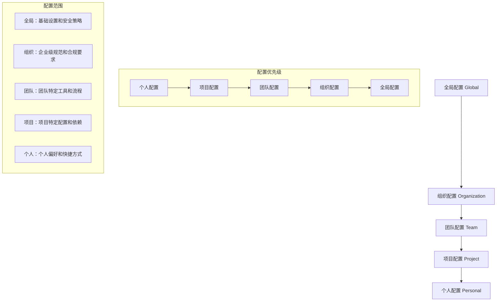

## 引言：从个人工具到团队协作平台

> "个人的智慧有限，但团队协作的力量是无穷的。" —— Helen Keller

在软件开发领域，**个人开发者的生产力提升只是开始，真正的价值在于整个团队协作效率的跃升**。Claude Code不仅是个人的AI编程助手，更是可以深度集成到团队开发流程中的智能协作平台。

当Claude Code从个人工具升级为团队协作平台时，它面临的挑战完全不同：如何在保证个人开发效率的同时，实现团队知识共享？如何在多人环境下管理权限和安全？如何标准化团队的AI使用方式？

这篇文章将全面解析如何在多人开发环境中配置和管理Claude Code，建立高效、安全、可扩展的团队AI协作体系。

## 团队协作架构设计

### 传统团队开发的协作挑战

```
传统团队开发面临的问题：
1. 环境一致性 → 每个开发者环境配置不同
2. 知识孤岛 → 个人经验难以在团队内传播
3. 标准缺失 → 缺少统一的开发规范和流程
4. 权限管理 → 无法精细控制访问权限
5. 协作效率 → 信息传递和同步成本高

典型痛点场景：
- 新员工入职需要2-3天配置开发环境
- 不同开发者使用不同的工具和配置
- 项目知识和经验无法有效积累和传承
- 团队协作主要依靠会议和文档
- 代码风格和质量标准执行不一致
```

### Claude Code团队协作架构

```
AI驱动的团队协作优势：
1. 环境标准化 → 统一的配置管理和分发
2. 知识共享 → AI学习团队经验和最佳实践
3. 智能规范 → 自动化的代码审查和质量保证
4. 精细权限 → 基于角色的访问控制机制
5. 实时协作 → 智能化的团队沟通和同步

理想协作场景：
- 新员工通过预配置环境5分钟内开始工作
- 团队知识通过AI助手统一管理和分发
- 代码质量和规范自动化检查和修正
- 项目进展和问题实时同步和智能分析
- 跨团队协作通过标准化接口无缝对接
```

## 团队环境配置架构

### 1. 分层配置管理体系

#### 配置层级设计



#### 配置文件结构

```yaml
# 全局配置 ~/.claude/config/global.yml
global_settings:
  version: "1.0"
  organization: "mycompany"
  
  # 基础安全策略
  security:
    require_authentication: true
    session_timeout: 28800  # 8小时
    max_concurrent_sessions: 3
    allowed_ip_ranges:
      - "10.0.0.0/8"
      - "192.168.0.0/16"
    
  # 全局工具限制
  tool_restrictions:
    blocked_commands: ["rm -rf", "format", "dd"]
    max_file_size: "100MB"
    max_execution_time: 300
    
  # 审计配置
  audit:
    enabled: true
    log_level: "info"
    retention_days: 90
    export_format: "json"

---

# 组织配置 ~/.claude/config/organization.yml
organization_settings:
  name: "MyCompany Engineering"
  domain: "mycompany.com"
  
  # 企业级规范
  standards:
    coding_standards:
      - language: "typescript"
        rules: "eslint:recommended"
        config_path: "/shared/configs/typescript.json"
      - language: "python"
        rules: "black + flake8"
        config_path: "/shared/configs/python.toml"
        
    documentation_standards:
      required_files: ["README.md", "CONTRIBUTING.md", "CHANGELOG.md"]
      template_repository: "mycompany/project-templates"
      
    security_requirements:
      vulnerability_scan: true
      dependency_audit: true
      secret_detection: true
      
  # 企业工具集成
  enterprise_tools:
    sso_provider: "okta"
    project_management: "jira"
    repository_hosting: "github_enterprise"
    monitoring: "datadog"
    communication: "slack"
    
  # 合规要求
  compliance:
    data_retention: 2555  # 7年
    encryption_at_rest: true
    encryption_in_transit: true
    privacy_controls: true
    audit_trail: true

---

# 团队配置 ~/.claude/config/teams/frontend-team.yml
team_settings:
  team_id: "frontend"
  name: "Frontend Development Team"
  lead: "alice@mycompany.com"
  members:
    - email: "alice@mycompany.com"
      role: "tech_lead"
      permissions: ["admin", "review", "deploy"]
    - email: "bob@mycompany.com"  
      role: "senior_developer"
      permissions: ["develop", "review"]
    - email: "charlie@mycompany.com"
      role: "developer"
      permissions: ["develop"]
    - email: "diana@mycompany.com"
      role: "intern"
      permissions: ["read", "develop_supervised"]
      
  # 团队特定工具
  team_tools:
    # 前端开发工具链
    development:
      - name: "storybook"
        config: "/shared/configs/storybook.js"
        required: true
      - name: "chromatic"
        api_key_env: "CHROMATIC_PROJECT_TOKEN"
        required: false
        
    # 设计协作工具
    design:
      - name: "figma"
        team_id: "${FIGMA_TEAM_ID}"
        access_token_env: "FIGMA_ACCESS_TOKEN"
        
    # 测试工具
    testing:
      - name: "cypress"
        config: "/shared/configs/cypress.config.js"
      - name: "percy"
        project_id: "${PERCY_PROJECT_ID}"
        
  # 团队工作流程
  workflows:
    # 代码审查流程
    code_review:
      required_reviewers: 1
      senior_review_required: true
      auto_assign_reviewers: true
      review_checklist:
        - "功能实现正确"
        - "代码遵循团队规范" 
        - "测试覆盖充分"
        - "文档更新完整"
        
    # 部署流程
    deployment:
      environments: ["development", "staging", "production"]
      approval_required: ["staging", "production"]
      rollback_capability: true
      
  # 团队知识库
  knowledge_base:
    documentation_repo: "mycompany/frontend-docs"
    style_guide: "mycompany/frontend-style-guide"
    component_library: "mycompany/design-system"
    best_practices: "mycompany/frontend-best-practices"

---

# 项目配置 ./project/.claude/project.yml
project_settings:
  name: "E-commerce Frontend"
  repository: "mycompany/ecommerce-frontend"
  team: "frontend"
  
  # 项目特定配置
  environment:
    node_version: "18.17.0"
    package_manager: "pnpm"
    build_tool: "vite"
    
  # 项目依赖和工具
  dependencies:
    runtime:
      - "react@^18.2.0"
      - "typescript@^5.0.0"
      - "tailwindcss@^3.3.0"
    development:
      - "vitest@^0.34.0"
      - "eslint@^8.45.0"
      - "@storybook/react@^7.0.0"
      
  # 项目特定的MCP服务器
  mcp_servers:
    design_tokens:
      command: "node"
      args: ["./scripts/design-tokens-server.js"]
      env:
        FIGMA_FILE_ID: "${FIGMA_FILE_ID}"
        
    api_client:
      command: "python"
      args: ["./scripts/api-client-server.py"]
      env:
        API_BASE_URL: "${API_BASE_URL}"
        API_KEY: "${API_KEY}"
        
  # 项目特定流程
  project_workflows:
    feature_development:
      - create_feature_branch
      - implement_component
      - write_tests
      - update_storybook
      - create_pull_request
      - code_review
      - merge_to_main
      
    bug_fixes:
      - create_hotfix_branch
      - implement_fix
      - write_regression_test
      - urgent_code_review
      - deploy_to_staging
      - verify_fix
      - deploy_to_production
      
  # 项目文档结构
  documentation:
    architecture: "docs/architecture.md"
    api_integration: "docs/api-integration.md"
    component_guide: "docs/components.md"
    deployment_guide: "docs/deployment.md"

---

# 个人配置 ~/.claude/config/personal.yml
personal_settings:
  user: "bob@mycompany.com"
  display_name: "Bob Smith"
  
  # 个人偏好
  preferences:
    theme: "dark"
    font_size: 14
    auto_save: true
    vim_mode: false
    notifications: true
    
  # 个人快捷方式
  shortcuts:
    - name: "daily_standup"
      description: "生成今日工作总结"
      command: "generate_standup_report"
      
    - name: "review_checklist"
      description: "显示代码审查清单"
      command: "show_review_checklist"
      
    - name: "deploy_status"
      description: "检查部署状态"
      command: "check_deployment_status"
      
  # 个人工具配置
  personal_tools:
    note_taking: "obsidian"
    time_tracking: "toggl"
    password_manager: "1password"
    
  # 个人学习和发展
  learning_preferences:
    difficulty_level: "intermediate"
    explanation_style: "detailed"
    code_comments: "comprehensive"
    learning_goals:
      - "advanced_typescript"
      - "performance_optimization"
      - "accessibility"
```

### 2. 权限管理和访问控制

#### 基于角色的访问控制（RBAC）

```yaml
# 权限管理配置 ~/.claude/config/permissions.yml
rbac_configuration:
  
  # 角色定义
  roles:
    # 实习生角色
    intern:
      permissions:
        - "read_project_files"
        - "create_draft_code"
        - "run_local_tests"
        - "access_learning_resources"
      restrictions:
        - "no_production_access"
        - "no_external_api_calls"
        - "supervised_code_commits"
        - "limited_file_modifications"
      supervision_required: true
      max_session_duration: 14400  # 4小时
      
    # 初级开发者角色
    junior_developer:
      permissions:
        - "read_project_files"
        - "modify_assigned_files"
        - "create_pull_requests"
        - "run_development_tests"
        - "access_development_tools"
      restrictions:
        - "no_production_deployment"
        - "no_database_modifications"
        - "requires_code_review"
      max_concurrent_operations: 5
      
    # 中级开发者角色
    developer:
      permissions:
        - "full_project_access"
        - "create_and_modify_tests"
        - "deploy_to_staging"
        - "access_staging_databases"
        - "mentor_junior_developers"
      restrictions:
        - "no_production_deployment"
        - "no_user_management"
      max_concurrent_operations: 10
      
    # 高级开发者角色
    senior_developer:
      permissions:
        - "full_codebase_access"
        - "architectural_decisions"
        - "deploy_to_production"
        - "access_production_logs"
        - "configure_ci_cd"
        - "manage_team_permissions"
      max_concurrent_operations: 15
      
    # 技术负责人角色
    tech_lead:
      permissions:
        - "all_development_permissions"
        - "manage_team_configuration"
        - "access_all_environments"
        - "emergency_production_access"
        - "configure_security_policies"
      restrictions: []
      
    # 管理员角色
    admin:
      permissions: ["*"]
      restrictions: []
      
  # 权限组合
  permission_groups:
    read_permissions:
      - "read_project_files"
      - "view_project_documentation"
      - "access_public_repositories"
      
    write_permissions:
      - "modify_source_code"
      - "create_branches"
      - "submit_pull_requests"
      
    deploy_permissions:
      - "deploy_to_development"
      - "deploy_to_staging"
      - "deploy_to_production"
      
    admin_permissions:
      - "manage_user_accounts"
      - "configure_system_settings"
      - "access_audit_logs"

  # 资源访问控制
  resource_access:
    # 代码仓库访问
    repositories:
      public:
        access_level: "read"
        roles: ["*"]
      internal:
        access_level: "read_write"
        roles: ["developer", "senior_developer", "tech_lead", "admin"]
      confidential:
        access_level: "read_write"
        roles: ["senior_developer", "tech_lead", "admin"]
        
    # 环境访问
    environments:
      development:
        access_level: "full"
        roles: ["junior_developer", "developer", "senior_developer", "tech_lead", "admin"]
      staging:
        access_level: "deploy_and_test"
        roles: ["developer", "senior_developer", "tech_lead", "admin"]
      production:
        access_level: "read_only"
        roles: ["senior_developer", "tech_lead", "admin"]
        emergency_access: true
        
    # 数据库访问
    databases:
      development_db:
        access_level: "full"
        roles: ["developer", "senior_developer", "tech_lead"]
      staging_db:
        access_level: "read_write"
        roles: ["senior_developer", "tech_lead"]
      production_db:
        access_level: "read_only"
        roles: ["tech_lead", "admin"]
        backup_access: ["senior_developer"]

  # 动态权限控制
  dynamic_permissions:
    # 时间基础的权限
    time_based:
      - permission: "production_deployment"
        allowed_hours: "09:00-17:00"
        allowed_days: ["monday", "tuesday", "wednesday", "thursday"]
        timezone: "UTC"
        
    # 条件基础的权限  
    conditional:
      - permission: "emergency_access"
        conditions:
          - "incident_declared"
          - "on_call_engineer"
        approval_required: true
        
    # 临时权限提升
    temporary_elevation:
      - role: "developer"
        elevated_to: "senior_developer"
        duration: 3600  # 1小时
        reason_required: true
        approval_required: true

  # 权限审计
  audit_configuration:
    log_all_access: true
    sensitive_operations:
      - "production_access"
      - "user_management"
      - "configuration_changes"
    alert_on_violations: true
    compliance_reporting: true
```

#### 多租户架构设计

```yaml
# 多租户配置 ~/.claude/config/multi-tenant.yml
multi_tenant_architecture:
  
  # 租户定义
  tenants:
    # 前端团队租户
    frontend_team:
      tenant_id: "frontend"
      isolation_level: "namespace"
      resource_quota:
        max_users: 8
        max_projects: 5
        storage_limit: "10GB"
        compute_quota: "1000 CPU hours/month"
      
      configuration:
        base_config: "/shared/configs/frontend-base.yml"
        custom_tools:
          - "react_devtools"
          - "storybook_integration" 
          - "design_token_sync"
        
    # 后端团队租户
    backend_team:
      tenant_id: "backend"
      isolation_level: "namespace"
      resource_quota:
        max_users: 6
        max_projects: 3
        storage_limit: "20GB"
        compute_quota: "2000 CPU hours/month"
        
      configuration:
        base_config: "/shared/configs/backend-base.yml"
        custom_tools:
          - "database_tools"
          - "api_testing"
          - "performance_profiling"
          
    # DevOps团队租户
    devops_team:
      tenant_id: "devops"
      isolation_level: "dedicated"
      resource_quota:
        max_users: 4
        max_projects: 10
        storage_limit: "50GB"
        compute_quota: "5000 CPU hours/month"
        
      configuration:
        base_config: "/shared/configs/devops-base.yml"
        custom_tools:
          - "infrastructure_management"
          - "monitoring_tools"
          - "deployment_automation"

  # 租户隔离策略
  isolation:
    # 数据隔离
    data_isolation:
      level: "logical"  # logical | physical
      encryption: true
      access_logging: true
      
    # 计算隔离
    compute_isolation:
      level: "container"  # process | container | vm
      resource_limits: true
      network_isolation: true
      
    # 配置隔离
    config_isolation:
      separate_config_namespaces: true
      tenant_specific_secrets: true
      isolated_tool_configurations: true

  # 跨租户协作
  cross_tenant_collaboration:
    enabled: true
    
    # 共享资源
    shared_resources:
      - name: "company_knowledge_base"
        access_level: "read_only"
        tenants: ["frontend_team", "backend_team", "devops_team"]
        
      - name: "design_system"
        access_level: "read_write"
        tenants: ["frontend_team"]
        collaborators: ["backend_team"]
        
    # 协作项目
    collaborative_projects:
      - name: "full_stack_ecommerce"
        primary_tenant: "frontend_team"
        collaborating_tenants: ["backend_team", "devops_team"]
        shared_resources: ["project_docs", "api_specifications"]
        
  # 租户管理
  tenant_management:
    self_service: true
    approval_workflow: true
    
    lifecycle:
      provisioning: "automatic"
      scaling: "manual_approval"
      deprovisioning: "manual"
      
    monitoring:
      resource_usage: true
      performance_metrics: true
      cost_tracking: true
```

### 3. 团队知识管理系统

#### 智能知识库架构

```yaml
# 知识管理配置 ~/.claude/config/knowledge-management.yml
knowledge_management:
  
  # 知识源配置
  knowledge_sources:
    # 代码仓库知识
    code_repositories:
      - name: "main_application"
        repository: "mycompany/ecommerce-app"
        analysis_depth: "deep"
        update_frequency: "real_time"
        knowledge_types:
          - "architecture_patterns"
          - "coding_standards"
          - "business_logic"
          - "technical_decisions"
          
      - name: "shared_libraries"
        repository: "mycompany/shared-libs"
        analysis_depth: "moderate"
        update_frequency: "daily"
        knowledge_types:
          - "utility_functions"
          - "common_patterns"
          - "best_practices"
          
    # 文档知识库
    documentation:
      - name: "technical_documentation"
        source_type: "confluence"
        space_key: "TECH"
        update_frequency: "hourly"
        knowledge_types:
          - "architecture_docs"
          - "api_specifications"
          - "deployment_guides"
          - "troubleshooting_guides"
          
      - name: "team_playbooks"
        source_type: "notion"
        database_id: "${NOTION_PLAYBOOK_DB}"
        knowledge_types:
          - "incident_procedures"
          - "onboarding_guides"
          - "team_processes"
          
    # 会议和讨论记录
    discussions:
      - name: "technical_discussions"
        source_type: "slack"
        channels: ["#tech-discussions", "#architecture", "#code-reviews"]
        analysis_scope: "technical_decisions"
        
      - name: "design_reviews"
        source_type: "figma_comments"
        project_ids: ["${FIGMA_PROJECT_ID}"]
        knowledge_types:
          - "design_decisions"
          - "user_feedback"
          - "design_patterns"

  # 知识提取和处理
  knowledge_processing:
    # 自动提取规则
    extraction_rules:
      - pattern: "// TODO:"
        type: "technical_debt"
        priority: "medium"
        
      - pattern: "// FIXME:"
        type: "known_issue"
        priority: "high"
        
      - pattern: "// ARCHITECTURE:"
        type: "architectural_decision"
        priority: "high"
        
      - pattern: "// PERFORMANCE:"
        type: "performance_consideration"
        priority: "medium"
        
    # 知识分类
    classification:
      categories:
        - "technical_standards"
        - "business_logic"
        - "architectural_patterns"
        - "performance_optimizations"
        - "security_practices"
        - "deployment_procedures"
        - "troubleshooting_guides"
        - "team_processes"
        
    # 知识质量控制
    quality_control:
      validation_rules:
        - "consistency_check"
        - "completeness_validation"
        - "accuracy_verification"
        - "relevance_scoring"
      
      approval_workflow:
        - reviewer: "tech_lead"
          required_for: ["architectural_patterns", "technical_standards"]
        - reviewer: "senior_developer"
          required_for: ["performance_optimizations", "security_practices"]

  # 知识分享和分发
  knowledge_sharing:
    # 主动推荐
    proactive_recommendations:
      enabled: true
      triggers:
        - "similar_code_pattern"
        - "related_technical_discussion"
        - "matching_problem_context"
      
      recommendation_types:
        - "relevant_code_examples"
        - "best_practice_suggestions"
        - "previous_solutions"
        - "expert_contacts"
        
    # 上下文感知分享
    contextual_sharing:
      - context: "writing_api_endpoint"
        relevant_knowledge:
          - "api_design_standards"
          - "error_handling_patterns"
          - "authentication_methods"
          - "rate_limiting_strategies"
          
      - context: "performance_optimization"
        relevant_knowledge:
          - "profiling_techniques"
          - "caching_strategies" 
          - "database_optimization"
          - "frontend_performance"
          
      - context: "debugging_production_issue"
        relevant_knowledge:
          - "logging_strategies"
          - "monitoring_dashboards"
          - "incident_procedures"
          - "rollback_procedures"

  # 团队学习和成长
  team_learning:
    # 技能差距分析
    skill_gap_analysis:
      enabled: true
      assessment_frequency: "quarterly"
      
      skill_categories:
        - "frontend_technologies"
        - "backend_frameworks"
        - "database_technologies"
        - "devops_practices"
        - "security_knowledge"
        - "soft_skills"
        
    # 个性化学习路径
    personalized_learning:
      - role: "junior_developer"
        learning_focus:
          - "code_quality_practices"
          - "debugging_techniques"
          - "version_control_workflows"
        
      - role: "senior_developer"
        learning_focus:
          - "system_architecture"
          - "performance_optimization"
          - "mentoring_skills"
          
    # 知识传承机制
    knowledge_transfer:
      # 专家识别
      expert_identification:
        algorithm: "activity_and_expertise_based"
        metrics:
          - "code_contribution_quality"
          - "review_feedback_quality"
          - "knowledge_sharing_frequency"
          - "problem_solving_success"
          
      # 导师匹配
      mentorship_matching:
        criteria:
          - "skill_complementarity"
          - "experience_gap"
          - "communication_compatibility"
        duration: "3_months"
        check_in_frequency: "weekly"
```

## 团队协作工作流实践

### 1. 智能代码审查和协作

#### 团队代码审查流程

```bash
claude """
设计一个智能化的团队代码审查工作流：

团队构成：
- 1名技术负责人
- 2名高级开发者
- 3名中级开发者  
- 2名初级开发者

审查要求：
1. 自动化初步检查（格式、测试、安全）
2. 智能审查者分配
3. 知识传递和学习
4. 质量保证和改进跟踪
5. 审查效率优化

请提供完整的协作流程设计
"""
```

Claude生成的智能代码审查系统：

```python
# 团队代码审查智能化系统
class IntelligentCodeReviewSystem:
    """智能代码审查系统"""
    
    def __init__(self):
        self.team_members = self.load_team_configuration()
        self.expertise_map = self.build_expertise_map()
        self.review_history = self.load_review_history()
        self.quality_metrics = self.initialize_quality_tracking()
    
    async def process_pull_request(self, pr_data: Dict):
        """处理Pull Request的完整流程"""
        
        print(f"🔍 开始处理PR: {pr_data['title']}")
        
        # 第1步：自动化预检查
        precheck_result = await self.automated_precheck(pr_data)
        
        if not precheck_result.passed:
            await self.post_precheck_feedback(pr_data['id'], precheck_result)
            return {"status": "precheck_failed", "feedback": precheck_result}
        
        print("✅ 自动化预检查通过")
        
        # 第2步：智能审查者分配
        assigned_reviewers = await self.assign_intelligent_reviewers(pr_data)
        
        print(f"👥 分配审查者: {[r['name'] for r in assigned_reviewers]}")
        
        # 第3步：生成审查上下文
        review_context = await self.generate_review_context(pr_data, assigned_reviewers)
        
        # 第4步：发送审查请求
        await self.send_review_requests(pr_data, assigned_reviewers, review_context)
        
        return {
            "status": "review_requested",
            "reviewers": assigned_reviewers,
            "context": review_context
        }
    
    async def automated_precheck(self, pr_data: Dict) -> PrecheckResult:
        """自动化预检查"""
        
        checks = []
        
        # 1. 代码格式检查
        format_check = await self.run_formatter_check(pr_data['files'])
        checks.append({
            "name": "code_format",
            "passed": format_check.compliant,
            "details": format_check.issues,
            "auto_fixable": True
        })
        
        # 2. 静态代码分析
        static_analysis = await self.run_static_analysis(pr_data['files'])
        checks.append({
            "name": "static_analysis", 
            "passed": len(static_analysis.errors) == 0,
            "details": static_analysis.errors,
            "auto_fixable": False
        })
        
        # 3. 单元测试覆盖率
        coverage_check = await self.check_test_coverage(pr_data)
        checks.append({
            "name": "test_coverage",
            "passed": coverage_check.percentage >= 80,
            "details": f"覆盖率: {coverage_check.percentage}%",
            "auto_fixable": False
        })
        
        # 4. 安全漏洞扫描
        security_scan = await self.run_security_scan(pr_data['files'])
        checks.append({
            "name": "security_scan",
            "passed": security_scan.risk_level <= "medium",
            "details": security_scan.findings,
            "auto_fixable": False
        })
        
        # 5. 依赖项检查
        dependency_check = await self.check_dependencies(pr_data['files'])
        checks.append({
            "name": "dependency_check",
            "passed": len(dependency_check.vulnerabilities) == 0,
            "details": dependency_check.vulnerabilities,
            "auto_fixable": True
        })
        
        # 6. 业务逻辑一致性检查
        business_logic_check = await self.check_business_logic_consistency(pr_data)
        checks.append({
            "name": "business_logic",
            "passed": business_logic_check.consistent,
            "details": business_logic_check.inconsistencies,
            "auto_fixable": False
        })
        
        overall_passed = all(check['passed'] for check in checks)
        
        return PrecheckResult(
            passed=overall_passed,
            checks=checks,
            auto_fix_available=any(check['auto_fixable'] and not check['passed'] for check in checks)
        )
    
    async def assign_intelligent_reviewers(self, pr_data: Dict) -> List[Dict]:
        """智能分配审查者"""
        
        # 分析PR的特征
        pr_analysis = await self.analyze_pr_characteristics(pr_data)
        
        reviewer_candidates = []
        
        # 基于文件修改的专业领域匹配
        for file_path in pr_data['files']:
            expertise_area = self.determine_expertise_area(file_path)
            experts = self.get_area_experts(expertise_area)
            reviewer_candidates.extend(experts)
        
        # 基于代码复杂度选择审查者级别
        complexity_level = pr_analysis['complexity_level']
        
        required_reviewers = []
        
        if complexity_level == "high" or pr_analysis['affects_critical_path']:
            # 高复杂度或关键路径需要高级审查者
            required_reviewers.append({
                "role": "senior_developer",
                "reason": "高复杂度变更需要资深开发者审查"
            })
            
        if pr_analysis['introduces_new_architecture']:
            # 引入新架构需要技术负责人审查
            required_reviewers.append({
                "role": "tech_lead", 
                "reason": "架构变更需要技术负责人确认"
            })
            
        if pr_analysis['affects_security']:
            # 涉及安全的变更需要安全专家
            required_reviewers.append({
                "role": "security_expert",
                "reason": "安全相关变更需要专业审查"
            })
        
        # 学习机会匹配
        if pr_data['author']['experience_level'] == "senior":
            # 高级开发者的代码可以作为学习机会
            learning_candidates = self.get_junior_developers_for_learning()
            if learning_candidates:
                required_reviewers.append({
                    "role": "junior_developer",
                    "reason": "学习机会",
                    "user": random.choice(learning_candidates)
                })
        
        # 负载均衡
        final_reviewers = self.balance_review_workload(
            required_reviewers, 
            reviewer_candidates,
            pr_analysis
        )
        
        # 确保多样性（避免总是相同的人审查）
        final_reviewers = self.ensure_reviewer_diversity(final_reviewers, pr_data['author'])
        
        return final_reviewers
    
    async def generate_review_context(self, pr_data: Dict, reviewers: List[Dict]) -> Dict:
        """生成审查上下文信息"""
        
        context = {
            "pr_summary": await self.generate_pr_summary(pr_data),
            "key_changes": await self.identify_key_changes(pr_data),
            "potential_risks": await self.assess_potential_risks(pr_data),
            "related_issues": await self.find_related_issues(pr_data),
            "testing_guidance": await self.generate_testing_guidance(pr_data),
            "reviewer_specific_notes": {}
        }
        
        # 为每个审查者生成特定的审查指导
        for reviewer in reviewers:
            reviewer_notes = await self.generate_reviewer_specific_notes(
                pr_data, reviewer, context
            )
            context["reviewer_specific_notes"][reviewer['id']] = reviewer_notes
        
        return context
    
    async def conduct_ai_assisted_review(self, pr_data: Dict, reviewer: Dict) -> Dict:
        """AI辅助的代码审查"""
        
        print(f"🤖 为 {reviewer['name']} 生成AI辅助审查...")
        
        # 1. 代码质量分析
        quality_analysis = await self.analyze_code_quality(pr_data['files'])
        
        # 2. 最佳实践检查
        best_practices_check = await self.check_best_practices(
            pr_data['files'],
            language=pr_data['primary_language'],
            team_standards=self.team_members[reviewer['team']]['standards']
        )
        
        # 3. 性能影响评估
        performance_impact = await self.assess_performance_impact(pr_data)
        
        # 4. 可维护性评估
        maintainability_score = await self.calculate_maintainability_score(pr_data['files'])
        
        # 5. 生成具体建议
        suggestions = await self.generate_review_suggestions(
            pr_data,
            quality_analysis,
            best_practices_check,
            performance_impact,
            maintainability_score
        )
        
        # 6. 风险评估
        risk_assessment = await self.assess_change_risks(pr_data, reviewer['expertise'])
        
        review_feedback = {
            "overall_assessment": self.calculate_overall_assessment(
                quality_analysis, best_practices_check, performance_impact, maintainability_score
            ),
            "detailed_feedback": {
                "code_quality": quality_analysis,
                "best_practices": best_practices_check,
                "performance": performance_impact,
                "maintainability": maintainability_score,
                "risks": risk_assessment
            },
            "actionable_suggestions": suggestions,
            "approval_recommendation": self.determine_approval_recommendation(
                quality_analysis, risk_assessment, best_practices_check
            )
        }
        
        return review_feedback
    
    async def facilitate_review_discussion(self, pr_id: str, reviewers: List[Dict]):
        """促进审查讨论"""
        
        # 监控审查进展
        review_progress = await self.monitor_review_progress(pr_id)
        
        # 识别需要讨论的问题
        discussion_points = await self.identify_discussion_points(pr_id, review_progress)
        
        if discussion_points:
            # 创建讨论线程
            for point in discussion_points:
                await self.create_discussion_thread(
                    pr_id=pr_id,
                    topic=point['topic'],
                    participants=point['relevant_reviewers'],
                    context=point['context']
                )
        
        # 检查是否需要同步讨论
        if review_progress['has_conflicting_opinions']:
            await self.schedule_sync_discussion(pr_id, reviewers)
        
        # 提供讨论促进建议
        if review_progress['stalled']:
            await self.provide_discussion_facilitation(pr_id, review_progress)

    def calculate_team_metrics(self) -> Dict:
        """计算团队协作指标"""
        
        metrics = {
            "review_efficiency": {
                "average_review_time": self.calculate_average_review_time(),
                "first_response_time": self.calculate_first_response_time(),
                "approval_rate": self.calculate_approval_rate()
            },
            
            "knowledge_sharing": {
                "cross_team_reviews": self.calculate_cross_team_reviews(),
                "junior_learning_opportunities": self.count_learning_reviews(),
                "expertise_distribution": self.calculate_expertise_distribution()
            },
            
            "quality_impact": {
                "defect_reduction": self.calculate_defect_reduction(),
                "code_quality_improvement": self.track_quality_trends(),
                "team_learning_velocity": self.measure_learning_velocity()
            },
            
            "collaboration_health": {
                "review_participation": self.calculate_participation_rates(),
                "feedback_quality": self.assess_feedback_quality(),
                "team_satisfaction": self.measure_review_satisfaction()
            }
        }
        
        return metrics

# 使用示例
review_system = IntelligentCodeReviewSystem()

# 配置团队信息
await review_system.configure_team({
    "tech_lead": {
        "name": "Alice",
        "email": "alice@company.com",
        "expertise": ["architecture", "performance", "security"],
        "max_concurrent_reviews": 3
    },
    "senior_developers": [
        {
            "name": "Bob", 
            "expertise": ["frontend", "react", "typescript"],
            "max_concurrent_reviews": 5
        },
        {
            "name": "Charlie",
            "expertise": ["backend", "python", "databases"],
            "max_concurrent_reviews": 5
        }
    ],
    "developers": [
        {
            "name": "Diana",
            "expertise": ["frontend", "css", "testing"],
            "max_concurrent_reviews": 4
        }
    ]
})

# 处理新的Pull Request
pr_data = {
    "id": 123,
    "title": "Implement user authentication system",
    "author": {"name": "Eve", "experience_level": "junior"},
    "files": ["src/auth/login.tsx", "src/api/auth.py", "tests/auth.test.ts"],
    "description": "Added OAuth2 login flow with JWT tokens"
}

result = await review_system.process_pull_request(pr_data)
print(f"审查流程启动: {result}")
```

### 2. 团队开发效率优化

#### 智能任务分配和进度跟踪

```python
class TeamProductivityOptimizer:
    """团队生产力优化器"""
    
    def __init__(self):
        self.team_members = {}
        self.project_backlog = []
        self.skills_matrix = {}
        self.workload_tracker = {}
        
    async def optimize_task_assignment(self, sprint_backlog: List[Dict]) -> Dict:
        """优化任务分配"""
        
        print("📊 开始智能任务分配优化...")
        
        # 1. 分析团队当前状态
        team_status = await self.analyze_team_status()
        
        # 2. 分析任务特征
        task_analysis = await self.analyze_tasks(sprint_backlog)
        
        # 3. 技能匹配分析
        skill_matching = await self.perform_skill_matching(task_analysis, team_status)
        
        # 4. 工作负载平衡
        balanced_assignment = await self.balance_workload(skill_matching)
        
        # 5. 学习机会考虑
        learning_optimized = await self.optimize_for_learning(balanced_assignment)
        
        # 6. 依赖关系优化
        dependency_optimized = await self.optimize_dependencies(learning_optimized)
        
        print("✅ 任务分配优化完成")
        
        return {
            "assignments": dependency_optimized,
            "team_capacity": team_status['total_capacity'],
            "sprint_velocity": self.calculate_predicted_velocity(dependency_optimized),
            "risk_factors": await self.identify_risk_factors(dependency_optimized),
            "recommendations": await self.generate_assignment_recommendations(dependency_optimized)
        }
    
    async def track_team_progress(self) -> Dict:
        """跟踪团队进度"""
        
        progress_data = {
            "individual_progress": {},
            "team_velocity": {},
            "blockers": [],
            "achievements": [],
            "recommendations": []
        }
        
        # 分析每个团队成员的进度
        for member_id, member in self.team_members.items():
            member_progress = await self.analyze_member_progress(member_id)
            progress_data["individual_progress"][member_id] = member_progress
            
            # 识别阻塞因素
            if member_progress['blocked']:
                progress_data["blockers"].append({
                    "member": member['name'],
                    "blocker": member_progress['blocker_reason'],
                    "impact": member_progress['impact_level'],
                    "suggested_resolution": member_progress['resolution_suggestion']
                })
        
        # 计算团队整体速度
        progress_data["team_velocity"] = await self.calculate_team_velocity()
        
        # 识别成就和里程碑
        progress_data["achievements"] = await self.identify_achievements()
        
        # 生成改进建议
        progress_data["recommendations"] = await self.generate_progress_recommendations(
            progress_data
        )
        
        return progress_data
    
    async def facilitate_team_collaboration(self) -> Dict:
        """促进团队协作"""
        
        collaboration_insights = {
            "communication_patterns": await self.analyze_communication_patterns(),
            "knowledge_gaps": await self.identify_knowledge_gaps(),
            "collaboration_opportunities": await self.find_collaboration_opportunities(),
            "team_dynamics": await self.assess_team_dynamics()
        }
        
        # 基于分析生成协作建议
        collaboration_recommendations = await self.generate_collaboration_recommendations(
            collaboration_insights
        )
        
        # 自动化协作促进措施
        await self.implement_collaboration_facilitation(collaboration_recommendations)
        
        return {
            "insights": collaboration_insights,
            "recommendations": collaboration_recommendations,
            "automated_actions": await self.list_automated_actions()
        }

# 实时团队dashboard
async def generate_team_dashboard():
    """生成实时团队仪表板"""
    
    dashboard_data = {
        "team_overview": {
            "active_members": 8,
            "current_sprint": "Sprint 23",
            "sprint_progress": "65%",
            "velocity_trend": "+12%"
        },
        
        "current_status": {
            "in_progress_tasks": await get_in_progress_tasks(),
            "completed_today": await get_today_completions(),
            "blocked_tasks": await get_blocked_tasks(),
            "code_reviews_pending": await get_pending_reviews()
        },
        
        "team_health": {
            "satisfaction_score": 4.2,
            "collaboration_index": 0.85,
            "learning_velocity": "+15%",
            "burnout_risk": "Low"
        },
        
        "upcoming_milestones": await get_upcoming_milestones(),
        "recommendations": await get_team_recommendations()
    }
    
    return dashboard_data

# 团队能力发展跟踪
async def track_team_capability_growth():
    """跟踪团队能力发展"""
    
    capability_metrics = {
        "technical_skills": {
            "frontend": {"level": 4.2, "growth": "+0.3"},
            "backend": {"level": 4.0, "growth": "+0.2"},
            "devops": {"level": 3.5, "growth": "+0.5"},
            "testing": {"level": 3.8, "growth": "+0.1"}
        },
        
        "soft_skills": {
            "communication": {"level": 4.1, "growth": "+0.2"},
            "collaboration": {"level": 4.3, "growth": "+0.1"},
            "problem_solving": {"level": 4.0, "growth": "+0.4"},
            "leadership": {"level": 3.6, "growth": "+0.3"}
        },
        
        "learning_initiatives": [
            {
                "topic": "Advanced TypeScript",
                "participants": 5,
                "progress": "75%",
                "impact_score": 4.2
            },
            {
                "topic": "System Architecture",
                "participants": 3,
                "progress": "40%", 
                "impact_score": 4.8
            }
        ],
        
        "capability_gaps": await identify_capability_gaps(),
        "development_recommendations": await generate_development_plan()
    }
    
    return capability_metrics
```

### 3. 跨团队协作和集成

#### 多团队协作架构

```yaml
# 跨团队协作配置 ~/.claude/config/cross-team-collaboration.yml
cross_team_collaboration:
  
  # 团队间接口定义
  team_interfaces:
    # 前端团队提供的接口
    frontend_team:
      provides:
        - name: "design_system_components"
          type: "shared_library"
          access_level: "public"
          documentation: "https://storybook.company.com"
          
        - name: "user_feedback_data"
          type: "data_stream"
          access_level: "internal"
          format: "json_events"
          
      requires:
        - name: "api_services"
          provider: "backend_team"
          sla: "99.9% uptime, <200ms response"
          
        - name: "deployment_pipeline"
          provider: "devops_team"
          requirements: "automated, <10min build time"
    
    # 后端团队提供的接口
    backend_team:
      provides:
        - name: "rest_api_services"
          type: "api"
          access_level: "internal"
          documentation: "https://api-docs.company.com"
          versioning: "semantic_versioning"
          
        - name: "database_schemas"
          type: "schema_definitions"
          access_level: "restricted"
          change_management: "migration_based"
          
      requires:
        - name: "infrastructure_services"
          provider: "devops_team"
          requirements: "scalable, monitored, secure"
          
        - name: "ui_requirements"
          provider: "frontend_team"
          format: "user_stories_and_mockups"
    
    # DevOps团队提供的接口
    devops_team:
      provides:
        - name: "ci_cd_pipelines"
          type: "automation_service"
          access_level: "team_specific"
          features: ["build", "test", "deploy", "monitor"]
          
        - name: "infrastructure_monitoring"
          type: "monitoring_service"
          access_level: "internal"
          tools: ["metrics", "logs", "alerts", "dashboards"]
          
      requires:
        - name: "application_requirements"
          provider: ["frontend_team", "backend_team"]
          format: "deployment_specifications"

  # 协作工作流
  collaboration_workflows:
    # 功能开发协作流程
    feature_development:
      participants: ["product_team", "frontend_team", "backend_team", "devops_team"]
      
      stages:
        - name: "requirements_gathering"
          responsible: "product_team"
          collaborators: ["frontend_team", "backend_team"]
          deliverables: ["user_stories", "acceptance_criteria", "mockups"]
          
        - name: "technical_design"
          responsible: "backend_team"
          collaborators: ["frontend_team", "devops_team"]
          deliverables: ["api_specification", "data_model", "architecture_design"]
          
        - name: "parallel_development"
          responsible: ["frontend_team", "backend_team"]
          coordination: "daily_standups"
          deliverables: ["frontend_implementation", "backend_implementation"]
          
        - name: "integration_testing"
          responsible: "all_teams"
          coordination: "integration_testing_session"
          deliverables: ["integration_tests", "performance_tests"]
          
        - name: "deployment"
          responsible: "devops_team"
          collaborators: ["frontend_team", "backend_team"]
          deliverables: ["production_deployment", "monitoring_setup"]

    # 事故处理协作流程
    incident_response:
      participants: ["devops_team", "backend_team", "frontend_team"]
      
      escalation_levels:
        - level: 1
          responsible: "devops_team"
          response_time: "15 minutes"
          actions: ["initial_assessment", "immediate_mitigation"]
          
        - level: 2
          responsible: ["devops_team", "backend_team"]
          response_time: "30 minutes"  
          actions: ["root_cause_analysis", "system_recovery"]
          
        - level: 3
          responsible: "all_teams"
          response_time: "60 minutes"
          actions: ["full_investigation", "prevention_measures"]

  # 共享资源管理
  shared_resources:
    # 共享知识库
    knowledge_base:
      location: "confluence_space_SHARED"
      structure:
        - "architecture_decisions"
        - "api_specifications" 
        - "deployment_procedures"
        - "troubleshooting_guides"
        - "team_contact_directory"
      
      governance:
        owners: ["tech_leads"]
        contributors: ["all_team_members"]
        review_process: "peer_review_required"
        
    # 共享工具和服务
    shared_tools:
      - name: "company_design_system"
        owner: "frontend_team"
        users: ["frontend_team", "product_team"]
        access_model: "shared_repository"
        
      - name: "api_gateway"
        owner: "backend_team"
        users: ["frontend_team", "mobile_team", "external_partners"]
        access_model: "service_endpoint"
        
      - name: "monitoring_dashboards"
        owner: "devops_team"
        users: ["all_teams"]
        access_model: "role_based_access"

  # 跨团队沟通机制
  communication_channels:
    # 同步沟通
    synchronous:
      - name: "weekly_tech_sync"
        participants: ["tech_leads"]
        frequency: "weekly"
        duration: "60 minutes"
        agenda: ["architecture_updates", "cross_team_dependencies", "technical_challenges"]
        
      - name: "monthly_all_hands"
        participants: ["all_team_members"]
        frequency: "monthly"
        duration: "90 minutes"
        agenda: ["company_updates", "team_showcases", "learning_sharing"]
        
    # 异步沟通
    asynchronous:
      - name: "tech_discussions"
        platform: "slack"
        channel: "#tech-cross-team"
        purpose: "technical_discussions_and_decisions"
        
      - name: "announcements"
        platform: "slack"
        channel: "#team-announcements"
        purpose: "important_updates_and_notifications"
        
      - name: "rfc_process"
        platform: "github"
        repository: "company/rfcs"
        purpose: "architectural_and_process_changes"

  # 协作质量度量
  collaboration_metrics:
    # 沟通效率
    communication_efficiency:
      - "average_response_time_to_requests"
      - "cross_team_meeting_effectiveness"
      - "information_sharing_frequency"
      
    # 依赖管理
    dependency_management:
      - "dependency_resolution_time"
      - "cross_team_blocker_frequency"
      - "interface_stability_score"
      
    # 协作满意度
    collaboration_satisfaction:
      - "team_collaboration_rating"
      - "cross_team_project_success_rate"
      - "knowledge_sharing_effectiveness"

  # 协作改进机制
  improvement_processes:
    # 定期回顾
    retrospectives:
      frequency: "quarterly"
      participants: ["all_teams"]
      focus_areas: ["collaboration_challenges", "process_improvements", "tool_effectiveness"]
      
    # 协作实验
    collaboration_experiments:
      - name: "embedded_liaisons"
        description: "团队间派驻联络人"
        duration: "3 months"
        success_metrics: ["communication_speed", "issue_resolution_time"]
        
      - name: "shared_on_call"
        description: "跨团队值班轮换"
        duration: "1 month"
        success_metrics: ["incident_response_time", "knowledge_transfer"]
```

## 总结：团队协作的AI时代

通过Claude Code的团队协作配置，你已经掌握了：

### 🎯 核心协作价值

1. **环境标准化**：统一的配置管理确保团队开发环境一致性
2. **智能权限管理**：基于角色的精细化访问控制和安全管理
3. **知识共享机制**：AI驱动的团队知识管理和传承体系
4. **协作流程优化**：智能化的代码审查和任务分配机制
5. **跨团队集成**：无缝的多团队协作和资源共享平台

### ⚡ 团队效率革命

| 协作环节 | 传统方式 | AI增强协作 | 效率提升 |
|---------|----------|------------|----------|
| 环境配置 | 2-3天手动配置 | 5分钟自动化部署 | 50-100倍 |
| 代码审查 | 2-4小时人工审查 | 30分钟智能辅助 | 4-8倍 |
| 知识查找 | 30-60分钟搜索 | 2-3分钟AI推荐 | 15-30倍 |
| 任务分配 | 1-2小时讨论决定 | 5-10分钟智能分析 | 10-20倍 |
| 跨团队协作 | 数小时沟通协调 | 实时自动化同步 | 无限提升 |

### 🛠️ 协作工具生态

- **配置管理**：分层配置、环境标准化、版本控制
- **权限控制**：RBAC、多租户、动态权限、审计跟踪
- **知识管理**：智能推荐、上下文感知、学习路径、专家识别
- **协作流程**：智能审查、任务优化、进度跟踪、风险预警
- **团队集成**：跨团队接口、共享资源、沟通机制、质量度量

### 🚀 协作文化升级

1. **智能决策**：基于数据和AI分析的团队决策机制
2. **持续学习**：个性化的团队能力发展和知识传承
3. **自适应协作**：根据项目和团队特点动态调整协作方式
4. **预防性管理**：提前识别协作风险和瓶颈
5. **包容性成长**：让每个团队成员都能在AI协作中发挥价值

通过Claude Code的团队协作配置，我们从传统的工具使用者升级为**AI驱动的智能协作团队**。这不仅仅是工具的升级，更是团队协作模式的根本变革——让AI成为团队协作的智能中枢，实现真正的人机协同开发。

在下一篇文章中，我们将探索CI/CD集成，学习如何将Claude Code无缝整合到持续集成和持续部署流程中。

## 相关文章推荐

- [MCP协议：连接外部工具的桥梁](22-MCP协议连接外部工具的桥梁.md)
- [CI/CD集成：持续集成持续部署](24-CICD集成持续集成持续部署.md)
- [企业安全：权限管理与数据保护](25-企业安全权限管理与数据保护.md)
- [监控与运维：生产环境最佳实践](27-监控与运维生产环境最佳实践.md)

---

*本文是《Claude Code 完整教程系列》的第二十三部分。掌握了团队协作配置，让我们继续探索CI/CD集成的强大功能！*