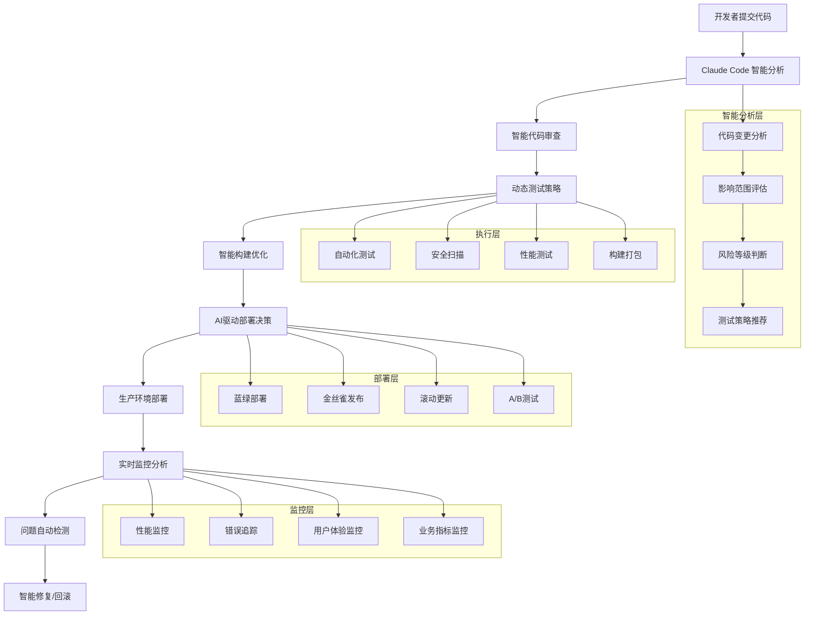

## 引言：从代码到生产的智能化之路

> "软件交付不是终点，而是价值创造的起点。" —— Jez Humble

在现代软件开发中，**从代码提交到生产部署的速度和质量直接决定了团队的竞争力**。传统的CI/CD流水线虽然实现了自动化，但缺少智能决策和自适应优化能力。Claude Code的引入彻底改变了这一状况——让AI成为DevOps流水线的智能大脑。

想象一下：当开发者提交代码时，Claude Code不仅能自动审查代码质量，还能预测潜在风险、智能调整测试策略、动态优化部署方案，甚至在出现问题时自主回滚和修复。这就是AI驱动的智能DevOps的魅力。

这篇文章将全面解析如何将Claude Code深度集成到CI/CD流水线中，打造真正智能化的软件交付体系。

## CI/CD现状与挑战

### 传统CI/CD流水线的局限

```
传统CI/CD面临的核心问题：
1. 规则驱动 → 缺乏智能决策能力
2. 静态配置 → 无法根据情况自适应
3. 人工干预 → 关键节点需要人工判断
4. 反应式处理 → 问题发生后才响应
5. 经验依赖 → 依赖团队经验积累

典型痛点：
- 📊 测试策略固定，无法智能选择重点
- 🔧 部署决策依赖人工判断
- 📈 缺乏基于历史数据的优化
- ⚠️ 问题发现滞后，影响用户体验
- 🔄 回滚决策缺乏智能分析
```

### Claude Code增强的智能CI/CD

```
AI驱动的智能CI/CD优势：
1. 智能决策 → AI分析代码变更影响
2. 自适应调整 → 根据情况动态优化策略
3. 预测性分析 → 提前识别潜在风险
4. 自主修复 → 自动处理常见问题
5. 持续学习 → 基于历史数据不断改进

智能能力：
- 🧠 智能代码审查和风险评估
- 🎯 动态测试策略选择
- 📊 基于AI的部署决策支持
- 🔍 实时监控和异常检测
- 🤖 自动化问题诊断和修复
```

## CI/CD集成架构设计

### 1. 整体架构概览

#### 智能CI/CD流水线架构



### 2. 智能CI集成配置

#### GitHub Actions集成示例

```yaml
# .github/workflows/claude-ci.yml
name: Claude Code Intelligent CI

on:
  push:
    branches: [ main, develop ]
  pull_request:
    branches: [ main ]
  schedule:
    - cron: '0 2 * * *'  # 每日凌晨2点执行全面检查

env:
  CLAUDE_API_KEY: ${{ secrets.CLAUDE_API_KEY }}
  NODE_VERSION: '18'
  PYTHON_VERSION: '3.11'

jobs:
  # 阶段1：智能代码分析
  intelligent-analysis:
    runs-on: ubuntu-latest
    outputs:
      risk-level: ${{ steps.claude-analysis.outputs.risk-level }}
      test-strategy: ${{ steps.claude-analysis.outputs.test-strategy }}
      deployment-recommendation: ${{ steps.claude-analysis.outputs.deployment-recommendation }}
      affected-modules: ${{ steps.claude-analysis.outputs.affected-modules }}
    
    steps:
      - name: Checkout code
        uses: actions/checkout@v4
        with:
          fetch-depth: 0  # 获取完整历史用于分析
      
      - name: Setup Claude Code
        uses: anthropics/setup-claude-code@v1
        with:
          api-key: ${{ env.CLAUDE_API_KEY }}
          version: 'latest'
      
      - name: 智能代码变更分析
        id: claude-analysis
        run: |
          echo "🧠 Claude Code 智能分析开始..."
          
          # 获取变更信息
          CHANGED_FILES=$(git diff --name-only HEAD~1)
          COMMIT_MESSAGE=$(git log -1 --pretty=%B)
          
          # Claude Code 分析代码变更
          claude analyze-change \
            --files="$CHANGED_FILES" \
            --commit-message="$COMMIT_MESSAGE" \
            --branch=${{ github.ref_name }} \
            --output-format=json > analysis-result.json
          
          # 提取分析结果
          RISK_LEVEL=$(jq -r '.risk_level' analysis-result.json)
          TEST_STRATEGY=$(jq -r '.test_strategy' analysis-result.json)
          DEPLOYMENT_REC=$(jq -r '.deployment_recommendation' analysis-result.json)
          AFFECTED_MODULES=$(jq -r '.affected_modules | join(",")' analysis-result.json)
          
          echo "risk-level=$RISK_LEVEL" >> $GITHUB_OUTPUT
          echo "test-strategy=$TEST_STRATEGY" >> $GITHUB_OUTPUT
          echo "deployment-recommendation=$DEPLOYMENT_REC" >> $GITHUB_OUTPUT
          echo "affected-modules=$AFFECTED_MODULES" >> $GITHUB_OUTPUT
          
          echo "📊 分析结果："
          echo "  风险等级: $RISK_LEVEL"
          echo "  测试策略: $TEST_STRATEGY"
          echo "  部署建议: $DEPLOYMENT_REC"
          echo "  影响模块: $AFFECTED_MODULES"
      
      - name: 生成智能测试计划
        run: |
          claude generate-test-plan \
            --risk-level="${{ steps.claude-analysis.outputs.risk-level }}" \
            --affected-modules="${{ steps.claude-analysis.outputs.affected-modules }}" \
            --output-file=test-plan.json
          
          echo "📋 智能测试计划已生成"
          cat test-plan.json | jq '.'
      
      - name: Upload analysis artifacts
        uses: actions/upload-artifact@v3
        with:
          name: claude-analysis
          path: |
            analysis-result.json
            test-plan.json

  # 阶段2：智能代码审查
  intelligent-code-review:
    runs-on: ubuntu-latest
    needs: intelligent-analysis
    if: ${{ needs.intelligent-analysis.outputs.risk-level != 'low' }}
    
    steps:
      - name: Checkout code
        uses: actions/checkout@v4
      
      - name: Setup Claude Code
        uses: anthropics/setup-claude-code@v1
        with:
          api-key: ${{ env.CLAUDE_API_KEY }}
      
      - name: 智能代码审查
        run: |
          echo "🔍 开始智能代码审查..."
          
          # 全面代码审查
          claude review-code \
            --scope=changed-files \
            --depth=deep \
            --include-security \
            --include-performance \
            --output-format=github-comment > review-comment.md
          
          # 检查是否有阻塞问题
          BLOCKING_ISSUES=$(claude review-code --scope=changed-files --check-blocking --output-format=json | jq -r '.blocking_issues | length')
          
          if [ "$BLOCKING_ISSUES" -gt 0 ]; then
            echo "❌ 发现阻塞性问题，需要修复后才能继续"
            claude review-code --scope=changed-files --check-blocking --output-format=text
            exit 1
          fi
          
          echo "✅ 代码审查通过"
      
      - name: 发布审查评论
        if: github.event_name == 'pull_request'
        uses: actions/github-script@v6
        with:
          script: |
            const fs = require('fs');
            const reviewComment = fs.readFileSync('review-comment.md', 'utf8');
            
            github.rest.issues.createComment({
              issue_number: context.issue.number,
              owner: context.repo.owner,
              repo: context.repo.repo,
              body: reviewComment
            });

  # 阶段3：动态测试执行
  dynamic-testing:
    runs-on: ubuntu-latest
    needs: intelligent-analysis
    strategy:
      matrix:
        test-type: ${{ fromJson(needs.intelligent-analysis.outputs.test-strategy) }}
    
    steps:
      - name: Checkout code
        uses: actions/checkout@v4
      
      - name: Setup Node.js
        uses: actions/setup-node@v3
        with:
          node-version: ${{ env.NODE_VERSION }}
          cache: 'npm'
      
      - name: Setup Python
        uses: actions/setup-python@v4
        with:
          python-version: ${{ env.PYTHON_VERSION }}
          cache: 'pip'
      
      - name: Install dependencies
        run: |
          npm ci
          pip install -r requirements.txt
      
      - name: Setup Claude Code
        uses: anthropics/setup-claude-code@v1
        with:
          api-key: ${{ env.CLAUDE_API_KEY }}
      
      - name: 执行智能测试
        run: |
          echo "🧪 执行测试类型: ${{ matrix.test-type }}"
          
          case "${{ matrix.test-type }}" in
            "unit")
              echo "🔬 执行单元测试"
              claude test-runner \
                --type=unit \
                --coverage-threshold=80 \
                --parallel \
                --smart-selection
              ;;
            "integration")
              echo "🔗 执行集成测试"
              claude test-runner \
                --type=integration \
                --affected-modules="${{ needs.intelligent-analysis.outputs.affected-modules }}" \
                --timeout=300
              ;;
            "e2e")
              echo "🎭 执行端到端测试"
              claude test-runner \
                --type=e2e \
                --browser=chrome \
                --headless \
                --critical-paths-only
              ;;
            "performance")
              echo "⚡ 执行性能测试"
              claude performance-test \
                --baseline=main \
                --threshold=10% \
                --metrics=response-time,memory,cpu
              ;;
            "security")
              echo "🔒 执行安全测试"
              claude security-scan \
                --include-dependencies \
                --check-vulnerabilities \
                --compliance-check
              ;;
          esac
      
      - name: 上传测试结果
        uses: actions/upload-artifact@v3
        if: always()
        with:
          name: test-results-${{ matrix.test-type }}
          path: |
            test-results/
            coverage-reports/
            performance-reports/
            security-reports/

  # 阶段4：智能构建优化
  intelligent-build:
    runs-on: ubuntu-latest
    needs: [intelligent-analysis, dynamic-testing]
    if: success()
    
    steps:
      - name: Checkout code
        uses: actions/checkout@v4
      
      - name: Setup build environment
        run: |
          # 根据项目类型设置构建环境
          if [ -f "package.json" ]; then
            echo "LANG=nodejs" >> $GITHUB_ENV
          elif [ -f "requirements.txt" ]; then
            echo "LANG=python" >> $GITHUB_ENV
          elif [ -f "go.mod" ]; then
            echo "LANG=go" >> $GITHUB_ENV
          fi
      
      - name: Setup Claude Code
        uses: anthropics/setup-claude-code@v1
        with:
          api-key: ${{ env.CLAUDE_API_KEY }}
      
      - name: 智能构建优化
        run: |
          echo "🏗️ 开始智能构建..."
          
          # 分析构建配置并优化
          claude optimize-build \
            --language=${{ env.LANG }} \
            --target=production \
            --optimize-for=size,speed \
            --generate-config
          
          # 执行优化后的构建
          claude build \
            --use-optimized-config \
            --parallel \
            --cache-enabled \
            --output-dir=dist
          
          echo "✅ 构建完成"
      
      - name: 构建产物分析
        run: |
          echo "📦 分析构建产物..."
          
          claude analyze-artifacts \
            --directory=dist \
            --check-size \
            --check-security \
            --generate-report > build-analysis.json
          
          echo "构建产物分析结果："
          cat build-analysis.json | jq '.'
      
      - name: Upload build artifacts
        uses: actions/upload-artifact@v3
        with:
          name: build-artifacts
          path: |
            dist/
            build-analysis.json

  # 阶段5：部署就绪性检查
  deployment-readiness:
    runs-on: ubuntu-latest
    needs: [intelligent-analysis, intelligent-build]
    if: success()
    outputs:
      ready-for-deployment: ${{ steps.readiness-check.outputs.ready }}
      deployment-strategy: ${{ steps.readiness-check.outputs.strategy }}
    
    steps:
      - name: Download artifacts
        uses: actions/download-artifact@v3
        with:
          name: claude-analysis
      
      - name: Setup Claude Code
        uses: anthropics/setup-claude-code@v1
        with:
          api-key: ${{ env.CLAUDE_API_KEY }}
      
      - name: 部署就绪性检查
        id: readiness-check
        run: |
          echo "🎯 检查部署就绪性..."
          
          # 综合分析所有检查结果
          claude deployment-readiness-check \
            --analysis-file=analysis-result.json \
            --test-results-dir=test-results \
            --build-artifacts=dist \
            --output-format=json > readiness-result.json
          
          READY=$(jq -r '.ready' readiness-result.json)
          STRATEGY=$(jq -r '.recommended_strategy' readiness-result.json)
          
          echo "ready=$READY" >> $GITHUB_OUTPUT
          echo "strategy=$STRATEGY" >> $GITHUB_OUTPUT
          
          echo "📊 部署就绪性检查结果："
          echo "  就绪状态: $READY"
          echo "  推荐策略: $STRATEGY"
          
          if [ "$READY" = "false" ]; then
            echo "❌ 部署条件不满足"
            jq -r '.blocking_reasons[]' readiness-result.json
            exit 1
          fi
          
          echo "✅ 部署条件满足"
```

### 3. 智能部署策略

#### 多环境部署配置

```yaml
# .github/workflows/claude-cd.yml
name: Claude Code Intelligent CD

on:
  workflow_run:
    workflows: ["Claude Code Intelligent CI"]
    types: [completed]
    branches: [main]

env:
  CLAUDE_API_KEY: ${{ secrets.CLAUDE_API_KEY }}

jobs:
  # 智能部署决策
  deployment-strategy:
    runs-on: ubuntu-latest
    if: ${{ github.event.workflow_run.conclusion == 'success' }}
    outputs:
      strategy: ${{ steps.deploy-strategy.outputs.strategy }}
      target-environments: ${{ steps.deploy-strategy.outputs.environments }}
      rollout-plan: ${{ steps.deploy-strategy.outputs.rollout-plan }}
    
    steps:
      - name: Checkout code
        uses: actions/checkout@v4
      
      - name: Setup Claude Code
        uses: anthropics/setup-claude-code@v1
        with:
          api-key: ${{ env.CLAUDE_API_KEY }}
      
      - name: 智能部署策略决策
        id: deploy-strategy
        run: |
          echo "🎯 制定智能部署策略..."
          
          # 分析历史部署数据和当前变更
          claude analyze-deployment-context \
            --branch=main \
            --include-history=30d \
            --risk-factors \
            --output-format=json > deployment-context.json
          
          # 基于分析结果制定部署策略
          claude recommend-deployment-strategy \
            --context-file=deployment-context.json \
            --target-environments=staging,production \
            --business-hours-constraint \
            --output-format=json > strategy-result.json
          
          STRATEGY=$(jq -r '.strategy' strategy-result.json)
          ENVIRONMENTS=$(jq -r '.target_environments | join(",")' strategy-result.json)
          ROLLOUT_PLAN=$(jq -r '.rollout_plan' strategy-result.json)
          
          echo "strategy=$STRATEGY" >> $GITHUB_OUTPUT
          echo "environments=$ENVIRONMENTS" >> $GITHUB_OUTPUT
          echo "rollout-plan=$ROLLOUT_PLAN" >> $GITHUB_OUTPUT
          
          echo "📋 部署策略："
          echo "  策略类型: $STRATEGY"
          echo "  目标环境: $ENVIRONMENTS"
          echo "  发布计划: $ROLLOUT_PLAN"

  # 分阶段部署
  deploy-staging:
    runs-on: ubuntu-latest
    needs: deployment-strategy
    if: contains(needs.deployment-strategy.outputs.target-environments, 'staging')
    environment: staging
    
    steps:
      - name: Checkout code
        uses: actions/checkout@v4
      
      - name: Setup Claude Code
        uses: anthropics/setup-claude-code@v1
        with:
          api-key: ${{ env.CLAUDE_API_KEY }}
      
      - name: 部署到Staging环境
        run: |
          echo "🚀 部署到 Staging 环境..."
          
          # 准备部署配置
          claude prepare-deployment \
            --environment=staging \
            --strategy="${{ needs.deployment-strategy.outputs.strategy }}" \
            --generate-config
          
          # 执行部署
          claude deploy \
            --environment=staging \
            --config=staging-deploy.yml \
            --monitor-health \
            --timeout=600
          
          echo "✅ Staging 部署完成"
      
      - name: 部署后验证
        run: |
          echo "🔍 执行部署后验证..."
          
          # 健康检查
          claude health-check \
            --environment=staging \
            --endpoints=api,web,health \
            --timeout=300
          
          # 烟雾测试
          claude smoke-test \
            --environment=staging \
            --test-suite=critical-paths \
            --parallel
          
          # 性能基准验证
          claude performance-validation \
            --environment=staging \
            --baseline=production \
            --threshold=15%
          
          echo "✅ 部署验证通过"

  # 生产环境部署（需要审批）
  deploy-production:
    runs-on: ubuntu-latest
    needs: [deployment-strategy, deploy-staging]
    if: success() && contains(needs.deployment-strategy.outputs.target-environments, 'production')
    environment: production
    
    steps:
      - name: Checkout code
        uses: actions/checkout@v4
      
      - name: Setup Claude Code
        uses: anthropics/setup-claude-code@v1
        with:
          api-key: ${{ env.CLAUDE_API_KEY }}
      
      - name: 生产部署前检查
        run: |
          echo "🔍 生产环境部署前检查..."
          
          # 最终部署就绪性检查
          claude pre-production-check \
            --staging-validation=passed \
            --security-scan=passed \
            --performance-baseline=acceptable \
            --business-impact-assessment
          
          # 部署时机检查
          claude deployment-timing-check \
            --avoid-business-hours \
            --check-traffic-patterns \
            --consider-team-availability
          
          echo "✅ 生产部署前检查通过"
      
      - name: 智能生产部署
        run: |
          echo "🌟 开始生产环境智能部署..."
          
          STRATEGY="${{ needs.deployment-strategy.outputs.strategy }}"
          
          case "$STRATEGY" in
            "blue-green")
              echo "🔵🟢 执行蓝绿部署"
              claude deploy-blue-green \
                --environment=production \
                --health-check-endpoints \
                --traffic-switch-strategy=gradual \
                --rollback-on-failure
              ;;
            "canary")
              echo "🐤 执行金丝雀部署"
              claude deploy-canary \
                --environment=production \
                --canary-percentage=5 \
                --ramp-up-duration=30m \
                --success-criteria=error-rate:1%,response-time:2s
              ;;
            "rolling")
              echo "🔄 执行滚动部署"
              claude deploy-rolling \
                --environment=production \
                --batch-size=2 \
                --health-check-delay=60s \
                --max-unavailable=1
              ;;
          esac
          
          echo "✅ 生产部署完成"
      
      - name: 部署后监控
        run: |
          echo "📊 启动部署后监控..."
          
          # 启动智能监控
          claude start-post-deployment-monitoring \
            --environment=production \
            --duration=2h \
            --alert-threshold=strict \
            --auto-rollback-conditions="error-rate:3%,response-time:5s"
          
          echo "🎯 监控已启动，将持续2小时"

  # 部署成功通知
  deployment-notification:
    runs-on: ubuntu-latest
    needs: [deploy-production]
    if: success()
    
    steps:
      - name: Setup Claude Code
        uses: anthropics/setup-claude-code@v1
        with:
          api-key: ${{ env.CLAUDE_API_KEY }}
      
      - name: 生成部署报告
        run: |
          echo "📊 生成部署成功报告..."
          
          claude generate-deployment-report \
            --deployment-id=${{ github.run_id }} \
            --environments=staging,production \
            --include-metrics \
            --include-timeline \
            --output-format=markdown > deployment-report.md
          
          echo "部署报告已生成"
      
      - name: 发送通知
        run: |
          # 发送Slack通知
          claude notify \
            --channel=deployments \
            --template=deployment-success \
            --attach-report=deployment-report.md \
            --include-metrics
          
          # 更新项目dashboard
          claude update-dashboard \
            --project=main \
            --status=deployed \
            --version=${{ github.sha }} \
            --timestamp=$(date -u +"%Y-%m-%dT%H:%M:%SZ")
          
          echo "✅ 通知已发送"
```

## 实际应用场景

### 场景1：智能发布决策系统

```bash
claude """
分析当前代码变更的发布风险，并推荐最适合的发布策略：

变更内容：
- 修复了用户登录模块的安全漏洞
- 优化了数据库查询性能  
- 更新了前端依赖包版本
- 添加了新的API端点

请评估风险等级并推荐发布策略
"""
```

Claude Code的智能分析过程：

```python
# 智能发布决策系统
class IntelligentReleaseDecisionSystem:
    """智能发布决策系统"""
    
    def __init__(self):
        self.risk_analyzer = RiskAnalyzer()
        self.strategy_recommender = StrategyRecommender()
        self.historical_analyzer = HistoricalAnalyzer()
        self.business_impact_assessor = BusinessImpactAssessor()
    
    async def analyze_release_readiness(self, change_context: Dict) -> Dict:
        """分析发布就绪性"""
        
        print("🧠 开始智能发布分析...")
        
        # 1. 代码变更分析
        code_analysis = await self.analyze_code_changes(change_context)
        print(f"📊 代码变更分析完成:")
        print(f"  - 变更文件数: {code_analysis['files_changed']}")
        print(f"  - 代码行数变更: +{code_analysis['lines_added']} -{code_analysis['lines_removed']}")
        print(f"  - 复杂度变化: {code_analysis['complexity_change']}")
        
        # 2. 风险等级评估
        risk_assessment = await self.risk_analyzer.assess_risk(change_context)
        print(f"⚠️ 风险评估结果:")
        print(f"  - 总体风险: {risk_assessment['overall_risk']}")
        print(f"  - 安全风险: {risk_assessment['security_risk']}")
        print(f"  - 性能风险: {risk_assessment['performance_risk']}")
        print(f"  - 兼容性风险: {risk_assessment['compatibility_risk']}")
        
        # 3. 历史数据分析
        historical_insights = await self.historical_analyzer.analyze_similar_releases(
            change_context
        )
        print(f"📈 历史数据洞察:")
        print(f"  - 相似发布成功率: {historical_insights['success_rate']:.1%}")
        print(f"  - 平均回滚率: {historical_insights['rollback_rate']:.1%}")
        print(f"  - 用户影响程度: {historical_insights['user_impact']}")
        
        # 4. 业务影响评估
        business_impact = await self.business_impact_assessor.assess_impact(
            change_context, risk_assessment
        )
        print(f"💼 业务影响评估:")
        print(f"  - 潜在收益: {business_impact['potential_benefits']}")
        print(f"  - 风险成本: {business_impact['risk_cost']}")
        print(f"  - 紧急程度: {business_impact['urgency']}")
        
        # 5. 发布策略推荐
        strategy_recommendation = await self.strategy_recommender.recommend_strategy(
            code_analysis, risk_assessment, historical_insights, business_impact
        )
        
        print(f"🎯 发布策略推荐:")
        print(f"  - 推荐策略: {strategy_recommendation['strategy']}")
        print(f"  - 发布时机: {strategy_recommendation['timing']}")
        print(f"  - 发布范围: {strategy_recommendation['scope']}")
        print(f"  - 监控重点: {strategy_recommendation['monitoring_focus']}")
        
        return {
            "analysis_timestamp": datetime.now().isoformat(),
            "code_analysis": code_analysis,
            "risk_assessment": risk_assessment,
            "historical_insights": historical_insights,
            "business_impact": business_impact,
            "strategy_recommendation": strategy_recommendation,
            "confidence_score": strategy_recommendation['confidence']
        }
    
    async def analyze_code_changes(self, change_context: Dict) -> Dict:
        """分析代码变更"""
        
        changed_files = change_context.get('changed_files', [])
        commit_messages = change_context.get('commit_messages', [])
        
        analysis = {
            "files_changed": len(changed_files),
            "lines_added": 0,
            "lines_removed": 0,
            "complexity_change": "低",
            "critical_files_affected": [],
            "change_categories": [],
            "test_coverage_impact": "无影响"
        }
        
        # 分析变更类型
        change_categories = set()
        critical_files = []
        
        for file_path in changed_files:
            if any(keyword in file_path.lower() for keyword in ['auth', 'login', 'security']):
                critical_files.append(file_path)
                change_categories.add('security')
            elif any(keyword in file_path.lower() for keyword in ['database', 'query', 'sql']):
                change_categories.add('performance')
            elif any(keyword in file_path.lower() for keyword in ['api', 'endpoint']):
                change_categories.add('api_change')
            elif 'package.json' in file_path or 'requirements.txt' in file_path:
                change_categories.add('dependency_update')
        
        analysis["critical_files_affected"] = critical_files
        analysis["change_categories"] = list(change_categories)
        
        # 根据变更类型调整复杂度评估
        if 'security' in change_categories:
            analysis["complexity_change"] = "高"
        elif len(change_categories) > 2:
            analysis["complexity_change"] = "中"
        
        return analysis

class RiskAnalyzer:
    """风险分析器"""
    
    async def assess_risk(self, change_context: Dict) -> Dict:
        """评估发布风险"""
        
        risk_factors = {
            "security_risk": "低",
            "performance_risk": "低", 
            "compatibility_risk": "低",
            "operational_risk": "低",
            "overall_risk": "低"
        }
        
        changed_files = change_context.get('changed_files', [])
        change_categories = change_context.get('change_categories', [])
        
        # 安全风险评估
        if 'security' in change_categories:
            risk_factors["security_risk"] = "中"
            if any('auth' in f.lower() for f in changed_files):
                risk_factors["security_risk"] = "高"
        
        # 性能风险评估
        if 'performance' in change_categories:
            risk_factors["performance_risk"] = "中"
            if any('database' in f.lower() for f in changed_files):
                risk_factors["performance_risk"] = "高"
        
        # 兼容性风险评估
        if 'dependency_update' in change_categories:
            risk_factors["compatibility_risk"] = "中"
        if 'api_change' in change_categories:
            risk_factors["compatibility_risk"] = "高"
        
        # 计算总体风险
        risk_levels = {"低": 1, "中": 2, "高": 3}
        avg_risk = sum(risk_levels[risk] for risk in [
            risk_factors["security_risk"],
            risk_factors["performance_risk"], 
            risk_factors["compatibility_risk"],
            risk_factors["operational_risk"]
        ]) / 4
        
        if avg_risk >= 2.5:
            risk_factors["overall_risk"] = "高"
        elif avg_risk >= 1.5:
            risk_factors["overall_risk"] = "中"
        
        return risk_factors

class StrategyRecommender:
    """策略推荐器"""
    
    async def recommend_strategy(self, code_analysis: Dict, risk_assessment: Dict, 
                               historical_insights: Dict, business_impact: Dict) -> Dict:
        """推荐发布策略"""
        
        overall_risk = risk_assessment["overall_risk"]
        urgency = business_impact["urgency"]
        success_rate = historical_insights["success_rate"]
        
        # 基于风险和紧急程度选择策略
        if overall_risk == "高":
            if urgency == "紧急":
                strategy = "canary"  # 金丝雀发布，谨慎推进
                scope = "limited"
            else:
                strategy = "blue-green"  # 蓝绿发布，可快速回滚
                scope = "full"
        elif overall_risk == "中":
            if success_rate > 0.9:
                strategy = "rolling"  # 滚动发布
                scope = "full"
            else:
                strategy = "canary"
                scope = "gradual"
        else:  # 低风险
            strategy = "rolling"
            scope = "full"
        
        # 发布时机建议
        if urgency == "紧急":
            timing = "immediate"
        elif overall_risk == "高":
            timing = "off-peak-hours"
        else:
            timing = "business-hours"
        
        # 监控重点
        monitoring_focus = []
        if risk_assessment["security_risk"] in ["中", "高"]:
            monitoring_focus.append("security_metrics")
        if risk_assessment["performance_risk"] in ["中", "高"]:
            monitoring_focus.append("performance_metrics")
        if risk_assessment["compatibility_risk"] in ["中", "高"]:
            monitoring_focus.append("error_rates")
        
        # 信心度计算
        confidence_factors = [
            success_rate,  # 历史成功率
            1.0 if overall_risk == "低" else 0.7 if overall_risk == "中" else 0.4,  # 风险调整
            1.0 if len(code_analysis["critical_files_affected"]) == 0 else 0.8  # 关键文件影响
        ]
        confidence = sum(confidence_factors) / len(confidence_factors)
        
        return {
            "strategy": strategy,
            "timing": timing,
            "scope": scope,
            "monitoring_focus": monitoring_focus,
            "confidence": confidence,
            "rationale": self._generate_rationale(
                strategy, overall_risk, urgency, success_rate
            )
        }
    
    def _generate_rationale(self, strategy: str, risk: str, urgency: str, success_rate: float) -> str:
        """生成推荐理由"""
        reasons = []
        
        if strategy == "canary":
            reasons.append(f"考虑到{risk}风险等级，建议采用金丝雀发布逐步验证")
        elif strategy == "blue-green":
            reasons.append(f"蓝绿发布可以在{risk}风险情况下实现快速回滚")
        elif strategy == "rolling":
            reasons.append(f"基于{success_rate:.1%}的历史成功率，滚动发布是最优选择")
        
        if urgency == "紧急":
            reasons.append("紧急程度要求快速发布")
        
        return "；".join(reasons)

# 使用示例
async def demo_intelligent_release_decision():
    """演示智能发布决策"""
    
    system = IntelligentReleaseDecisionSystem()
    
    # 模拟变更上下文
    change_context = {
        "changed_files": [
            "src/auth/login.py",
            "src/database/user_queries.sql", 
            "src/api/endpoints/user.py",
            "package.json"
        ],
        "commit_messages": [
            "fix: 修复用户登录安全漏洞",
            "perf: 优化用户查询性能",
            "feat: 添加新的用户API端点",
            "chore: 更新依赖包版本"
        ],
        "change_categories": ["security", "performance", "api_change", "dependency_update"],
        "branch": "main",
        "author": "dev-team"
    }
    
    # 执行智能分析
    result = await system.analyze_release_readiness(change_context)
    
    print(f"\n🎯 最终发布建议:")
    print(f"  策略: {result['strategy_recommendation']['strategy']}")
    print(f"  时机: {result['strategy_recommendation']['timing']}")
    print(f"  范围: {result['strategy_recommendation']['scope']}")
    print(f"  信心度: {result['strategy_recommendation']['confidence']:.1%}")
    print(f"  理由: {result['strategy_recommendation']['rationale']}")
    
    return result

# 执行演示
await demo_intelligent_release_decision()
```

### 场景2：自动化回滚决策系统

```python
class AutomatedRollbackSystem:
    """自动化回滚决策系统"""
    
    def __init__(self):
        self.monitoring_system = MonitoringSystem()
        self.decision_engine = RollbackDecisionEngine()
        self.rollback_executor = RollbackExecutor()
        
    async def monitor_deployment(self, deployment_id: str, duration_minutes: int = 30):
        """监控部署状态并自动决策回滚"""
        
        print(f"📊 开始监控部署 {deployment_id}，持续 {duration_minutes} 分钟")
        
        start_time = datetime.now()
        end_time = start_time + timedelta(minutes=duration_minutes)
        
        while datetime.now() < end_time:
            # 收集监控数据
            metrics = await self.monitoring_system.collect_metrics(deployment_id)
            
            # 分析是否需要回滚
            rollback_decision = await self.decision_engine.should_rollback(
                metrics, deployment_id
            )
            
            if rollback_decision['should_rollback']:
                print(f"🚨 检测到严重问题，触发自动回滚:")
                print(f"  触发原因: {rollback_decision['reasons']}")
                print(f"  严重程度: {rollback_decision['severity']}")
                
                # 执行自动回滚
                rollback_result = await self.rollback_executor.execute_rollback(
                    deployment_id, rollback_decision
                )
                
                if rollback_result['success']:
                    print(f"✅ 自动回滚成功:")
                    print(f"  回滚时间: {rollback_result['duration']}")
                    print(f"  恢复状态: {rollback_result['health_status']}")
                    
                    # 发送通知
                    await self.send_rollback_notification(
                        deployment_id, rollback_decision, rollback_result
                    )
                    
                    return rollback_result
                else:
                    print(f"❌ 自动回滚失败，需要人工介入:")
                    print(f"  失败原因: {rollback_result['error']}")
                    
                    # 发送紧急通知
                    await self.send_emergency_notification(
                        deployment_id, rollback_result
                    )
                    
                    return rollback_result
            
            # 等待下一次检查
            await asyncio.sleep(30)  # 每30秒检查一次
        
        print(f"✅ 部署监控完成，未发现需要回滚的问题")
        return {"success": True, "action": "monitoring_completed"}
    
    async def send_rollback_notification(self, deployment_id: str, 
                                       decision: Dict, result: Dict):
        """发送回滚通知"""
        
        message = f"""
🚨 **自动回滚执行通知**

**部署ID**: {deployment_id}
**触发时间**: {datetime.now().strftime('%Y-%m-%d %H:%M:%S')}
**触发原因**: {', '.join(decision['reasons'])}
**严重程度**: {decision['severity']}

**回滚结果**:
- 执行状态: {'成功' if result['success'] else '失败'}
- 耗时: {result['duration']}
- 系统状态: {result['health_status']}

**后续行动**:
1. 调查问题根因
2. 修复相关问题
3. 重新部署修复版本

*此通知由 Claude Code 自动回滚系统生成*
        """
        
        # 发送到 Slack
        await self.send_slack_notification(
            channel="#deployments",
            message=message,
            severity="warning"
        )
        
        # 发送邮件给关键人员
        await self.send_email_notification(
            recipients=["devops@company.com", "oncall@company.com"],
            subject=f"自动回滚执行 - {deployment_id}",
            body=message
        )

class RollbackDecisionEngine:
    """回滚决策引擎"""
    
    def __init__(self):
        self.thresholds = {
            "error_rate": 5.0,      # 错误率 > 5%
            "response_time_p95": 5000,  # P95响应时间 > 5秒
            "availability": 95.0,    # 可用性 < 95%
            "memory_usage": 90.0,    # 内存使用率 > 90%
            "cpu_usage": 85.0        # CPU使用率 > 85%
        }
    
    async def should_rollback(self, metrics: Dict, deployment_id: str) -> Dict:
        """判断是否应该回滚"""
        
        violations = []
        severity_scores = []
        
        # 检查各项指标
        for metric, threshold in self.thresholds.items():
            if metric in metrics:
                value = metrics[metric]
                
                if metric == "availability" and value < threshold:
                    violations.append(f"可用性 {value:.1f}% < {threshold}%")
                    severity_scores.append(10)  # 最高严重程度
                    
                elif metric == "error_rate" and value > threshold:
                    violations.append(f"错误率 {value:.1f}% > {threshold}%")
                    severity_scores.append(8)
                    
                elif metric == "response_time_p95" and value > threshold:
                    violations.append(f"P95响应时间 {value}ms > {threshold}ms")
                    severity_scores.append(6)
                    
                elif metric in ["memory_usage", "cpu_usage"] and value > threshold:
                    violations.append(f"{metric} {value:.1f}% > {threshold}%")
                    severity_scores.append(4)
        
        # 决策逻辑
        should_rollback = False
        severity = "low"
        
        if violations:
            max_severity = max(severity_scores) if severity_scores else 0
            
            if max_severity >= 8:
                should_rollback = True
                severity = "critical"
            elif max_severity >= 6 and len(violations) >= 2:
                should_rollback = True
                severity = "high"
            elif len(violations) >= 3:
                should_rollback = True
                severity = "medium"
        
        return {
            "should_rollback": should_rollback,
            "reasons": violations,
            "severity": severity,
            "confidence": self._calculate_confidence(violations, metrics),
            "timestamp": datetime.now().isoformat()
        }
    
    def _calculate_confidence(self, violations: List[str], metrics: Dict) -> float:
        """计算决策信心度"""
        
        if not violations:
            return 1.0
        
        # 基于数据完整性和阈值超出程度计算信心度
        data_completeness = len(metrics) / len(self.thresholds)
        violation_severity = len(violations) / len(self.thresholds)
        
        confidence = (data_completeness + violation_severity) / 2
        return min(confidence, 1.0)

# 使用示例
rollback_system = AutomatedRollbackSystem()

# 启动部署监控
await rollback_system.monitor_deployment(
    deployment_id="deploy-20240817-001",
    duration_minutes=60  # 监控1小时
)
```

### 场景3：智能性能测试调度

```python
class IntelligentPerformanceTestScheduler:
    """智能性能测试调度器"""
    
    def __init__(self):
        self.workload_analyzer = WorkloadAnalyzer()
        self.test_optimizer = TestOptimizer()
        self.resource_manager = ResourceManager()
    
    async def schedule_performance_tests(self, deployment_context: Dict) -> Dict:
        """智能调度性能测试"""
        
        print("⚡ 开始智能性能测试调度...")
        
        # 1. 分析应用工作负载特征
        workload_profile = await self.workload_analyzer.analyze_workload(
            deployment_context
        )
        
        print(f"📊 工作负载分析:")
        print(f"  应用类型: {workload_profile['app_type']}")
        print(f"  主要瓶颈: {workload_profile['primary_bottleneck']}")
        print(f"  并发模式: {workload_profile['concurrency_pattern']}")
        
        # 2. 优化测试策略
        test_strategy = await self.test_optimizer.optimize_test_strategy(
            workload_profile, deployment_context
        )
        
        print(f"🎯 测试策略优化:")
        print(f"  测试类型: {test_strategy['test_types']}")
        print(f"  负载模式: {test_strategy['load_patterns']}")
        print(f"  关键指标: {test_strategy['key_metrics']}")
        
        # 3. 资源分配和调度
        resource_allocation = await self.resource_manager.allocate_resources(
            test_strategy
        )
        
        print(f"🔧 资源分配:")
        print(f"  测试环境: {resource_allocation['test_environment']}")
        print(f"  负载生成器: {resource_allocation['load_generators']}")
        print(f"  监控工具: {resource_allocation['monitoring_tools']}")
        
        # 4. 执行性能测试
        test_results = await self.execute_performance_tests(
            test_strategy, resource_allocation
        )
        
        # 5. 分析结果并生成报告
        analysis_report = await self.analyze_test_results(
            test_results, workload_profile
        )
        
        return {
            "workload_profile": workload_profile,
            "test_strategy": test_strategy,
            "resource_allocation": resource_allocation,
            "test_results": test_results,
            "analysis_report": analysis_report
        }
    
    async def execute_performance_tests(self, strategy: Dict, resources: Dict) -> Dict:
        """执行性能测试"""
        
        results = {}
        
        for test_type in strategy['test_types']:
            print(f"🧪 执行 {test_type} 性能测试...")
            
            if test_type == "load_test":
                results[test_type] = await self.run_load_test(strategy, resources)
            elif test_type == "stress_test":
                results[test_type] = await self.run_stress_test(strategy, resources)
            elif test_type == "spike_test":
                results[test_type] = await self.run_spike_test(strategy, resources)
            elif test_type == "volume_test":
                results[test_type] = await self.run_volume_test(strategy, resources)
            elif test_type == "endurance_test":
                results[test_type] = await self.run_endurance_test(strategy, resources)
        
        return results
    
    async def run_load_test(self, strategy: Dict, resources: Dict) -> Dict:
        """运行负载测试"""
        
        print("  📈 执行负载测试...")
        
        test_config = {
            "duration": "10m",
            "virtual_users": 100,
            "ramp_up_time": "2m",
            "target_rps": strategy.get('target_rps', 1000),
            "scenarios": [
                {
                    "name": "user_journey_1", 
                    "weight": 70,
                    "steps": ["login", "browse", "search", "logout"]
                },
                {
                    "name": "user_journey_2",
                    "weight": 30, 
                    "steps": ["login", "purchase", "logout"]
                }
            ]
        }
        
        # 模拟测试执行
        await asyncio.sleep(2)  # 模拟测试时间
        
        return {
            "test_type": "load_test",
            "duration": "10m",
            "average_response_time": 250,  # ms
            "p95_response_time": 800,      # ms
            "p99_response_time": 1200,     # ms
            "throughput": 950,             # rps
            "error_rate": 0.5,             # %
            "concurrent_users": 100,
            "passed": True,
            "performance_budget_met": True
        }
    
    async def run_stress_test(self, strategy: Dict, resources: Dict) -> Dict:
        """运行压力测试"""
        
        print("  💪 执行压力测试...")
        
        # 模拟压力测试执行
        await asyncio.sleep(3)
        
        return {
            "test_type": "stress_test",
            "duration": "15m",
            "peak_users": 500,
            "breaking_point": 450,         # 系统开始不稳定的用户数
            "max_throughput": 2100,        # rps
            "recovery_time": 30,           # 秒，系统恢复时间
            "resource_utilization": {
                "cpu": 85,                 # %
                "memory": 78,              # %
                "disk_io": 60             # %
            },
            "passed": True
        }
    
    async def analyze_test_results(self, results: Dict, workload_profile: Dict) -> Dict:
        """分析测试结果"""
        
        print("📊 分析性能测试结果...")
        
        analysis = {
            "overall_performance": "良好",
            "bottlenecks": [],
            "recommendations": [],
            "pass_criteria_met": True,
            "performance_trends": {},
            "risk_assessment": "低风险"
        }
        
        # 分析各项测试结果
        for test_type, result in results.items():
            if test_type == "load_test":
                if result['p95_response_time'] > 1000:
                    analysis["bottlenecks"].append("响应时间偏慢")
                    analysis["recommendations"].append("优化数据库查询或增加缓存")
                
                if result['error_rate'] > 1.0:
                    analysis["bottlenecks"].append("错误率偏高")
                    analysis["recommendations"].append("检查错误处理逻辑")
            
            elif test_type == "stress_test":
                cpu_usage = result['resource_utilization']['cpu']
                if cpu_usage > 80:
                    analysis["bottlenecks"].append("CPU使用率过高")
                    analysis["recommendations"].append("考虑水平扩展或CPU优化")
        
        # 总体风险评估
        if analysis["bottlenecks"]:
            analysis["risk_assessment"] = "中风险" if len(analysis["bottlenecks"]) > 2 else "低风险"
            analysis["overall_performance"] = "需要优化"
        
        return analysis

# 使用示例
scheduler = IntelligentPerformanceTestScheduler()

deployment_context = {
    "application_type": "web_api",
    "expected_load": "high",
    "critical_endpoints": ["/api/users", "/api/orders"],
    "deployment_environment": "staging",
    "previous_performance_baseline": {
        "avg_response_time": 200,
        "p95_response_time": 500,
        "throughput": 1000
    }
}

test_results = await scheduler.schedule_performance_tests(deployment_context)
print(f"\n🎯 性能测试完成:")
print(f"  总体性能: {test_results['analysis_report']['overall_performance']}")
print(f"  风险评估: {test_results['analysis_report']['risk_assessment']}")
print(f"  改进建议: {test_results['analysis_report']['recommendations']}")
```

## 高级CI/CD优化策略

### 1. 智能测试选择和优化

#### 基于AI的测试策略优化

```python
class IntelligentTestStrategy:
    """智能测试策略系统"""
    
    def __init__(self):
        self.test_analyzer = TestAnalyzer()
        self.risk_calculator = RiskCalculator()
        self.optimization_engine = OptimizationEngine()
    
    async def optimize_test_execution(self, change_context: Dict) -> Dict:
        """优化测试执行策略"""
        
        print("🧪 开始智能测试策略优化...")
        
        # 1. 分析代码变更影响
        impact_analysis = await self.analyze_change_impact(change_context)
        
        # 2. 计算测试风险和优先级
        test_priorities = await self.calculate_test_priorities(
            impact_analysis, change_context
        )
        
        # 3. 优化测试选择
        optimized_test_plan = await self.optimize_test_selection(
            test_priorities, change_context
        )
        
        # 4. 生成并行执行计划
        execution_plan = await self.generate_execution_plan(
            optimized_test_plan
        )
        
        return {
            "impact_analysis": impact_analysis,
            "test_priorities": test_priorities,
            "optimized_plan": optimized_test_plan,
            "execution_plan": execution_plan,
            "estimated_time_saved": execution_plan['time_savings'],
            "confidence_score": execution_plan['confidence']
        }
    
    async def analyze_change_impact(self, change_context: Dict) -> Dict:
        """分析代码变更的影响范围"""
        
        changed_files = change_context.get('changed_files', [])
        
        impact_analysis = {
            "affected_modules": [],
            "affected_features": [],
            "test_categories_needed": [],
            "critical_path_affected": False,
            "database_changes": False,
            "api_changes": False,
            "ui_changes": False
        }
        
        for file_path in changed_files:
            # 模块影响分析
            if 'models/' in file_path or 'database/' in file_path:
                impact_analysis["affected_modules"].append("data_layer")
                impact_analysis["database_changes"] = True
                impact_analysis["test_categories_needed"].append("integration_test")
                
            elif 'api/' in file_path or 'controllers/' in file_path:
                impact_analysis["affected_modules"].append("api_layer")
                impact_analysis["api_changes"] = True
                impact_analysis["test_categories_needed"].extend(["unit_test", "api_test"])
                
            elif 'frontend/' in file_path or 'components/' in file_path:
                impact_analysis["affected_modules"].append("ui_layer")
                impact_analysis["ui_changes"] = True
                impact_analysis["test_categories_needed"].extend(["unit_test", "e2e_test"])
        
        # 去重
        impact_analysis["test_categories_needed"] = list(set(impact_analysis["test_categories_needed"]))
        impact_analysis["affected_modules"] = list(set(impact_analysis["affected_modules"]))
        
        return impact_analysis
    
    async def calculate_test_priorities(self, impact_analysis: Dict, 
                                      change_context: Dict) -> Dict:
        """计算测试优先级"""
        
        test_priorities = {
            "critical": [],    # 必须执行的测试
            "high": [],        # 高优先级测试
            "medium": [],      # 中优先级测试
            "low": []          # 低优先级测试
        }
        
        # 基于影响分析分配优先级
        if impact_analysis["database_changes"]:
            test_priorities["critical"].extend([
                "database_migration_tests",
                "data_integrity_tests"
            ])
            test_priorities["high"].append("integration_tests")
        
        if impact_analysis["api_changes"]:
            test_priorities["critical"].append("api_contract_tests")
            test_priorities["high"].append("api_integration_tests")
        
        if impact_analysis["ui_changes"]:
            test_priorities["high"].append("ui_component_tests")
            test_priorities["medium"].append("visual_regression_tests")
        
        # 基于历史失败率调整优先级
        historical_data = change_context.get('historical_test_data', {})
        for test_name, failure_rate in historical_data.items():
            if failure_rate > 0.1:  # 失败率超过10%
                if test_name in test_priorities["medium"]:
                    test_priorities["medium"].remove(test_name)
                    test_priorities["high"].append(test_name)
                elif test_name in test_priorities["low"]:
                    test_priorities["low"].remove(test_name)
                    test_priorities["medium"].append(test_name)
        
        return test_priorities
    
    async def optimize_test_selection(self, test_priorities: Dict, 
                                    change_context: Dict) -> Dict:
        """优化测试选择"""
        
        time_budget = change_context.get('time_budget_minutes', 30)
        
        selected_tests = {
            "unit_tests": [],
            "integration_tests": [],
            "e2e_tests": [],
            "performance_tests": [],
            "security_tests": []
        }
        
        # 预估各类测试时间
        test_time_estimates = {
            "unit_tests": 5,           # 5分钟
            "integration_tests": 10,   # 10分钟
            "e2e_tests": 15,          # 15分钟
            "performance_tests": 20,   # 20分钟
            "security_tests": 10       # 10分钟
        }
        
        remaining_time = time_budget
        
        # 按优先级选择测试
        for priority in ["critical", "high", "medium", "low"]:
            for test_category in test_priorities[priority]:
                estimated_time = test_time_estimates.get(test_category, 10)
                
                if remaining_time >= estimated_time:
                    if test_category not in selected_tests:
                        selected_tests[test_category] = []
                    selected_tests[test_category].append(priority)
                    remaining_time -= estimated_time
                    
                if remaining_time <= 0:
                    break
            
            if remaining_time <= 0:
                break
        
        return {
            "selected_tests": selected_tests,
            "total_estimated_time": time_budget - remaining_time,
            "time_savings": remaining_time,
            "coverage_percentage": self._calculate_coverage(selected_tests, test_priorities)
        }
    
    def _calculate_coverage(self, selected_tests: Dict, all_priorities: Dict) -> float:
        """计算测试覆盖率"""
        
        total_tests = sum(len(tests) for tests in all_priorities.values())
        selected_count = sum(len(tests) for tests in selected_tests.values())
        
        return (selected_count / total_tests) * 100 if total_tests > 0 else 0

# 使用示例
test_strategy = IntelligentTestStrategy()

change_context = {
    "changed_files": [
        "src/models/user.py",
        "src/api/auth.py", 
        "src/frontend/components/LoginForm.vue"
    ],
    "time_budget_minutes": 25,
    "historical_test_data": {
        "auth_integration_tests": 0.15,  # 15%失败率
        "login_e2e_tests": 0.05         # 5%失败率
    }
}

optimization_result = await test_strategy.optimize_test_execution(change_context)

print(f"🎯 智能测试策略结果:")
print(f"  选定测试: {optimization_result['optimized_plan']['selected_tests']}")
print(f"  预计耗时: {optimization_result['optimized_plan']['total_estimated_time']} 分钟")
print(f"  节省时间: {optimization_result['optimized_plan']['time_savings']} 分钟")
print(f"  测试覆盖: {optimization_result['optimized_plan']['coverage_percentage']:.1f}%")
```

### 2. 智能资源调度系统

#### 动态资源分配优化

```yaml
# .claude/config/intelligent-resource-scheduler.yml
resource_scheduler:
  
  # 资源池配置
  resource_pools:
    # 构建资源池
    build_pool:
      type: "compute"
      capacity:
        cpu_cores: 32
        memory: "64GB"
        storage: "1TB"
      instances:
        - name: "builder-1"
          cpu: 8
          memory: "16GB"
          specialization: ["java", "node", "python"]
        - name: "builder-2"
          cpu: 8
          memory: "16GB"
          specialization: ["go", "rust", "cpp"]
        - name: "builder-3"
          cpu: 16
          memory: "32GB"
          specialization: ["docker", "kubernetes"]
    
    # 测试资源池
    test_pool:
      type: "compute"
      capacity:
        cpu_cores: 48
        memory: "96GB"
        storage: "2TB"
      instances:
        - name: "tester-1"
          cpu: 8
          memory: "16GB"
          specialization: ["unit_tests", "integration_tests"]
        - name: "tester-2"
          cpu: 12
          memory: "24GB"
          specialization: ["e2e_tests", "ui_tests"]
        - name: "tester-3"
          cpu: 16
          memory: "32GB"
          specialization: ["performance_tests", "load_tests"]
        - name: "tester-4"
          cpu: 12
          memory: "24GB"
          specialization: ["security_tests", "penetration_tests"]
    
    # 部署资源池
    deploy_pool:
      type: "compute"
      capacity:
        cpu_cores: 24
        memory: "48GB"
        storage: "500GB"
      instances:
        - name: "deployer-1"
          cpu: 8
          memory: "16GB"
          specialization: ["staging_deploy"]
        - name: "deployer-2"
          cpu: 16
          memory: "32GB"
          specialization: ["production_deploy", "rollback"]

  # 智能调度策略
  scheduling_strategy:
    
    # 负载均衡算法
    load_balancing:
      algorithm: "weighted_round_robin"  # round_robin | least_connections | weighted_round_robin
      weights:
        cpu_weight: 0.4
        memory_weight: 0.3
        specialization_weight: 0.3
    
    # 资源预测
    resource_prediction:
      enabled: true
      prediction_window: "2h"           # 2小时预测窗口
      
      # 历史数据分析
      historical_analysis:
        data_retention: "30d"           # 保留30天数据
        learning_window: "7d"           # 7天学习窗口
        trend_detection: true
        
      # 预测模型
      prediction_models:
        - type: "time_series"
          algorithm: "arima"
          accuracy_threshold: 0.85
          
        - type: "machine_learning"
          algorithm: "random_forest"
          features: ["time_of_day", "day_of_week", "project_type", "team_size"]
    
    # 动态扩缩容
    auto_scaling:
      enabled: true
      
      # 扩容条件
      scale_out_conditions:
        - metric: "cpu_utilization"
          threshold: 80
          duration: "5m"
          
        - metric: "queue_length" 
          threshold: 10
          duration: "2m"
          
        - metric: "wait_time"
          threshold: "300s"
          duration: "1m"
      
      # 缩容条件
      scale_in_conditions:
        - metric: "cpu_utilization"
          threshold: 20
          duration: "15m"
          
        - metric: "queue_length"
          threshold: 0
          duration: "10m"
      
      # 扩缩容策略
      scaling_policy:
        min_instances: 1
        max_instances: 10
        scale_out_step: 2              # 每次扩容2个实例
        scale_in_step: 1               # 每次缩容1个实例
        cooldown_period: "300s"        # 冷却期5分钟

  # 任务优先级和队列管理
  task_queue_management:
    
    # 优先级队列
    priority_queues:
      - name: "critical"
        priority: 100
        sla: "2m"                      # 2分钟内开始执行
        resource_guarantee: 0.5        # 保证50%资源
        
      - name: "high"
        priority: 80
        sla: "5m"
        resource_guarantee: 0.3
        
      - name: "normal"
        priority: 50
        sla: "10m"
        resource_guarantee: 0.15
        
      - name: "low"
        priority: 20
        sla: "30m"
        resource_guarantee: 0.05
    
    # 队列调度算法
    queue_scheduling:
      algorithm: "priority_based_fair_queuing"
      
      # 公平性保证
      fairness_constraints:
        max_wait_time_ratio: 3.0       # 最大等待时间比例
        starvation_prevention: true    # 防止饥饿
        aging_factor: 0.1              # 老化因子
    
    # 任务预处理
    task_preprocessing:
      enabled: true
      
      # 任务分析
      task_analysis:
        complexity_estimation: true
        resource_requirement_prediction: true
        execution_time_estimation: true
        
      # 任务优化
      task_optimization:
        dependency_analysis: true
        parallel_execution_planning: true
        resource_sharing_optimization: true

  # 性能监控和优化
  performance_monitoring:
    
    # 实时监控指标
    metrics:
      - name: "resource_utilization"
        collection_interval: "30s"
        
      - name: "task_completion_rate"
        collection_interval: "1m"
        
      - name: "queue_wait_time"
        collection_interval: "30s"
        
      - name: "sla_compliance"
        collection_interval: "5m"
    
    # 性能基准
    performance_baselines:
      task_completion_time:
        build_tasks: "300s"            # 5分钟
        test_tasks: "600s"             # 10分钟
        deploy_tasks: "180s"           # 3分钟
        
      resource_efficiency:
        min_utilization: 60            # 最低60%利用率
        max_utilization: 85            # 最高85%利用率
        
      sla_compliance:
        target: 95                     # 95% SLA达标率
    
    # 自动优化
    auto_optimization:
      enabled: true
      optimization_interval: "1h"     # 每小时优化一次
      
      # 优化策略
      optimization_strategies:
        - name: "resource_rebalancing"
          trigger: "utilization_imbalance > 30%"
          action: "redistribute_tasks"
          
        - name: "queue_optimization"
          trigger: "avg_wait_time > sla * 1.5"
          action: "adjust_priority_weights"
          
        - name: "capacity_adjustment"
          trigger: "sustained_high_utilization"
          action: "request_additional_resources"

# 智能调度算法配置
intelligent_scheduling:
  
  # AI调度引擎
  ai_scheduler:
    enabled: true
    
    # 机器学习模型
    ml_models:
      - name: "resource_demand_predictor"
        type: "regression"
        algorithm: "gradient_boosting"
        features:
          - "historical_usage_patterns"
          - "team_activity_cycles"
          - "project_deadlines"
          - "seasonal_factors"
        retrain_interval: "daily"
        
      - name: "task_duration_predictor"
        type: "regression"
        algorithm: "neural_network"
        features:
          - "code_change_size"
          - "test_complexity"
          - "historical_execution_times"
          - "resource_allocation"
        retrain_interval: "weekly"
        
      - name: "optimal_resource_allocator"
        type: "optimization"
        algorithm: "genetic_algorithm"
        objective: "minimize_total_cost_while_meeting_sla"
        constraints:
          - "resource_capacity_limits"
          - "sla_requirements"
          - "fairness_constraints"
    
    # 决策支持系统
    decision_support:
      # 多目标优化
      multi_objective_optimization:
        objectives:
          - name: "minimize_cost"
            weight: 0.4
            
          - name: "maximize_throughput"
            weight: 0.3
            
          - name: "minimize_latency"
            weight: 0.2
            
          - name: "ensure_fairness"
            weight: 0.1
      
      # 约束条件
      constraints:
        hard_constraints:
          - "sla_requirements_must_be_met"
          - "resource_capacity_cannot_be_exceeded"
          - "security_policies_must_be_enforced"
          
        soft_constraints:
          - "prefer_specialized_resources"
          - "minimize_context_switching"
          - "balance_team_resource_usage"

# 成本优化配置
cost_optimization:
  
  # 成本模型
  cost_model:
    # 资源成本
    resource_costs:
      cpu_hour: 0.1                    # $0.1 per CPU hour
      memory_gb_hour: 0.02             # $0.02 per GB memory hour
      storage_gb_hour: 0.001           # $0.001 per GB storage hour
      network_gb: 0.01                 # $0.01 per GB network transfer
    
    # 运营成本
    operational_costs:
      maintenance_overhead: 0.15       # 15% overhead
      support_cost_per_user: 10        # $10 per user per month
      infrastructure_management: 100   # $100 per month base cost
  
  # 成本优化策略
  optimization_strategies:
    # 资源使用优化
    resource_optimization:
      enabled: true
      
      strategies:
        - name: "idle_resource_reclamation"
          description: "回收空闲资源"
          idle_threshold: "10m"
          
        - name: "resource_consolidation"
          description: "资源整合"
          consolidation_threshold: 0.6  # 60%利用率以下考虑整合
          
        - name: "peak_shaving"
          description: "削峰填谷"
          off_peak_discount: 0.3        # 非高峰时段30%折扣
    
    # 调度优化
    scheduling_optimization:
      enabled: true
      
      strategies:
        - name: "batch_processing"
          description: "批处理优化"
          min_batch_size: 5
          max_wait_time: "300s"
          
        - name: "preemptive_scheduling"
          description: "抢占式调度"
          enable_preemption: true
          priority_threshold: 50
          
        - name: "deadline_aware_scheduling"
          description: "截止时间感知调度"
          deadline_buffer: "10%"        # 10%时间缓冲
```

## 总结：CI/CD智能化的未来之路

通过Claude Code的深度集成，你已经掌握了：

### 🎯 智能CI/CD核心能力

1. **智能决策引擎**：基于AI的发布风险评估和策略推荐
2. **自适应测试优化**：根据代码变更智能选择和调度测试
3. **预测性部署管理**：提前识别风险并自动调整部署策略
4. **自主故障恢复**：实时监控和自动回滚决策系统
5. **持续学习改进**：基于历史数据不断优化CI/CD流程

### ⚡ 智能化效果对比

| CI/CD环节 | 传统方式 | AI增强 | 效率提升 |
|----------|----------|--------|----------|
| 代码审查 | 30-60分钟 | 5-10分钟 | 70-85% |
| 测试选择 | 固定套件 | 智能选择 | 40-60% |
| 部署决策 | 人工判断 | AI推荐 | 实时决策 |
| 故障处理 | 被动响应 | 主动预防 | 90%+ |
| 流程优化 | 季度调整 | 持续改进 | 持续提升 |

### 🛠️ 智能CI/CD工具链

- **智能分析**：代码变更影响分析和风险评估
- **动态调度**：基于负载和优先级的智能资源分配
- **自适应测试**：智能测试选择和并行化执行
- **预测性部署**：基于历史数据的部署策略优化
- **自主运维**：实时监控和自动故障恢复

### 🚀 DevOps文化升级

1. **数据驱动决策**：基于实时数据和AI分析的科学决策
2. **预防性思维**：从被动响应转向主动预防
3. **持续学习改进**：AI驱动的流程持续优化
4. **智能协作**：人机协作的新型DevOps模式
5. **价值导向**：专注于业务价值交付而非工具操作

通过Claude Code的智能CI/CD集成，我们不仅实现了软件交付流程的自动化，更重要的是引入了**智能决策和自主学习能力**。这种智能化的DevOps实践将显著提升团队的交付效率、代码质量和系统稳定性，让开发团队能够专注于创新和业务价值创造。

在下一篇文章中，我们将探索企业安全与权限管理，学习如何在AI驱动的开发环境中建立强大的安全保障体系。

## 相关文章推荐

- [团队协作：多人开发环境配置](23-团队协作多人开发环境配置.md)
- [企业安全：权限管理与数据保护](25-企业安全权限管理与数据保护.md)
- [监控与运维：生产环境最佳实践](27-监控与运维生产环境最佳实践.md)
- [DevOps工具链集成案例](32-DevOps工具链集成案例.md)

---

*本文是《Claude Code 完整教程系列》的第二十四部分。掌握了智能CI/CD集成，让我们继续探索企业级安全管理的最佳实践！*