## 引言：云上AI的无限可能

> "云计算不是目的地，而是实现数字化转型的旅程。" —— Satya Nadella

在数字化转型的浪潮中，**云平台已成为现代企业IT基础设施的核心**。Claude Code作为AI驱动的开发助手，天然具备云原生的基因，能够充分利用云平台的弹性、可扩展性和丰富的服务生态。

从AWS的深度服务生态，到Azure的企业级集成能力，再到GCP的AI/ML优势，每个云平台都有其独特的价值。Claude Code的多云集成不仅要充分发挥各平台优势，更要实现真正的云原生架构——让AI开发不受云平台限制，让团队专注于创新而非基础设施。

这篇文章将全面解析如何在AWS、Azure、GCP三大云平台上部署Claude Code，构建弹性、高效、成本优化的多云AI开发环境。

## 云平台选择策略

### 主流云平台对比分析

```
主流云平台核心优势对比：

AWS (Amazon Web Services)
优势：
✅ 最成熟的云服务生态
✅ 最丰富的AI/ML服务组合
✅ 全球最大的市场份额和社区
✅ 企业级安全和合规认证
✅ 强大的开发者工具链

适用场景：
- 需要最全面云服务支持的企业
- 对AI/ML服务有深度需求的项目
- 全球化部署的大型系统

Azure (Microsoft Azure)
优势：
✅ 与Microsoft生态完美集成
✅ 强大的企业级身份管理
✅ 混合云和私有云支持
✅ 优秀的开发工具集成
✅ 成本效益优异

适用场景：
- Microsoft技术栈为主的企业
- 需要混合云解决方案
- 重视企业级安全和合规

GCP (Google Cloud Platform)
优势：
✅ 领先的AI/ML和数据分析能力
✅ Kubernetes和容器技术创新
✅ 优秀的网络基础设施
✅ 开源技术友好
✅ 具有竞争力的价格

适用场景：
- AI/ML和大数据分析为核心
- 云原生和容器化优先
- 需要开源技术支持
```

### 多云架构策略

```mermaid
graph TB
    A[多云架构策略选择] --> B[单一云优先]
    A --> C[多云混合]
    A --> D[云原生多活]
    
    B --> B1[选择主力云平台]
    B --> B2[深度集成云服务]
    B --> B3[避免供应商锁定]
    
    C --> C1[工作负载分布]
    C --> C2[数据本地化]
    C --> C3[成本优化]
    
    D --> D1[跨云负载均衡]
    D --> D2[数据同步复制]
    D --> D3[故障自动切换]
    
    subgraph "Claude Code适配策略"
        E[云平台抽象层]
        F[统一配置管理]
        G[跨云服务发现]
        H[云原生存储]
    end
    
    B --> E
    C --> F
    D --> G
    D --> H
```



## AWS集成架构

### 1. AWS云原生部署

#### 基础架构配置

```yaml
# .claude/config/cloud/aws.yml
aws_infrastructure:
  
  # 账户和区域配置
  account_configuration:
    primary_account: "${AWS_ACCOUNT_ID}"
    backup_account: "${AWS_BACKUP_ACCOUNT_ID}"
    
    # 多区域部署策略
    regions:
      primary:
        region: "us-east-1"
        purpose: "primary_deployment"
        availability_zones: ["us-east-1a", "us-east-1b", "us-east-1c"]
        
      secondary:
        region: "us-west-2"
        purpose: "disaster_recovery"
        availability_zones: ["us-west-2a", "us-west-2b", "us-west-2c"]
        
      international:
        region: "eu-west-1"
        purpose: "data_residency_compliance"
        availability_zones: ["eu-west-1a", "eu-west-1b", "eu-west-1c"]

  # VPC网络架构
  network_architecture:
    # 主VPC配置
    primary_vpc:
      vpc_cidr: "10.0.0.0/16"
      enable_dns_hostnames: true
      enable_dns_resolution: true
      
      # 子网配置
      subnets:
        public_subnets:
          - cidr: "10.0.1.0/24"
            availability_zone: "us-east-1a"
            purpose: "load_balancer"
            
          - cidr: "10.0.2.0/24"
            availability_zone: "us-east-1b"
            purpose: "load_balancer"
            
        private_subnets:
          - cidr: "10.0.10.0/24"
            availability_zone: "us-east-1a"
            purpose: "application_tier"
            
          - cidr: "10.0.11.0/24"
            availability_zone: "us-east-1b"
            purpose: "application_tier"
            
        database_subnets:
          - cidr: "10.0.20.0/24"
            availability_zone: "us-east-1a"
            purpose: "database_tier"
            
          - cidr: "10.0.21.0/24"
            availability_zone: "us-east-1b"
            purpose: "database_tier"
    
    # 网络安全配置
    security_groups:
      claude_application_sg:
        description: "Claude Code Application Security Group"
        ingress_rules:
          - protocol: "tcp"
            from_port: 443
            to_port: 443
            cidr_blocks: ["0.0.0.0/0"]
            description: "HTTPS traffic"
            
          - protocol: "tcp"
            from_port: 80
            to_port: 80
            cidr_blocks: ["0.0.0.0/0"]
            description: "HTTP traffic"
            
        egress_rules:
          - protocol: "all"
            cidr_blocks: ["0.0.0.0/0"]
            description: "All outbound traffic"
      
      claude_database_sg:
        description: "Claude Code Database Security Group"
        ingress_rules:
          - protocol: "tcp"
            from_port: 5432
            to_port: 5432
            source_security_group: "claude_application_sg"
            description: "PostgreSQL from application"

  # 计算资源配置
  compute_resources:
    # ECS Fargate集群
    ecs_cluster:
      cluster_name: "claude-code-cluster"
      capacity_providers: ["FARGATE", "FARGATE_SPOT"]
      default_capacity_provider_strategy:
        - capacity_provider: "FARGATE"
          weight: 1
          base: 2
        - capacity_provider: "FARGATE_SPOT"
          weight: 4
      
      # 服务定义
      services:
        claude_api_service:
          family: "claude-api"
          cpu: 2048
          memory: 4096
          desired_count: 2
          
          container_definitions:
            - name: "claude-api"
              image: "${ECR_REPOSITORY_URI}/claude-api:${IMAGE_TAG}"
              port_mappings:
                - container_port: 8080
                  protocol: "tcp"
              
              environment_variables:
                - name: "CLAUDE_API_KEY"
                  value_from: "arn:aws:secretsmanager:us-east-1:${AWS_ACCOUNT_ID}:secret:claude-api-key"
                - name: "DATABASE_URL"
                  value_from: "arn:aws:secretsmanager:us-east-1:${AWS_ACCOUNT_ID}:secret:database-url"
              
              log_configuration:
                log_driver: "awslogs"
                options:
                  awslogs-group: "/aws/ecs/claude-api"
                  awslogs-region: "us-east-1"
                  awslogs-stream-prefix: "ecs"
    
    # Lambda函数配置
    lambda_functions:
      claude_webhook_processor:
        runtime: "python3.11"
        handler: "webhook_processor.lambda_handler"
        timeout: 300
        memory_size: 1024
        
        environment_variables:
          CLAUDE_API_KEY: "${CLAUDE_API_KEY}"
          SNS_TOPIC_ARN: "${SNS_TOPIC_ARN}"
        
        vpc_config:
          subnet_ids: ["${PRIVATE_SUBNET_1}", "${PRIVATE_SUBNET_2}"]
          security_group_ids: ["${LAMBDA_SECURITY_GROUP}"]
        
        layers:
          - "arn:aws:lambda:us-east-1:123456789012:layer:claude-utils:1"

  # 存储配置
  storage_configuration:
    # RDS数据库
    rds_instances:
      claude_primary_db:
        engine: "postgres"
        engine_version: "15.3"
        instance_class: "db.r6g.xlarge"
        allocated_storage: 100
        storage_type: "gp3"
        storage_encrypted: true
        
        multi_az: true
        backup_retention_period: 30
        backup_window: "03:00-04:00"
        maintenance_window: "sun:04:00-sun:05:00"
        
        parameter_group_family: "postgres15"
        subnet_group_name: "claude-db-subnet-group"
        vpc_security_group_ids: ["${DATABASE_SECURITY_GROUP}"]
    
    # S3存储桶
    s3_buckets:
      claude_artifacts_bucket:
        bucket_name: "claude-code-artifacts-${AWS_ACCOUNT_ID}"
        versioning: true
        encryption:
          sse_algorithm: "aws:kms"
          kms_key_id: "arn:aws:kms:us-east-1:${AWS_ACCOUNT_ID}:key/${KMS_KEY_ID}"
        
        lifecycle_rules:
          - id: "transition_to_ia"
            status: "Enabled"
            transitions:
              - days: 30
                storage_class: "STANDARD_IA"
              - days: 90
                storage_class: "GLACIER"
              - days: 365
                storage_class: "DEEP_ARCHIVE"
      
      claude_logs_bucket:
        bucket_name: "claude-code-logs-${AWS_ACCOUNT_ID}"
        versioning: false
        encryption:
          sse_algorithm: "AES256"
        
        notification_configurations:
          - event: "s3:ObjectCreated:*"
            destination_type: "sns"
            destination: "${LOG_PROCESSING_SNS_TOPIC}"

  # AI/ML服务集成
  ai_ml_services:
    # SageMaker集成
    sagemaker:
      endpoints:
        claude_model_endpoint:
          endpoint_name: "claude-custom-model"
          variant_name: "primary"
          instance_type: "ml.g4dn.xlarge"
          initial_instance_count: 1
          
          model_configuration:
            model_name: "claude-fine-tuned-model"
            primary_container:
              image: "${ECR_REPOSITORY_URI}/claude-sagemaker:${MODEL_VERSION}"
              model_data_url: "s3://claude-model-artifacts/models/latest.tar.gz"
    
    # Bedrock集成
    bedrock:
      model_access:
        enabled_models:
          - "anthropic.claude-3-sonnet-20240229-v1:0"
          - "anthropic.claude-3-haiku-20240307-v1:0"
        
        guardrails:
          - name: "claude-content-filter"
            blocked_input_messaging: "This input is not allowed"
            blocked_outputs_messaging: "This output is not allowed"
            content_policy_config:
              filters_config:
                - type: "SEXUAL"
                  input_strength: "HIGH"
                  output_strength: "HIGH"
                - type: "VIOLENCE"
                  input_strength: "MEDIUM"
                  output_strength: "MEDIUM"
    
    # Comprehend集成
    comprehend:
      entity_recognition: true
      sentiment_analysis: true
      key_phrase_extraction: true
      language_detection: true
      
      custom_models:
        - model_name: "claude-code-classifier"
          model_type: "DOCUMENT_CLASSIFIER"
          training_data_s3_uri: "s3://claude-training-data/classifier/"

  # 监控和日志
  monitoring_logging:
    # CloudWatch配置
    cloudwatch:
      log_groups:
        - log_group_name: "/aws/ecs/claude-api"
          retention_in_days: 30
          
        - log_group_name: "/aws/lambda/claude-webhook-processor"
          retention_in_days: 14
      
      alarms:
        - alarm_name: "claude-api-high-cpu"
          metric_name: "CPUUtilization"
          namespace: "AWS/ECS"
          statistic: "Average"
          period: 300
          evaluation_periods: 2
          threshold: 80
          comparison_operator: "GreaterThanThreshold"
          
        - alarm_name: "claude-api-high-error-rate"
          metric_name: "HTTPCode_Target_5XX_Count"
          namespace: "AWS/ApplicationELB"
          statistic: "Sum"
          period: 300
          evaluation_periods: 1
          threshold: 10
          comparison_operator: "GreaterThanThreshold"
    
    # X-Ray分布式追踪
    xray:
      enabled: true
      sampling_rate: 0.1
      
      service_map:
        - service_name: "claude-api"
          service_type: "AWS::ECS::Service"
        - service_name: "claude-database"
          service_type: "AWS::RDS::DBInstance"

  # 安全配置
  security_configuration:
    # IAM角色和策略
    iam_roles:
      claude_task_role:
        assume_role_policy: |
          {
            "Version": "2012-10-17",
            "Statement": [
              {
                "Effect": "Allow",
                "Principal": {
                  "Service": "ecs-tasks.amazonaws.com"
                },
                "Action": "sts:AssumeRole"
              }
            ]
          }
        
        policies:
          - policy_name: "claude-s3-access"
            policy_document: |
              {
                "Version": "2012-10-17",
                "Statement": [
                  {
                    "Effect": "Allow",
                    "Action": [
                      "s3:GetObject",
                      "s3:PutObject",
                      "s3:DeleteObject"
                    ],
                    "Resource": "arn:aws:s3:::claude-code-artifacts-${AWS_ACCOUNT_ID}/*"
                  }
                ]
              }
    
    # KMS密钥管理
    kms_keys:
      claude_encryption_key:
        description: "Claude Code data encryption key"
        key_usage: "ENCRYPT_DECRYPT"
        key_spec: "SYMMETRIC_DEFAULT"
        
        key_policy: |
          {
            "Version": "2012-10-17",
            "Statement": [
              {
                "Sid": "Enable IAM User Permissions",
                "Effect": "Allow",
                "Principal": {
                  "AWS": "arn:aws:iam::${AWS_ACCOUNT_ID}:root"
                },
                "Action": "kms:*",
                "Resource": "*"
              }
            ]
          }
    
    # WAF配置
    waf:
      web_acl_name: "claude-code-waf"
      default_action: "ALLOW"
      
      rules:
        - name: "rate-limiting"
          priority: 1
          action: "BLOCK"
          rate_limit: 2000
          
        - name: "sql-injection-protection"
          priority: 2
          action: "BLOCK"
          managed_rule_group: "AWSManagedRulesCommonRuleSet"
          
        - name: "ip-reputation"
          priority: 3
          action: "BLOCK"
          managed_rule_group: "AWSManagedRulesAmazonIpReputationList"

  # 成本优化
  cost_optimization:
    # EC2 Spot实例配置
    spot_instances:
      enabled: true
      spot_allocation_strategy: "diversified"
      on_demand_base_capacity: 20
      on_demand_percentage: 30
    
    # 自动扩缩容
    auto_scaling:
      target_tracking_policies:
        - metric_type: "ECSServiceAverageCPUUtilization"
          target_value: 60.0
          scale_out_cooldown: 300
          scale_in_cooldown: 300
          
        - metric_type: "ECSServiceAverageMemoryUtilization"
          target_value: 70.0
          scale_out_cooldown: 300
          scale_in_cooldown: 300
    
    # Reserved Instance建议
    reserved_instances:
      auto_purchase: false
      recommendation_threshold: 0.7  # 70%利用率时推荐RI
```

### 2. AWS服务深度集成

#### Claude Code与AWS AI/ML服务集成

```python
class AWSClaudeIntegration:
    """AWS Claude Code集成服务"""
    
    def __init__(self):
        self.bedrock_client = boto3.client('bedrock-runtime')
        self.sagemaker_client = boto3.client('sagemaker')
        self.comprehend_client = boto3.client('comprehend')
        self.s3_client = boto3.client('s3')
        self.secrets_client = boto3.client('secretsmanager')
        
    async def initialize_aws_integration(self) -> Dict:
        """初始化AWS集成"""
        
        print("🔧 初始化AWS Claude Code集成...")
        
        # 1. 验证AWS服务可用性
        service_status = await self.verify_aws_services()
        
        # 2. 设置Bedrock模型访问
        bedrock_setup = await self.setup_bedrock_integration()
        
        # 3. 配置SageMaker端点
        sagemaker_setup = await self.setup_sagemaker_endpoints()
        
        # 4. 初始化存储和安全
        storage_security_setup = await self.setup_storage_and_security()
        
        # 5. 配置监控和日志
        monitoring_setup = await self.setup_monitoring_logging()
        
        return {
            "aws_integration_status": "initialized",
            "service_status": service_status,
            "bedrock_setup": bedrock_setup,
            "sagemaker_setup": sagemaker_setup,
            "storage_security": storage_security_setup,
            "monitoring": monitoring_setup
        }
    
    async def setup_bedrock_integration(self) -> Dict:
        """设置Bedrock集成"""
        
        bedrock_config = {
            "available_models": [],
            "guardrails": [],
            "inference_profiles": []
        }
        
        try:
            # 列出可用的Bedrock模型
            response = self.bedrock_client.list_foundation_models()
            bedrock_config["available_models"] = [
                {
                    "model_id": model["modelId"],
                    "model_name": model["modelName"], 
                    "provider_name": model["providerName"],
                    "input_modalities": model["inputModalities"],
                    "output_modalities": model["outputModalities"]
                }
                for model in response["modelSummaries"]
                if "anthropic" in model["modelId"].lower()
            ]
            
            # 创建内容过滤Guardrails
            guardrail_response = await self.create_content_guardrail()
            bedrock_config["guardrails"].append(guardrail_response)
            
            # 设置推理配置文件
            inference_profile = await self.create_inference_profile()
            bedrock_config["inference_profiles"].append(inference_profile)
            
            print(f"✅ Bedrock集成设置完成，可用模型: {len(bedrock_config['available_models'])}")
            
        except Exception as e:
            print(f"❌ Bedrock集成设置失败: {str(e)}")
            bedrock_config["error"] = str(e)
        
        return bedrock_config
    
    async def setup_intelligent_code_analysis(self) -> Dict:
        """设置智能代码分析服务"""
        
        print("🧠 设置AWS智能代码分析服务...")
        
        analysis_services = {
            "code_guru": await self.setup_codeguru_integration(),
            "comprehend": await self.setup_comprehend_integration(),
            "textract": await self.setup_textract_integration(),
            "translate": await self.setup_translate_integration()
        }
        
        return analysis_services
    
    async def setup_codeguru_integration(self) -> Dict:
        """设置CodeGuru集成"""
        
        codeguru_client = boto3.client('codeguru-reviewer')
        
        try:
            # 创建代码审查关联
            association_response = codeguru_client.associate_repository(
                Repository={
                    'CodeCommit': {
                        'Name': 'claude-code-repository'
                    }
                },
                ClientRequestToken=str(uuid.uuid4())
            )
            
            # 配置代码审查规则
            review_rules = await self.configure_codeguru_rules()
            
            return {
                "status": "configured",
                "association_arn": association_response["RepositoryAssociation"]["AssociationArn"],
                "review_rules": review_rules
            }
            
        except Exception as e:
            return {"status": "error", "error": str(e)}
    
    async def implement_aws_lambda_integration(self) -> Dict:
        """实现AWS Lambda集成"""
        
        print("⚡ 实现AWS Lambda集成...")
        
        lambda_client = boto3.client('lambda')
        
        # 创建Claude Code处理函数
        claude_processor_function = await self.create_claude_processor_lambda()
        
        # 创建Webhook处理函数
        webhook_handler_function = await self.create_webhook_handler_lambda()
        
        # 创建定时任务函数
        scheduler_function = await self.create_scheduler_lambda()
        
        # 设置API Gateway集成
        api_gateway_setup = await self.setup_api_gateway_integration()
        
        return {
            "lambda_functions": {
                "claude_processor": claude_processor_function,
                "webhook_handler": webhook_handler_function,
                "scheduler": scheduler_function
            },
            "api_gateway": api_gateway_setup
        }
    
    async def create_claude_processor_lambda(self) -> Dict:
        """创建Claude处理Lambda函数"""
        
        lambda_client = boto3.client('lambda')
        
        function_code = """
import json
import boto3
import os
from typing import Dict, Any

def lambda_handler(event: Dict[str, Any], context) -> Dict[str, Any]:
    \"\"\"Claude Code处理函数\"\"\"
    
    # 初始化Bedrock客户端
    bedrock_client = boto3.client('bedrock-runtime')
    
    try:
        # 解析请求
        request_body = json.loads(event.get('body', '{}'))
        prompt = request_body.get('prompt', '')
        model_id = request_body.get('model_id', 'anthropic.claude-3-sonnet-20240229-v1:0')
        
        # 调用Bedrock Claude模型
        response = bedrock_client.invoke_model(
            modelId=model_id,
            body=json.dumps({
                "anthropic_version": "bedrock-2023-05-31",
                "max_tokens": 4000,
                "messages": [
                    {"role": "user", "content": prompt}
                ]
            }),
            contentType='application/json'
        )
        
        # 解析响应
        response_body = json.loads(response['body'].read())
        assistant_message = response_body['content'][0]['text']
        
        return {
            'statusCode': 200,
            'headers': {
                'Content-Type': 'application/json',
                'Access-Control-Allow-Origin': '*'
            },
            'body': json.dumps({
                'response': assistant_message,
                'model_used': model_id,
                'token_usage': response_body.get('usage', {}),
                'request_id': context.aws_request_id
            })
        }
        
    except Exception as e:
        print(f"Error processing request: {str(e)}")
        return {
            'statusCode': 500,
            'headers': {
                'Content-Type': 'application/json',
                'Access-Control-Allow-Origin': '*'
            },
            'body': json.dumps({
                'error': str(e),
                'request_id': context.aws_request_id
            })
        }
        """
        
        try:
            response = lambda_client.create_function(
                FunctionName='claude-code-processor',
                Runtime='python3.11',
                Role=f'arn:aws:iam::{os.environ["AWS_ACCOUNT_ID"]}:role/claude-lambda-execution-role',
                Handler='lambda_function.lambda_handler',
                Code={
                    'ZipFile': function_code.encode('utf-8')
                },
                Description='Claude Code processing function',
                Timeout=300,
                MemorySize=1024,
                Environment={
                    'Variables': {
                        'CLAUDE_MODEL_ID': 'anthropic.claude-3-sonnet-20240229-v1:0',
                        'AWS_REGION': os.environ.get('AWS_REGION', 'us-east-1')
                    }
                },
                Tags={
                    'Project': 'claude-code',
                    'Environment': 'production'
                }
            )
            
            return {
                "function_name": response["FunctionName"],
                "function_arn": response["FunctionArn"],
                "status": "created"
            }
            
        except Exception as e:
            return {"status": "error", "error": str(e)}
    
    async def setup_cloudformation_deployment(self) -> Dict:
        """设置CloudFormation部署"""
        
        print("📋 设置CloudFormation基础设施部署...")
        
        cloudformation_template = {
            "AWSTemplateFormatVersion": "2010-09-09",
            "Description": "Claude Code AWS Infrastructure",
            
            "Parameters": {
                "ClaudeApiKey": {
                    "Type": "String",
                    "NoEcho": True,
                    "Description": "Claude API Key"
                },
                "VpcCidr": {
                    "Type": "String",
                    "Default": "10.0.0.0/16",
                    "Description": "VPC CIDR Block"
                }
            },
            
            "Resources": {
                # VPC资源
                "ClaudeVPC": {
                    "Type": "AWS::EC2::VPC",
                    "Properties": {
                        "CidrBlock": {"Ref": "VpcCidr"},
                        "EnableDnsHostnames": True,
                        "EnableDnsSupport": True,
                        "Tags": [
                            {"Key": "Name", "Value": "claude-code-vpc"}
                        ]
                    }
                },
                
                # 安全组
                "ClaudeSecurityGroup": {
                    "Type": "AWS::EC2::SecurityGroup",
                    "Properties": {
                        "GroupDescription": "Claude Code Security Group",
                        "VpcId": {"Ref": "ClaudeVPC"},
                        "SecurityGroupIngress": [
                            {
                                "IpProtocol": "tcp",
                                "FromPort": 443,
                                "ToPort": 443,
                                "CidrIp": "0.0.0.0/0"
                            }
                        ]
                    }
                },
                
                # ECS集群
                "ClaudeECSCluster": {
                    "Type": "AWS::ECS::Cluster",
                    "Properties": {
                        "ClusterName": "claude-code-cluster",
                        "CapacityProviders": ["FARGATE", "FARGATE_SPOT"],
                        "DefaultCapacityProviderStrategy": [
                            {
                                "CapacityProvider": "FARGATE",
                                "Weight": 1
                            }
                        ]
                    }
                },
                
                # Lambda函数
                "ClaudeProcessorLambda": {
                    "Type": "AWS::Lambda::Function",
                    "Properties": {
                        "FunctionName": "claude-code-processor",
                        "Runtime": "python3.11",
                        "Handler": "index.lambda_handler",
                        "Role": {"Fn::GetAtt": ["ClaudeLambdaRole", "Arn"]},
                        "Code": {
                            "ZipFile": "def lambda_handler(event, context): return {'statusCode': 200}"
                        },
                        "Environment": {
                            "Variables": {
                                "CLAUDE_API_KEY": {"Ref": "ClaudeApiKey"}
                            }
                        }
                    }
                },
                
                # IAM角色
                "ClaudeLambdaRole": {
                    "Type": "AWS::IAM::Role",
                    "Properties": {
                        "AssumeRolePolicyDocument": {
                            "Version": "2012-10-17",
                            "Statement": [
                                {
                                    "Effect": "Allow",
                                    "Principal": {"Service": "lambda.amazonaws.com"},
                                    "Action": "sts:AssumeRole"
                                }
                            ]
                        },
                        "ManagedPolicyArns": [
                            "arn:aws:iam::aws:policy/service-role/AWSLambdaBasicExecutionRole"
                        ]
                    }
                }
            },
            
            "Outputs": {
                "VpcId": {
                    "Description": "VPC ID",
                    "Value": {"Ref": "ClaudeVPC"}
                },
                "ClusterArn": {
                    "Description": "ECS Cluster ARN",
                    "Value": {"Ref": "ClaudeECSCluster"}
                },
                "LambdaFunctionArn": {
                    "Description": "Lambda Function ARN",
                    "Value": {"Fn::GetAtt": ["ClaudeProcessorLambda", "Arn"]}
                }
            }
        }
        
        # 部署CloudFormation堆栈
        cloudformation_client = boto3.client('cloudformation')
        
        try:
            stack_response = cloudformation_client.create_stack(
                StackName='claude-code-infrastructure',
                TemplateBody=json.dumps(cloudformation_template),
                Parameters=[
                    {
                        'ParameterKey': 'ClaudeApiKey',
                        'ParameterValue': os.environ.get('CLAUDE_API_KEY', '')
                    }
                ],
                Capabilities=['CAPABILITY_IAM'],
                Tags=[
                    {'Key': 'Project', 'Value': 'claude-code'},
                    {'Key': 'Environment', 'Value': 'production'}
                ]
            )
            
            return {
                "stack_id": stack_response["StackId"],
                "status": "creating",
                "template": cloudformation_template
            }
            
        except Exception as e:
            return {"status": "error", "error": str(e)}

# 使用示例
aws_integration = AWSClaudeIntegration()

# 初始化AWS集成
integration_result = await aws_integration.initialize_aws_integration()
print(f"✅ AWS集成状态: {integration_result['aws_integration_status']}")

# 设置Lambda集成
lambda_integration = await aws_integration.implement_aws_lambda_integration()
print(f"⚡ Lambda函数数量: {len(lambda_integration['lambda_functions'])}")

# 部署CloudFormation基础设施
cf_deployment = await aws_integration.setup_cloudformation_deployment()
print(f"📋 CloudFormation部署状态: {cf_deployment['status']}")
```

## Azure集成架构

### 1. Azure云平台部署

#### Azure资源配置

```yaml
# .claude/config/cloud/azure.yml
azure_infrastructure:
  
  # 订阅和资源组配置
  subscription_configuration:
    primary_subscription: "${AZURE_SUBSCRIPTION_ID}"
    backup_subscription: "${AZURE_BACKUP_SUBSCRIPTION_ID}"
    
    # 资源组策略
    resource_groups:
      primary:
        name: "rg-claude-code-prod"
        location: "East US"
        purpose: "primary_deployment"
        
      secondary:
        name: "rg-claude-code-dr"
        location: "West US 2"
        purpose: "disaster_recovery"
        
      development:
        name: "rg-claude-code-dev"
        location: "Central US"
        purpose: "development_testing"

  # 网络架构
  network_architecture:
    # 虚拟网络配置
    virtual_networks:
      primary_vnet:
        name: "vnet-claude-code-prod"
        address_space: ["10.0.0.0/16"]
        location: "East US"
        
        # 子网配置
        subnets:
          - name: "subnet-web"
            address_prefix: "10.0.1.0/24"
            purpose: "web_tier"
            
          - name: "subnet-app"
            address_prefix: "10.0.2.0/24" 
            purpose: "application_tier"
            
          - name: "subnet-data"
            address_prefix: "10.0.3.0/24"
            purpose: "data_tier"
            
          - name: "subnet-aci"
            address_prefix: "10.0.4.0/24"
            purpose: "container_instances"
    
    # 网络安全组
    network_security_groups:
      claude_web_nsg:
        name: "nsg-claude-web"
        security_rules:
          - name: "allow-https"
            priority: 100
            direction: "Inbound"
            access: "Allow"
            protocol: "Tcp"
            source_port_range: "*"
            destination_port_range: "443"
            source_address_prefix: "Internet"
            destination_address_prefix: "10.0.1.0/24"
            
          - name: "allow-http"
            priority: 101
            direction: "Inbound"
            access: "Allow"
            protocol: "Tcp"
            source_port_range: "*"
            destination_port_range: "80"
            source_address_prefix: "Internet"
            destination_address_prefix: "10.0.1.0/24"
      
      claude_app_nsg:
        name: "nsg-claude-app"
        security_rules:
          - name: "allow-from-web"
            priority: 100
            direction: "Inbound"
            access: "Allow"
            protocol: "Tcp"
            source_port_range: "*"
            destination_port_range: "8080"
            source_address_prefix: "10.0.1.0/24"
            destination_address_prefix: "10.0.2.0/24"
    
    # 负载均衡器
    load_balancers:
      claude_public_lb:
        name: "lb-claude-public"
        sku: "Standard"
        type: "Public"
        
        frontend_ip_configurations:
          - name: "publicIPConfig"
            public_ip_address: "pip-claude-public"
        
        backend_address_pools:
          - name: "claude-app-pool"
        
        load_balancing_rules:
          - name: "https-rule"
            frontend_port: 443
            backend_port: 8080
            protocol: "Tcp"
            load_distribution: "Default"
            
        health_probes:
          - name: "health-probe"
            protocol: "Http"
            port: 8080
            request_path: "/health"
            interval_in_seconds: 15
            number_of_probes: 2

  # 计算资源
  compute_resources:
    # Container Instances
    container_instances:
      claude_api_container:
        name: "aci-claude-api"
        resource_group: "rg-claude-code-prod"
        location: "East US"
        
        container_groups:
          - name: "claude-api-group"
            os_type: "Linux"
            restart_policy: "Always"
            
            containers:
              - name: "claude-api"
                image: "${ACR_LOGIN_SERVER}/claude-api:${IMAGE_TAG}"
                cpu: 2.0
                memory: 4.0
                
                ports:
                  - port: 8080
                    protocol: "TCP"
                
                environment_variables:
                  - name: "CLAUDE_API_KEY"
                    secure_value: "${CLAUDE_API_KEY}"
                  - name: "DATABASE_CONNECTION_STRING"
                    secure_value: "${DATABASE_CONNECTION_STRING}"
                
                volume_mounts:
                  - name: "claude-config"
                    mount_path: "/app/config"
                    read_only: true
            
            volumes:
              - name: "claude-config"
                azure_file:
                  share_name: "claude-config"
                  storage_account_name: "${STORAGE_ACCOUNT_NAME}"
                  storage_account_key: "${STORAGE_ACCOUNT_KEY}"
    
    # Azure Kubernetes Service
    kubernetes_service:
      cluster_name: "aks-claude-code"
      resource_group: "rg-claude-code-prod"
      location: "East US"
      
      cluster_configuration:
        kubernetes_version: "1.28.3"
        dns_prefix: "claude-code"
        
        default_node_pool:
          name: "system"
          node_count: 3
          vm_size: "Standard_D4s_v3"
          os_type: "Linux"
          availability_zones: [1, 2, 3]
          
        additional_node_pools:
          - name: "compute"
            node_count: 2
            vm_size: "Standard_D8s_v3"
            os_type: "Linux"
            node_labels:
              workload: "compute-intensive"
            node_taints:
              - "workload=compute:NoSchedule"
        
        network_profile:
          network_plugin: "azure"
          service_cidr: "10.1.0.0/16"
          dns_service_ip: "10.1.0.10"
        
        addon_profiles:
          azure_policy:
            enabled: true
          azure_keyvault_secrets_provider:
            enabled: true
          monitoring:
            enabled: true
            log_analytics_workspace_resource_id: "${LOG_ANALYTICS_WORKSPACE_ID}"

  # Azure AI服务集成
  ai_cognitive_services:
    # OpenAI服务
    openai_service:
      name: "cog-claude-openai"
      location: "East US"
      sku: "S0"
      
      deployments:
        - name: "gpt-4"
          model:
            format: "OpenAI"
            name: "gpt-4"
            version: "1106-Preview"
          scale:
            type: "Standard"
            capacity: 10
        
        - name: "text-embedding-ada-002"
          model:
            format: "OpenAI"
            name: "text-embedding-ada-002"
            version: "2"
          scale:
            type: "Standard"
            capacity: 5
    
    # 认知服务
    cognitive_services:
      text_analytics:
        name: "cog-claude-text-analytics"
        location: "East US"
        sku: "S"
        
        features:
          - "sentiment_analysis"
          - "key_phrase_extraction"
          - "entity_recognition"
          - "language_detection"
      
      translator:
        name: "cog-claude-translator"
        location: "Global"
        sku: "S1"
        
        supported_languages: 
          - "en"
          - "zh-Hans"
          - "ja"
          - "fr"
          - "de"
          - "es"

  # 数据和存储服务
  data_storage_services:
    # Azure SQL Database
    sql_database:
      server_name: "sql-claude-code-prod"
      location: "East US"
      
      server_configuration:
        administrator_login: "claude_admin"
        administrator_login_password: "${SQL_ADMIN_PASSWORD}"
        version: "12.0"
        
        firewall_rules:
          - name: "AllowAzureServices"
            start_ip_address: "0.0.0.0"
            end_ip_address: "0.0.0.0"
      
      databases:
        - name: "claude-code-db"
          edition: "Standard"
          service_level_objective: "S2"
          max_size_bytes: 268435456000  # 250GB
          
          backup_policy:
            short_term_retention_days: 35
            long_term_retention:
              weekly_retention: "P12W"
              monthly_retention: "P12M"
              yearly_retention: "P5Y"
    
    # Azure Storage Account
    storage_accounts:
      primary_storage:
        name: "stclaudecodeprod"
        location: "East US"
        account_tier: "Standard"
        account_replication_type: "GRS"
        
        containers:
          - name: "artifacts"
            access_type: "private"
          - name: "logs"
            access_type: "private"
          - name: "backups"
            access_type: "private"
        
        file_shares:
          - name: "claude-config"
            quota: 100  # GB
          - name: "claude-data"
            quota: 500   # GB
    
    # Azure Cosmos DB
    cosmos_db:
      account_name: "cosmos-claude-code"
      location: "East US"
      
      database_account_offer_type: "Standard"
      consistency_policy:
        default_consistency_level: "Session"
        max_interval_in_seconds: 5
        max_staleness_prefix: 100
      
      databases:
        - name: "claude-sessions"
          throughput: 400
          containers:
            - name: "user-sessions"
              partition_key: "/userId"
              throughput: 400

  # 安全和身份管理
  security_identity:
    # Azure Active Directory
    active_directory:
      tenant_id: "${AZURE_TENANT_ID}"
      
      # 应用注册
      app_registrations:
        - name: "claude-code-api"
          identifier_uris: ["api://claude-code"]
          
          api_permissions:
            - api: "Microsoft Graph"
              permissions: ["User.Read", "Directory.Read.All"]
            - api: "Azure Service Management"
              permissions: ["user_impersonation"]
          
          authentication:
            redirect_uris:
              - "https://claude-code.company.com/auth/callback"
            implicit_flow: false
            access_tokens: true
            id_tokens: true
    
    # Key Vault
    key_vault:
      name: "kv-claude-code-prod"
      location: "East US"
      
      sku_family: "A"
      sku_name: "standard"
      
      access_policies:
        - tenant_id: "${AZURE_TENANT_ID}"
          object_id: "${SERVICE_PRINCIPAL_OBJECT_ID}"
          permissions:
            keys: ["get", "list", "create", "delete", "recover", "backup", "restore"]
            secrets: ["get", "list", "set", "delete", "recover", "backup", "restore"]
            certificates: ["get", "list", "create", "delete", "recover", "backup", "restore"]
      
      secrets:
        - name: "claude-api-key"
          value: "${CLAUDE_API_KEY}"
        - name: "database-connection-string"
          value: "${DATABASE_CONNECTION_STRING}"
        - name: "storage-account-key"
          value: "${STORAGE_ACCOUNT_KEY}"

  # 监控和诊断
  monitoring_diagnostics:
    # Log Analytics Workspace
    log_analytics:
      name: "log-claude-code-prod"
      location: "East US"
      sku: "PerGB2018"
      retention_in_days: 90
      
      # 数据源
      data_sources:
        - name: "Application Insights"
          type: "ApplicationInsights"
        - name: "Azure Activity Log"
          type: "AzureActivity"
        - name: "Container Insights"
          type: "ContainerInsights"
    
    # Application Insights
    application_insights:
      name: "appi-claude-code-prod"
      location: "East US"
      application_type: "web"
      
      workspace_resource_id: "${LOG_ANALYTICS_WORKSPACE_ID}"
      
      # 遥测处理器
      telemetry_processors:
        - type: "sampling"
          settings:
            sampling_percentage: 10
        - type: "filtering"
          settings:
            exclude_telemetry_types: ["dependency", "request"]
    
    # Azure Monitor Alerts
    monitor_alerts:
      - name: "claude-api-high-response-time"
        severity: 2
        frequency: "PT5M"
        window_size: "PT15M"
        
        criteria:
          metric_name: "requests/duration"
          metric_namespace: "microsoft.insights/components"
          operator: "GreaterThan"
          threshold: 5000
          time_aggregation: "Average"
        
        actions:
          - action_group_id: "${ALERT_ACTION_GROUP_ID}"

  # DevOps和部署
  devops_deployment:
    # Azure DevOps配置
    azure_devops:
      organization: "claude-code-org"
      project: "claude-code-project"
      
      # Build Pipeline
      build_pipeline:
        name: "claude-code-ci"
        repository:
          type: "GitHub"
          name: "company/claude-code"
          branch: "main"
        
        variables:
          - name: "buildConfiguration"
            value: "Release"
          - name: "containerRegistry"
            value: "${ACR_LOGIN_SERVER}"
        
        stages:
          - stage: "Build"
            jobs:
              - job: "BuildAndTest"
                steps:
                  - task: "Docker@2"
                    displayName: "Build and Push Docker Image"
                    inputs:
                      containerRegistry: "${ACR_SERVICE_CONNECTION}"
                      repository: "claude-api"
                      command: "buildAndPush"
                      Dockerfile: "**/Dockerfile"
                      tags: |
                        $(Build.BuildId)
                        latest
      
      # Release Pipeline
      release_pipeline:
        name: "claude-code-cd"
        
        stages:
          - stage: "Development"
            conditions:
              - branch: "develop"
            
          - stage: "Production"
            conditions:
              - branch: "main"
              - manual_approval: true

  # 成本管理
  cost_management:
    # 预算配置
    budgets:
      - name: "claude-code-monthly-budget"
        amount: 5000
        time_grain: "Monthly"
        category: "Cost"
        
        notifications:
          - operator: "GreaterThan"
            threshold: 80
            contact_emails: ["finance@company.com"]
            contact_roles: ["Owner", "Contributor"]
          
          - operator: "GreaterThan"
            threshold: 100
            contact_emails: ["cto@company.com"]
    
    # 成本优化策略
    cost_optimization:
      auto_shutdown:
        enabled: true
        schedule: "19:00"
        timezone: "Eastern Standard Time"
        
      reserved_instances:
        vm_reservations:
          - vm_size: "Standard_D4s_v3"
            quantity: 2
            term: "1Year"
            
      spot_instances:
        enabled: true
        eviction_policy: "Deallocate"
```

### 2. Azure DevOps集成

#### CI/CD管道配置

```yaml
# azure-pipelines.yml
trigger:
  branches:
    include:
      - main
      - develop
  paths:
    include:
      - src/
      - Dockerfile
      - azure-pipelines.yml

variables:
  - group: claude-code-variables
  - name: containerRegistry
    value: 'acrclaudecodeprod.azurecr.io'
  - name: dockerfilePath
    value: '$(Build.SourcesDirectory)/Dockerfile'
  - name: tag
    value: '$(Build.BuildId)'

stages:
- stage: Build
  displayName: 'Build and Test'
  jobs:
  - job: Build
    displayName: 'Build Claude Code Application'
    pool:
      vmImage: 'ubuntu-latest'
    
    steps:
    - task: UsePythonVersion@0
      inputs:
        versionSpec: '3.11'
        addToPath: true
      displayName: 'Use Python 3.11'
    
    - script: |
        python -m pip install --upgrade pip
        pip install -r requirements.txt
        pip install pytest pytest-cov
      displayName: 'Install dependencies'
    
    - script: |
        pytest tests/ --cov=src --cov-report=xml --cov-report=html
      displayName: 'Run tests with coverage'
    
    - task: PublishTestResults@2
      inputs:
        testResultsFiles: '**/test-*.xml'
        testRunTitle: 'Python $(python.version)'
      condition: succeededOrFailed()
    
    - task: PublishCodeCoverageResults@1
      inputs:
        codeCoverageTool: Cobertura
        summaryFileLocation: '$(System.DefaultWorkingDirectory)/**/coverage.xml'
        reportDirectory: '$(System.DefaultWorkingDirectory)/**/htmlcov'
    
    - task: Docker@2
      displayName: 'Build and push Docker image'
      inputs:
        command: buildAndPush
        repository: 'claude-api'
        dockerfile: $(dockerfilePath)
        containerRegistry: '$(dockerRegistryServiceConnection)'
        tags: |
          $(tag)
          latest

- stage: SecurityScan
  displayName: 'Security and Compliance Scan'
  dependsOn: Build
  jobs:
  - job: SecurityScan
    displayName: 'Run Security Scans'
    pool:
      vmImage: 'ubuntu-latest'
    
    steps:
    - task: AzureDevOpsTerryScanTask@1
      inputs:
        scanType: 'container'
        containerImage: '$(containerRegistry)/claude-api:$(tag)'
        severityThreshold: 'high'
      displayName: 'Container Security Scan'
    
    - task: SonarCloudPrepare@1
      inputs:
        SonarCloud: '$(sonarCloudServiceConnection)'
        organization: '$(sonarCloudOrganization)'
        scannerMode: 'CLI'
        configMode: 'manual'
        cliProjectKey: '$(sonarCloudProjectKey)'
        cliProjectName: 'Claude Code'
      displayName: 'Prepare SonarCloud Analysis'
    
    - task: SonarCloudAnalyze@1
      displayName: 'Run SonarCloud Analysis'
    
    - task: SonarCloudPublish@1
      inputs:
        pollingTimeoutSec: '300'
      displayName: 'Publish SonarCloud Results'

- stage: DeployDev
  displayName: 'Deploy to Development'
  dependsOn: SecurityScan
  condition: and(succeeded(), eq(variables['Build.SourceBranch'], 'refs/heads/develop'))
  
  jobs:
  - deployment: DeployDev
    displayName: 'Deploy to Development Environment'
    pool:
      vmImage: 'ubuntu-latest'
    environment: 'claude-code-dev'
    
    strategy:
      runOnce:
        deploy:
          steps:
          - task: AzureContainerInstances@0
            displayName: 'Deploy to Azure Container Instances'
            inputs:
              azureSubscription: '$(azureServiceConnection)'
              resourceGroupName: 'rg-claude-code-dev'
              location: 'East US'
              containerGroupName: 'aci-claude-code-dev'
              containerImage: '$(containerRegistry)/claude-api:$(tag)'
              containerName: 'claude-api'
              ports: '8080'
              cpu: '2'
              memory: '4'
              environmentVariables: |
                CLAUDE_API_KEY=$(claude-api-key-dev)
                AZURE_CLIENT_ID=$(azure-client-id)
                AZURE_CLIENT_SECRET=$(azure-client-secret)
                AZURE_TENANT_ID=$(azure-tenant-id)
          
          - task: AzureCLI@2
            displayName: 'Run Health Check'
            inputs:
              azureSubscription: '$(azureServiceConnection)'
              scriptType: 'bash'
              scriptLocation: 'inlineScript'
              inlineScript: |
                # Wait for deployment to be ready
                sleep 60
                
                # Get the container instance IP
                IP=$(az container show --resource-group rg-claude-code-dev --name aci-claude-code-dev --query ipAddress.ip --output tsv)
                
                # Health check
                response=$(curl -s -o /dev/null -w "%{http_code}" http://$IP:8080/health)
                if [ $response != "200" ]; then
                  echo "Health check failed with status code: $response"
                  exit 1
                fi
                echo "Health check passed successfully"

- stage: DeployProd
  displayName: 'Deploy to Production'
  dependsOn: SecurityScan
  condition: and(succeeded(), eq(variables['Build.SourceBranch'], 'refs/heads/main'))
  
  jobs:
  - deployment: DeployProd
    displayName: 'Deploy to Production Environment'
    pool:
      vmImage: 'ubuntu-latest'
    environment: 'claude-code-prod'
    
    strategy:
      runOnce:
        deploy:
          steps:
          - task: AzureKeyVault@2
            inputs:
              azureSubscription: '$(azureServiceConnection)'
              KeyVaultName: 'kv-claude-code-prod'
              SecretsFilter: '*'
            displayName: 'Get secrets from Key Vault'
          
          - task: HelmDeploy@0
            displayName: 'Deploy to AKS using Helm'
            inputs:
              connectionType: 'Azure Resource Manager'
              azureSubscription: '$(azureServiceConnection)'
              azureResourceGroup: 'rg-claude-code-prod'
              kubernetesCluster: 'aks-claude-code'
              namespace: 'claude-code'
              command: 'upgrade'
              chartType: 'FilePath'
              chartPath: '$(System.DefaultWorkingDirectory)/helm/claude-code'
              releaseName: 'claude-code-prod'
              valueFile: '$(System.DefaultWorkingDirectory)/helm/claude-code/values-prod.yaml'
              overrideValues: |
                image.repository=$(containerRegistry)/claude-api
                image.tag=$(tag)
                config.claudeApiKey=$(claude-api-key)
                config.databaseConnectionString=$(database-connection-string)
          
          - task: KubernetesManifest@0
            displayName: 'Check deployment status'
            inputs:
              action: 'deploy'
              kubernetesServiceConnection: '$(kubernetesServiceConnection)'
              namespace: 'claude-code'
              manifests: |
                $(System.DefaultWorkingDirectory)/k8s/health-check.yaml

- stage: PostDeployment
  displayName: 'Post Deployment Validation'
  dependsOn: 
    - DeployDev
    - DeployProd
  condition: succeededOrFailed()
  
  jobs:
  - job: ValidationTests
    displayName: 'Run Validation Tests'
    pool:
      vmImage: 'ubuntu-latest'
    
    steps:
    - task: AzureCLI@2
      displayName: 'Run End-to-End Tests'
      inputs:
        azureSubscription: '$(azureServiceConnection)'
        scriptType: 'python'
        scriptLocation: 'inlineScript'
        inlineScript: |
          import requests
          import os
          import time
          
          def test_api_endpoint(base_url):
              """Test API endpoints"""
              health_url = f"{base_url}/health"
              api_url = f"{base_url}/api/v1/claude"
              
              # Health check
              response = requests.get(health_url)
              assert response.status_code == 200, f"Health check failed: {response.status_code}"
              
              # API test
              test_payload = {
                  "prompt": "Hello, this is a test message",
                  "model": "claude-3-sonnet"
              }
              response = requests.post(api_url, json=test_payload)
              assert response.status_code == 200, f"API test failed: {response.status_code}"
              
              print("All tests passed successfully!")
          
          # Test based on environment
          if "$(Build.SourceBranch)" == "refs/heads/develop":
              test_api_endpoint("https://claude-code-dev.azurecontainer.io")
          elif "$(Build.SourceBranch)" == "refs/heads/main":
              test_api_endpoint("https://claude-code.company.com")
    
    - task: AzureMonitorAlerts@0
      displayName: 'Update Monitoring Alerts'
      inputs:
        azureSubscription: '$(azureServiceConnection)'
        resourceGroupName: 'rg-claude-code-prod'
        alertRules: |
          - name: 'Claude API High Response Time'
            enabled: true
            severity: 2
          - name: 'Claude API Error Rate'
            enabled: true
            severity: 1
```

## GCP集成架构

### 1. Google Cloud Platform部署

#### GCP基础设施配置

```yaml
# .claude/config/cloud/gcp.yml
gcp_infrastructure:
  
  # 项目配置
  project_configuration:
    primary_project: "${GCP_PROJECT_ID}"
    backup_project: "${GCP_BACKUP_PROJECT_ID}"
    billing_account: "${GCP_BILLING_ACCOUNT_ID}"
    
    # 区域和可用区
    regions:
      primary:
        region: "us-east1"
        zones: ["us-east1-a", "us-east1-b", "us-east1-c"]
        purpose: "primary_deployment"
        
      secondary:
        region: "us-west1"
        zones: ["us-west1-a", "us-west1-b", "us-west1-c"]
        purpose: "disaster_recovery"
        
      international:
        region: "europe-west1"
        zones: ["europe-west1-a", "europe-west1-b", "europe-west1-c"]
        purpose: "data_residency"

  # 网络架构
  network_architecture:
    # VPC网络
    vpc_networks:
      claude_vpc:
        name: "claude-code-vpc"
        routing_mode: "REGIONAL"
        auto_create_subnetworks: false
        
        # 子网配置
        subnetworks:
          - name: "claude-web-subnet"
            ip_cidr_range: "10.0.1.0/24"
            region: "us-east1"
            purpose: "web_tier"
            
          - name: "claude-app-subnet"
            ip_cidr_range: "10.0.2.0/24"
            region: "us-east1"
            purpose: "application_tier"
            private_ip_google_access: true
            
          - name: "claude-gke-subnet"
            ip_cidr_range: "10.0.10.0/24"
            region: "us-east1"
            purpose: "kubernetes_cluster"
            secondary_ip_ranges:
              - range_name: "gke-pods"
                ip_cidr_range: "10.1.0.0/16"
              - range_name: "gke-services"
                ip_cidr_range: "10.2.0.0/16"
    
    # 防火墙规则
    firewall_rules:
      - name: "claude-allow-ssh"
        direction: "INGRESS"
        action: "ALLOW"
        priority: 1000
        source_ranges: ["35.235.240.0/20"]
        allowed:
          - protocol: "tcp"
            ports: ["22"]
        target_tags: ["claude-ssh-access"]
        
      - name: "claude-allow-https"
        direction: "INGRESS"
        action: "ALLOW"
        priority: 1000
        source_ranges: ["0.0.0.0/0"]
        allowed:
          - protocol: "tcp"
            ports: ["443"]
        target_tags: ["claude-web-server"]
        
      - name: "claude-internal-communication"
        direction: "INGRESS"
        action: "ALLOW"
        priority: 1000
        source_ranges: ["10.0.0.0/8"]
        allowed:
          - protocol: "tcp"
          - protocol: "udp"
        target_tags: ["claude-internal"]
    
    # 负载均衡器
    load_balancers:
      claude_global_lb:
        name: "claude-global-lb"
        type: "EXTERNAL"
        ip_version: "IPV4"
        
        backend_services:
          - name: "claude-backend-service"
            protocol: "HTTP"
            port_name: "http"
            timeout_sec: 30
            
            backends:
              - group: "${GKE_INSTANCE_GROUP}"
                balancing_mode: "UTILIZATION"
                max_utilization: 0.8
            
            health_checks:
              - name: "claude-health-check"
                type: "HTTP"
                request_path: "/health"
                port: 8080
        
        url_map:
          name: "claude-url-map"
          default_service: "claude-backend-service"
          
          path_matchers:
            - name: "api-matcher"
              default_service: "claude-backend-service"
              path_rules:
                - paths: ["/api/*"]
                  service: "claude-backend-service"

  # 计算资源
  compute_resources:
    # Google Kubernetes Engine
    gke_clusters:
      claude_cluster:
        name: "claude-code-cluster"
        location: "us-east1"
        
        # 集群配置
        cluster_config:
          initial_node_count: 3
          remove_default_node_pool: true
          
          network: "claude-code-vpc"
          subnetwork: "claude-gke-subnet"
          
          # IP别名配置
          ip_allocation_policy:
            cluster_secondary_range_name: "gke-pods"
            services_secondary_range_name: "gke-services"
          
          # 网络策略
          network_policy:
            enabled: true
            provider: "CALICO"
          
          # 集群安全
          master_auth:
            client_certificate_config:
              issue_client_certificate: false
          
          # 私有集群配置
          private_cluster_config:
            enable_private_nodes: true
            enable_private_endpoint: false
            master_ipv4_cidr_block: "172.16.0.0/28"
          
          # 工作负载身份
          workload_identity_config:
            workload_pool: "${GCP_PROJECT_ID}.svc.id.goog"
        
        # 节点池配置
        node_pools:
          - name: "system-pool"
            initial_node_count: 3
            
            node_config:
              machine_type: "e2-standard-4"
              disk_size_gb: 100
              disk_type: "pd-ssd"
              
              oauth_scopes:
                - "https://www.googleapis.com/auth/cloud-platform"
              
              labels:
                node-type: "system"
                
              taints:
                - key: "node-type"
                  value: "system"
                  effect: "NO_SCHEDULE"
            
            autoscaling:
              enabled: true
              min_node_count: 1
              max_node_count: 5
            
            management:
              auto_repair: true
              auto_upgrade: true
          
          - name: "compute-pool"
            initial_node_count: 2
            
            node_config:
              machine_type: "c2-standard-8"
              disk_size_gb: 200
              disk_type: "pd-ssd"
              
              # GPU配置（可选）
              guest_accelerators:
                - type: "nvidia-tesla-t4"
                  count: 1
              
              labels:
                node-type: "compute"
                workload: "ai-ml"
            
            autoscaling:
              enabled: true
              min_node_count: 0
              max_node_count: 10
    
    # Cloud Run服务
    cloud_run_services:
      claude_api_service:
        name: "claude-api"
        location: "us-east1"
        
        service_spec:
          template:
            metadata:
              annotations:
                autoscaling.knative.dev/maxScale: "100"
                autoscaling.knative.dev/minScale: "1"
                run.googleapis.com/cpu-throttling: "false"
            
            spec:
              container_concurrency: 10
              timeout_seconds: 300
              
              containers:
                - image: "gcr.io/${GCP_PROJECT_ID}/claude-api:${IMAGE_TAG}"
                  
                  ports:
                    - container_port: 8080
                  
                  resources:
                    limits:
                      cpu: "2000m"
                      memory: "4Gi"
                    requests:
                      cpu: "1000m"
                      memory: "2Gi"
                  
                  env:
                    - name: "CLAUDE_API_KEY"
                      value_from:
                        secret_key_ref:
                          name: "claude-secrets"
                          key: "api-key"
                    
                    - name: "GCP_PROJECT_ID"
                      value: "${GCP_PROJECT_ID}"
          
          traffic:
            - percent: 100
              latest_revision: true

  # AI和ML服务
  ai_ml_services:
    # Vertex AI配置
    vertex_ai:
      location: "us-east1"
      
      # 模型端点
      endpoints:
        - display_name: "claude-custom-endpoint"
          
          deployed_models:
            - model: "projects/${GCP_PROJECT_ID}/locations/us-east1/models/claude-custom-model"
              display_name: "claude-custom-v1"
              
              dedicated_resources:
                machine_spec:
                  machine_type: "n1-standard-4"
                  accelerator_type: "NVIDIA_TESLA_T4"
                  accelerator_count: 1
                min_replica_count: 1
                max_replica_count: 3
              
              automatic_resources:
                min_replica_count: 0
                max_replica_count: 10
      
      # 训练作业
      training_jobs:
        - display_name: "claude-fine-tuning-job"
          algorithm_spec:
            training_container_image_uri: "gcr.io/${GCP_PROJECT_ID}/claude-training:latest"
          
          input_data_spec:
            - training_data_uri: "gs://claude-training-data/dataset/"
              validation_data_uri: "gs://claude-training-data/validation/"
          
          output_data_spec:
            output_dir: "gs://claude-model-artifacts/training-output/"
    
    # AutoML配置
    automl:
      datasets:
        - display_name: "claude-text-classification"
          text_classification_dataset_metadata:
            classification_type: "MULTICLASS"
          
          source: "gs://claude-training-data/text-classification/"
      
      models:
        - display_name: "claude-text-classifier"
          dataset_id: "${TEXT_CLASSIFICATION_DATASET_ID}"
          
          text_classification_model_metadata:
            train_budget: 1000  # Training hours
    
    # Natural Language API
    natural_language:
      enabled: true
      features:
        - "EXTRACT_SYNTAX"
        - "EXTRACT_ENTITIES"
        - "EXTRACT_DOCUMENT_SENTIMENT"
        - "CLASSIFY_TEXT"

  # 数据存储服务
  data_storage:
    # Cloud SQL
    cloud_sql:
      instances:
        - name: "claude-postgres-prod"
          database_version: "POSTGRES_15"
          region: "us-east1"
          
          settings:
            tier: "db-custom-4-16384"  # 4 vCPU, 16GB RAM
            disk_size: 200
            disk_type: "PD_SSD"
            disk_autoresize: true
            
            backup_configuration:
              enabled: true
              start_time: "03:00"
              point_in_time_recovery_enabled: true
              backup_retention_days: 30
            
            ip_configuration:
              ipv4_enabled: false
              private_network: "claude-code-vpc"
              authorized_networks: []
              require_ssl: true
            
            database_flags:
              - name: "log_min_duration_statement"
                value: "1000"  # Log slow queries
              - name: "log_statement"
                value: "all"
          
          databases:
            - name: "claude_code"
              charset: "UTF8"
              collation: "en_US.UTF8"
    
    # Cloud Storage
    cloud_storage:
      buckets:
        - name: "claude-code-artifacts-${GCP_PROJECT_ID}"
          location: "US-EAST1"
          storage_class: "STANDARD"
          
          versioning:
            enabled: true
          
          lifecycle:
            rules:
              - action:
                  type: "SetStorageClass"
                  storage_class: "NEARLINE"
                condition:
                  age: 30
              
              - action:
                  type: "SetStorageClass"
                  storage_class: "COLDLINE"
                condition:
                  age: 90
              
              - action:
                  type: "Delete"
                condition:
                  age: 365
          
          iam_bindings:
            - role: "roles/storage.objectViewer"
              members:
                - "serviceAccount:claude-service@${GCP_PROJECT_ID}.iam.gserviceaccount.com"
        
        - name: "claude-code-logs-${GCP_PROJECT_ID}"
          location: "US-EAST1"
          storage_class: "STANDARD"
          
          retention_policy:
            retention_period: 2592000  # 30 days in seconds
    
    # Firestore
    firestore:
      location_id: "us-east1"
      type: "FIRESTORE_NATIVE"
      
      # 索引配置
      indexes:
        - collection_group: "sessions"
          fields:
            - field_path: "userId"
              order: "ASCENDING"
            - field_path: "timestamp"
              order: "DESCENDING"
          
        - collection_group: "conversations"
          fields:
            - field_path: "sessionId"
              order: "ASCENDING"
            - field_path: "createdAt"
              order: "ASCENDING"
      
      # 安全规则
      security_rules: |
        rules_version = '2';
        service cloud.firestore {
          match /databases/{database}/documents {
            match /sessions/{sessionId} {
              allow read, write: if request.auth != null && 
                request.auth.uid == resource.data.userId;
            }
            
            match /conversations/{conversationId} {
              allow read, write: if request.auth != null;
            }
          }
        }

  # 安全和身份管理
  security_identity:
    # IAM配置
    iam:
      service_accounts:
        - account_id: "claude-service"
          display_name: "Claude Code Service Account"
          description: "Service account for Claude Code application"
          
        - account_id: "claude-gke"
          display_name: "Claude GKE Service Account"
          description: "Service account for GKE workloads"
      
      iam_bindings:
        - role: "roles/storage.objectAdmin"
          members:
            - "serviceAccount:claude-service@${GCP_PROJECT_ID}.iam.gserviceaccount.com"
          
        - role: "roles/cloudsql.client"
          members:
            - "serviceAccount:claude-service@${GCP_PROJECT_ID}.iam.gserviceaccount.com"
        
        - role: "roles/aiplatform.user"
          members:
            - "serviceAccount:claude-service@${GCP_PROJECT_ID}.iam.gserviceaccount.com"
      
      custom_roles:
        - role_id: "claude_custom_role"
          title: "Claude Code Custom Role"
          description: "Custom role for Claude Code specific permissions"
          
          permissions:
            - "storage.objects.create"
            - "storage.objects.get"
            - "storage.objects.list"
            - "cloudsql.instances.connect"
            - "aiplatform.endpoints.predict"
    
    # Secret Manager
    secret_manager:
      secrets:
        - secret_id: "claude-api-key"
          replication:
            automatic: {}
          
        - secret_id: "database-password"
          replication:
            user_managed:
              replicas:
                - location: "us-east1"
                - location: "us-west1"

  # 监控和日志
  monitoring_logging:
    # Cloud Logging
    logging:
      log_sinks:
        - name: "claude-error-sink"
          destination: "storage.googleapis.com/claude-error-logs-${GCP_PROJECT_ID}"
          filter: 'severity >= ERROR AND resource.type="gce_instance"'
          
        - name: "claude-audit-sink"
          destination: "bigquery.googleapis.com/projects/${GCP_PROJECT_ID}/datasets/audit_logs"
          filter: 'protoPayload.serviceName="cloudaudit.googleapis.com"'
    
    # Cloud Monitoring
    monitoring:
      alert_policies:
        - display_name: "Claude API High Error Rate"
          conditions:
            - display_name: "Error rate condition"
              condition_threshold:
                filter: 'resource.type="cloud_run_revision" AND metric.type="run.googleapis.com/request_count"'
                comparison: "COMPARISON_GREATER_THAN"
                threshold_value: 10
                duration: "300s"
          
          notification_channels:
            - "${ERROR_NOTIFICATION_CHANNEL_ID}"
        
        - display_name: "Claude GKE Node CPU High"
          conditions:
            - display_name: "Node CPU condition"
              condition_threshold:
                filter: 'resource.type="gke_node" AND metric.type="kubernetes.io/node/cpu/allocatable_utilization"'
                comparison: "COMPARISON_GREATER_THAN"
                threshold_value: 0.8
                duration: "600s"
      
      dashboards:
        - display_name: "Claude Code Overview"
          
          grid_layout:
            widgets:
              - title: "API Request Rate"
                xy_chart:
                  data_sets:
                    - time_series_query:
                        time_series_filter:
                          filter: 'resource.type="cloud_run_revision"'
                          aggregation:
                            alignment_period: "60s"
                            per_series_aligner: "ALIGN_RATE"
              
              - title: "Error Rate"
                xy_chart:
                  data_sets:
                    - time_series_query:
                        time_series_filter:
                          filter: 'resource.type="cloud_run_revision" AND metric.label.response_code_class="5xx"'

  # CI/CD集成
  cicd_integration:
    # Cloud Build
    cloud_build:
      triggers:
        - name: "claude-main-trigger"
          github:
            owner: "company"
            name: "claude-code"
            push:
              branch: "^main$"
          
          filename: "cloudbuild.yaml"
          
        - name: "claude-pr-trigger"
          github:
            owner: "company"
            name: "claude-code"
            pull_request:
              branch: "^main$"
          
          filename: "cloudbuild-pr.yaml"
      
      build_configs:
        main_build: |
          steps:
            # Build Docker image
            - name: 'gcr.io/cloud-builders/docker'
              args: ['build', '-t', 'gcr.io/$PROJECT_ID/claude-api:$BUILD_ID', '.']
            
            # Push to Container Registry
            - name: 'gcr.io/cloud-builders/docker'
              args: ['push', 'gcr.io/$PROJECT_ID/claude-api:$BUILD_ID']
            
            # Deploy to Cloud Run
            - name: 'gcr.io/cloud-builders/gcloud'
              args:
                - 'run'
                - 'deploy'
                - 'claude-api'
                - '--image=gcr.io/$PROJECT_ID/claude-api:$BUILD_ID'
                - '--region=us-east1'
                - '--platform=managed'
                - '--allow-unauthenticated'
            
            # Deploy to GKE
            - name: 'gcr.io/cloud-builders/kubectl'
              args:
                - 'set'
                - 'image'
                - 'deployment/claude-api'
                - 'claude-api=gcr.io/$PROJECT_ID/claude-api:$BUILD_ID'
              env:
                - 'CLOUDSDK_COMPUTE_ZONE=us-east1'
                - 'CLOUDSDK_CONTAINER_CLUSTER=claude-code-cluster'

  # 成本管理
  cost_management:
    # 预算
    budgets:
      - display_name: "Claude Code Monthly Budget"
        budget_filter:
          projects: ["projects/${GCP_PROJECT_ID}"]
        
        amount:
          specified_amount:
            currency_code: "USD"
            units: "1000"
        
        threshold_rules:
          - threshold_percent: 0.5
            spend_basis: "CURRENT_SPEND"
          - threshold_percent: 0.8
            spend_basis: "CURRENT_SPEND"
          - threshold_percent: 1.0
            spend_basis: "CURRENT_SPEND"
        
        notification_channels:
          - "${BUDGET_NOTIFICATION_CHANNEL_ID}"
    
    # 成本优化
    cost_optimization:
      # 抢占式实例
      preemptible_instances:
        enabled: true
        percentage: 70  # 70% of nodes can be preemptible
      
      # 自动扩缩容
      autoscaling:
        enabled: true
        min_nodes: 1
        max_nodes: 10
        
      # 资源调度
      resource_scheduling:
        node_auto_provisioning: true
        vertical_pod_autoscaling: true
```

## 多云管理和编排

### 1. 跨云平台统一管理

#### 多云管理平台

```python
class MultiCloudManager:
    """多云管理平台"""
    
    def __init__(self):
        self.cloud_providers = {
            'aws': AWSManager(),
            'azure': AzureManager(),
            'gcp': GCPManager()
        }
        self.deployment_orchestrator = DeploymentOrchestrator()
        self.cost_optimizer = CostOptimizer()
        self.security_manager = SecurityManager()
    
    async def initialize_multi_cloud_environment(self) -> Dict:
        """初始化多云环境"""
        
        print("🌐 初始化多云Claude Code环境...")
        
        # 1. 验证云平台连接
        cloud_connectivity = await self.verify_cloud_connectivity()
        
        # 2. 统一身份和访问管理
        unified_iam = await self.setup_unified_iam()
        
        # 3. 跨云网络配置
        cross_cloud_networking = await self.configure_cross_cloud_networking()
        
        # 4. 数据同步和复制
        data_replication = await self.setup_data_replication()
        
        # 5. 统一监控和日志
        unified_monitoring = await self.setup_unified_monitoring()
        
        # 6. 成本优化策略
        cost_optimization = await self.implement_cost_optimization()
        
        return {
            "multi_cloud_status": "initialized",
            "cloud_connectivity": cloud_connectivity,
            "unified_iam": unified_iam,
            "networking": cross_cloud_networking,
            "data_replication": data_replication,
            "monitoring": unified_monitoring,
            "cost_optimization": cost_optimization
        }
    
    async def intelligent_workload_distribution(self, workloads: List[Dict]) -> Dict:
        """智能工作负载分布"""
        
        print("🧠 开始智能工作负载分布...")
        
        distribution_results = {
            "workload_assignments": {},
            "optimization_factors": {},
            "cost_projections": {},
            "performance_estimates": {}
        }
        
        for workload in workloads:
            # 分析工作负载特征
            workload_analysis = await self.analyze_workload_characteristics(workload)
            
            # 评估云平台适配性
            cloud_suitability = await self.evaluate_cloud_platform_suitability(
                workload_analysis
            )
            
            # 成本效益分析
            cost_analysis = await self.perform_cost_benefit_analysis(
                workload, cloud_suitability
            )
            
            # 性能要求评估
            performance_requirements = await self.assess_performance_requirements(
                workload
            )
            
            # 选择最优云平台
            optimal_placement = await self.select_optimal_cloud_placement(
                cloud_suitability, cost_analysis, performance_requirements
            )
            
            distribution_results["workload_assignments"][workload["id"]] = optimal_placement
            distribution_results["optimization_factors"][workload["id"]] = {
                "cost_factor": cost_analysis["cost_efficiency_score"],
                "performance_factor": performance_requirements["performance_score"],
                "compatibility_factor": cloud_suitability["compatibility_score"]
            }
        
        # 生成总体分布策略
        distribution_strategy = await self.generate_distribution_strategy(
            distribution_results
        )
        
        return {
            "distribution_results": distribution_results,
            "distribution_strategy": distribution_strategy,
            "estimated_cost_savings": distribution_strategy["cost_savings"],
            "performance_improvements": distribution_strategy["performance_gains"]
        }
    
    async def implement_disaster_recovery_strategy(self) -> Dict:
        """实施灾难恢复策略"""
        
        print("🛡️ 实施跨云灾难恢复策略...")
        
        dr_strategy = {
            "primary_regions": {},
            "backup_regions": {},
            "failover_procedures": {},
            "recovery_time_objectives": {},
            "recovery_point_objectives": {}
        }
        
        # 为每个云平台配置主备区域
        for cloud_provider in self.cloud_providers.keys():
            primary_region = await self.select_primary_region(cloud_provider)
            backup_regions = await self.select_backup_regions(cloud_provider)
            
            dr_strategy["primary_regions"][cloud_provider] = primary_region
            dr_strategy["backup_regions"][cloud_provider] = backup_regions
            
            # 配置数据复制
            replication_config = await self.configure_data_replication(
                cloud_provider, primary_region, backup_regions
            )
            
            # 设置自动故障转移
            failover_config = await self.setup_automated_failover(
                cloud_provider, primary_region, backup_regions
            )
            
            dr_strategy["failover_procedures"][cloud_provider] = failover_config
        
        # 跨云故障转移策略
        cross_cloud_failover = await self.setup_cross_cloud_failover()
        dr_strategy["cross_cloud_failover"] = cross_cloud_failover
        
        # 定期演练计划
        dr_testing_schedule = await self.schedule_dr_testing()
        dr_strategy["testing_schedule"] = dr_testing_schedule
        
        return dr_strategy
    
    async def optimize_multi_cloud_costs(self) -> Dict:
        """优化多云成本"""
        
        print("💰 优化多云成本...")
        
        # 收集各云平台使用情况
        usage_data = {}
        for cloud_provider, manager in self.cloud_providers.items():
            usage_data[cloud_provider] = await manager.get_usage_metrics()
        
        # 成本分析
        cost_analysis = await self.analyze_multi_cloud_costs(usage_data)
        
        # 识别优化机会
        optimization_opportunities = await self.identify_cost_optimization_opportunities(
            usage_data, cost_analysis
        )
        
        # 生成优化建议
        optimization_recommendations = await self.generate_cost_optimization_recommendations(
            optimization_opportunities
        )
        
        # 实施自动化优化
        automation_results = await self.implement_automated_cost_optimizations(
            optimization_recommendations
        )
        
        return {
            "current_costs": cost_analysis,
            "optimization_opportunities": optimization_opportunities,
            "recommendations": optimization_recommendations,
            "automation_results": automation_results,
            "projected_savings": automation_results["estimated_savings"]
        }
    
    async def setup_unified_security_posture(self) -> Dict:
        """建立统一安全态势"""
        
        print("🔒 建立跨云统一安全态势...")
        
        security_posture = {
            "identity_federation": await self.setup_identity_federation(),
            "unified_policy_management": await self.setup_unified_policy_management(),
            "cross_cloud_encryption": await self.setup_cross_cloud_encryption(),
            "security_monitoring": await self.setup_unified_security_monitoring(),
            "compliance_management": await self.setup_compliance_management()
        }
        
        # 安全基线配置
        security_baselines = await self.establish_security_baselines()
        security_posture["security_baselines"] = security_baselines
        
        # 威胁检测和响应
        threat_detection = await self.setup_threat_detection()
        security_posture["threat_detection"] = threat_detection
        
        return security_posture

# 使用示例
multi_cloud_manager = MultiCloudManager()

# 初始化多云环境
multi_cloud_result = await multi_cloud_manager.initialize_multi_cloud_environment()
print(f"🌐 多云环境状态: {multi_cloud_result['multi_cloud_status']}")

# 智能工作负载分布
workloads = [
    {
        "id": "claude-api",
        "type": "web_service",
        "requirements": {
            "cpu": "high",
            "memory": "medium",
            "latency": "low",
            "availability": "99.9%"
        }
    },
    {
        "id": "ml-training",
        "type": "batch_job",
        "requirements": {
            "gpu": "high",
            "compute": "intensive",
            "cost_sensitive": True
        }
    }
]

distribution_result = await multi_cloud_manager.intelligent_workload_distribution(workloads)
print(f"📊 工作负载分布完成，预计节省成本: {distribution_result['estimated_cost_savings']}")

# 实施灾难恢复
dr_strategy = await multi_cloud_manager.implement_disaster_recovery_strategy()
print(f"🛡️ 灾难恢复策略已建立，支持 {len(dr_strategy['primary_regions'])} 个云平台")
```

### 2. 统一配置管理

#### 多云配置抽象层

```yaml
# .claude/config/multi-cloud/unified-config.yml
unified_multi_cloud_configuration:
  
  # 抽象资源定义
  abstract_resources:
    # 计算资源抽象
    compute:
      web_service:
        resource_requirements:
          cpu: "medium"    # small | medium | large | xlarge
          memory: "medium" # small | medium | large | xlarge
          scaling: "auto"  # manual | auto
          availability: "high" # low | medium | high
        
        cloud_mappings:
          aws:
            service_type: "ecs_fargate"
            instance_size: "2vCPU_4GB"
            scaling_policy: "target_tracking"
            
          azure:
            service_type: "container_instances"
            instance_size: "2vCPU_4GB"
            scaling_policy: "horizontal_pod_autoscaler"
            
          gcp:
            service_type: "cloud_run"
            instance_size: "2vCPU_4GB"
            scaling_policy: "concurrency_based"
      
      batch_processing:
        resource_requirements:
          cpu: "high"
          memory: "large"
          scaling: "spot"
          cost_optimization: true
        
        cloud_mappings:
          aws:
            service_type: "batch"
            instance_types: ["c5.large", "c5.xlarge"]
            spot_allocation: 80
            
          azure:
            service_type: "batch"
            vm_size: "Standard_F8s_v2"
            low_priority_percentage: 80
            
          gcp:
            service_type: "batch"
            machine_type: "c2-standard-8"
            preemptible_percentage: 80
    
    # 存储资源抽象
    storage:
      object_storage:
        requirements:
          durability: "high"        # low | medium | high
          availability: "standard"  # standard | high
          access_pattern: "frequent" # frequent | infrequent | archive
        
        cloud_mappings:
          aws:
            service_type: "s3"
            storage_class: "STANDARD"
            replication: "cross_region"
            
          azure:
            service_type: "blob_storage"
            access_tier: "Hot"
            redundancy: "GRS"
            
          gcp:
            service_type: "cloud_storage"
            storage_class: "STANDARD"
            location: "multi_region"
      
      database:
        requirements:
          type: "postgresql"
          performance: "high"
          backup: "automated"
          ha: "multi_az"
        
        cloud_mappings:
          aws:
            service_type: "rds"
            instance_class: "db.r6g.xlarge"
            multi_az: true
            
          azure:
            service_type: "postgresql_flexible"
            sku: "Standard_D4s_v3"
            high_availability: "zone_redundant"
            
          gcp:
            service_type: "cloud_sql"
            tier: "db-custom-4-16384"
            availability_type: "REGIONAL"
    
    # 网络资源抽象
    networking:
      load_balancer:
        requirements:
          type: "application"      # network | application
          scope: "global"         # regional | global
          ssl_termination: true
        
        cloud_mappings:
          aws:
            service_type: "application_load_balancer"
            scheme: "internet_facing"
            ip_address_type: "ipv4"
            
          azure:
            service_type: "application_gateway"
            sku: "Standard_v2"
            tier: "Standard_v2"
            
          gcp:
            service_type: "global_load_balancer"
            load_balancing_scheme: "EXTERNAL"
            ip_version: "IPV4"

  # 部署策略
  deployment_strategies:
    # 单云部署
    single_cloud:
      primary_cloud: "aws"  # aws | azure | gcp
      backup_cloud: null
      
      resource_allocation:
        compute: 100
        storage: 100
        networking: 100
    
    # 主备云部署
    active_passive:
      primary_cloud: "aws"
      backup_cloud: "gcp"
      
      resource_allocation:
        primary:
          compute: 100
          storage: 100
          networking: 100
        backup:
          compute: 0      # 热备
          storage: 100    # 数据复制
          networking: 0   # 待命
      
      failover_triggers:
        - "primary_cloud_unavailable"
        - "performance_degradation > 50%"
        - "error_rate > 5%"
    
    # 多活云部署
    active_active:
      clouds: ["aws", "azure", "gcp"]
      
      resource_allocation:
        aws: 40      # 40%流量
        azure: 35    # 35%流量
        gcp: 25      # 25%流量
      
      traffic_distribution:
        method: "geographic"  # round_robin | geographic | performance
        failover: "automatic"
        
      data_consistency:
        strategy: "eventual_consistency"
        sync_interval: 300  # 5分钟

  # 成本优化配置
  cost_optimization:
    # 自动成本优化
    auto_optimization:
      enabled: true
      optimization_interval: "daily"
      
      strategies:
        - name: "spot_instance_usage"
          target_percentage: 70
          workload_types: ["batch", "development"]
          
        - name: "rightsizing"
          target_utilization: 70
          monitoring_period: "7d"
          
        - name: "storage_class_optimization"
          access_pattern_analysis: true
          lifecycle_policies: true
    
    # 预留实例管理
    reserved_instances:
      auto_purchase: false
      recommendation_threshold: 70  # 70%利用率推荐RI
      
      purchase_strategies:
        aws:
          term: "1year"
          payment_option: "no_upfront"
          
        azure:
          term: "1year"  
          commitment_type: "monetary"
          
        gcp:
          term: "1year"
          commitment_type: "resource_based"
    
    # 成本监控和告警
    cost_monitoring:
      budget_limits:
        monthly: 10000    # $10,000 per month
        daily: 350        # $350 per day
        
      alert_thresholds:
        - threshold: 50   # 50%预算
          notification: "email"
        - threshold: 80   # 80%预算  
          notification: "slack + email"
        - threshold: 100  # 100%预算
          notification: "pager + slack + email"

  # 安全统一配置
  unified_security:
    # 身份联合
    identity_federation:
      provider: "azure_ad"  # azure_ad | aws_sso | google_workspace
      
      mappings:
        aws:
          role_mapping: "saml_based"
          assume_role_policy: true
          
        azure:
          native_integration: true
          conditional_access: true
          
        gcp:
          workload_identity: true
          iam_conditions: true
    
    # 统一密钥管理
    key_management:
      primary_kms: "aws_kms"
      
      key_replication:
        aws_to_azure: true
        aws_to_gcp: true
        encryption_in_transit: true
      
      rotation_schedule: "quarterly"
      
    # 网络安全
    network_security:
      inter_cloud_vpn: true
      
      vpn_configurations:
        aws_to_azure:
          protocol: "ipsec"
          encryption: "aes256"
          
        aws_to_gcp:
          protocol: "ipsec"
          encryption: "aes256"
          
        azure_to_gcp:
          protocol: "ipsec"
          encryption: "aes256"
      
      firewall_rules:
        unified_policies: true
        rule_synchronization: "automatic"

  # 监控统一配置
  unified_monitoring:
    # 中央监控平台
    central_platform: "datadog"  # datadog | new_relic | custom
    
    # 指标收集
    metrics_collection:
      infrastructure: true
      applications: true
      custom_metrics: true
      
      collection_intervals:
        infrastructure: 60    # 60秒
        applications: 30      # 30秒
        custom: 300          # 5分钟
    
    # 日志聚合
    log_aggregation:
      central_logging: "elasticsearch"
      
      log_shipping:
        aws: "cloudwatch_logs"
        azure: "azure_monitor"
        gcp: "cloud_logging"
        
      retention_policy:
        application_logs: "30d"
        security_logs: "90d"
        audit_logs: "7y"
    
    # 告警统一管理
    alerting:
      notification_channels:
        - type: "slack"
          channel: "#claude-alerts"
          severity: ["critical", "warning"]
          
        - type: "pagerduty"
          severity: ["critical"]
          escalation_policy: "claude_on_call"
          
        - type: "email"
          recipients: ["ops@company.com"]
          severity: ["critical", "warning", "info"]
      
      alert_correlation:
        enabled: true
        correlation_window: 300  # 5分钟
        
      alert_rules:
        cross_cloud: true
        cloud_specific: true
        application_specific: true

  # 合规性配置
  compliance_management:
    # 法规要求
    regulations:
      - name: "gdpr"
        applicable_regions: ["europe-west1", "eu-west-1", "westeurope"]
        data_residency: "required"
        
      - name: "hipaa"
        applicable_services: ["database", "storage", "processing"]
        encryption_required: "always"
        
      - name: "sox"
        audit_trail: "comprehensive"
        approval_workflows: "required"
    
    # 合规监控
    compliance_monitoring:
      automated_checks: true
      check_frequency: "daily"
      
      violation_handling:
        automatic_remediation: "safe_actions_only"
        notification: "immediate"
        escalation: "compliance_team"
    
    # 数据治理
    data_governance:
      classification: "automatic"
      retention_policies: "regulation_based"
      access_controls: "rbac + abac"
      
      cross_border_transfers:
        approval_required: true
        adequacy_decision_check: true
        safeguards_validation: true
```

## 总结：多云时代的AI开发

通过Claude Code的多云平台集成，你已经掌握了：

### 🎯 多云核心能力

1. **云平台深度集成**：充分利用AWS、Azure、GCP的原生AI/ML服务
2. **智能工作负载分布**：基于成本、性能、合规性的最优云选择
3. **统一管理平台**：跨云平台的统一配置、监控、安全管理
4. **弹性灾难恢复**：多云备份和自动故障转移机制
5. **成本智能优化**：基于使用模式的动态成本优化策略

### ⚡ 多云架构优势

| 云平台能力 | 单一云 | 多云架构 | 架构优势 |
|-----------|-------|----------|----------|
| 可用性 | 99.9% | 99.99%+ | 消除单点故障 |
| 成本优化 | 受限于定价 | 最优价格选择 | 20-40%成本节省 |
| 性能优化 | 区域限制 | 全球最优部署 | 延迟降低50%+ |
| 创新速度 | 单一生态 | 最佳服务组合 | 功能丰富度3倍+ |
| 风险控制 | 供应商锁定 | 供应商中立 | 战略灵活性 |

### 🛠️ 多云工具生态

- **基础设施即代码**：Terraform、Pulumi跨云资源管理
- **容器编排**：Kubernetes统一容器调度
- **服务网格**：Istio跨云服务通信
- **监控可观测**：统一监控、日志、追踪平台
- **安全治理**：跨云身份联合、密钥管理、合规监控

### 🚀 云原生AI发展趋势

1. **AI服务标准化**：跨云平台的AI API标准化
2. **边缘AI计算**：云边协同的AI推理架构
3. **联邦学习**：跨云平台的分布式ML训练
4. **绿色计算**：基于碳足迹的云选择优化
5. **智能运维**：AI驱动的多云自动化管理

通过Claude Code的多云集成，我们实现了从**单一云平台到多云生态**，从**基础设施管理到智能云原生架构**的跃升。这不仅提供了技术上的灵活性和可靠性，更为企业的数字化转型提供了坚实的云基础设施支撑。

在下一篇文章中，我们将探索监控与运维，学习如何在生产环境中保障Claude Code的稳定运行。

## 相关文章推荐

- [企业安全：权限管理与数据保护](25-企业安全权限管理与数据保护.md)
- [监控与运维：生产环境最佳实践](27-监控与运维生产环境最佳实践.md)
- [CI/CD集成：持续集成持续部署](24-CICD集成持续集成持续部署.md)
- [DevOps工具链集成案例](32-DevOps工具链集成案例.md)

---

*本文是《Claude Code 完整教程系列》的第二十六部分。掌握了多云平台集成，让我们继续探索监控运维的最佳实践！*