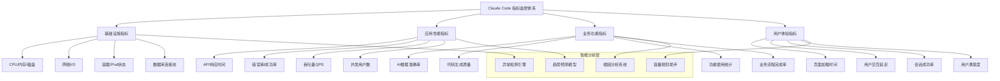

## 引言：生产环境的生命线

> "测量就是管理的开始。" —— Peter Drucker

当Claude Code从开发环境迈向生产环境时，**监控和运维就成为了系统的生命线**。一个没有监控的生产系统就像盲人驾驶，而缺乏有效运维的系统则随时可能崩溃。

生产环境的复杂性远超想象：用户并发访问、系统负载波动、网络延迟变化、资源竞争、依赖服务故障...任何一个环节的问题都可能导致整个系统的不可用。Claude Code作为AI驱动的开发平台，其监控和运维更需要考虑AI模型的特殊性：推理延迟、模型准确性、训练资源消耗等。

这篇文章将全面解析如何构建Claude Code的生产级监控和运维体系，实现从被动应对到主动预防，从人工运维到智能运维的跃升。

## 监控体系架构设计

### 生产环境监控的挑战

```
传统监控面临的AI时代挑战：
1. 指标复杂性 → AI系统的监控指标多维度、多层次
2. 实时性要求 → 毫秒级的性能监控和秒级的异常检测
3. 智能化需求 → 从被动监控到主动预测和自动响应
4. 规模化挑战 → 分布式环境下的全链路监控和追踪
5. 成本控制 → 监控系统本身不能成为资源消耗的负担

典型监控盲区：
- 🔍 AI模型推理质量和准确性监控缺失
- ⏱️ 用户体验的端到端监控不足
- 🔗 微服务间复杂调用链的可视化困难
- 💰 资源使用成本的精细化监控缺乏
- 🚨 异常模式的智能识别和预测能力不足
```

### Claude Code监控体系优势

```
AI增强的生产监控能力：
1. 智能异常检测 → 基于机器学习的异常模式识别
2. 预测性运维 → 提前预警潜在问题和容量瓶颈
3. 自适应阈值 → 动态调整监控阈值和告警策略
4. 智能根因分析 → 快速定位故障根本原因
5. 自动化响应 → 智能决策和自动化故障修复

监控核心优势：
- 📊 多维度的系统健康度量和分析
- 🎯 精准的性能瓶颈识别和优化建议
- 🔄 实时的服务依赖关系图和影响分析
- 💡 智能的容量规划和资源优化
- ⚡ 快速的故障检测和自动恢复机制
```

## 可观测性三支柱实现

### 1. 指标监控系统

#### 多层次指标体系



#### 指标收集和存储配置

```yaml
# .claude/config/monitoring/metrics.yml
metrics_monitoring_system:
  
  # 指标收集配置
  metrics_collection:
    # Prometheus配置
    prometheus:
      enabled: true
      port: 9090
      scrape_interval: "15s"
      evaluation_interval: "15s"
      
      # 抓取目标配置
      scrape_configs:
        - job_name: "claude-api"
          static_configs:
            - targets: ["claude-api:8080"]
          metrics_path: "/metrics"
          scrape_interval: "10s"
          
        - job_name: "claude-ml-service"
          static_configs:
            - targets: ["ml-service:9000"]
          metrics_path: "/metrics"
          scrape_interval: "30s"
          
        - job_name: "database-exporter"
          static_configs:
            - targets: ["postgres-exporter:9187"]
          
        - job_name: "redis-exporter" 
          static_configs:
            - targets: ["redis-exporter:9121"]
            
        - job_name: "nginx-exporter"
          static_configs:
            - targets: ["nginx-exporter:9113"]
      
      # 记录规则配置
      rule_files:
        - "/etc/prometheus/rules/*.yml"
      
      # 告警配置
      alerting:
        alertmanagers:
          - static_configs:
              - targets: ["alertmanager:9093"]
    
    # 自定义指标导出器
    custom_exporters:
      claude_business_metrics:
        enabled: true
        port: 8081
        
        # 业务指标定义
        business_metrics:
          - metric_name: "claude_inference_accuracy"
            metric_type: "gauge"
            description: "AI inference accuracy rate"
            labels: ["model_version", "task_type"]
            
          - metric_name: "claude_code_generation_quality"
            metric_type: "histogram"
            description: "Code generation quality score"
            labels: ["language", "complexity"]
            buckets: [0.1, 0.2, 0.3, 0.4, 0.5, 0.6, 0.7, 0.8, 0.9, 1.0]
            
          - metric_name: "claude_user_session_duration"
            metric_type: "histogram"
            description: "User session duration"
            labels: ["user_type", "feature_used"]
            buckets: [60, 300, 900, 1800, 3600, 7200]
            
          - metric_name: "claude_api_requests_total"
            metric_type: "counter"
            description: "Total API requests"
            labels: ["endpoint", "method", "status_code"]
            
          - metric_name: "claude_model_inference_latency"
            metric_type: "histogram"
            description: "Model inference latency"
            labels: ["model_name", "input_size"]
            buckets: [0.01, 0.05, 0.1, 0.5, 1.0, 2.0, 5.0, 10.0]

  # 指标存储配置
  metrics_storage:
    # 时序数据库配置
    timeseries_database:
      primary:
        type: "prometheus"
        retention: "90d"
        storage_path: "/prometheus/data"
        
      long_term_storage:
        type: "thanos"
        retention: "2y"
        object_storage:
          type: "s3"
          bucket: "claude-metrics-longterm"
          endpoint: "s3.amazonaws.com"
    
    # 指标聚合策略
    aggregation_rules:
      - record: "claude:api_success_rate_5m"
        expr: |
          (
            sum(rate(claude_api_requests_total{status_code!~"5.."}[5m])) by (endpoint)
            /
            sum(rate(claude_api_requests_total[5m])) by (endpoint)
          ) * 100
        
      - record: "claude:inference_p95_latency_5m"
        expr: |
          histogram_quantile(0.95, 
            sum(rate(claude_model_inference_latency_bucket[5m])) by (le, model_name)
          )
        
      - record: "claude:user_engagement_score_1h"
        expr: |
          (
            avg_over_time(claude_user_session_duration[1h]) * 
            rate(claude_api_requests_total[1h])
          ) / 3600

  # 智能异常检测
  anomaly_detection:
    enabled: true
    
    # 机器学习模型配置
    ml_models:
      - model_name: "cpu_usage_anomaly"
        algorithm: "isolation_forest"
        features: ["cpu_usage", "memory_usage", "request_rate"]
        training_window: "7d"
        detection_sensitivity: 0.1
        
      - model_name: "response_time_anomaly"
        algorithm: "lstm_autoencoder"
        features: ["response_time", "request_volume", "error_rate"]
        training_window: "30d"
        detection_sensitivity: 0.05
        
      - model_name: "user_behavior_anomaly"
        algorithm: "one_class_svm"
        features: ["session_duration", "api_calls_per_session", "feature_usage_pattern"]
        training_window: "14d"
        detection_sensitivity: 0.2
    
    # 异常检测规则
    detection_rules:
      - rule_name: "api_latency_spike"
        condition: "claude:inference_p95_latency_5m > 1.5 * claude:inference_p95_latency_5m offset 1h"
        severity: "warning"
        
      - rule_name: "error_rate_increase"
        condition: "(100 - claude:api_success_rate_5m) > 5"
        severity: "critical"
        
      - rule_name: "resource_exhaustion"
        condition: "up{job='claude-api'} == 0"
        severity: "critical"

  # 容量规划
  capacity_planning:
    enabled: true
    
    # 预测模型
    forecasting_models:
      - metric: "claude_api_requests_total"
        model_type: "prophet"
        forecast_horizon: "30d"
        confidence_interval: 0.95
        
      - metric: "claude_user_sessions_total"
        model_type: "arima"
        forecast_horizon: "7d"
        seasonal_pattern: "weekly"
    
    # 容量阈值
    capacity_thresholds:
      cpu_utilization: 70
      memory_utilization: 80
      disk_utilization: 85
      network_bandwidth: 75
    
    # 扩容建议
    scaling_recommendations:
      horizontal_scaling:
        trigger_threshold: 80  # CPU/Memory使用率
        min_instances: 2
        max_instances: 20
        
      vertical_scaling:
        cpu_increment: "0.5 cores"
        memory_increment: "1Gi"
        
      storage_scaling:
        disk_increment: "100Gi"
        backup_before_scaling: true

# 实时监控大屏配置
real_time_dashboard:
  
  # Grafana配置
  grafana:
    enabled: true
    port: 3000
    
    # 数据源配置
    datasources:
      - name: "Prometheus"
        type: "prometheus"
        url: "http://prometheus:9090"
        
      - name: "Elasticsearch"
        type: "elasticsearch"
        url: "http://elasticsearch:9200"
        database: "claude-logs-*"
        
      - name: "InfluxDB"
        type: "influxdb"
        url: "http://influxdb:8086"
        database: "claude_metrics"
    
    # 仪表板配置
    dashboards:
      - dashboard_name: "Claude Code 系统概览"
        panels:
          - title: "API请求量"
            type: "stat"
            targets:
              - expr: "sum(rate(claude_api_requests_total[5m]))"
                legendFormat: "Requests/sec"
                
          - title: "系统响应时间"
            type: "timeseries"
            targets:
              - expr: "claude:inference_p95_latency_5m"
                legendFormat: "P95 Latency"
                
          - title: "错误率"
            type: "stat"
            targets:
              - expr: "100 - claude:api_success_rate_5m"
                legendFormat: "Error Rate %"
                
          - title: "活跃用户"
            type: "stat"
            targets:
              - expr: "count(increase(claude_user_session_duration[5m]) > 0)"
                legendFormat: "Active Users"
        
      - dashboard_name: "AI模型性能监控"
        panels:
          - title: "推理准确率"
            type: "gauge"
            targets:
              - expr: "claude_inference_accuracy"
                legendFormat: "{{model_version}}"
                
          - title: "模型推理延迟分布"
            type: "heatmap"
            targets:
              - expr: "rate(claude_model_inference_latency_bucket[5m])"
                
          - title: "代码生成质量趋势"
            type: "timeseries"
            targets:
              - expr: "avg_over_time(claude_code_generation_quality[1h])"
                legendFormat: "{{language}}"
        
      - dashboard_name: "资源使用监控"
        panels:
          - title: "CPU使用率"
            type: "timeseries"
            targets:
              - expr: "100 - (avg by (instance) (irate(node_cpu_seconds_total{mode='idle'}[5m])) * 100)"
                legendFormat: "{{instance}}"
                
          - title: "内存使用率"
            type: "timeseries"
            targets:
              - expr: "(1 - (node_memory_MemAvailable_bytes / node_memory_MemTotal_bytes)) * 100"
                legendFormat: "{{instance}}"
                
          - title: "磁盘使用率"
            type: "timeseries"
            targets:
              - expr: "100 - ((node_filesystem_avail_bytes * 100) / node_filesystem_size_bytes)"
                legendFormat: "{{device}}"

  # 实时告警配置
  alerting:
    # AlertManager配置
    alertmanager:
      enabled: true
      port: 9093
      
      # 告警路由配置
      routing:
        group_by: ["alertname", "cluster", "service"]
        group_wait: "10s"
        group_interval: "10s"
        repeat_interval: "1h"
        receiver: "default"
        
        routes:
          - match:
              severity: "critical"
            receiver: "critical-alerts"
            group_wait: "5s"
            repeat_interval: "5m"
            
          - match:
              severity: "warning"
            receiver: "warning-alerts"
            repeat_interval: "30m"
      
      # 告警接收器配置
      receivers:
        - name: "default"
          slack_configs:
            - api_url: "${SLACK_WEBHOOK_URL}"
              channel: "#claude-monitoring"
              title: "Claude Code Alert"
              text: "{{ range .Alerts }}{{ .Annotations.summary }}{{ end }}"
              
        - name: "critical-alerts"
          slack_configs:
            - api_url: "${SLACK_WEBHOOK_URL}"
              channel: "#claude-critical"
              title: "🚨 Critical Alert: Claude Code"
              text: "{{ range .Alerts }}{{ .Annotations.description }}{{ end }}"
          
          pagerduty_configs:
            - routing_key: "${PAGERDUTY_INTEGRATION_KEY}"
              description: "Claude Code Critical Alert"
              
        - name: "warning-alerts"
          email_configs:
            - to: "ops-team@company.com"
              subject: "Claude Code Warning Alert"
              body: "{{ range .Alerts }}{{ .Annotations.description }}{{ end }}"
    
    # 告警规则定义
    alert_rules:
      - alert: "ClaudeAPIHighLatency"
        expr: "claude:inference_p95_latency_5m > 2.0"
        for: "2m"
        labels:
          severity: "warning"
        annotations:
          summary: "Claude API high latency detected"
          description: "P95 latency is {{ $value }}s, above 2s threshold"
          
      - alert: "ClaudeAPIHighErrorRate"
        expr: "(100 - claude:api_success_rate_5m) > 5"
        for: "1m"
        labels:
          severity: "critical"
        annotations:
          summary: "Claude API high error rate"
          description: "Error rate is {{ $value }}%, above 5% threshold"
          
      - alert: "ClaudeModelAccuracyDrop"
        expr: "claude_inference_accuracy < 0.8"
        for: "5m"
        labels:
          severity: "warning"
        annotations:
          summary: "AI model accuracy dropped"
          description: "Model accuracy is {{ $value }}, below 80% threshold"
          
      - alert: "ClaudeServiceDown"
        expr: "up{job='claude-api'} == 0"
        for: "1m"
        labels:
          severity: "critical"
        annotations:
          summary: "Claude service is down"
          description: "Claude API service has been down for more than 1 minute"
          
      - alert: "ClaudeHighCPUUsage"
        expr: "100 - (avg by (instance) (irate(node_cpu_seconds_total{mode='idle'}[5m])) * 100) > 80"
        for: "5m"
        labels:
          severity: "warning"
        annotations:
          summary: "High CPU usage detected"
          description: "CPU usage is {{ $value }}% on {{ $labels.instance }}"
```

### 2. 日志聚合和分析

#### 结构化日志系统

```yaml
# .claude/config/monitoring/logging.yml
logging_system:
  
  # 日志收集配置
  log_collection:
    # Fluentd配置
    fluentd:
      enabled: true
      port: 24224
      
      # 日志输入源
      sources:
        - type: "forward"
          port: 24224
          bind: "0.0.0.0"
          
        - type: "tail"
          path: "/var/log/claude/*.log"
          pos_file: "/var/log/fluentd/claude.log.pos"
          tag: "claude.application"
          format: "json"
          
        - type: "tail"
          path: "/var/log/containers/*claude*.log"
          pos_file: "/var/log/fluentd/containers.log.pos"
          tag: "claude.container"
          format: "docker"
          
        - type: "http"
          port: 9880
          bind: "0.0.0.0"
          cors_allow_origins: ["*"]
    
    # 日志格式标准化
    log_formatting:
      standard_format:
        timestamp: "iso8601"
        level: "string"
        logger: "string"
        message: "string"
        context: "object"
        trace_id: "string"
        span_id: "string"
        user_id: "string"
        session_id: "string"
        
      application_fields:
        request_id: "string"
        endpoint: "string"
        method: "string"
        status_code: "integer"
        response_time: "float"
        user_agent: "string"
        ip_address: "string"
        
      business_fields:
        feature_used: "string"
        model_version: "string"
        task_type: "string"
        input_size: "integer"
        output_size: "integer"
        accuracy_score: "float"
        
      error_fields:
        error_type: "string"
        error_message: "string"
        stack_trace: "string"
        error_code: "string"
        resolution_suggestion: "string"

  # 日志处理和路由
  log_processing:
    # 日志过滤规则
    filters:
      - name: "sensitive_data_removal"
        type: "record_transformer"
        remove_keys: ["password", "api_key", "token", "credit_card"]
        
      - name: "log_level_filtering"
        type: "grep"
        regexp:
          level: "^(DEBUG|INFO|WARN|ERROR|FATAL)$"
        
      - name: "error_enrichment"
        type: "record_transformer"
        enable_ruby: true
        record:
          error_severity: |
            case record["level"]
            when "ERROR"
              "high"
            when "WARN"
              "medium"
            else
              "low"
            end
    
    # 日志路由配置
    routing:
      - match: "claude.application.**"
        type: "copy"
        stores:
          - type: "elasticsearch"
            index_name: "claude-application-logs"
            type_name: "_doc"
            
          - type: "forward"
            servers:
              - host: "log-analysis-service"
                port: 24224
                
      - match: "claude.container.**"
        type: "elasticsearch"
        index_name: "claude-container-logs"
        
      - match: "claude.security.**"
        type: "copy"
        stores:
          - type: "elasticsearch"
            index_name: "claude-security-logs"
            
          - type: "file"
            path: "/secure/logs/security.log"
            append: true

  # 日志存储配置
  log_storage:
    # Elasticsearch配置
    elasticsearch:
      enabled: true
      cluster_name: "claude-logging-cluster"
      
      nodes:
        - host: "elasticsearch-master"
          port: 9200
        - host: "elasticsearch-data-1"
          port: 9200
        - host: "elasticsearch-data-2"
          port: 9200
      
      # 索引管理
      index_management:
        index_patterns:
          - name: "claude-application-logs"
            pattern: "claude-application-logs-*"
            
            settings:
              number_of_shards: 3
              number_of_replicas: 1
              refresh_interval: "30s"
              
            lifecycle_policy:
              hot_phase:
                actions:
                  rollover:
                    max_size: "10GB"
                    max_age: "1d"
              warm_phase:
                min_age: "7d"
                actions:
                  allocate:
                    number_of_replicas: 0
              cold_phase:
                min_age: "30d"
                actions:
                  allocate:
                    number_of_replicas: 0
              delete_phase:
                min_age: "90d"
                
          - name: "claude-error-logs"
            pattern: "claude-error-logs-*"
            
            settings:
              number_of_shards: 2
              number_of_replicas: 2
              
            lifecycle_policy:
              hot_phase:
                actions:
                  rollover:
                    max_size: "5GB"
                    max_age: "1d"
              delete_phase:
                min_age: "180d"  # 错误日志保存更久
      
      # 索引模板
      index_templates:
        - name: "claude-logs-template"
          index_patterns: ["claude-*-logs-*"]
          
          mappings:
            properties:
              timestamp:
                type: "date"
                format: "strict_date_optional_time||epoch_millis"
              level:
                type: "keyword"
              logger:
                type: "keyword"
              message:
                type: "text"
                analyzer: "standard"
              trace_id:
                type: "keyword"
              span_id:
                type: "keyword"
              user_id:
                type: "keyword"
              session_id:
                type: "keyword"
              response_time:
                type: "float"
              status_code:
                type: "integer"
              ip_address:
                type: "ip"

  # 日志分析和查询
  log_analysis:
    # Kibana配置
    kibana:
      enabled: true
      port: 5601
      elasticsearch_hosts: ["http://elasticsearch:9200"]
      
      # 预配置仪表板
      dashboards:
        - name: "Claude Application Overview"
          visualizations:
            - type: "line_chart"
              title: "Request Volume Over Time"
              index_pattern: "claude-application-logs-*"
              metrics:
                - field: "@timestamp"
                  aggregation: "count"
                  
            - type: "pie_chart"
              title: "Log Level Distribution"
              index_pattern: "claude-application-logs-*"
              metrics:
                - field: "level"
                  aggregation: "terms"
                  
            - type: "data_table"
              title: "Recent Errors"
              index_pattern: "claude-application-logs-*"
              filters:
                - field: "level"
                  value: "ERROR"
                  
        - name: "Claude Performance Analysis"
          visualizations:
            - type: "heatmap"
              title: "Response Time Heatmap"
              index_pattern: "claude-application-logs-*"
              metrics:
                - field: "response_time"
                  aggregation: "avg"
                  
            - type: "gauge"
              title: "API Success Rate"
              index_pattern: "claude-application-logs-*"
              metrics:
                - field: "status_code"
                  aggregation: "terms"
    
    # 智能日志分析
    intelligent_analysis:
      # 异常检测
      anomaly_detection:
        enabled: true
        
        detectors:
          - name: "error_rate_anomaly"
            index_pattern: "claude-application-logs-*"
            field: "level"
            function: "count"
            bucket_span: "15m"
            
          - name: "response_time_anomaly"
            index_pattern: "claude-application-logs-*"
            field: "response_time"
            function: "mean"
            bucket_span: "5m"
            
          - name: "user_activity_anomaly"
            index_pattern: "claude-application-logs-*"
            field: "user_id"
            function: "distinct_count"
            bucket_span: "1h"
      
      # 根因分析
      root_cause_analysis:
        enabled: true
        
        correlation_rules:
          - name: "error_correlation"
            conditions:
              - field: "level"
                value: "ERROR"
              - field: "response_time"
                threshold: "> 5000"
            actions:
              - "create_incident"
              - "notify_on_call"
              
          - name: "performance_degradation"
            conditions:
              - field: "response_time"
                aggregation: "avg"
                threshold: "> 2000"
                duration: "5m"
            actions:
              - "trigger_scaling"
              - "notify_team"
      
      # 日志模式识别
      pattern_recognition:
        enabled: true
        
        patterns:
          - name: "authentication_failure"
            regex: "Authentication failed for user.*"
            severity: "medium"
            action: "security_alert"
            
          - name: "database_connection_error"
            regex: "Database connection.*failed"
            severity: "high"
            action: "database_health_check"
            
          - name: "memory_leak_pattern"
            regex: "OutOfMemoryError"
            severity: "critical"
            action: "restart_service"

  # 日志安全和合规
  log_security:
    # 数据脱敏
    data_masking:
      enabled: true
      
      masking_rules:
        - field_pattern: ".*password.*"
          masking_type: "full"
          replacement: "***REDACTED***"
          
        - field_pattern: ".*email.*"
          masking_type: "partial"
          preserve_pattern: "^(.{2}).*(@.*)$"
          replacement: "$1***$2"
          
        - field_pattern: ".*phone.*"
          masking_type: "partial"
          preserve_pattern: "^(.{3}).*(.{3})$"
          replacement: "$1***$2"
          
        - field_pattern: ".*ssn.*"
          masking_type: "full"
          replacement: "XXX-XX-XXXX"
    
    # 访问控制
    access_control:
      enabled: true
      
      role_based_access:
        - role: "admin"
          permissions: ["read", "write", "delete"]
          index_patterns: ["*"]
          
        - role: "developer"
          permissions: ["read"]
          index_patterns: ["claude-application-logs-*", "claude-container-logs-*"]
          
        - role: "security_analyst"
          permissions: ["read", "write"]
          index_patterns: ["claude-security-logs-*", "claude-audit-logs-*"]
          
        - role: "auditor"
          permissions: ["read"]
          index_patterns: ["claude-audit-logs-*"]
          time_filter: "last_90_days"
    
    # 审计日志
    audit_logging:
      enabled: true
      
      audited_actions:
        - "user_login"
        - "user_logout"
        - "data_access"
        - "configuration_change"
        - "security_policy_change"
        - "log_query"
        - "log_export"
      
      audit_format:
        timestamp: "iso8601"
        user_id: "string"
        action: "string"
        resource: "string"
        result: "string"
        ip_address: "string"
        user_agent: "string"
        additional_info: "object"
```

### 3. 分布式链路追踪

#### 链路追踪系统配置

```python
# 分布式追踪系统实现
class DistributedTracingSystem:
    """分布式链路追踪系统"""
    
    def __init__(self):
        self.tracer_config = self.load_tracer_config()
        self.jaeger_client = self.initialize_jaeger_client()
        self.trace_processor = TraceProcessor()
        self.performance_analyzer = PerformanceAnalyzer()
    
    async def initialize_distributed_tracing(self) -> Dict:
        """初始化分布式追踪系统"""
        
        print("🔍 初始化分布式链路追踪系统...")
        
        # 1. 配置Jaeger追踪
        jaeger_setup = await self.setup_jaeger_tracing()
        
        # 2. 配置OpenTelemetry
        otel_setup = await self.setup_opentelemetry()
        
        # 3. 设置自动化插桩
        instrumentation_setup = await self.setup_auto_instrumentation()
        
        # 4. 配置链路分析
        analysis_setup = await self.setup_trace_analysis()
        
        # 5. 设置性能监控
        performance_setup = await self.setup_performance_monitoring()
        
        return {
            "tracing_status": "initialized",
            "jaeger_setup": jaeger_setup,
            "otel_setup": otel_setup,
            "instrumentation": instrumentation_setup,
            "analysis": analysis_setup,
            "performance_monitoring": performance_setup
        }
    
    async def setup_jaeger_tracing(self) -> Dict:
        """设置Jaeger链路追踪"""
        
        jaeger_config = {
            "service_name": "claude-code",
            "agent_host_port": "jaeger-agent:6831",
            "collector_endpoint": "http://jaeger-collector:14268/api/traces",
            
            # 采样策略
            "sampling": {
                "type": "probabilistic",
                "param": 0.1  # 10%采样率
            },
            
            # 标签配置
            "tags": {
                "environment": "production",
                "version": "1.0.0",
                "component": "claude-api"
            },
            
            # 上报配置
            "reporter": {
                "queue_size": 1000,
                "batch_size": 100,
                "flush_interval": "1s"
            }
        }
        
        # 初始化Jaeger客户端
        tracer = await self.create_jaeger_tracer(jaeger_config)
        
        return {
            "tracer_initialized": True,
            "config": jaeger_config,
            "tracer_id": id(tracer)
        }
    
    async def setup_opentelemetry(self) -> Dict:
        """设置OpenTelemetry"""
        
        from opentelemetry import trace
        from opentelemetry.exporter.jaeger.thrift import JaegerExporter
        from opentelemetry.sdk.trace import TracerProvider
        from opentelemetry.sdk.trace.export import BatchSpanProcessor
        
        # 配置TracerProvider
        trace.set_tracer_provider(TracerProvider())
        tracer = trace.get_tracer(__name__)
        
        # 配置Jaeger导出器
        jaeger_exporter = JaegerExporter(
            agent_host_name="jaeger-agent",
            agent_port=6831,
        )
        
        # 配置批量Span处理器
        span_processor = BatchSpanProcessor(jaeger_exporter)
        trace.get_tracer_provider().add_span_processor(span_processor)
        
        otel_config = {
            "tracer_provider": "configured",
            "exporters": ["jaeger"],
            "span_processors": ["batch"],
            "instrumentations": []
        }
        
        # 自动插桩配置
        instrumentations = await self.configure_auto_instrumentations()
        otel_config["instrumentations"] = instrumentations
        
        return otel_config
    
    async def configure_auto_instrumentations(self) -> List[str]:
        """配置自动插桩"""
        
        instrumentations = []
        
        try:
            # HTTP客户端插桩
            from opentelemetry.instrumentation.requests import RequestsInstrumentor
            RequestsInstrumentor().instrument()
            instrumentations.append("requests")
            
            # FastAPI插桩
            from opentelemetry.instrumentation.fastapi import FastAPIInstrumentor
            FastAPIInstrumentor().instrument()
            instrumentations.append("fastapi")
            
            # 数据库插桩
            from opentelemetry.instrumentation.sqlalchemy import SQLAlchemyInstrumentor
            SQLAlchemyInstrumentor().instrument()
            instrumentations.append("sqlalchemy")
            
            # Redis插桩
            from opentelemetry.instrumentation.redis import RedisInstrumentor
            RedisInstrumentor().instrument()
            instrumentations.append("redis")
            
            # gRPC插桩
            from opentelemetry.instrumentation.grpc import GrpcInstrumentorClient
            GrpcInstrumentorClient().instrument()
            instrumentations.append("grpc")
            
        except ImportError as e:
            print(f"某些插桩库未安装: {e}")
        
        return instrumentations
    
    async def trace_claude_inference(self, user_request: Dict) -> Dict:
        """追踪Claude推理过程"""
        
        from opentelemetry import trace
        
        tracer = trace.get_tracer(__name__)
        
        with tracer.start_as_current_span("claude_inference") as span:
            # 设置Span属性
            span.set_attributes({
                "claude.user_id": user_request.get("user_id"),
                "claude.request_id": user_request.get("request_id"),
                "claude.input_length": len(user_request.get("prompt", "")),
                "claude.model_version": user_request.get("model_version", "default"),
                "claude.task_type": user_request.get("task_type", "general")
            })
            
            try:
                # 1. 输入预处理追踪
                with tracer.start_as_current_span("input_preprocessing") as preprocess_span:
                    preprocess_start = time.time()
                    
                    processed_input = await self.preprocess_input(user_request["prompt"])
                    
                    preprocess_span.set_attributes({
                        "preprocessing.duration_ms": (time.time() - preprocess_start) * 1000,
                        "preprocessing.output_length": len(processed_input),
                        "preprocessing.transformations": ["tokenization", "normalization"]
                    })
                
                # 2. 模型推理追踪
                with tracer.start_as_current_span("model_inference") as inference_span:
                    inference_start = time.time()
                    
                    inference_result = await self.perform_model_inference(processed_input)
                    
                    inference_span.set_attributes({
                        "inference.duration_ms": (time.time() - inference_start) * 1000,
                        "inference.tokens_processed": inference_result.get("tokens_processed"),
                        "inference.confidence_score": inference_result.get("confidence"),
                        "inference.model_cache_hit": inference_result.get("cache_hit", False)
                    })
                
                # 3. 后处理追踪
                with tracer.start_as_current_span("output_postprocessing") as postprocess_span:
                    postprocess_start = time.time()
                    
                    final_output = await self.postprocess_output(inference_result)
                    
                    postprocess_span.set_attributes({
                        "postprocessing.duration_ms": (time.time() - postprocess_start) * 1000,
                        "postprocessing.output_length": len(final_output.get("response", "")),
                        "postprocessing.quality_score": final_output.get("quality_score")
                    })
                
                # 4. 设置成功状态
                span.set_status(trace.Status(trace.StatusCode.OK))
                span.set_attributes({
                    "claude.response_length": len(final_output.get("response", "")),
                    "claude.total_duration_ms": (time.time() - time.time()) * 1000,
                    "claude.success": True
                })
                
                return final_output
                
            except Exception as e:
                # 记录错误信息
                span.record_exception(e)
                span.set_status(trace.Status(trace.StatusCode.ERROR, str(e)))
                span.set_attributes({
                    "claude.error": True,
                    "claude.error_type": type(e).__name__,
                    "claude.error_message": str(e)
                })
                
                raise e
    
    async def analyze_trace_performance(self, trace_id: str) -> Dict:
        """分析链路追踪性能"""
        
        print(f"📊 分析链路追踪性能: {trace_id}")
        
        # 1. 获取完整链路数据
        trace_data = await self.get_trace_data(trace_id)
        
        # 2. 分析关键路径
        critical_path = await self.identify_critical_path(trace_data)
        
        # 3. 检测性能瓶颈
        bottlenecks = await self.detect_performance_bottlenecks(trace_data)
        
        # 4. 生成优化建议
        optimization_suggestions = await self.generate_optimization_suggestions(
            critical_path, bottlenecks
        )
        
        # 5. 计算性能指标
        performance_metrics = await self.calculate_performance_metrics(trace_data)
        
        analysis_result = {
            "trace_id": trace_id,
            "analysis_timestamp": datetime.now().isoformat(),
            "critical_path": critical_path,
            "bottlenecks": bottlenecks,
            "optimization_suggestions": optimization_suggestions,
            "performance_metrics": performance_metrics,
            "trace_summary": {
                "total_duration": performance_metrics["total_duration"],
                "span_count": len(trace_data["spans"]),
                "error_count": len([s for s in trace_data["spans"] if s.get("error")]),
                "service_count": len(set(s["service_name"] for s in trace_data["spans"]))
            }
        }
        
        return analysis_result
    
    async def detect_performance_bottlenecks(self, trace_data: Dict) -> List[Dict]:
        """检测性能瓶颈"""
        
        bottlenecks = []
        
        for span in trace_data["spans"]:
            span_duration = span["duration"]
            
            # 检测慢查询
            if span.get("operation_name") == "database_query" and span_duration > 1000:
                bottlenecks.append({
                    "type": "slow_database_query",
                    "span_id": span["span_id"],
                    "duration": span_duration,
                    "severity": "high" if span_duration > 5000 else "medium",
                    "suggestion": "优化SQL查询或添加索引"
                })
            
            # 检测网络延迟
            if span.get("operation_name") == "http_request" and span_duration > 2000:
                bottlenecks.append({
                    "type": "high_network_latency",
                    "span_id": span["span_id"],
                    "duration": span_duration,
                    "severity": "medium",
                    "suggestion": "考虑使用CDN或优化网络路径"
                })
            
            # 检测模型推理延迟
            if span.get("operation_name") == "model_inference" and span_duration > 3000:
                bottlenecks.append({
                    "type": "slow_model_inference",
                    "span_id": span["span_id"],
                    "duration": span_duration,
                    "severity": "high",
                    "suggestion": "优化模型或使用更快的推理引擎"
                })
            
            # 检测CPU密集型操作
            if span.get("tags", {}).get("cpu_intensive") and span_duration > 1000:
                bottlenecks.append({
                    "type": "cpu_intensive_operation",
                    "span_id": span["span_id"],
                    "duration": span_duration,
                    "severity": "medium",
                    "suggestion": "考虑异步处理或优化算法"
                })
        
        return bottlenecks
    
    async def generate_performance_dashboard(self) -> Dict:
        """生成性能监控仪表板数据"""
        
        dashboard_data = {
            "overview": {
                "total_traces_24h": await self.count_traces_last_24h(),
                "average_response_time": await self.calculate_avg_response_time(),
                "error_rate_percentage": await self.calculate_error_rate(),
                "throughput_rps": await self.calculate_throughput()
            },
            
            "service_performance": {},
            "endpoint_performance": {},
            "error_analysis": {},
            "dependency_map": {}
        }
        
        # 服务性能统计
        services = await self.get_all_services()
        for service in services:
            dashboard_data["service_performance"][service] = {
                "avg_response_time": await self.get_service_avg_response_time(service),
                "error_rate": await self.get_service_error_rate(service),
                "request_count": await self.get_service_request_count(service),
                "p95_latency": await self.get_service_p95_latency(service)
            }
        
        # 端点性能分析
        endpoints = await self.get_critical_endpoints()
        for endpoint in endpoints:
            dashboard_data["endpoint_performance"][endpoint] = {
                "avg_response_time": await self.get_endpoint_avg_response_time(endpoint),
                "request_volume": await self.get_endpoint_request_volume(endpoint),
                "error_count": await self.get_endpoint_error_count(endpoint),
                "slowest_traces": await self.get_slowest_traces_for_endpoint(endpoint)
            }
        
        # 错误分析
        dashboard_data["error_analysis"] = {
            "top_errors": await self.get_top_errors(),
            "error_trends": await self.get_error_trends(),
            "error_hotspots": await self.identify_error_hotspots()
        }
        
        # 依赖关系图
        dashboard_data["dependency_map"] = await self.generate_service_dependency_map()
        
        return dashboard_data

# 使用示例
tracing_system = DistributedTracingSystem()

# 初始化链路追踪
tracing_result = await tracing_system.initialize_distributed_tracing()
print(f"🔍 链路追踪状态: {tracing_result['tracing_status']}")

# 追踪Claude推理
user_request = {
    "user_id": "user123",
    "request_id": "req_456",
    "prompt": "帮我编写一个Python函数",
    "model_version": "claude-3-sonnet",
    "task_type": "code_generation"
}

inference_result = await tracing_system.trace_claude_inference(user_request)
print(f"💡 推理完成: {len(inference_result.get('response', ''))} 字符")

# 生成性能仪表板
dashboard = await tracing_system.generate_performance_dashboard()
print(f"📊 24小时追踪数: {dashboard['overview']['total_traces_24h']}")
print(f"⚡ 平均响应时间: {dashboard['overview']['average_response_time']}ms")
```

## 智能运维和自动化

### 1. 自动化部署和扩缩容

#### 智能扩缩容系统

```yaml
# .claude/config/ops/auto-scaling.yml
intelligent_auto_scaling:
  
  # 水平扩缩容配置
  horizontal_scaling:
    enabled: true
    
    # 基于指标的扩缩容
    metric_based_scaling:
      - name: "cpu_memory_scaling"
        target_resource: "claude-api"
        
        scaling_metrics:
          - metric: "cpu_utilization"
            target_value: 70
            weight: 0.4
            
          - metric: "memory_utilization"  
            target_value: 80
            weight: 0.3
            
          - metric: "request_rate"
            target_value: 1000  # requests per second
            weight: 0.3
        
        scaling_behavior:
          scale_up:
            stabilization_window: "300s"  # 5分钟
            policies:
              - type: "Percent"
                value: 50  # 每次扩容50%
                period: "60s"
              - type: "Pods"
                value: 2   # 每次最多增加2个Pod
                period: "60s"
          
          scale_down:
            stabilization_window: "600s"  # 10分钟
            policies:
              - type: "Percent"
                value: 25  # 每次缩容25%
                period: "300s"
        
        constraints:
          min_replicas: 2
          max_replicas: 50
          
      - name: "ai_inference_scaling"
        target_resource: "claude-ml-service"
        
        scaling_metrics:
          - metric: "inference_queue_length"
            target_value: 10
            weight: 0.5
            
          - metric: "inference_latency_p95"
            target_value: 2000  # 2秒
            weight: 0.3
            
          - metric: "gpu_utilization"
            target_value: 75
            weight: 0.2
        
        constraints:
          min_replicas: 1
          max_replicas: 20
    
    # 预测性扩缩容
    predictive_scaling:
      enabled: true
      
      prediction_models:
        - name: "workload_forecasting"
          algorithm: "prophet"
          features: ["historical_cpu", "historical_memory", "request_patterns"]
          forecast_horizon: "1h"
          confidence_threshold: 0.8
          
        - name: "seasonal_pattern_scaling"
          algorithm: "seasonal_decomposition"
          features: ["daily_patterns", "weekly_patterns", "monthly_patterns"]
          forecast_horizon: "4h"
          
      proactive_scaling:
        enabled: true
        lead_time: "5m"  # 提前5分钟扩容
        confidence_threshold: 0.7

  # 垂直扩缩容配置
  vertical_scaling:
    enabled: true
    
    # VPA配置
    vertical_pod_autoscaler:
      target_resources: ["claude-api", "claude-ml-service"]
      
      update_mode: "Auto"  # Auto | Initial | Off
      
      resource_policies:
        - container_name: "claude-api"
          min_allowed:
            cpu: "100m"
            memory: "128Mi"
          max_allowed:
            cpu: "2000m"
            memory: "4Gi"
          controlled_resources: ["cpu", "memory"]
          
        - container_name: "claude-ml-service"
          min_allowed:
            cpu: "500m"
            memory: "1Gi"
          max_allowed:
            cpu: "8000m"
            memory: "16Gi"
          controlled_resources: ["cpu", "memory"]

  # 集群扩缩容配置
  cluster_scaling:
    enabled: true
    
    # 集群自动扩容器
    cluster_autoscaler:
      nodes:
        min_nodes: 3
        max_nodes: 100
        
      scaling_policies:
        scale_down_delay_after_add: "10m"
        scale_down_unneeded_time: "10m"
        scale_down_utilization_threshold: 0.5
        
      node_groups:
        - name: "general-purpose"
          instance_types: ["m5.large", "m5.xlarge", "m5.2xlarge"]
          min_size: 2
          max_size: 20
          
        - name: "compute-optimized"
          instance_types: ["c5.xlarge", "c5.2xlarge", "c5.4xlarge"]
          min_size: 0
          max_size: 10
          
        - name: "gpu-enabled"
          instance_types: ["p3.2xlarge", "p3.8xlarge"]
          min_size: 0
          max_size: 5

# 自动化部署配置
automated_deployment:
  
  # GitOps配置
  gitops:
    enabled: true
    
    # ArgoCD配置
    argocd:
      applications:
        - name: "claude-code-production"
          repository: "https://github.com/company/claude-infrastructure"
          path: "kubernetes/production"
          target_revision: "main"
          
          sync_policy:
            automated:
              prune: true
              self_heal: true
            sync_options:
              - "CreateNamespace=true"
              
          rollback_config:
            enabled: true
            max_rollback_revisions: 10
            
        - name: "claude-code-monitoring"
          repository: "https://github.com/company/claude-monitoring"
          path: "manifests"
          target_revision: "main"
          
    # 部署策略
    deployment_strategies:
      - name: "blue_green_deployment"
        target_services: ["claude-api"]
        
        strategy:
          type: "BlueGreen"
          blue_green:
            active_service: "claude-api-active"
            preview_service: "claude-api-preview"
            
            pre_promotion_analysis:
              templates:
                - template_name: "success-rate"
                - template_name: "latency"
              args:
                - name: "service-name"
                  value: "claude-api-preview"
                  
            post_promotion_analysis:
              templates:
                - template_name: "success-rate"
                - template_name: "latency"
              args:
                - name: "service-name"
                  value: "claude-api-active"
                  
            scale_down_delay: "30s"
            promotion_policy: "automatic"
            
      - name: "canary_deployment"
        target_services: ["claude-ml-service"]
        
        strategy:
          type: "Canary"
          canary:
            steps:
              - set_weight: 10
              - pause:
                  duration: "2m"
              - set_weight: 25
              - pause:
                  duration: "5m"
              - set_weight: 50
              - pause:
                  duration: "10m"
              - set_weight: 75
              - pause:
                  duration: "5m"
              - set_weight: 100
                
            analysis:
              templates:
                - template_name: "success-rate"
                  success_condition: "result[0] >= 0.95"
                - template_name: "latency"
                  success_condition: "result[0] <= 2000"
                  
              start_delay: "30s"
              interval: "30s"
              count: 5
              
            traffic_routing:
              istio:
                virtual_service:
                  name: "claude-ml-service"
                  routes:
                    - "primary"
                    - "canary"

  # 自动化测试
  automated_testing:
    # 冒烟测试
    smoke_tests:
      enabled: true
      
      test_suites:
        - name: "api_health_check"
          tests:
            - endpoint: "/health"
              method: "GET"
              expected_status: 200
              timeout: "5s"
              
            - endpoint: "/api/v1/inference"
              method: "POST"
              payload: '{"prompt": "Hello, test"}'
              expected_status: 200
              timeout: "30s"
              
        - name: "database_connectivity"
          tests:
            - type: "database_connection"
              connection_string: "${DATABASE_URL}"
              timeout: "10s"
              
            - type: "database_query"
              query: "SELECT 1"
              expected_result: 1
    
    # 集成测试
    integration_tests:
      enabled: true
      
      test_environments:
        - name: "staging"
          base_url: "https://claude-staging.company.com"
          
          test_scenarios:
            - scenario: "user_authentication_flow"
              steps:
                - action: "login"
                  parameters:
                    username: "${TEST_USER}"
                    password: "${TEST_PASSWORD}"
                - action: "create_session"
                - action: "make_inference_request"
                - action: "logout"
                
            - scenario: "load_testing"
              type: "load_test"
              virtual_users: 100
              duration: "5m"
              ramp_up: "1m"

  # 回滚策略
  rollback_strategy:
    enabled: true
    
    # 自动回滚触发条件
    auto_rollback_triggers:
      - metric: "error_rate"
        threshold: "> 5%"
        duration: "2m"
        
      - metric: "response_time_p95"
        threshold: "> 5000ms"
        duration: "3m"
        
      - metric: "availability"
        threshold: "< 99%"
        duration: "1m"
    
    # 回滚执行
    rollback_execution:
      type: "immediate"  # immediate | scheduled
      
      rollback_steps:
        - "stop_traffic_to_new_version"
        - "restore_previous_version"
        - "verify_system_health"
        - "notify_operations_team"
        
      verification_tests:
        - "smoke_tests"
        - "critical_path_tests"
        
    # 回滚通知
    rollback_notifications:
      channels:
        - type: "slack"
          webhook: "${SLACK_WEBHOOK_URL}"
          channel: "#deployments"
          
        - type: "email"
          recipients: ["ops-team@company.com"]
          
        - type: "pagerduty"
          integration_key: "${PAGERDUTY_KEY}"
```

### 2. 故障自愈系统

#### 智能故障检测和恢复

```python
class IntelligentFaultRecoverySystem:
    """智能故障自愈系统"""
    
    def __init__(self):
        self.fault_detector = FaultDetectionEngine()
        self.recovery_engine = AutoRecoveryEngine()
        self.knowledge_base = FaultKnowledgeBase()
        self.notification_service = NotificationService()
    
    async def initialize_fault_recovery_system(self) -> Dict:
        """初始化故障自愈系统"""
        
        print("🔧 初始化智能故障自愈系统...")
        
        # 1. 配置故障检测
        detection_setup = await self.setup_fault_detection()
        
        # 2. 配置自动恢复策略
        recovery_setup = await self.setup_auto_recovery_strategies()
        
        # 3. 建立故障知识库
        knowledge_setup = await self.build_fault_knowledge_base()
        
        # 4. 配置通知和告警
        notification_setup = await self.setup_notification_system()
        
        # 5. 启动监控循环
        monitoring_setup = await self.start_continuous_monitoring()
        
        return {
            "system_status": "initialized",
            "fault_detection": detection_setup,
            "auto_recovery": recovery_setup,
            "knowledge_base": knowledge_setup,
            "notifications": notification_setup,
            "monitoring": monitoring_setup
        }
    
    async def detect_and_recover_faults(self) -> Dict:
        """检测并恢复故障"""
        
        print("🔍 执行故障检测和自动恢复...")
        
        recovery_results = {
            "detection_timestamp": datetime.now().isoformat(),
            "detected_faults": [],
            "recovery_actions": [],
            "system_health_status": "unknown"
        }
        
        # 1. 多维度故障检测
        detected_faults = await self.perform_comprehensive_fault_detection()
        recovery_results["detected_faults"] = detected_faults
        
        # 2. 故障分类和优先级排序
        prioritized_faults = await self.prioritize_faults(detected_faults)
        
        # 3. 执行自动恢复操作
        for fault in prioritized_faults:
            if fault["auto_recoverable"]:
                recovery_action = await self.execute_auto_recovery(fault)
                recovery_results["recovery_actions"].append(recovery_action)
            else:
                # 创建人工干预任务
                manual_task = await self.create_manual_intervention_task(fault)
                recovery_results["recovery_actions"].append(manual_task)
        
        # 4. 验证系统健康状态
        health_status = await self.verify_system_health()
        recovery_results["system_health_status"] = health_status
        
        # 5. 更新故障知识库
        await self.update_fault_knowledge_base(detected_faults, recovery_results)
        
        return recovery_results
    
    async def perform_comprehensive_fault_detection(self) -> List[Dict]:
        """执行全面的故障检测"""
        
        detected_faults = []
        
        # 1. 基础设施故障检测
        infrastructure_faults = await self.detect_infrastructure_faults()
        detected_faults.extend(infrastructure_faults)
        
        # 2. 应用层故障检测
        application_faults = await self.detect_application_faults()
        detected_faults.extend(application_faults)
        
        # 3. 业务逻辑故障检测
        business_faults = await self.detect_business_logic_faults()
        detected_faults.extend(business_faults)
        
        # 4. 依赖服务故障检测
        dependency_faults = await self.detect_dependency_faults()
        detected_faults.extend(dependency_faults)
        
        # 5. 安全相关故障检测
        security_faults = await self.detect_security_faults()
        detected_faults.extend(security_faults)
        
        return detected_faults
    
    async def detect_infrastructure_faults(self) -> List[Dict]:
        """检测基础设施故障"""
        
        infrastructure_faults = []
        
        # CPU使用率异常
        cpu_metrics = await self.get_cpu_metrics()
        for node, cpu_usage in cpu_metrics.items():
            if cpu_usage > 90:
                infrastructure_faults.append({
                    "fault_id": f"cpu_high_{node}_{int(time.time())}",
                    "type": "high_cpu_usage",
                    "severity": "critical" if cpu_usage > 95 else "high",
                    "affected_resource": node,
                    "metrics": {"cpu_usage": cpu_usage},
                    "auto_recoverable": True,
                    "recovery_strategy": "scale_up_or_redistribute_load"
                })
        
        # 内存使用率异常
        memory_metrics = await self.get_memory_metrics()
        for node, memory_usage in memory_metrics.items():
            if memory_usage > 85:
                infrastructure_faults.append({
                    "fault_id": f"memory_high_{node}_{int(time.time())}",
                    "type": "high_memory_usage",
                    "severity": "critical" if memory_usage > 95 else "high",
                    "affected_resource": node,
                    "metrics": {"memory_usage": memory_usage},
                    "auto_recoverable": True,
                    "recovery_strategy": "scale_up_or_restart_services"
                })
        
        # 磁盘空间不足
        disk_metrics = await self.get_disk_metrics()
        for node, disk_usage in disk_metrics.items():
            if disk_usage > 90:
                infrastructure_faults.append({
                    "fault_id": f"disk_full_{node}_{int(time.time())}",
                    "type": "disk_space_critical",
                    "severity": "critical",
                    "affected_resource": node,
                    "metrics": {"disk_usage": disk_usage},
                    "auto_recoverable": True,
                    "recovery_strategy": "cleanup_logs_and_temp_files"
                })
        
        # 网络连接问题
        network_health = await self.check_network_connectivity()
        for connection, status in network_health.items():
            if not status["healthy"]:
                infrastructure_faults.append({
                    "fault_id": f"network_issue_{connection}_{int(time.time())}",
                    "type": "network_connectivity_failure",
                    "severity": "high",
                    "affected_resource": connection,
                    "metrics": status,
                    "auto_recoverable": False,
                    "recovery_strategy": "manual_network_diagnosis"
                })
        
        return infrastructure_faults
    
    async def detect_application_faults(self) -> List[Dict]:
        """检测应用层故障"""
        
        application_faults = []
        
        # API响应时间异常
        api_latency = await self.get_api_latency_metrics()
        for endpoint, latency in api_latency.items():
            if latency > 5000:  # 5秒
                application_faults.append({
                    "fault_id": f"api_slow_{endpoint}_{int(time.time())}",
                    "type": "high_api_latency",
                    "severity": "high",
                    "affected_resource": endpoint,
                    "metrics": {"p95_latency": latency},
                    "auto_recoverable": True,
                    "recovery_strategy": "restart_slow_services"
                })
        
        # 错误率异常
        error_rates = await self.get_error_rate_metrics()
        for service, error_rate in error_rates.items():
            if error_rate > 5:  # 5%错误率
                application_faults.append({
                    "fault_id": f"high_errors_{service}_{int(time.time())}",
                    "type": "high_error_rate",
                    "severity": "critical" if error_rate > 10 else "high",
                    "affected_resource": service,
                    "metrics": {"error_rate": error_rate},
                    "auto_recoverable": True,
                    "recovery_strategy": "restart_service_and_check_dependencies"
                })
        
        # 服务不可用
        service_health = await self.check_service_health()
        for service, health in service_health.items():
            if not health["available"]:
                application_faults.append({
                    "fault_id": f"service_down_{service}_{int(time.time())}",
                    "type": "service_unavailable",
                    "severity": "critical",
                    "affected_resource": service,
                    "metrics": health,
                    "auto_recoverable": True,
                    "recovery_strategy": "restart_service"
                })
        
        # 数据库连接问题
        db_health = await self.check_database_health()
        if not db_health["healthy"]:
            application_faults.append({
                "fault_id": f"database_issue_{int(time.time())}",
                "type": "database_connectivity_failure",
                "severity": "critical",
                "affected_resource": "database",
                "metrics": db_health,
                "auto_recoverable": True,
                "recovery_strategy": "restart_database_connections"
            })
        
        return application_faults
    
    async def execute_auto_recovery(self, fault: Dict) -> Dict:
        """执行自动恢复操作"""
        
        recovery_action = {
            "fault_id": fault["fault_id"],
            "recovery_start_time": datetime.now().isoformat(),
            "recovery_strategy": fault["recovery_strategy"],
            "steps_executed": [],
            "success": False,
            "error_message": None
        }
        
        try:
            strategy = fault["recovery_strategy"]
            
            if strategy == "restart_service":
                await self.restart_service_recovery(fault, recovery_action)
                
            elif strategy == "scale_up_or_redistribute_load":
                await self.scale_up_recovery(fault, recovery_action)
                
            elif strategy == "cleanup_logs_and_temp_files":
                await self.cleanup_storage_recovery(fault, recovery_action)
                
            elif strategy == "restart_database_connections":
                await self.restart_database_connections_recovery(fault, recovery_action)
                
            elif strategy == "restart_slow_services":
                await self.restart_slow_services_recovery(fault, recovery_action)
                
            else:
                raise ValueError(f"Unknown recovery strategy: {strategy}")
            
            # 验证恢复效果
            recovery_verification = await self.verify_recovery_success(fault)
            recovery_action["success"] = recovery_verification["success"]
            recovery_action["verification_results"] = recovery_verification
            
        except Exception as e:
            recovery_action["success"] = False
            recovery_action["error_message"] = str(e)
            
            # 记录恢复失败事件
            await self.log_recovery_failure(fault, e)
        
        recovery_action["recovery_end_time"] = datetime.now().isoformat()
        
        # 发送恢复通知
        await self.send_recovery_notification(recovery_action)
        
        return recovery_action
    
    async def restart_service_recovery(self, fault: Dict, recovery_action: Dict):
        """重启服务恢复策略"""
        
        service_name = fault["affected_resource"]
        
        # 1. 检查服务当前状态
        recovery_action["steps_executed"].append("check_service_status")
        current_status = await self.get_service_status(service_name)
        
        # 2. 优雅停止服务
        recovery_action["steps_executed"].append("graceful_shutdown")
        await self.graceful_shutdown_service(service_name)
        
        # 3. 等待服务完全停止
        recovery_action["steps_executed"].append("wait_for_shutdown")
        await asyncio.sleep(10)
        
        # 4. 重新启动服务
        recovery_action["steps_executed"].append("restart_service")
        await self.start_service(service_name)
        
        # 5. 等待服务就绪
        recovery_action["steps_executed"].append("wait_for_ready")
        await self.wait_for_service_ready(service_name, timeout=60)
        
        # 6. 执行健康检查
        recovery_action["steps_executed"].append("health_check")
        health_status = await self.perform_service_health_check(service_name)
        
        if not health_status["healthy"]:
            raise Exception(f"Service {service_name} failed health check after restart")
    
    async def scale_up_recovery(self, fault: Dict, recovery_action: Dict):
        """扩容恢复策略"""
        
        resource = fault["affected_resource"]
        
        # 1. 获取当前实例数
        recovery_action["steps_executed"].append("get_current_scale")
        current_replicas = await self.get_current_replicas(resource)
        
        # 2. 计算目标实例数（增加50%或最少增加2个）
        target_replicas = max(current_replicas + 2, int(current_replicas * 1.5))
        
        # 3. 执行扩容
        recovery_action["steps_executed"].append("scale_up")
        await self.scale_service(resource, target_replicas)
        
        # 4. 等待新实例就绪
        recovery_action["steps_executed"].append("wait_for_new_instances")
        await self.wait_for_replicas_ready(resource, target_replicas, timeout=300)
        
        # 5. 验证负载分布
        recovery_action["steps_executed"].append("verify_load_distribution")
        load_distribution = await self.check_load_distribution(resource)
        
        recovery_action["scale_details"] = {
            "original_replicas": current_replicas,
            "target_replicas": target_replicas,
            "load_distribution": load_distribution
        }
    
    async def generate_fault_recovery_report(self) -> Dict:
        """生成故障恢复报告"""
        
        report = {
            "report_timestamp": datetime.now().isoformat(),
            "report_period": "last_24_hours",
            "summary": {},
            "fault_statistics": {},
            "recovery_performance": {},
            "recommendations": []
        }
        
        # 统计最近24小时的故障和恢复情况
        last_24h_faults = await self.get_faults_in_period(hours=24)
        
        report["summary"] = {
            "total_faults_detected": len(last_24h_faults),
            "auto_recovered_faults": len([f for f in last_24h_faults if f.get("auto_recovered")]),
            "manual_intervention_required": len([f for f in last_24h_faults if not f.get("auto_recovered")]),
            "system_uptime_percentage": await self.calculate_system_uptime(hours=24),
            "mttr_average": await self.calculate_average_mttr(last_24h_faults)  # Mean Time To Recovery
        }
        
        # 故障类型统计
        fault_types = {}
        for fault in last_24h_faults:
            fault_type = fault["type"]
            if fault_type not in fault_types:
                fault_types[fault_type] = {"count": 0, "recovery_success_rate": 0}
            fault_types[fault_type]["count"] += 1
        
        report["fault_statistics"] = fault_types
        
        # 恢复性能分析
        recovery_actions = [f.get("recovery_action") for f in last_24h_faults if f.get("recovery_action")]
        
        report["recovery_performance"] = {
            "average_recovery_time": await self.calculate_average_recovery_time(recovery_actions),
            "recovery_success_rate": len([r for r in recovery_actions if r.get("success")]) / len(recovery_actions) * 100 if recovery_actions else 0,
            "most_effective_strategies": await self.analyze_most_effective_strategies(recovery_actions)
        }
        
        # 生成改进建议
        report["recommendations"] = await self.generate_improvement_recommendations(
            last_24h_faults, recovery_actions
        )
        
        return report

# 使用示例
fault_recovery_system = IntelligentFaultRecoverySystem()

# 初始化故障自愈系统
recovery_setup = await fault_recovery_system.initialize_fault_recovery_system()
print(f"🔧 故障自愈系统状态: {recovery_setup['system_status']}")

# 执行故障检测和恢复
recovery_results = await fault_recovery_system.detect_and_recover_faults()
print(f"🔍 检测到故障: {len(recovery_results['detected_faults'])}个")
print(f"🔧 执行恢复操作: {len(recovery_results['recovery_actions'])}个")
print(f"💚 系统健康状态: {recovery_results['system_health_status']}")

# 生成故障恢复报告
fault_report = await fault_recovery_system.generate_fault_recovery_report()
print(f"📊 24小时故障统计: {fault_report['summary']['total_faults_detected']}个")
print(f"🎯 自动恢复成功率: {fault_report['recovery_performance']['recovery_success_rate']:.1f}%")
```

## 容量规划和性能优化

### 1. 智能容量规划

#### 基于AI的容量预测

```yaml
# .claude/config/ops/capacity-planning.yml
intelligent_capacity_planning:
  
  # 容量预测模型
  forecasting_models:
    # 时间序列预测
    time_series_forecasting:
      - model_name: "workload_prophet"
        algorithm: "prophet"
        
        input_features:
          - "cpu_utilization_history"
          - "memory_utilization_history"
          - "request_rate_history"
          - "active_users_history"
          
        forecast_horizons:
          short_term: "1h"
          medium_term: "24h"
          long_term: "7d"
          
        seasonality_detection:
          yearly: true
          weekly: true
          daily: true
          hourly: true
          
        external_factors:
          - "business_events"
          - "marketing_campaigns"
          - "seasonal_holidays"
          
      - model_name: "resource_lstm"
        algorithm: "lstm_neural_network"
        
        network_architecture:
          layers: 3
          hidden_units: 128
          dropout_rate: 0.2
          
        training_config:
          sequence_length: 168  # 1周的小时数
          batch_size: 32
          epochs: 100
          learning_rate: 0.001
          
        features:
          - "normalized_cpu_usage"
          - "normalized_memory_usage"
          - "normalized_request_rate"
          - "time_features"  # hour, day_of_week, etc.
    
    # 机器学习预测
    ml_forecasting:
      - model_name: "capacity_random_forest"
        algorithm: "random_forest"
        
        features:
          - "historical_usage_patterns"
          - "business_metrics"
          - "user_behavior_patterns"
          - "system_performance_indicators"
          
        target_variables:
          - "future_cpu_requirements"
          - "future_memory_requirements"
          - "future_storage_requirements"
          - "future_network_bandwidth"
          
        hyperparameters:
          n_estimators: 100
          max_depth: 10
          min_samples_split: 5
          
      - model_name: "cost_optimization_xgboost"
        algorithm: "xgboost"
        
        objective: "minimize_cost_while_meeting_sla"
        
        features:
          - "resource_pricing_models"
          - "workload_characteristics"
          - "performance_requirements"
          - "availability_targets"

  # 容量规划策略
  planning_strategies:
    # 基于阈值的规划
    threshold_based_planning:
      cpu_thresholds:
        warning: 70
        critical: 85
        emergency: 95
        
      memory_thresholds:
        warning: 75
        critical: 90
        emergency: 98
        
      storage_thresholds:
        warning: 80
        critical: 90
        emergency: 95
        
      network_thresholds:
        warning: 70
        critical: 85
        emergency: 95
    
    # 基于SLA的规划
    sla_based_planning:
      performance_sla:
        api_response_time: "< 2000ms"
        api_availability: "> 99.9%"
        inference_accuracy: "> 95%"
        
      resource_reservations:
        cpu_buffer: 20  # 20%缓冲
        memory_buffer: 25  # 25%缓冲
        storage_buffer: 30  # 30%缓冲
        
      scaling_policies:
        proactive_scaling: true
        buffer_time: "5m"  # 提前5分钟扩容
        
    # 成本优化规划
    cost_optimization_planning:
      # 资源利用率优化
      utilization_targets:
        cpu_target: 75
        memory_target: 80
        storage_target: 85
        
      # 实例类型优化
      instance_optimization:
        enabled: true
        
        optimization_strategies:
          - "right_sizing"
          - "spot_instance_usage"
          - "reserved_instance_planning"
          - "scheduled_scaling"
          
        cost_models:
          aws:
            on_demand_pricing: true
            spot_pricing: true
            reserved_pricing: true
            
          azure:
            pay_as_you_go: true
            spot_vms: true
            reserved_instances: true
            
          gcp:
            on_demand: true
            preemptible: true
            committed_use: true

  # 容量监控和告警
  capacity_monitoring:
    # 实时监控指标
    monitoring_metrics:
      - metric: "cpu_utilization_trend"
        aggregation: "avg"
        window: "1h"
        alert_threshold: 80
        
      - metric: "memory_pressure_indicator"
        aggregation: "max"
        window: "15m"
        alert_threshold: 85
        
      - metric: "storage_growth_rate"
        aggregation: "rate"
        window: "24h"
        alert_threshold: "10%_daily_growth"
        
      - metric: "request_volume_forecast_accuracy"
        aggregation: "mape"  # Mean Absolute Percentage Error
        window: "1h"
        alert_threshold: "15%_error"
    
    # 容量告警规则
    capacity_alerts:
      - alert_name: "capacity_shortage_predicted"
        condition: "predicted_usage > available_capacity * 0.9"
        forecast_horizon: "24h"
        severity: "warning"
        
      - alert_name: "resource_exhaustion_imminent"
        condition: "predicted_usage > available_capacity * 0.95"
        forecast_horizon: "1h"
        severity: "critical"
        
      - alert_name: "cost_budget_exceeded"
        condition: "projected_monthly_cost > budget * 1.1"
        severity: "high"
        
      - alert_name: "sla_violation_risk"
        condition: "predicted_performance < sla_threshold"
        forecast_horizon: "4h"
        severity: "high"

  # 自动化容量调整
  automated_capacity_adjustment:
    # 预测性扩容
    predictive_scaling:
      enabled: true
      
      triggers:
        - metric: "cpu_forecast"
          threshold: 80
          lead_time: "10m"
          confidence: 0.8
          
        - metric: "memory_forecast"
          threshold: 85
          lead_time: "5m"
          confidence: 0.9
          
        - metric: "request_volume_forecast"
          threshold: "current_capacity * 1.2"
          lead_time: "15m"
          confidence: 0.75
    
    # 智能实例选择
    intelligent_instance_selection:
      enabled: true
      
      selection_criteria:
        - "cost_per_performance_unit"
        - "availability_in_region"
        - "network_performance"
        - "storage_performance"
        
      optimization_algorithm: "multi_objective_optimization"
      
      constraints:
        - "minimum_performance_requirements"
        - "maximum_cost_budget"
        - "availability_zone_distribution"
        - "compliance_requirements"

# 性能优化配置
performance_optimization:
  
  # 应用性能优化
  application_optimization:
    # 缓存策略优化
    caching_optimization:
      # Redis缓存优化
      redis_optimization:
        memory_policy: "allkeys-lru"
        max_memory: "4gb"
        
        cache_strategies:
          - strategy: "cache_aside"
            use_cases: ["user_sessions", "api_responses"]
            ttl: "1h"
            
          - strategy: "write_through"
            use_cases: ["configuration_data"]
            ttl: "24h"
            
          - strategy: "write_behind"
            use_cases: ["analytics_data"]
            batch_size: 1000
            flush_interval: "5m"
      
      # 应用级缓存
      application_cache:
        # 内存缓存
        in_memory_cache:
          max_size: "1gb"
          eviction_policy: "lru"
          
          cached_objects:
            - "compiled_models"
            - "user_preferences"
            - "frequent_queries"
            
        # CDN缓存
        cdn_cache:
          enabled: true
          provider: "cloudflare"
          
          cache_rules:
            - path: "/static/*"
              ttl: "7d"
              
            - path: "/api/v1/models"
              ttl: "1h"
              
            - path: "/api/v1/inference"
              ttl: "5m"
              cache_key: "user_id + prompt_hash"
    
    # 数据库性能优化
    database_optimization:
      # 查询优化
      query_optimization:
        # 索引优化
        index_optimization:
          auto_index_creation: true
          
          index_strategies:
            - table: "user_sessions"
              columns: ["user_id", "created_at"]
              type: "btree"
              
            - table: "inference_logs"
              columns: ["timestamp", "user_id"]
              type: "btree"
              
            - table: "model_versions"
              columns: ["version", "status"]
              type: "btree"
        
        # 查询缓存
        query_cache:
          enabled: true
          max_size: "512mb"
          ttl: "1h"
          
        # 连接池优化
        connection_pool:
          initial_size: 5
          max_size: 50
          min_idle: 5
          max_idle: 20
          validation_query: "SELECT 1"
      
      # 分区策略
      partitioning_strategy:
        tables:
          - table: "inference_logs"
            partition_by: "timestamp"
            partition_interval: "1_month"
            retention_period: "12_months"
            
          - table: "user_activity"
            partition_by: "user_id_hash"
            partition_count: 16
            
    # AI模型优化
    ai_model_optimization:
      # 模型推理优化
      inference_optimization:
        # 批量推理
        batch_inference:
          enabled: true
          max_batch_size: 32
          batch_timeout: "100ms"
          
        # 模型缓存
        model_caching:
          enabled: true
          cache_size: "8gb"
          
          caching_strategies:
            - "frequently_used_models"
            - "recently_used_models"
            - "user_specific_models"
            
        # 推理加速
        inference_acceleration:
          gpu_optimization: true
          tensor_rt_optimization: true
          quantization: "int8"
          
      # 模型版本管理
      model_versioning:
        # A/B测试
        ab_testing:
          enabled: true
          
          experiments:
            - name: "model_v2_vs_v1"
              traffic_split: [50, 50]
              success_metrics: ["accuracy", "latency"]
              
        # 渐进式更新
        gradual_rollout:
          enabled: true
          
          rollout_stages:
            - stage: "canary"
              traffic_percentage: 5
              duration: "1h"
              
            - stage: "gradual"
              traffic_percentage: 25
              duration: "4h"
              
            - stage: "full"
              traffic_percentage: 100

  # 系统性能监控
  performance_monitoring:
    # 性能指标收集
    metrics_collection:
      application_metrics:
        - "request_latency_histogram"
        - "throughput_counter"
        - "error_rate_gauge"
        - "active_connections_gauge"
        
      infrastructure_metrics:
        - "cpu_utilization_gauge"
        - "memory_usage_gauge"
        - "disk_io_counter"
        - "network_throughput_counter"
        
      business_metrics:
        - "user_satisfaction_gauge"
        - "feature_usage_counter"
        - "revenue_impact_gauge"
    
    # 性能基准测试
    benchmarking:
      # 负载测试
      load_testing:
        tools: ["k6", "artillery", "locust"]
        
        test_scenarios:
          - name: "normal_load"
            virtual_users: 100
            duration: "10m"
            ramp_up: "2m"
            
          - name: "peak_load"
            virtual_users: 500
            duration: "5m"
            ramp_up: "1m"
            
          - name: "stress_test"
            virtual_users: 1000
            duration: "15m"
            ramp_up: "3m"
        
      # 性能回归测试
      performance_regression_testing:
        enabled: true
        
        baseline_metrics:
          - "p95_response_time"
          - "throughput_rps"
          - "error_rate_percentage"
          
        regression_thresholds:
          p95_response_time: "20%_increase"
          throughput_rps: "10%_decrease"
          error_rate_percentage: "5%_increase"
```

### 2. 性能优化实施

#### 性能优化自动化系统

```python
class PerformanceOptimizationSystem:
    """性能优化自动化系统"""
    
    def __init__(self):
        self.performance_analyzer = PerformanceAnalyzer()
        self.optimization_engine = OptimizationEngine()
        self.capacity_planner = CapacityPlanner()
        self.cost_optimizer = CostOptimizer()
    
    async def comprehensive_performance_optimization(self) -> Dict:
        """执行全面的性能优化"""
        
        print("⚡ 执行全面性能优化...")
        
        optimization_results = {
            "optimization_timestamp": datetime.now().isoformat(),
            "current_performance": {},
            "optimization_actions": [],
            "projected_improvements": {},
            "cost_impact": {}
        }
        
        # 1. 性能基线评估
        current_performance = await self.assess_current_performance()
        optimization_results["current_performance"] = current_performance
        
        # 2. 识别性能瓶颈
        bottlenecks = await self.identify_performance_bottlenecks(current_performance)
        
        # 3. 生成优化策略
        optimization_strategies = await self.generate_optimization_strategies(bottlenecks)
        
        # 4. 执行优化操作
        for strategy in optimization_strategies:
            optimization_action = await self.execute_optimization_strategy(strategy)
            optimization_results["optimization_actions"].append(optimization_action)
        
        # 5. 验证优化效果
        post_optimization_performance = await self.assess_current_performance()
        optimization_results["post_optimization_performance"] = post_optimization_performance
        
        # 6. 计算性能改进
        improvements = await self.calculate_performance_improvements(
            current_performance, post_optimization_performance
        )
        optimization_results["projected_improvements"] = improvements
        
        # 7. 分析成本影响
        cost_impact = await self.analyze_cost_impact(optimization_results["optimization_actions"])
        optimization_results["cost_impact"] = cost_impact
        
        return optimization_results
    
    async def assess_current_performance(self) -> Dict:
        """评估当前系统性能"""
        
        performance_assessment = {
            "response_time_metrics": {},
            "throughput_metrics": {},
            "resource_utilization": {},
            "error_metrics": {},
            "user_experience_metrics": {}
        }
        
        # 响应时间指标
        performance_assessment["response_time_metrics"] = {
            "api_p50_latency": await self.get_api_percentile_latency(50),
            "api_p95_latency": await self.get_api_percentile_latency(95),
            "api_p99_latency": await self.get_api_percentile_latency(99),
            "inference_avg_latency": await self.get_inference_average_latency(),
            "database_query_latency": await self.get_database_query_latency()
        }
        
        # 吞吐量指标
        performance_assessment["throughput_metrics"] = {
            "requests_per_second": await self.get_current_rps(),
            "inferences_per_minute": await self.get_inferences_per_minute(),
            "data_processing_rate": await self.get_data_processing_rate(),
            "concurrent_users": await self.get_concurrent_users()
        }
        
        # 资源利用率
        performance_assessment["resource_utilization"] = {
            "cpu_utilization": await self.get_cpu_utilization(),
            "memory_utilization": await self.get_memory_utilization(),
            "disk_utilization": await self.get_disk_utilization(),
            "network_utilization": await self.get_network_utilization()
        }
        
        # 错误指标
        performance_assessment["error_metrics"] = {
            "error_rate": await self.get_error_rate(),
            "timeout_rate": await self.get_timeout_rate(),
            "failed_inference_rate": await self.get_failed_inference_rate()
        }
        
        # 用户体验指标
        performance_assessment["user_experience_metrics"] = {
            "user_satisfaction_score": await self.get_user_satisfaction_score(),
            "session_success_rate": await self.get_session_success_rate(),
            "feature_responsiveness": await self.get_feature_responsiveness()
        }
        
        return performance_assessment
    
    async def identify_performance_bottlenecks(self, performance_data: Dict) -> List[Dict]:
        """识别性能瓶颈"""
        
        bottlenecks = []
        
        # 分析响应时间瓶颈
        response_time = performance_data["response_time_metrics"]
        if response_time["api_p95_latency"] > 2000:  # 2秒
            bottlenecks.append({
                "type": "high_api_latency",
                "severity": "high" if response_time["api_p95_latency"] > 5000 else "medium",
                "current_value": response_time["api_p95_latency"],
                "threshold": 2000,
                "suggested_optimizations": [
                    "optimize_database_queries",
                    "implement_caching",
                    "scale_up_compute_resources"
                ]
            })
        
        # 分析资源利用率瓶颈
        resource_util = performance_data["resource_utilization"]
        if resource_util["cpu_utilization"] > 80:
            bottlenecks.append({
                "type": "high_cpu_utilization",
                "severity": "critical" if resource_util["cpu_utilization"] > 90 else "high",
                "current_value": resource_util["cpu_utilization"],
                "threshold": 80,
                "suggested_optimizations": [
                    "scale_out_horizontally",
                    "optimize_cpu_intensive_operations",
                    "implement_request_throttling"
                ]
            })
        
        if resource_util["memory_utilization"] > 85:
            bottlenecks.append({
                "type": "high_memory_utilization",
                "severity": "critical" if resource_util["memory_utilization"] > 95 else "high",
                "current_value": resource_util["memory_utilization"],
                "threshold": 85,
                "suggested_optimizations": [
                    "optimize_memory_usage",
                    "implement_memory_caching_strategies",
                    "scale_up_memory_resources"
                ]
            })
        
        # 分析吞吐量瓶颈
        throughput = performance_data["throughput_metrics"]
        expected_rps = await self.get_expected_rps()
        if throughput["requests_per_second"] < expected_rps * 0.8:
            bottlenecks.append({
                "type": "low_throughput",
                "severity": "medium",
                "current_value": throughput["requests_per_second"],
                "expected_value": expected_rps,
                "suggested_optimizations": [
                    "optimize_request_processing",
                    "implement_asynchronous_processing",
                    "scale_out_services"
                ]
            })
        
        # 分析错误率瓶颈
        error_rate = performance_data["error_metrics"]["error_rate"]
        if error_rate > 1:  # 1%错误率
            bottlenecks.append({
                "type": "high_error_rate",
                "severity": "critical" if error_rate > 5 else "high",
                "current_value": error_rate,
                "threshold": 1,
                "suggested_optimizations": [
                    "improve_error_handling",
                    "fix_underlying_bugs",
                    "implement_circuit_breakers"
                ]
            })
        
        return bottlenecks
    
    async def execute_optimization_strategy(self, strategy: Dict) -> Dict:
        """执行优化策略"""
        
        optimization_action = {
            "strategy_name": strategy["name"],
            "start_time": datetime.now().isoformat(),
            "actions_taken": [],
            "success": False,
            "performance_impact": {}
        }
        
        try:
            if strategy["name"] == "database_query_optimization":
                await self.optimize_database_queries(strategy, optimization_action)
                
            elif strategy["name"] == "caching_implementation":
                await self.implement_caching_strategies(strategy, optimization_action)
                
            elif strategy["name"] == "horizontal_scaling":
                await self.execute_horizontal_scaling(strategy, optimization_action)
                
            elif strategy["name"] == "resource_optimization":
                await self.optimize_resource_allocation(strategy, optimization_action)
                
            elif strategy["name"] == "model_inference_optimization":
                await self.optimize_model_inference(strategy, optimization_action)
                
            # 验证优化效果
            optimization_action["performance_impact"] = await self.measure_optimization_impact(
                strategy, optimization_action["actions_taken"]
            )
            
            optimization_action["success"] = True
            
        except Exception as e:
            optimization_action["success"] = False
            optimization_action["error"] = str(e)
        
        optimization_action["end_time"] = datetime.now().isoformat()
        return optimization_action
    
    async def optimize_database_queries(self, strategy: Dict, action: Dict):
        """优化数据库查询"""
        
        # 1. 分析慢查询
        action["actions_taken"].append("analyze_slow_queries")
        slow_queries = await self.analyze_slow_queries()
        
        # 2. 创建或优化索引
        for query in slow_queries:
            if query["optimization_type"] == "missing_index":
                action["actions_taken"].append(f"create_index_{query['table']}")
                await self.create_database_index(query["table"], query["columns"])
            
            elif query["optimization_type"] == "query_rewrite":
                action["actions_taken"].append(f"optimize_query_{query['query_id']}")
                await self.optimize_query_structure(query)
        
        # 3. 配置查询缓存
        action["actions_taken"].append("configure_query_cache")
        await self.configure_query_cache()
        
        # 4. 优化连接池
        action["actions_taken"].append("optimize_connection_pool")
        await self.optimize_connection_pool()
    
    async def implement_caching_strategies(self, strategy: Dict, action: Dict):
        """实施缓存策略"""
        
        # 1. 部署Redis缓存集群
        action["actions_taken"].append("deploy_redis_cluster")
        await self.deploy_redis_cluster()
        
        # 2. 实施应用层缓存
        action["actions_taken"].append("implement_application_cache")
        cache_strategies = [
            {"type": "api_response_cache", "ttl": "5m"},
            {"type": "user_session_cache", "ttl": "1h"},
            {"type": "model_prediction_cache", "ttl": "15m"}
        ]
        
        for cache_strategy in cache_strategies:
            await self.implement_cache_strategy(cache_strategy)
        
        # 3. 配置CDN缓存
        action["actions_taken"].append("configure_cdn_cache")
        await self.configure_cdn_caching()
        
        # 4. 实施数据库查询缓存
        action["actions_taken"].append("implement_query_cache")
        await self.implement_database_query_cache()
    
    async def generate_performance_recommendations(self) -> Dict:
        """生成性能优化建议"""
        
        recommendations = {
            "immediate_actions": [],
            "short_term_improvements": [],
            "long_term_strategies": [],
            "cost_optimization_opportunities": []
        }
        
        # 分析当前性能状态
        current_performance = await self.assess_current_performance()
        
        # 即时行动建议
        if current_performance["resource_utilization"]["cpu_utilization"] > 90:
            recommendations["immediate_actions"].append({
                "priority": "critical",
                "action": "Scale out CPU-intensive services",
                "impact": "Reduce CPU bottleneck immediately",
                "estimated_time": "5-10 minutes"
            })
        
        if current_performance["error_metrics"]["error_rate"] > 5:
            recommendations["immediate_actions"].append({
                "priority": "critical", 
                "action": "Investigate and fix high error rate",
                "impact": "Improve system reliability",
                "estimated_time": "30-60 minutes"
            })
        
        # 短期改进建议
        if current_performance["response_time_metrics"]["api_p95_latency"] > 3000:
            recommendations["short_term_improvements"].append({
                "priority": "high",
                "action": "Implement API response caching",
                "impact": "Reduce API latency by 30-50%",
                "estimated_effort": "2-3 days"
            })
        
        # 长期策略建议
        recommendations["long_term_strategies"].append({
            "priority": "medium",
            "action": "Implement microservices architecture",
            "impact": "Improve scalability and maintainability",
            "estimated_effort": "2-3 months"
        })
        
        # 成本优化机会
        utilization_efficiency = await self.calculate_resource_efficiency()
        if utilization_efficiency < 0.6:  # 60%效率
            recommendations["cost_optimization_opportunities"].append({
                "opportunity": "Right-size compute instances",
                "potential_savings": "20-30% monthly cost reduction",
                "implementation_effort": "1-2 weeks"
            })
        
        return recommendations

# 使用示例
performance_system = PerformanceOptimizationSystem()

# 执行全面性能优化
optimization_results = await performance_system.comprehensive_performance_optimization()
print(f"⚡ 性能优化完成: {len(optimization_results['optimization_actions'])}项优化")

# 生成性能建议
recommendations = await performance_system.generate_performance_recommendations()
print(f"🎯 即时行动建议: {len(recommendations['immediate_actions'])}项")
print(f"📈 短期改进建议: {len(recommendations['short_term_improvements'])}项")
print(f"💰 成本优化机会: {len(recommendations['cost_optimization_opportunities'])}项")
```

## 总结：智能运维的未来

通过Claude Code的监控与运维体系，你已经掌握了：

### 🎯 运维核心能力

1. **全面可观测性**：指标、日志、链路追踪的统一监控体系
2. **智能异常检测**：基于AI的预测性故障识别和预警
3. **自动化故障恢复**：快速的故障检测和自愈机制
4. **智能容量规划**：基于预测的资源容量管理
5. **持续性能优化**：数据驱动的系统性能提升

### ⚡ 运维效率革命

| 运维领域 | 传统运维 | AI智能运维 | 效率提升 |
|---------|----------|------------|------------|
| 故障检测 | 被动告警，人工分析 | 主动预测，AI分析 | 检测速度10倍+ |
| 故障恢复 | 手动操作，经验依赖 | 自动恢复，知识积累 | 恢复时间5-10倍 |
| 容量规划 | 周期性评估，粗略预估 | 持续预测，精准规划 | 资源效率3-5倍 |
| 性能优化 | 定期调优，单点优化 | 持续优化，全局协调 | 性能提升2-3倍 |
| 成本控制 | 成本事后分析 | 成本实时优化 | 成本节省20-40% |

### 🛠️ 智能运维工具生态

- **监控观测**：Prometheus、Grafana、Jaeger、ELK Stack
- **自动化运维**：Kubernetes、ArgoCD、Ansible、Terraform
- **智能分析**：机器学习模型、异常检测、预测分析
- **故障管理**：自动恢复、知识库、根因分析
- **成本优化**：资源调度、弹性伸缩、成本分析

### 🚀 运维发展趋势

1. **AIOps成熟化**：AI在运维中的深度应用和标准化
2. **无人值守运维**：高度自动化的运维体系
3. **预测性维护**：从故障响应到故障预防
4. **云原生运维**：容器化、微服务的运维模式
5. **可持续运维**：绿色计算、碳足迹优化

通过Claude Code的智能运维体系，我们实现了从**被动运维到主动运维**，从**人工运维到智能运维**的根本转变。这不仅保障了生产环境的稳定运行，更为业务的快速发展提供了可靠的技术支撑。

在下一篇文章中，我们将探索全栈Web应用开发实战，学习如何使用Claude Code构建完整的Web应用。

## 相关文章推荐

- [企业安全：权限管理与数据保护](25-企业安全权限管理与数据保护.md)
- [云平台集成：AWS、Azure、GCP](26-云平台集成AWS-Azure-GCP.md)
- [全栈Web应用开发实战](28-全栈Web应用开发实战.md)
- [DevOps工具链集成案例](32-DevOps工具链集成案例.md)

---

*本文是《Claude Code 完整教程系列》的第二十七部分。掌握了监控运维的最佳实践，让我们继续探索全栈开发的精彩世界！*