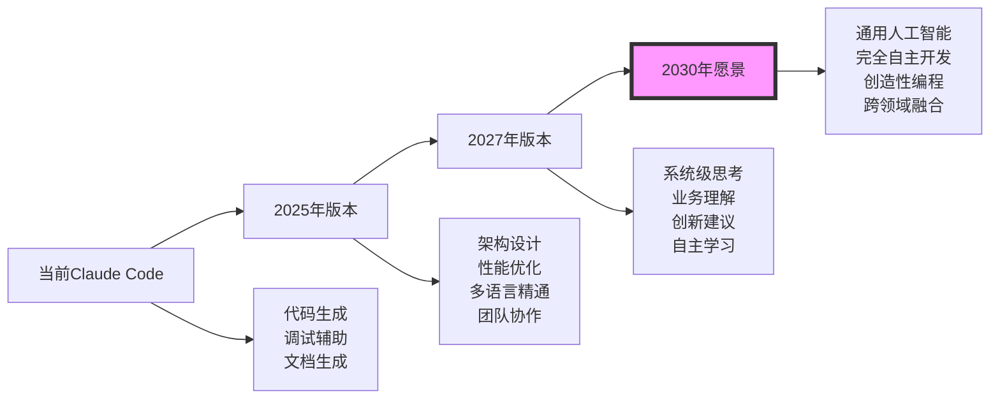
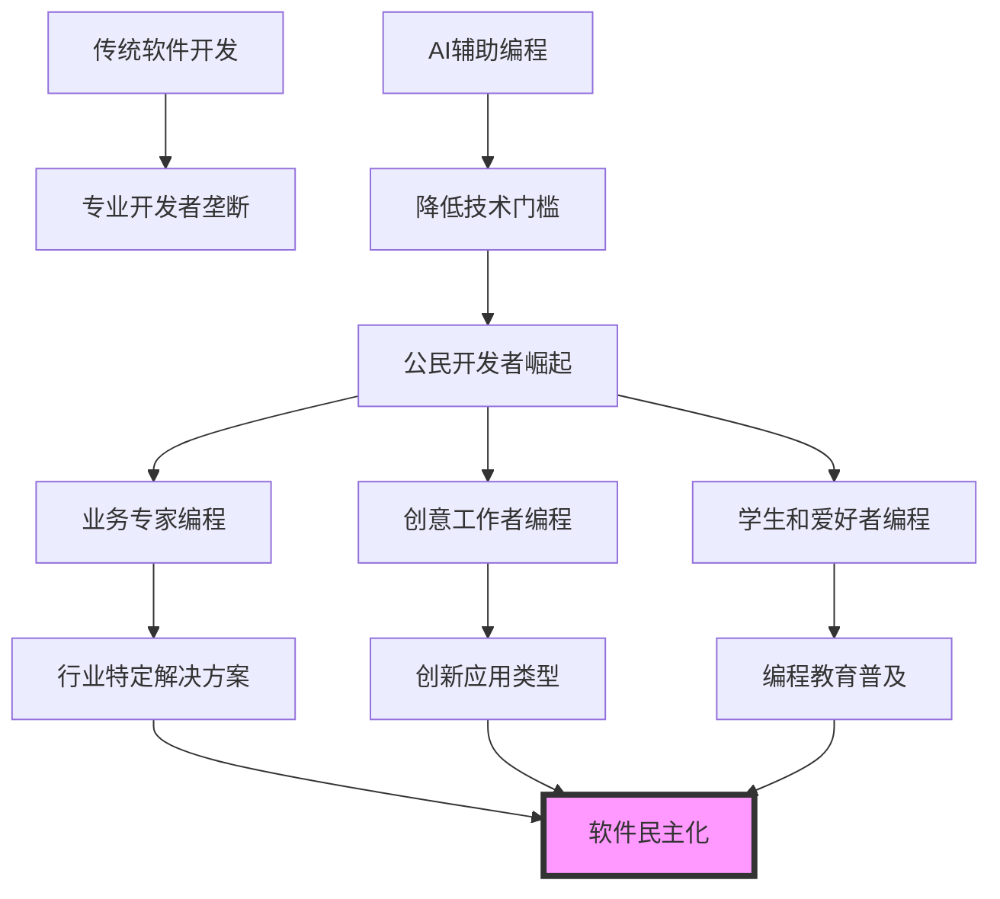
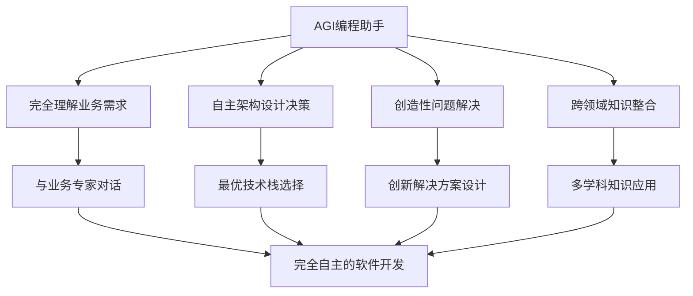
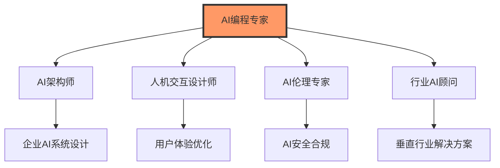
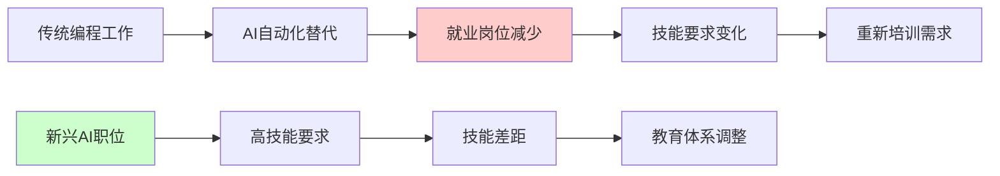

## 引言：AI编程新纪元的黎明

> "未来已来，只是分布不均。" —— William Gibson

当我们回顾软件开发的历史，每一次技术革命都重新定义了编程的本质：从机器语言到汇编语言，从高级编程语言到面向对象编程，从Web开发到移动开发，再到今天的AI辅助编程。**Claude Code正处在这场革命的最前沿**，它不仅是一个工具，更是编程范式转变的催化剂。

这篇文章将带你窥探AI编程的未来十年，分析技术发展轨迹、预测行业变革方向、探讨新兴应用场景，并为每一位开发者描绘清晰的学习路径和职业规划蓝图。

## 技术发展方向分析

### 1. AI模型技术演进

#### 多模态AI集成的深化

```
现在：文本驱动的代码生成
2025-2026：多模态融合编程体验
2027-2030：全感知编程环境

技术演进路径：
📝 纯文本交互 
    ↓
🖼️ 文本 + 图像理解
    ↓
🎤 语音 + 视觉 + 文本
    ↓
🧠 思维模式识别
    ↓
🌐 全环境感知编程
```

**技术突破点预测**：

1. **视觉编程接口**：通过手绘草图自动生成UI界面
2. **语音编程助手**：自然语言语音直接转换为代码
3. **思维模式识别**：通过脑电波等生物信号理解编程意图
4. **AR/VR编程环境**：沉浸式三维代码空间
5. **情感智能编程**：理解开发者情绪状态，调整工作模式

#### 模型能力的指数级增长



### 2. 编程范式的根本性变革

#### 从代码编写到意图表达

**传统编程范式**：
```
需求分析 → 架构设计 → 代码实现 → 测试调试 → 部署运维
```

**AI增强编程范式**：
```
意图表达 → AI理解 → 智能实现 → 协作优化 → 自主运维
```

**未来编程范式**：
```
思维表达 → AI深度理解 → 创造性实现 → 持续进化
```

#### 声明式编程的全面普及

```yaml
# 未来的"编程"可能是这样的
project_intent:
  name: "智能电商平台"
  target_users: "中小企业主"
  core_values: ["简单易用", "智能推荐", "数据驱动"]
  
business_requirements:
  user_management:
    - 多角色权限系统
    - 社交登录集成
    - 用户行为分析
    
  product_management:
    - 智能库存管理
    - AI驱动的商品推荐
    - 动态pricing策略
    
  order_processing:
    - 自动化订单流程
    - 智能物流优化
    - 预测性客户服务

technical_constraints:
  performance: "99.9%可用性，<200ms响应时间"
  scalability: "支持100万用户并发"
  security: "金融级数据安全"
  compliance: "GDPR、CCPA兼容"

deployment_preferences:
  cloud_provider: "multi-cloud"
  architecture: "microservices"
  monitoring: "comprehensive"
  ci_cd: "automated"

# AI将基于这些意图自动生成完整的系统
```

### 3. 开发工具生态的融合

#### IDE的智能化转型

```
传统IDE功能：
- 语法高亮
- 代码补全
- 调试工具
- 版本控制

AI增强IDE：
- 智能代码生成
- 上下文理解
- 自动重构
- 性能分析

未来智能IDE：
- 思维同步
- 预测性编程
- 自主问题解决
- 创意激发
```

#### 云原生开发环境

**特征预测**：
1. **无缝协作**：全球开发者实时协作编程
2. **弹性计算**：按需分配开发资源
3. **智能运维**：开发环境自动优化
4. **安全隔离**：零信任开发架构
5. **成本透明**：精确的开发成本计算

## 行业应用前景展望

### 1. 软件开发行业的重构

#### 开发者角色的演进

```
传统角色分工：
前端开发 | 后端开发 | 数据库管理 | 运维工程师 | 测试工程师

AI时代角色融合：
系统架构师 | 业务分析师 | AI训练师 | 创新设计师

未来角色定义：
数字产品策划师 | 人机协作专家 | 智能系统设计师
```

**新兴职业机会**：
- **AI提示工程师**：专门设计和优化AI交互提示
- **人机协作专家**：优化人类与AI的协作模式
- **智能系统架构师**：设计AI驱动的系统架构
- **数字伦理顾问**：确保AI系统的道德合规性
- **AI模型定制师**：为特定领域定制AI模型

#### 软件开发生产力的指数级提升

| 开发阶段 | 传统效率 | AI增强效率 | 未来AI效率 | 效率提升比 |
|---------|----------|------------|------------|------------|
| 需求分析 | 1周 | 2天 | 2小时 | 100:1 |
| 架构设计 | 1周 | 1天 | 1小时 | 168:1 |
| 代码实现 | 4周 | 3天 | 4小时 | 168:1 |
| 测试调试 | 2周 | 1天 | 自动化 | ∞:1 |
| 部署运维 | 1周 | 自动化 | 智能化 | ∞:1 |

### 2. 跨行业的AI编程渗透

#### 非传统软件行业的数字化转型

**制造业**：
- 智能工厂控制系统自动编程
- 设备维护预测算法自动生成
- 供应链优化系统智能构建

**医疗健康**：
- 诊断辅助系统快速开发
- 患者数据分析平台自动化
- 医疗设备接口智能生成

**金融服务**：
- 风险评估模型自动构建
- 交易系统智能优化
- 合规检查程序自动化

**教育科技**：
- 个性化学习系统生成
- 智能评估工具开发
- 教学内容自动化创作

#### 公民开发者的崛起



### 3. 新兴应用场景

#### 智能合约和区块链开发

**发展趋势**：
- 智能合约自动生成和审计
- DeFi协议智能构建
- NFT应用快速开发
- 跨链互操作性自动实现

#### 物联网(IoT)系统开发

**应用前景**：
- 设备驱动程序自动生成
- 传感器数据处理算法智能优化
- 边缘计算代码自动部署
- IoT安全协议智能实现

#### 量子计算程序开发

**未来可能性**：
- 量子算法设计辅助
- 量子-经典混合编程
- 量子纠错代码自动生成
- 量子优势应用识别

## 新功能预测与技术突破

### 1. 短期预测 (2025-2026)

#### 增强现实编程环境

```
功能描述：
- 3D代码可视化和编辑
- 手势控制编程界面
- 空间化代码结构展示
- 虚拟协作编程空间

技术实现：
- Apple Vision Pro集成
- Meta Quest开发支持
- 空间计算算法优化
- 低延迟交互技术
```

#### 自然语言编程接口

```python
# 未来可能的编程方式
claude_code.understand("我想要一个能够处理用户上传图片，自动识别图片中的文本，并将结果保存到数据库的Web应用")

# AI自动生成完整的项目结构：
# - FastAPI后端服务
# - React前端界面  
# - OCR文本识别服务
# - PostgreSQL数据存储
# - Docker容器化配置
# - 自动化测试套件
# - 监控和日志系统

claude_code.clarify("用户希望支持哪些图片格式？")
claude_code.suggest("是否需要添加用户认证系统？")
claude_code.implement("生成项目并进行初步测试")
```

#### 智能代码进化系统

**特征**：
- 代码自主优化和重构
- 性能瓶颈自动识别和解决
- 安全漏洞主动修复
- 最佳实践自动应用

### 2. 中期愿景 (2027-2028)

#### 通用人工智能编程助手



#### 自进化的软件生态系统

**概念特征**：
- 软件系统自主学习用户行为
- 自动调整架构以适应需求变化
- 预测性功能开发和部署
- 生态系统级的智能协调

### 3. 长期展望 (2029-2030)

#### 思维直连编程接口

```
脑机接口编程：
- 思维意图直接转化为代码
- 潜意识编程能力开发
- 创意思维的数字化表达
- 集体智慧编程模式

技术基础：
- 神经信号解码算法
- 大脑活动模式识别
- 实时思维状态分析
- 安全的脑机交互协议
```

#### 量子-AI混合计算编程

**革命性特征**：
- 量子算法与AI模型的深度融合
- 超并行编程模式
- 概率性编程语义
- 量子纠缠状态的程序逻辑

## 学习建议和职业规划

### 1. 短期学习策略 (1-2年)

#### 核心技能建设

**必备技能清单**：
```
技术技能：
✅ 掌握Claude Code的高级功能
✅ 熟练使用AI辅助开发工具
✅ 理解提示工程原理和实践
✅ 掌握多语言编程能力
✅ 熟悉云原生开发模式

软技能：
✅ 人机协作能力
✅ 创造性思维训练
✅ 跨领域知识整合
✅ 敏捷学习能力
✅ 沟通协作能力
```

#### 实践项目规划

**阶段性项目建议**：

**初级阶段 (1-3个月)**：
- 使用Claude Code开发个人博客
- 创建简单的Web应用
- 自动化日常工作脚本
- 参与开源项目贡献

**中级阶段 (4-8个月)**：
- 开发企业级应用系统
- 构建AI驱动的数据分析平台
- 设计微服务架构项目
- 领导团队协作项目

**高级阶段 (9-12个月)**：
- 创新性AI应用开发
- 行业解决方案设计
- 技术社区建设和分享
- 创业项目孵化

### 2. 中期发展规划 (3-5年)

#### 专业化方向选择



**各方向发展路径**：

**AI架构师路径**：
- 深度学习系统架构设计
- 大规模AI模型部署优化
- AI基础设施建设
- 技术团队领导

**人机交互专家路径**：
- AI交互界面设计
- 用户体验研究
- 产品设计创新
- 跨学科合作

**AI伦理顾问路径**：
- AI安全性评估
- 伦理合规体系建设
- 政策法规研究
- 社会影响评估

#### 能力矩阵构建

| 能力领域 | 基础级 | 熟练级 | 专家级 | 大师级 |
|----------|--------|--------|--------|--------|
| AI工具使用 | 基础操作 | 高效协作 | 创新应用 | 工具创造 |
| 系统设计 | 单体应用 | 分布式系统 | 大规模架构 | 创新架构 |
| 业务理解 | 功能实现 | 业务优化 | 战略规划 | 行业变革 |
| 团队协作 | 个人贡献 | 团队配合 | 团队领导 | 组织变革 |
| 创新思维 | 模仿学习 | 改进优化 | 原创设计 | 范式创新 |

### 3. 长期职业愿景 (5-10年)

#### 成为AI时代的技术领袖

**发展阶梯**：
```
技术专家 (1-3年)
    ↓
技术领导 (3-5年)
    ↓
行业专家 (5-7年)
    ↓
技术变革者 (7-10年)
```

**每个阶段的核心目标**：

**技术专家阶段**：
- 深度掌握AI辅助编程技能
- 在特定技术领域建立专业声誉
- 积累丰富的实战项目经验
- 建立个人技术品牌

**技术领导阶段**：
- 领导技术团队和复杂项目
- 制定技术战略和架构决策
- 培养和指导初级开发者
- 在技术社区建立影响力

**行业专家阶段**：
- 成为特定行业的AI应用专家
- 参与行业标准和最佳实践制定
- 发表技术文章和演讲分享
- 为企业提供技术咨询服务

**技术变革者阶段**：
- 引领技术发展方向和趋势
- 创造新的编程范式和工具
- 影响整个行业的发展轨迹
- 培养下一代技术领袖

### 4. 持续学习框架

#### 建立个人学习生态系统

```yaml
学习生态系统:
  
  信息获取渠道:
    - AI技术论文和研究报告
    - 行业领袖博客和分享
    - 技术会议和在线课程
    - 开源项目和代码仓库
    
  实践平台:
    - GitHub开源贡献
    - 个人技术博客
    - 技术社区参与
    - 创业项目孵化
    
  反馈机制:
    - 同行评议和代码审查
    - 用户反馈和市场验证
    - 技术指标和性能监控
    - 个人成长复盘总结
    
  知识管理:
    - 第二大脑(Second Brain)构建
    - 技术知识图谱维护
    - 最佳实践模板库
    - 个人经验案例集
```

#### 终身学习能力培养

**元学习技能**：
- **学会学习**：掌握高效学习方法和技巧
- **批判思维**：客观评估新技术的价值和风险
- **适应能力**：快速适应技术变革和环境变化
- **创新思维**：从多个角度思考和解决问题
- **系统思维**：理解复杂系统的整体性和关联性

## 挑战与机遇并存

### 1. 面临的主要挑战

#### 技术挑战

**AI可解释性问题**：
- AI决策过程的黑盒性质
- 代码生成逻辑的不透明
- 调试和维护的复杂性
- 质量保证的新标准需求

**技术依赖风险**：
- 对AI工具的过度依赖
- 基础编程能力的可能退化
- 技术栈锁定风险
- 供应商依赖问题

#### 社会和伦理挑战

**就业结构变化**：


**数据隐私和安全**：
- 代码和数据的隐私保护
- 知识产权归属问题
- 恶意代码生成风险
- AI模型的安全漏洞

### 2. 巨大的发展机遇

#### 创新应用机会

**新兴市场领域**：
- 个性化软件定制服务
- AI驱动的教育平台
- 智能健康管理系统
- 可持续发展技术解决方案

**跨界融合机会**：
- 艺术与技术的结合
- 科学研究工具开发
- 社会公益项目创新
- 文化传承数字化

#### 全球协作机遇

**开源生态繁荣**：
- 全球开发者协作新模式
- 知识共享和技能交流
- 创新速度的指数级提升
- 技术普惠的实现

## 结语：拥抱AI编程的未来

### 🚀 变革的本质

Claude Code不仅仅是一个编程工具，它代表着**人类智慧与人工智能深度融合的新时代**。在这个时代中：

- **编程不再是少数人的专利**，而是每个有创意的人都能掌握的表达方式
- **创造力成为最宝贵的资源**，技术实现变得触手可及
- **人机协作成为新常态**，AI放大人类的创造力和判断力
- **终身学习成为必需**，适应能力决定职业发展

### 💡 给未来开发者的建议

1. **保持开放心态**：拥抱新技术，不要害怕变化
2. **注重基础能力**：扎实的编程基础永远不会过时
3. **培养创造力**：这是AI无法替代的人类优势
4. **发展协作能力**：学会与AI和人类高效协作
5. **建立学习体系**：构建自己的知识管理和成长体系

### 🌟 AI编程时代的价值观

在AI编程的未来中，我们需要坚持的价值观：

- **技术向善**：用AI技术解决真实的社会问题
- **包容开放**：让每个人都能从AI技术中受益
- **持续创新**：永远保持探索和创造的精神
- **责任担当**：对AI系统的社会影响负责
- **人文关怀**：在技术进步中保持对人性的关注

### 🎯 行动召唤

未来已来，机会属于那些准备充分的人。从今天开始：

1. **开始学习Claude Code**，掌握AI辅助编程技能
2. **参与开源项目**，在实践中提升能力
3. **建立学习网络**，与同行交流分享经验
4. **关注行业趋势**，保持对新技术的敏感度
5. **规划职业发展**，制定清晰的成长路径

**Claude Code不仅在改变我们编程的方式，更在重新定义人类与计算机协作的可能性。在这个充满无限可能的AI编程新时代，每一个开发者都有机会成为变革的推动者和受益者。**

让我们一起拥抱这个激动人心的未来，用AI的力量创造更美好的数字世界！

## 相关文章推荐

- [什么是Claude Code？AI编程的新时代](01-什么是Claude-Code.md)
- [AI模型集成与定制](35-AI模型集成与定制.md)
- [性能优化与调试技巧](36-性能优化与调试技巧.md)
- [Claude Code插件开发](34-Claude-Code插件开发.md)

---

*本文是《Claude Code 完整教程系列》的第三十八部分，也是整个系列的总结篇。希望这个系列能够帮助每一位开发者在AI编程的道路上走得更远、走得更好！*

**🎉 感谢你陪伴我们走过了这段完整的Claude Code学习之旅！未来的编程世界等待着你去探索和创造。**