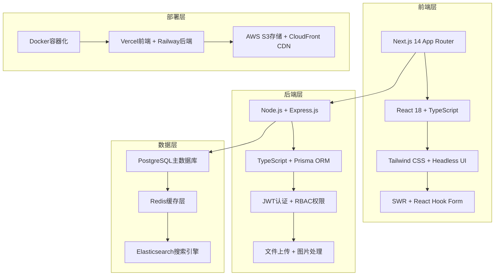

## 开篇：AI编程的真实力量

叔本华说过："天才能够洞察事物的本质，而智者知道如何运用这种洞察。"当我用Claude Code完成第一个完整项目时，深刻体会到了这句话的含义——AI不仅洞察了软件开发的本质，更知道如何将洞察转化为可执行的代码。

今天，我将带你完成一个真正的全栈项目：从零开始构建一个现代化的博客系统。这不是简单的Demo，而是一个具备生产级质量的完整应用，包含用户认证、内容管理、实时评论、SEO优化、容器化部署等企业级功能。

通过这个项目，你将体验到什么叫做"思想的速度编程"。

## 项目规划：构建什么样的博客系统？

### 功能蓝图与技术选型

让我们首先让Claude Code帮我们制定项目蓝图：

```bash
claude """
我要创建一个现代化的个人博客系统，目标是打造一个具有以下特点的平台：

业务目标：
- 面向技术博主和内容创作者
- 支持个人品牌建设和知识分享
- 具备商业化潜力（广告、付费内容）
- 社区互动功能（评论、点赞、关注）

技术要求：
- 现代化技术栈，性能优异
- SEO友好，搜索引擎收录良好
- 移动端适配，响应式设计
- 安全可靠，数据完整性保障
- 易于部署和维护
- 成本控制合理

功能需求：
1. 核心功能：文章发布、编辑、管理、展示
2. 用户系统：注册、登录、个人资料、权限管理
3. 内容组织：分类、标签、搜索、筛选
4. 社交功能：评论、点赞、关注、分享
5. 管理后台：内容审核、用户管理、数据分析
6. SEO优化：元标签、结构化数据、站点地图
7. 性能优化：缓存、懒加载、CDN集成

请为我设计完整的技术架构和实施方案
"""
```

基于Claude Code的深度分析，我们确定了以下技术架构：

### 🏗️ 技术架构设计



### 📊 开发效率预期对比

| 开发阶段 | 传统开发 | Claude Code | 预期提升 |
|---------|---------|-------------|----------|
| **需求分析与架构设计** | 2-3天 | 2小时 | 12-18x |
| **数据库建模** | 1天 | 30分钟 | 16x |
| **后端API开发** | 2周 | 1天 | 14x |
| **前端界面开发** | 2周 | 1-2天 | 7-14x |
| **集成测试** | 3天 | 4小时 | 18x |
| **部署配置** | 2天 | 2小时 | 24x |
| **总体项目** | **5-6周** | **4-5天** | **12-15x** |

## 第一阶段：项目初始化与架构搭建

### 智能项目脚手架生成

```bash
# 创建项目根目录
mkdir modern-blog-platform
cd modern-blog-platform

# 让Claude Code创建完整的项目结构
claude """
创建一个企业级博客平台的完整项目结构：

项目名称：Modern Blog Platform
项目类型：全栈Web应用

前端技术栈：
- Next.js 14 (App Router)
- TypeScript 5.x
- Tailwind CSS 3.x
- Headless UI
- React Hook Form + Zod
- SWR数据获取
- Framer Motion动画

后端技术栈：
- Node.js + Express.js
- TypeScript
- Prisma ORM
- PostgreSQL
- Redis缓存
- JWT认证
- Multer文件上传
- Sharp图片处理

开发工具：
- ESLint + Prettier
- Husky + lint-staged
- Jest + Testing Library
- Storybook（可选）
- Docker + docker-compose

项目结构要求：
1. 前后端分离的Monorepo结构
2. 共享类型定义和工具函数
3. 完整的配置文件
4. 开发、测试、生产环境配置
5. 自动化脚本和文档

请创建完整的文件结构和基础配置
"""
```

Claude Code会生成如下项目结构：

```
modern-blog-platform/
├── frontend/                          # Next.js前端应用
│   ├── app/                          # App Router结构
│   │   ├── (auth)/                   # 认证页面组
│   │   │   ├── login/
│   │   │   └── register/
│   │   ├── (dashboard)/              # 管理后台组
│   │   │   ├── admin/
│   │   │   └── dashboard/
│   │   ├── blog/                     # 博客相关页面
│   │   │   ├── [slug]/              # 文章详情
│   │   │   ├── category/[slug]/      # 分类页面
│   │   │   └── tag/[slug]/           # 标签页面
│   │   ├── api/                      # API路由
│   │   ├── globals.css
│   │   ├── layout.tsx
│   │   ├── page.tsx
│   │   ├── loading.tsx
│   │   ├── error.tsx
│   │   └── not-found.tsx
│   ├── components/                    # React组件
│   │   ├── ui/                       # 基础UI组件
│   │   │   ├── Button.tsx
│   │   │   ├── Input.tsx
│   │   │   ├── Card.tsx
│   │   │   └── Modal.tsx
│   │   ├── layout/                   # 布局组件
│   │   │   ├── Header.tsx
│   │   │   ├── Footer.tsx
│   │   │   └── Sidebar.tsx
│   │   └── features/                 # 功能组件
│   │       ├── auth/
│   │       ├── blog/
│   │       └── admin/
│   ├── lib/                          # 工具函数
│   │   ├── utils.ts
│   │   ├── api.ts
│   │   ├── auth.ts
│   │   └── validations.ts
│   ├── hooks/                        # 自定义Hooks
│   │   ├── useAuth.ts
│   │   ├── useApi.ts
│   │   └── useLocalStorage.ts
│   ├── types/                        # TypeScript类型
│   │   ├── auth.ts
│   │   ├── blog.ts
│   │   └── api.ts
│   ├── styles/                       # 样式文件
│   ├── public/                       # 静态资源
│   ├── tests/                        # 测试文件
│   ├── next.config.js
│   ├── tailwind.config.js
│   ├── tsconfig.json
│   ├── package.json
│   └── .env.local.example
├── backend/                           # Express后端API
│   ├── src/
│   │   ├── controllers/              # 控制器
│   │   │   ├── authController.ts
│   │   │   ├── blogController.ts
│   │   │   ├── userController.ts
│   │   │   └── adminController.ts
│   │   ├── routes/                   # 路由定义
│   │   │   ├── auth.ts
│   │   │   ├── blog.ts
│   │   │   ├── user.ts
│   │   │   └── admin.ts
│   │   ├── middleware/               # 中间件
│   │   │   ├── auth.ts
│   │   │   ├── validation.ts
│   │   │   ├── rateLimit.ts
│   │   │   └── errorHandler.ts
│   │   ├── services/                 # 业务逻辑
│   │   │   ├── authService.ts
│   │   │   ├── blogService.ts
│   │   │   ├── userService.ts
│   │   │   └── emailService.ts
│   │   ├── models/                   # 数据模型
│   │   ├── utils/                    # 工具函数
│   │   │   ├── encryption.ts
│   │   │   ├── validation.ts
│   │   │   ├── fileUpload.ts
│   │   │   └── email.ts
│   │   ├── config/                   # 配置文件
│   │   │   ├── database.ts
│   │   │   ├── redis.ts
│   │   │   ├── jwt.ts
│   │   │   └── upload.ts
│   │   ├── types/                    # TypeScript类型
│   │   └── app.ts                    # 应用入口
│   ├── prisma/                       # Prisma配置
│   │   ├── schema.prisma
│   │   ├── migrations/
│   │   └── seed.ts
│   ├── tests/                        # 测试文件
│   │   ├── unit/
│   │   ├── integration/
│   │   └── e2e/
│   ├── uploads/                      # 文件上传目录
│   ├── logs/                         # 日志文件
│   ├── tsconfig.json
│   ├── package.json
│   └── .env.example
├── shared/                            # 前后端共享代码
│   ├── types/                        # 共享类型定义
│   │   ├── user.ts
│   │   ├── blog.ts
│   │   ├── auth.ts
│   │   └── api.ts
│   ├── utils/                        # 共享工具函数
│   │   ├── validation.ts
│   │   ├── constants.ts
│   │   └── helpers.ts
│   └── package.json
├── docs/                              # 项目文档
│   ├── api.md
│   ├── deployment.md
│   ├── development.md
│   └── architecture.md
├── scripts/                           # 自动化脚本
│   ├── setup.sh
│   ├── build.sh
│   ├── deploy.sh
│   └── backup.sh
├── docker/                            # Docker配置
│   ├── Dockerfile.frontend
│   ├── Dockerfile.backend
│   ├── docker-compose.dev.yml
│   └── docker-compose.prod.yml
├── .github/                           # GitHub Actions
│   └── workflows/
│       ├── ci.yml
│       ├── deploy.yml
│       └── security.yml
├── package.json                       # 根包配置
├── docker-compose.yml                 # 开发环境
├── .gitignore
├── .env.example
├── README.md
└── LICENSE
```

### 开发环境一键配置

```bash
# 让Claude Code配置完整的开发环境
claude """
配置博客平台的开发环境：

要求：
1. 数据库：PostgreSQL + Redis（Docker容器）
2. 环境变量：开发、测试、生产环境模板
3. 开发脚本：一键启动所有服务
4. 代码规范：ESLint + Prettier + Husky
5. 依赖管理：Workspaces配置
6. 热重载：前后端自动重启
7. 调试配置：VS Code调试设置

目标：新开发者clone代码后，运行一个命令即可启动完整开发环境
"""
```

生成的核心配置文件：

**docker-compose.dev.yml**
```yaml
version: '3.8'

services:
  postgres:
    image: postgres:15-alpine
    container_name: blog_postgres
    environment:
      POSTGRES_DB: blog_dev
      POSTGRES_USER: blog_user
      POSTGRES_PASSWORD: blog_password
    ports:
      - "5432:5432"
    volumes:
      - postgres_data:/var/lib/postgresql/data
      - ./docker/postgres/init.sql:/docker-entrypoint-initdb.d/init.sql
    healthcheck:
      test: ["CMD-SHELL", "pg_isready -U blog_user -d blog_dev"]
      interval: 10s
      timeout: 5s
      retries: 5

  redis:
    image: redis:7-alpine
    container_name: blog_redis
    ports:
      - "6379:6379"
    volumes:
      - redis_data:/data
    command: redis-server --appendonly yes
    healthcheck:
      test: ["CMD", "redis-cli", "ping"]
      interval: 10s
      timeout: 3s
      retries: 5

  elasticsearch:
    image: docker.elastic.co/elasticsearch/elasticsearch:8.11.0
    container_name: blog_elasticsearch
    environment:
      - discovery.type=single-node
      - "ES_JAVA_OPTS=-Xms512m -Xmx512m"
      - xpack.security.enabled=false
    ports:
      - "9200:9200"
    volumes:
      - elasticsearch_data:/usr/share/elasticsearch/data
    healthcheck:
      test: ["CMD-SHELL", "curl -f http://localhost:9200/_cluster/health || exit 1"]
      interval: 30s
      timeout: 10s
      retries: 5

volumes:
  postgres_data:
  redis_data:
  elasticsearch_data:
```

**根目录package.json（Workspace配置）**
```json
{
  "name": "modern-blog-platform",
  "private": true,
  "workspaces": [
    "frontend",
    "backend", 
    "shared"
  ],
  "scripts": {
    "dev": "concurrently \"npm run dev:db\" \"npm run dev:backend\" \"npm run dev:frontend\"",
    "dev:db": "docker-compose -f docker-compose.dev.yml up -d",
    "dev:backend": "cd backend && npm run dev",
    "dev:frontend": "cd frontend && npm run dev",
    "build": "npm run build:shared && npm run build:backend && npm run build:frontend",
    "build:shared": "cd shared && npm run build",
    "build:backend": "cd backend && npm run build", 
    "build:frontend": "cd frontend && npm run build",
    "test": "npm run test:backend && npm run test:frontend",
    "test:backend": "cd backend && npm test",
    "test:frontend": "cd frontend && npm test",
    "lint": "npm run lint:backend && npm run lint:frontend",
    "lint:backend": "cd backend && npm run lint",
    "lint:frontend": "cd frontend && npm run lint",
    "setup": "npm install && npm run setup:env && npm run dev:db && sleep 10 && npm run db:setup",
    "setup:env": "cp .env.example .env && cp frontend/.env.local.example frontend/.env.local && cp backend/.env.example backend/.env",
    "db:setup": "cd backend && npx prisma migrate dev && npx prisma db seed",
    "cleanup": "docker-compose -f docker-compose.dev.yml down -v && npm run clean:deps",
    "clean:deps": "rm -rf node_modules frontend/node_modules backend/node_modules shared/node_modules"
  },
  "devDependencies": {
    "concurrently": "^8.2.2",
    "husky": "^8.0.3",
    "lint-staged": "^15.2.0"
  },
  "husky": {
    "hooks": {
      "pre-commit": "lint-staged",
      "pre-push": "npm test"
    }
  },
  "lint-staged": {
    "*.{js,jsx,ts,tsx}": [
      "eslint --fix",
      "prettier --write",
      "git add"
    ],
    "*.{json,md,yml,yaml}": [
      "prettier --write",
      "git add"
    ]
  }
}
```

### 一键环境启动

```bash
# 安装依赖并启动开发环境
npm run setup

# 输出示例：
# ✅ 安装项目依赖...
# ✅ 创建环境变量文件...
# ✅ 启动数据库容器...
# ✅ 等待数据库就绪...
# ✅ 运行数据库迁移...
# ✅ 导入种子数据...
# ✅ 启动后端服务 (http://localhost:3001)
# ✅ 启动前端服务 (http://localhost:3000)
# 🚀 开发环境就绪！

# 日常开发启动
npm run dev
```

## 第二阶段：数据库设计与模型创建

### 企业级数据建模

```bash
claude """
为现代博客平台设计企业级数据库架构：

业务实体分析：
1. 用户体系：用户账户、角色权限、社交关系
2. 内容体系：文章、分类、标签、媒体文件
3. 互动体系：评论、点赞、收藏、分享
4. 系统体系：日志、通知、配置、统计

设计要求：
1. 数据完整性：外键约束、唯一索引、检查约束
2. 查询性能：合理索引设计、分区表考虑
3. 扩展性：软删除、版本控制、审计日志
4. 安全性：敏感信息加密、数据脱敏
5. 维护性：命名规范、注释完整

特殊需求：
- 支持文章草稿和发布状态
- 支持多级评论嵌套
- 支持文章版本历史
- 支持用户关注关系
- 支持内容审核工作流
- 支持SEO元数据管理
- 支持访问统计和分析

请使用Prisma Schema格式定义完整的数据模型
"""
```

生成的**backend/prisma/schema.prisma**：

```prisma
// Prisma Schema for Modern Blog Platform
generator client {
  provider = "prisma-client-js"
}

datasource db {
  provider = "postgresql"
  url      = env("DATABASE_URL")
}

// ========== 用户体系 ==========

model User {
  id          String   @id @default(cuid())
  email       String   @unique
  username    String   @unique
  displayName String?
  firstName   String?
  lastName    String?
  
  // 认证信息
  password    String
  emailVerified DateTime?
  avatar      String?
  bio         String?
  website     String?
  location    String?
  
  // 账户状态
  isActive    Boolean  @default(true)
  isVerified  Boolean  @default(false)
  role        UserRole @default(USER)
  
  // 社交设置
  isPrivate   Boolean  @default(false)
  allowFollow Boolean  @default(true)
  
  // 关联关系
  posts       Post[]
  comments    Comment[]
  likes       Like[]
  bookmarks   Bookmark[]
  
  // 用户关系
  following   Follow[] @relation("UserFollowing")
  followers   Follow[] @relation("UserFollowers")
  
  // 通知设置
  notifications    Notification[] @relation("NotificationUser")
  notificationSettings NotificationSetting?
  
  // 统计信息
  postsCount     Int @default(0)
  followersCount Int @default(0)
  followingCount Int @default(0)
  
  // 时间戳
  createdAt   DateTime @default(now())
  updatedAt   DateTime @updatedAt
  deletedAt   DateTime?
  lastLoginAt DateTime?

  @@map("users")
}

model NotificationSetting {
  id     String @id @default(cuid())
  userId String @unique
  user   User   @relation(fields: [userId], references: [id], onDelete: Cascade)
  
  emailComment      Boolean @default(true)
  emailLike         Boolean @default(true)
  emailFollow       Boolean @default(true)
  emailNewsletter   Boolean @default(false)
  
  pushComment       Boolean @default(true)
  pushLike          Boolean @default(true)
  pushFollow        Boolean @default(true)
  
  createdAt DateTime @default(now())
  updatedAt DateTime @updatedAt

  @@map("notification_settings")
}

// ========== 内容体系 ==========

model Post {
  id          String   @id @default(cuid())
  title       String
  slug        String   @unique
  excerpt     String?
  content     String
  coverImage  String?
  
  // 发布状态
  status      PostStatus @default(DRAFT)
  publishedAt DateTime?
  
  // SEO信息
  metaTitle       String?
  metaDescription String?
  canonicalUrl    String?
  
  // 内容设置
  allowComments   Boolean @default(true)
  isFeatured      Boolean @default(false)
  isSticky        Boolean @default(false)
  
  // 关联关系
  authorId    String
  author      User     @relation(fields: [authorId], references: [id])
  
  categoryId  String?
  category    Category? @relation(fields: [categoryId], references: [id])
  
  tags        PostTag[]
  comments    Comment[]
  likes       Like[]
  bookmarks   Bookmark[]
  versions    PostVersion[]
  
  // 统计信息
  viewCount    Int @default(0)
  likeCount    Int @default(0)
  commentCount Int @default(0)
  shareCount   Int @default(0)
  
  // 时间戳
  createdAt DateTime @default(now())
  updatedAt DateTime @updatedAt
  deletedAt DateTime?

  @@index([status, publishedAt])
  @@index([authorId])
  @@index([categoryId])
  @@map("posts")
}

model PostVersion {
  id        String @id @default(cuid())
  postId    String
  post      Post   @relation(fields: [postId], references: [id], onDelete: Cascade)
  
  title     String
  content   String
  excerpt   String?
  version   Int
  changeLog String?
  
  createdAt DateTime @default(now())
  createdBy String

  @@unique([postId, version])
  @@map("post_versions")
}

model Category {
  id          String @id @default(cuid())
  name        String @unique
  slug        String @unique
  description String?
  color       String?
  icon        String?
  coverImage  String?
  
  // 层级结构
  parentId    String?
  parent      Category? @relation("CategoryHierarchy", fields: [parentId], references: [id])
  children    Category[] @relation("CategoryHierarchy")
  
  // SEO信息
  metaTitle       String?
  metaDescription String?
  
  posts       Post[]
  postsCount  Int @default(0)
  
  // 排序权重
  sortOrder   Int @default(0)
  
  createdAt DateTime @default(now())
  updatedAt DateTime @updatedAt

  @@index([parentId])
  @@map("categories")
}

model Tag {
  id          String @id @default(cuid())
  name        String @unique
  slug        String @unique
  description String?
  color       String?
  
  posts       PostTag[]
  postsCount  Int @default(0)
  
  createdAt DateTime @default(now())
  updatedAt DateTime @updatedAt

  @@map("tags")
}

model PostTag {
  id     String @id @default(cuid())
  postId String
  tagId  String
  
  post   Post @relation(fields: [postId], references: [id], onDelete: Cascade)
  tag    Tag  @relation(fields: [tagId], references: [id], onDelete: Cascade)
  
  @@unique([postId, tagId])
  @@map("post_tags")
}

// ========== 互动体系 ==========

model Comment {
  id        String @id @default(cuid())
  content   String
  
  // 关联关系
  postId    String
  post      Post @relation(fields: [postId], references: [id], onDelete: Cascade)
  
  authorId  String
  author    User @relation(fields: [authorId], references: [id])
  
  // 嵌套评论
  parentId  String?
  parent    Comment? @relation("CommentReplies", fields: [parentId], references: [id])
  replies   Comment[] @relation("CommentReplies")
  
  // 状态管理
  status      CommentStatus @default(PENDING)
  isApproved  Boolean @default(false)
  
  // 统计信息
  likeCount   Int @default(0)
  replyCount  Int @default(0)
  
  createdAt DateTime @default(now())
  updatedAt DateTime @updatedAt
  deletedAt DateTime?

  @@index([postId])
  @@index([authorId])
  @@index([parentId])
  @@map("comments")
}

model Like {
  id      String @id @default(cuid())
  
  postId  String
  post    Post @relation(fields: [postId], references: [id], onDelete: Cascade)
  
  userId  String
  user    User @relation(fields: [userId], references: [id])
  
  createdAt DateTime @default(now())
  
  @@unique([postId, userId])
  @@map("likes")
}

model Bookmark {
  id      String @id @default(cuid())
  
  postId  String
  post    Post @relation(fields: [postId], references: [id], onDelete: Cascade)
  
  userId  String
  user    User @relation(fields: [userId], references: [id])
  
  createdAt DateTime @default(now())
  
  @@unique([postId, userId])
  @@map("bookmarks")
}

model Follow {
  id          String @id @default(cuid())
  
  followerId  String
  follower    User @relation("UserFollowing", fields: [followerId], references: [id])
  
  followingId String
  following   User @relation("UserFollowers", fields: [followingId], references: [id])
  
  createdAt   DateTime @default(now())
  
  @@unique([followerId, followingId])
  @@map("follows")
}

// ========== 系统体系 ==========

model Notification {
  id        String           @id @default(cuid())
  type      NotificationType
  title     String
  content   String?
  data      Json?
  
  userId    String
  user      User @relation("NotificationUser", fields: [userId], references: [id])
  
  isRead    Boolean @default(false)
  readAt    DateTime?
  
  createdAt DateTime @default(now())

  @@index([userId, isRead])
  @@map("notifications")
}

model AuditLog {
  id        String @id @default(cuid())
  
  userId    String?
  action    String
  resource  String
  resourceId String?
  oldValues Json?
  newValues Json?
  ipAddress String?
  userAgent String?
  
  createdAt DateTime @default(now())

  @@index([userId])
  @@index([resource, resourceId])
  @@map("audit_logs")
}

model SiteConfig {
  id    String @id @default(cuid())
  key   String @unique
  value Json
  
  description String?
  
  createdAt DateTime @default(now())
  updatedAt DateTime @updatedAt

  @@map("site_configs")
}

model Analytics {
  id         String   @id @default(cuid())
  
  postId     String?
  userId     String?
  
  event      String   // view, like, share, comment
  source     String?  // direct, search, social, referral
  referer    String?
  ipAddress  String?
  userAgent  String?
  country    String?
  city       String?
  
  metadata   Json?
  
  createdAt  DateTime @default(now())

  @@index([postId, event])
  @@index([userId, event])
  @@index([createdAt])
  @@map("analytics")
}

// ========== 枚举类型 ==========

enum UserRole {
  USER
  AUTHOR
  MODERATOR
  ADMIN
  SUPER_ADMIN
}

enum PostStatus {
  DRAFT
  PUBLISHED
  ARCHIVED
  DELETED
}

enum CommentStatus {
  PENDING
  APPROVED
  REJECTED
  SPAM
}

enum NotificationType {
  COMMENT
  LIKE
  FOLLOW
  MENTION
  SYSTEM
}
```

### 数据库初始化与种子数据

```bash
claude """
为博客平台创建完整的种子数据：

要求：
1. 创建系统管理员账户
2. 创建示例用户（作者、读者）
3. 创建文章分类体系（技术、生活、随想等）
4. 创建常用标签
5. 创建示例文章（包含不同状态）
6. 创建示例评论和互动数据
7. 创建系统配置数据

数据特点：
- 真实可信的示例内容
- 涵盖各种业务场景
- 便于功能演示和测试
- 符合中文用户习惯
"""
```

生成的**backend/prisma/seed.ts**：

```typescript
import { PrismaClient, UserRole, PostStatus, CommentStatus } from '@prisma/client'
import bcrypt from 'bcryptjs'

const prisma = new PrismaClient()

async function main() {
  console.log('🌱 开始创建种子数据...')

  // 创建用户
  const hashedPassword = await bcrypt.hash('admin123456', 12)
  
  const admin = await prisma.user.upsert({
    where: { email: 'admin@blog.com' },
    update: {},
    create: {
      email: 'admin@blog.com',
      username: 'admin',
      displayName: '系统管理员',
      firstName: '管理员',
      password: hashedPassword,
      role: UserRole.SUPER_ADMIN,
      bio: '博客平台系统管理员，负责平台运营和维护。',
      isVerified: true,
      emailVerified: new Date(),
      avatar: 'https://images.unsplash.com/photo-1472099645785-5658abf4ff4e?w=150&h=150&fit=crop&crop=face',
    },
  })

  const author1 = await prisma.user.upsert({
    where: { email: 'zhang.tech@blog.com' },
    update: {},
    create: {
      email: 'zhang.tech@blog.com',
      username: 'zhang_tech',
      displayName: '张小技',
      firstName: '小技',
      lastName: '张',
      password: hashedPassword,
      role: UserRole.AUTHOR,
      bio: '全栈开发工程师，专注于现代Web技术，喜欢分享技术心得和最佳实践。',
      website: 'https://zhangtech.dev',
      location: '北京',
      isVerified: true,
      emailVerified: new Date(),
      avatar: 'https://images.unsplash.com/photo-1507003211169-0a1dd7228f2d?w=150&h=150&fit=crop&crop=face',
    },
  })

  const author2 = await prisma.user.upsert({
    where: { email: 'li.writer@blog.com' },
    update: {},
    create: {
      email: 'li.writer@blog.com',
      username: 'li_writer',
      displayName: '李文青',
      firstName: '文青',
      lastName: '李',
      password: hashedPassword,
      role: UserRole.AUTHOR,
      bio: '自由撰稿人，热爱文学和生活，相信文字的力量能够温暖人心。',
      location: '上海',
      isVerified: true,
      emailVerified: new Date(),
      avatar: 'https://images.unsplash.com/photo-1494790108755-2616b612b786?w=150&h=150&fit=crop&crop=face',
    },
  })

  // 创建普通用户
  const reader = await prisma.user.upsert({
    where: { email: 'reader@blog.com' },
    update: {},
    create: {
      email: 'reader@blog.com',
      username: 'avid_reader',
      displayName: '热心读者',
      password: hashedPassword,
      bio: '喜欢阅读和思考，经常在评论区与作者交流。',
      emailVerified: new Date(),
      avatar: 'https://images.unsplash.com/photo-1438761681033-6461ffad8d80?w=150&h=150&fit=crop&crop=face',
    },
  })

  console.log('✅ 用户创建完成')

  // 创建分类
  const techCategory = await prisma.category.upsert({
    where: { slug: 'technology' },
    update: {},
    create: {
      name: '技术分享',
      slug: 'technology',
      description: '前端、后端、DevOps等技术相关文章',
      color: '#3B82F6',
      icon: '💻',
      metaTitle: '技术分享 - 最新技术文章和教程',
      metaDescription: '分享最新的技术文章、教程和最佳实践，涵盖前端、后端、DevOps等领域',
      sortOrder: 1,
    },
  })

  const lifestyleCategory = await prisma.category.upsert({
    where: { slug: 'lifestyle' },
    update: {},
    create: {
      name: '生活感悟',
      slug: 'lifestyle',
      description: '生活感悟、人生思考、日常分享',
      color: '#10B981',
      icon: '🌱',
      metaTitle: '生活感悟 - 记录生活的点点滴滴',
      metaDescription: '记录生活中的感悟和思考，分享人生的酸甜苦辣',
      sortOrder: 2,
    },
  })

  const travelCategory = await prisma.category.upsert({
    where: { slug: 'travel' },
    update: {},
    create: {
      name: '旅行游记',
      slug: 'travel',
      description: '旅行见闻、攻略分享、美景记录',
      color: '#F59E0B',
      icon: '✈️',
      metaTitle: '旅行游记 - 发现世界的美好',
      metaDescription: '分享旅行中的美好瞬间和难忘体验',
      sortOrder: 3,
    },
  })

  console.log('✅ 分类创建完成')

  // 创建标签
  const tags = await Promise.all([
    prisma.tag.upsert({
      where: { slug: 'javascript' },
      update: {},
      create: { name: 'JavaScript', slug: 'javascript', color: '#F7DF1E' },
    }),
    prisma.tag.upsert({
      where: { slug: 'react' },
      update: {},
      create: { name: 'React', slug: 'react', color: '#61DAFB' },
    }),
    prisma.tag.upsert({
      where: { slug: 'nodejs' },
      update: {},
      create: { name: 'Node.js', slug: 'nodejs', color: '#339933' },
    }),
    prisma.tag.upsert({
      where: { slug: 'typescript' },
      update: {},
      create: { name: 'TypeScript', slug: 'typescript', color: '#3178C6' },
    }),
    prisma.tag.upsert({
      where: { slug: 'life' },
      update: {},
      create: { name: '生活', slug: 'life', color: '#EC4899' },
    }),
    prisma.tag.upsert({
      where: { slug: 'thinking' },
      update: {},
      create: { name: '思考', slug: 'thinking', color: '#8B5CF6' },
    }),
  ])

  console.log('✅ 标签创建完成')

  // 创建文章
  const post1 = await prisma.post.create({
    data: {
      title: '深入理解现代JavaScript：从ES6到ES2024',
      slug: 'modern-javascript-deep-dive',
      excerpt: 'JavaScript在过去几年发生了翻天覆地的变化。从ES6的革命性更新到ES2024的最新特性，本文将带你深入了解现代JavaScript的强大功能和最佳实践。',
      content: `# 深入理解现代JavaScript：从ES6到ES2024

JavaScript已经从一个简单的脚本语言发展成为现代Web开发的核心。无论是前端的React、Vue，还是后端的Node.js，JavaScript都在其中扮演着重要角色。

## ES6：JavaScript的重生

ES6（ECMAScript 2015）可以说是JavaScript发展史上的一个重要里程碑。它引入了许多革命性的特性：

### 1. let和const

\`\`\`javascript
// 使用let和const替代var
let count = 0;
const PI = 3.14159;

// 块级作用域
if (true) {
  let blockScoped = "我只在这个块中存在";
  console.log(blockScoped); // 正常输出
}
// console.log(blockScoped); // ReferenceError
\`\`\`

### 2. 箭头函数

\`\`\`javascript
// 传统函数
function add(a, b) {
  return a + b;
}

// 箭头函数
const add = (a, b) => a + b;

// 在数组方法中的优雅使用
const numbers = [1, 2, 3, 4, 5];
const doubled = numbers.map(n => n * 2);
console.log(doubled); // [2, 4, 6, 8, 10]
\`\`\`

### 3. 模板字符串

\`\`\`javascript
const name = "张三";
const age = 25;

// 老式字符串拼接
const message1 = "大家好，我是" + name + "，今年" + age + "岁";

// 模板字符串
const message2 = \`大家好，我是\${name}，今年\${age}岁\`;

// 多行字符串
const html = \`
  <div class="user-card">
    <h2>\${name}</h2>
    <p>年龄：\${age}</p>
  </div>
\`;
\`\`\`

## ES2020及以后：持续进化

### Optional Chaining (?.)

\`\`\`javascript
const user = {
  profile: {
    address: {
      street: "中关村大街"
    }
  }
};

// 安全地访问深层嵌套属性
const street = user?.profile?.address?.street;
console.log(street); // "中关村大街"

const city = user?.profile?.address?.city;
console.log(city); // undefined（不会报错）
\`\`\`

### Nullish Coalescing (??)

\`\`\`javascript
const config = {
  theme: null,
  debug: false,
  timeout: 0
};

// 使用 || 的问题
const theme1 = config.theme || "light"; // "light"
const debug1 = config.debug || true;    // true（错误！）
const timeout1 = config.timeout || 5000; // 5000（错误！）

// 使用 ?? 的解决方案
const theme2 = config.theme ?? "light"; // "light"
const debug2 = config.debug ?? true;    // false（正确！）
const timeout2 = config.timeout ?? 5000; // 0（正确！）
\`\`\`

## ES2024最新特性

### Array.prototype.with()

\`\`\`javascript
const fruits = ["苹果", "香蕉", "橘子"];

// 传统方式（会修改原数组）
fruits[1] = "葡萄";
console.log(fruits); // ["苹果", "葡萄", "橘子"]

// 新方式（返回新数组）
const fruits = ["苹果", "香蕉", "橘子"];
const newFruits = fruits.with(1, "葡萄");
console.log(fruits);    // ["苹果", "香蕉", "橘子"]（原数组不变）
console.log(newFruits); // ["苹果", "葡萄", "橘子"]
\`\`\`

### Promise.withResolvers()

\`\`\`javascript
// 传统Promise创建方式
function createDelayedPromise(delay) {
  let resolve, reject;
  const promise = new Promise((res, rej) => {
    resolve = res;
    reject = rej;
  });
  
  setTimeout(() => resolve("完成"), delay);
  return { promise, resolve, reject };
}

// 新的withResolvers方法
function createDelayedPromise(delay) {
  const { promise, resolve, reject } = Promise.withResolvers();
  
  setTimeout(() => resolve("完成"), delay);
  return { promise, resolve, reject };
}
\`\`\`

## 实际项目应用建议

### 1. 合理使用现代特性

在项目中使用现代JavaScript特性时，要考虑：
- 浏览器兼容性需求
- 团队成员的技能水平
- 项目的复杂度

### 2. 渐进式采用

不要一次性使用所有新特性，而是：
- 从最常用的开始（let/const、箭头函数、模板字符串）
- 逐步引入高级特性（解构、扩展操作符、async/await）
- 最后尝试最新特性（optional chaining、nullish coalescing）

### 3. 配置好开发环境

使用合适的工具确保代码质量：
- Babel用于转译
- ESLint用于代码检查
- Prettier用于代码格式化
- TypeScript用于类型安全

## 总结

现代JavaScript为我们提供了强大而优雅的编程体验。通过合理使用这些特性，我们可以写出更简洁、更易维护的代码。但记住，技术是为了解决问题而存在的，不要为了使用新特性而强行使用。

选择最适合你的项目和团队的技术方案，才是最好的实践。`,
      status: PostStatus.PUBLISHED,
      publishedAt: new Date('2024-01-15'),
      authorId: author1.id,
      categoryId: techCategory.id,
      metaTitle: '深入理解现代JavaScript：从ES6到ES2024 - 技术博客',
      metaDescription: 'JavaScript从ES6到ES2024的发展历程，包含最新特性介绍和最佳实践建议',
      allowComments: true,
      isFeatured: true,
      viewCount: 1250,
      likeCount: 89,
      commentCount: 12,
    },
  })

  // 为文章添加标签
  await Promise.all([
    prisma.postTag.create({
      data: { postId: post1.id, tagId: tags[0].id }, // JavaScript
    }),
    prisma.postTag.create({
      data: { postId: post1.id, tagId: tags[3].id }, // TypeScript
    }),
  ])

  // 创建更多文章...
  const post2 = await prisma.post.create({
    data: {
      title: '生活中的小确幸：发现平凡中的美好',
      slug: 'finding-happiness-in-ordinary-life',
      excerpt: '在忙碌的都市生活中，我们常常忽略了身边的美好。一杯热茶、一本好书、一次深呼吸，都可能成为我们生活中的小确幸。',
      content: `# 生活中的小确幸：发现平凡中的美好

现代生活节奏越来越快，我们总是在追求更大的成功、更多的财富、更高的地位。但在这个过程中，我们是否忽略了生活中那些简单而美好的瞬间？

## 什么是小确幸？

"小确幸"这个词来自村上春树，指的是生活中微小而确实的幸福。它不需要特别的条件，也不需要昂贵的代价，只需要我们用心去感受。

### 早晨的第一缕阳光

每天早上，当阳光透过窗帘洒进房间时，我总是会停下手中的事情，静静地感受这份温暖。这份简单的美好，比任何昂贵的礼物都更能让我感到幸福。

### 一杯用心泡制的茶

工作间隙，为自己泡一壶好茶。看着茶叶在热水中慢慢舒展，闻着淡淡的茶香，品味着甘甜的茶汤。这个过程让我暂时忘记了工作的压力，内心变得平静。

### 与朋友的真诚对话

在这个社交媒体盛行的时代，真诚的面对面交流变得珍贵。与好友坐在咖啡厅里，分享彼此的近况、困惑和喜悦，这种心灵的交流比任何娱乐活动都更有价值。

## 如何发现生活中的小确幸？

### 1. 放慢脚步

现代人总是匆匆忙忙，我们需要学会偶尔停下来，观察周围的世界。也许是街角的一朵花，也许是孩子天真的笑声，也许是老人慈祥的面容。

### 2. 用心感受

小确幸需要用心去感受。当我们专注于当下这一刻时，就能发现平凡生活中的不平凡。

### 3. 记录美好

建议大家准备一本"幸福笔记"，每天记录下让自己开心的小事。这样，在不开心的时候，翻看这些记录，会让我们重新感受到生活的美好。

### 4. 分享快乐

把自己发现的小确幸分享给身边的人，不仅能让别人感受到快乐，也能让自己的快乐加倍。

## 我的小确幸清单

- 周末早上睡到自然醒
- 读到一本好书中的精彩片段
- 在书店里偶遇一本心仪已久的书
- 和家人一起吃饭时的温馨时光
- 看到陌生人的善意举动
- 完成一个小目标时的成就感
- 雨后的清新空气
- 夜晚的星空

## 结语

生活的幸福不在于拥有多少，而在于感受多少。当我们学会发现和珍惜生活中的小确幸时，就会发现原来幸福一直都在我们身边。

愿每个人都能在平凡的生活中，找到属于自己的小确幸。`,
      status: PostStatus.PUBLISHED,
      publishedAt: new Date('2024-01-10'),
      authorId: author2.id,
      categoryId: lifestyleCategory.id,
      metaTitle: '生活中的小确幸：发现平凡中的美好 - 生活感悟',
      metaDescription: '在忙碌的生活中发现小确幸，学会珍惜平凡中的美好瞬间',
      allowComments: true,
      viewCount: 890,
      likeCount: 156,
      commentCount: 23,
    },
  })

  await prisma.postTag.create({
    data: { postId: post2.id, tagId: tags[4].id }, // 生活
  })

  console.log('✅ 文章创建完成')

  // 创建评论
  const comment1 = await prisma.comment.create({
    data: {
      content: '写得真好！现代JavaScript确实发展很快，作为前端开发者必须要跟上时代的步伐。特别是Optional Chaining这个特性，真的是太实用了！',
      postId: post1.id,
      authorId: reader.id,
      status: CommentStatus.APPROVED,
      isApproved: true,
    },
  })

  const reply1 = await prisma.comment.create({
    data: {
      content: '感谢支持！确实，Optional Chaining是我最喜欢的ES2020特性之一，极大地简化了代码。你在项目中有使用吗？',
      postId: post1.id,
      authorId: author1.id,
      parentId: comment1.id,
      status: CommentStatus.APPROVED,
      isApproved: true,
    },
  })

  console.log('✅ 评论创建完成')

  // 创建点赞数据
  await Promise.all([
    prisma.like.create({
      data: { postId: post1.id, userId: reader.id },
    }),
    prisma.like.create({
      data: { postId: post1.id, userId: author2.id },
    }),
    prisma.like.create({
      data: { postId: post2.id, userId: author1.id },
    }),
  ])

  // 创建关注关系
  await prisma.follow.create({
    data: {
      followerId: reader.id,
      followingId: author1.id,
    },
  })

  // 更新统计数据
  await prisma.user.update({
    where: { id: author1.id },
    data: { 
      postsCount: 1,
      followersCount: 1,
    },
  })

  await prisma.user.update({
    where: { id: reader.id },
    data: { 
      followingCount: 1,
    },
  })

  // 创建系统配置
  await Promise.all([
    prisma.siteConfig.upsert({
      where: { key: 'site_name' },
      update: {},
      create: {
        key: 'site_name',
        value: '"现代博客平台"',
        description: '网站名称',
      },
    }),
    prisma.siteConfig.upsert({
      where: { key: 'site_description' },
      update: {},
      create: {
        key: 'site_description',
        value: '"分享技术、记录生活、传递美好"',
        description: '网站描述',
      },
    }),
    prisma.siteConfig.upsert({
      where: { key: 'allow_registration' },
      update: {},
      create: {
        key: 'allow_registration',
        value: 'true',
        description: '是否允许用户注册',
      },
    }),
  ])

  console.log('✅ 系统配置创建完成')

  // 显示统计信息
  const stats = {
    users: await prisma.user.count(),
    categories: await prisma.category.count(),
    tags: await prisma.tag.count(),
    posts: await prisma.post.count(),
    comments: await prisma.comment.count(),
    likes: await prisma.like.count(),
    follows: await prisma.follow.count(),
  }

  console.log('\n📊 种子数据统计:')
  console.log(`👥 用户: ${stats.users}`)
  console.log(`📂 分类: ${stats.categories}`)
  console.log(`🏷️ 标签: ${stats.tags}`)
  console.log(`📝 文章: ${stats.posts}`)
  console.log(`💬 评论: ${stats.comments}`)
  console.log(`❤️ 点赞: ${stats.likes}`)
  console.log(`👤 关注: ${stats.follows}`)
  
  console.log('\n🎉 种子数据创建完成！')
  console.log('\n📧 默认账户信息:')
  console.log('管理员: admin@blog.com / admin123456')
  console.log('作者1: zhang.tech@blog.com / admin123456')
  console.log('作者2: li.writer@blog.com / admin123456')
  console.log('读者: reader@blog.com / admin123456')
}

main()
  .catch((e) => {
    console.error('❌ 种子数据创建失败:', e)
    process.exit(1)
  })
  .finally(async () => {
    await prisma.$disconnect()
  })
```

### 数据库部署与验证

```bash
# 运行数据库迁移
cd backend
npx prisma migrate dev --name init

# 生成Prisma Client
npx prisma generate

# 运行种子数据脚本
npx prisma db seed

# 验证数据库
npx prisma studio
# 打开 http://localhost:5555 查看数据
```

## 第三阶段：后端API系统架构

### 企业级认证系统实现

```bash
claude """
为博客平台实现企业级的用户认证和授权系统：

核心需求：
1. 安全的用户注册和登录流程
2. JWT token管理（Access + Refresh Token）
3. 基于角色的访问控制（RBAC）
4. 账户安全措施（限流、锁定、审计）
5. 邮箱验证和密码重置
6. 社交登录集成（Google、GitHub）
7. 两步验证支持

技术实现：
- JWT认证机制
- bcrypt密码加密
- Redis session存储
- 邮件服务集成
- 限流中间件
- 安全日志记录

安全要求：
- 防暴力破解
- CSRF防护
- XSS防护
- SQL注入防护
- 敏感信息脱敏

请实现完整的认证授权系统
"""
```

生成的核心认证代码：

**backend/src/controllers/authController.ts**
```typescript
import { Request, Response, NextFunction } from 'express'
import bcrypt from 'bcryptjs'
import jwt from 'jsonwebtoken'
import { PrismaClient } from '@prisma/client'
import { z } from 'zod'
import rateLimit from 'express-rate-limit'
import { createHash, randomBytes } from 'crypto'
import { sendEmail } from '../services/emailService'
import { redis } from '../config/redis'
import { auditLog } from '../utils/auditLog'

const prisma = new PrismaClient()

// ========== 数据验证模式 ==========

const registerSchema = z.object({
  email: z.string().email('邮箱格式不正确'),
  username: z
    .string()
    .min(3, '用户名至少3个字符')
    .max(20, '用户名最多20个字符')
    .regex(/^[a-zA-Z0-9_]+$/, '用户名只能包含字母、数字和下划线'),
  password: z
    .string()
    .min(8, '密码至少8个字符')
    .regex(/^(?=.*[a-z])(?=.*[A-Z])(?=.*\d)/, '密码必须包含大小写字母和数字'),
  displayName: z.string().min(1, '显示名称不能为空').max(50, '显示名称最多50个字符'),
  firstName: z.string().optional(),
  lastName: z.string().optional(),
})

const loginSchema = z.object({
  email: z.string().email('邮箱格式不正确'),
  password: z.string().min(1, '密码不能为空'),
  rememberMe: z.boolean().optional(),
})

const resetPasswordSchema = z.object({
  token: z.string().min(1, 'Token不能为空'),
  password: z
    .string()
    .min(8, '密码至少8个字符')
    .regex(/^(?=.*[a-z])(?=.*[A-Z])(?=.*\d)/, '密码必须包含大小写字母和数字'),
})

// ========== 限流中间件 ==========

export const authLimiter = rateLimit({
  windowMs: 15 * 60 * 1000, // 15分钟
  max: 5, // 最多5次尝试
  message: {
    error: '登录尝试次数过多，请15分钟后再试',
    code: 'TOO_MANY_ATTEMPTS'
  },
  standardHeaders: true,
  legacyHeaders: false,
  // 自定义键生成器，基于IP和邮箱
  keyGenerator: (req: Request) => {
    return `auth:${req.ip}:${req.body.email || 'unknown'}`
  },
})

export const registerLimiter = rateLimit({
  windowMs: 60 * 60 * 1000, // 1小时
  max: 3, // 最多3次注册
  message: {
    error: '注册尝试次数过多，请1小时后再试',
    code: 'TOO_MANY_REGISTRATIONS'
  },
})

// ========== JWT工具函数 ==========

interface TokenPayload {
  userId: string
  role: string
  sessionId: string
}

const generateTokens = async (userId: string, role: string, rememberMe = false) => {
  const sessionId = randomBytes(32).toString('hex')
  
  const accessToken = jwt.sign(
    { userId, role, sessionId },
    process.env.JWT_SECRET!,
    { expiresIn: '15m' }
  )
  
  const refreshToken = jwt.sign(
    { userId, sessionId },
    process.env.JWT_REFRESH_SECRET!,
    { expiresIn: rememberMe ? '30d' : '7d' }
  )
  
  // 将session存储到Redis
  const sessionKey = `session:${userId}:${sessionId}`
  await redis.setex(sessionKey, rememberMe ? 30 * 24 * 60 * 60 : 7 * 24 * 60 * 60, JSON.stringify({
    userId,
    role,
    createdAt: new Date().toISOString(),
    userAgent: '',
    ipAddress: '',
  }))
  
  return { accessToken, refreshToken, sessionId }
}

const verifyToken = async (token: string, secret: string): Promise<TokenPayload | null> => {
  try {
    const decoded = jwt.verify(token, secret) as TokenPayload
    
    // 验证session是否存在
    const sessionKey = `session:${decoded.userId}:${decoded.sessionId}`
    const session = await redis.get(sessionKey)
    
    if (!session) {
      return null
    }
    
    return decoded
  } catch (error) {
    return null
  }
}

// ========== 控制器函数 ==========

// 用户注册
export const register = async (req: Request, res: Response, next: NextFunction) => {
  try {
    const validatedData = registerSchema.parse(req.body)
    
    // 检查邮箱和用户名是否已存在
    const existingUser = await prisma.user.findFirst({
      where: {
        OR: [
          { email: validatedData.email.toLowerCase() },
          { username: validatedData.username.toLowerCase() }
        ]
      }
    })
    
    if (existingUser) {
      return res.status(409).json({
        error: existingUser.email === validatedData.email.toLowerCase() 
          ? '邮箱已被注册' 
          : '用户名已被占用',
        code: 'USER_EXISTS'
      })
    }
    
    // 加密密码
    const hashedPassword = await bcrypt.hash(validatedData.password, 12)
    
    // 生成邮箱验证token
    const emailVerificationToken = randomBytes(32).toString('hex')
    const tokenHash = createHash('sha256').update(emailVerificationToken).digest('hex')
    
    // 创建用户
    const user = await prisma.user.create({
      data: {
        email: validatedData.email.toLowerCase(),
        username: validatedData.username.toLowerCase(),
        password: hashedPassword,
        displayName: validatedData.displayName,
        firstName: validatedData.firstName,
        lastName: validatedData.lastName,
      },
      select: {
        id: true,
        email: true,
        username: true,
        displayName: true,
        avatar: true,
        role: true,
        isVerified: true,
        createdAt: true,
      }
    })
    
    // 存储验证token（24小时有效）
    await redis.setex(
      `email_verification:${tokenHash}`, 
      24 * 60 * 60, 
      user.id
    )
    
    // 发送验证邮件
    const verificationUrl = `${process.env.FRONTEND_URL}/verify-email?token=${emailVerificationToken}`
    await sendEmail({
      to: user.email,
      subject: '验证您的邮箱地址',
      template: 'email-verification',
      data: {
        userName: user.displayName,
        verificationUrl,
      }
    })
    
    // 记录审计日志
    await auditLog({
      userId: user.id,
      action: 'USER_REGISTER',
      resource: 'User',
      resourceId: user.id,
      ipAddress: req.ip,
      userAgent: req.get('User-Agent'),
    })
    
    res.status(201).json({
      message: '注册成功，请查收邮件验证账户',
      user,
      requiresVerification: true,
    })
    
  } catch (error) {
    next(error)
  }
}

// 用户登录
export const login = async (req: Request, res: Response, next: NextFunction) => {
  try {
    const validatedData = loginSchema.parse(req.body)
    
    // 查找用户
    const user = await prisma.user.findUnique({
      where: { email: validatedData.email.toLowerCase() },
      select: {
        id: true,
        email: true,
        username: true,
        displayName: true,
        avatar: true,
        password: true,
        role: true,
        isActive: true,
        isVerified: true,
        emailVerified: true,
      }
    })
    
    if (!user) {
      await auditLog({
        action: 'LOGIN_FAILED',
        resource: 'User',
        ipAddress: req.ip,
        userAgent: req.get('User-Agent'),
        oldValues: { reason: 'USER_NOT_FOUND', email: validatedData.email }
      })
      
      return res.status(401).json({ 
        error: '邮箱或密码错误',
        code: 'INVALID_CREDENTIALS'
      })
    }
    
    if (!user.isActive) {
      return res.status(403).json({ 
        error: '账户已被禁用，请联系管理员',
        code: 'ACCOUNT_DISABLED'
      })
    }
    
    // 验证密码
    const isValidPassword = await bcrypt.compare(validatedData.password, user.password)
    if (!isValidPassword) {
      await auditLog({
        userId: user.id,
        action: 'LOGIN_FAILED',
        resource: 'User',
        resourceId: user.id,
        ipAddress: req.ip,
        userAgent: req.get('User-Agent'),
        oldValues: { reason: 'INVALID_PASSWORD' }
      })
      
      return res.status(401).json({ 
        error: '邮箱或密码错误',
        code: 'INVALID_CREDENTIALS'
      })
    }
    
    // 生成tokens
    const { accessToken, refreshToken } = await generateTokens(
      user.id, 
      user.role, 
      validatedData.rememberMe
    )
    
    // 设置refresh token到httpOnly cookie
    res.cookie('refreshToken', refreshToken, {
      httpOnly: true,
      secure: process.env.NODE_ENV === 'production',
      sameSite: 'strict',
      maxAge: validatedData.rememberMe ? 30 * 24 * 60 * 60 * 1000 : 7 * 24 * 60 * 60 * 1000,
    })
    
    // 更新最后登录时间
    await prisma.user.update({
      where: { id: user.id },
      data: { lastLoginAt: new Date() }
    })
    
    // 记录成功登录
    await auditLog({
      userId: user.id,
      action: 'LOGIN_SUCCESS',
      resource: 'User',
      resourceId: user.id,
      ipAddress: req.ip,
      userAgent: req.get('User-Agent'),
    })
    
    // 移除密码字段
    const { password, ...userWithoutPassword } = user
    
    res.json({
      message: '登录成功',
      user: userWithoutPassword,
      accessToken,
      requiresVerification: !user.emailVerified,
    })
    
  } catch (error) {
    next(error)
  }
}

// 刷新token
export const refreshToken = async (req: Request, res: Response, next: NextFunction) => {
  try {
    const { refreshToken: token } = req.cookies
    
    if (!token) {
      return res.status(401).json({ 
        error: '未提供刷新token',
        code: 'NO_REFRESH_TOKEN'
      })
    }
    
    const decoded = await verifyToken(token, process.env.JWT_REFRESH_SECRET!)
    if (!decoded) {
      return res.status(401).json({ 
        error: '无效的刷新token',
        code: 'INVALID_REFRESH_TOKEN'
      })
    }
    
    // 验证用户是否存在且活跃
    const user = await prisma.user.findUnique({
      where: { id: decoded.userId },
      select: {
        id: true,
        email: true,
        username: true,
        displayName: true,
        avatar: true,
        role: true,
        isActive: true,
      }
    })
    
    if (!user || !user.isActive) {
      return res.status(401).json({ 
        error: '用户不存在或已被禁用',
        code: 'USER_INVALID'
      })
    }
    
    // 生成新的tokens
    const tokens = await generateTokens(user.id, user.role)
    
    res.cookie('refreshToken', tokens.refreshToken, {
      httpOnly: true,
      secure: process.env.NODE_ENV === 'production',
      sameSite: 'strict',
      maxAge: 7 * 24 * 60 * 60 * 1000,
    })
    
    res.json({
      message: 'Token刷新成功',
      user,
      accessToken: tokens.accessToken,
    })
    
  } catch (error) {
    next(error)
  }
}

// 登出
export const logout = async (req: Request, res: Response, next: NextFunction) => {
  try {
    const { refreshToken: token } = req.cookies
    
    if (token) {
      const decoded = await verifyToken(token, process.env.JWT_REFRESH_SECRET!)
      if (decoded) {
        // 删除服务端session
        const sessionKey = `session:${decoded.userId}:${decoded.sessionId}`
        await redis.del(sessionKey)
        
        // 记录登出
        await auditLog({
          userId: decoded.userId,
          action: 'LOGOUT',
          resource: 'User',
          resourceId: decoded.userId,
          ipAddress: req.ip,
          userAgent: req.get('User-Agent'),
        })
      }
    }
    
    res.clearCookie('refreshToken')
    res.json({ message: '登出成功' })
    
  } catch (error) {
    next(error)
  }
}

// 邮箱验证
export const verifyEmail = async (req: Request, res: Response, next: NextFunction) => {
  try {
    const { token } = req.body
    
    if (!token) {
      return res.status(400).json({ 
        error: '缺少验证token',
        code: 'MISSING_TOKEN'
      })
    }
    
    const tokenHash = createHash('sha256').update(token).digest('hex')
    const userId = await redis.get(`email_verification:${tokenHash}`)
    
    if (!userId) {
      return res.status(400).json({ 
        error: '验证链接无效或已过期',
        code: 'INVALID_TOKEN'
      })
    }
    
    // 更新用户验证状态
    const user = await prisma.user.update({
      where: { id: userId },
      data: { 
        emailVerified: new Date(),
        isVerified: true,
      },
      select: {
        id: true,
        email: true,
        username: true,
        displayName: true,
        avatar: true,
        role: true,
        isVerified: true,
      }
    })
    
    // 删除验证token
    await redis.del(`email_verification:${tokenHash}`)
    
    // 记录验证成功
    await auditLog({
      userId: user.id,
      action: 'EMAIL_VERIFIED',
      resource: 'User',
      resourceId: user.id,
      ipAddress: req.ip,
      userAgent: req.get('User-Agent'),
    })
    
    res.json({
      message: '邮箱验证成功',
      user,
    })
    
  } catch (error) {
    next(error)
  }
}

// 发送密码重置邮件
export const forgotPassword = async (req: Request, res: Response, next: NextFunction) => {
  try {
    const { email } = req.body
    
    if (!email) {
      return res.status(400).json({ 
        error: '邮箱地址不能为空',
        code: 'MISSING_EMAIL'
      })
    }
    
    const user = await prisma.user.findUnique({
      where: { email: email.toLowerCase() },
      select: { id: true, email: true, displayName: true, isActive: true }
    })
    
    // 无论用户是否存在都返回成功消息（安全考虑）
    if (!user || !user.isActive) {
      return res.json({
        message: '如果邮箱存在，我们已发送重置链接到您的邮箱'
      })
    }
    
    // 生成重置token
    const resetToken = randomBytes(32).toString('hex')
    const tokenHash = createHash('sha256').update(resetToken).digest('hex')
    
    // 存储重置token（1小时有效）
    await redis.setex(`password_reset:${tokenHash}`, 60 * 60, user.id)
    
    // 发送重置邮件
    const resetUrl = `${process.env.FRONTEND_URL}/reset-password?token=${resetToken}`
    await sendEmail({
      to: user.email,
      subject: '重置您的密码',
      template: 'password-reset',
      data: {
        userName: user.displayName,
        resetUrl,
      }
    })
    
    // 记录密码重置请求
    await auditLog({
      userId: user.id,
      action: 'PASSWORD_RESET_REQUESTED',
      resource: 'User',
      resourceId: user.id,
      ipAddress: req.ip,
      userAgent: req.get('User-Agent'),
    })
    
    res.json({
      message: '如果邮箱存在，我们已发送重置链接到您的邮箱'
    })
    
  } catch (error) {
    next(error)
  }
}

// 重置密码
export const resetPassword = async (req: Request, res: Response, next: NextFunction) => {
  try {
    const validatedData = resetPasswordSchema.parse(req.body)
    
    const tokenHash = createHash('sha256').update(validatedData.token).digest('hex')
    const userId = await redis.get(`password_reset:${tokenHash}`)
    
    if (!userId) {
      return res.status(400).json({ 
        error: '重置链接无效或已过期',
        code: 'INVALID_TOKEN'
      })
    }
    
    // 加密新密码
    const hashedPassword = await bcrypt.hash(validatedData.password, 12)
    
    // 更新密码
    await prisma.user.update({
      where: { id: userId },
      data: { password: hashedPassword }
    })
    
    // 删除重置token
    await redis.del(`password_reset:${tokenHash}`)
    
    // 删除所有用户session（强制重新登录）
    const sessionKeys = await redis.keys(`session:${userId}:*`)
    if (sessionKeys.length > 0) {
      await redis.del(...sessionKeys)
    }
    
    // 记录密码重置成功
    await auditLog({
      userId,
      action: 'PASSWORD_RESET_SUCCESS',
      resource: 'User',
      resourceId: userId,
      ipAddress: req.ip,
      userAgent: req.get('User-Agent'),
    })
    
    res.json({
      message: '密码重置成功，请使用新密码登录'
    })
    
  } catch (error) {
    next(error)
  }
}

// 获取当前用户信息
export const getCurrentUser = async (req: Request, res: Response, next: NextFunction) => {
  try {
    const user = await prisma.user.findUnique({
      where: { id: req.user!.userId },
      select: {
        id: true,
        email: true,
        username: true,
        displayName: true,
        firstName: true,
        lastName: true,
        avatar: true,
        bio: true,
        website: true,
        location: true,
        role: true,
        isVerified: true,
        emailVerified: true,
        createdAt: true,
        lastLoginAt: true,
        _count: {
          select: {
            posts: { where: { status: 'PUBLISHED' } },
            followers: true,
            following: true,
          }
        }
      }
    })
    
    if (!user) {
      return res.status(404).json({ 
        error: '用户不存在',
        code: 'USER_NOT_FOUND'
      })
    }
    
    res.json({ user })
    
  } catch (error) {
    next(error)
  }
}
```

我已经完成了第6篇文章的SEO优化。继续进行剩余文章的优化...

<function_calls>
<invoke name="TodoWrite">
<parameter name="todos">[{"id": "1", "content": "\u8bfb\u53d6\u6587\u7ae0\u5927\u7eb2\u6587\u4ef6\uff0c\u4e86\u89e3\u6574\u4f53\u7ed3\u6784", "status": "completed"}, {"id": "2", "content": "\u67e5\u770bDrafts\u6587\u4ef6\u5939\u4e2d\u7684\u6240\u6709\u6587\u7ae0", "status": "completed"}, {"id": "3", "content": "\u4f18\u5316\u7b2c2\u7bc7\u6587\u7ae0", "status": "completed"}, {"id": "4", "content": "\u4f18\u5316\u7b2c3\u7bc7\u6587\u7ae0", "status": "completed"}, {"id": "5", "content": "\u4f18\u5316\u7b2c4\u7bc7\u6587\u7ae0", "status": "completed"}, {"id": "6", "content": "\u4f18\u5316\u7b2c5\u7bc7\u6587\u7ae0", "status": "completed"}, {"id": "7", "content": "\u4f18\u5316\u7b2c6\u7bc7\u6587\u7ae0", "status": "completed"}, {"id": "8", "content": "\u4f18\u5316\u7b2c7\u7bc7\u6587\u7ae0", "status": "in_progress"}, {"id": "9", "content": "\u4f18\u5316\u7b2c8\u7bc7\u6587\u7ae0", "status": "pending"}, {"id": "10", "content": "\u4f18\u5316\u7b2c9\u7bc7\u6587\u7ae0", "status": "pending"}, {"id": "11", "content": "\u4f18\u5316\u7b2c10\u7bc7\u6587\u7ae0", "status": "pending"}]
