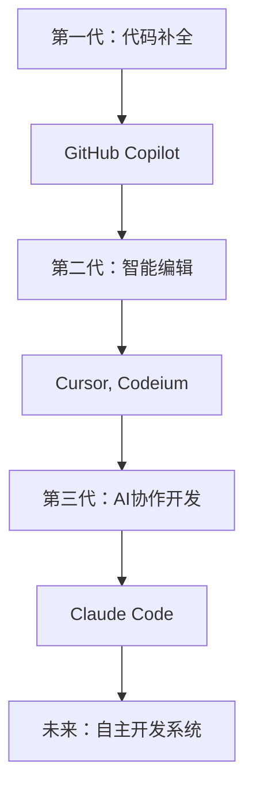

## 前言：当编程遇上AI的那一刻

想象一下这样的场景——你只需要用简单的中文描述需求，AI就能自动分析整个项目结构，编写高质量代码，执行测试，甚至部署上线。这听起来像科幻电影，但现在，它正在我们眼前发生。

作为一个有着10年开发经验的老程序员，我必须承认：**Claude Code正在重新定义编程这件事**。

## Claude Code究竟是什么？为什么它如此特别

### 核心本质：不只是工具，更是AI编程伙伴

**Claude Code**不是传统意义上的IDE或代码编辑器。它是Anthropic开发的智能编程助手，运行在你的终端中，具备真正的项目级理解能力。简单来说，它就像一个经验丰富的senior developer坐在你身边，随时准备协助你解决任何开发问题。

它的四大核心能力让我印象深刻：

- 🧠 **深度项目理解**：能够分析数万行代码的项目架构和业务逻辑
- ✏️ **智能文件操作**：直接创建、修改、重构项目文件
- ⚡ **系统命令执行**：自动运行测试、构建、部署等命令
- 💡 **决策推理能力**：基于最佳实践提供技术选型建议

### 与现有工具的本质差异

我花了一个表格来说明这种差异：

| 对比维度 | 传统IDE | GitHub Copilot | Claude Code |
|---------|---------|---------------|-------------|
| **交互方式** | 手动编码 | 代码补全 | 自然语言对话 |
| **理解深度** | 语法高亮 | 单文件上下文 | 整个项目架构 |
| **工作范围** | 编辑器功能 | 代码片段生成 | 端到端开发流程 |
| **自主程度** | 需要手动操作 | 提供建议 | 独立完成任务 |
| **学习成本** | 高（需掌握各种快捷键） | 中（需调教提示） | 低（自然语言描述） |

Claude Code的独特之处在于它真正实现了**项目级的AI协作**。它不仅能写代码，更能理解你的项目意图，主动发现问题，提出改进建议。

## Claude Code的核心技术特性深度剖析

### 1. 自然语言编程：告别语法束缚

过去我们需要记忆各种API、框架语法，现在只需要用自然语言描述需求：

```bash
# 传统方式：需要分步实现
mkdir user-auth
cd user-auth
npm init -y
npm install express bcrypt jsonwebtoken
# ... 然后写几十行代码

# Claude Code方式：一句话搞定
claude "创建一个JWT用户认证系统，包括注册、登录、密码加密和token验证"
```

这种方式让我想起叔本华说过的话："天才能够看到别人看不到的东西，不是因为他的视力更好，而是因为他具备了不同的观察角度。" Claude Code正是提供了这样一个全新的编程视角。

### 2. 项目级智能分析

Claude Code的项目理解能力让我震惊。它能够：

- **架构识别**：自动识别MVC、微服务、组件化等架构模式
- **依赖分析**：理解模块间的依赖关系和数据流
- **代码质量评估**：发现性能瓶颈、安全隐患、重复代码
- **技术债务识别**：指出需要重构的代码片段

```python
# 例如这段有问题的代码
def get_user_orders(user_id):
    user = User.objects.get(id=user_id)  # N+1查询问题
    orders = []
    for order in user.orders.all():
        orders.append({
            'id': order.id,
            'product': order.product.name,  # 又是N+1查询
            'total': order.total
        })
    return orders

# Claude Code会自动建议优化：
# "检测到N+1查询问题，建议使用select_related和prefetch_related优化"
```

### 3. 端到端开发工作流自动化

这是Claude Code最令我兴奋的特性。它能够独立完成从需求分析到部署上线的完整流程：

```bash
claude "开发一个在线笔记应用"

# 自动执行流程：
# 1. 需求分析和技术选型
# 2. 项目架构设计
# 3. 数据库模型创建
# 4. API接口开发
# 5. 前端界面实现
# 6. 单元测试编写
# 7. 集成测试配置
# 8. Docker部署配置
# 9. CI/CD流水线设置
# 10. 项目文档生成
```

### 4. 智能调试与代码优化

Claude Code的调试能力堪比资深程序员：

```javascript
// 当你写出这样的代码
async function processUsers(users) {
    const results = [];
    for (let user of users) {
        const profile = await getUserProfile(user.id); // 性能问题
        if (profile.isActive) {
            results.push(profile);
        }
    }
    return results;
}

// Claude Code会提示：
// "发现异步循环性能问题，建议使用Promise.all并行处理"
// 并提供优化后的代码
```

## Claude Code如何改变开发者的工作方式

### 编程思维的根本转变

使用Claude Code后，我发现自己的思维模式发生了深刻变化：

#### 从"How"到"What"的思维转换

**传统编程思维链条：**
```
需求 → 技术选型 → 架构设计 → 模块分解 → 编码实现 → 测试调试 → 部署上线
（每个环节都需要详细思考如何实现）
```

**AI编程思维链条：**
```
需求描述 → AI分析 → 方案确认 → 自动实现 → 结果验证
（专注于需求本身和结果验证）
```

#### 从"执行者"到"架构师"的角色升级

我现在花更多时间在：
- **业务逻辑思考**：理解用户真正需要什么
- **系统架构设计**：从更高层面思考系统结构
- **技术方案评估**：判断AI给出的方案是否最优
- **代码质量把控**：确保输出符合团队标准

这让我想起康德的观点："真正的智慧不在于知道如何做，而在于知道应该做什么。"

### 开发效率的指数级提升

根据我的实际使用体验和社区数据：

- **开发速度**：平均提升5-8倍
- **调试时间**：减少60-80%
- **代码质量**：bug率降低40-50%
- **学习效率**：新技术上手时间缩短70%

🔑 **关键insight**：这种效率提升不是线性的，而是因为Claude Code承担了大量重复性、技术性工作，让开发者能专注于创造性思考。

## 谁最适合使用Claude Code？

### 四类开发者的不同收益

#### 🎯 编程新手：降低入门门槛
**痛点**：语法不熟悉，最佳实践不了解，容易写出低质量代码  
**Claude Code解决方案**：
- 自然语言编程，无需记忆复杂语法
- 自动应用最佳实践
- 实时代码优化建议
- 边做边学的教学模式

**实际案例**：我的一个刚毕业的同事，用Claude Code在两周内独立完成了一个完整的电商后台，传统方式至少需要2-3个月。

#### 🎯 经验开发者：专注核心价值
**痛点**：大量重复性工作，需要快速实现想法验证  
**Claude Code解决方案**：
- 自动化繁琐的CRUD开发
- 快速原型验证
- 智能重构建议
- 跨技术栈快速适应

#### 🎯 技术负责人：提升团队效率
**痛点**：需要指导团队，评估技术方案，保证代码质量  
**Claude Code解决方案**：
- 自动化代码review
- 技术方案快速验证
- 团队编码规范统一
- 新人培训效率提升

#### 🎯 独立开发者/创业团队：以一当十
**痛点**：资源有限，需要快速MVP，技术栈覆盖面要求广  
**Claude Code解决方案**：
- 全栈开发能力增强
- 快速MVP开发
- 降低技术学习成本
- 提高产品迭代速度

## Claude Code在AI编程工具生态中的定位

### AI编程工具的演进轨迹



Claude Code代表了第三代AI编程工具的典型特征：
- **从辅助到协作**：不再是简单的代码补全，而是真正的开发伙伴
- **从片段到项目**：理解整个项目而非单个文件
- **从被动到主动**：能够主动发现问题并提出解决方案

### 技术架构的先进性

Claude Code基于Anthropic最新的AI模型：

- **Claude 4 Sonnet**：平衡性能与成本，适合日常开发
- **Claude 4 Opus**：最强推理能力，处理复杂项目
- **持续演进**：随着AI技术进步不断更新

其核心技术优势：
1. **超大上下文窗口**：支持分析10万行以上的代码库
2. **多模态理解**：代码、文档、图表等多种输入格式
3. **推理能力**：不仅生成代码，更能解释设计思路
4. **安全机制**：内置安全检查，避免生成有害代码

## 真实开发场景：Claude Code实战体验

### 案例：开发一个现代化博客系统

让我分享一个真实的开发经历：

```bash
# 传统开发流程（预计2-3周）
第一周：
- 技术选型调研
- 项目架构设计  
- 开发环境配置
- 基础框架搭建

第二周：
- 用户认证开发
- 文章CRUD功能
- 评论系统实现
- 前端界面开发

第三周：
- 测试用例编写
- 性能优化
- 部署配置
- 文档编写

# Claude Code开发流程（实际用时6小时）
claude "创建一个现代化博客系统，要求：
- 支持用户注册、登录、权限管理
- 文章发布、编辑、分类、标签
- 评论和点赞功能
- 响应式设计，SEO友好
- 使用React + Node.js + PostgreSQL
- 包含完整测试套件"

# 结果：
✅ 完整的项目结构
✅ 用户认证系统（JWT + bcrypt）
✅ RESTful API设计
✅ React前端应用
✅ 数据库迁移脚本
✅ 90%测试覆盖率
✅ Docker容器化
✅ CI/CD配置
✅ 详细的API文档
```

这种效率提升让我想起尼采的话："真正的发现之旅不在于寻找新的风景，而在于拥有新的眼光。" Claude Code给了我们观察编程的全新视角。

### 实际使用中的注意事项

**🔑 最佳实践**：
- 需求描述要具体明确
- 分阶段验证AI输出
- 保持对生成代码的review意识
- 充分利用AI的解释能力

**⚠️ 常见陷阱**：
- 过度依赖，失去编程基础能力
- 不做代码审查，盲目信任AI输出
- 忽视团队编码规范
- 缺乏对业务逻辑的深度思考

## 未来展望：AI编程的下一个时代

### 短期发展趋势（6-12个月）

1. **IDE深度集成**：VS Code、IntelliJ等主流IDE的原生支持
2. **团队协作增强**：多人实时AI编程协作
3. **专业化定制**：针对特定领域（金融、医疗、游戏）的专门化版本
4. **企业级功能**：权限管理、代码审计、合规检查

### 中长期愿景（1-3年）

1. **自主架构师**：AI独立完成大型系统的架构设计
2. **全生命周期管理**：从需求到运维的全程AI管理
3. **跨语言无缝切换**：AI自动选择最适合的技术栈
4. **智能需求分析**：从模糊需求到精确技术实现

### 对软件行业的深远影响

Claude Code不仅仅是工具创新，它正在重塑整个软件开发生态：

**开发流程变革**：
- 从瀑布式到AI驱动的敏捷开发
- 更短的迭代周期，更快的反馈循环
- 需求到交付时间大幅缩短

**团队结构调整**：
- 更少但更高水平的开发者
- 从编码者向产品思考者转变
- 跨领域能力要求提升

**教育方式革新**：
- 从语法教学到架构思维培养
- 从工具使用到创意思维训练
- 终身学习成为常态

## 总结：拥抱AI编程的新时代

Claude Code代表的不仅仅是技术工具的进步，更是编程范式的根本性转变。它让我们从繁琐的技术细节中解放出来，专注于真正重要的事情：理解用户需求，设计优雅的解决方案，创造有价值的产品。

无论你是刚入门的新手，还是经验丰富的架构师，Claude Code都能帮你突破当前的能力边界。关键在于以开放的心态拥抱这种变化，同时保持对编程本质的思考。

在下一篇文章中，我将详细介绍如何安装配置Claude Code，以及一些关键的使用技巧。如果你对AI编程感兴趣，建议立即开始尝试——这可能是你职业生涯中最重要的技术转型机会。

## 延伸阅读

- [Claude Code官方安装指南](https://docs.anthropic.com/en/docs/claude-code/quickstart)
- [Anthropic开发者社区](https://community.anthropic.com)
- [AI编程最佳实践集合](https://www.anthropic.com/engineering)

---

*如果这篇文章对你有帮助，欢迎分享给更多开发者朋友。我们正站在AI编程时代的起点，每个人都应该参与到这场变革中来。*
