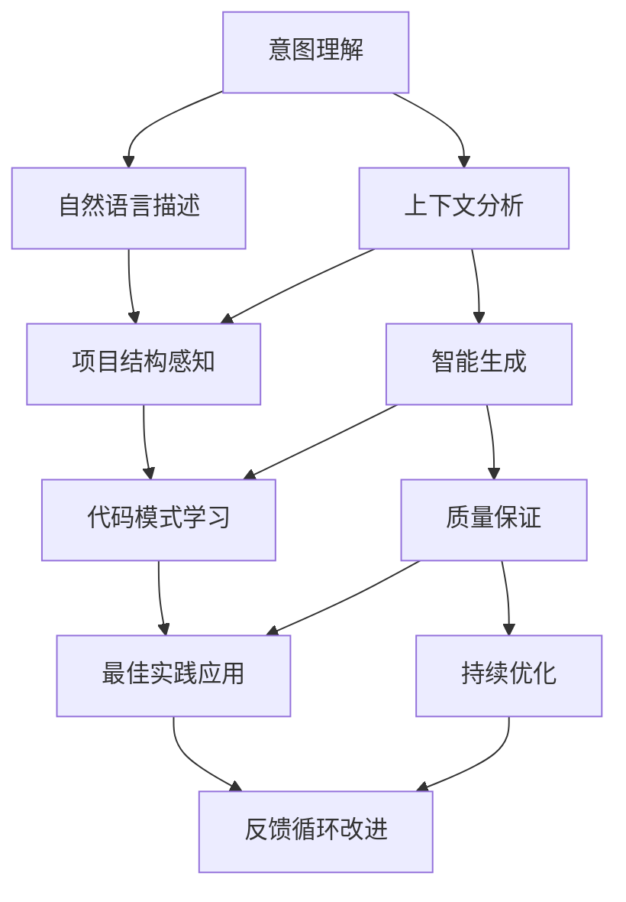

## 开篇：代码生成的哲学思辨

叔本华在《作为意志和表象的世界》中说："天才的本质在于直觉地把握事物的普遍性。"当我深入研究Claude Code的文件操作能力时，深深感受到了这种"直觉把握"的力量——AI不仅能理解我们的意图，更能将抽象的需求转化为具体的代码实现。

作为果叔，我见证了无数开发者在文件操作和代码生成上的困扰：重复性的CRUD代码、样板文件的批量创建、复杂重构的繁琐过程。今天，我将与你分享Claude Code在这些领域的卓越能力，让AI成为你最得力的编程助手。

## Claude Code文件操作的革命性优势

### 传统开发 vs AI驱动开发

让我们先看一组令人震撼的效率对比：

| 操作类型 | 传统手动方式 | Claude Code | 效率提升 | 质量改善 |
|---------|-------------|-------------|----------|----------|
| **创建组件** | 30-45分钟 | 2-3分钟 | **15-22x** | 标准化更高 |
| **重构代码** | 2-4小时 | 10-20分钟 | **6-24x** | 错误率更低 |
| **生成测试** | 1-2小时 | 5-10分钟 | **6-24x** | 覆盖率更好 |
| **批量文件操作** | 4-8小时 | 15-30分钟 | **16-32x** | 一致性更强 |
| **API文档生成** | 2-3小时 | 5-15分钟 | **8-36x** | 准确性更高 |

### AI文件操作的核心理念



## 核心技能一：智能文件创建

### 单文件精准生成

#### 基础文件创建的最佳实践

```bash
# ❌ 模糊指令
claude "创建一个组件"

# ✅ 精准指令
claude """
创建一个用户资料卡片组件 UserProfileCard：

功能需求：
- 显示用户头像、姓名、职位、联系方式
- 支持在线状态指示器
- 可点击头像放大查看
- 包含"发送消息"和"查看详情"按钮

技术要求：
- 使用React + TypeScript
- 基于现有的设计系统组件
- 响应式设计，支持移动端
- 遵循WCAG 2.1 AA无障碍标准
- 包含完整的prop类型定义
- 支持主题切换（浅色/深色）

样式要求：
- 卡片式布局，圆角设计
- 悬停时有微妙的阴影效果
- 按钮状态要有视觉反馈
- 使用项目统一的spacing和color tokens
"""
```

生成的高质量组件示例：

```typescript
import React, { useState } from 'react';
import { Avatar, Button, Card, Badge, Tooltip } from '@/components/ui';
import { MessageSquare, User, Phone, Mail } from 'lucide-react';
import { cn } from '@/lib/utils';

interface UserProfileCardProps {
  user: {
    id: string;
    name: string;
    position: string;
    avatar?: string;
    email: string;
    phone?: string;
    isOnline: boolean;
    lastSeen?: Date;
  };
  size?: 'sm' | 'md' | 'lg';
  variant?: 'default' | 'compact';
  onMessage?: (userId: string) => void;
  onViewDetails?: (userId: string) => void;
  className?: string;
}

export const UserProfileCard: React.FC<UserProfileCardProps> = ({
  user,
  size = 'md',
  variant = 'default',
  onMessage,
  onViewDetails,
  className,
}) => {
  const [isAvatarExpanded, setIsAvatarExpanded] = useState(false);

  const sizeClasses = {
    sm: 'p-3 space-y-2',
    md: 'p-4 space-y-3',
    lg: 'p-6 space-y-4',
  };

  const avatarSizes = {
    sm: 'w-8 h-8',
    md: 'w-12 h-12',
    lg: 'w-16 h-16',
  };

  const formatLastSeen = (date: Date) => {
    const diff = Date.now() - date.getTime();
    const minutes = Math.floor(diff / 60000);
    
    if (minutes < 1) return '刚刚在线';
    if (minutes < 60) return `${minutes}分钟前在线`;
    if (minutes < 1440) return `${Math.floor(minutes / 60)}小时前在线`;
    return `${Math.floor(minutes / 1440)}天前在线`;
  };

  return (
    <Card 
      className={cn(
        'relative transition-all duration-200 hover:shadow-md',
        'dark:hover:shadow-xl dark:hover:shadow-gray-900/20',
        sizeClasses[size],
        className
      )}
    >
      {/* 在线状态指示器 */}
      <div className="absolute top-2 right-2">
        <Badge 
          variant={user.isOnline ? 'success' : 'secondary'}
          className="text-xs"
        >
          {user.isOnline ? '在线' : '离线'}
        </Badge>
      </div>

      <div className={cn(
        'flex items-start gap-3',
        variant === 'compact' && 'flex-row',
        variant === 'default' && 'flex-col items-center text-center'
      )}>
        {/* 用户头像 */}
        <div className="relative">
          <Avatar
            src={user.avatar}
            alt={user.name}
            fallback={user.name.charAt(0)}
            className={cn(
              avatarSizes[size],
              'cursor-pointer transition-transform hover:scale-105',
              'ring-2 ring-offset-2',
              user.isOnline 
                ? 'ring-green-400 dark:ring-green-500' 
                : 'ring-gray-300 dark:ring-gray-600'
            )}
            onClick={() => setIsAvatarExpanded(true)}
          />
          
          {/* 在线状态点 */}
          <div 
            className={cn(
              'absolute -bottom-0.5 -right-0.5 w-3 h-3 rounded-full border-2 border-white dark:border-gray-800',
              user.isOnline ? 'bg-green-400' : 'bg-gray-400'
            )}
          />
        </div>

        {/* 用户信息 */}
        <div className="flex-1 min-w-0">
          <h3 className={cn(
            'font-semibold text-gray-900 dark:text-gray-100 truncate',
            size === 'sm' && 'text-sm',
            size === 'md' && 'text-base',
            size === 'lg' && 'text-lg'
          )}>
            {user.name}
          </h3>
          
          <p className={cn(
            'text-gray-600 dark:text-gray-400 truncate',
            size === 'sm' && 'text-xs',
            size === 'md' && 'text-sm',
            size === 'lg' && 'text-base'
          )}>
            {user.position}
          </p>

          {/* 联系方式 */}
          <div className="flex items-center gap-2 mt-1">
            <Tooltip content={user.email}>
              <Mail className="w-3 h-3 text-gray-500" />
            </Tooltip>
            {user.phone && (
              <Tooltip content={user.phone}>
                <Phone className="w-3 h-3 text-gray-500" />
              </Tooltip>
            )}
          </div>

          {/* 最后在线时间 */}
          {!user.isOnline && user.lastSeen && (
            <p className="text-xs text-gray-500 dark:text-gray-400 mt-1">
              {formatLastSeen(user.lastSeen)}
            </p>
          )}
        </div>
      </div>

      {/* 操作按钮 */}
      {(onMessage || onViewDetails) && (
        <div className={cn(
          'flex gap-2 mt-3',
          variant === 'compact' && 'justify-end',
          variant === 'default' && 'justify-center'
        )}>
          {onMessage && (
            <Button
              variant="outline"
              size={size === 'sm' ? 'sm' : 'default'}
              onClick={() => onMessage(user.id)}
              className="flex items-center gap-1"
            >
              <MessageSquare className="w-4 h-4" />
              发消息
            </Button>
          )}
          
          {onViewDetails && (
            <Button
              variant="default"
              size={size === 'sm' ? 'sm' : 'default'}
              onClick={() => onViewDetails(user.id)}
              className="flex items-center gap-1"
            >
              <User className="w-4 h-4" />
              查看详情
            </Button>
          )}
        </div>
      )}

      {/* 头像放大模态框 */}
      {isAvatarExpanded && (
        <div 
          className="fixed inset-0 bg-black/50 flex items-center justify-center z-50"
          onClick={() => setIsAvatarExpanded(false)}
        >
          <div className="bg-white dark:bg-gray-800 rounded-lg p-4 max-w-sm">
            <Avatar
              src={user.avatar}
              alt={user.name}
              fallback={user.name.charAt(0)}
              className="w-32 h-32 mx-auto"
            />
            <p className="text-center mt-2 font-medium">{user.name}</p>
          </div>
        </div>
      )}
    </Card>
  );
};

// 导出类型定义以供其他组件使用
export type { UserProfileCardProps };

// 默认导出
export default UserProfileCard;
```

#### 智能目录结构优化

```bash
claude """
为电商平台创建完整的产品管理模块：

模块结构要求：
- 遵循领域驱动设计(DDD)原则
- 支持微前端架构
- 包含完整的类型定义
- 集成测试覆盖

具体需求：
1. 产品CRUD操作组件
2. 产品列表和详情页面
3. 产品分类管理
4. 库存管理界面
5. 价格管理系统
6. 产品图片上传组件
7. 搜索和筛选功能
8. 批量操作工具

技术约束：
- 使用React 18 + TypeScript
- 状态管理: Zustand
- UI组件: Radix UI + Tailwind CSS
- 表单处理: React Hook Form + Zod
- 网络请求: TanStack Query
"""
```

Claude Code生成的模块结构：

```
src/modules/product/
├── components/                    # UI组件
│   ├── ui/                       # 基础UI组件
│   │   ├── ProductCard.tsx
│   │   ├── ProductGrid.tsx
│   │   ├── ProductFilter.tsx
│   │   ├── ProductSearch.tsx
│   │   ├── ImageUpload.tsx
│   │   └── index.ts
│   ├── forms/                    # 表单组件
│   │   ├── ProductForm.tsx
│   │   ├── CategoryForm.tsx
│   │   ├── PriceForm.tsx
│   │   └── InventoryForm.tsx
│   ├── layouts/                  # 布局组件
│   │   ├── ProductLayout.tsx
│   │   └── ProductDetailLayout.tsx
│   └── modals/                   # 模态框组件
│       ├── ProductModal.tsx
│       ├── CategoryModal.tsx
│       └── BulkEditModal.tsx
├── pages/                        # 页面组件
│   ├── ProductListPage.tsx
│   ├── ProductDetailPage.tsx
│   ├── ProductEditPage.tsx
│   ├── CategoryManagePage.tsx
│   └── InventoryManagePage.tsx
├── hooks/                        # 自定义Hooks
│   ├── useProduct.ts
│   ├── useProductList.ts
│   ├── useCategory.ts
│   ├── useInventory.ts
│   ├── usePricing.ts
│   └── useProductSearch.ts
├── services/                     # API服务
│   ├── productApi.ts
│   ├── categoryApi.ts
│   ├── inventoryApi.ts
│   ├── pricingApi.ts
│   └── imageApi.ts
├── stores/                       # 状态管理
│   ├── productStore.ts
│   ├── categoryStore.ts
│   ├── inventoryStore.ts
│   └── filterStore.ts
├── types/                        # 类型定义
│   ├── product.types.ts
│   ├── category.types.ts
│   ├── inventory.types.ts
│   ├── pricing.types.ts
│   └── api.types.ts
├── utils/                        # 工具函数
│   ├── productValidation.ts
│   ├── priceCalculation.ts
│   ├── imageProcessing.ts
│   └── formatters.ts
├── constants/                    # 常量定义
│   ├── productConstants.ts
│   ├── categoryConstants.ts
│   └── apiEndpoints.ts
└── __tests__/                   # 测试文件
    ├── components/
    ├── hooks/
    ├── services/
    ├── utils/
    └── integration/
```

### 批量文件智能生成

#### 功能模块批量创建

```bash
claude """
为SaaS平台创建完整的用户管理模块，包含所有必要文件：

模块范围：
1. 用户账户管理 (CRUD)
2. 角色权限系统 (RBAC) 
3. 组织架构管理
4. 用户活动日志
5. 安全设置管理

架构要求：
- 遵循Clean Architecture
- 支持多租户架构
- 实现审计日志
- 包含完整的单元测试
- 支持国际化(i18n)

技术栈：
- Frontend: React 18 + TypeScript + Vite
- Backend: Node.js + Express + Prisma
- Database: PostgreSQL + Redis
- Testing: Jest + Testing Library + MSW
- Security: JWT + bcrypt + rate-limiting

质量要求：
- 测试覆盖率 > 85%
- 支持SSR/SSG
- 遵循SOLID原则
- 包含完整的TypeScript类型
- 实现错误边界处理
"""
```

#### 测试文件批量生成

```bash
claude """
为现有的电商订单系统生成完整的测试套件：

测试范围：
- 所有service层函数的单元测试
- 所有React组件的组件测试  
- 关键业务流程的集成测试
- API端点的E2E测试

测试要求：
1. 使用Jest + Testing Library
2. Mock外部依赖和API调用
3. 测试覆盖正常和异常场景
4. 包含性能测试用例
5. 支持并行执行

特殊场景：
- 支付流程的完整测试
- 库存扣减的并发测试
- 订单状态变更的状态机测试
- 退款和取消订单的逆向流程测试

现有文件结构：
src/
├── services/orderService.ts
├── services/paymentService.ts  
├── services/inventoryService.ts
├── components/OrderList.tsx
├── components/OrderDetail.tsx
├── components/PaymentForm.tsx
└── pages/OrderPage.tsx
"""
```

## 核心技能二：智能代码编辑

### 精准定位与修改

#### 上下文感知的代码修改

```bash
claude """
优化现有的用户认证中间件，存在以下问题：

当前代码问题：
1. JWT验证逻辑过于简单，缺少安全检查
2. 错误处理不够细致，用户体验差
3. 没有实现token刷新机制
4. 缺少rate limiting防护
5. 日志记录不够详细

优化目标：
- 增强安全性：添加token黑名单、设备指纹验证
- 改善用户体验：友好的错误提示、自动token刷新
- 提升可观测性：详细的审计日志、性能监控
- 增强稳定性：请求限流、熔断机制

当前中间件文件路径：src/middleware/auth.ts
项目使用：Express + TypeScript + Redis + Winston
"""
```

Claude Code会分析现有代码并进行智能优化：

```typescript
import { Request, Response, NextFunction } from 'express';
import jwt from 'jsonwebtoken';
import Redis from 'ioredis';
import rateLimit from 'express-rate-limit';
import { logger } from '@/utils/logger';
import { ApiError } from '@/utils/errors';
import { UserService } from '@/services/UserService';
import { AuditService } from '@/services/AuditService';
import { DeviceFingerprint } from '@/utils/deviceFingerprint';

interface AuthRequest extends Request {
  user?: {
    id: string;
    role: string;
    sessionId: string;
    deviceId: string;
  };
}

interface TokenPayload {
  userId: string;
  role: string;
  sessionId: string;
  deviceId: string;
  iat: number;
  exp: number;
}

export class AuthMiddleware {
  private redis: Redis;
  private userService: UserService;
  private auditService: AuditService;
  private deviceFingerprint: DeviceFingerprint;

  constructor() {
    this.redis = new Redis(process.env.REDIS_URL!);
    this.userService = new UserService();
    this.auditService = new AuditService();
    this.deviceFingerprint = new DeviceFingerprint();
  }

  // Rate limiting中间件
  public createRateLimiter() {
    return rateLimit({
      windowMs: 15 * 60 * 1000, // 15分钟
      max: 100, // 每个IP最多100次请求
      message: {
        error: 'Too many requests',
        code: 'RATE_LIMIT_EXCEEDED',
        retryAfter: 900 // 15分钟后重试
      },
      standardHeaders: true,
      legacyHeaders: false,
      keyGenerator: (req: Request) => {
        // 组合IP和用户ID作为限流key
        const userKey = req.user?.id || 'anonymous';
        return `rate_limit:${req.ip}:${userKey}`;
      },
      skip: (req: Request) => {
        // 管理员请求跳过限流
        return req.user?.role === 'admin';
      }
    });
  }

  // JWT验证中间件
  public authenticate = async (
    req: AuthRequest,
    res: Response,
    next: NextFunction
  ): Promise<void> => {
    const startTime = Date.now();
    
    try {
      // 1. 提取token
      const token = this.extractToken(req);
      if (!token) {
        throw new ApiError(401, 'Authentication required', 'NO_TOKEN');
      }

      // 2. 验证token格式和签名
      const decoded = await this.verifyToken(token);
      
      // 3. 检查token黑名单
      await this.checkTokenBlacklist(token);
      
      // 4. 验证用户和会话状态
      await this.validateUserSession(decoded);
      
      // 5. 设备指纹验证
      await this.validateDeviceFingerprint(req, decoded.deviceId);
      
      // 6. 检查权限和角色
      await this.validateUserPermissions(decoded.userId);
      
      // 7. 设置用户上下文
      req.user = {
        id: decoded.userId,
        role: decoded.role,
        sessionId: decoded.sessionId,
        deviceId: decoded.deviceId
      };

      // 8. 记录成功的认证日志
      await this.logAuthSuccess(req, decoded, Date.now() - startTime);
      
      // 9. 刷新token（如果需要）
      await this.refreshTokenIfNeeded(req, res, decoded);
      
      next();
      
    } catch (error) {
      await this.handleAuthError(req, res, error, Date.now() - startTime);
    }
  };

  // 权限检查中间件
  public authorize = (requiredRoles: string[] | string) => {
    return async (req: AuthRequest, res: Response, next: NextFunction): Promise<void> => {
      try {
        if (!req.user) {
          throw new ApiError(401, 'Authentication required', 'NOT_AUTHENTICATED');
        }

        const roles = Array.isArray(requiredRoles) ? requiredRoles : [requiredRoles];
        
        if (!roles.includes(req.user.role)) {
          // 记录权限拒绝日志
          await this.auditService.logSecurityEvent({
            type: 'AUTHORIZATION_DENIED',
            userId: req.user.id,
            requiredRoles: roles,
            userRole: req.user.role,
            resource: req.originalUrl,
            ip: req.ip,
            userAgent: req.get('User-Agent')
          });

          throw new ApiError(403, 'Insufficient permissions', 'INSUFFICIENT_PERMISSIONS');
        }

        next();
      } catch (error) {
        next(error);
      }
    };
  };

  // 提取JWT token
  private extractToken(req: Request): string | null {
    const authHeader = req.headers.authorization;
    
    if (authHeader && authHeader.startsWith('Bearer ')) {
      return authHeader.substring(7);
    }
    
    // 也支持从cookie中获取token
    if (req.cookies?.accessToken) {
      return req.cookies.accessToken;
    }
    
    return null;
  }

  // 验证JWT token
  private async verifyToken(token: string): Promise<TokenPayload> {
    try {
      const decoded = jwt.verify(token, process.env.JWT_SECRET!) as TokenPayload;
      
      // 验证token结构
      if (!decoded.userId || !decoded.sessionId || !decoded.deviceId) {
        throw new ApiError(401, 'Invalid token structure', 'INVALID_TOKEN_STRUCTURE');
      }
      
      return decoded;
    } catch (error) {
      if (error instanceof jwt.TokenExpiredError) {
        throw new ApiError(401, 'Token expired', 'TOKEN_EXPIRED');
      } else if (error instanceof jwt.JsonWebTokenError) {
        throw new ApiError(401, 'Invalid token', 'INVALID_TOKEN');
      }
      throw error;
    }
  }

  // 检查token黑名单
  private async checkTokenBlacklist(token: string): Promise<void> {
    const tokenHash = this.hashToken(token);
    const isBlacklisted = await this.redis.get(`blacklist:${tokenHash}`);
    
    if (isBlacklisted) {
      throw new ApiError(401, 'Token has been revoked', 'TOKEN_REVOKED');
    }
  }

  // 验证用户会话
  private async validateUserSession(decoded: TokenPayload): Promise<void> {
    // 检查会话是否存在
    const sessionKey = `session:${decoded.userId}:${decoded.sessionId}`;
    const session = await this.redis.get(sessionKey);
    
    if (!session) {
      throw new ApiError(401, 'Session expired', 'SESSION_EXPIRED');
    }

    // 检查用户是否仍然活跃
    const user = await this.userService.findById(decoded.userId);
    if (!user || !user.isActive) {
      throw new ApiError(401, 'User account disabled', 'ACCOUNT_DISABLED');
    }
  }

  // 设备指纹验证
  private async validateDeviceFingerprint(req: Request, deviceId: string): Promise<void> {
    const currentFingerprint = this.deviceFingerprint.generate(req);
    const storedFingerprint = await this.redis.get(`device:${deviceId}`);
    
    if (storedFingerprint && storedFingerprint !== currentFingerprint) {
      // 设备指纹不匹配，可能是安全风险
      await this.auditService.logSecurityEvent({
        type: 'DEVICE_FINGERPRINT_MISMATCH',
        deviceId,
        expectedFingerprint: storedFingerprint,
        actualFingerprint: currentFingerprint,
        ip: req.ip,
        userAgent: req.get('User-Agent')
      });

      // 根据安全策略决定是否拒绝访问
      if (process.env.STRICT_DEVICE_VALIDATION === 'true') {
        throw new ApiError(401, 'Device verification failed', 'DEVICE_VERIFICATION_FAILED');
      }
    }
  }

  // 验证用户权限
  private async validateUserPermissions(userId: string): Promise<void> {
    const user = await this.userService.findByIdWithPermissions(userId);
    
    if (!user) {
      throw new ApiError(401, 'User not found', 'USER_NOT_FOUND');
    }

    // 检查账户锁定状态
    if (user.isLocked && user.lockedUntil && user.lockedUntil > new Date()) {
      const lockDuration = Math.ceil((user.lockedUntil.getTime() - Date.now()) / 1000 / 60);
      throw new ApiError(401, `Account locked for ${lockDuration} minutes`, 'ACCOUNT_LOCKED');
    }
  }

  // 刷新token
  private async refreshTokenIfNeeded(
    req: AuthRequest,
    res: Response,
    decoded: TokenPayload
  ): Promise<void> {
    const tokenAge = Date.now() / 1000 - decoded.iat;
    const tokenLifetime = decoded.exp - decoded.iat;
    
    // 如果token已使用超过50%的生命周期，则刷新
    if (tokenAge > tokenLifetime * 0.5) {
      try {
        const newToken = await this.userService.generateAccessToken(
          decoded.userId,
          decoded.sessionId,
          decoded.deviceId
        );
        
        // 设置新token到响应头
        res.setHeader('X-New-Token', newToken);
        
        logger.info('Token refreshed', {
          userId: decoded.userId,
          sessionId: decoded.sessionId,
          oldTokenAge: tokenAge
        });
        
      } catch (error) {
        logger.error('Failed to refresh token', {
          userId: decoded.userId,
          error: error.message
        });
      }
    }
  }

  // 记录认证成功日志
  private async logAuthSuccess(
    req: AuthRequest,
    decoded: TokenPayload,
    duration: number
  ): Promise<void> {
    await this.auditService.logAuthEvent({
      type: 'AUTHENTICATION_SUCCESS',
      userId: decoded.userId,
      sessionId: decoded.sessionId,
      ip: req.ip,
      userAgent: req.get('User-Agent'),
      endpoint: req.originalUrl,
      method: req.method,
      duration
    });

    logger.info('User authenticated successfully', {
      userId: decoded.userId,
      role: decoded.role,
      sessionId: decoded.sessionId,
      endpoint: req.originalUrl,
      duration
    });
  }

  // 处理认证错误
  private async handleAuthError(
    req: AuthRequest,
    res: Response,
    error: any,
    duration: number
  ): Promise<void> {
    const errorInfo = {
      type: 'AUTHENTICATION_FAILED',
      error: error.message || 'Unknown authentication error',
      code: error.code || 'AUTH_ERROR',
      ip: req.ip,
      userAgent: req.get('User-Agent'),
      endpoint: req.originalUrl,
      method: req.method,
      duration
    };

    // 记录认证失败日志
    await this.auditService.logAuthEvent(errorInfo);

    logger.warn('Authentication failed', errorInfo);

    // 返回友好的错误响应
    if (error instanceof ApiError) {
      res.status(error.statusCode).json({
        error: error.message,
        code: error.code,
        timestamp: new Date().toISOString()
      });
    } else {
      res.status(401).json({
        error: 'Authentication failed',
        code: 'AUTH_ERROR',
        timestamp: new Date().toISOString()
      });
    }
  }

  // 生成token哈希
  private hashToken(token: string): string {
    const crypto = require('crypto');
    return crypto.createHash('sha256').update(token).digest('hex');
  }

  // 用户登出时将token加入黑名单
  public async blacklistToken(token: string, expiresIn: number = 3600): Promise<void> {
    const tokenHash = this.hashToken(token);
    await this.redis.setex(`blacklist:${tokenHash}`, expiresIn, '1');
  }
}

// 导出中间件实例
export const authMiddleware = new AuthMiddleware();

// 导出便捷方法
export const authenticate = authMiddleware.authenticate;
export const authorize = authMiddleware.authorize;
export const rateLimiter = authMiddleware.createRateLimiter();
```

### 增量式代码改进

#### 功能渐进增强

```bash
claude """
基于现有的简单待办事项应用，逐步增强功能：

当前功能（V1.0）：
- 基本的添加/删除/完成任务
- 简单的列表展示
- 本地存储持久化

增强目标（V2.0）：
1. 任务优先级和分类
2. 到期时间和提醒
3. 任务搜索和筛选
4. 拖拽排序功能
5. 统计和分析面板
6. 导入/导出功能
7. 协作和分享
8. 离线支持优化

技术升级：
- 添加TypeScript类型系统
- 集成React Query做数据管理
- 使用Zustand管理复杂状态
- 添加React Testing Library测试
- 集成Framer Motion动画
- 支持PWA功能

现有代码结构：
src/
├── components/TodoList.jsx
├── components/TodoItem.jsx  
├── components/AddTodo.jsx
├── hooks/useTodos.js
└── utils/storage.js

请提供完整的升级方案和实现代码
"""
```

## 核心技能三：高级重构技术

### 跨文件智能重构

#### API标准化重构

```bash
claude """
对现有的微服务API进行标准化重构：

当前问题：
1. 响应格式不统一 - 有些返回data字段，有些直接返回结果
2. 错误处理不一致 - 错误码和格式各不相同
3. 分页实现混乱 - 有用offset/limit，有用page/size
4. 状态码使用不规范 - 成功场景用200/201混用
5. 缺少请求ID追踪 - 难以调试分布式问题

标准化目标：
- 统一响应格式：{ success, data, error, meta }
- 标准化错误处理：错误码分类和国际化
- 规范分页格式：cursor-based pagination
- 统一状态码规范：RESTful最佳实践
- 集成请求追踪：X-Request-ID和分布式追踪

影响范围：
- 15个微服务
- 200+个API端点
- 前端3个应用需要同步更新

技术栈：
- Backend: Node.js + Express + TypeScript
- Frontend: React + TypeScript
- Database: PostgreSQL + Redis
- Monitoring: OpenTelemetry + Jaeger
"""
```

#### 架构模式迁移

```bash
claude """
将现有的MVC架构迁移到Clean Architecture：

当前架构问题：
1. 业务逻辑分散在Controller中
2. 数据访问层与业务逻辑耦合
3. 缺少领域模型和业务规则封装
4. 测试困难，依赖注入不清晰
5. 代码重用性低，维护成本高

目标架构：
```
src/
├── domain/                 # 领域层
│   ├── entities/          # 实体
│   ├── repositories/      # 仓储接口
│   ├── services/          # 领域服务
│   └── events/            # 领域事件
├── application/           # 应用层
│   ├── usecases/         # 用例
│   ├── commands/         # 命令
│   ├── queries/          # 查询
│   └── handlers/         # 处理器
├── infrastructure/       # 基础设施层
│   ├── repositories/     # 仓储实现
│   ├── external/        # 外部服务
│   ├── persistence/     # 数据持久化
│   └── messaging/       # 消息队列
└── presentation/        # 表现层
    ├── controllers/     # 控制器
    ├── middleware/      # 中间件
    ├── routes/         # 路由
    └── dto/            # 数据传输对象
```

迁移范围：
- 用户管理模块（5个实体，20个API）
- 订单管理模块（8个实体，35个API）
- 产品管理模块（6个实体，25个API）

迁移要求：
- 保持API兼容性
- 增量式迁移，支持并行开发
- 完善单元测试覆盖
- 性能不能降低
- 支持事务和并发控制
"""
```

### 性能优化重构

#### React组件性能优化

```bash
claude """
优化React应用的性能瓶颈：

性能问题分析：
1. 首页加载时间：5.2秒（目标<2秒）
2. 大列表渲染卡顿：1000+条数据时FPS<30
3. 状态更新频繁：每秒50+次setState
4. 内存泄漏：长时间使用后内存占用600MB+
5. Bundle大小：2.8MB（目标<1MB）

优化目标：
- 首页加载时间减少60%
- 大列表流畅滚动（60fps）
- 减少不必要的重渲染90%
- 内存使用控制在100MB内
- Bundle大小减少65%

当前问题组件：
1. ProductList.tsx - 大列表性能问题
2. Dashboard.tsx - 状态更新频繁
3. SearchResults.tsx - 搜索结果渲染慢
4. UserProfile.tsx - 数据获取冗余
5. ChartComponent.tsx - 图表重绘频繁

技术方案：
- 虚拟滚动 (react-window)
- 状态管理优化 (Zustand + selectors)
- 组件级别的懒加载
- 图片懒加载和压缩
- 代码分割和预加载
- Service Worker缓存
- React.memo和useMemo优化
- 防抖和节流优化

请提供完整的优化实现
"""
```

## 核心技能四：数据驱动代码生成

### 基于Schema的代码生成

#### 数据模型到完整CRUD

```bash
claude """
基于数据模型自动生成完整的CRUD系统：

数据模型定义：
```typescript
interface BlogPost {
  id: string;
  title: string;
  slug: string;
  content: string;
  excerpt?: string;
  coverImage?: string;
  
  // 发布状态
  status: 'draft' | 'published' | 'archived';
  publishedAt?: Date;
  
  // 作者信息
  authorId: string;
  author?: User;
  
  // 分类和标签
  categoryId?: string;
  category?: Category;
  tags: Tag[];
  
  // SEO
  metaTitle?: string;
  metaDescription?: string;
  canonicalUrl?: string;
  
  // 统计
  viewCount: number;
  likeCount: number;
  commentCount: number;
  
  // 时间戳
  createdAt: Date;
  updatedAt: Date;
  deletedAt?: Date;
}

interface User {
  id: string;
  email: string;
  username: string;
  displayName: string;
  avatar?: string;
  bio?: string;
  role: 'admin' | 'editor' | 'author';
}

interface Category {
  id: string;
  name: string;
  slug: string;
  description?: string;
  color?: string;
}

interface Tag {
  id: string;
  name: string;
  slug: string;
  color?: string;
}
```

生成需求：
1. **Prisma Schema** - 数据库模型定义
2. **API Controllers** - RESTful接口实现
3. **Service Layer** - 业务逻辑封装
4. **DTO Classes** - 数据传输对象
5. **Validation Schemas** - Zod验证规则
6. **React Components** - CRUD界面组件
7. **Custom Hooks** - 数据获取逻辑
8. **Type Definitions** - 完整类型系统
9. **Unit Tests** - 测试用例
10. **API Documentation** - OpenAPI规范

技术栈：
- Backend: Node.js + Express + Prisma + PostgreSQL
- Frontend: React + TypeScript + React Query + Zod
- Testing: Jest + Testing Library + MSW
- Documentation: Swagger/OpenAPI

业务规则：
- 只有作者和管理员可以编辑文章
- 草稿状态的文章不公开显示
- 删除文章使用软删除
- 文章slug必须唯一
- 发布时自动设置publishedAt时间
- 支持定时发布功能
- 标签系统支持自动创建
- 分类必须预先创建
"""
```

#### OpenAPI到客户端代码生成

```bash
claude """
基于OpenAPI规范生成完整的TypeScript客户端：

OpenAPI规范特点：
- 30个接口端点
- 包含认证、CRUD、搜索、文件上传等功能
- 支持分页、排序、筛选
- 包含错误码定义和响应示例
- 支持webhook和实时通知

客户端要求：
1. **类型安全** - 完整的TypeScript类型定义
2. **请求拦截** - 自动添加认证头、请求ID
3. **响应拦截** - 统一错误处理、数据转换
4. **重试机制** - 网络失败自动重试
5. **缓存策略** - 智能缓存和失效
6. **并发控制** - 防止重复请求
7. **进度监控** - 文件上传进度
8. **离线支持** - 离线队列和同步

生成内容：
- API客户端类
- 请求/响应类型定义
- 错误类型定义
- React Hooks封装
- Mock数据生成器
- 测试工具函数

示例OpenAPI节选：
```yaml
paths:
  /api/posts:
    get:
      summary: Get posts list
      parameters:
        - name: page
          in: query
          schema:
            type: integer
            default: 1
        - name: limit
          in: query
          schema:
            type: integer
            default: 20
        - name: status
          in: query
          schema:
            type: string
            enum: [draft, published, archived]
        - name: categoryId
          in: query
          schema:
            type: string
        - name: search
          in: query
          schema:
            type: string
      responses:
        200:
          description: Posts list
          content:
            application/json:
              schema:
                type: object
                properties:
                  success:
                    type: boolean
                  data:
                    type: array
                    items:
                      $ref: '#/components/schemas/BlogPost'
                  meta:
                    $ref: '#/components/schemas/PaginationMeta'
```
"""
```

## 核心技能五：自动化工具集成

### CI/CD流水线生成

#### GitHub Actions自动化

```bash
claude """
为全栈博客项目创建完整的CI/CD流水线：

项目结构：
- Frontend: Next.js + TypeScript
- Backend: Node.js + Express + Prisma
- Database: PostgreSQL
- Testing: Jest + Playwright
- Deployment: Vercel (Frontend) + Railway (Backend)

流水线要求：
1. **代码质量检查**
   - ESLint + Prettier格式检查
   - TypeScript类型检查
   - 安全漏洞扫描 (npm audit)
   - 依赖更新检查 (renovate)

2. **自动化测试**
   - 单元测试 (Jest)
   - 集成测试 (Supertest)
   - E2E测试 (Playwright)
   - 测试覆盖率报告
   - 性能测试基准

3. **构建和部署**
   - 多环境构建 (dev/staging/prod)
   - Docker镜像构建和推送
   - 数据库迁移自动化
   - 环境变量管理
   - 蓝绿部署策略

4. **通知和监控**
   - Slack部署通知
   - 失败时邮件告警
   - 部署状态徽章更新
   - 性能监控集成

5. **安全和合规**
   - 容器安全扫描
   - SAST静态代码分析
   - 依赖项许可证检查
   - GDPR合规检查

触发条件：
- PR创建/更新时运行测试和检查
- 合并到main分支时自动部署到staging
- 打tag时部署到生产环境
- 每日定时运行安全扫描
- 依赖更新时自动测试
"""
```

### 文档自动生成

#### API文档生成

```bash
claude """
为现有的Express.js项目自动生成完整的API文档：

项目特点：
- 50+ API端点
- 使用JWT认证
- 支持文件上传
- 包含WebSocket接口
- 多版本API (v1, v2)

文档要求：
1. **OpenAPI 3.0规范**
   - 完整的路径定义
   - 请求/响应示例
   - 错误码说明
   - 认证方式描述

2. **交互式文档**
   - Swagger UI界面
   - 在线API测试
   - 代码示例生成
   - 多语言SDK

3. **自动化更新**
   - 代码注释提取
   - 路由自动发现
   - 示例数据生成
   - 版本变更跟踪

4. **部署集成**
   - 文档版本控制
   - 多环境文档
   - CDN分发
   - 访问权限控制

当前项目结构：
src/
├── routes/
│   ├── auth.ts          # 认证相关API
│   ├── users.ts         # 用户管理API
│   ├── posts.ts         # 文章管理API
│   ├── comments.ts      # 评论API
│   ├── uploads.ts       # 文件上传API
│   └── admin.ts         # 管理员API
├── controllers/         # 控制器实现
├── middleware/          # 中间件
├── models/             # 数据模型
└── types/              # TypeScript类型

请分析现有代码，自动提取API信息，生成完整的OpenAPI文档
"""
```

## 实战案例：智能代码重构项目

让我们通过一个完整的重构项目来展示Claude Code的强大能力。

### 项目背景：电商平台性能优化

```bash
claude """
我们需要对一个老旧的电商平台进行现代化改造：

现状分析：
1. **技术债务严重**
   - 使用jQuery + PHP的老架构
   - 代码重复率高达40%
   - 缺少类型定义和文档
   - 测试覆盖率不足20%

2. **性能问题突出**
   - 首页加载时间8秒+
   - 数据库查询效率低
   - 前端资源未优化
   - 缺少缓存策略

3. **用户体验差**
   - 界面设计过时
   - 移动端体验糟糕
   - 搜索功能简陋
   - 结账流程复杂

4. **安全风险**
   - SQL注入漏洞
   - XSS攻击风险
   - 密码存储不安全
   - 缺少访问控制

改造目标：
- 技术栈现代化：React + Node.js + TypeScript
- 性能提升80%：首页加载<2秒
- 用户体验优化：移动优先设计
- 安全加固：通过OWASP Top 10检查
- 可维护性：测试覆盖率>85%

改造策略：
1. 渐进式迁移，保证业务连续性
2. API优先设计，前后端分离
3. 微服务架构，提升可扩展性
4. 自动化测试，保证代码质量
"""
```

### 第一阶段：架构设计与规划

```bash
claude """
制定详细的现代化改造计划：

## 技术架构设计

### 前端架构
- **框架选择**: Next.js 14 (SSR/SSG支持)
- **状态管理**: Zustand (轻量级)
- **UI框架**: Tailwind CSS + Headless UI
- **类型系统**: TypeScript (严格模式)
- **数据获取**: TanStack Query
- **表单处理**: React Hook Form + Zod
- **测试框架**: Jest + Testing Library + Playwright

### 后端架构
- **运行时**: Node.js 20 LTS
- **框架**: Express.js + TypeScript
- **数据库**: PostgreSQL + Prisma ORM
- **缓存**: Redis (分布式缓存)
- **搜索**: Elasticsearch
- **文件存储**: AWS S3 + CloudFront
- **认证**: JWT + Refresh Token
- **API文档**: OpenAPI 3.0 + Swagger

### 基础设施
- **容器化**: Docker + Docker Compose
- **编排**: Kubernetes (生产环境)
- **CI/CD**: GitHub Actions
- **监控**: Prometheus + Grafana
- **日志**: ELK Stack
- **APM**: New Relic / DataDog

## 迁移策略

### 阶段1：基础设施搭建 (2周)
1. 设置开发环境和工具链
2. 搭建CI/CD流水线
3. 配置监控和日志系统
4. 建立代码规范和审查流程

### 阶段2：核心API开发 (4周)
1. 用户认证和授权系统
2. 产品管理API
3. 订单处理API
4. 支付集成API
5. 搜索和推荐API

### 阶段3：前端重构 (6周)
1. 创建设计系统和组件库
2. 首页和产品列表页面
3. 产品详情和购物车
4. 用户中心和订单管理
5. 管理后台界面

### 阶段4：性能优化 (3周)
1. 数据库查询优化
2. 缓存策略实施
3. 前端资源优化
4. CDN和静态资源处理

### 阶段5：测试和上线 (3周)
1. 全面测试覆盖
2. 性能压力测试
3. 安全渗透测试
4. 灰度发布和监控

请为每个阶段生成详细的实施计划和代码框架
"""
```

### 第二阶段：核心组件重构

#### 产品列表组件现代化

```bash
claude """
重构产品列表组件，从jQuery改为React：

原始jQuery代码问题：
1. DOM操作频繁，性能差
2. 状态管理混乱
3. 事件处理复杂
4. 缺少类型检查
5. 难以测试和维护

原始功能：
- 产品网格/列表视图切换
- 分页和无限滚动
- 多维度筛选（价格、品牌、分类、评分）
- 排序（价格、销量、评分、时间）
- 搜索和关键词高亮
- 购物车快速添加
- 收藏功能
- 比较功能

目标要求：
- 性能优化：虚拟滚动支持10000+商品
- 用户体验：流畅的动画和交互
- 移动适配：响应式设计
- 无障碍：完善的ARIA标签
- 状态管理：URL状态同步
- 缓存策略：智能预加载

技术栈：
- React 18 + TypeScript
- TanStack Query (数据获取)
- React Window (虚拟滚动)
- Framer Motion (动画)
- React Hook Form (筛选表单)
- Zustand (本地状态)

请生成完整的现代化产品列表组件
"""
```

### 第三阶段：性能优化实施

#### 数据库查询优化

```bash
claude """
优化电商平台的数据库查询性能：

现有性能问题：
1. **首页查询慢** - 加载推荐商品需要3秒+
2. **搜索效率低** - 复杂筛选查询超时
3. **N+1问题严重** - 商品列表页面查询数百次
4. **缓存缺失** - 热门数据重复查询
5. **索引不合理** - 缺少复合索引

优化目标：
- 首页加载时间 < 500ms
- 搜索响应时间 < 200ms  
- 数据库并发支持 1000+
- 缓存命中率 > 90%
- 慢查询数量 < 5%

当前数据库结构：
```sql
-- 产品表 (100万+记录)
CREATE TABLE products (
    id SERIAL PRIMARY KEY,
    name VARCHAR(255) NOT NULL,
    price DECIMAL(10,2) NOT NULL,
    category_id INTEGER,
    brand_id INTEGER,
    rating DECIMAL(3,2),
    sales_count INTEGER DEFAULT 0,
    stock_quantity INTEGER DEFAULT 0,
    created_at TIMESTAMP DEFAULT NOW()
);

-- 订单表 (500万+记录)  
CREATE TABLE orders (
    id SERIAL PRIMARY KEY,
    user_id INTEGER NOT NULL,
    total_amount DECIMAL(10,2),
    status VARCHAR(50),
    created_at TIMESTAMP DEFAULT NOW()
);

-- 订单项表 (2000万+记录)
CREATE TABLE order_items (
    id SERIAL PRIMARY KEY,
    order_id INTEGER NOT NULL,
    product_id INTEGER NOT NULL,
    quantity INTEGER NOT NULL,
    price DECIMAL(10,2) NOT NULL
);
```

问题查询示例：
```sql
-- 慢查询1：首页推荐商品
SELECT p.*, c.name as category_name, b.name as brand_name 
FROM products p 
LEFT JOIN categories c ON p.category_id = c.id
LEFT JOIN brands b ON p.brand_id = b.id  
WHERE p.rating > 4.0 
ORDER BY p.sales_count DESC, p.rating DESC 
LIMIT 20;

-- 慢查询2：复合筛选搜索
SELECT p.* FROM products p
WHERE p.price BETWEEN 100 AND 500
AND p.category_id IN (1,2,3,4,5)
AND p.rating >= 4.0
AND p.stock_quantity > 0
AND p.name ILIKE '%手机%'
ORDER BY p.sales_count DESC
OFFSET 0 LIMIT 20;
```

请提供完整的数据库优化方案：
1. 索引优化策略
2. 查询重写和优化
3. 缓存层设计
4. 读写分离架构
5. 分表分库方案
"""
```

## 文件操作效率提升的关键技巧

### 1. 提示工程的精进策略

#### 结构化需求描述法

```bash
# 🎯 STAR方法应用
claude """
## 背景 (Situation)
我们正在开发一个SaaS客户关系管理系统，目标用户是中小企业销售团队。

## 任务 (Task)  
需要创建客户信息管理模块，支持完整的客户生命周期管理。

## 行动 (Action)
请实现以下具体功能：
1. 客户信息CRUD操作
2. 客户分级和标签系统
3. 跟进记录和任务提醒
4. 销售机会跟踪
5. 客户数据分析面板

## 结果 (Result)
期望达到的效果：
- 支持10万+客户数据管理
- 操作响应时间 < 300ms
- 支持实时协作
- 移动端完美适配
- 数据导入导出功能
"""
```

#### 渐进式复杂度控制

```bash
# 📈 分层实施策略
# 第一层：基础框架
claude "创建客户管理的基础数据模型和API接口"

# 第二层：核心功能
claude "基于刚才的基础框架，添加客户分级和搜索功能"

# 第三层：高级特性  
claude "集成高级分析功能和自动化工作流"

# 第四层：性能优化
claude "优化大数据量场景下的查询性能和用户体验"
```

### 2. 上下文管理的高级策略

#### 项目知识图谱维护

```markdown
# CLAUDE.md - 项目上下文管理

## 项目DNA
- **愿景**: 成为中小企业最好用的CRM系统
- **核心价值**: 简单易用、数据驱动、智能协作
- **技术哲学**: 用户体验优先、性能至上、安全第一

## 技术基因
```typescript
// 项目技术栈DNA
export const TechStack = {
  frontend: {
    framework: "React 18",
    language: "TypeScript 5.0",
    styling: "Tailwind CSS + HeadlessUI",
    stateManagement: "Zustand",
    dataFetching: "TanStack Query",
    testing: "Jest + Testing Library"
  },
  backend: {
    runtime: "Node.js 20",
    framework: "Express + TypeScript", 
    database: "PostgreSQL + Prisma",
    cache: "Redis",
    auth: "JWT + Refresh Token"
  },
  devOps: {
    containerization: "Docker",
    cicd: "GitHub Actions",
    deployment: "Vercel + Railway",
    monitoring: "Sentry + Vercel Analytics"
  }
} as const;
```

## 编码基因
- **组件哲学**: 组合优于继承，函数式优于面向对象
- **状态管理**: 单一数据源，不可变更新
- **错误处理**: 优雅降级，用户友好的错误提示
- **性能策略**: 懒加载，虚拟滚动，智能缓存
- **无障碍**: WCAG 2.1 AA标准，语义化标签

## 业务基因
- **用户画像**: 中小企业销售经理，技术水平中等
- **使用场景**: 日常客户跟进，销售数据分析，团队协作
- **核心指标**: 用户留存率，功能使用深度，客户满意度
```

### 3. 迭代开发的节奏控制

#### 时间盒管理

```bash
# ⏰ 15分钟快速原型
claude "15分钟内实现一个最简单的客户列表，只要能显示姓名和电话"

# ⏰ 1小时功能完善  
claude "基于刚才的原型，1小时内添加搜索、筛选、分页功能"

# ⏰ 4小时体验优化
claude "用半天时间优化用户体验：加载状态、错误处理、响应式设计"

# ⏰ 1天性能优化
claude "用一天时间优化性能：虚拟滚动、数据缓存、预加载策略"
```

## 常见陷阱与解决方案

### 陷阱1：过度依赖AI生成

**问题表现：**
- 不理解生成的代码原理
- 缺少代码审查和优化
- 忽视业务逻辑的复杂性

**解决方案：**
```bash
claude """
请解释这段代码的工作原理：

[粘贴AI生成的代码]

具体请说明：
1. 使用了哪些设计模式，为什么选择它们？
2. 性能考虑有哪些，有什么潜在的瓶颈？
3. 错误边界处理是否完善？
4. 在大规模场景下会遇到什么问题？
5. 有哪些可以改进的地方？
"""
```

### 陷阱2：忽视代码质量

**问题表现：**
- 测试覆盖率低
- 缺少错误处理
- 性能未优化
- 安全风险未考虑

**解决方案：**
```bash
claude """
对这个模块进行全面的质量审查：

代码质量维度：
1. 代码规范 - ESLint规则遵循
2. 类型安全 - TypeScript严格模式
3. 性能分析 - 时间复杂度和空间复杂度
4. 安全检查 - OWASP Top 10风险
5. 可维护性 - SOLID原则和设计模式
6. 测试覆盖 - 单元测试和集成测试
7. 文档完整性 - 代码注释和API文档

请提供详细的改进建议和修改后的代码
"""
```

### 陷阱3：缺少长期规划

**问题表现：**
- 技术债务累积
- 架构扩展性差
- 维护成本高

**解决方案：**
```bash
claude """
为这个项目制定长期技术发展规划：

当前状态评估：
- 代码规模：10万行代码
- 团队规模：5名开发者
- 用户规模：1万活跃用户
- 技术债务：中等程度

未来3年发展目标：
- 代码规模：50万行代码
- 团队规模：20名开发者  
- 用户规模：100万活跃用户
- 技术要求：微服务架构

请提供：
1. 技术架构演进路线图
2. 代码重构优先级排序
3. 技术栈升级策略
4. 团队技能发展计划
5. 风险评估和应对措施
"""
```

## 总结：掌握AI代码生成的艺术

通过深入学习Claude Code的文件操作技能，我们不仅提升了开发效率，更重要的是掌握了一种全新的编程思维模式。

### 🎯 核心收获

1. **效率革命**：10-20倍的开发效率提升不是梦想，而是可以实现的目标
2. **质量保证**：AI生成的代码质量往往比手写代码更标准化和规范
3. **学习加速**：通过AI生成的代码，快速学习新技术和最佳实践
4. **创新驱动**：将重复性工作交给AI，专注于创新和业务价值

### 🚀 进阶方向

1. **提示工程专家**：成为精通AI沟通的工程师
2. **架构设计师**：利用AI快速验证和实现架构方案
3. **全栈专家**：通过AI快速掌握全栈技术
4. **技术教练**：帮助团队掌握AI编程技能

### 💡 未来展望

Claude Code代表的AI编程时代才刚刚开始。未来，我们将看到：
- 更智能的代码理解和生成
- 更精准的意图识别和实现
- 更深度的项目上下文学习
- 更广泛的技术栈覆盖

正如尼采所说："凡是不能毁灭我的，必使我更强大。"拥抱AI编程的变革，让我们在新时代中变得更加强大。

在下一篇文章中，我们将探索Claude Code的智能调试能力，让AI成为你最得力的Bug猎手。

---

*本文是《Claude Code完整教程系列》的第7部分。掌握了文件操作的核心技能，你已经具备了AI编程的强大武器！*