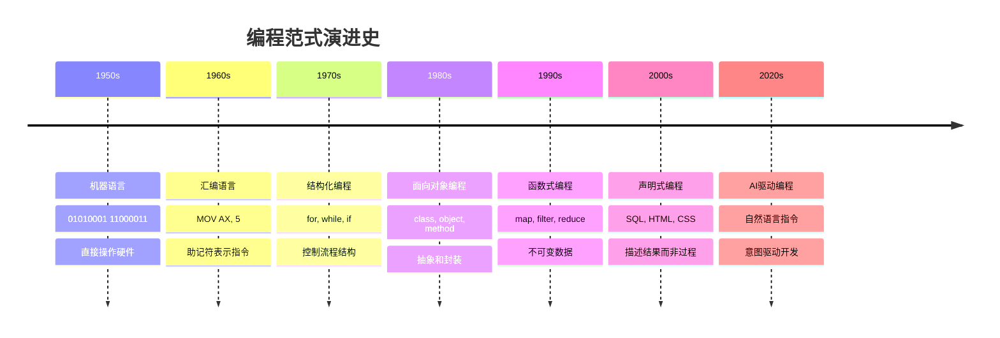
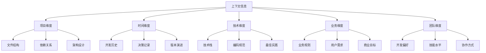
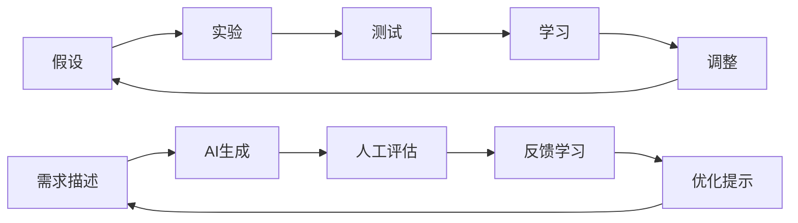
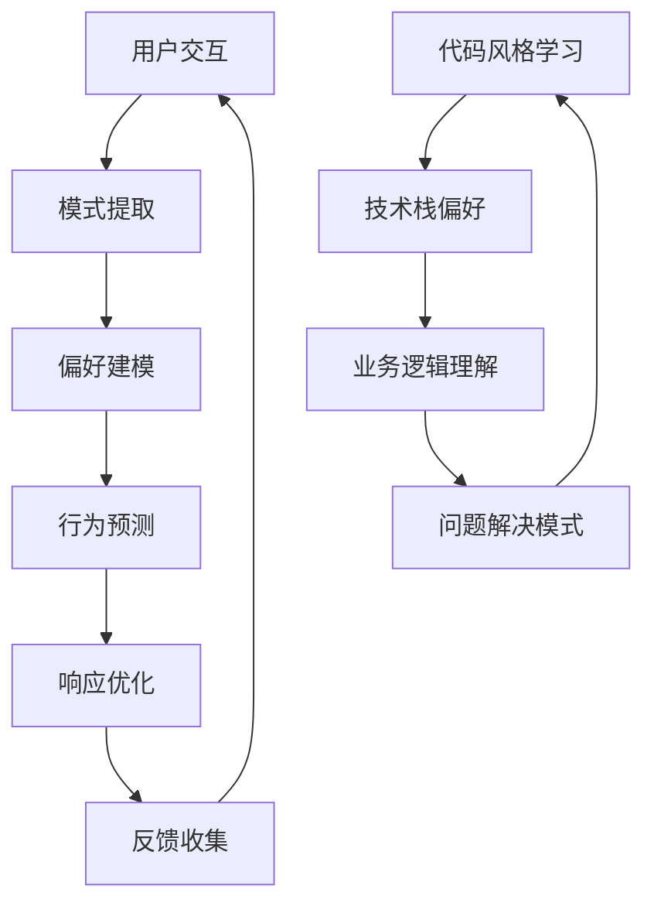
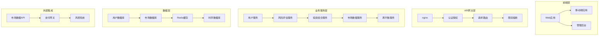
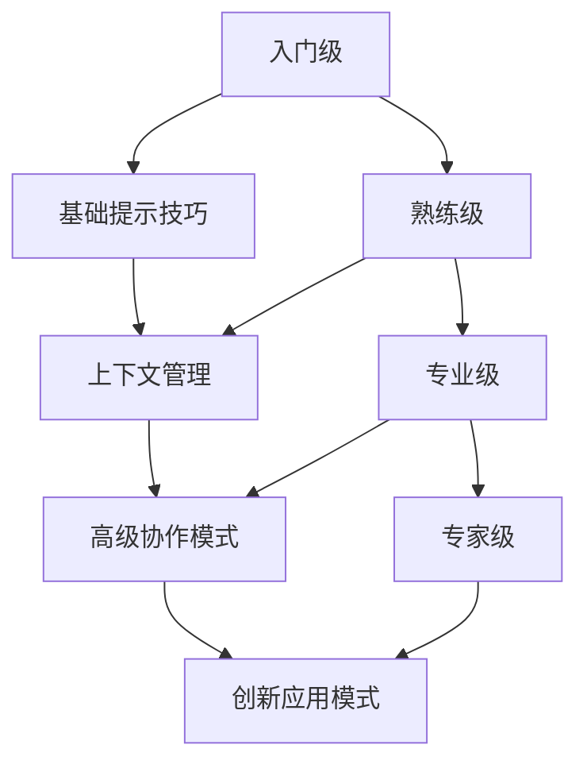

## 开篇：编程范式的革命性转变

康德在《纯理性批判》中提到："我们的知识始于经验，但并非全部来自经验。"当我第一次深入思考Claude Code背后的编程哲学时，这句话给了我深刻启发。

传统编程是"告诉计算机怎么做"，而AI编程是"告诉AI我们想要什么"。这不仅仅是工具的变化，更是思维方式的根本性转变。今天，我将带你深入理解这种变革的本质，掌握AI编程的核心精髓。

## 编程范式的演进史

### 从机器语言到自然语言

让我们回顾编程范式的发展历程：



每一次演进都在提高抽象层次，降低认知负担。Claude Code代表了这个演进的最新阶段——从代码语法到自然语言的跨越。

### AI编程的本质特征

#### 1. 意图驱动开发

```bash
# 传统编程：指定实现步骤
function calculateTax(income, rate) {
  if (income <= 0) return 0;
  return income * rate / 100;
}

# AI编程：描述期望结果
claude "创建一个税收计算函数，支持累进税率，包含各种特殊情况处理"
```

#### 2. 上下文感知协作

```bash
# 传统编程：每次从零开始
// 需要重新思考架构、选择技术栈、设计接口

# AI编程：基于项目上下文
claude "基于当前的Next.js项目，为用户管理模块添加批量操作功能"
```

#### 3. 迭代式优化

```bash
# 传统编程：线性开发流程
需求分析 → 设计 → 编码 → 测试 → 部署

# AI编程：螺旋式改进
需求描述 ⟷ AI理解 ⟷ 代码生成 ⟷ 人工评估 ⟷ 反馈优化
```

## 核心概念一：提示工程的科学与艺术

### 提示工程的认知科学基础

提示工程不是随意的对话，而是基于认知科学原理的精准沟通。

#### 认知负荷理论的应用

```bash
# 低认知负荷 ❌
claude "做个购物网站"

# 适中认知负荷 ✅  
claude "创建B2C电商平台：商品展示、购物车、支付、用户管理。使用React+Node.js"

# 高认知负荷 ❌
claude "创建一个支持多商户、多语言、多货币、实时库存同步、智能推荐、社交分享、优惠券系统、积分体系、物流跟踪、数据分析、移动端适配、PWA支持、SEO优化、无障碍访问的企业级电商平台..."
```

#### 信息架构的层次化

```bash
# 第一层：项目定位
> "创建一个面向小型企业的客户关系管理系统"

# 第二层：功能模块
> "包含客户信息管理、销售机会跟踪、任务提醒、报表分析四大模块"

# 第三层：技术约束
> "使用现代Web技术栈，支持10-100用户并发，部署在云端"

# 第四层：具体需求
> "客户模块需要支持批量导入、数据去重、通讯录同步等功能"
```

### 高级提示工程技巧

#### 1. 情景化描述法

```bash
# 基础描述
claude "创建一个数据表格组件"

# 情景化描述  
claude "我是一个SaaS产品的前端开发者，需要为企业客户创建一个数据表格组件：

背景：用户需要管理大量的销售数据，当前手动操作效率低下
场景：销售经理每天需要查看1000+条销售记录，筛选今日新增客户
用户：技术水平一般的销售人员，习惯Excel操作
环境：主要在办公室电脑使用，偶尔移动端查看

需求：支持排序、筛选、分页、导出，界面要简洁直观"
```

#### 2. 约束驱动设计

```bash
claude "为在线教育平台创建视频播放器：

硬约束（必须满足）：
- 支持HLS和MP4格式
- 播放延迟 < 2秒
- 支持1080p高清播放
- 兼容iOS Safari和Android Chrome

软约束（尽量满足）：
- 支持倍速播放
- 字幕显示
- 进度条拖拽
- 全屏模式

业务约束：
- 集成现有的用户认证系统
- 支持学习进度跟踪
- 防盗链保护
- 符合教育行业规范

技术约束：
- 基于React Hook
- 使用TypeScript
- 包大小 < 200KB
- 支持SSR渲染"
```

#### 3. 示例引导法

```bash
claude "创建一个类似GitHub Issues的任务管理系统：

参考功能：
✓ 如GitHub的Issue创建 → 我们的任务创建
✓ 如Trello的看板视图 → 我们的状态管理
✓ 如Slack的评论系统 → 我们的协作功能
✓ 如Jira的优先级设置 → 我们的任务分级

界面风格：
- 整体布局参考Linear.app的简洁设计
- 颜色方案使用Tailwind的现代配色
- 图标使用Heroicons的一致性设计
- 交互效果参考Framer Motion的流畅动画"
```

#### 4. 反向约束法

```bash
claude "为初创公司创建内容管理系统，特别注意避免以下问题：

❌ 避免：过度设计导致的复杂性
✅ 要求：功能够用即可，优先快速上线

❌ 避免：选择学习成本高的新技术
✅ 要求：使用团队熟悉的技术栈

❌ 避免：追求完美的用户体验
✅ 要求：基础交互流畅，渐进式优化

❌ 避免：大而全的功能设计
✅ 要求：专注核心业务，MVP思维"
```

## 核心概念二：上下文管理的深层机制

### 上下文的多维度模型

Claude Code中的上下文不是简单的信息记录，而是多维度的知识图谱：



### 上下文信息的分层建模

#### Layer 1: 基础上下文（项目元信息）

```markdown
# CLAUDE.md - 基础上下文
## 项目概述
- 名称：EduTech在线学习平台
- 类型：SaaS教育软件
- 阶段：MVP开发
- 团队：3名全栈开发者

## 技术架构
- 前端：Next.js 14 + TypeScript + Tailwind CSS
- 后端：Node.js + Prisma + PostgreSQL
- 部署：Vercel + Railway
- 存储：AWS S3

## 业务模型
- B2B2C模式：服务教育机构，面向学生
- 核心功能：课程管理、学习跟踪、考试系统
- 目标用户：K12教育机构
```

#### Layer 2: 动态上下文（实时状态）

```bash
# 当前开发状态
claude context set current_sprint "用户认证系统开发"
claude context set active_branch "feature/auth-system"  
claude context set recent_decisions "选择NextAuth.js而非自建认证"
claude context set blocking_issues "第三方登录集成API限流"
```

#### Layer 3: 交互上下文（对话历史）

Claude Code会自动维护对话的语义连接：

```bash
# 30分钟前的对话
你: "创建用户注册表单"
Claude: [生成了注册表单组件]

# 现在的对话
你: "刚才的表单加个邮箱验证"
Claude: 理解你指的是刚才创建的用户注册表单，我来添加邮箱验证功能...
```

### 上下文管理的高级策略

#### 1. 上下文分片技术

```bash
# 将大型项目按模块分割上下文
claude context namespace auth "用户认证相关的所有信息"
claude context namespace payments "支付系统相关的所有信息"  
claude context namespace courses "课程管理相关的所有信息"

# 在特定命名空间下工作
claude context use auth
claude "优化登录流程的用户体验"
```

#### 2. 上下文继承机制

```bash
# 父项目上下文
EduTech Platform: {
  技术栈: React + Node.js,
  编码规范: TypeScript + ESLint,
  UI框架: Tailwind CSS
}

# 子模块继承并扩展
User Management Module: extends EduTech Platform {
  特定需求: JWT认证 + RBAC权限,
  额外依赖: bcrypt + jsonwebtoken,
  特殊约束: 符合GDPR数据保护
}
```

#### 3. 上下文版本管理

```bash
# 保存重要的上下文快照
claude context snapshot "v1.0-基础架构完成"
claude context snapshot "v1.1-用户系统上线"  
claude context snapshot "v1.2-支付功能集成"

# 在新功能出问题时回滚
claude context restore "v1.1-用户系统上线"
claude "基于稳定版本开发新的课程管理功能"
```

## 核心概念三：迭代开发的深度实践

### 迭代模式的理论基础

AI编程的迭代不同于传统的敏捷开发，它基于"快速反馈学习"理论：



### 迭代层次的精细化设计

#### 1. 微迭代（秒级）- 提示优化

```bash
# 第一次尝试
claude "创建登录页面"

# 结果不满意，立即优化提示
claude "创建现代化的登录页面，使用卡片布局，包含表单验证"

# 继续细化
claude "为刚才的登录页面添加动画效果和深色模式支持"
```

#### 2. 小迭代（分钟级）- 功能完善

```bash
# 基础实现 (2分钟)
claude "创建用户认证API接口"

# 功能完善 (3分钟)  
claude "为认证API添加输入验证和错误处理"

# 安全加固 (5分钟)
claude "添加速率限制、JWT刷新机制和安全日志"
```

#### 3. 中迭代（小时级）- 模块开发

```bash
# Sprint 1: 核心框架 (2小时)
claude "搭建项目基础架构和核心认证流程"

# Sprint 2: 功能扩展 (3小时)
claude "添加用户个人资料管理和权限控制"

# Sprint 3: 体验优化 (2小时)
claude "优化界面交互和错误处理体验"
```

#### 4. 大迭代（天级）- 系统重构

```bash
# Week 1: MVP版本
claude "实现核心功能的最简可行版本"

# Week 2: 功能完善
claude "基于用户反馈添加高需求功能"

# Week 3: 性能优化  
claude "基于生产数据进行性能优化和bug修复"
```

### 迭代质量的评估体系

#### 1. 技术质量指标

```bash
claude "评估当前代码质量：

技术指标：
- 测试覆盖率：目标>80%，当前67%
- 代码重复度：目标<5%，当前12%  
- 复杂度评分：目标<10，当前平均8.2
- TypeScript严格模式：目标100%，当前89%

性能指标：
- 首屏加载：目标<2s，当前3.1s
- API响应：目标<500ms，当前平均680ms
- 内存使用：目标<100MB，当前125MB

提供具体的改进建议和优先级排序"
```

#### 2. 业务价值评估

```bash
claude "分析功能的业务价值：

用户价值：
- 解决了什么具体问题？
- 提升了多少用户体验？
- 有多少用户会使用这个功能？

商业价值：
- 对核心指标的影响是什么？
- 开发成本vs预期收益如何？
- 与竞争对手相比的优势是什么？

技术债务：
- 引入了哪些新的维护成本？
- 对系统整体架构的影响？
- 未来扩展的便利性如何？"
```

## 核心概念四：人机协作的精妙平衡

### 认知互补理论

人类和AI在认知能力上具有天然的互补性：

| 维度 | 人类优势 | AI优势 |
|------|---------|-------|
| **创造性** | 突破性创新、艺术审美 | 组合式创新、模式识别 |
| **逻辑性** | 直觉判断、经验决策 | 严密推理、一致性分析 |
| **效率性** | 优先级判断、灵活应变 | 批量处理、持续工作 |
| **可靠性** | 异常处理、风险识别 | 标准化执行、错误避免 |

### 协作模式的设计模式

#### 1. Driver-Navigator模式

```bash
# 人类作为Driver（驾驶员）：控制方向和决策
你: "我想重构用户管理模块，目标是提高代码可维护性，你有什么建议？"

# AI作为Navigator（导航员）：提供技术建议和实现细节
Claude: "建议采用以下重构策略：
1. 抽离业务逻辑到Service层
2. 使用Repository模式管理数据访问  
3. 引入DTO进行数据传输
4. 添加单元测试保证重构质量
需要我开始实现哪个部分？"

# 人类确认方向
你: "很好，先从Service层开始，重点关注用户注册和认证逻辑"

# AI执行具体实现
Claude: [开始生成UserService相关代码]
```

#### 2. Pair Programming模式

```bash
# 协作开发一个复杂算法
你: "我需要实现一个智能推荐算法，基于用户行为和内容特征"

Claude: "这是个复杂的系统，让我们分步骤设计：
1. 数据收集：用户行为埋点和内容特征提取
2. 特征工程：构建用户画像和内容标签
3. 模型训练：协同过滤 + 内容过滤混合模式  
4. 实时推荐：在线服务和性能优化

我先实现数据模型和基础算法框架，你来review业务逻辑是否合理？"

# 持续的反馈循环
你: "算法思路很好，但是冷启动问题怎么解决？新用户没有历史行为数据"

Claude: "好问题！我来添加冷启动策略：
1. 基于人口统计学的初始推荐
2. 热门内容和趋势内容推荐  
3. 基于用户注册信息的启发式推荐
4. 快速学习机制，从用户前几次交互中学习偏好"
```

#### 3. Code Review模式

```bash
# AI生成代码后，人类进行业务逻辑审查
Claude: [生成了用户权限验证的代码]

你: "代码逻辑没问题，但是有几个业务场景需要考虑：
1. VIP用户应该有特殊权限
2. 管理员可以代理其他用户操作
3. 某些功能在维护时间需要限制访问
请更新权限验证逻辑"

Claude: "理解了业务需求，我来更新权限系统：
1. 添加VIP用户特权判断
2. 实现管理员代理机制
3. 集成维护模式开关
并且我会添加相应的测试用例验证这些业务场景"
```

### 协作质量的提升策略

#### 1. 建立明确的角色边界

```bash
# 定义协作边界
claude "在我们的协作中，请遵循以下分工：

人类负责：
- 业务需求的最终决策
- 用户体验的主观判断
- 技术方案的风险评估
- 代码的安全审查

AI负责：
- 技术方案的具体实现
- 代码的标准化生成
- 测试用例的编写
- 文档的自动生成

协作方式：
- 重大决策前先讨论方案优劣
- 代码生成后人类必须review
- 遇到歧义时优先询问而非假设
- 保持技术决策的透明度"
```

#### 2. 建立反馈机制

```bash
# 定期评估协作效果
claude "评估我们最近的协作效果：

效率方面：
- 代码生成速度如何？
- 是否减少了重复性工作？
- 问题解决的时间有改善吗？

质量方面：
- 生成的代码质量是否满足标准？
- 业务逻辑的理解准确度如何？
- 是否出现了预期外的bug？

改进建议：
- 哪些方面需要我调整？
- 提示方式有什么可以优化的？
- 协作流程有什么不顺畅的地方？"
```

## 核心概念五：学习与适应的动态机制

### AI学习模型的工作原理

Claude Code的学习不是简单的记忆，而是基于模式识别和推理的深度学习：



### 学习维度的多层次建模

#### 1. 语法偏好学习

```typescript
// 用户的代码风格示例
export const UserService = {
  async findById(id: string): Promise<User | null> {
    // 用户偏好：使用对象字面量而非class
    // 用户偏好：显式返回类型注解
    // 用户偏好：使用async/await而非Promise
    try {
      return await db.user.findUnique({ where: { id } });
    } catch (error) {
      // 用户偏好：详细的错误处理
      logger.error('User lookup failed:', { id, error });
      throw new ServiceError('Failed to find user');
    }
  }
};

// Claude Code学习后会生成类似风格的代码
```

#### 2. 架构偏好学习

```bash
# 用户反复强调的架构偏好
你: "我们团队更喜欢函数式编程风格"
你: "避免使用class，优先使用纯函数"
你: "状态管理使用immutable的方式"

# Claude学习后的自动应用
Claude: "我注意到你偏好函数式编程，我会：
- 使用纯函数实现业务逻辑
- 避免可变状态的操作  
- 采用函数组合而非继承
- 使用高阶函数处理通用逻辑"
```

#### 3. 业务理解学习

```bash
# 多次交互中的业务规则学习
你: "在我们的电商系统中，VIP用户享有特殊权限"
你: "订单超过1000元自动升级为VIP"  
你: "VIP用户可以使用优先客服"

# Claude的业务规则学习
Claude: "我已经理解你们的VIP体系：
- VIP判定：订单金额累计>1000元
- VIP特权：优先客服、专属优惠、快速退款
- VIP等级：可能还有更高级的钻石VIP？
在设计用户相关功能时，我会自动考虑这些业务规则"
```

### 主动学习策略

#### 1. 好奇心驱动的探索

```bash
# AI主动询问以完善理解
Claude: "我注意到你们使用了微服务架构，有几个问题：
1. 服务间通信使用REST还是gRPC？
2. 分布式事务如何处理？
3. 服务发现机制是什么？
4. 错误追踪和监控如何实现？
这些信息将帮助我生成更符合你们架构的代码"
```

#### 2. 反思性学习机制

```bash
# AI对自己表现的反思
Claude: "回顾我们最近的协作，我发现：

表现良好的方面：
- 代码生成的速度和准确性
- 技术方案的可行性分析
- 测试用例的覆盖度

需要改进的方面：
- 对业务边界情况的考虑不够充分
- 性能优化的建议不够具体
- 错误处理的策略过于保守

我会在后续工作中重点关注这些方面"
```

#### 3. 元认知学习

```bash
# AI学习如何更好地学习
Claude: "我想优化我们的协作模式：

当前的学习方式：
- 从你的反馈中学习偏好
- 从代码审查中学习标准
- 从项目演进中学习业务

可以改进的方式：
- 主动询问不确定的业务规则
- 定期总结学到的模式和偏好  
- 预测你可能需要的功能和工具
- 提供个性化的技术建议

你觉得哪种方式对我们的协作最有帮助？"
```

## 实战案例：构建智能投资顾问系统

让我们通过一个复杂的实际项目来验证这些核心概念的应用。

### 项目背景与需求澄清

```bash
claude "我们要为金融科技公司构建一个智能投资顾问系统：

## 业务背景
- 面向个人投资者提供智能化投资建议
- 基于用户风险偏好和财务目标制定投资组合
- 实时监控市场变化并调整投资策略

## 核心功能需求
1. 用户风险评估问卷
2. 智能投资组合生成  
3. 实时市场数据监控
4. 投资组合自动再平衡
5. 投资报告和分析

## 技术约束
- 必须符合金融监管要求
- 数据安全等级：最高级
- 系统可用性要求：99.99%
- 实时数据延迟：<100ms

## 业务约束  
- 支持10种主要资产类别
- 覆盖全球20个主要市场
- 支持5种风险等级
- 提供中英文双语服务

请先设计整体架构，然后我们逐步实现各个模块"
```

### 架构设计与上下文建立

Claude Code基于需求提供系统架构：



### 迭代开发实践

#### 迭代1：用户风险评估系统

```bash
# 第一轮：基础框架
claude "实现用户风险评估问卷系统：

技术要求：
- React Hook Form处理表单
- Zod进行数据验证
- 动态问题逻辑（基于前面答案显示后续问题）
- 实时计算风险评分

业务逻辑：
- 5个维度：投资经验、风险承受度、投资目标、时间范围、财务状况
- 每个维度3-5个问题
- 动态权重计算（不同年龄段权重不同）
- 最终输出：保守、稳健、平衡、成长、激进五个等级"

# AI生成初始版本后...

# 第二轮：业务逻辑优化
你: "风险评估的逻辑需要更复杂，比如：
- 年轻用户即使选择保守，也应该推荐一定比例的成长性资产
- 临近退休的用户需要特别的风险控制
- 投资金额大小也应该影响风险承受度评估"

claude "理解了，我来优化风险评估算法：
1. 引入年龄因子调整
2. 添加生命周期模型
3. 考虑投资金额的风险分散效应
4. 集成行为金融学的偏误修正"

# 第三轮：用户体验完善
你: "界面体验还需要改进：
- 问卷过程要有进度指示
- 问题描述需要更易懂
- 结果页面要有可视化图表
- 支持随时修改答案重新评估"

claude "我来优化用户体验：
1. 添加步骤指示器和进度条
2. 简化问题描述，增加tooltip解释
3. 使用Chart.js绘制风险分布雷达图
4. 实现答案修改的即时重算"
```

#### 迭代2：智能投资组合生成

```bash
# 基于风险评估结果，生成投资组合
claude "基于用户风险评估结果，实现智能投资组合生成：

算法要求：
- 使用现代投资组合理论（MPT）
- 考虑资产相关性和历史波动率
- 支持ESG投资偏好
- 集成黑天鹅事件保护

实现需求：
- 后端使用Python科学计算库
- 前端展示资产配置饼图
- 支持拖拽调整配置比例
- 实时计算风险收益指标"

# 人机协作优化
你: "投资组合算法需要考虑中国市场特殊性：
- A股市场波动较大，需要特殊处理
- 港股通和沪深股通的配置限制
- 汇率风险对海外资产配置的影响
- 政策风险评估和应对"

claude "针对中国市场特性，我来调整算法：
1. A股资产添加额外波动率系数
2. 实现跨境投资配额管理
3. 集成人民币汇率风险模型
4. 添加政策敏感度评估指标"
```

#### 迭代3：实时监控与再平衡

```bash
# 实现投资组合的实时监控
claude "实现投资组合实时监控和自动再平衡：

技术架构：
- WebSocket实时数据推送
- 事件驱动的再平衡触发
- 分布式任务队列处理
- 实时风险指标计算

业务逻辑：
- 偏离阈值：权重偏离>5%触发再平衡
- 时间阈值：每月强制检查一次
- 市场条件：极端市场情况下的保护机制
- 用户偏好：允许用户自定义再平衡频率"

# 性能优化协作
你: "实时监控的性能需要优化：
- 10万+用户的实时计算压力很大
- 市场数据更新频率很高
- 需要控制服务器成本"

claude "我来设计性能优化方案：
1. 实现增量计算和缓存策略
2. 使用Redis Stream处理实时数据
3. 批量处理非紧急的再平衡任务
4. 智能采样减少不必要的计算"
```

### 人机协作的质量把控

```bash
# 代码审查环节
你: "我来审查投资组合计算的核心代码：

发现的问题：
1. 缺少异常市场情况的处理
2. 资产价格为零或负数时的边界检查  
3. 矩阵奇异时的降维处理
4. 计算精度可能导致的舍入误差

请修复这些问题并添加相应的测试用例"

claude "感谢review，我来修复这些关键问题：

1. 异常市场处理：添加熔断机制和降级策略
2. 边界条件检查：完善输入数据验证
3. 数值稳定性：使用更稳定的数值算法
4. 精度控制：实现高精度小数运算

我还会添加压力测试，模拟极端市场情况"

# 性能测试协作
你: "我们需要测试系统在高并发下的表现：
- 模拟1万用户同时在线
- 测试市场数据突发流量
- 验证数据库连接池设置
- 检查内存泄漏问题"

claude "我来设计全面的性能测试方案：
1. 使用k6编写负载测试脚本
2. 模拟真实的用户行为模式
3. 监控系统各层级的关键指标
4. 实现自动化的性能回归测试"
```

## 掌握AI编程的关键心态

### 1. 从控制思维到协作思维

```bash
# 控制思维（传统编程）❌
"我要完全掌控代码的每一行"

# 协作思维（AI编程）✅  
"我和AI各自发挥优势，共同完成目标"
```

### 2. 从完美主义到迭代主义

```bash
# 完美主义思维 ❌
"我要一次性设计出完美的架构"

# 迭代主义思维 ✅
"先快速验证核心假设，再逐步完善细节"
```

### 3. 从知识储备到学习能力

```bash
# 知识储备思维 ❌  
"我必须掌握所有相关技术才能开始"

# 学习能力思维 ✅
"我可以在项目过程中学习和成长"
```

## 总结：AI编程的核心竞争力

通过深入理解这些核心概念，我们可以总结出AI编程的核心竞争力：

### 🔑 五大核心技能

1. **提示工程能力**：用准确清晰的语言表达复杂需求
2. **上下文管理能力**：维护项目的完整知识图谱
3. **迭代思维能力**：快速试验、学习、调整的敏捷思维
4. **协作配合能力**：理解人机各自优势，合理分工
5. **持续学习能力**：与AI共同成长，不断提升协作效率

### 📈 发展阶段与能力模型



### 🚀 未来展望

AI编程正在快速发展，未来的趋势包括：

1. **更智能的意图理解**：AI能够理解更复杂、更模糊的需求
2. **更深度的上下文记忆**：跨项目、跨时间的知识积累
3. **更精准的个性化适配**：基于个人习惯的定制化协作
4. **更广泛的技能整合**：设计、测试、部署的全流程智能化

正如尼采所说："人类的伟大之处在于他是一座桥梁，而不是目的地。"在AI编程时代，我们每个开发者都是连接传统编程和未来智能开发的桥梁。

掌握了这些核心概念，你就拥有了在AI编程时代成功的基础。在下一篇文章中，我们将通过更多实战项目，深入体验这些概念在实际开发中的应用。

---

*本文是《Claude Code完整教程系列》的第5部分。理解了AI编程的核心精髓，让我们继续探索更多实战技能！*