## 引言：AI时代的生态连接革命

> "工具的力量不在于工具本身，而在于工具之间的连接。" —— Kevin Kelly

在我多年的软件开发实践中发现，**工具碎片化是现代开发者面临的最大效率杀手**。我们需要在GitHub管理代码、在Jira跟踪需求、在Sentry监控错误、在Slack团队协作——每天在不同平台间反复跳转，手动复制信息，重新建立上下文，消耗了大量宝贵的开发时间。

Claude Code的MCP（Model Context Protocol）协议彻底改变了这种状况。如果说Claude Code是AI编程助手的大脑，那么MCP就是连接整个开发生态的神经网络。它让Claude Code从一个孤立的工具，升级为能够统一管理你所有开发工具链的智能中心。

## 强大的工具集成需要稳定的AI基础服务

在深入了解MCP协议之前，我必须强调一个关键认知：**复杂的跨平台集成和大规模工具协调，需要极其稳定可靠的AI服务支撑**。普通的AI服务往往在多工具并发操作时不稳定，无法支撑企业级的工具生态集成。

这也是我在所有重要项目中都选择 **Yoretea Claude Code ([code.yoretea.com](https://code.yoretea.com))** 的重要原因：

* **企业级集成稳定性**：在复杂的多工具协调场景下保持稳定，支撑大规模API调用和数据处理
* **高并发处理能力**：同时处理多个平台的数据同步和工作流执行，不会因负载问题导致集成失效
* **专业服务保障**：为关键业务流程提供稳定的AI服务支持，确保工具生态的可靠运行

当你需要构建企业级的开发工具生态集成时：

> **果叔专属 8 折优惠码：`GUOSHU`**

访问 `code.yoretea.com` 使用，让你的MCP工具集成拥有真正的企业级稳定性保障。

## MCP协议架构深度剖析

### 传统工具孤岛的痛点分析

```
传统开发工作流的核心问题：
1. 工具分散孤立 → 各平台独立运行，缺乏统一管理
2. 上下文频繁丢失 → 平台切换导致工作状态断裂  
3. 信息重复输入 → 需要在多个工具间手动同步数据
4. 认知负荷过重 → 需要记住每个工具的不同操作方式
5. 协作效率低下 → 跨团队信息传递依赖人工协调

典型场景痛点：
- 从GitHub发现Bug → 在Jira创建工单 → 在IDE查看代码 
- 在Sentry分析错误 → 在Slack讨论方案 → 在Linear跟踪进度
每个环节都需要手动切换和重新建立上下文 😤
```

### MCP协议的革命性价值

```
MCP统一生态的核心优势：
1. 统一智能接口 → 一个AI助手，连接所有开发工具
2. 完整上下文保持 → AI理解跨平台的完整业务流程
3. 智能自动化执行 → 复杂跨工具操作的一键式自动完成
4. 实时数据同步 → 所有平台状态的即时更新和同步
5. 深度业务洞察 → 基于全生态数据的智能分析和建议

理想开发场景实现：
Claude Code 可以直接：
- 📖 读取和分析GitHub Issues、PR和代码变更
- 🔍 获取Sentry错误报告并进行智能诊断
- 📊 查询数据库状态和性能监控指标
- 💬 在Slack发送团队通知和状态更新
- 🎯 在Linear创建任务并同步项目进度

所有操作在统一界面完成，真正实现智能协作！✨
```

## 核心架构与工作原理

### 1. MCP系统架构设计

在我的实际使用中，MCP最令人震撼的是其**分层架构的优雅设计**。它不是简单的API调用包装，而是完整的智能连接生态：

#### 系统组件关系图

```mermaid
graph TD
    A[Claude Code 智能客户端] --> B[MCP 协议层]
    B --> C[本地 MCP 服务器集群]
    B --> D[云端 MCP 服务器集群]
    
    C --> E[文件系统工具集]
    C --> F[终端命令工具集]
    C --> G[数据库工具集]
    C --> H[本地开发工具集]
    
    D --> I[GitHub API集成]
    D --> J[Slack API集成]
    D --> K[Linear API集成]
    D --> L[Sentry API集成]
    D --> M[AWS服务集成]
    D --> N[监控工具集成]
    
    subgraph "本地开发生态"
        E
        F
        G
        H
    end
    
    subgraph "云端服务生态"
        I
        J
        K
        L
        M
        N
    end
    
    O[统一认证管理器] --> D
    P[智能资源发现器] --> C
    P --> D
    
    Q[上下文管理中心] --> A
    R[工具注册中心] --> B
    S[安全沙箱管理] --> C
    S --> D
```



#### 协议能力清单示例

```json
// MCP 服务器完整能力清单
{
  "protocol_version": "2024-11-05",
  "capabilities": {
    "tools": [
      {
        "name": "github_issue_analyzer",
        "description": "智能分析GitHub Issue并提供解决建议",
        "inputSchema": {
          "type": "object",
          "properties": {
            "owner": {"type": "string", "description": "仓库所有者"},
            "repo": {"type": "string", "description": "仓库名称"},
            "issue_number": {"type": "integer", "description": "Issue编号"},
            "analysis_depth": {
              "type": "string", 
              "enum": ["basic", "detailed", "comprehensive"],
              "default": "detailed"
            }
          },
          "required": ["owner", "repo", "issue_number"]
        },
        "outputSchema": {
          "type": "object",
          "properties": {
            "issue_summary": {"type": "string"},
            "impact_analysis": {"type": "object"},
            "solution_recommendations": {"type": "array"},
            "related_errors": {"type": "array"},
            "estimated_effort": {"type": "string"}
          }
        }
      }
    ],
    
    "resources": [
      {
        "uri": "github://issues/active",
        "name": "活跃Issues数据流",
        "description": "实时的GitHub Issues状态和更新",
        "mimeType": "application/json",
        "updateFrequency": "real-time"
      },
      {
        "uri": "sentry://errors/trending",
        "name": "trending错误分析",
        "description": "最近24小时内trending的错误报告",
        "mimeType": "application/json",
        "updateFrequency": "hourly"
      }
    ],
    
    "prompts": [
      {
        "name": "cross_platform_bug_analysis",
        "description": "跨平台Bug分析和修复建议生成",
        "arguments": [
          {
            "name": "github_issue_id",
            "description": "GitHub Issue ID",
            "required": true
          },
          {
            "name": "sentry_error_id", 
            "description": "关联的Sentry错误ID",
            "required": false
          },
          {
            "name": "include_team_context",
            "description": "是否包含团队上下文分析",
            "required": false,
            "default": true
          }
        ]
      }
    ]
  },
  
  "supported_integrations": {
    "development": ["github", "gitlab", "bitbucket"],
    "project_management": ["linear", "jira", "asana", "notion"],
    "monitoring": ["sentry", "datadog", "newrelic", "prometheus"],
    "communication": ["slack", "discord", "microsoft_teams"],
    "cloud_services": ["aws", "azure", "gcp", "vercel"],
    "databases": ["postgresql", "mysql", "mongodb", "redis"]
  }
}
```

### 2. 智能配置管理系统

#### 企业级配置架构

```json
// ~/.claude/mcp_settings.json - 企业级配置文件
{
  "version": "2.1.0",
  "environment": "production",
  
  "mcpServers": {
    // GitHub企业集成配置
    "github_enterprise": {
      "command": "node",
      "args": ["/opt/claude/mcp-servers/github-enterprise/index.js"],
      "env": {
        "GITHUB_ENTERPRISE_URL": "https://github.company.com/api/v3",
        "GITHUB_TOKEN": "${GITHUB_ENTERPRISE_TOKEN}",
        "GITHUB_APP_ID": "${GITHUB_APP_ID}",
        "GITHUB_PRIVATE_KEY": "${GITHUB_PRIVATE_KEY}"
      },
      "scope": "organization",
      "description": "GitHub企业版完整集成",
      "health_check": {
        "endpoint": "/health",
        "interval": 30000,
        "timeout": 5000
      },
      "performance": {
        "max_concurrent_requests": 10,
        "rate_limit": "5000/hour",
        "cache_ttl": 300
      }
    },
    
    // Slack企业集成
    "slack_enterprise": {
      "command": "python",
      "args": ["/opt/claude/mcp-servers/slack-enterprise/main.py"],
      "env": {
        "SLACK_BOT_TOKEN": "${SLACK_BOT_TOKEN}",
        "SLACK_APP_TOKEN": "${SLACK_APP_TOKEN}",
        "SLACK_SIGNING_SECRET": "${SLACK_SIGNING_SECRET}",
        "SLACK_WORKSPACE_ID": "${SLACK_WORKSPACE_ID}"
      },
      "scope": "enterprise",
      "features": {
        "channel_management": true,
        "user_management": true,
        "message_scheduling": true,
        "workflow_automation": true
      },
      "security": {
        "message_encryption": true,
        "audit_logging": true,
        "compliance_mode": "enterprise"
      }
    },
    
    // Linear项目管理集成
    "linear_advanced": {
      "command": "deno",
      "args": [
        "run",
        "--allow-net",
        "--allow-env",
        "/opt/claude/mcp-servers/linear-advanced/mod.ts"
      ],
      "env": {
        "LINEAR_API_KEY": "${LINEAR_API_KEY}",
        "LINEAR_ORG_ID": "${LINEAR_ORG_ID}",
        "LINEAR_WEBHOOK_SECRET": "${LINEAR_WEBHOOK_SECRET}"
      },
      "scope": "organization",
      "integrations": {
        "github_sync": true,
        "slack_notifications": true,
        "time_tracking": true,
        "roadmap_planning": true
      }
    },
    
    // Sentry高级错误监控
    "sentry_enterprise": {
      "command": "node",
      "args": ["/opt/claude/mcp-servers/sentry-enterprise/dist/index.js"],
      "env": {
        "SENTRY_AUTH_TOKEN": "${SENTRY_AUTH_TOKEN}",
        "SENTRY_ORG": "${SENTRY_ORG}",
        "SENTRY_PROJECTS": "${SENTRY_PROJECTS}",
        "SENTRY_DSN": "${SENTRY_DSN}"
      },
      "features": {
        "intelligent_error_grouping": true,
        "performance_monitoring": true,
        "release_health": true,
        "custom_metrics": true
      },
      "alerts": {
        "error_threshold": 10,
        "performance_threshold": 2000,
        "notification_channels": ["slack", "email", "pagerduty"]
      }
    },
    
    // 数据库集成（支持多种数据库）
    "database_multi": {
      "command": "python",
      "args": ["/opt/claude/mcp-servers/database-multi/server.py"],
      "env": {
        "PRIMARY_DATABASE_URL": "${PRIMARY_DATABASE_URL}",
        "ANALYTICS_DATABASE_URL": "${ANALYTICS_DATABASE_URL}",
        "REDIS_URL": "${REDIS_URL}",
        "MONGODB_URL": "${MONGODB_URL}"
      },
      "security": {
        "read_only_mode": true,
        "allowed_operations": ["SELECT", "SHOW", "DESCRIBE"],
        "blocked_operations": ["DROP", "DELETE", "TRUNCATE"],
        "query_timeout": 30000,
        "max_result_rows": 10000
      },
      "connection_pool": {
        "min_connections": 2,
        "max_connections": 10,
        "idle_timeout": 300000
      }
    },
    
    // AWS云服务集成
    "aws_services": {
      "command": "python",
      "args": ["/opt/claude/mcp-servers/aws-services/main.py"],
      "env": {
        "AWS_ACCESS_KEY_ID": "${AWS_ACCESS_KEY_ID}",
        "AWS_SECRET_ACCESS_KEY": "${AWS_SECRET_ACCESS_KEY}",
        "AWS_DEFAULT_REGION": "${AWS_DEFAULT_REGION}",
        "AWS_ACCOUNT_ID": "${AWS_ACCOUNT_ID}"
      },
      "services": {
        "ec2": {"enabled": true, "regions": ["us-east-1", "us-west-2"]},
        "s3": {"enabled": true, "bucket_access": "read-only"},
        "rds": {"enabled": true, "operations": ["describe", "metrics"]},
        "lambda": {"enabled": true, "operations": ["list", "logs", "metrics"]},
        "cloudwatch": {"enabled": true, "log_retention": "30d"}
      },
      "security": {
        "assume_role_arn": "${AWS_CLAUDE_ROLE_ARN}",
        "mfa_required": false,
        "resource_restrictions": ["production-*"]
      }
    }
  },
  
  // 全局系统配置
  "globalSettings": {
    "performance": {
      "maxConcurrentConnections": 50,
      "connectionTimeout": 30000,
      "requestTimeout": 60000,
      "retryAttempts": 3,
      "retryBackoff": "exponential"
    },
    "logging": {
      "level": "info",
      "format": "json",
      "destination": "file",
      "rotation": "daily",
      "retention": "30d"
    },
    "caching": {
      "enabled": true,
      "provider": "redis",
      "ttl": 300,
      "max_size": "1GB",
      "compression": true
    }
  },
  
  // 企业安全配置
  "security": {
    "authentication": {
      "method": "oauth2_with_pkce",
      "token_refresh": "automatic",
      "session_timeout": 3600
    },
    "authorization": {
      "rbac_enabled": true,
      "default_role": "read_only",
      "admin_approval_required": true
    },
    "network_security": {
      "allowed_domains": [
        "*.github.com",
        "*.slack.com", 
        "*.linear.app",
        "*.sentry.io",
        "*.amazonaws.com"
      ],
      "ssl_verification": true,
      "certificate_pinning": true,
      "proxy_settings": {
        "http_proxy": "${CORPORATE_PROXY}",
        "https_proxy": "${CORPORATE_PROXY}",
        "no_proxy": "localhost,127.0.0.1,*.internal"
      }
    },
    "data_protection": {
      "encrypt_at_rest": true,
      "encrypt_in_transit": true,
      "pii_detection": true,
      "audit_logging": true,
      "gdpr_compliance": true
    }
  },
  
  // 监控和告警配置
  "monitoring": {
    "health_checks": {
      "enabled": true,
      "interval": 30000,
      "timeout": 5000,
      "failure_threshold": 3
    },
    "metrics": {
      "enabled": true,
      "provider": "prometheus",
      "endpoint": "/metrics",
      "labels": {
        "environment": "production",
        "team": "engineering"
      }
    },
    "alerting": {
      "channels": ["slack", "pagerduty", "email"],
      "escalation_policy": "engineering_oncall",
      "alert_rules": [
        {
          "condition": "error_rate > 5%",
          "severity": "critical",
          "cooldown": 300
        },
        {
          "condition": "response_time > 30s",
          "severity": "warning", 
          "cooldown": 600
        }
      ]
    }
  }
}
```

## 实战应用场景深度解析

### 场景1：智能Bug全生命周期管理

我最常用的MCP场景就是**跨平台的Bug分析和处理自动化**。传统方式需要在多个平台间手动切换，而MCP让整个过程变得智能化：

```bash
claude "全面分析GitHub Issue #456的问题，检查相关Sentry错误，生成修复计划并同步到Linear"
```

Claude Code的智能处理流程：

```python
async def intelligent_bug_lifecycle_management(issue_number: int):
    """智能Bug全生命周期管理工作流"""
    
    workflow_id = f"bug-analysis-{issue_number}-{int(time.time())}"
    print(f"🔍 启动智能Bug分析工作流: {workflow_id}")
    
    # 第1步：多维度信息收集
    print("📊 第1步：多维度数据收集...")
    
    # GitHub Issue详细信息
    github_issue = await mcp.github_enterprise.get_issue_with_context(
        owner="company-org", 
        repo="main-product", 
        issue_number=issue_number,
        include_related_prs=True,
        include_commit_history=True,
        include_discussion_thread=True
    )
    
    # 提取错误关键词并搜索相关Sentry错误
    error_keywords = await extract_intelligent_keywords(github_issue.body)
    sentry_errors = await mcp.sentry_enterprise.search_errors(
        query=error_keywords,
        time_range="14d",  # 最近14天
        include_performance_data=True,
        include_user_impact=True,
        limit=20
    )
    
    # 检查是否有相关的Linear任务
    linear_issues = await mcp.linear_advanced.search_issues(
        query=f"#{issue_number} OR {error_keywords[:3]}",  # 前3个关键词
        include_completed=True,
        include_archived=False
    )
    
    # 获取相关代码文件的最近变更
    if sentry_errors:
        affected_files = await extract_affected_files(sentry_errors[0].stack_trace)
        recent_commits = await mcp.github_enterprise.get_file_history(
            files=affected_files,
            since="14 days ago",
            include_pr_context=True
        )
    
    print(f"✅ 数据收集完成:")
    print(f"   - GitHub Issue: {github_issue.title}")
    print(f"   - 关联Sentry错误: {len(sentry_errors)}个")
    print(f"   - 现有Linear任务: {len(linear_issues)}个")
    print(f"   - 相关代码提交: {len(recent_commits) if 'recent_commits' in locals() else 0}个")
    
    # 第2步：智能影响面分析
    print("🎯 第2步：智能影响面分析...")
    
    impact_analysis = await analyze_bug_impact(
        github_issue=github_issue,
        sentry_errors=sentry_errors,
        recent_commits=recent_commits if 'recent_commits' in locals() else [],
        user_feedback=await collect_user_feedback(issue_number)
    )
    
    # 业务影响评估
    business_impact = await assess_business_impact(
        error_frequency=sentry_errors[0].count if sentry_errors else 0,
        affected_users=impact_analysis.unique_users,
        revenue_impact=impact_analysis.estimated_revenue_loss,
        feature_criticality=impact_analysis.feature_importance
    )
    
    print(f"📈 影响面分析结果:")
    print(f"   - 影响用户数: {impact_analysis.unique_users:,}")
    print(f"   - 错误发生频率: {sentry_errors[0].count if sentry_errors else 0}/天")
    print(f"   - 业务优先级: {business_impact.priority}")
    print(f"   - 预估收入影响: ${business_impact.revenue_impact:,.2f}")
    
    # 第3步：AI驱动的根因分析
    print("🧠 第3步：AI驱动的根因分析...")
    
    root_cause_analysis = await perform_ai_root_cause_analysis({
        "issue_description": github_issue.body,
        "error_patterns": [error.exception_type for error in sentry_errors[:5]],
        "stack_traces": [error.stack_trace for error in sentry_errors[:3]],
        "recent_changes": [commit.message for commit in recent_commits[:10]] if 'recent_commits' in locals() else [],
        "system_context": await get_system_context_for_analysis()
    })
    
    print(f"🔬 根因分析结果:")
    print(f"   - 可能原因: {root_cause_analysis.likely_causes[0]}")
    print(f"   - 置信度: {root_cause_analysis.confidence:.1%}")
    print(f"   - 影响范围: {root_cause_analysis.scope}")
    
    # 第4步：生成智能修复方案
    print("💡 第4步：生成智能修复方案...")
    
    fix_recommendations = await generate_intelligent_fix_plan({
        "root_cause": root_cause_analysis,
        "codebase_context": await analyze_codebase_patterns(affected_files if 'affected_files' in locals() else []),
        "team_expertise": await get_team_expertise_mapping(),
        "similar_fixes": await find_similar_historical_fixes(error_keywords)
    })
    
    print(f"🛠️ 修复方案生成:")
    for i, fix in enumerate(fix_recommendations.solutions, 1):
        print(f"   方案{i}: {fix.title} (难度: {fix.complexity}, 预估: {fix.estimated_hours}小时)")
    
    # 第5步：自动创建Linear任务
    print("📋 第5步：创建Linear跟踪任务...")
    
    linear_task = await mcp.linear_advanced.create_comprehensive_issue(
        title=f"🐛 修复: {github_issue.title}",
        description=format_linear_description({
            "github_issue": github_issue,
            "impact_analysis": impact_analysis,
            "root_cause": root_cause_analysis,
            "fix_recommendations": fix_recommendations,
            "sentry_links": [error.permalink for error in sentry_errors[:3]]
        }),
        priority=map_business_priority_to_linear(business_impact.priority),
        labels=["bug", "customer-impact", f"github-{issue_number}"],
        team_id=determine_optimal_team(root_cause_analysis.affected_systems),
        assignee=recommend_best_assignee(fix_recommendations.required_expertise),
        project_id=await get_current_sprint_project(),
        estimate=calculate_story_points(fix_recommendations.solutions[0].estimated_hours)
    )
    
    # 第6步：GitHub Issue更新
    print("🔗 第6步：更新GitHub Issue...")
    
    github_comment = format_analysis_comment({
        "analysis_id": workflow_id,
        "impact_summary": impact_analysis,
        "root_cause_summary": root_cause_analysis,
        "recommended_solution": fix_recommendations.solutions[0],
        "linear_task_link": linear_task.url,
        "sentry_errors_summary": sentry_errors[:3] if sentry_errors else []
    })
    
    await mcp.github_enterprise.add_comprehensive_comment(
        owner="company-org",
        repo="main-product",
        issue_number=issue_number,
        body=github_comment,
        metadata={
            "analysis_workflow_id": workflow_id,
            "linear_task_id": linear_task.id,
            "priority": business_impact.priority
        }
    )
    
    # 第7步：团队通知和协调
    print("📢 第7步：智能团队通知...")
    
    # 根据严重程度选择通知渠道和方式
    if business_impact.priority in ["urgent", "high"]:
        # 高优先级：多渠道通知
        await mcp.slack_enterprise.send_priority_alert(
            channel="#engineering-urgent",
            title="🚨 高优先级Bug需要立即处理",
            content=format_urgent_bug_alert({
                "issue": github_issue,
                "impact": impact_analysis,
                "linear_task": linear_task,
                "recommended_assignee": linear_task.assignee
            }),
            mention_users=[linear_task.assignee.slack_id],
            require_acknowledgment=True
        )
        
        # PagerDuty告警（如果是critical）
        if business_impact.priority == "urgent":
            await trigger_pagerduty_incident(
                title=f"Critical Bug: {github_issue.title}",
                description=root_cause_analysis.summary,
                urgency="high",
                assignee=linear_task.assignee.email
            )
    else:
        # 普通优先级：标准通知
        await mcp.slack_enterprise.send_message(
            channel="#bug-triage",
            blocks=format_bug_analysis_blocks({
                "github_issue": github_issue,
                "analysis": impact_analysis,
                "linear_task": linear_task,
                "next_steps": fix_recommendations.solutions[0].action_items
            })
        )
    
    # 第8步：监控和跟踪设置
    print("📊 第8步：设置监控和跟踪...")
    
    # 创建Sentry规则，监控修复后的效果
    if sentry_errors:
        await mcp.sentry_enterprise.create_issue_alert_rule(
            name=f"Monitor Fix for Issue #{issue_number}",
            conditions=[
                {"filter_type": "error.type", "value": sentry_errors[0].exception_type},
                {"filter_type": "frequency", "value": "increased"}
            ],
            actions=[
                {"type": "slack", "channel": "#bug-monitoring"},
                {"type": "linear", "project_id": linear_task.project.id}
            ],
            environment=["production"],
            duration_hours=168  # 监控一周
        )
    
    # 在Linear中设置自动提醒
    await mcp.linear_advanced.create_issue_reminder(
        issue_id=linear_task.id,
        reminder_type="progress_check",
        schedule="daily",
        conditions=["not_updated_24h", "no_progress_3d"],
        notify_assignee=True,
        escalate_after_days=5
    )
    
    # 第9步：生成执行报告
    print("📋 第9步：生成完整分析报告...")
    
    comprehensive_report = {
        "workflow_id": workflow_id,
        "github_issue": {
            "number": issue_number,
            "title": github_issue.title,
            "url": github_issue.html_url
        },
        "impact_analysis": {
            "affected_users": impact_analysis.unique_users,
            "business_priority": business_impact.priority,
            "revenue_impact": business_impact.revenue_impact
        },
        "technical_analysis": {
            "root_cause": root_cause_analysis.likely_causes[0],
            "confidence": root_cause_analysis.confidence,
            "affected_systems": root_cause_analysis.affected_systems
        },
        "action_plan": {
            "linear_task_id": linear_task.id,
            "linear_task_url": linear_task.url,
            "assigned_to": linear_task.assignee.name,
            "estimated_completion": fix_recommendations.solutions[0].estimated_completion_date
        },
        "monitoring": {
            "sentry_alert_rule": f"Monitor Fix for Issue #{issue_number}",
            "linear_reminders": "Daily progress check enabled"
        }
    }
    
    # 保存到内部知识库
    await save_analysis_to_knowledge_base(comprehensive_report)
    
    print(f"""
🎉 智能Bug分析工作流完成！
━━━━━━━━━━━━━━━━━━━━━━━━━━━━━━━━━━━━━━━━━━━━━━━
📋 GitHub Issue: #{issue_number} - {github_issue.title}
🎯 Linear任务: {linear_task.identifier} - {linear_task.url}
👤 分配给: {linear_task.assignee.name}
⚡ 优先级: {business_impact.priority}
📈 影响用户: {impact_analysis.unique_users:,}
💰 收入影响: ${business_impact.revenue_impact:,.2f}
🔬 根本原因: {root_cause_analysis.likely_causes[0]}
⏱️ 预估修复: {fix_recommendations.solutions[0].estimated_hours}小时
━━━━━━━━━━━━━━━━━━━━━━━━━━━━━━━━━━━━━━━━━━━━━━━
    """)
    
    return comprehensive_report

# 使用示例
bug_analysis = await intelligent_bug_lifecycle_management(456)
```

### 场景2：自动化项目健康监控与报告

另一个我经常使用的场景是**项目健康状态的智能监控和报告生成**：

```python
async def comprehensive_project_health_monitoring():
    """全方位项目健康监控和报告生成"""
    
    print("🏥 启动项目健康监控分析...")
    
    # 第1步：多维度数据收集
    health_metrics = {}
    
    # 代码质量指标
    code_quality = await mcp.github_enterprise.get_code_quality_metrics(
        repositories=["main-product", "mobile-app", "admin-panel"],
        metrics=["test_coverage", "code_duplication", "security_issues", "technical_debt"]
    )
    
    # 部署和稳定性指标
    deployment_health = await collect_deployment_metrics()
    system_stability = await mcp.sentry_enterprise.get_system_health_overview(
        time_range="7d",
        include_performance=True,
        include_user_satisfaction=True
    )
    
    # 团队效率指标
    team_velocity = await mcp.linear_advanced.get_team_velocity_analysis(
        teams=["engineering", "frontend", "backend", "mobile"],
        time_range="30d",
        include_burndown=True
    )
    
    # 业务指标
    business_metrics = await collect_business_health_indicators()
    
    print(f"📊 健康指标收集完成:")
    print(f"   - 代码质量评分: {code_quality.overall_score}/100")
    print(f"   - 系统稳定性: {system_stability.uptime_percentage:.2%}")
    print(f"   - 团队速度: {team_velocity.average_velocity:.1f} 点/周")
    print(f"   - 用户满意度: {business_metrics.user_satisfaction_score:.1f}/5.0")
    
    # 第2步：智能健康评估
    health_assessment = await perform_intelligent_health_assessment({
        "code_quality": code_quality,
        "system_stability": system_stability,
        "team_performance": team_velocity,
        "business_metrics": business_metrics,
        "historical_trends": await get_historical_health_trends()
    })
    
    # 第3步：生成改进建议
    improvement_recommendations = await generate_health_improvement_plan(health_assessment)
    
    # 第4步：自动创建改进任务
    if improvement_recommendations.urgent_actions:
        for action in improvement_recommendations.urgent_actions:
            linear_task = await mcp.linear_advanced.create_issue(
                title=f"🚨 项目健康改进: {action.title}",
                description=action.detailed_description,
                priority="High",
                labels=["project-health", "urgent"],
                team_id=action.responsible_team_id,
                assignee=action.suggested_assignee
            )
    
    # 第5步：发送健康报告
    await distribute_health_report(health_assessment, improvement_recommendations)
    
    return health_assessment

# 定期执行（每日早上8点）
schedule.every().day.at("08:00").do(comprehensive_project_health_monitoring)
```

## MCP高级应用模式

### 1. 企业级自动化发布流程

基于我在多个企业项目中的实践，MCP最强大的应用场景之一是**端到端的自动化发布流程**：

```python
async def enterprise_automated_release_pipeline(version: str, release_notes: str):
    """企业级自动化发布流水线"""
    
    pipeline_id = f"release-{version}-{int(time.time())}"
    print(f"🚀 启动企业级发布流水线: {version} (ID: {pipeline_id})")
    
    try:
        # 第1阶段：预发布质量门禁
        print("🔍 第1阶段：预发布质量门禁检查...")
        
        quality_gates = await execute_quality_gates_in_parallel([
            mcp.sonarqube.get_quality_gate_status(),
            mcp.security_scanner.run_comprehensive_security_scan(),
            mcp.performance_monitor.run_performance_benchmarks(),
            mcp.dependency_checker.audit_dependencies()
        ])
        
        if not all(gate.passed for gate in quality_gates):
            failed_gates = [gate.name for gate in quality_gates if not gate.passed]
            raise ReleaseBlockedException(f"质量门禁失败: {failed_gates}")
        
        # 第2阶段：自动化测试执行
        print("🧪 第2阶段：全面自动化测试...")
        
        test_results = await execute_comprehensive_test_suite([
            mcp.testing.run_unit_tests(),
            mcp.testing.run_integration_tests(),
            mcp.testing.run_e2e_tests(),
            mcp.testing.run_performance_tests(),
            mcp.testing.run_security_tests()
        ])
        
        if test_results.failure_count > 0:
            await handle_test_failures(test_results, pipeline_id)
            raise ReleaseBlockedException(f"测试失败: {test_results.failure_count}个")
        
        # 第3阶段：多环境部署协调
        print("🏗️ 第3阶段：多环境部署协调...")
        
        deployment_plan = await create_intelligent_deployment_plan(version, release_notes)
        
        # Staging环境部署
        staging_deployment = await mcp.k8s_staging.deploy_application(
            version=version,
            strategy="blue_green",
            health_checks=True,
            rollback_enabled=True
        )
        
        # 自动化smoke测试
        staging_validation = await mcp.testing.run_smoke_tests(
            environment="staging",
            base_url=staging_deployment.service_url
        )
        
        if not staging_validation.passed:
            await mcp.k8s_staging.rollback_deployment()
            raise DeploymentFailedException("Staging环境验证失败")
        
        # Production环境部署（需要审批）
        if await request_production_deployment_approval(deployment_plan):
            production_deployment = await mcp.k8s_production.deploy_application(
                version=version,
                strategy="canary",
                canary_percentage=10,
                monitoring_duration=1800  # 30分钟观察期
            )
            
            # 生产环境监控
            production_health = await monitor_production_deployment(
                deployment=production_deployment,
                duration_minutes=30
            )
            
            if production_health.is_healthy:
                await mcp.k8s_production.promote_canary_to_full()
                print("✅ 生产环境部署成功并已全量切换")
            else:
                await mcp.k8s_production.rollback_canary()
                raise DeploymentFailedException("生产环境健康检查失败")
        
        # 第4阶段：跨平台状态同步
        print("🔄 第4阶段：跨平台状态同步...")
        
        sync_tasks = await execute_platform_sync_tasks([
            # 更新GitHub Release
            mcp.github_enterprise.create_release(
                tag_name=f"v{version}",
                name=f"Release {version}",
                body=release_notes,
                assets=await build_release_assets()
            ),
            
            # 更新Linear项目状态
            mcp.linear_advanced.update_release_milestone(
                version=version,
                status="completed",
                deployed_at=datetime.now()
            ),
            
            # 关闭相关Issues
            mcp.linear_advanced.bulk_close_issues_for_release(version),
            
            # 发送团队通知
            mcp.slack_enterprise.send_release_announcement(
                channel="#releases",
                version=version,
                highlights=extract_release_highlights(release_notes),
                deployment_metrics=production_deployment.metrics
            ),
            
            # 更新文档
            mcp.confluence.update_release_documentation(
                version=version,
                release_data=deployment_plan
            )
        ])
        
        # 第5阶段：发布后监控和告警设置
        print("📊 第5阶段：发布后监控设置...")
        
        await setup_post_release_monitoring(version, [
            # 错误率监控
            mcp.datadog.create_error_rate_alert(
                name=f"Error Rate Alert - Release {version}",
                threshold=5.0,
                comparison="above",
                timeframe="10m"
            ),
            
            # 性能监控
            mcp.newrelic.create_performance_alert(
                name=f"Performance Regression - Release {version}",
                metric="response_time",
                threshold=2000,
                comparison="above"
            ),
            
            # 业务指标监控
            mcp.mixpanel.create_business_metric_alert(
                name=f"User Engagement - Release {version}",
                metric="daily_active_users",
                threshold=-10,  # 下降10%触发告警
                comparison="percentage_decrease"
            )
        ])
        
        # 发布成功报告
        success_report = generate_release_success_report(
            version=version,
            pipeline_id=pipeline_id,
            quality_metrics=quality_gates,
            test_results=test_results,
            deployment_metrics=production_deployment.metrics,
            duration=time.time() - start_time
        )
        
        await distribute_success_report(success_report)
        
        print(f"""
🎉 企业级发布流程成功完成！
━━━━━━━━━━━━━━━━━━━━━━━━━━━━━━━━━━━━━━━━━━━━━━━━━━━
📦 版本: {version}
🔗 GitHub Release: {github_release.html_url}
🏗️ Staging部署: {staging_deployment.service_url}
🌐 Production部署: {production_deployment.service_url}
📊 测试结果: {test_results.total_tests}个测试全部通过
⏱️ 总耗时: {success_report.total_duration//60:.0f}分钟
🎯 影响范围: {len(linear_issues_closed)}个Linear任务已关闭
━━━━━━━━━━━━━━━━━━━━━━━━━━━━━━━━━━━━━━━━━━━━━━━━━━━
        """)
        
        return success_report
        
    except Exception as e:
        await handle_release_pipeline_failure(pipeline_id, version, str(e))
        raise

# 使用示例
release_result = await enterprise_automated_release_pipeline("2.5.0", release_notes)
```

## 安全与最佳实践

### 企业级安全配置

基于我在企业环境中的实践经验，MCP的安全配置至关重要：

```yaml
# 企业级MCP安全配置模板
enterprise_security_config:
  
  # 身份认证与授权
  identity_and_access:
    authentication:
      methods: ["oauth2_pkce", "saml_sso", "certificate_based"]
      multi_factor_auth: "required"
      session_management:
        timeout: 3600  # 1小时会话超时
        renewal_threshold: 300  # 5分钟前自动续期
        max_concurrent_sessions: 3
        
    authorization:
      model: "rbac_with_abac"  # 基于角色和属性的访问控制
      default_permissions: "deny_all"
      permission_inheritance: true
      
      roles:
        - name: "mcp_user"
          description: "基础MCP用户"
          permissions:
            - "mcp:read_resources"
            - "mcp:use_basic_tools"
          resource_restrictions:
            - "own_projects_only"
            
        - name: "mcp_developer"
          description: "开发人员"
          permissions:
            - "mcp:read_resources"
            - "mcp:use_tools"
            - "mcp:create_issues"
            - "mcp:deploy_staging"
          resource_restrictions:
            - "development_environments_only"
            
        - name: "mcp_admin"
          description: "MCP管理员"
          permissions:
            - "mcp:*"
          resource_restrictions: []
          approval_required:
            - "production_deployment"
            - "user_management"
            
    audit_and_compliance:
      audit_logging: "comprehensive"
      log_retention: "2_years"
      compliance_frameworks: ["SOX", "GDPR", "HIPAA"]
      regular_access_review: "quarterly"

  # 数据保护与加密
  data_protection:
    encryption:
      at_rest:
        algorithm: "AES-256-GCM"
        key_management: "aws_kms"
        key_rotation: "automatic_quarterly"
        
      in_transit:
        protocol: "TLS_1_3"
        certificate_pinning: true
        perfect_forward_secrecy: true
        
    sensitive_data_handling:
      classification_levels: ["public", "internal", "confidential", "restricted"]
      automatic_classification: true
      masking_rules:
        - pattern: "email_addresses"
          action: "partial_mask"  # user****@domain.com
        - pattern: "api_keys"
          action: "full_mask"     # ********
        - pattern: "credit_cards"
          action: "tokenize"      # 使用代币化
          
    privacy_controls:
      pii_detection: "automatic"
      right_to_deletion: "automated"
      data_minimization: "enforced"
      consent_management: "integrated"

  # 网络安全
  network_security:
    network_segmentation:
      mcp_servers: "isolated_subnet"
      database_access: "private_subnet_only"
      internet_access: "proxy_only"
      
    firewall_rules:
      default_policy: "deny_all"
      allowed_outbound:
        - destination: "api.github.com"
          ports: [443]
          protocol: "https"
        - destination: "hooks.slack.com"
          ports: [443]
          protocol: "https"
        - destination: "api.linear.app"
          ports: [443]
          protocol: "https"
          
    intrusion_detection:
      enabled: true
      anomaly_detection: "ml_based"
      threat_intelligence: "integrated"
      response_automation: "quarantine_and_alert"
      
    ddos_protection:
      enabled: true
      rate_limiting:
        global: "1000_requests_per_minute"
        per_user: "100_requests_per_minute"
        per_ip: "200_requests_per_minute"

  # 应用安全
  application_security:
    secure_coding:
      static_analysis: "mandatory"
      dependency_scanning: "continuous"
      vulnerability_assessment: "weekly"
      
    runtime_protection:
      code_injection_protection: true
      sql_injection_protection: true
      xss_protection: true
      csrf_protection: true
      
    secrets_management:
      vault_integration: "hashicorp_vault"
      secret_rotation: "automatic_monthly"
      secret_scanning: "pre_commit_and_runtime"
      
    input_validation:
      schema_validation: "strict"
      size_limits: "enforced"
      content_filtering: "aggressive"

  # 监控与响应
  security_monitoring:
    siem_integration: "splunk_enterprise"
    log_correlation: "automatic"
    threat_hunting: "proactive"
    
    detection_rules:
      - name: "unusual_api_access_pattern"
        severity: "medium"
        condition: "api_calls_per_minute > 200 OR unusual_time_access"
        
      - name: "privilege_escalation_attempt"
        severity: "high"
        condition: "permission_denied_count > 5 AND role_change_attempt"
        
      - name: "data_exfiltration_indicator"
        severity: "critical"
        condition: "large_data_download OR unusual_export_activity"
        
    incident_response:
      automated_response:
        - trigger: "critical_security_alert"
          actions: ["isolate_user", "lock_account", "notify_security_team"]
        - trigger: "suspicious_activity"
          actions: ["increase_monitoring", "require_reauth", "alert_manager"]
          
      escalation_matrix:
        level_1: "security_analyst"
        level_2: "security_manager"
        level_3: "ciso"
        external: "security_consultant"

  # 灾难恢复与业务连续性
  disaster_recovery:
    backup_strategy:
      frequency: "real_time_replication"
      retention: "7_years"
      geographic_distribution: "multi_region"
      encryption: "customer_managed_keys"
      
    recovery_objectives:
      rto: "4_hours"     # 恢复时间目标
      rpo: "15_minutes"  # 恢复点目标
      
    testing:
      frequency: "quarterly"
      scope: "full_system"
      documentation: "mandatory"
      
    business_continuity:
      alternative_workflows: "documented"
      staff_training: "annual"
      vendor_dependencies: "mapped_and_mitigated"
```

## 总结：MCP开启智能协作新纪元

通过Claude Code的MCP协议，我们实现了从**工具孤岛到智能生态**的根本转变：

### 🎯 核心价值突破

1. **生态统一化**：将分散的开发工具整合到统一的智能交互界面
2. **上下文全连贯**：AI助手深度理解跨平台的完整业务流程逻辑
3. **流程全自动化**：复杂多平台操作的端到端智能自动化执行
4. **洞察全方位化**：基于全生态数据的深度分析和智能决策支持
5. **架构企业级化**：工业级的安全性、可靠性和性能保障体系

### ⚡ 效率革命成果对比

| 工作场景 | 传统多平台操作 | MCP智能集成 | 效率提升幅度 |
|----------|----------------|-------------|-------------|
| Bug分析处理 | 45-90分钟手动操作 | 5-8分钟自动化 | 10-18倍 |
| 项目状态同步 | 3-6小时人工协调 | 8-15分钟智能执行 | 20-45倍 |
| 发布流程管理 | 6-12小时多人协作 | 1-3小时自动化 | 4-8倍 |
| 数据报告生成 | 1-3天收集整理 | 15-30分钟生成 | 50-150倍 |
| 跨团队协作 | 数小时沟通协调 | 实时智能同步 | 无限提升 |

### 🛠️ MCP企业级工具生态

- **版本控制平台**：GitHub Enterprise、GitLab、Bitbucket完整集成
- **项目管理系统**：Linear、Jira、Asana、Notion智能同步
- **监控告警平台**：Sentry、DataDog、New Relic、Prometheus全覆盖
- **团队协作工具**：Slack、Microsoft Teams、Discord无缝连接
- **云服务平台**：AWS、Azure、GCP、Vercel深度整合
- **数据存储系统**：PostgreSQL、MongoDB、Redis、Elasticsearch统一访问

### 🚀 智能协作新模式展望

1. **预测性智能运维**：AI主动识别潜在问题并自动预防修复
2. **自适应决策支持**：基于实时全生态数据的智能业务洞察
3. **无缝团队协作**：跨平台信息的实时同步和智能状态管理
4. **动态工作流优化**：根据实际情况自动调整执行策略和优先级
5. **持续自我进化**：基于使用反馈的系统智能优化和能力提升

通过MCP协议的强大连接能力，Claude Code从单纯的AI编程助手升级为**你的智能开发生态中心大脑**。这不仅是工具的技术整合，更是工作方式的根本性变革——让AI真正深入理解和主动参与你的完整业务流程，实现真正意义上的人机智能协作。

在下一篇文章中，我们将探索团队协作配置的最佳实践，学习如何在多人开发环境中最大化发挥Claude Code的协作价值。

## 相关文章推荐

- [高级配置与性能调优](/posts/claude-code-advanced-configuration-performance-tuning-maximum-potential/)
- [团队协作：多人开发环境配置](/posts/claude-code-team-collaboration-configuration-ai-driven-development-environment/)
- [CI/CD集成：持续集成持续部署](/posts/claude-code-cicd-integration-intelligent-continuous-integration-deployment/)
- [企业安全：权限管理与数据保护](/posts/claude-code-enterprise-security-permission-management-data-protection/)

---

*本文是《Claude Code 完整教程系列》的第二十二部分。掌握了MCP协议的强大功能，让我们继续探索团队协作的无限可能！*
