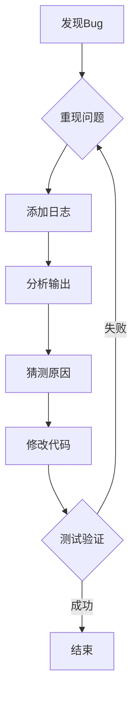

## 引言：我们与“午夜幽灵”的漫长战争

你好，我是果叔。

每一个在代码世界里跋涉的人，都曾与一个名为“Bug”的午夜幽灵共舞。它时而是一个愚蠢的拼写错误，让你耗费一个下午；时而是一个深藏在并发逻辑中的竞态条件，让你在生产环境的炮火中煎熬数日。调试，这门手艺，既是程序员的成人礼，也是我们生产力最大的“时间黑洞”。

我们习惯了`console.log`大法，习惯了在断点的迷宫里穿梭，习惯了在 Stack Overflow 的汪洋中寻找答案。这是一种古典的、手工作坊式的浪漫，但作为效率至上主义者，我必须指出：**这种浪漫，正在变得极度低效。**

今天，我想聊聊一个范式转移（paradigm shift）——如何利用 Claude Code，将调试从一种充满玄学的艺术，彻底转变为一门精准、高效的科学。这不仅仅是“让AI帮你找Bug”，而是重构你的整个问题解决框架，构建一道无法被轻易击穿的代码质量防线。

## 工欲善其事：如何在国内优雅地使用 Claude Code？

在我们深入探讨“术”的层面之前，必须先解决“器”的问题。很多国内的开发者朋友向我抱怨，想用上 Claude 这样的顶尖AI工具，却面临着重重阻碍：

* **账号封禁之痛**：投入生产力工具，却时刻担心账号被封禁，所有的 workflow 和习惯都可能一夜归零。
* **支付渠道之困**：虚拟信用卡、海外支付流程繁琐，甚至会遇到“野卡跑路”的窘境，资金和时间都打了水漂。
* **服务限制之忧**：依赖的服务突然限制国内访问，生产力瞬间“卡脖子”。

这些问题，本质上是基础设施的缺失，极大地消耗了我们宝贵的精力。作为一名独立开发者和顾问，我深知稳定、可靠的工具链是创造力的基石。

经过一番调研和试用，我找到了一个相当不错的解决方案：**Yoretea Claude Code ([code.yoretea.com](https://code.yoretea.com))**。


它精准地解决了上述所有痛点：

* **国内直连，无需配置**：专线优化，告别网络不稳和高延迟，让你享受毫秒级的响应。
* **安全可靠，官方同步**：完全基于官方 Claude API，模型版本实时同步，第一时间体验最新、最强的代码模型能力。
* **支付宝便捷支付**：无需海外信用卡，账单清晰，安全可靠。
* **灵活的拼车与独享方案**：无论是个人开发者还是团队协作，都能找到高性价比的方案。


坦白说，这为国内开发者扫清了使用世界顶级AI编码工具的最后一道障碍。

为了让我的读者能更顺畅地体验到这场效率革命，我特地为大家争取到了专属福利：

> **果叔专属 8 折优惠码：`GUOSHU`**

在 `code.yoretea.com` 订阅时输入，即可享受折扣。我推荐从 “Max 拼车套餐” 开始，Opus 模型的强大能力，绝对物超所值。

解决了工具的问题，现在，让我们正式进入战场。

## 调试的两种范式：古典手工作坊 vs. AI工业革命

在引入 AI 之前，我们的调试流程更像是一场侦探游戏，充满了直觉和偶然。

### 古典调试流程的痛点



**🔑 关键痛点 take-away**：

- 🕐 **时间成本极高**：这是一个发散性的、无底洞式的探索过程。
    
- 🧩 **认知负荷巨大**：人脑需要同时加载业务逻辑、代码结构、运行状态等多层信息。
    
- 🔍 **严重依赖经验**：新手和专家在定位问题上的效率天差地别。
    
- 🎯 **盲人摸象**：往往只能看到问题的局部，难以获得系统性视图。
    

### Claude Code 智能调试的降维打击

Code snippet

```
graph TD
    A[发现Bug] --> B[描述问题<br>(上下文+错误信息)];
    B --> C[AI深度分析];
    C --> D[获得解决方案];
    D --> E[验证修复];
    E --> F[结束];
```

**核心优势：**

- ⚡ **秒级定位**：AI能瞬间扫描整个上下文，交叉验证，精准定位问题根源。
    
- 🧠 **超越人类的深度理解**：它能理解你的代码意图（context），而不仅仅是语法。
    
- 🎯 **多维诊断**：同时从语法、逻辑、性能、安全、最佳实践等多个维度进行“会诊”。
    
- 💡 **提供“最优解”**：不仅告诉你哪里错了，还会给出符合现代工程标准的高质量修复方案。
    
- 📚 **永不疲倦的专家**：它整合了全球顶尖开发者的知识，是你 24/7 在线的架构师。
    

## Claude Code 调试功能详解：从入门到精通

下面，我将通过一系列实战场景，展示 Claude Code 如何在调试的各个层面发挥作用。

### 1. 错误分析和诊断：基础却致命

#### 语法错误快速修复

这是最基础的，也是 AI 最擅长的。别小看它，一个遗漏的括号可能就会浪费你半小时。

Bash

````
# 场景：JavaScript语法错误
claude """
这段代码报错了，帮我修复：

```javascript
function calculateTotal(items) {
    let total = 0;
    for (let i = 0; i < items.length; i++ {
        if (items[i].price > 0) {
            total += items[i].price * items[i].quantity;
        }
    }
    return total;
}
````

错误信息：

SyntaxError: Unexpected token '{'

"""

# Claude会立即识别：

# 1. for循环中缺少闭合括号：i < items.length; i++)

# 2. 提供修复后的完整代码

# 3. 解释错误原因，并提醒你这是常见的“手误”，建议配置Linter。

````

#### TypeScript类型错误解决

当项目变得复杂，TypeScript 的类型错误会像瘟疫一样蔓延。AI 在这里的价值是系统性地解决问题。

```bash
claude """
TypeScript编译失败，请帮我系统性地解决这些类型问题。

错误信息：
- Argument of type 'string' is not assignable to parameter of type 'number'
- Property 'id' does not exist on type '{}'
- Cannot find name 'UserData'

涉及的代码文件：
- src/services/userService.ts
- src/components/UserForm.tsx
- src/types/user.ts
"""

# 果叔点评：
# 传统做法是逐个修复，容易遗漏。
# Claude会：
# 1. 分析所有相关文件的依赖关系。
# 2. 推断出缺失的 `UserData` 类型定义应该是什么样的。
# 3. 提供完整的类型定义文件和所有需要修改的代码片段。
# 4. 给出关于类型收窄和泛型使用的最佳实践建议。
````

### 2. 逻辑错误深度分析：AI的真正价值所在

这是人脑最容易出错的地方，也是 AI 开始展现其“智慧”的地方。

#### 算法逻辑Bug

Bash

````
claude """
这个快速排序函数有Bug，对于包含重复元素的数组，结果不正确。

```javascript
function quickSort(arr) {
    if (arr.length <= 1) return arr;
    
    const pivot = arr[0];
    const left = [];
    const right = [];
    
    for (let i = 1; i < arr.length; i++) {
        if (arr[i] < pivot) {
            left.push(arr[i]);
        } else {
            right.push(arr[i]);
        }
    }
    
    return quickSort(left).concat(pivot).concat(quickSort(right));
}

// 测试：
console.log(quickSort([3, 1, 4, 1, 5, 9, 2, 6]));
// 期望：[1, 1, 2, 3, 4, 5, 6, 9]
// 实际：[1, 2, 1, 3, 4, 5, 6, 9] (对于重复的1处理错误)
"""

# 果叔点评：
# 这是一个经典的算法陷阱，人脑需要回忆算法细节。
# Claude会：
# 1. 立即识别出问题在于等于 pivot 的元素被错误地全部分到了 right 数组。
# 2. 解释这会破坏排序的稳定性，并可能在特定数据下导致性能问题。
# 3. 提供多种修复方案，例如经典的“三路快排”分区法，并解释其优劣。
# 4. 提醒边界条件和潜在的栈溢出风险。
````

#### React状态管理问题

前端开发中，状态管理是 Bug 的重灾区。

Bash

````
claude """
这个React组件的状态更新有问题，调用addUser后页面不刷新。

```jsx
function UserList() {
    const [users, setUsers] = useState([]);
    
    const addUser = (newUser) => {
        users.push(newUser); // 直接修改 state
        setUsers(users); // 传入的是同一个引用
    };

    return (
        <div>
            <button onClick={() => addUser({id: 3, name: 'Charlie'})}>Add User</button>
            {users.map(user => <div key={user.id}>{user.name}</div>)}
        </div>
    );
}
````

"""

# 果叔点评：

# 这是 React 的核心理念问题——状态的不可变性（Immutability）。

# Claude会：

# 1. 精准指出问题在于直接修改了 `state` (mutation)，违反了React的原则。

# 2. 解释React的diff算法依赖于引用的变化来决定是否重渲染。

# 3. 提供正确的、不可变更新方式： `setUsers(prevUsers => [...prevUsers, newUser]);`

# 4. 进一步建议将相关逻辑用 `useCallback` 包裹以优化性能。

````

### 3. 性能问题诊断：从“能用”到“好用”

代码能跑通只是第一步，性能才是决定用户体验的生命线。

#### React性能瓶颈

```bash
claude """
这个组件在输入时非常卡顿，帮我分析并优化性能。

```jsx
function ProductList({ products, category, priceRange }) {
    
    // 每次渲染都会重新计算，性能杀手
    const filteredProducts = products.filter(product => {
        console.log('Filtering...'); // 会被频繁打印
        return product.category === category &&
               product.price >= priceRange.min &&
               product.price <= priceRange.max;
    });

    return (
        <div>
            {filteredProducts.map(product => (
                <ProductCard 
                    key={product.id} 
                    product={product}
                    // 内联函数导致子组件不必要的重渲染
                    onAddToCart={() => updateCart(product)}
                />
            ))}
        </div>
    );
}
````

"""

# 果叔点评：

# 这是一个典型的 React 性能优化案例，涉及计算昂贵和不必要的重渲染。

# Claude会：

# 1. 识别出每次渲染都会执行昂贵的 `filter` 操作。

# 2. 指出 `onAddToCart` 的内联箭头函数会在每次渲染时创建新函数，导致 `ProductCard` 即使 `props` 未变也会重渲染。

# 3. 提供完整的优化方案：使用 `useMemo` 缓存 `filteredProducts` 的计算结果，使用 `useCallback` 缓存 `onAddToCart` 函数。

# 4. 如果 `products` 列表非常大，还会建议引入虚拟滚动（Virtual Scrolling）方案。

````

### 4. 内存泄漏和资源管理：沉默的系统杀手

内存泄漏是最隐蔽、最难排查的 Bug 之一。

#### React内存泄漏

```bash
claude """
应用切换路由后，浏览器内存占用没有下降，怀疑有内存泄漏。

```jsx
function ChatRoom({ roomId }) {
    useEffect(() => {
        const socket = io(`/room/${roomId}`);
        
        socket.on('message', (message) => {
            // ... update state
        });
        
        const intervalId = setInterval(() => {
            socket.emit('heartbeat');
        }, 30000);
        
        // 问题：组件卸载时，这些监听和定时器没有被清理
    }, [roomId]);

    return (/* ... */);
}
````

"""

# 果叔点评：

# 这是 `useEffect` 的经典误用。忘记返回一个清理函数是导致内存泄漏的常见原因。

# Claude会：

# 1. 明确指出 `useEffect` 缺少清理函数（cleanup function）。

# 2. 解释当组件卸载（unmount）时，事件监听和定时器依然存在于内存中，造成泄漏。

# 3. 提供完整的修复代码，在 `useEffect` 中返回一个函数，并在该函数中断开 socket 连接、移除监听器、清除定时器。

JavaScript

```
useEffect(() => {
    // ... setup logic ...

    return () => {
        socket.disconnect();
        socket.off('message');
        clearInterval(intervalId);
    };
}, [roomId]);
```

````

## 高级调试技巧：从 Coder 到 Architect

掌握了以上技巧，你已经是一个高效的 Bug 修复者。但要成为架构师，你需要从系统层面思考问题。

### 1. 竞态条件 (Race Condition)：异步世界的幽灵

这是高并发和复杂前端应用中最棘手的 Bug 之一。

```bash
claude """
帮我分析这个React组件的竞态条件问题。快速切换用户ID时，有时会显示旧的用户数据。

```javascript
function UserProfile({ userId }) {
    const [user, setUser] = useState(null);

    useEffect(() => {
        fetchUser(userId).then(userData => {
            setUser(userData);
        });
    }, [userId]);

    // ... render user
}
````

"""

# 果叔点评：

# 这是一个经典的竞态条件。如果请求1（userId=A）比请求2（userId=B）晚返回，那么页面最终会错误地显示用户A的数据。

# Claude会：

# 1. 清晰地解释竞态条件发生的原因。

# 2. 提供多种行业标准的解决方案：

# a. **请求清理法**：在 `useEffect` 的清理函数中设置一个标志位，或者使用 `AbortController` 来取消过期的请求。这是最优雅的方案。

# b. **请求ID校验法**：在发起请求时生成一个唯一ID，在收到响应时校验ID是否为最新。

# 3. 给出可以直接使用的、修复后的代码。

````

## 实战案例：电商网站高并发订单创建失败

理论说再多，不如一场实战来得真切。这是一个我曾经咨询过的真实案例，稍作简化。

```bash
claude """
帮我调试这个复杂的生产Bug：

**问题描述：**
电商网站的订单创建功能在高并发时有约15%的失败率。

**症状：**
- 失败时用户收到"系统错误"。
- 数据库中没有生成订单。
- **但商品的库存却被扣减了！**

**核心代码 (Node.js + Sequelize)：**
```javascript
async function createOrder(orderData) {
    const transaction = await db.transaction();
    
    try {
        // 1. 验证库存
        const product = await Product.findByPk(orderData.productId, { transaction });
        if (product.stock < orderData.quantity) {
            throw new Error('库存不足');
        }
        
        // 2. 扣减库存
        await product.decrement('stock', { by: orderData.quantity, transaction });
        
        // 3. 创建订单
        const order = await Order.create({ ... }, { transaction });
        
        // 4. 调用外部支付服务 (可能很慢)
        const paymentResult = await paymentService.createPayment({ ... });
        if (!paymentResult.success) {
            throw new Error('支付创建失败');
        }
        
        await transaction.commit();
        return order;
        
    } catch (error) {
        await transaction.rollback();
        throw error;
    }
}
````

"""

```

### 果叔复盘 & Claude 的分析

这是一个典型的分布式系统问题，单纯的代码调试无法解决。你需要系统性的视角。

Claude 会给出一份架构师级别的分析报告：

1.  **根因分析 (Root Cause Analysis)**：
    * **库存扣减的竞态条件**：在高并发下，多个请求可能同时通过了库存验证，导致超卖。`findByPk` 后面需要加锁。
    * **事务与外部调用耦合**：在数据库事务中调用一个缓慢的、不稳定的外部 `paymentService` 是致命的。如果支付服务超时，整个事务会长时间挂起，占用数据库连接，最终导致事务失败回滚。但此时，库存扣减的逻辑可能已经执行。
    * **原子性被破坏**：理想中，“扣库存”和“创订单”应该是一个原子操作，但由于外部调用的存在和可能的失败，这个原子性被打破了。

2.  **解决方案 (Solution Architecture)**：
    * **引入悲观锁**：在查询产品库存时，使用 `SELECT ... FOR UPDATE` (`lock: transaction.LOCK.UPDATE`) 来锁定该行，确保在事务完成前其他请求无法修改。
    * **事务解耦与异步化**：将订单创建流程重构。
        1.  **同步核心事务**：在一个极短的数据库事务内，只做三件事：锁定库存、创建订单（初始状态为 `pending_payment`）、扣减库存。然后立即提交事务。
        2.  **异步调用支付**：事务成功后，再异步地调用支付服务。
        3.  **状态更新**：根据支付服务的返回结果，再通过另一个服务或请求来更新订单的状态为 `paid` 或 `failed`。
    * **引入消息队列 (Message Queue)**：更健壮的方案是，在核心事务成功后，向 RabbitMQ 或 Kafka 发送一个“创建支付”的消息，由专门的消费者服务来处理与支付网关的交互，实现完全的解耦和失败重试。

这已经超越了“调试”，进入了“系统设计”的范畴。而这，正是顶级 AI Code Assistant 能带给你的最大价值——**提升你的架构思维**。

## 总结：告别救火队员，成为系统架构师

通过这篇文章，我希望你看到的不仅仅是 Claude Code 的强大，更是一种工作方式的进化。

| 调试场景 | 传统方式 | Claude Code | 效率提升 |
|----------|----------|-------------|----------|
| 语法错误 | 5-15分钟 | 30秒 | 10-30倍 |
| 逻辑错误 | 1-4小时 | 5-15分钟 | 4-48倍 |
| 性能问题 | 4-8小时 | 30-60分钟 | 4-16倍 |
| 内存泄漏 | 1-3天 | 1-3小时 | 8-72倍 |
| 并发问题 | 1-5天 | 2-6小时 | 4-60倍 |

我们正在从一个“救火队员”的角色，转变为一个“系统消防设计师”。我们的工作重心，将从被动地修复 Bug，转向主动地设计出更健壮、更具弹性的系统。

AI 不会取代开发者，但它会重新定义“优秀开发者”。掌握并善用 AI 的人，将获得碾压性的生产力优势。他们将有更多的时间去思考架构、优化体验、创造价值，而不是在 `console.log` 的海洋里挣扎。

记住，**最好的 Bug 是那个从未被写出来的 Bug**。让 AI 成为你的副驾驶，帮助你把更多精力投入到创造性的设计中去。

---

*觉得果叔的分析有启发？点个赞，转发给更多在 Bug 海中挣扎的朋友吧！*

*关注我，与你一同探索 AI、出海与数字营销的无限可能。*

🌌 **代码的终极形态，是思想的完美表达。AI 正在帮助我们无限接近这个理想。**
