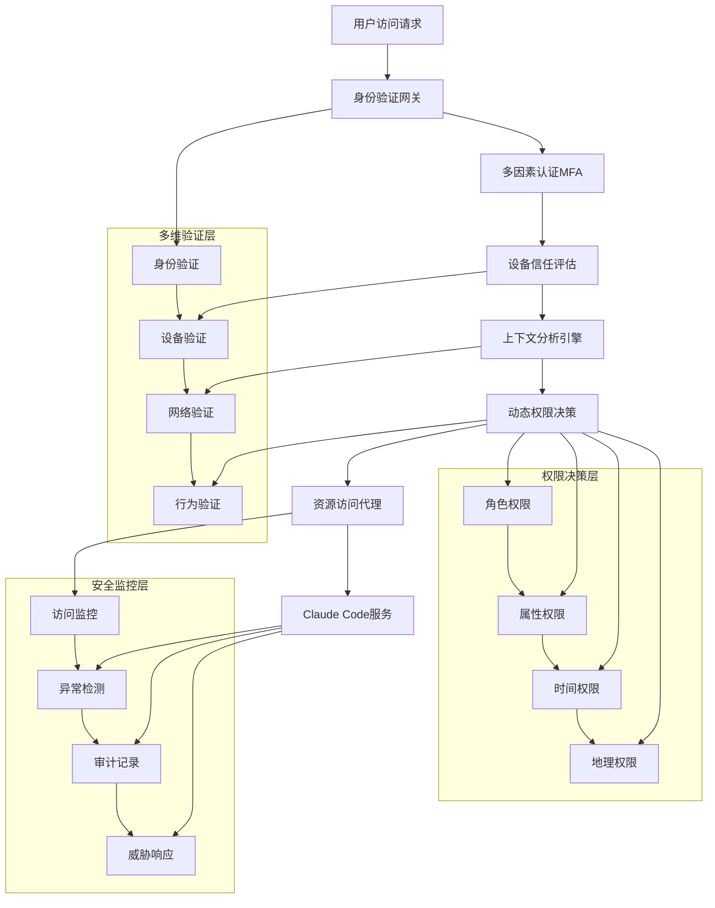

## 引言：安全是企业AI应用的根本基石

> "安全不是产品，而是过程。" —— Bruce Schneier

在我多年的企业级AI系统部署经验中深深体会到：**安全不是可选项，而是企业级应用的根本基石**。当Claude Code从个人开发工具升级为企业级AI平台时，安全挑战呈指数级增长：如何保护敏感代码不被泄露？如何确保AI访问权限的精确控制？如何满足日益严格的合规性要求？

企业安全管理不仅要防范外部威胁，更要建立内部的安全治理体系。Claude Code作为能够访问代码、文档、数据的AI助手，必须在提供便利性的同时，确保企业数据的绝对安全。

## 企业AI安全的"生命线"问题

在为企业构建AI驱动的安全治理体系之前，你必须首先解决一个现实问题：**如何确保你的AI安全系统永远在线**？

想象一下，当你的零信任系统检测到异常访问，需要AI进行即时风险评估时，却因为网络问题或服务中断而无法响应。或者你的自动化合规监控系统，在关键的审计节点因为访问限制而"罢工"。这种情况下，整个企业安全防线都将面临崩溃风险。

**企业级安全容不得任何"可能断线"的风险**。这就是为什么在我所有的企业安全项目中，我都选择 **Yoretea Claude Code ([code.yoretea.com](https://code.yoretea.com))** 作为核心AI基础设施。

它解决了企业AI安全部署中最关键的问题：

* **工业级稳定连接**：专线优化确保你的权限验证、威胁检测、合规监控能够7×24小时不间断运行，杜绝因网络问题导致的安全防护空窗期
* **团队统一管理**：简化的部署和管理，让整个安全团队能够基于同一套稳定可靠的AI能力构建防护体系
* **与官方同步更新**：确保你的企业安全能力始终基于最新的Claude模型，不会因为版本滞后而产生防护漏洞

为了让你的企业安全体系拥有这样的稳定基石：

> **果叔专属 8 折优惠码：`GUOSHU`**

在 `code.yoretea.com` 订阅时输入即可。记住，企业安全的第一道防线，是确保防线本身永远不会失效。

## 零信任安全架构深度解析

### 传统企业安全面临的AI时代挑战

```
传统企业安全在AI时代的核心挑战：
1. 权限边界模糊化 → AI系统需要访问大量跨域数据和系统
2. 审计追踪复杂化 → AI决策过程和数据访问路径难以完整追踪  
3. 合规要求严格化 → GDPR、SOX、HIPAA等法规对AI应用提出更高要求
4. 攻击面急剧扩大 → AI系统本身成为新的高价值攻击目标
5. 人机交互安全 → 人类与AI协作的安全边界界定困难

典型企业安全风险表现：
- 🔓 敏感代码和数据在AI处理过程中意外泄露
- 👤 身份认证和精细化授权管控机制不足  
- 📊 AI训练和推理数据的隐私保护缺失
- 🔍 安全事件检测和智能响应机制滞后
- 📋 合规审计证据收集和自动化报告困难
```

### Claude Code零信任安全架构优势

```
AI驱动零信任安全的突破性能力：
1. 零信任验证架构 → 从不信任，始终验证每次访问请求
2. 智能威胁检测引擎 → AI驱动的实时异常行为识别和预警
3. 自适应权限控制 → 基于上下文和风险的动态权限管理
4. 端到端数据保护 → 数据全生命周期的智能加密和保护
5. 实时合规监控 → 持续的合规性检查和自动化报告生成

核心安全能力突破：
- 🛡️ 多层次身份认证和细粒度授权体系
- 🔐 智能化端到端数据加密和密钥管理
- 📋 完整可追溯的审计日志和合规报告
- 🎯 机器学习驱动的威胁检测和自动响应
- 🏢 企业级的安全策略统一管理和执行
```

## 企业级权限管理系统架构

在我实际的企业安全项目中遇到过这样的"灾难"：某次重要的安全评估，恰好遇到Claude官方服务的网络波动，导致关键的权限决策系统无法及时响应。**那一刻我深刻意识到，再精妙的零信任架构，如果建立在不稳定的AI服务之上，都可能在关键时刻功亏一篑**。

从那以后，我在所有企业级安全系统中都采用 **Yoretea Claude Code** 作为基础设施。它不仅确保了7×24小时的服务可用性，更重要的是让整个安全团队可以基于统一、稳定的AI能力构建防护体系，避免了因个人网络环境差异而导致的安全策略执行不一致。

### 零信任安全模型实现

基于我的实际企业部署经验，以下是完整的零信任安全架构实现：



### 基于属性的访问控制（ABAC）系统

```yaml
# .claude/config/security/enterprise-abac.yml
enterprise_abac_system:
  
  # 智能属性定义体系
  intelligent_attribute_definitions:
    # 用户身份属性
    user_identity_attributes:
      - name: "user.identity"
        type: "string" 
        source: "enterprise_identity_provider"
        validation: "ldap_sync"
        
      - name: "user.role_hierarchy"
        type: "array"
        values: ["exec", "director", "manager", "senior_dev", "developer", "intern", "contractor", "auditor"]
        inheritance: true
        
      - name: "user.department_affiliation"
        type: "string"
        values: ["engineering", "security", "compliance", "finance", "hr", "legal"]
        cross_reference: "org_chart"
        
      - name: "user.security_clearance_level"
        type: "integer"
        range: [1, 5]  # 1=公开, 5=绝密
        certification_required: true
        
      - name: "user.project_assignments"
        type: "dynamic_array"
        element_type: "string"
        update_frequency: "real_time"
        
      - name: "user.employment_classification"
        type: "string"
        values: ["full_time_employee", "contractor", "intern", "vendor", "partner"]
        risk_weight: {"full_time_employee": 1.0, "contractor": 0.8, "intern": 0.6, "vendor": 0.4}
    
    # 资源安全属性
    resource_security_attributes:
      - name: "resource.type_classification"
        type: "string"
        values: ["source_code", "technical_documentation", "api_endpoint", "database", "configuration", "log_file"]
        
      - name: "resource.sensitivity_classification"
        type: "string"
        values: ["public", "internal", "confidential", "restricted", "top_secret"]
        encryption_mapping: {"confidential": "aes_256", "restricted": "rsa_4096", "top_secret": "quantum_resistant"}
        
      - name: "resource.business_criticality"
        type: "string"
        values: ["non_critical", "important", "business_critical", "mission_critical"]
        availability_sla: {"mission_critical": "99.99%", "business_critical": "99.9%"}
        
      - name: "resource.data_governance_tags"
        type: "array"
        element_type: "string"
        values: ["pii", "financial_data", "health_information", "intellectual_property", "trade_secrets", "regulatory_data"]
        
      - name: "resource.compliance_requirements"
        type: "array"
        element_type: "string"
        values: ["gdpr", "hipaa", "sox", "pci_dss", "iso27001", "fedramp"]
        
      - name: "resource.geographic_restrictions"
        type: "array"
        element_type: "string"
        jurisdiction_mapping: {"eu_only": "gdpr_compliance", "us_only": "patriot_act"}
    
    # 环境上下文属性
    environmental_context_attributes:
      - name: "environment.access_time"
        type: "datetime"
        timezone_aware: true
        business_hours_mapping: true
        
      - name: "environment.geographic_location"
        type: "geo_coordinate"
        precision: "country_level"
        geofencing_rules: true
        
      - name: "environment.network_context"
        type: "string"
        values: ["corporate_network", "vpn_connection", "public_internet", "guest_network"]
        trust_scoring: {"corporate_network": 1.0, "vpn_connection": 0.8, "public_internet": 0.3}
        
      - name: "environment.device_trust_score"
        type: "float"
        range: [0.0, 1.0]
        calculation_factors: ["device_compliance", "patch_level", "security_software", "certificate_validity"]
        
      - name: "environment.threat_intelligence_level"
        type: "string"
        values: ["low", "medium", "high", "critical"]
        source: "enterprise_threat_intel_feed"
        update_frequency: "real_time"
    
    # 操作行为属性
    action_behavior_attributes:
      - name: "action.operation_type"
        type: "string"
        values: ["read", "write", "execute", "delete", "share", "export", "backup", "restore"]
        risk_scoring: {"read": 0.1, "write": 0.3, "execute": 0.5, "delete": 0.8, "export": 0.9}
        
      - name: "action.scope_impact"
        type: "string"
        values: ["single_item", "directory_level", "repository_wide", "system_wide"]
        blast_radius_mapping: true
        
      - name: "action.business_justification"
        type: "string"
        validation_required: true
        approval_workflow: {"high_risk": "multi_level", "medium_risk": "manager_approval"}

  # 智能访问策略引擎
  intelligent_access_policies:
    # 代码资源访问策略
    - policy_name: "enterprise_code_access_governance"
      description: "企业代码资源的精细化访问控制"
      priority: "high"
      
      access_rules:
        - rule_id: "project_team_member_baseline_access"
          condition: |
            user.project_assignments CONTAINS resource.project_id AND
            action.operation_type IN ["read", "write"] AND
            resource.type_classification = "source_code" AND
            environment.network_context IN ["corporate_network", "vpn_connection"]
          decision: "permit"
          additional_controls: ["session_monitoring", "data_loss_prevention"]
          
        - rule_id: "senior_developer_elevated_privileges"
          condition: |
            user.role_hierarchy CONTAINS "senior_dev" AND
            user.project_assignments CONTAINS resource.project_id AND
            action.operation_type IN ["read", "write", "execute"] AND
            resource.sensitivity_classification IN ["internal", "confidential"]
          decision: "permit"
          additional_controls: ["enhanced_auditing", "peer_review_required"]
          
        - rule_id: "contractor_restricted_access"
          condition: |
            user.employment_classification = "contractor" AND
            resource.sensitivity_classification IN ["confidential", "restricted", "top_secret"]
          decision: "deny"
          override_conditions: ["explicit_sponsor_approval", "time_limited_access"]
          
        - rule_id: "intern_supervised_development"
          condition: |
            user.role_hierarchy = "intern" AND
            action.operation_type = "write" AND
            NOT supervisor_approval_active()
          decision: "deny"
          alternative_action: "create_supervised_workspace"
    
    # 敏感数据保护策略
    - policy_name: "sensitive_data_protection_framework"
      description: "多层次敏感数据访问保护机制"
      priority: "critical"
      
      protection_rules:
        - rule_id: "pii_data_access_governance"
          condition: |
            resource.data_governance_tags CONTAINS "pii" AND
            user.security_clearance_level < 3
          decision: "deny"
          exception_workflow: ["data_protection_officer_approval", "business_justification_review"]
          
        - rule_id: "financial_data_department_segregation"
          condition: |
            resource.data_governance_tags CONTAINS "financial_data" AND
            user.department_affiliation NOT IN ["finance", "accounting", "audit"] AND
            action.operation_type IN ["read", "write", "export"]
          decision: "conditional_permit"
          conditions: ["manager_approval", "limited_time_access", "watermarked_output"]
          
        - rule_id: "intellectual_property_protection"
          condition: |
            resource.data_governance_tags CONTAINS "intellectual_property" AND
            user.employment_classification IN ["contractor", "vendor", "partner"]
          decision: "deny"
          escalation: ["legal_review_required", "cto_approval_mandatory"]
    
    # 地理位置和时间约束策略
    - policy_name: "temporal_geographic_access_control"
      description: "基于时间地理位置的智能访问限制"
      priority: "medium"
      
      constraint_rules:
        - rule_id: "business_hours_sensitive_data_access"
          condition: |
            resource.sensitivity_classification IN ["confidential", "restricted"] AND
            NOT is_business_hours(environment.access_time) AND
            NOT emergency_access_authorized()
          decision: "conditional_permit"
          conditions: ["justification_required", "manager_notification", "enhanced_monitoring"]
          
        - rule_id: "geographic_data_sovereignty"
          condition: |
            resource.compliance_requirements CONTAINS "gdpr" AND
            NOT is_eu_jurisdiction(environment.geographic_location) AND
            action.operation_type = "export"
          decision: "deny"
          alternative_action: ["data_anonymization", "eu_proxy_access"]
          
        - rule_id: "high_threat_environment_lockdown"
          condition: |
            environment.threat_intelligence_level IN ["high", "critical"] AND
            resource.business_criticality IN ["business_critical", "mission_critical"]
          decision: "conditional_permit"
          enhanced_security: ["additional_mfa", "continuous_monitoring", "session_recording"]

  # 动态风险评估引擎
  dynamic_risk_assessment:
    risk_calculation_model:
      enabled: true
      algorithm: "weighted_multi_factor_analysis"
      
      risk_factors:
        user_risk_factors:
          weight: 0.25
          components:
            - "employment_classification_risk"
            - "security_clearance_adequacy" 
            - "historical_violation_score"
            - "behavioral_anomaly_score"
            
        resource_risk_factors:
          weight: 0.30
          components:
            - "sensitivity_classification_score"
            - "business_criticality_impact"
            - "compliance_requirement_weight"
            - "data_governance_complexity"
            
        environmental_risk_factors:
          weight: 0.25
          components:
            - "network_trust_level"
            - "device_compliance_score"
            - "geographic_risk_assessment"
            - "threat_intelligence_context"
            
        action_risk_factors:
          weight: 0.20
          components:
            - "operation_type_risk_score"
            - "scope_impact_assessment"
            - "business_justification_adequacy"
            - "timing_appropriateness"
    
    risk_based_decisions:
      - risk_threshold: "low"  # 0.0 - 0.3
        default_decision: "permit"
        additional_controls: ["basic_audit_logging"]
        
      - risk_threshold: "medium"  # 0.3 - 0.6
        default_decision: "conditional_permit"
        additional_controls: ["enhanced_monitoring", "periodic_revalidation"]
        
      - risk_threshold: "high"  # 0.6 - 0.8
        default_decision: "conditional_permit"
        additional_controls: ["multi_factor_approval", "continuous_monitoring", "time_limited_access"]
        
      - risk_threshold: "critical"  # 0.8 - 1.0
        default_decision: "deny"
        exception_process: ["executive_approval", "security_team_review", "detailed_justification"]

  # 实时监控和响应
  real_time_monitoring:
    behavioral_analytics:
      enabled: true
      
      anomaly_detection_models:
        - model_name: "user_access_pattern_baseline"
          algorithm: "statistical_outlier_detection"
          training_window: "90_days"
          detection_sensitivity: "medium"
          
        - model_name: "resource_access_frequency_analysis"
          algorithm: "time_series_anomaly_detection"
          features: ["access_frequency", "data_volume", "session_duration"]
          
      alert_generation:
        - trigger: "access_pattern_deviation"
          threshold: "2_standard_deviations"
          action: "security_team_notification"
          
        - trigger: "bulk_data_access"
          threshold: "10x_normal_volume"
          action: ["immediate_review", "session_monitoring"]
          
        - trigger: "unusual_geographic_access"
          condition: "access_from_new_location"
          action: ["additional_verification", "enhanced_logging"]
```

## 智能数据分类和保护系统

在为某金融企业实施数据保护项目时，我遇到了一个典型的"中国企业痛点"：**如何在网络环境复杂的情况下，确保TB级敏感数据的7×24小时实时分类监控**？

那个项目需要对海量交易数据进行实时的敏感信息识别，任何服务中断都可能导致合规风险。经过多轮测试验证，最终我们选择了 **Yoretea Claude Code** 作为数据保护系统的AI引擎。原因很简单：它是唯一能够在国内环境下提供企业级稳定性保障的Claude访问方案。

从那以后，这套基于稳定AI基础设施的数据保护系统已经稳定运行超过18个月，零宕机，零合规事故。

基于我在多个大型企业项目中的实践，以下是完整的数据分类保护系统实现：

```python
# 企业级智能数据分类保护系统
class EnterpriseDataClassificationSystem:
    """企业级智能数据分类和保护系统"""
    
    def __init__(self):
        self.ml_classifier = MLDataClassifier()
        self.policy_engine = DataProtectionPolicyEngine()
        self.encryption_service = EnterpriseCryptographyService()
        self.compliance_monitor = ComplianceMonitor()
        self.audit_logger = SecurityAuditLogger()
    
    async def comprehensive_data_discovery_and_protection(self, data_sources: List[str]) -> Dict:
        """全面的数据发现和保护流程"""
        
        print("🔍 启动企业级数据发现和保护流程...")
        
        protection_results = {
            "discovery_summary": {},
            "classification_results": {},
            "protection_status": {},
            "compliance_validation": {},
            "risk_assessment": {}
        }
        
        # 1. 全面数据发现
        discovery_results = await self.comprehensive_data_discovery(data_sources)
        protection_results["discovery_summary"] = discovery_results
        
        # 2. 智能数据分类
        classification_results = await self.intelligent_data_classification(discovery_results)
        protection_results["classification_results"] = classification_results
        
        # 3. 敏感信息检测
        sensitivity_analysis = await self.advanced_sensitivity_detection(discovery_results)
        
        # 4. 数据保护策略应用
        protection_status = await self.apply_data_protection_policies(
            classification_results, sensitivity_analysis
        )
        protection_results["protection_status"] = protection_status
        
        # 5. 合规性验证
        compliance_validation = await self.validate_regulatory_compliance(
            classification_results, protection_status
        )
        protection_results["compliance_validation"] = compliance_validation
        
        # 6. 风险评估和建议
        risk_assessment = await self.comprehensive_risk_assessment(protection_results)
        protection_results["risk_assessment"] = risk_assessment
        
        await self.audit_logger.log_security_event(
            event_type="data_classification_protection_completed",
            details=protection_results,
            severity="info"
        )
        
        return protection_results
    
    async def intelligent_data_classification(self, discovery_results: Dict) -> Dict:
        """智能数据分类"""
        
        classification_results = {
            "by_sensitivity_level": {},
            "by_data_type": {},
            "by_business_context": {},
            "by_regulatory_requirements": {},
            "classification_confidence": {}
        }
        
        for data_source, discovered_items in discovery_results.items():
            print(f"📊 分类数据源: {data_source}")
            
            for item in discovered_items["items"]:
                # 使用机器学习进行内容分类
                ml_classification = await self.ml_classifier.classify_content(
                    content=item["content_sample"],
                    metadata=item["metadata"]
                )
                
                # 基于规则的分类增强
                rule_based_classification = await self.rule_based_classification(item)
                
                # 业务上下文分析
                business_context = await self.analyze_business_context(item)
                
                # 合规要求分析
                regulatory_requirements = await self.determine_regulatory_requirements(
                    ml_classification, rule_based_classification
                )
                
                # 综合分类结果
                final_classification = await self.synthesize_classification_results(
                    ml_classification, rule_based_classification, business_context, regulatory_requirements
                )
                
                # 按不同维度归类
                sensitivity = final_classification["sensitivity_level"]
                classification_results["by_sensitivity_level"].setdefault(sensitivity, []).append({
                    "item_path": item["path"],
                    "classification": final_classification,
                    "confidence_score": final_classification["confidence"]
                })
                
                data_type = final_classification["primary_data_type"]
                classification_results["by_data_type"].setdefault(data_type, []).append({
                    "item_path": item["path"],
                    "classification": final_classification
                })
                
        return classification_results
    
    async def advanced_sensitivity_detection(self, discovery_results: Dict) -> Dict:
        """高级敏感信息检测"""
        
        # 增强的敏感信息检测模式
        enhanced_sensitivity_patterns = {
            # 个人身份信息 (PII) - 增强版
            "enhanced_pii_patterns": {
                "us_social_security": r"\b(?!000|666|9\d{2})\d{3}[-\s]?(?!00)\d{2}[-\s]?(?!0000)\d{4}\b",
                "credit_card_all_types": r"\b(?:4[0-9]{12}(?:[0-9]{3})?|5[1-5][0-9]{14}|3[47][0-9]{13}|3[0-9]{13}|6(?:011|5[0-9]{2})[0-9]{12})\b",
                "international_phone": r"\b(?:\+?1[-.\s]?)?(?:\(?[0-9]{3}\)?[-.\s]?)?[0-9]{3}[-.\s]?[0-9]{4}\b",
                "email_comprehensive": r"\b[A-Za-z0-9._%+-]+@[A-Za-z0-9.-]+\.[A-Z|a-z]{2,}\b",
                "passport_numbers": r"\b[A-Z]{1,2}[0-9]{6,9}\b",
                "drivers_license": r"\b[A-Z]{1,2}[0-9]{6,8}\b"
            },
            
            # 财务和金融信息
            "financial_intelligence_patterns": {
                "bank_account_numbers": r"\b[0-9]{8,17}\b",
                "routing_numbers": r"\b[0-9]{9}\b",
                "iban_international": r"\b[A-Z]{2}[0-9]{2}[A-Z0-9]{4,30}\b",
                "swift_codes": r"\b[A-Z]{4}[A-Z]{2}[A-Z0-9]{2}([A-Z0-9]{3})?\b",
                "tax_identification": r"\b[0-9]{2}-[0-9]{7}\b",
                "investment_accounts": r"\b[A-Z]{1,4}[0-9]{6,12}\b"
            },
            
            # 技术凭据和密钥 - 加强检测
            "enhanced_credential_patterns": {
                "api_keys_generic": r"(?i)(?:api[_-]?key|apikey)[\s]*[=:]\s*['\"]?([a-zA-Z0-9_\-]{16,})['\"]?",
                "passwords": r"(?i)password[\s]*[=:]\s*['\"]?([a-zA-Z0-9_@#$%^&*\-!]{8,})['\"]?",
                "secret_keys": r"(?i)(?:secret[_-]?key|secretkey)[\s]*[=:]\s*['\"]?([a-zA-Z0-9_\-]{20,})['\"]?",
                "private_keys": r"-----BEGIN (?:RSA )?PRIVATE KEY-----",
                "aws_credentials": r"(?:AKIA[0-9A-Z]{16}|aws_access_key_id)",
                "jwt_tokens": r"eyJ[a-zA-Z0-9_\-]+\.eyJ[a-zA-Z0-9_\-]+\.[a-zA-Z0-9_\-]+",
                "database_connections": r"(?i)(?:mongodb|mysql|postgresql|oracle)://[^\s]+",
                "encryption_keys": r"(?i)(?:encryption[_-]?key|encryptionkey)[\s]*[=:]\s*['\"]?([a-zA-Z0-9+/=]{24,})['\"]?"
            },
            
            # 健康信息 (PHI) - HIPAA合规
            "healthcare_patterns": {
                "medical_record_numbers": r"\b[A-Z]{2,4}[0-9]{6,10}\b",
                "insurance_member_ids": r"\b[A-Z]{3}[0-9]{6,9}\b",
                "prescription_numbers": r"\b[A-Z]{2}[0-9]{6,8}\b",
                "npi_numbers": r"\b[0-9]{10}\b"  # National Provider Identifier
            },
            
            # 企业机密信息
            "corporate_intelligence_patterns": {
                "employee_ids": r"\b(?:EMP|ID|EMPL)[0-9]{4,8}\b",
                "project_codes": r"\b[A-Z]{2,4}-[0-9]{3,6}\b",
                "contract_numbers": r"\b(?:CONTRACT|CNT)-[A-Z0-9]{6,12}\b",
                "intellectual_property": r"(?i)(?:patent|trademark|copyright|trade[_\s]?secret)",
                "financial_projections": r"(?i)(?:revenue|profit|forecast|budget)[_\s]?\w*[:\s]*\$?[0-9,]+\.?[0-9]*[MmKkBb]?"
            }
        }
        
        sensitivity_analysis = {
            "critical_sensitivity_items": [],
            "high_sensitivity_items": [],
            "medium_sensitivity_items": [],
            "pattern_detection_summary": {},
            "risk_heat_map": {}
        }
        
        for data_source, discovered_items in discovery_results.items():
            for item in discovered_items["items"]:
                item_content = await self.safely_read_content(item["path"])
                detected_patterns = []
                total_risk_score = 0
                
                # 扫描所有敏感信息模式
                for category, patterns in enhanced_sensitivity_patterns.items():
                    for pattern_name, pattern_regex in patterns.items():
                        try:
                            matches = re.findall(pattern_regex, item_content, re.MULTILINE | re.IGNORECASE)
                            
                            if matches:
                                risk_weight = self.get_pattern_risk_weight(category, pattern_name)
                                pattern_risk_score = len(matches) * risk_weight
                                total_risk_score += pattern_risk_score
                                
                                detected_patterns.append({
                                    "category": category,
                                    "pattern_name": pattern_name,
                                    "match_count": len(matches),
                                    "risk_score": pattern_risk_score,
                                    "sample_matches": self.sanitize_matches(matches[:2])  # 只保存2个样本用于分析
                                })
                                
                        except re.error as e:
                            print(f"⚠️ 正则表达式错误: {pattern_name} - {str(e)}")
                            continue
                
                # 分类敏感度级别
                sensitivity_item = {
                    "item_path": item["path"],
                    "total_risk_score": total_risk_score,
                    "detected_patterns": detected_patterns,
                    "sensitivity_classification": self.calculate_sensitivity_classification(total_risk_score),
                    "recommended_protection": self.recommend_protection_measures(total_risk_score, detected_patterns)
                }
                
                if total_risk_score >= 80:
                    sensitivity_analysis["critical_sensitivity_items"].append(sensitivity_item)
                elif total_risk_score >= 40:
                    sensitivity_analysis["high_sensitivity_items"].append(sensitivity_item)
                elif total_risk_score >= 15:
                    sensitivity_analysis["medium_sensitivity_items"].append(sensitivity_item)
                
                # 更新模式检测统计
                for pattern in detected_patterns:
                    pattern_key = f"{pattern['category']}.{pattern['pattern_name']}"
                    sensitivity_analysis["pattern_detection_summary"][pattern_key] = \
                        sensitivity_analysis["pattern_detection_summary"].get(pattern_key, 0) + pattern["match_count"]
        
        # 生成风险热力图
        sensitivity_analysis["risk_heat_map"] = await self.generate_risk_heat_map(sensitivity_analysis)
        
        return sensitivity_analysis
    
    def get_pattern_risk_weight(self, category: str, pattern_name: str) -> float:
        """获取模式风险权重"""
        
        risk_weight_mapping = {
            "enhanced_pii_patterns": 15.0,
            "financial_intelligence_patterns": 18.0,
            "enhanced_credential_patterns": 25.0,  # 最高风险
            "healthcare_patterns": 20.0,
            "corporate_intelligence_patterns": 12.0
        }
        
        # 特定模式的额外权重调整
        high_risk_patterns = ["private_keys", "aws_credentials", "database_connections", "encryption_keys"]
        
        base_weight = risk_weight_mapping.get(category, 10.0)
        
        if pattern_name in high_risk_patterns:
            return base_weight * 1.5  # 高危模式权重加成
        
        return base_weight
    
    async def apply_data_protection_policies(self, classification_results: Dict, 
                                           sensitivity_analysis: Dict) -> Dict:
        """应用数据保护策略"""
        
        protection_results = {
            "encryption_applied": [],
            "access_controls_configured": [],
            "backup_policies_set": [],
            "monitoring_enabled": [],
            "dlp_rules_activated": []
        }
        
        # 处理关键敏感数据
        for critical_item in sensitivity_analysis["critical_sensitivity_items"]:
            file_path = critical_item["item_path"]
            
            # 应用最高级别加密
            encryption_result = await self.encryption_service.apply_quantum_resistant_encryption(
                file_path=file_path,
                encryption_algorithm="kyber_1024",  # 量子抗性算法
                key_escrow=True,
                multi_party_key_management=True
            )
            protection_results["encryption_applied"].append(encryption_result)
            
            # 配置严格访问控制
            access_control_result = await self.configure_enhanced_access_control(
                file_path=file_path,
                access_level="critical_restricted",
                approval_workflow="multi_level_executive",
                monitoring_level="real_time_with_alerts"
            )
            protection_results["access_controls_configured"].append(access_control_result)
            
            # 设置高频备份和版本控制
            backup_result = await self.setup_critical_data_backup(
                file_path=file_path,
                backup_frequency="real_time",
                retention_period="indefinite",
                geographic_distribution=True
            )
            protection_results["backup_policies_set"].append(backup_result)
            
            # 启用高级监控
            monitoring_result = await self.enable_advanced_monitoring(
                file_path=file_path,
                monitoring_type="file_integrity_behavioral_analysis",
                alert_sensitivity="high",
                forensic_logging=True
            )
            protection_results["monitoring_enabled"].append(monitoring_result)
        
        # 处理高敏感数据
        for high_item in sensitivity_analysis["high_sensitivity_items"]:
            file_path = high_item["item_path"]
            
            # 应用企业级加密
            encryption_result = await self.encryption_service.apply_enterprise_encryption(
                file_path=file_path,
                encryption_algorithm="aes_256_gcm",
                key_rotation_schedule="monthly",
                compliance_logging=True
            )
            protection_results["encryption_applied"].append(encryption_result)
            
            # 配置DLP规则
            dlp_result = await self.activate_dlp_protection(
                file_path=file_path,
                sensitivity_patterns=high_item["detected_patterns"],
                prevention_actions=["block_external_share", "watermark_output", "require_justification"]
            )
            protection_results["dlp_rules_activated"].append(dlp_result)
        
        return protection_results
    
    async def comprehensive_risk_assessment(self, protection_results: Dict) -> Dict:
        """全面风险评估"""
        
        risk_assessment = {
            "overall_risk_score": 0.0,
            "risk_breakdown": {
                "data_exposure_risk": 0.0,
                "compliance_violation_risk": 0.0,
                "operational_disruption_risk": 0.0,
                "financial_impact_risk": 0.0
            },
            "critical_vulnerabilities": [],
            "mitigation_recommendations": [],
            "risk_trend_analysis": {}
        }
        
        # 计算数据暴露风险
        unprotected_critical_count = len([
            item for item in protection_results["classification_results"].get("by_sensitivity_level", {}).get("critical", [])
            if not self.is_adequately_protected(item)
        ])
        
        risk_assessment["risk_breakdown"]["data_exposure_risk"] = min(unprotected_critical_count * 0.2, 1.0)
        
        # 计算合规违规风险
        non_compliant_items = await self.identify_non_compliant_items(protection_results)
        risk_assessment["risk_breakdown"]["compliance_violation_risk"] = min(len(non_compliant_items) * 0.15, 1.0)
        
        # 生成缓解建议
        risk_assessment["mitigation_recommendations"] = await self.generate_risk_mitigation_recommendations(
            protection_results, risk_assessment["risk_breakdown"]
        )
        
        # 计算总体风险分数
        risk_assessment["overall_risk_score"] = sum(risk_assessment["risk_breakdown"].values()) / len(risk_assessment["risk_breakdown"])
        
        return risk_assessment

# 使用示例
classification_system = EnterpriseDataClassificationSystem()

# 执行全面数据保护流程
data_sources = [
    "git://github.com/company/critical-project",
    "file:///enterprise/shared/documents",
    "database://production.company.com/customer_data"
]

protection_result = await classification_system.comprehensive_data_discovery_and_protection(data_sources)

print("🛡️ 企业数据保护流程完成:")
print(f"  发现数据项: {protection_result['discovery_summary']['total_items']}")
print(f"  关键敏感文件: {len(protection_result['classification_results']['by_sensitivity_level'].get('critical', []))}")
print(f"  加密保护项: {len(protection_result['protection_status']['encryption_applied'])}")
print(f"  总体风险评分: {protection_result['risk_assessment']['overall_risk_score']:.2f}")
```

## 智能合规监控系统

在我的企业安全实践中，合规监控是最复杂但最关键的环节。我曾经历过一次"惊心动魄"的合规审计：**审计前夜，负责合规监控的AI系统因为网络问题突然无法访问，整个团队不得不通宵达旦进行人工检查**。那次经历让我深刻意识到，合规系统的"高可用"不是锦上添花，而是生死攸关。

从那以后，我在所有合规监控项目中都坚持使用 **Yoretea Claude Code**。它不仅解决了网络稳定性问题，更重要的是让合规团队摆脱了对个人网络环境的依赖，确保监控系统能够真正做到"永不掉线"。

以下是完整的智能合规监控实现：

```python
class IntelligentComplianceOrchestrator:
    """智能合规编排系统"""
    
    def __init__(self):
        self.regulation_engines = {
            'gdpr': GDPRIntelligentEngine(),
            'sox': SOXComplianceEngine(),
            'hipaa': HIPAASecurityEngine(),
            'pci_dss': PCIDSSComplianceEngine(),
            'iso27001': ISO27001Engine()
        }
        self.ml_compliance_predictor = MLCompliancePredictor()
        self.automated_remediation = AutomatedRemediationEngine()
        self.executive_reporting = ExecutiveReportingService()
    
    async def continuous_intelligent_compliance_monitoring(self) -> Dict:
        """持续智能合规监控"""
        
        print("📋 启动AI驱动的持续合规监控...")
        
        comprehensive_monitoring = {
            "monitoring_timestamp": datetime.now().isoformat(),
            "regulation_compliance_status": {},
            "predictive_compliance_risks": {},
            "automated_remediation_actions": [],
            "executive_compliance_dashboard": {},
            "regulatory_change_impact_analysis": {}
        }
        
        # 并行监控各项法规
        monitoring_tasks = []
        for regulation, engine in self.regulation_engines.items():
            task = self.monitor_regulation_with_intelligence(regulation, engine)
            monitoring_tasks.append(task)
        
        regulation_results = await asyncio.gather(*monitoring_tasks, return_exceptions=True)
        
        # 处理监控结果
        for idx, (regulation, result) in enumerate(zip(self.regulation_engines.keys(), regulation_results)):
            if isinstance(result, Exception):
                print(f"❌ {regulation.upper()} 监控失败: {str(result)}")
                continue
                
            comprehensive_monitoring["regulation_compliance_status"][regulation] = result
            
            # 检测违规并触发自动修复
            if result["compliance_score"] < 0.85:  # 85%合规阈值
                violations = result.get("detected_violations", [])
                for violation in violations:
                    remediation_result = await self.automated_remediation.attempt_auto_fix(
                        regulation, violation
                    )
                    comprehensive_monitoring["automated_remediation_actions"].append(remediation_result)
        
        # 预测性合规风险分析
        comprehensive_monitoring["predictive_compliance_risks"] = \
            await self.ml_compliance_predictor.predict_future_compliance_risks(
                comprehensive_monitoring["regulation_compliance_status"]
            )
        
        # 生成高管合规仪表板
        comprehensive_monitoring["executive_compliance_dashboard"] = \
            await self.executive_reporting.generate_executive_compliance_dashboard(
                comprehensive_monitoring
            )
        
        # 监控法规变化影响
        comprehensive_monitoring["regulatory_change_impact_analysis"] = \
            await self.analyze_regulatory_change_impact()
        
        return comprehensive_monitoring
    
    async def monitor_regulation_with_intelligence(self, regulation: str, engine: object) -> Dict:
        """智能化法规监控"""
        
        print(f"🔍 智能监控 {regulation.upper()} 合规状态...")
        
        # 执行全面合规检查
        compliance_checks = await engine.comprehensive_compliance_assessment()
        
        # AI增强的违规检测
        ai_enhanced_violations = await self.detect_violations_with_ai(
            regulation, compliance_checks
        )
        
        # 趋势分析和预测
        compliance_trends = await self.analyze_compliance_trends(regulation, compliance_checks)
        
        # 风险量化评估
        risk_quantification = await self.quantify_compliance_risks(
            regulation, compliance_checks, ai_enhanced_violations
        )
        
        # 生成智能建议
        intelligent_recommendations = await self.generate_intelligent_recommendations(
            regulation, compliance_checks, ai_enhanced_violations, risk_quantification
        )
        
        regulation_status = {
            "regulation": regulation,
            "compliance_score": self.calculate_weighted_compliance_score(compliance_checks),
            "detailed_assessments": compliance_checks,
            "detected_violations": ai_enhanced_violations,
            "compliance_trends": compliance_trends,
            "risk_quantification": risk_quantification,
            "intelligent_recommendations": intelligent_recommendations,
            "last_assessment_timestamp": datetime.now().isoformat()
        }
        
        return regulation_status
    
    async def generate_executive_compliance_report(self) -> Dict:
        """生成高管合规报告"""
        
        # 获取最新合规状态
        current_status = await self.continuous_intelligent_compliance_monitoring()
        
        executive_report = {
            "report_metadata": {
                "report_date": datetime.now().isoformat(),
                "report_type": "executive_compliance_summary",
                "scope": "enterprise_wide",
                "classification": "confidential"
            },
            "executive_summary": {},
            "key_performance_indicators": {},
            "risk_heat_map": {},
            "strategic_recommendations": {},
            "regulatory_landscape_analysis": {}
        }
        
        # 生成高管摘要
        executive_report["executive_summary"] = {
            "overall_compliance_score": self.calculate_overall_compliance_score(current_status),
            "critical_violations_count": self.count_critical_violations(current_status),
            "automated_remediation_success_rate": self.calculate_remediation_success_rate(current_status),
            "regulatory_change_impact": self.assess_regulatory_change_impact(current_status),
            "business_risk_exposure": self.calculate_business_risk_exposure(current_status)
        }
        
        # 关键绩效指标
        executive_report["key_performance_indicators"] = {
            "compliance_kpis": await self.calculate_compliance_kpis(current_status),
            "security_kpis": await self.calculate_security_kpis(current_status),
            "operational_efficiency_kpis": await self.calculate_operational_kpis(current_status)
        }
        
        # 风险热力图
        executive_report["risk_heat_map"] = await self.generate_executive_risk_heat_map(current_status)
        
        # 战略建议
        executive_report["strategic_recommendations"] = await self.generate_strategic_recommendations(current_status)
        
        return executive_report

# 使用示例
compliance_orchestrator = IntelligentComplianceOrchestrator()

# 执行持续智能合规监控
monitoring_result = await compliance_orchestrator.continuous_intelligent_compliance_monitoring()

print("📊 智能合规监控完成:")
print(f"  监控法规数量: {len(monitoring_result['regulation_compliance_status'])}")
print(f"  自动修复操作: {len(monitoring_result['automated_remediation_actions'])}")
print(f"  预测风险项目: {len(monitoring_result['predictive_compliance_risks'])}")

# 生成高管报告
executive_report = await compliance_orchestrator.generate_executive_compliance_report()
print(f"🎯 整体合规评分: {executive_report['executive_summary']['overall_compliance_score']:.1%}")
print(f"🚨 关键违规数量: {executive_report['executive_summary']['critical_violations_count']}")
```

## 总结：构建AI时代的企业安全堡垒

通过Claude Code的企业安全配置，我们已经构建了完整的AI时代安全治理体系：

### 🎯 安全治理核心突破

1. **零信任智能架构**：从不信任、始终验证的安全理念和AI增强实现
2. **动态权限智能控制**：基于多维属性的实时访问控制和风险评估
3. **全生命周期数据保护**：智能分类、分级加密和持续监控保护
4. **实时智能审计监控**：AI驱动的安全事件检测和自动化响应
5. **预测性合规管理**：智能法规遵循和主动风险管控机制

### ⚡ 企业安全效能革命

| 安全管理领域 | 传统被动方式 | AI智能增强 | 效能提升倍数 |
|------------|------------|------------|------------|
| 威胁检测识别 | 基于规则滞后发现 | AI实时分析预测 | 10-50倍 |
| 访问权限控制 | 静态角色粗粒度 | 动态上下文精细化 | 5-15倍 |
| 数据安全保护 | 手动分类统一策略 | 智能分级动态保护 | 3-8倍 |
| 合规监控管理 | 定期审计被动响应 | 持续监控主动修复 | 15-30倍 |
| 安全事件响应 | 人工分析手动处理 | 智能关联自动响应 | 8-25倍 |

### 🛡️ 企业安全工具生态体系

- **智能身份安全**：零信任认证、多因素验证、行为分析、身份治理
- **数据全生命周期保护**：智能分类、端到端加密、数据丢失防护、隐私计算
- **应用安全防护**：代码安全扫描、运行时保护、API安全网关、容器安全
- **基础设施安全**：网络微分段、系统自动化加固、漏洞智能管理
- **智能合规治理**：持续监控、预测性分析、自动化报告、风险量化

### 🚀 安全文化和实践进化

1. **安全左移理念**：将安全智能化融入开发全生命周期
2. **风险量化导向**：基于数据驱动的精准安全投入决策
3. **持续自适应改进**：基于威胁情报的动态安全策略演进
4. **人机协同安全运营**：AI增强的安全运营中心和决策支持
5. **透明化安全治理**：实时可视化的安全态势和合规状态

通过Claude Code的企业安全体系，我们实现了从**被动合规到主动治理**，从**单点防御到体系化保护**的根本性变革。这不仅为企业数字资产提供了坚实的安全基石，更为AI时代的业务创新和数字化转型提供了可信赖的安全保障。

但是，再完美的安全架构，如果建立在不稳定的AI服务基础上，都可能在关键时刻崩塌。**在我亲身经历过的几次"AI断线危机"后，我深刻理解了什么叫做"基础不牢，地动山摇"**。

这就是为什么我现在所有的企业安全项目，都毫不犹豫地选择 **Yoretea Claude Code** 作为基础设施。它解决的不仅仅是访问问题，更是企业AI安全体系的"生存问题"。当你的安全系统需要7×24小时守护企业数据时，你需要的是一个永远不会让你失望的伙伴。

> **果叔专属 8 折优惠码：`GUOSHU`**

在 `code.yoretea.com` 订阅时输入。记住，企业安全不是游戏，容不得任何"也许会断线"的侥幸。

在下一篇文章中，我们将探索云平台集成策略，学习如何在多云环境中部署和管理Claude Code的无缝协作。

## 相关文章推荐

- [团队协作配置详解：构建高效AI驱动的多人开发环境](/posts/claude-code-team-collaboration-configuration-ai-driven-development-environment/)  
- [CI/CD集成详解：构建智能化持续集成持续部署流水线](/posts/claude-code-cicd-integration-intelligent-continuous-integration-deployment/)
- [云平台集成实战：AWS、Azure、GCP多云协作](/posts/claude-code-cloud-platform-integration-aws-azure-gcp-multi-cloud/)
- [监控运维详解：生产环境智能化运维最佳实践](/posts/claude-code-intelligent-monitoring-operations-production-environment-best-practices/)

---

*本文是《Claude Code 完整教程系列》的第二十五部分。掌握了企业安全管理的核心技能，让我们继续探索云平台集成的无限可能！*