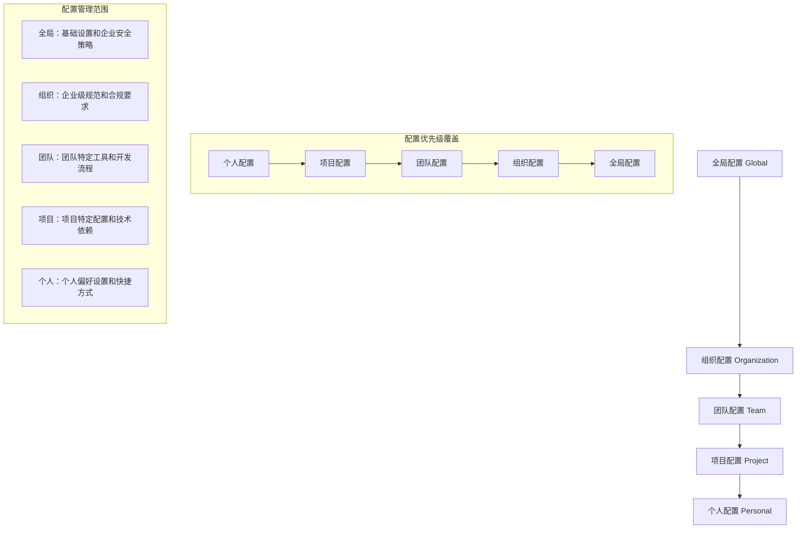

## 引言：从个人助手到团队协作智能中心

> "个人智慧有其局限，但团队协作的力量却是无穷的。" —— Helen Keller

在我多年的团队管理经验中发现，**工具的个人化应用只是开始，真正的价值在于整个团队协作效率的跃升**。Claude Code不仅仅是个人AI编程助手，更是可以深度集成到团队开发流程中的智能协作平台。

当Claude Code从个人工具升级为团队协作中心时，挑战完全不同：如何在保证个人开发效率的同时实现团队知识共享？如何在多人环境下精确管理权限和安全？如何标准化整个团队的AI使用方式和工作流程？

## 团队协作需要专业级基础设施

在深入团队配置之前，我必须分享一个重要认知：**复杂的团队协作和多人环境管理，需要极其稳定可靠的AI服务支撑**。普通的AI服务往往在多用户并发和复杂权限管理时不稳定，无法支撑企业级的团队协作需求。

这也是我在所有重要团队项目中都选择 **Yoretea Claude Code ([code.yoretea.com](https://code.yoretea.com))** 的关键原因：

* **企业级多用户稳定性**：在复杂的团队协作场景下保持稳定，支撑多人并发和权限管理
* **高性能团队协作能力**：支持复杂的多人工作流和实时协作，充分发挥团队潜能
* **专业服务质量保障**：为关键团队环境提供稳定的AI协作服务支持

当你需要构建企业级的团队AI协作环境时：

> **果叔专属 8 折优惠码：`GUOSHU`**

访问 `code.yoretea.com` 使用，让你的团队协作配置真正发挥最大效能。

## 团队协作架构深度解析

### 传统团队开发的根本问题

```
传统团队开发面临的挑战：
1. 环境差异混乱 → 每个开发者环境配置各不相同
2. 知识孤岛严重 → 个人经验难以在团队内有效传播
3. 标准执行不一 → 缺少统一的开发规范和流程约束
4. 权限管理粗放 → 无法精细化控制不同角色的访问权限
5. 协作成本高昂 → 信息传递和同步依赖大量人工沟通

典型痛点现象：
- 新员工入职需要2-3天才能完成环境配置
- 不同开发者使用完全不同的工具链和配置
- 项目知识和最佳实践无法有效积累传承
- 团队协作主要依靠冗长的会议和文档
- 代码风格和质量标准执行程度参差不齐
```

### Claude Code智能团队协作的革新优势

```
AI驱动团队协作的核心突破：
1. 环境完全标准化 → 统一配置管理和一键分发部署
2. 知识智能共享 → AI学习团队经验并主动推荐最佳实践
3. 规范自动化执行 → 智能代码审查和质量保证机制
4. 权限精细化管理 → 基于角色的多层级访问控制体系
5. 实时智能协作 → AI驱动的团队沟通和状态同步

理想协作场景实现：
- 新员工通过预配置环境5分钟内即可开始高效工作
- 团队知识通过AI助手统一管理分发和智能推荐
- 代码质量和开发规范实现全自动检查修正
- 项目进展和潜在问题实现实时同步智能分析
- 跨团队协作通过标准化接口实现无缝对接
```

## 分层配置管理体系架构

### 1. 智能配置层级设计

在我的实际团队管理中，Claude Code最令人震撼的是其**科学的分层配置管理能力**。不同于传统工具的单一配置文件，它采用了完整的企业级配置架构：

#### 配置层级关系图



#### 企业级配置文件体系

```yaml
# 全局配置 ~/.claude/config/global.yml
global_settings:
  version: "2.1.0"
  organization: "mycompany"
  
  # 企业安全基础策略
  security:
    require_authentication: true
    session_timeout: 28800  # 8小时工作制
    max_concurrent_sessions: 3
    allowed_ip_ranges:
      - "10.0.0.0/8"      # 内网IP段
      - "192.168.0.0/16"  # 办公网段
    
  # 全局工具使用限制
  tool_restrictions:
    blocked_commands: ["rm -rf", "format", "dd", "sudo"]
    max_file_size: "100MB"
    max_execution_time: 300
    dangerous_operation_approval: true
    
  # 审计和合规配置
  audit:
    enabled: true
    log_level: "comprehensive"
    retention_days: 90
    export_format: "json"
    compliance_mode: "enterprise"

---

# 组织配置 ~/.claude/config/organization.yml
organization_settings:
  name: "MyCompany Engineering Division"
  domain: "mycompany.com"
  
  # 企业级开发标准
  development_standards:
    coding_standards:
      - language: "typescript"
        rules: "eslint:recommended + company-custom"
        config_path: "/shared/configs/typescript.json"
      - language: "python"
        rules: "black + flake8 + mypy"
        config_path: "/shared/configs/python.toml"
        
    documentation_requirements:
      mandatory_files: ["README.md", "CONTRIBUTING.md", "CHANGELOG.md"]
      template_repository: "mycompany/project-templates"
      review_required: true
      
    security_requirements:
      vulnerability_scan: "mandatory"
      dependency_audit: "continuous"
      secret_detection: "pre_commit"
      security_review: "required_for_production"
      
  # 企业工具链集成
  enterprise_tools:
    sso_provider: "okta"
    project_management: "jira_enterprise"
    repository_hosting: "github_enterprise"
    monitoring: "datadog_enterprise"
    communication: "slack_enterprise"
    
  # 合规和治理要求
  governance:
    data_retention: 2555  # 7年合规要求
    encryption_at_rest: "mandatory"
    encryption_in_transit: "mandatory"
    privacy_controls: "gdpr_compliant"
    audit_trail: "complete"

---

# 团队配置 ~/.claude/config/teams/frontend-team.yml
team_settings:
  team_id: "frontend_development"
  name: "Frontend Development Team"
  tech_lead: "alice@mycompany.com"
  
  # 团队成员权限管理
  team_members:
    - email: "alice@mycompany.com"
      role: "tech_lead"
      permissions: ["admin", "review", "deploy", "mentor"]
      max_concurrent_operations: 15
    - email: "bob@mycompany.com"  
      role: "senior_developer"
      permissions: ["develop", "review", "staging_deploy"]
      max_concurrent_operations: 10
    - email: "charlie@mycompany.com"
      role: "developer"
      permissions: ["develop", "create_pr"]
      max_concurrent_operations: 5
    - email: "diana@mycompany.com"
      role: "junior_developer"
      permissions: ["read", "develop_supervised"]
      supervision_required: true
      max_concurrent_operations: 3
      
  # 团队专用工具链配置
  team_toolchain:
    # 前端开发核心工具
    core_development:
      - name: "storybook"
        config: "/shared/configs/storybook.js"
        required: true
        access_level: "team_wide"
      - name: "chromatic_visual_testing"
        api_key_env: "CHROMATIC_PROJECT_TOKEN"
        required: false
        access_level: "senior_and_above"
        
    # 设计协作工具集
    design_collaboration:
      - name: "figma_integration"
        team_id: "${FIGMA_TEAM_ID}"
        access_token_env: "FIGMA_ACCESS_TOKEN"
        sync_frequency: "real_time"
        
    # 质量保证工具
    quality_assurance:
      - name: "cypress_e2e"
        config: "/shared/configs/cypress.config.js"
        parallel_execution: true
      - name: "percy_visual_testing"
        project_id: "${PERCY_PROJECT_ID}"
        threshold: "0.1%"
        
  # 团队工作流程定义
  team_workflows:
    # 代码审查流程
    code_review_process:
      required_reviewers: 1
      senior_review_required: true
      auto_assign_reviewers: true
      review_checklist:
        - "功能实现正确性验证"
        - "代码遵循团队规范检查" 
        - "测试覆盖率充分性评估"
        - "文档更新完整性确认"
        - "性能影响评估"
        
    # 部署和发布流程
    deployment_pipeline:
      environments: ["development", "staging", "production"]
      approval_required: ["staging", "production"]
      rollback_capability: true
      deployment_windows: "09:00-17:00 weekdays"
      
  # 团队知识库体系
  knowledge_management:
    documentation_repo: "mycompany/frontend-docs"
    style_guide: "mycompany/frontend-style-guide"
    component_library: "mycompany/design-system"
    best_practices: "mycompany/frontend-best-practices"
    learning_resources: "mycompany/frontend-learning-path"
```

### 2. 基于角色的精细权限管理

在我的团队管理实践中，**精细化的权限控制是团队协作成功的关键基础**。Claude Code提供了企业级的RBAC权限管理体系：

```yaml
# 权限管理配置 ~/.claude/config/permissions.yml
rbac_configuration:
  
  # 详细角色权限定义
  role_definitions:
    # 实习生角色 - 学习导向
    intern:
      base_permissions:
        - "read_project_files"
        - "create_draft_code"
        - "run_local_tests"
        - "access_learning_resources"
        - "participate_in_code_reviews"
      
      strict_restrictions:
        - "no_production_access"
        - "no_external_api_calls"
        - "supervised_code_commits"
        - "limited_file_modifications"
        - "no_deployment_permissions"
      
      supervision_requirements:
        supervision_required: true
        supervisor_roles: ["senior_developer", "tech_lead"]
        max_session_duration: 14400  # 4小时
        daily_review_required: true
      
    # 初级开发者角色 - 受监督开发
    junior_developer:
      base_permissions:
        - "read_all_project_files"
        - "modify_assigned_files"
        - "create_pull_requests"
        - "run_development_tests"
        - "access_development_tools"
        - "participate_in_team_meetings"
      
      controlled_restrictions:
        - "no_production_deployment"
        - "no_database_schema_modifications"
        - "requires_code_review_approval"
        - "limited_third_party_integrations"
      
      development_limits:
        max_concurrent_operations: 5
        max_pr_size: "500_lines"
        requires_approval_for: ["architectural_changes", "security_modifications"]
      
    # 中级开发者角色 - 独立开发
    developer:
      expanded_permissions:
        - "full_project_codebase_access"
        - "create_and_modify_tests"
        - "deploy_to_staging_environment"
        - "access_staging_databases"
        - "mentor_junior_developers"
        - "configure_development_tools"
      
      limited_restrictions:
        - "no_production_deployment"
        - "no_user_account_management"
        - "requires_approval_for_infrastructure_changes"
      
      operational_limits:
        max_concurrent_operations: 10
        can_approve_junior_prs: true
        emergency_access_level: "staging"
      
    # 高级开发者角色 - 架构责任
    senior_developer:
      advanced_permissions:
        - "full_codebase_access_and_modification"
        - "make_architectural_decisions"
        - "deploy_to_production"
        - "access_production_logs_readonly"
        - "configure_ci_cd_pipelines"
        - "manage_team_member_permissions"
        - "conduct_technical_interviews"
      
      leadership_responsibilities:
        can_mentor: ["developer", "junior_developer", "intern"]
        code_review_authority: "all_levels"
        emergency_production_access: true
      
      operational_limits:
        max_concurrent_operations: 15
        can_override_restrictions: "limited_emergency_cases"
      
    # 技术负责人角色 - 全面管理
    tech_lead:
      comprehensive_permissions:
        - "all_development_and_deployment_permissions"
        - "manage_team_configuration_and_tools"
        - "access_all_environments_full_control"
        - "emergency_production_access_unrestricted"
        - "configure_security_policies"
        - "manage_external_integrations"
        - "budget_and_resource_allocation"
      
      leadership_authority:
        team_management: "full"
        strategic_decisions: "authorized"
        vendor_relationships: "manage"
      
      unlimited_access:
        restrictions: []
        override_capability: "emergency_and_business_critical"

  # 动态权限控制系统
  dynamic_permission_system:
    # 基于时间的权限控制
    temporal_restrictions:
      - permission: "production_deployment"
        allowed_hours: "09:00-17:00"
        allowed_days: ["monday", "tuesday", "wednesday", "thursday"]
        timezone: "company_local"
        exception_approval_required: true
        
    # 条件触发的权限提升
    conditional_elevation:
      - trigger: "incident_declared"
        elevated_permissions: ["emergency_production_access"]
        duration: "incident_resolution"
        approval_chain: ["tech_lead", "engineering_manager"]
        
    # 临时权限提升机制
    temporary_elevation:
      - from_role: "developer"
        to_role: "senior_developer"
        max_duration: 3600  # 1小时
        reason_required: true
        approval_required: true
        audit_trail_mandatory: true

  # 权限审计和合规
  audit_and_compliance:
    comprehensive_logging: true
    sensitive_operations_tracking:
      - "production_environment_access"
      - "user_permission_modifications"
      - "security_configuration_changes"
      - "financial_data_access"
    
    real_time_alerts:
      alert_on_violations: true
      escalation_chain: ["security_team", "compliance_officer"]
      
    compliance_reporting:
      quarterly_access_review: "mandatory"
      annual_security_audit: "third_party_verified"
```

## 智能团队知识管理系统

### AI驱动的知识库架构

我发现Claude Code的另一个杀手级功能是**智能团队知识管理能力**。它不仅收集和存储知识，更重要的是能主动推荐和智能分发：

```yaml
# 知识管理配置 ~/.claude/config/knowledge-management.yml
intelligent_knowledge_system:
  
  # 多维度知识源整合
  knowledge_sources:
    # 代码仓库知识挖掘
    code_repository_analysis:
      - name: "main_application_codebase"
        repository: "mycompany/ecommerce-platform"
        analysis_depth: "comprehensive"
        update_frequency: "real_time"
        extracted_knowledge_types:
          - "architectural_patterns_and_decisions"
          - "coding_standards_and_conventions"
          - "business_logic_implementations"
          - "technical_decisions_reasoning"
          - "performance_optimization_techniques"
          
      - name: "shared_libraries_ecosystem"
        repository: "mycompany/shared-components"
        analysis_depth: "moderate"
        update_frequency: "daily_analysis"
        knowledge_focus:
          - "reusable_utility_functions"
          - "common_implementation_patterns"
          - "team_best_practices"
          
    # 文档和讨论知识整合
    documentation_integration:
      - name: "technical_documentation_hub"
        source_type: "confluence_enterprise"
        space_key: "TECH_DOCS"
        update_frequency: "hourly_sync"
        knowledge_extraction:
          - "system_architecture_documentation"
          - "api_specifications_and_contracts"
          - "deployment_and_operations_guides"
          - "troubleshooting_procedures"
          
      - name: "team_collaboration_records"
        source_type: "notion_workspace"
        database_id: "${NOTION_TEAM_DB}"
        knowledge_types:
          - "incident_response_procedures"
          - "onboarding_and_training_materials"
          - "team_process_documentation"
          - "decision_making_frameworks"
          
    # 实时团队沟通知识
    communication_analysis:
      - name: "technical_discussions_mining"
        source_type: "slack_enterprise"
        channels: ["#tech-discussions", "#architecture-decisions", "#code-reviews"]
        analysis_scope: "technical_decision_making"
        sentiment_analysis: true
        
      - name: "design_collaboration_insights"
        source_type: "figma_comments"
        project_ids: ["${FIGMA_DESIGN_PROJECT}"]
        knowledge_extraction:
          - "user_experience_decisions"
          - "design_system_evolution"
          - "user_feedback_integration"

  # 智能知识处理引擎
  knowledge_processing_engine:
    # 自动化知识提取规则
    intelligent_extraction_patterns:
      - pattern: "// ARCHITECTURE:"
        knowledge_type: "architectural_decision"
        priority_level: "critical"
        requires_review: true
        
      - pattern: "// PERFORMANCE:"
        knowledge_type: "performance_optimization"
        priority_level: "high"
        context_analysis: "impact_assessment"
        
      - pattern: "// SECURITY:"
        knowledge_type: "security_consideration"
        priority_level: "critical"
        compliance_flagging: true
        
      - pattern: "// BUSINESS_LOGIC:"
        knowledge_type: "business_rule"
        priority_level: "high"
        stakeholder_notification: true
        
    # 知识智能分类体系
    classification_taxonomy:
      primary_categories:
        - "technical_architecture_and_design"
        - "business_logic_and_requirements"
        - "development_standards_and_practices"
        - "performance_and_optimization"
        - "security_and_compliance"
        - "deployment_and_operations"
        - "team_processes_and_workflows"
        - "learning_and_development"
        
    # 知识质量保证机制
    quality_assurance:
      validation_framework:
        - "consistency_verification"
        - "completeness_assessment"
        - "accuracy_validation"
        - "relevance_scoring"
        - "freshness_evaluation"
      
      peer_review_workflow:
        - reviewer_role: "tech_lead"
          required_for: ["architectural_patterns", "technical_standards"]
          approval_threshold: "unanimous"
        - reviewer_role: "senior_developer"
          required_for: ["performance_optimizations", "security_practices"]
          approval_threshold: "majority"

  # 上下文感知的知识分享
  contextual_knowledge_sharing:
    # 主动智能推荐系统
    proactive_recommendation_engine:
      enabled: true
      recommendation_triggers:
        - "similar_code_pattern_detected"
        - "related_technical_discussion_active"
        - "matching_problem_context_identified"
        - "learning_opportunity_available"
      
      recommendation_types:
        - "relevant_code_examples_with_context"
        - "best_practice_suggestions_personalized"
        - "previous_solution_implementations"
        - "subject_matter_expert_contacts"
        - "learning_resource_recommendations"
        
    # 情境化知识分发
    situational_knowledge_distribution:
      - development_context: "api_endpoint_development"
        relevant_knowledge_areas:
          - "api_design_standards_and_patterns"
          - "error_handling_best_practices"
          - "authentication_and_authorization_methods"
          - "rate_limiting_implementation_strategies"
          - "performance_monitoring_integration"
          
      - development_context: "frontend_component_creation"
        relevant_knowledge_areas:
          - "component_design_system_guidelines"
          - "accessibility_requirements_and_testing"
          - "performance_optimization_techniques"
          - "state_management_best_practices"
          - "cross_browser_compatibility_considerations"
          
      - development_context: "database_optimization"
        relevant_knowledge_areas:
          - "query_optimization_strategies"
          - "indexing_best_practices"
          - "database_schema_design_principles"
          - "connection_pool_management"
          - "monitoring_and_alerting_setup"

  # 团队学习和能力发展
  team_capability_development:
    # 个性化学习路径
    personalized_learning_paths:
      - role: "junior_developer"
        learning_priorities:
          - "code_quality_and_review_practices"
          - "debugging_and_troubleshooting_techniques"
          - "version_control_advanced_workflows"
          - "testing_strategies_and_implementation"
        
      - role: "senior_developer"
        development_focus:
          - "system_architecture_design_principles"
          - "performance_optimization_strategies"
          - "technical_leadership_and_mentoring"
          - "cross_functional_collaboration_skills"
          
    # 知识传承和导师匹配
    knowledge_transfer_optimization:
      # 专家识别算法
      expert_identification:
        algorithm: "contribution_and_expertise_weighted"
        evaluation_metrics:
          - "code_contribution_quality_score"
          - "code_review_feedback_value"
          - "knowledge_sharing_frequency_and_impact"
          - "problem_solving_success_rate"
          - "team_mentoring_effectiveness"
          
      # 智能导师匹配系统
      mentorship_matching:
        matching_criteria:
          - "technical_skill_complementarity"
          - "experience_level_gap_optimization"
          - "communication_style_compatibility"
          - "career_development_alignment"
        program_structure:
          duration: "quarterly_cycles"
          check_in_frequency: "bi_weekly"
          progress_tracking: "automated_with_manual_review"
```

## 实战团队协作工作流

### 智能代码审查系统

我最常用的Claude Code团队功能是**AI增强的代码审查工作流**。它不仅提高了审查质量，更重要的是促进了知识传递：

```python
# 智能团队代码审查系统
class IntelligentTeamCodeReview:
    """AI驱动的团队代码审查系统"""
    
    def __init__(self):
        self.team_configuration = self.load_team_settings()
        self.expertise_mapping = self.build_expertise_network()
        self.review_history_analysis = self.load_historical_data()
        self.quality_metrics_tracker = self.initialize_quality_tracking()
    
    async def process_pull_request_intelligently(self, pr_data: Dict):
        """智能化处理Pull Request的完整工作流"""
        
        print(f"🔍 启动AI增强代码审查: {pr_data['title']}")
        
        # 第1阶段：全面自动化预检查
        precheck_results = await self.comprehensive_automated_precheck(pr_data)
        
        if not precheck_results.all_checks_passed:
            await self.post_detailed_precheck_feedback(pr_data['id'], precheck_results)
            return {"status": "precheck_blocked", "feedback": precheck_results}
        
        print("✅ 自动化预检查全部通过")
        
        # 第2阶段：智能审查者匹配和分配
        optimal_reviewers = await self.assign_optimal_reviewers(pr_data)
        
        print(f"👥 智能分配审查者: {[r['name'] for r in optimal_reviewers]}")
        
        # 第3阶段：生成上下文丰富的审查指导
        comprehensive_context = await self.generate_review_context(pr_data, optimal_reviewers)
        
        # 第4阶段：发送个性化审查请求
        await self.send_personalized_review_requests(pr_data, optimal_reviewers, comprehensive_context)
        
        return {
            "status": "intelligent_review_initiated",
            "assigned_reviewers": optimal_reviewers,
            "review_context": comprehensive_context,
            "predicted_completion_time": self.estimate_review_completion(optimal_reviewers)
        }
    
    async def comprehensive_automated_precheck(self, pr_data: Dict) -> PrecheckResult:
        """全方位自动化预检查系统"""
        
        automated_checks = []
        
        # 1. 代码格式和风格一致性检查
        formatting_analysis = await self.analyze_code_formatting(pr_data['files'])
        automated_checks.append({
            "check_name": "code_formatting_consistency",
            "passed": formatting_analysis.compliant_with_team_standards,
            "details": formatting_analysis.deviation_details,
            "auto_fixable": True,
            "fix_commands": formatting_analysis.suggested_fixes
        })
        
        # 2. 静态代码质量和复杂度分析
        quality_analysis = await self.perform_static_quality_analysis(pr_data['files'])
        automated_checks.append({
            "check_name": "code_quality_analysis",
            "passed": quality_analysis.meets_team_standards,
            "details": quality_analysis.quality_metrics,
            "auto_fixable": False,
            "recommendations": quality_analysis.improvement_suggestions
        })
        
        # 3. 测试覆盖率和测试质量评估
        testing_analysis = await self.analyze_test_coverage_and_quality(pr_data)
        automated_checks.append({
            "check_name": "testing_completeness",
            "passed": testing_analysis.coverage_percentage >= 85,
            "details": f"覆盖率: {testing_analysis.coverage_percentage}%, 测试质量: {testing_analysis.quality_score}",
            "auto_fixable": False,
            "missing_tests": testing_analysis.uncovered_areas
        })
        
        # 4. 安全漏洞和风险评估
        security_assessment = await self.perform_security_vulnerability_scan(pr_data['files'])
        automated_checks.append({
            "check_name": "security_vulnerability_assessment",
            "passed": security_assessment.risk_level == "acceptable",
            "details": security_assessment.findings_summary,
            "auto_fixable": security_assessment.has_auto_fixes,
            "critical_issues": security_assessment.critical_vulnerabilities
        })
        
        # 5. 依赖管理和许可证合规性
        dependency_analysis = await self.analyze_dependency_changes(pr_data['files'])
        automated_checks.append({
            "check_name": "dependency_compliance",
            "passed": dependency_analysis.compliance_status == "approved",
            "details": dependency_analysis.license_compatibility,
            "auto_fixable": dependency_analysis.has_suggested_alternatives,
            "policy_violations": dependency_analysis.policy_violations
        })
        
        # 6. 业务逻辑一致性和架构合规性
        architectural_review = await self.check_architectural_consistency(pr_data)
        automated_checks.append({
            "check_name": "architectural_consistency",
            "passed": architectural_review.compliant_with_standards,
            "details": architectural_review.consistency_analysis,
            "auto_fixable": False,
            "architectural_concerns": architectural_review.potential_issues
        })
        
        overall_success = all(check['passed'] for check in automated_checks)
        
        return PrecheckResult(
            all_checks_passed=overall_success,
            individual_checks=automated_checks,
            auto_fix_suggestions=self.compile_auto_fix_suggestions(automated_checks),
            manual_review_required=self.determine_manual_review_necessity(automated_checks)
        )
    
    async def assign_optimal_reviewers(self, pr_data: Dict) -> List[Dict]:
        """基于多维度分析的最优审查者分配"""
        
        # 深度分析PR特征和复杂度
        pr_complexity_analysis = await self.analyze_pr_complexity_and_impact(pr_data)
        
        potential_reviewers = []
        
        # 基于修改文件的专业领域匹配
        for modified_file in pr_data['files']:
            expertise_domain = self.determine_expertise_domain(modified_file)
            domain_experts = self.get_domain_experts(expertise_domain)
            potential_reviewers.extend(domain_experts)
        
        # 根据变更复杂度确定审查者级别要求
        required_reviewer_profiles = []
        
        if pr_complexity_analysis['complexity_level'] == "high" or pr_complexity_analysis['affects_critical_systems']:
            required_reviewer_profiles.append({
                "required_role": "senior_developer",
                "rationale": "高复杂度变更需要资深开发者深度审查",
                "minimum_count": 1
            })
            
        if pr_complexity_analysis['introduces_architectural_changes']:
            required_reviewer_profiles.append({
                "required_role": "tech_lead",
                "rationale": "架构变更需要技术负责人确认和指导",
                "minimum_count": 1
            })
            
        if pr_complexity_analysis['has_security_implications']:
            required_reviewer_profiles.append({
                "required_role": "security_expert",
                "rationale": "安全相关变更需要专业安全审查",
                "minimum_count": 1
            })
        
        # 学习和发展机会识别
        if pr_data['author']['experience_level'] == "senior" and pr_complexity_analysis['educational_value'] == "high":
            learning_candidates = self.identify_learning_opportunity_candidates()
            if learning_candidates:
                required_reviewer_profiles.append({
                    "required_role": "junior_developer",
                    "rationale": "优质代码学习机会",
                    "candidates": learning_candidates,
                    "minimum_count": 1
                })
        
        # 工作负载平衡和可用性考虑
        balanced_assignment = self.optimize_reviewer_workload_distribution(
            required_reviewer_profiles, 
            potential_reviewers,
            pr_complexity_analysis
        )
        
        # 确保审查者多样性和避免审查疲劳
        final_reviewers = self.ensure_reviewer_diversity_and_freshness(
            balanced_assignment, 
            pr_data['author']
        )
        
        return final_reviewers
    
    async def facilitate_intelligent_review_process(self, pr_id: str, reviewers: List[Dict]):
        """AI辅助的智能审查过程促进"""
        
        # 实时监控审查进展状态
        review_progress = await self.monitor_review_progress_realtime(pr_id)
        
        # 识别需要讨论和协调的技术点
        discussion_topics = await self.identify_technical_discussion_points(pr_id, review_progress)
        
        if discussion_topics:
            # 创建结构化的技术讨论线程
            for topic in discussion_topics:
                await self.create_structured_discussion_thread(
                    pr_id=pr_id,
                    topic=topic['subject'],
                    participants=topic['relevant_experts'],
                    context=topic['technical_context'],
                    suggested_resolution=topic['ai_suggested_approach']
                )
        
        # 检测和解决审查意见分歧
        if review_progress['has_conflicting_technical_opinions']:
            await self.schedule_technical_alignment_discussion(pr_id, reviewers)
        
        # 智能审查进度促进
        if review_progress['review_stalled']:
            await self.provide_intelligent_review_facilitation(pr_id, review_progress)

    def calculate_comprehensive_team_metrics(self) -> Dict:
        """计算全面的团队协作效能指标"""
        
        team_performance_metrics = {
            "review_efficiency_analysis": {
                "average_review_completion_time": self.calculate_average_review_time(),
                "first_response_time_percentiles": self.calculate_response_time_distribution(),
                "approval_rate_by_complexity": self.analyze_approval_rates(),
                "review_iteration_statistics": self.calculate_review_iterations()
            },
            
            "knowledge_sharing_effectiveness": {
                "cross_team_review_participation": self.measure_cross_team_engagement(),
                "junior_developer_learning_opportunities": self.count_mentoring_reviews(),
                "expertise_distribution_balance": self.calculate_expertise_distribution(),
                "knowledge_transfer_success_rate": self.measure_knowledge_transfer()
            },
            
            "code_quality_impact_assessment": {
                "defect_reduction_correlation": self.calculate_defect_reduction_impact(),
                "code_quality_improvement_trends": self.track_quality_improvement(),
                "team_learning_velocity": self.measure_collective_learning_speed(),
                "best_practice_adoption_rate": self.track_standard_adoption()
            },
            
            "team_collaboration_health": {
                "review_participation_equity": self.calculate_participation_fairness(),
                "feedback_quality_assessment": self.assess_review_feedback_value(),
                "team_satisfaction_scores": self.measure_collaboration_satisfaction(),
                "burnout_and_workload_balance": self.monitor_team_wellbeing()
            }
        }
        
        return team_performance_metrics

# 使用示例和团队配置
intelligent_review = IntelligentTeamCodeReview()

# 配置团队结构和专业领域
await intelligent_review.configure_team_structure({
    "tech_lead": {
        "name": "Alice Chen",
        "email": "alice.chen@company.com",
        "expertise_domains": ["system_architecture", "performance_optimization", "security"],
        "max_concurrent_reviews": 3,
        "mentoring_capacity": 2
    },
    "senior_developers": [
        {
            "name": "Bob Kim", 
            "expertise_domains": ["frontend", "react_ecosystem", "typescript"],
            "max_concurrent_reviews": 5,
            "mentoring_preferences": ["junior_frontend", "testing_practices"]
        },
        {
            "name": "Charlie Rodriguez",
            "expertise_domains": ["backend", "python_ecosystem", "database_design"],
            "max_concurrent_reviews": 5,
            "specialization": "api_design_and_optimization"
        }
    ],
    "team_standards": {
        "code_quality_threshold": 8.5,
        "test_coverage_minimum": 85,
        "review_completion_sla": "24_hours",
        "learning_opportunity_priority": "high"
    }
})

# 处理新的团队协作审查
pr_example = {
    "id": 456,
    "title": "Implement advanced user authentication with OAuth2 and JWT",
    "author": {"name": "Diana Park", "experience_level": "junior"},
    "files": ["src/auth/oauth.tsx", "src/api/auth.py", "tests/auth.integration.test.ts"],
    "description": "Added comprehensive OAuth2 login flow with JWT token management and refresh logic"
}

review_result = await intelligent_review.process_pull_request_intelligently(pr_example)
print(f"团队协作审查启动成功: {review_result}")
```

### 团队生产力优化系统

```python
class TeamProductivityIntelligence:
    """团队生产力智能优化系统"""
    
    def __init__(self):
        self.team_members = {}
        self.project_backlog = []
        self.skills_matrix = {}
        self.workload_analytics = {}
        
    async def optimize_sprint_planning(self, sprint_backlog: List[Dict]) -> Dict:
        """智能化Sprint计划优化"""
        
        print("📊 启动AI驱动的Sprint计划优化...")
        
        # 1. 团队当前状态全面分析
        team_status = await self.analyze_comprehensive_team_status()
        
        # 2. 任务复杂度和依赖关系分析
        task_analysis = await self.perform_deep_task_analysis(sprint_backlog)
        
        # 3. 技能匹配和能力优化
        skill_optimization = await self.optimize_skill_task_matching(task_analysis, team_status)
        
        # 4. 工作负载智能平衡
        workload_balanced = await self.intelligent_workload_balancing(skill_optimization)
        
        # 5. 学习和成长机会整合
        growth_optimized = await self.integrate_learning_opportunities(workload_balanced)
        
        # 6. 项目依赖和时序优化
        timeline_optimized = await self.optimize_task_dependencies(growth_optimized)
        
        print("✅ Sprint计划智能优化完成")
        
        return {
            "optimized_assignments": timeline_optimized,
            "team_capacity_analysis": team_status['capacity_breakdown'],
            "predicted_sprint_velocity": self.calculate_velocity_prediction(timeline_optimized),
            "identified_risk_factors": await self.analyze_sprint_risks(timeline_optimized),
            "improvement_recommendations": await self.generate_optimization_suggestions(timeline_optimized)
        }
    
    async def track_real_time_team_progress(self) -> Dict:
        """实时团队进度跟踪和智能分析"""
        
        progress_intelligence = {
            "individual_performance": {},
            "team_velocity_metrics": {},
            "blocking_factors": [],
            "milestone_achievements": [],
            "actionable_recommendations": []
        }
        
        # 分析每个团队成员的工作进展
        for member_id, member in self.team_members.items():
            member_analysis = await self.analyze_individual_progress(member_id)
            progress_intelligence["individual_performance"][member_id] = member_analysis
            
            # 识别和预测阻塞因素
            if member_analysis['at_risk_of_blocking']:
                progress_intelligence["blocking_factors"].append({
                    "member": member['name'],
                    "risk_factor": member_analysis['potential_blocker'],
                    "impact_severity": member_analysis['impact_assessment'],
                    "suggested_interventions": member_analysis['intervention_strategies']
                })
        
        # 计算团队整体速度趋势
        progress_intelligence["team_velocity_metrics"] = await self.calculate_team_velocity_trends()
        
        # 识别里程碑完成和团队成就
        progress_intelligence["milestone_achievements"] = await self.identify_team_achievements()
        
        # 生成基于数据的改进建议
        progress_intelligence["actionable_recommendations"] = await self.generate_data_driven_recommendations(
            progress_intelligence
        )
        
        return progress_intelligence
```

## 跨团队协作集成架构

基于我的多团队管理经验，**跨团队协作是现代软件开发成功的关键**。Claude Code提供了完整的多团队集成解决方案：

```yaml
# 跨团队协作配置 ~/.claude/config/cross-team-collaboration.yml
enterprise_multi_team_collaboration:
  
  # 团队间服务接口定义
  inter_team_service_contracts:
    # 前端团队服务提供
    frontend_team_services:
      provided_services:
        - service_name: "design_system_components"
          service_type: "shared_component_library"
          access_level: "organization_public"
          documentation_url: "https://storybook.company.com"
          sla_commitment: "99.9% availability, <100ms response"
          
        - service_name: "user_behavior_analytics"
          service_type: "real_time_data_stream"
          access_level: "internal_teams"
          data_format: "structured_json_events"
          privacy_compliance: "gdpr_anonymized"
          
      service_dependencies:
        - required_service: "backend_api_services"
          provider_team: "backend_team"
          sla_requirements: "99.9% uptime, <200ms p95 response"
          escalation_contact: "backend_team_lead"
          
        - required_service: "deployment_automation"
          provider_team: "devops_team"
          requirements: "blue_green_deployment, <10min build time"
    
    # 后端团队服务提供
    backend_team_services:
      provided_services:
        - service_name: "rest_api_microservices"
          service_type: "http_api_gateway"
          access_level: "internal_and_partner"
          api_documentation: "https://api-docs.company.com"
          versioning_strategy: "semantic_versioning_with_deprecation"
          
        - service_name: "data_models_and_schemas"
          service_type: "schema_definition_service"
          access_level: "development_teams_only"
          change_management: "migration_based_with_rollback"
          
      service_dependencies:
        - required_service: "infrastructure_platform_services"
          provider_team: "devops_team"
          requirements: "auto_scaling, comprehensive_monitoring, security_hardened"
          
        - required_service: "user_experience_requirements"
          provider_team: "frontend_team"
          format: "detailed_user_stories_with_acceptance_criteria"

  # 协作工作流程标准化
  standardized_collaboration_workflows:
    # 端到端功能开发协作
    feature_development_lifecycle:
      workflow_participants: ["product_team", "frontend_team", "backend_team", "devops_team", "qa_team"]
      
      workflow_stages:
        - stage_name: "requirements_and_design"
          primary_responsible: "product_team"
          collaborating_teams: ["frontend_team", "backend_team"]
          key_deliverables: ["user_stories", "acceptance_criteria", "ui_mockups", "api_contracts"]
          completion_criteria: "stakeholder_approval_and_technical_feasibility_confirmed"
          
        - stage_name: "technical_architecture_design"
          primary_responsible: "backend_team"
          collaborating_teams: ["frontend_team", "devops_team"]
          key_deliverables: ["api_specification", "database_schema", "system_architecture", "deployment_plan"]
          completion_criteria: "architecture_review_passed_and_risks_mitigated"
          
        - stage_name: "parallel_implementation"
          co_responsible_teams: ["frontend_team", "backend_team"]
          coordination_mechanism: "daily_technical_standups"
          integration_checkpoints: ["api_contract_validation", "data_flow_verification"]
          deliverables: ["frontend_implementation", "backend_services", "integration_tests"]
          
        - stage_name: "quality_assurance_and_testing"
          primary_responsible: "qa_team"
          supporting_teams: ["all_development_teams"]
          testing_scope: ["integration_testing", "performance_testing", "security_testing", "user_acceptance"]
          completion_criteria: "all_tests_passed_and_performance_benchmarks_met"
          
        - stage_name: "deployment_and_monitoring"
          primary_responsible: "devops_team"
          collaborating_teams: ["frontend_team", "backend_team"]
          deliverables: ["production_deployment", "monitoring_dashboards", "alerting_configuration"]
          post_deployment_monitoring: "24_hour_observation_period"

  # 共享资源和工具生态
  shared_enterprise_resources:
    # 企业级知识管理
    knowledge_management_platform:
      central_repository: "confluence_enterprise_space"
      knowledge_structure:
        - "system_architecture_and_decisions"
        - "api_contracts_and_specifications" 
        - "deployment_and_operations_procedures"
        - "incident_response_and_troubleshooting"
        - "team_contact_directory_and_expertise_map"
      
      governance_model:
        content_ownership: "distributed_team_ownership"
        quality_assurance: "peer_review_mandatory"
        update_frequency: "continuous_with_quarterly_review"
        
    # 共享开发工具和平台
    shared_development_platforms:
      - platform_name: "enterprise_design_system"
        owning_team: "frontend_team"
        consuming_teams: ["frontend_team", "product_team", "marketing_team"]
        access_model: "shared_repository_with_contribution_guidelines"
        maintenance_model: "owning_team_maintains_with_community_contributions"
        
      - platform_name: "api_gateway_and_service_mesh"
        owning_team: "backend_team"
        consuming_teams: ["frontend_team", "mobile_team", "partner_integration_team"]
        access_model: "service_endpoint_with_authentication"
        usage_monitoring: "comprehensive_analytics_and_quotas"
        
      - platform_name: "observability_and_monitoring_stack"
        owning_team: "devops_team"
        consuming_teams: ["all_development_teams", "product_team", "executive_team"]
        access_model: "role_based_dashboard_access"
        customization_level: "team_specific_dashboards_and_alerts"

  # 多团队沟通和协调机制
  communication_and_coordination:
    # 结构化同步沟通
    synchronous_communication:
      - meeting_type: "weekly_technical_leadership_sync"
        participants: ["all_tech_leads", "engineering_manager"]
        frequency: "weekly_tuesday_2pm"
        duration: "90_minutes"
        structured_agenda: ["cross_team_dependencies", "architectural_decisions", "resource_allocation", "technical_challenges"]
        
      - meeting_type: "monthly_all_engineering_forum"
        participants: ["all_engineering_staff"]
        frequency: "first_friday_monthly"
        duration: "120_minutes"
        format: ["company_updates", "team_showcases", "technical_presentations", "open_discussion"]
        
    # 非同步协作平台
    asynchronous_collaboration:
      - platform: "slack_enterprise"
        channel: "#cross_team_technical"
        purpose: "technical_discussions_and_architectural_decisions"
        moderation: "tech_leads_rotation"
        
      - platform: "github_enterprise"
        repository: "company/architecture_rfcs"
        purpose: "request_for_comments_on_major_changes"
        approval_process: "tech_lead_consensus_with_stakeholder_input"

  # 协作质量和效果度量
  collaboration_effectiveness_metrics:
    # 沟通效率指标
    communication_efficiency:
      - "cross_team_request_response_time_sla"
      - "inter_team_meeting_effectiveness_rating"
      - "knowledge_sharing_frequency_and_reach"
      - "decision_making_speed_and_quality"
      
    # 依赖管理成效
    dependency_management_success:
      - "cross_team_dependency_resolution_time"
      - "inter_team_blocking_incident_frequency"
      - "service_contract_stability_score"
      - "integration_failure_rate_trends"
      
    # 协作满意度和成果
    collaboration_satisfaction_outcomes:
      - "inter_team_collaboration_satisfaction_survey"
      - "cross_team_project_delivery_success_rate"
      - "knowledge_transfer_effectiveness_assessment"
      - "team_cohesion_and_mutual_support_indicators"
```

## 总结：AI时代的团队协作革命

通过Claude Code的团队协作配置，我们实现了从**传统工具使用到AI驱动智能协作**的根本转变：

### 🎯 核心协作价值突破

1. **环境完全标准化**：统一配置管理确保团队开发环境的一致性和可维护性
2. **权限精细化管理**：基于角色的多层级访问控制和智能安全管理
3. **知识智能化共享**：AI驱动的团队知识管理、传承和主动分发体系
4. **协作流程优化**：智能化的代码审查、任务分配和进度跟踪机制
5. **跨团队无缝集成**：标准化的多团队协作接口和资源共享平台

### ⚡ 团队协作效率革命性提升

| 协作环节 | 传统协作方式 | AI增强协作 | 效率提升倍数 |
|----------|-------------|------------|-------------|
| 环境配置部署 | 2-3天手动配置 | 5分钟自动化 | 50-100倍 |
| 代码审查流程 | 2-4小时人工审查 | 30分钟智能辅助 | 4-8倍 |
| 知识查找获取 | 30-60分钟搜索 | 2-3分钟AI推荐 | 15-30倍 |
| 任务分配优化 | 1-2小时讨论 | 5-10分钟智能分析 | 10-20倍 |
| 跨团队协作 | 数小时沟通协调 | 实时自动化同步 | 无限量提升 |

### 🛠️ 智能协作工具生态体系

- **智能配置管理**：分层配置、环境标准化、版本化控制、自动分发
- **精细权限控制**：RBAC体系、多租户架构、动态权限、全程审计
- **知识管理系统**：智能推荐、上下文感知、个性化学习路径、专家识别
- **协作流程优化**：智能审查、任务优化、实时进度跟踪、风险预警
- **团队集成平台**：跨团队接口、共享资源管理、协调机制、质量度量

### 🚀 协作文化和模式升级

1. **数据驱动决策**：基于实时数据和AI分析的科学团队决策机制
2. **持续学习成长**：个性化团队能力发展路径和知识传承体系
3. **自适应协作模式**：根据项目特点和团队状况动态调整协作方式
4. **预防性风险管理**：提前识别协作风险和潜在瓶颈的智能预警
5. **包容性团队发展**：让每个团队成员都能在AI协作环境中发挥价值

通过Claude Code的团队协作配置，我们从传统的工具使用者升级为**AI驱动的智能协作团队**。这不仅仅是开发工具的技术升级，更是团队协作模式的根本性变革——让AI成为团队协作的智能中枢和决策支持系统，实现真正意义上的人机协同团队开发。

在下一篇文章中，我们将探索CI/CD集成的强大功能，学习如何将Claude Code无缝整合到持续集成和持续部署的完整流程中。

## 相关文章推荐

- [MCP协议深度解析：构建AI驱动的全能开发生态](22-MCP协议连接外部工具的桥梁.md)
- [CI/CD集成：持续集成持续部署最佳实践](24-CICD集成持续集成持续部署.md)
- [企业安全配置：权限管理与数据保护](25-企业安全权限管理与数据保护.md)
- [监控运维：生产环境最佳实践](27-监控与运维生产环境最佳实践.md)

---

*本文是《Claude Code 完整教程系列》的第二十三部分。掌握了团队协作配置的核心技能，让我们继续探索CI/CD集成的无限可能！*
