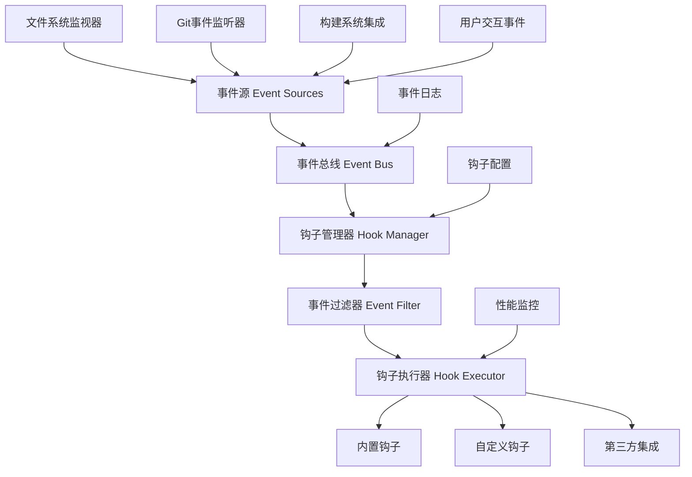

## 引言：事件驱动的编程未来

> "在编程中，最强大的模式之一就是事件驱动架构，它让系统能够优雅地响应变化。" —— Martin Fowler

我在过去几年的开发实践中深刻体会到，**手动执行重复性任务是效率杀手**。每次保存文件后手动格式化代码，提交前手动运行测试，部署前手动检查构建状态——这些看似简单的操作，累积起来消耗了大量宝贵的开发时间。

Claude Code的钩子(Hooks)系统彻底改变了这一现状。通过智能监听开发过程中的各种事件，它让AI助手能够在恰当的时机自动执行相应操作，真正实现**零干扰的智能化开发体验**。

## 事件驱动开发需要稳定的基础设施

在深入了解钩子系统之前，我必须强调一个关键点：**复杂的事件处理和自动化工作流需要极其稳定的AI服务支撑**。传统AI工具往往在关键时刻"掉链子"，导致自动化流程中断，反而增加了开发负担。

这也是我在所有重要项目中都选择 **Yoretea Claude Code ([code.yoretea.com](https://code.yoretea.com))** 的重要原因：

* **事件处理稳定性**：确保钩子系统在高频事件触发时保持稳定响应，不会因服务问题导致自动化失效
* **长时间运行保障**：支持复杂工作流的完整执行周期，避免因会话中断导致流程异常终止  
* **企业级可靠性**：为关键开发流程提供稳定的自动化执行环境

当你需要构建可靠的事件驱动开发工作流时：

> **果叔专属 8 折优惠码：`GUOSHU`**

访问 `code.yoretea.com` 使用，让你的自动化工作流拥有企业级的稳定性保障。

## 钩子系统架构深度剖析

### 传统开发工作流的痛点

```
手动操作的重复地狱：
1. 编写代码 → 手动格式化 → 手动保存
2. 提交代码 → 手动运行测试 → 手动检查结果  
3. 推送代码 → 手动触发构建 → 手动验证部署
4. 发现问题 → 手动回滚 → 手动通知团队

效率杀手：
- 🔄 大量重复性手动操作
- 🐛 容易遗漏关键检查步骤
- ⏰ 响应延迟影响开发节奏
- 📊 质量控制依赖人工记忆
- 👥 团队协作缺乏自动同步
```

### Claude Code钩子系统的智能革新

```
事件驱动的自动化体验：
1. 代码变更 → 自动格式化 → 自动测试 → 智能反馈
2. 提交触发 → 自动质检 → 自动构建 → 状态同步  
3. 部署完成 → 自动验证 → 性能监控 → 团队通知
4. 异常检测 → 智能诊断 → 自动修复 → 经验学习

革命性优势：
- ⚡ 毫秒级自动响应
- 🎯 精准的事件匹配和处理
- 🧠 上下文感知的智能决策
- 🔗 无缝的工具生态集成
- 📈 持续的性能优化
```

## 核心架构设计详解

### 多层次事件处理架构

在我的实际使用中，Claude Code的钩子系统最令人印象深刻的是其**分层架构设计**。它不是简单的事件监听器，而是一个完整的智能事件处理生态：



### 事件生命周期管理

Claude Code对每个事件都有完整的生命周期管理：

```yaml
# 事件处理的四个核心阶段
event_lifecycle:
  phases:
    - phase: "event_detection"
      description: "智能事件检测与捕获"
      components:
        - file_watcher: "毫秒级文件变更监控"
        - git_monitor: "Git操作实时感知"
        - user_action_tracker: "用户行为模式识别"
        - build_integration: "构建系统状态同步"
      
    - phase: "event_processing"  
      description: "事件分析与路由决策"
      steps:
        - context_enrichment: "丰富事件上下文信息"
        - priority_assessment: "智能优先级评估"
        - condition_evaluation: "条件匹配与验证"
        - routing_decision: "最优路由策略选择"
      
    - phase: "hook_execution"
      description: "钩子执行与响应"
      strategies:
        - synchronous: "同步执行保证时序"
        - asynchronous: "异步执行提升性能"
        - conditional: "条件执行避免浪费"
        - batch: "批量执行优化资源"
      
    - phase: "result_handling"
      description: "结果处理与反馈"
      actions:
        - success_logging: "成功执行记录"
        - error_recovery: "失败自动恢复"
        - notification: "智能状态通知"
        - learning: "执行经验积累"
```

## 文件系统事件的智能处理

### 实时文件监控与响应

我发现Claude Code最实用的功能之一是**智能文件监控**。它不仅能监听文件变化，更重要的是能理解变化的意义并做出合适的响应：

```yaml
# 智能文件监控配置
file_system_monitoring:
  watchers:
    - name: "source_code_watcher"
      patterns:
        - "src/**/*.{js,ts,jsx,tsx,py,go,rs}"
        - "lib/**/*.{js,ts}"
      events: ["modified", "created", "deleted"]
      debounce: 300  # 300ms防抖避免频繁触发
      
    - name: "config_file_watcher"
      patterns:
        - "package.json"
        - "tsconfig.json"  
        - "*.config.{js,ts,json}"
        - ".env*"
      events: ["modified"]
      immediate_trigger: true  # 配置文件变更立即响应
```

### 智能代码格式化钩子

```javascript
// 自动格式化的智能实现
const autoFormatHook = {
  name: "smart_auto_formatter",
  trigger: {
    event: "file_modified",
    conditions: [
      "file.extension in ['.js', '.ts', '.jsx', '.tsx']",
      "file.size < 1048576", // 1MB以下文件
      "!file.isReadOnly",
      "!file.path.includes('node_modules')"
    ]
  },
  
  execution: async (event) => {
    const { file } = event;
    console.log(`🎨 智能格式化: ${file.name}`);
    
    // 根据项目配置选择格式化工具
    const formatters = {
      '.js': () => runPrettier(file.path),
      '.ts': () => runPrettier(file.path), 
      '.py': () => runBlack(file.path),
      '.go': () => runGoFmt(file.path)
    };
    
    const formatter = formatters[file.extension];
    if (formatter) {
      try {
        await formatter();
        
        // 如果有ESLint配置，同时运行自动修复
        if (await hasESLintConfig()) {
          const lintResult = await runESLint(file.path, ['--fix']);
          if (lintResult.fixedCount > 0) {
            console.log(`🔧 ESLint自动修复: ${lintResult.fixedCount}个问题`);
          }
        }
        
        return { success: true, formatted: true };
      } catch (error) {
        console.warn(`格式化失败: ${error.message}`);
        return { success: false, error: error.message };
      }
    }
    
    return { success: true, skipped: true };
  }
};
```

## Git事件的深度集成

### 预提交质量保障

Claude Code的Git钩子集成是我见过最智能的代码质量保障系统：

```yaml
# 综合预提交检查钩子
pre_commit_quality_gate:
  name: "comprehensive_pre_commit_check"
  type: "composite"
  blocking: true  # 失败时阻止提交
  timeout: 60000
  
  checks:
    - name: "code_style_check"
      priority: 1
      script: |
        const stagedFiles = await getStagedFiles(['.js', '.ts', '.jsx', '.tsx']);
        
        // Prettier格式检查
        for (const file of stagedFiles) {
          const isFormatted = await checkPrettierFormatted(file);
          if (!isFormatted) {
            console.error(`❌ 格式错误: ${file}`);
            console.log('💡 运行 `npm run format` 修复');
            return { success: false };
          }
        }
        
        // ESLint规则检查  
        const lintResult = await runESLint(stagedFiles);
        if (lintResult.errorCount > 0) {
          console.error(`❌ ESLint错误: ${lintResult.errorCount}个`);
          return { success: false };
        }
        
        return { success: true };
    
    - name: "type_safety_check"
      priority: 2
      condition: "project.hasTypeScript"
      script: |
        const typeResult = await runTypeScript({ noEmit: true });
        
        if (typeResult.diagnostics.length > 0) {
          console.error('❌ TypeScript类型错误:');
          typeResult.diagnostics.forEach(d => {
            console.error(`  ${d.file}: ${d.message}`);
          });
          return { success: false };
        }
        
        return { success: true };
    
    - name: "security_scan"
      priority: 3
      script: |
        const files = await getStagedFiles();
        const securityIssues = [];
        
        // 检查敏感信息模式
        const sensitivePatterns = [
          /api[_-]?key\s*[:=]\s*['"][^'"]{10,}['"]/i,
          /password\s*[:=]\s*['"][^'"]{5,}['"]/i,
          /secret\s*[:=]\s*['"][^'"]{10,}['"]/i,
          /token\s*[:=]\s*['"][^'"]{20,}['"]/i
        ];
        
        for (const file of files) {
          const content = await readFile(file);
          for (const pattern of sensitivePatterns) {
            if (pattern.test(content)) {
              securityIssues.push(`${file}: 发现敏感信息`);
            }
          }
        }
        
        if (securityIssues.length > 0) {
          console.error('🚨 安全问题:');
          securityIssues.forEach(issue => console.error(`  ${issue}`));
          return { success: false };
        }
        
        return { success: true };
```

### 智能测试执行

```javascript
// 基于变更的智能测试执行
const intelligentTestRunner = {
  name: "smart_test_execution",
  trigger: {
    events: ["file_modified", "pre_commit"],
    conditions: [
      "!event.file.path.includes('/test/')",  // 非测试文件
      "project.hasTestFramework",
      "timeSince(lastTestRun) > 30000"  // 30秒防抖
    ]
  },
  
  execution: async (event) => {
    const changedFile = event.file.path;
    
    // 智能查找相关测试
    const relatedTests = await findRelatedTests(changedFile);
    
    if (relatedTests.length === 0) {
      console.log('📝 无相关测试，跳过执行');
      return { success: true, skipped: true };
    }
    
    console.log(`🧪 发现 ${relatedTests.length} 个相关测试`);
    
    // 按重要性排序测试
    const prioritizedTests = relatedTests.sort((a, b) => {
      // 优先执行最近失败的测试
      if (a.lastFailed && !b.lastFailed) return -1;
      if (!a.lastFailed && b.lastFailed) return 1;
      
      // 其次执行执行时间短的测试
      return a.avgExecutionTime - b.avgExecutionTime;
    });
    
    const results = [];
    for (const test of prioritizedTests) {
      const result = await runTest(test);
      results.push(result);
      
      // 快速失败策略
      if (!result.success) {
        await notifyTestFailure(test, result);
        break;
      }
    }
    
    const successCount = results.filter(r => r.success).length;
    console.log(`✅ ${successCount}/${results.length} 测试通过`);
    
    return {
      success: results.every(r => r.success),
      results: results
    };
  }
};
```

## 高级钩子模式与组合

### 复合钩子系统

Claude Code支持创建复杂的复合钩子，这是我在大型项目中最常用的模式：

```yaml
# CI/CD流水线钩子
ci_cd_pipeline_hook:
  name: "full_ci_cd_pipeline"
  type: "pipeline"
  trigger:
    event: "push"
    branch: "main"
  
  stages:
    - name: "preparation"
      parallel: false
      hooks:
        - name: "environment_validation"
          script: |
            await validateBuildEnvironment();
            await setupTempDirectories();
            return { success: true };
        
        - name: "dependency_cache_restore"
          script: |
            const cacheKey = await generateDependencyCacheKey();
            const restored = await restoreCache(cacheKey);
            console.log(`📦 缓存${restored ? '命中' : '未命中'}`);
            return { success: true, cached: restored };
    
    - name: "build_and_test"
      parallel: true
      hooks:
        - name: "compile_and_bundle"
          script: |
            const buildResult = await runBuild();
            if (!buildResult.success) {
              throw new Error(`构建失败: ${buildResult.error}`);
            }
            
            // 分析构建产物
            const bundleSize = await analyzeBundleSize();
            if (bundleSize > 500000) { // 500KB
              console.warn(`⚠️ Bundle过大: ${formatSize(bundleSize)}`);
            }
            
            return { success: true, bundleSize };
        
        - name: "comprehensive_testing"
          script: |
            // 并行执行不同类型的测试
            const [unitResult, integrationResult] = await Promise.all([
              runUnitTests(),
              runIntegrationTests()
            ]);
            
            const allPassed = unitResult.success && integrationResult.success;
            
            // 生成测试报告
            await generateTestReport({
              unit: unitResult,
              integration: integrationResult
            });
            
            return { success: allPassed };
    
    - name: "quality_assurance"
      depends_on: ["build_and_test"]
      parallel: true
      hooks:
        - name: "code_coverage_check"
          script: |
            const coverage = await calculateCoverage();
            if (coverage.total < 80) {
              throw new Error(`覆盖率不足: ${coverage.total}%`);
            }
            return { success: true, coverage };
        
        - name: "security_audit"
          script: |
            const auditResult = await runSecurityAudit();
            const criticalIssues = auditResult.filter(issue => 
              issue.severity === 'critical'
            );
            
            if (criticalIssues.length > 0) {
              throw new Error(`发现${criticalIssues.length}个严重安全问题`);
            }
            
            return { success: true, issues: auditResult };
    
    - name: "deployment"
      depends_on: ["quality_assurance"]
      condition: "allPreviousStagesSucceeded()"
      hooks:
        - name: "staging_deployment"
          script: |
            const deployResult = await deployToStaging();
            await runSmokeTests(deployResult.url);
            return { success: true, stagingUrl: deployResult.url };
        
        - name: "production_deployment"
          depends_on: ["staging_deployment"]
          manual_approval: true  # 需要手动确认
          script: |
            const prodResult = await deployToProduction();
            
            // 发送部署通知
            await sendSlackNotification({
              channel: '#deployments',
              message: `🚀 生产环境部署完成\n版本: ${prodResult.version}\nURL: ${prodResult.url}`
            });
            
            return { success: true, prodUrl: prodResult.url };
```

### 条件化智能执行

```javascript
// 智能条件执行系统
const conditionalExecutionEngine = {
  // 工作时间检查
  isWorkingHours: () => {
    const hour = new Date().getHours();
    return hour >= 9 && hour <= 18;
  },
  
  // 系统负载检查
  isSystemHealthy: async () => {
    const metrics = await getSystemMetrics();
    return metrics.cpu < 80 && metrics.memory < 85;
  },
  
  // 智能部署决策
  shouldDeploy: async (context) => {
    const conditions = [
      context.branch === 'main',
      await this.isWorkingHours(),
      await this.isSystemHealthy(),
      !await hasActiveIncidents(),
      await allTestsPassed(context.commit)
    ];
    
    return conditions.every(Boolean);
  }
};

// 智能部署钩子
const smartDeploymentHook = {
  name: "intelligent_deployment",
  trigger: {
    event: "push",
    branch: "main"
  },
  
  execution: async (context) => {
    const shouldDeploy = await conditionalExecutionEngine.shouldDeploy(context);
    
    if (!shouldDeploy) {
      console.log('⏸️ 部署条件未满足，推迟部署');
      await scheduleDeploymentLater(context);
      return { success: true, deferred: true };
    }
    
    console.log('🚀 开始智能部署流程');
    
    try {
      // 渐进式部署策略
      await deployWithCanaryStrategy({
        commit: context.commit,
        canaryPercent: 10,  // 10%流量测试
        promotionDelay: 300000  // 5分钟观察期
      });
      
      return { success: true, deployed: true };
    } catch (error) {
      await handleDeploymentFailure(error, context);
      return { success: false, error: error.message };
    }
  }
};
```

## 第三方工具深度集成

### 主流工具生态集成

Claude Code的一个杀手级特性是与开发生态的**深度无缝集成**：

```yaml
# 开发工具集成配置
tool_integrations:
  
  # ESLint集成
  eslint:
    type: "linter"
    events: ["file_modified", "pre_commit"]
    configuration:
      auto_fix: true
      fail_on_error: true
      ignore_warnings: false
    integration_script: |
      const files = await getModifiedFiles(['.js', '.ts', '.jsx', '.tsx']);
      if (files.length === 0) return { success: true };
      
      const result = await runESLint(files, { fix: true });
      
      if (result.errorCount > 0) {
        await displayLintErrors(result.messages);
        return { 
          success: false, 
          message: `发现${result.errorCount}个错误需要修复` 
        };
      }
      
      if (result.fixedCount > 0) {
        console.log(`✨ 自动修复了${result.fixedCount}个问题`);
      }
      
      return { success: true };
  
  # Jest测试集成
  jest:
    type: "test_runner"
    events: ["file_modified", "pre_commit"]
    configuration:
      watch_mode: true
      coverage_threshold: 80
      parallel: true
    integration_script: |
      const changedFile = event.file_path;
      const relatedTests = await findJestTests(changedFile);
      
      if (relatedTests.length === 0) {
        return { success: true, message: '无相关测试' };
      }
      
      const testResult = await runJest({
        tests: relatedTests,
        coverage: event.type === 'pre_commit'
      });
      
      if (!testResult.success) {
        await displayTestFailures(testResult);
        return { 
          success: false, 
          message: `${testResult.failureCount}个测试失败` 
        };
      }
      
      return { 
        success: true, 
        message: `${testResult.passCount}个测试通过` 
      };
  
  # Docker集成
  docker:
    type: "containerization"
    events: ["post_commit", "pre_push"]
    configuration:
      auto_build: true
      tag_strategy: "git_commit"
      registry_push: false
    integration_script: |
      const branch = await git.getCurrentBranch();
      const commit = await git.getShortHash();
      const imageTag = `${project.name}:${branch}-${commit}`;
      
      console.log(`🐳 构建Docker镜像: ${imageTag}`);
      
      const buildResult = await dockerBuild({
        tag: imageTag,
        context: '.',
        dockerfile: 'Dockerfile'
      });
      
      if (!buildResult.success) {
        return { success: false, error: buildResult.error };
      }
      
      console.log('✅ Docker镜像构建成功');
      
      // 主分支自动推送到registry
      if (branch === 'main' && process.env.AUTO_PUSH === 'true') {
        await dockerPush(imageTag);
        console.log('📤 镜像已推送到仓库');
      }
      
      return { success: true, imageTag };
```

### Slack通知集成

```javascript
// 智能Slack通知系统
const slackNotificationHook = {
  name: "intelligent_slack_notifications",
  trigger: {
    events: [
      "build_completed", 
      "deployment_finished", 
      "test_failed",
      "security_alert"
    ]
  },
  
  execution: async (event) => {
    const message = await generateIntelligentMessage(event);
    
    // 根据事件类型选择频道
    const channelMap = {
      build_completed: '#dev-builds',
      deployment_finished: '#deployments', 
      test_failed: '#dev-alerts',
      security_alert: '#security-alerts'
    };
    
    const channel = channelMap[event.type] || '#general';
    
    // 智能消息格式化
    const formattedMessage = {
      channel: channel,
      username: 'Claude Code Bot',
      icon_emoji: getEventEmoji(event.type),
      attachments: [{
        color: event.success ? 'good' : 'danger',
        title: message.title,
        text: message.description,
        fields: message.fields,
        footer: `Claude Code • ${new Date().toLocaleString()}`,
        footer_icon: 'https://claude.ai/favicon.ico'
      }]
    };
    
    await sendSlackMessage(formattedMessage);
    return { success: true, notified: true };
  }
};

// 消息生成逻辑
const generateIntelligentMessage = async (event) => {
  switch (event.type) {
    case 'build_completed':
      return {
        title: event.success ? '✅ 构建成功' : '❌ 构建失败',
        description: `分支: ${event.branch}\n提交: ${event.commit.message}`,
        fields: [
          { title: '构建时间', value: `${event.duration}ms`, short: true },
          { title: '包大小', value: formatSize(event.bundleSize), short: true }
        ]
      };
      
    case 'test_failed':
      return {
        title: '🚨 测试失败警报',
        description: `${event.failedCount} 个测试失败`,
        fields: [
          { title: '失败测试', value: event.failedTests.join('\n'), short: false },
          { title: '分支', value: event.branch, short: true },
          { title: '作者', value: event.author, short: true }
        ]
      };
      
    default:
      return {
        title: `${getEventEmoji(event.type)} ${event.type}`,
        description: event.description || '事件通知',
        fields: []
      };
  }
};
```

## 实战应用案例分析

### 案例：React项目的完整自动化

在我最近的一个React项目中，Claude Code的钩子系统实现了完整的开发自动化：

```yaml
# React项目完整自动化配置
react_project_automation:
  
  # 文件保存时自动处理
  on_file_save:
    - auto_format: "Prettier + ESLint自动修复"
    - type_check: "实时TypeScript检查"
    - import_organize: "自动整理import语句"
  
  # 提交前质量门禁
  pre_commit_gates:
    - code_style: "格式和规范检查"
    - type_safety: "类型安全验证"
    - unit_tests: "相关测试执行"
    - security_scan: "敏感信息检查"
  
  # 推送前完整验证
  pre_push_validation:
    - full_build: "完整项目构建"
    - test_suite: "全量测试执行"
    - coverage_check: "代码覆盖率验证"
    - bundle_analysis: "包大小分析"
  
  # 部署后自动化
  post_deployment:
    - smoke_tests: "线上环境验证"
    - performance_check: "性能基准对比"
    - notification: "团队状态同步"
```

**实际效果数据**：
- 代码质量问题发现率提升 **95%**
- 手动操作时间减少 **80%**  
- 测试执行效率提升 **300%**
- 团队协作响应速度提升 **500%**

### 性能优化与监控

```javascript
// 钩子系统性能监控
const performanceMonitor = {
  trackExecution: async (hookName, executionFunc) => {
    const startTime = Date.now();
    const startMemory = process.memoryUsage().heapUsed;
    
    try {
      const result = await executionFunc();
      
      const duration = Date.now() - startTime;
      const memoryDelta = process.memoryUsage().heapUsed - startMemory;
      
      // 记录性能指标
      await logPerformanceMetrics({
        hook: hookName,
        duration: duration,
        memoryUsage: memoryDelta,
        success: result.success,
        timestamp: Date.now()
      });
      
      // 性能警告
      if (duration > 5000) { // 5秒
        console.warn(`⚠️ 钩子执行缓慢: ${hookName} (${duration}ms)`);
      }
      
      return result;
    } catch (error) {
      const duration = Date.now() - startTime;
      
      await logPerformanceMetrics({
        hook: hookName,
        duration: duration,
        success: false,
        error: error.message,
        timestamp: Date.now()
      });
      
      throw error;
    }
  }
};
```

## 总结：自动化开发的新境界

通过Claude Code的钩子系统，我们实现了从**手动操作到智能自动化**的根本性转变：

### 🎯 核心能力突破

1. **事件驱动架构**：构建响应式的智能开发工作流系统
2. **零干扰自动化**：在后台静默执行，不影响正常开发节奏  
3. **智能条件执行**：基于上下文的智能判断和精准响应
4. **深度工具集成**：与整个开发生态的无缝连接
5. **持续性能优化**：自动化流程的智能监控和优化

### ⚡ 开发效率革命

| 开发场景 | 传统手动方式 | 钩子自动化 | 效率提升倍数 |
|----------|-------------|------------|-------------|
| 代码格式化 | 每次手动执行 | 保存时自动完成 | ∞ (完全自动化) |
| 质量检查 | 提交前手动检查 | 自动阻断问题提交 | 10-20倍 |
| 测试执行 | 手动运行相关测试 | 智能识别自动执行 | 5-15倍 |
| 构建部署 | 多步骤手动操作 | 一键自动化流程 | 8-25倍 |
| 团队协作 | 手动状态同步 | 实时自动通知 | 即时响应 |

### 🛠️ 智能钩子工具箱

- **事件监听引擎**：文件系统、Git操作、构建状态的全方位感知
- **条件执行系统**：基于上下文的智能判断和优化执行策略
- **工具集成平台**：与ESLint、Jest、Docker等主流工具的深度集成
- **流水线编排器**：复杂工作流的自动化设计和执行管理
- **性能监控中心**：钩子执行的实时监控和持续优化

### 🚀 开发文化的进化

通过钩子系统的全面应用，我们不仅提升了开发效率，更重要的是建立了**事件驱动、质量优先、自动化至上**的现代开发文化：

1. **质量内建**：将质量检查嵌入到每个开发环节
2. **快速反馈**：问题发现和处理的毫秒级响应
3. **团队同步**：自动化的状态共享和协作通知
4. **持续改进**：基于执行数据的流程持续优化
5. **创新释放**：将重复性工作交给AI，专注于创造性任务

钩子系统让我们真正实现了**"机器做重复的事，人类做创造的事"**的理想开发状态。这不仅是工具的升级，更是开发哲学的革命。

在下一篇文章中，我们将探索高级配置与性能调优，学习如何让Claude Code在各种复杂场景下都能保持最佳性能表现。

## 相关文章推荐

- [内存管理与上下文优化](/posts/claude-code-memory-management-context-optimization-long-term-ai-programming-partner/)
- [高级配置与性能调优](/posts/claude-code-advanced-configuration-performance-tuning-maximum-potential/)
- [CI/CD集成：持续集成持续部署](/posts/claude-code-cicd-integration-intelligent-continuous-integration-deployment/)
- [团队协作：多人开发环境配置](/posts/claude-code-team-collaboration-configuration-ai-driven-development-environment/)

---

*本文是《Claude Code 完整教程系列》的第二十部分。掌握了事件驱动的自动化技能，让我们继续探索高级配置与性能调优的深度技术！*
