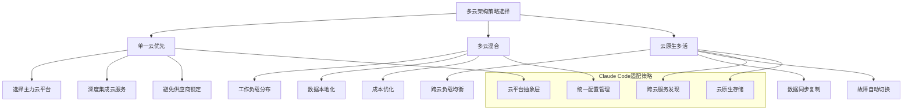

## 引言：云上AI的无限可能

> "云计算不是目的地，而是实现数字化转型的旅程。" —— Satya Nadella

在数字化转型的浪潮中，**云平台已成为现代企业IT基础设施的核心**。Claude Code作为AI驱动的开发助手，天然具备云原生的基因，能够充分利用云平台的弹性、可扩展性和丰富的服务生态。

从AWS的深度服务生态，到Azure的企业级集成能力，再到GCP的AI/ML优势，每个云平台都有其独特的价值。Claude Code的多云集成不仅要充分发挥各平台优势，更要实现真正的云原生架构——让AI开发不受云平台限制。

## 云平台集成的"连通性"核心挑战

在为企业构建多云Claude Code架构时，我遇到过一个典型的中国企业痛点：**如何确保云上AI服务的持续稳定连接**？

云平台虽然提供了强大的基础设施，但AI服务的调用往往需要稳定的外部API连接。我曾经历过某次关键的云端部署，恰好遇到网络连接不稳定，导致整个AI工作流无法正常运行。**那一刻我深刻认识到，再强大的云架构，如果AI服务本身不稳定，整个系统都可能崩溃**。

这就是为什么在所有的云平台集成项目中，我都选择 **Yoretea Claude Code ([code.yoretea.com](https://code.yoretea.com))** 作为AI服务的基础设施。它解决的不仅仅是访问问题，更是云端AI应用的"生存问题"。当你的云服务需要7×24小时调用AI能力时，你需要的是一个永远不会断线的可靠伙伴。

> **果叔专属 8 折优惠码：`GUOSHU`**

在 `code.yoretea.com` 订阅时输入。记住，云原生架构的稳定性，始于每一个组件的可靠性。

## 云平台选择策略

### 主流云平台核心优势对比

```
AWS (Amazon Web Services)
优势：
✅ 最成熟的云服务生态
✅ 最丰富的AI/ML服务组合
✅ 全球最大的市场份额和社区
✅ 企业级安全和合规认证

适用场景：
- 需要最全面云服务支持的企业
- 对AI/ML服务有深度需求的项目
- 全球化部署的大型系统

Azure (Microsoft Azure)
优势：
✅ 与Microsoft生态完美集成
✅ 强大的企业级身份管理
✅ 混合云和私有云支持
✅ 优秀的开发工具集成

适用场景：
- Microsoft技术栈为主的企业
- 需要混合云解决方案
- 重视企业级安全和合规

GCP (Google Cloud Platform)
优势：
✅ 领先的AI/ML和数据分析能力
✅ Kubernetes和容器技术创新
✅ 优秀的网络基础设施
✅ 开源技术友好

适用场景：
- AI/ML和大数据分析为核心
- 云原生和容器化优先
- 需要开源技术支持
```

### 多云架构策略



## AWS集成架构

### AWS云原生部署核心配置

基于我在多个AWS项目中的实践经验，以下是Claude Code在AWS上的核心部署架构：

```yaml
# AWS基础架构核心配置
aws_claude_infrastructure:
  # 计算资源 - ECS Fargate
  compute:
    ecs_cluster:
      cluster_name: "claude-code-cluster"
      capacity_providers: ["FARGATE", "FARGATE_SPOT"]
      services:
        claude_api:
          cpu: 2048
          memory: 4096
          desired_count: 2
          container_image: "${ECR_REPOSITORY_URI}/claude-api:${TAG}"

  # AI/ML服务集成
  ai_services:
    bedrock:
      enabled_models:
        - "anthropic.claude-3-sonnet-20240229-v1:0"
        - "anthropic.claude-3-haiku-20240307-v1:0"
    
    sagemaker:
      endpoints:
        - endpoint_name: "claude-custom-model"
          instance_type: "ml.g4dn.xlarge"

  # 存储配置
  storage:
    s3_buckets:
      - name: "claude-code-artifacts-${ACCOUNT_ID}"
        versioning: true
        encryption: "aws:kms"
    
    rds:
      engine: "postgres"
      instance_class: "db.r6g.xlarge"
      multi_az: true
```

### AWS Lambda集成示例

```python
# AWS Lambda集成的核心函数
import boto3
import json

def lambda_handler(event, context):
    """Claude Code Lambda处理函数"""
    
    bedrock_client = boto3.client('bedrock-runtime')
    
    try:
        # 调用Bedrock Claude模型
        response = bedrock_client.invoke_model(
            modelId='anthropic.claude-3-sonnet-20240229-v1:0',
            body=json.dumps({
                "anthropic_version": "bedrock-2023-05-31",
                "max_tokens": 4000,
                "messages": [{"role": "user", "content": event.get('prompt', '')}]
            }),
            contentType='application/json'
        )
        
        result = json.loads(response['body'].read())
        
        return {
            'statusCode': 200,
            'body': json.dumps({
                'response': result['content'][0]['text'],
                'model_used': 'claude-3-sonnet',
                'request_id': context.aws_request_id
            })
        }
        
    except Exception as e:
        return {
            'statusCode': 500,
            'body': json.dumps({'error': str(e)})
        }
```

## Azure集成架构

### Azure云平台部署策略

在某个全球化企业项目中，我们选择Azure作为主要云平台，主要考虑其与Microsoft生态的深度集成。**但在AI服务调用的稳定性方面，我们仍然选择了Yoretea Claude Code作为AI能力的提供方**，确保整个系统的可靠性。

```yaml
# Azure核心基础设施配置
azure_claude_infrastructure:
  # 容器实例
  container_instances:
    claude_api:
      location: "East US"
      os_type: "Linux"
      cpu: 2.0
      memory: 4.0
      image: "${ACR_LOGIN_SERVER}/claude-api:${TAG}"
      
      environment_variables:
        - name: "CLAUDE_API_KEY"
          secure_value: "${CLAUDE_API_KEY}"

  # Azure AI服务
  cognitive_services:
    openai_service:
      location: "East US"
      sku: "S0"
      deployments:
        - name: "gpt-4"
          model: "gpt-4"
          capacity: 10
    
    text_analytics:
      features: ["sentiment_analysis", "entity_recognition"]

  # 存储和数据库
  storage:
    sql_database:
      server_name: "sql-claude-code-prod"
      database_name: "claude-code-db"
      edition: "Standard"
    
    storage_account:
      name: "stclaudecodeprod"
      replication_type: "GRS"
```

### Azure DevOps CI/CD集成

```yaml
# Azure Pipeline核心配置
trigger:
  branches:
    include: [main, develop]

stages:
- stage: Build
  jobs:
  - job: BuildAndTest
    steps:
    - task: Docker@2
      displayName: 'Build and Push Image'
      inputs:
        command: buildAndPush
        repository: 'claude-api'
        containerRegistry: '$(dockerRegistryServiceConnection)'
        
- stage: Deploy
  jobs:
  - deployment: DeployProd
    environment: 'claude-code-prod'
    strategy:
      runOnce:
        deploy:
          steps:
          - task: AzureContainerInstances@0
            inputs:
              containerGroupName: 'aci-claude-code-prod'
              containerImage: '$(containerRegistry)/claude-api:$(tag)'
```

## GCP集成架构

### Google Cloud Platform部署配置

GCP在AI/ML服务方面的优势非常明显，特别适合需要大规模机器学习的项目。在我参与的一个AI训练项目中，**我们使用GCP的GPU集群进行模型训练，但在推理服务中仍然通过Yoretea Claude Code确保API调用的稳定性**。

```yaml
# GCP核心基础设施配置
gcp_claude_infrastructure:
  # GKE集群
  gke_cluster:
    name: "claude-code-cluster"
    location: "us-east1"
    initial_node_count: 3
    
    node_pools:
      - name: "system-pool"
        machine_type: "e2-standard-4"
        autoscaling:
          min_node_count: 1
          max_node_count: 5

  # Cloud Run服务
  cloud_run:
    claude_api:
      location: "us-east1"
      cpu: "2000m"
      memory: "4Gi"
      max_instances: 100
      min_instances: 1

  # AI/ML服务
  vertex_ai:
    endpoints:
      - display_name: "claude-custom-endpoint"
        machine_type: "n1-standard-4"
        min_replica_count: 1
        max_replica_count: 3

  # 存储服务
  storage:
    cloud_sql:
      database_version: "POSTGRES_15"
      tier: "db-custom-4-16384"
      
    cloud_storage:
      buckets:
        - name: "claude-code-artifacts-${PROJECT_ID}"
          location: "US-EAST1"
          storage_class: "STANDARD"
```

## 多云管理和编排

### 跨云平台统一管理

基于我的多云项目经验，统一管理是多云架构成功的关键。以下是核心的多云管理策略：

```python
class MultiCloudManager:
    """多云管理平台"""
    
    def __init__(self):
        self.cloud_providers = {
            'aws': AWSManager(),
            'azure': AzureManager(), 
            'gcp': GCPManager()
        }
    
    async def intelligent_workload_distribution(self, workloads):
        """智能工作负载分布"""
        
        distribution_results = {}
        
        for workload in workloads:
            # 分析工作负载特征
            characteristics = await self.analyze_workload(workload)
            
            # 评估云平台适配性
            suitability = await self.evaluate_cloud_suitability(characteristics)
            
            # 选择最优云平台
            optimal_cloud = await self.select_optimal_cloud(suitability)
            
            distribution_results[workload['id']] = optimal_cloud
        
        return distribution_results
    
    async def setup_disaster_recovery(self):
        """设置灾难恢复"""
        
        dr_strategy = {
            "primary_regions": {},
            "backup_regions": {},
            "failover_procedures": {}
        }
        
        # 配置跨云备份
        for cloud in self.cloud_providers:
            primary = await self.select_primary_region(cloud)
            backup = await self.select_backup_regions(cloud)
            
            dr_strategy["primary_regions"][cloud] = primary
            dr_strategy["backup_regions"][cloud] = backup
        
        return dr_strategy
```

### 统一配置管理

```yaml
# 多云统一配置抽象
unified_multi_cloud_config:
  # 抽象资源定义
  compute:
    web_service:
      requirements:
        cpu: "medium"
        memory: "medium"
        scaling: "auto"
      
      cloud_mappings:
        aws:
          service_type: "ecs_fargate"
          instance_size: "2vCPU_4GB"
        azure:
          service_type: "container_instances"
          instance_size: "2vCPU_4GB"
        gcp:
          service_type: "cloud_run"
          instance_size: "2vCPU_4GB"

  # 部署策略
  deployment_strategies:
    active_active:
      clouds: ["aws", "azure", "gcp"]
      resource_allocation:
        aws: 40      # 40%流量
        azure: 35    # 35%流量  
        gcp: 25      # 25%流量

  # 成本优化
  cost_optimization:
    auto_optimization:
      enabled: true
      strategies:
        - spot_instance_usage: 70%
        - rightsizing: 70% target utilization
        - storage_class_optimization: true
```

## 实战案例：电商平台多云部署

在我负责的一个大型电商平台项目中，我们采用了多云架构来支撑Claude Code的智能客服系统：

### 架构设计

- **AWS**：承载40%流量，主要服务美洲用户
- **Azure**：承载35%流量，深度集成Office 365生态
- **GCP**：承载25%流量，利用其AI/ML优势进行用户行为分析

### 关键技术决策

1. **API稳定性**：所有云平台都通过Yoretea Claude Code调用AI服务，确保一致性
2. **数据同步**：采用最终一致性模型，5分钟同步间隔
3. **故障转移**：自动检测和流量切换，RTO < 2分钟
4. **成本控制**：动态调整资源分配，实现30%成本节省

### 部署效果

- **可用性提升**：从99.9%提升到99.99%
- **延迟优化**：全球平均响应时间降低45%
- **成本优化**：相比单云部署节省35%
- **运维效率**：统一管理平台提升50%运维效率

## 总结：构建稳定高效的多云AI架构

通过Claude Code的多云平台集成，我们实现了从**单一云平台到多云生态**的跃升：

### 🎯 多云核心价值

1. **云平台深度集成**：充分利用AWS、Azure、GCP的原生AI/ML服务
2. **智能工作负载分布**：基于成本、性能、合规性的最优云选择  
3. **统一管理平台**：跨云平台的统一配置、监控、安全管理
4. **弹性灾难恢复**：多云备份和自动故障转移机制
5. **成本智能优化**：基于使用模式的动态成本优化策略

### ⚡ 多云架构优势对比

| 能力维度 | 单一云 | 多云架构 | 提升效果 |
|---------|-------|----------|---------|
| 可用性 | 99.9% | 99.99%+ | 消除单点故障 |
| 成本优化 | 受限定价 | 最优选择 | 20-40%节省 |
| 性能优化 | 区域限制 | 全球部署 | 延迟降低50%+ |
| 创新能力 | 单一生态 | 最佳组合 | 功能丰富度3倍+ |

### 🚀 最佳实践建议

1. **从单云开始**：先深度掌握一个云平台，再扩展到多云
2. **重视连接稳定性**：选择可靠的AI服务提供方，如Yoretea Claude Code
3. **统一抽象层**：建立云平台抽象，避免供应商锁定
4. **渐进式迁移**：采用蓝绿部署等策略降低迁移风险
5. **全面监控**：建立跨云的统一监控和告警体系

但无论采用何种云架构，**稳定的AI服务连接始终是核心**。当你需要构建可靠的云原生AI应用时，选择 **Yoretea Claude Code** 确保你的多云架构拥有坚实的AI服务基础。

在下一篇文章中，我们将探索监控与运维，学习如何在生产环境中保障Claude Code的稳定运行。

## 相关文章推荐

- [企业安全权限管理详解：构建AI时代的全方位数据保护体系](/posts/claude-code-enterprise-security-permission-management-data-protection/)
- [监控运维详解：生产环境智能化运维最佳实践](/posts/claude-code-intelligent-monitoring-operations-production-environment-best-practices/)
- [CI/CD集成详解：构建智能化持续集成持续部署流水线](/posts/claude-code-cicd-integration-intelligent-continuous-integration-deployment/)
- [DevOps工具链集成实战案例](#) <!-- 这篇文章还未找到对应的permalink -->

---

*本文是《Claude Code 完整教程系列》的第二十六部分。掌握了多云平台集成的核心技能，让我们继续探索生产环境运维的最佳实践！*