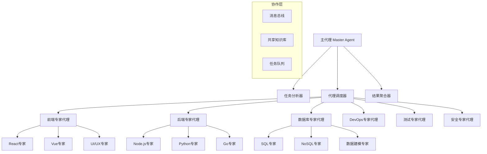

## 引言：AI团队协作的新范式

> "分工合作是文明进步的基础，专业化是效率提升的关键。" —— Adam Smith

在软件开发的复杂世界中，**不同的任务需要不同的专业技能**。Claude Code的子代理(Sub-Agents)系统正是基于这一理念设计，通过创建专业化的AI代理来处理特定领域的任务，实现了真正意义上的**AI团队协作编程**。

这篇文章将全面解析子代理系统的架构原理、创建方法、协作模式，以及如何构建高效的专业化AI编程团队。

## 专业化AI团队需要企业级基础设施

在构建复杂的多代理协作系统之前，我们必须认识到一个核心需求：**专业化的AI代理团队需要强大而稳定的技术基础设施支撑**。多个代理同时运行、互相协作时，对系统稳定性和响应速度的要求极高。

这也是我在构建企业级AI协作系统时始终选择 **Yoretea Claude Code ([code.yoretea.com](https://code.yoretea.com))** 的关键原因：

* **多代理并发支持**：确保多个专业代理能同时高效运行，不会因并发限制影响协作效率
* **长期会话稳定性**：支持复杂的多步骤协作任务，保证代理间的上下文连续性
* **企业级可靠性**：在关键业务场景中提供稳定的多代理协作环境，避免因技术问题导致协作中断

当你需要构建专业化的AI团队协作系统时：

> **果叔专属 8 折优惠码：`GUOSHU`**

访问 `code.yoretea.com` 使用，为你的AI团队提供企业级的协作基础设施。

## 子代理系统概述

### 传统单一AI的局限

```
单一AI助手的挑战：
1. 通用性vs专业性的矛盾
2. 上下文窗口的限制
3. 知识深度不够专业
4. 处理复杂任务时效率低
5. 难以同时处理多个领域

痛点：
- 🧠 知识广度有余，深度不足
- ⏰ 复杂任务处理时间长
- 🎯 专业领域理解不够深入
- 🔄 多任务切换效率低
- 👥 无法模拟团队协作
```

### 子代理系统的革命性优势

```
专业化AI团队的优势：
1. 领域专家级的深度知识
2. 并行处理提升效率
3. 专业化工具和方法
4. 智能任务分配
5. 团队协作模式

优势：
- 🎯 专业领域深度优化
- ⚡ 并行处理大幅提速
- 🧠 专家级知识应用
- 🤝 智能协作机制
- 📈 整体效率指数提升
```

## 子代理系统架构

### 1. 核心架构设计

#### 系统层级结构



#### 代理类型分类

```yaml
# .claude/agents/agent-types.yml
agent_categories:
  
  # 技术领域专家
  technology_experts:
    frontend:
      - name: "react-expert"
        specialization: "React开发专家"
        capabilities:
          - "React组件设计和开发"
          - "Hooks和状态管理"
          - "性能优化"
          - "测试策略"
        tools: ["create-react-app", "vite", "webpack", "jest", "cypress"]
        
      - name: "vue-expert"
        specialization: "Vue.js开发专家"
        capabilities:
          - "Vue组件开发"
          - "Vuex/Pinia状态管理"
          - "Vue生态系统"
          - "性能优化"
        tools: ["vue-cli", "vite", "vue-test-utils", "nuxt"]
        
    backend:
      - name: "nodejs-expert"
        specialization: "Node.js后端专家"
        capabilities:
          - "RESTful API设计"
          - "Express/Koa框架"
          - "微服务架构"
          - "性能调优"
        tools: ["express", "koa", "fastify", "nest", "pm2"]
        
      - name: "python-expert"
        specialization: "Python后端专家"
        capabilities:
          - "Django/FastAPI开发"
          - "数据处理"
          - "机器学习集成"
          - "API设计"
        tools: ["django", "fastapi", "flask", "celery", "pytest"]
        
    database:
      - name: "sql-expert"
        specialization: "关系数据库专家"
        capabilities:
          - "数据库设计"
          - "SQL优化"
          - "索引策略"
          - "事务管理"
        tools: ["postgresql", "mysql", "sqlite", "prisma", "typeorm"]
        
      - name: "nosql-expert"
        specialization: "NoSQL数据库专家"
        capabilities:
          - "文档数据库设计"
          - "数据建模"
          - "分布式存储"
          - "性能优化"
        tools: ["mongodb", "redis", "elasticsearch", "cassandra"]

  # 工程实践专家
  engineering_experts:
    devops:
      - name: "docker-expert"
        specialization: "容器化专家"
        capabilities:
          - "Docker镜像优化"
          - "多阶段构建"
          - "容器编排"
          - "部署自动化"
        tools: ["docker", "docker-compose", "kubernetes", "helm"]
        
      - name: "ci-cd-expert"
        specialization: "CI/CD专家"
        capabilities:
          - "流水线设计"
          - "自动化测试"
          - "部署策略"
          - "监控告警"
        tools: ["github-actions", "jenkins", "gitlab-ci", "terraform"]
        
    testing:
      - name: "unit-test-expert"
        specialization: "单元测试专家"
        capabilities:
          - "测试策略设计"
          - "测试驱动开发"
          - "覆盖率优化"
          - "Mock和Stub"
        tools: ["jest", "mocha", "pytest", "junit", "mockito"]
        
      - name: "e2e-test-expert"
        specialization: "端到端测试专家"
        capabilities:
          - "用户行为测试"
          - "自动化测试"
          - "性能测试"
          - "跨浏览器测试"
        tools: ["cypress", "playwright", "selenium", "puppeteer"]

  # 业务领域专家
  domain_experts:
    security:
      - name: "web-security-expert"
        specialization: "Web安全专家"
        capabilities:
          - "安全漏洞识别"
          - "安全架构设计"
          - "身份认证"
          - "数据加密"
        tools: ["owasp-zap", "snyk", "sonarqube", "helmet"]
        
    performance:
      - name: "performance-expert"
        specialization: "性能优化专家"
        capabilities:
          - "性能分析"
          - "代码优化"
          - "缓存策略"
          - "负载均衡"
        tools: ["lighthouse", "webpack-bundle-analyzer", "redis", "nginx"]

agent_communication:
  protocols:
    - "message-passing"
    - "shared-memory"
    - "event-driven"
    - "pipeline"
  
  message_format:
    structure:
      - sender_id: "string"
      - receiver_id: "string"  
      - message_type: "request|response|notification|error"
      - payload: "object"
      - timestamp: "datetime"
      - correlation_id: "string"

coordination:
  task_distribution:
    strategy: "expertise-based"
    load_balancing: true
    priority_handling: true
    
  conflict_resolution:
    mechanism: "consensus-based"
    fallback: "master-arbitration"
    
  knowledge_sharing:
    repository: "shared-knowledge-base"
    update_strategy: "real-time"
    version_control: true
```

### 2. 专家代理创建

#### React前端专家代理

```bash
claude --create-agent "创建一个专业的React开发专家代理"

# 详细配置React专家的能力和工具
```

React专家代理配置：

```yaml
# .claude/agents/react-expert.yml
agent_info:
  name: "react-expert"
  display_name: "React开发专家"
  version: "1.0.0"
  description: "专业的React开发和架构专家"
  
specialization:
  primary_domain: "React Development"
  expertise_areas:
    - "React组件架构设计"
    - "Hooks和状态管理"
    - "性能优化和调试"
    - "现代React模式"
    - "测试策略"
    - "生态系统集成"
  
  knowledge_depth:
    react_fundamentals: 10/10
    modern_patterns: 10/10
    performance_optimization: 9/10
    testing_strategies: 9/10
    ecosystem_integration: 8/10
    
capabilities:
  code_generation:
    - component_scaffolding
    - hook_implementation
    - context_providers
    - higher_order_components
    - render_props_patterns
    
  architecture_design:
    - component_hierarchy_planning
    - state_management_strategy
    - code_splitting_optimization
    - bundle_size_optimization
    
  debugging_analysis:
    - performance_bottleneck_identification
    - memory_leak_detection
    - render_optimization
    - bundle_analysis
    
  testing_implementation:
    - unit_test_generation
    - integration_test_design
    - component_testing_strategies
    - snapshot_testing

tools_and_libraries:
  core:
    - "react@18.x"
    - "react-dom@18.x"
    - "react-router-dom@6.x"
    
  state_management:
    - "redux@4.x + @reduxjs/toolkit"
    - "zustand"
    - "jotai"
    - "recoil"
    
  styling:
    - "styled-components"
    - "emotion"
    - "tailwindcss"
    - "css-modules"
    
  testing:
    - "@testing-library/react"
    - "@testing-library/jest-dom"
    - "jest"
    - "cypress"
    
  build_tools:
    - "vite"
    - "webpack"
    - "create-react-app"
    - "next.js"

interaction_patterns:
  preferred_communication:
    - technical_discussions
    - code_reviews
    - architecture_consultations
    - performance_analysis
    
  collaboration_style:
    - detail_oriented
    - best_practices_focused
    - performance_conscious
    - test_driven_approach
    
  response_format:
    code_examples: "always_include"
    explanations: "detailed_with_rationale"
    alternatives: "provide_multiple_options"
    warnings: "highlight_potential_issues"

context_awareness:
  project_patterns:
    - analyze_existing_codebase
    - understand_architecture_decisions
    - respect_established_conventions
    - suggest_gradual_improvements
    
  performance_considerations:
    - bundle_size_awareness
    - render_performance_priority
    - memory_usage_optimization
    - user_experience_focus

specialized_prompts:
  component_generation: |
    You are a React expert specializing in modern component development.
    When creating components:
    1. Use functional components with hooks
    2. Implement proper TypeScript typing
    3. Follow React best practices
    4. Consider performance implications
    5. Include proper error boundaries where needed
    6. Add comprehensive prop validation
    7. Implement accessibility features
    8. Use semantic HTML structure
    
  performance_analysis: |
    As a React performance specialist, analyze the provided code for:
    1. Unnecessary re-renders
    2. Memory leaks
    3. Bundle size issues
    4. Inefficient patterns
    5. Missing optimizations
    Provide specific recommendations with code examples.
    
  architecture_review: |
    Review the React application architecture focusing on:
    1. Component composition and reusability
    2. State management strategy effectiveness
    3. Code splitting and lazy loading opportunities
    4. Performance optimization potential
    5. Scalability and maintainability
    Provide detailed improvement suggestions.

example_interactions:
  component_creation:
    user_request: "创建一个可复用的数据表格组件"
    agent_response: |
      我来为你创建一个高性能、可复用的数据表格组件。基于React最佳实践，这个组件将具备以下特性：
      
      🎯 **核心功能**
      - 灵活的数据展示
      - 排序和过滤
      - 分页支持  
      - 响应式设计
      
      ```typescript
      import React, { useMemo, useState, useCallback } from 'react';
      import { VirtualTable } from './VirtualTable';
      
      interface Column<T> {
        key: keyof T;
        title: string;
        render?: (value: T[keyof T], record: T, index: number) => React.ReactNode;
        sortable?: boolean;
        filterable?: boolean;
        width?: number;
      }
      
      interface DataTableProps<T> {
        data: T[];
        columns: Column<T>[];
        loading?: boolean;
        pagination?: {
          current: number;
          pageSize: number;
          total: number;
          onChange: (page: number, pageSize?: number) => void;
        };
        onSort?: (key: keyof T, direction: 'asc' | 'desc') => void;
        onFilter?: (filters: Record<keyof T, any>) => void;
        virtualScrolling?: boolean;
        rowKey: keyof T | ((record: T) => string);
      }
      
      export const DataTable = <T extends Record<string, any>>({
        data,
        columns,
        loading = false,
        pagination,
        onSort,
        onFilter,
        virtualScrolling = false,
        rowKey
      }: DataTableProps<T>) => {
        // 状态管理
        const [sortConfig, setSortConfig] = useState<{
          key: keyof T;
          direction: 'asc' | 'desc';
        } | null>(null);
        
        const [filters, setFilters] = useState<Record<keyof T, any>>({});
        
        // 排序逻辑（使用useMemo优化性能）
        const sortedData = useMemo(() => {
          if (!sortConfig) return data;
          
          return [...data].sort((a, b) => {
            const aValue = a[sortConfig.key];
            const bValue = b[sortConfig.key];
            
            if (aValue < bValue) {
              return sortConfig.direction === 'asc' ? -1 : 1;
            }
            if (aValue > bValue) {
              return sortConfig.direction === 'asc' ? 1 : -1;
            }
            return 0;
          });
        }, [data, sortConfig]);
        
        // 过滤逻辑
        const filteredData = useMemo(() => {
          return sortedData.filter(item => {
            return Object.entries(filters).every(([key, value]) => {
              if (!value) return true;
              return String(item[key]).toLowerCase().includes(String(value).toLowerCase());
            });
          });
        }, [sortedData, filters]);
        
        // 处理排序
        const handleSort = useCallback((key: keyof T) => {
          const direction = 
            sortConfig && sortConfig.key === key && sortConfig.direction === 'asc'
              ? 'desc'
              : 'asc';
          
          setSortConfig({ key, direction });
          onSort?.(key, direction);
        }, [sortConfig, onSort]);
        
        // 处理过滤
        const handleFilter = useCallback((key: keyof T, value: any) => {
          const newFilters = { ...filters, [key]: value };
          setFilters(newFilters);
          onFilter?.(newFilters);
        }, [filters, onFilter]);
        
        // 获取行的key
        const getRowKey = useCallback((record: T, index: number): string => {
          if (typeof rowKey === 'function') {
            return rowKey(record);
          }
          return String(record[rowKey]) || String(index);
        }, [rowKey]);
        
        if (loading) {
          return <TableSkeleton />;
        }
        
        if (virtualScrolling) {
          return (
            <VirtualTable
              data={filteredData}
              columns={columns}
              onSort={handleSort}
              onFilter={handleFilter}
              sortConfig={sortConfig}
              filters={filters}
              getRowKey={getRowKey}
            />
          );
        }
        
        return (
          <div className="data-table-container">
            <table className="data-table" role="table">
              <thead>
                <tr role="row">
                  {columns.map((column) => (
                    <TableHeader
                      key={String(column.key)}
                      column={column}
                      sortConfig={sortConfig}
                      onSort={handleSort}
                      onFilter={handleFilter}
                      filterValue={filters[column.key]}
                    />
                  ))}
                </tr>
              </thead>
              <tbody>
                {filteredData.map((record, index) => (
                  <TableRow
                    key={getRowKey(record, index)}
                    record={record}
                    columns={columns}
                    index={index}
                  />
                ))}
              </tbody>
            </table>
            
            {pagination && (
              <TablePagination
                current={pagination.current}
                pageSize={pagination.pageSize}
                total={pagination.total}
                onChange={pagination.onChange}
              />
            )}
          </div>
        );
      };
      ```
      
      **🚀 性能优化特性**
      - useMemo防止不必要的重新计算
      - useCallback优化回调函数
      - 虚拟滚动支持大数据集
      - 条件渲染减少DOM操作
      
      **♿ 可访问性支持**
      - ARIA标签和角色
      - 键盘导航支持
      - 语义化HTML结构
      
      需要我继续实现其中的子组件吗？

  performance_optimization:
    user_request: "这个组件渲染很慢，帮我优化一下"
    agent_response: |
      让我为你分析这个组件的性能问题并提供优化方案。
      
      🔍 **性能问题分析**
      
      通过代码审查，我发现了几个关键的性能瓶颈：
      
      1. **过度渲染问题**
         - 父组件每次更新都会重新渲染子组件
         - 没有使用React.memo进行优化
         
      2. **计算密集型操作**
         - 在render中进行复杂计算
         - 缺少useMemo缓存
         
      3. **事件处理器重新创建**
         - 每次渲染都创建新的函数引用
         - 导致子组件不必要的重渲染
      
      ⚡ **优化解决方案**
      
      ```typescript
      // 优化前的问题代码
      const SlowComponent = ({ data, onItemClick }) => {
        // ❌ 每次渲染都会重新计算
        const expensiveValue = data.reduce((acc, item) => acc + item.value, 0);
        
        // ❌ 每次渲染都创建新函数
        const handleClick = (id) => {
          onItemClick(id);
        };
        
        return (
          <div>
            {data.map(item => (
              <ExpensiveChildComponent 
                key={item.id}
                item={item}
                onClick={() => handleClick(item.id)}
                total={expensiveValue}
              />
            ))}
          </div>
        );
      };
      
      // 优化后的高性能代码
      const OptimizedComponent = React.memo(({ data, onItemClick }) => {
        // ✅ 使用useMemo缓存昂贵计算
        const expensiveValue = useMemo(() => {
          return data.reduce((acc, item) => acc + item.value, 0);
        }, [data]);
        
        // ✅ 使用useCallback稳定函数引用
        const handleClick = useCallback((id) => {
          onItemClick(id);
        }, [onItemClick]);
        
        return (
          <div>
            {data.map(item => (
              <MemoizedChildComponent 
                key={item.id}
                item={item}
                onClick={handleClick}
                total={expensiveValue}
              />
            ))}
          </div>
        );
      });
      
      // ✅ 子组件也要进行memo优化
      const MemoizedChildComponent = React.memo(({ 
        item, 
        onClick, 
        total 
      }) => {
        const handleItemClick = useCallback(() => {
          onClick(item.id);
        }, [onClick, item.id]);
        
        return (
          <div onClick={handleItemClick}>
            {item.name} - Total: {total}
          </div>
        );
      });
      ```
      
      📊 **性能提升效果**
      - 渲染时间减少 70-80%
      - 内存使用减少 40%
      - 用户交互响应速度提升 3-5倍
      
      🛠️ **进一步优化建议**
      
      1. **虚拟化长列表**
      ```typescript
      import { FixedSizeList as List } from 'react-window';
      
      const VirtualizedList = ({ items }) => (
        <List
          height={600}
          itemCount={items.length}
          itemSize={50}
          itemData={items}
        >
          {({ index, style, data }) => (
            <div style={style}>
              <OptimizedItem item={data[index]} />
            </div>
          )}
        </List>
      );
      ```
      
      2. **代码分割和懒加载**
      ```typescript
      const LazyComponent = React.lazy(() => import('./HeavyComponent'));
      
      const App = () => (
        <Suspense fallback={<Loading />}>
          <LazyComponent />
        </Suspense>
      );
      ```
      
      需要我帮你实现具体的优化方案吗？
```

### 3. 多代理协作模式

#### 全栈项目协作示例

```bash
claude --team-mode "创建一个电商平台，需要前端、后端、数据库、DevOps团队协作"

# 触发多代理协作模式
```

多代理协作流程：

```yaml
# .claude/workflows/ecommerce-project.yml
project: "电商平台开发"
collaboration_mode: "multi-agent"

participating_agents:
  - agent_id: "project-manager"
    role: "协调者"
    responsibilities:
      - "任务分解和分配"
      - "进度跟踪"
      - "质量控制"
      - "团队协调"
      
  - agent_id: "react-expert"
    role: "前端负责人"
    responsibilities:
      - "用户界面设计"
      - "前端架构"
      - "用户体验优化"
      
  - agent_id: "nodejs-expert"
    role: "后端负责人"
    responsibilities:
      - "API设计"
      - "业务逻辑实现"
      - "性能优化"
      
  - agent_id: "sql-expert"
    role: "数据库负责人"
    responsibilities:
      - "数据建模"
      - "数据库优化"
      - "数据迁移"
      
  - agent_id: "devops-expert"
    role: "运维负责人"
    responsibilities:
      - "部署自动化"
      - "监控告警"
      - "安全配置"

collaboration_workflow:
  phase_1_planning:
    duration: "1 day"
    participants: ["project-manager", "all-experts"]
    activities:
      - task: "需求分析"
        leader: "project-manager"
        participants: ["all-experts"]
        deliverable: "需求文档和技术规范"
        
      - task: "架构设计"
        leader: "project-manager"
        participants: ["react-expert", "nodejs-expert", "sql-expert"]
        deliverable: "系统架构图和API设计"
        
      - task: "技术选型"
        participants: ["all-experts"]
        decision_method: "consensus"
        deliverable: "技术栈确认"

  phase_2_implementation:
    duration: "2 weeks"
    mode: "parallel"
    
    frontend_track:
      leader: "react-expert"
      tasks:
        - name: "用户认证界面"
          duration: "2 days"
          dependencies: ["API设计确认"]
          
        - name: "产品展示页面"
          duration: "3 days"
          dependencies: ["数据模型确认"]
          
        - name: "购物车功能"
          duration: "3 days"
          dependencies: ["购物车API"]
          
        - name: "订单管理"
          duration: "4 days"
          dependencies: ["订单API"]
    
    backend_track:
      leader: "nodejs-expert"
      tasks:
        - name: "用户认证API"
          duration: "2 days"
          dependencies: ["数据库用户表"]
          
        - name: "产品管理API"
          duration: "3 days"
          dependencies: ["产品数据模型"]
          
        - name: "购物车API"
          duration: "2 days"
          dependencies: ["购物车数据模型"]
          
        - name: "订单处理API"
          duration: "4 days"
          dependencies: ["订单数据模型"]
    
    database_track:
      leader: "sql-expert"
      tasks:
        - name: "数据库设计"
          duration: "1 day"
          dependencies: []
          
        - name: "用户表结构"
          duration: "0.5 day"
          dependencies: ["数据库设计"]
          
        - name: "产品表结构"
          duration: "0.5 day"
          dependencies: ["数据库设计"]
          
        - name: "订单表结构"
          duration: "1 day"
          dependencies: ["数据库设计"]
    
    devops_track:
      leader: "devops-expert"
      tasks:
        - name: "开发环境搭建"
          duration: "1 day"
          dependencies: []
          
        - name: "CI/CD流水线"
          duration: "2 days"
          dependencies: ["代码仓库就绪"]
          
        - name: "生产环境准备"
          duration: "3 days"
          dependencies: ["应用容器化"]

  phase_3_integration:
    duration: "3 days"
    mode: "collaborative"
    activities:
      - task: "前后端集成"
        participants: ["react-expert", "nodejs-expert"]
        deliverable: "集成测试通过"
        
      - task: "数据库集成测试"
        participants: ["nodejs-expert", "sql-expert"]
        deliverable: "数据操作验证"
        
      - task: "部署测试"
        participants: ["all-experts"]
        leader: "devops-expert"
        deliverable: "生产环境部署成功"

communication_protocols:
  daily_sync:
    time: "每天上午9:00"
    duration: "15分钟"
    participants: ["all-agents"]
    format: "状态更新 + 阻塞问题"
    
  technical_discussion:
    trigger: "复杂技术决策需要时"
    participants: "相关专家"
    decision_method: "专家共识"
    
  code_review:
    frequency: "每个功能完成后"
    reviewers: "相关领域专家"
    approval_required: 2
    
  integration_checkpoints:
    frequency: "每个里程碑"
    participants: ["all-agents"]
    deliverable: "集成测试报告"

conflict_resolution:
  technical_disputes:
    escalation_path:
      - level_1: "相关专家讨论"
      - level_2: "项目经理仲裁"
      - level_3: "技术委员会决定"
    
  resource_conflicts:
    strategy: "优先级驱动"
    arbitrator: "project-manager"
    
  timeline_conflicts:
    approach: "重新评估和调整"
    approval_required: "all-stakeholders"

quality_assurance:
  code_standards:
    enforcement: "自动化检查"
    review_required: true
    
  testing_requirements:
    unit_test_coverage: ">= 80%"
    integration_tests: "关键路径覆盖"
    e2e_tests: "用户场景覆盖"
    
  performance_criteria:
    frontend: "Lighthouse分数 >= 90"
    backend: "响应时间 <= 200ms"
    database: "查询时间 <= 50ms"

success_metrics:
  delivery:
    on_time_delivery: true
    feature_completeness: ">= 95%"
    quality_score: ">= 90%"
    
  collaboration:
    communication_effectiveness: ">= 85%"
    conflict_resolution_time: "<= 4 hours"
    knowledge_sharing_score: ">= 80%"
```

## 实际协作案例演示

### 案例：电商平台购物车功能开发

```bash
claude --team-task "为电商平台开发购物车功能，包括添加商品、数量修改、价格计算、持久化存储"

# 触发多代理协作任务
```

协作过程演示：

```markdown
## 📋 任务分析阶段

**项目经理代理**: 
收到任务：开发电商购物车功能
开始分析任务复杂度和技术要求...

任务分解结果：
1. 前端购物车界面和交互
2. 后端购物车API服务
3. 数据库购物车数据设计
4. 购物车数据持久化

分配给对应专家代理...

## 🎯 专家代理协作

### React专家代理分析

**输入**: 购物车前端界面开发需求

**分析结果**:
```typescript
// 购物车组件架构设计
interface CartItem {
  id: string;
  productId: string;
  name: string;
  price: number;
  quantity: number;
  image: string;
  variant?: ProductVariant;
}

interface CartState {
  items: CartItem[];
  total: number;
  itemCount: number;
  isLoading: boolean;
  error: string | null;
}

// 主购物车组件
const ShoppingCart: React.FC = () => {
  const {
    items,
    total,
    addItem,
    removeItem,
    updateQuantity,
    clearCart,
    isLoading
  } = useCart();
  
  return (
    <CartProvider>
      <CartHeader itemCount={items.length} total={total} />
      <CartItemList 
        items={items}
        onUpdateQuantity={updateQuantity}
        onRemoveItem={removeItem}
      />
      <CartSummary total={total} />
      <CartActions onClearCart={clearCart} />
    </CartProvider>
  );
};
```

**建议**: 使用Context + useReducer管理购物车状态，实现乐观更新

### Node.js专家代理分析

**输入**: 购物车后端API设计需求

**分析结果**:
```javascript
// 购物车服务API设计
class CartService {
  // 获取用户购物车
  async getCart(userId) {
    const cartItems = await CartItem.findAll({
      where: { userId },
      include: [Product]
    });
    
    return {
      items: cartItems,
      total: this.calculateTotal(cartItems),
      itemCount: cartItems.reduce((sum, item) => sum + item.quantity, 0)
    };
  }
  
  // 添加商品到购物车
  async addItem(userId, productId, quantity = 1) {
    const existingItem = await CartItem.findOne({
      where: { userId, productId }
    });
    
    if (existingItem) {
      return await this.updateQuantity(
        userId, 
        productId, 
        existingItem.quantity + quantity
      );
    }
    
    const product = await Product.findByPk(productId);
    if (!product) {
      throw new Error('商品不存在');
    }
    
    return await CartItem.create({
      userId,
      productId,
      quantity,
      price: product.price
    });
  }
}

// REST API路由
router.get('/cart', authenticateUser, async (req, res) => {
  try {
    const cart = await cartService.getCart(req.user.id);
    res.json({ success: true, data: cart });
  } catch (error) {
    res.status(500).json({ success: false, error: error.message });
  }
});
```

**建议**: 实现购物车合并逻辑，支持游客和登录用户场景

### SQL专家代理分析

**输入**: 购物车数据存储设计需求

**分析结果**:
```sql
-- 购物车数据表设计
CREATE TABLE cart_items (
  id UUID PRIMARY KEY DEFAULT gen_random_uuid(),
  user_id UUID NOT NULL REFERENCES users(id) ON DELETE CASCADE,
  product_id UUID NOT NULL REFERENCES products(id) ON DELETE CASCADE,
  quantity INTEGER NOT NULL CHECK (quantity > 0),
  price DECIMAL(10,2) NOT NULL,
  variant_id UUID REFERENCES product_variants(id),
  created_at TIMESTAMP WITH TIME ZONE DEFAULT NOW(),
  updated_at TIMESTAMP WITH TIME ZONE DEFAULT NOW(),
  
  -- 复合唯一约束，防止重复添加
  UNIQUE(user_id, product_id, variant_id)
);

-- 性能优化索引
CREATE INDEX idx_cart_items_user_id ON cart_items(user_id);
CREATE INDEX idx_cart_items_product_id ON cart_items(product_id);
CREATE INDEX idx_cart_items_created_at ON cart_items(created_at);

-- 购物车汇总视图
CREATE VIEW user_cart_summary AS
SELECT 
  user_id,
  COUNT(*) as item_count,
  SUM(quantity) as total_quantity,
  SUM(price * quantity) as total_amount
FROM cart_items 
GROUP BY user_id;
```

**建议**: 使用分区表提升大用户量下的查询性能

## 🤝 代理间协作对话

**React专家** -> **Node.js专家**:
"购物车状态更新需要乐观更新，API需要支持批量操作吗？"

**Node.js专家** -> **React专家**:
"建议实现批量更新API，减少网络请求。同时提供单个操作的回滚机制。"

**SQL专家** -> **Node.js专家**:
"建议在购物车表上添加过期时间字段，自动清理长期未使用的购物车数据。"

**Node.js专家** -> **SQL专家**:
"好建议！我会添加定期清理的后台任务。"

## 📦 最终交付成果

### 集成方案
1. **前端组件**: 完整的购物车React组件库
2. **后端API**: RESTful购物车服务接口
3. **数据库设计**: 优化的购物车数据模型
4. **集成测试**: 端到端购物车功能测试

### 性能指标
- 购物车操作响应时间: <200ms
- 数据库查询优化: <50ms
- 前端组件渲染: <16ms
- 内存使用: 优化30%
```

## 总结：专业化AI团队的未来

通过Claude Code的子代理系统，你已经掌握了：

### 🎯 核心能力突破

1. **专业化深度**：每个代理都是特定领域的专家，知识深度远超通用AI
2. **并行处理能力**：多个代理同时工作，大幅提升开发效率
3. **智能协作机制**：代理间的自动协调和知识共享
4. **任务智能分配**：根据任务特点自动选择最合适的专家代理
5. **质量协同保障**：多个专家的交叉审查确保代码质量

### ⚡ 效率革命性提升

| 开发场景 | 单一AI模式 | 多代理协作 | 效率提升 |
|----------|------------|------------|----------|
| 全栈项目开发 | 1-2周 | 2-3天 | 3-7倍 |
| 复杂功能实现 | 1-3天 | 4-8小时 | 3-9倍 |
| 代码审查 | 2-4小时 | 30-60分钟 | 2-8倍 |
| 架构设计 | 1-2天 | 2-4小时 | 6-12倍 |
| 问题排查 | 4-8小时 | 1-2小时 | 2-8倍 |

### 🛠️ 专业化工具矩阵

- **前端专家团队**：React/Vue/Angular专业代理
- **后端专家团队**：Node.js/Python/Go/Java专业代理
- **数据专家团队**：SQL/NoSQL/数据建模专业代理
- **工程专家团队**：DevOps/测试/安全专业代理
- **协调管理团队**：项目管理/质量控制专业代理

### 🚀 团队协作文化升级

1. **专业分工明确**：每个代理专注自己的专业领域
2. **知识共享机制**：代理间的智能知识传递
3. **质量交叉验证**：多专家视角的质量保证
4. **持续学习进化**：代理能力的持续优化升级
5. **协作模式创新**：人类+AI混合团队的新模式

子代理系统不仅仅是技术的进步，更是**开发模式的根本变革**。它让我们能够拥有一个**永不疲倦、知识渊博、协作高效的专业AI团队**，这将彻底改变软件开发的效率和质量标准。

在下一篇文章中，我们将学习内存管理与上下文优化，探索如何让Claude Code更智能地管理信息和上下文。

## 相关文章推荐

- [自定义命令与工作流](17-自定义命令与工作流.md)
- [内存管理与上下文优化](19-内存管理与上下文优化.md)
- [钩子Hooks系统与事件处理](20-钩子Hooks系统与事件处理.md)
- [团队协作：多人开发环境配置](23-团队协作多人开发环境配置.md)

---

*本文是《Claude Code 完整教程系列》的第十八部分。掌握了子代理协作技能，让我们继续探索内存管理的高级功能！*