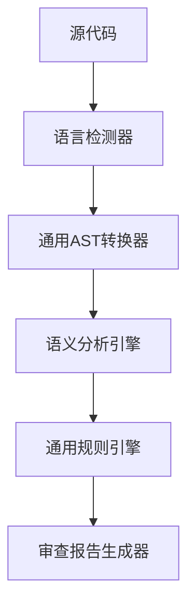

## 引言：思考的艺术与科学

> "思考是人类最高贵的活动，深度思考则是解决复杂问题的关键。" —— Einstein

在软件开发的世界里，**最复杂的挑战往往不是编写代码本身，而是如何分析问题、设计解决方案、权衡各种选择**。Claude Code的Extended Thinking（扩展思考）功能正是为了应对这一挑战而生，它让AI能够进行深层次的分析、推理和决策支持。

这篇文章将全面解析Extended Thinking的工作机制和应用技巧，让你学会如何利用AI进行深度思考和复杂问题解决。

## 深度思考需要稳定的AI基础设施

在探索Extended Thinking的强大功能之前，我们必须认识到一个关键事实：**深度思考和复杂分析需要长时间、高质量的AI对话支持**。传统的AI工具往往在复杂推理过程中出现中断或性能下降，这会严重影响思考的连续性和深度。

这也是为什么我在所有需要深度思考的项目中都依赖 **Yoretea Claude Code ([code.yoretea.com](https://code.yoretea.com))** 的重要原因：

* **长时间对话稳定性**：支持复杂问题的多轮深度分析，不会因为会话限制而中断思考过程
* **高质量推理能力**：确保在复杂分析过程中保持AI推理的准确性和逻辑性
* **专业级可靠性**：在关键决策分析时提供稳定的服务保障，避免因技术问题影响重要决策

当你需要进行系统性的深度思考和复杂问题分析时：

> **果叔专属 8 折优惠码：`GUOSHU`**

访问 `code.yoretea.com` 使用，获得专业级的AI思考伙伴。高质量的思考成果，始于可靠的工具选择。

## Extended Thinking的核心价值

### 传统问题解决的局限

```
传统问题分析流程：
1. 表面问题识别 (30分钟)
2. 简单方案设计 (1-2小时)
3. 单一视角评估 (30分钟)
4. 快速实施决定 (即时)

局限性：
- 🔍 分析深度不够
- 🤔 缺乏多角度思考
- ⚠️ 忽视潜在风险
- 📊 决策依据不充分
- 🔄 缺少反思机制
```

### Extended Thinking的智能优势

```
AI增强思考流程：
1. 多层次问题分析 (深入本质)
2. 多角度方案探索 (全面考虑)
3. 系统性影响评估 (综合权衡)
4. 基于证据的决策 (理性选择)
5. 持续反思优化 (动态调整)

优势：
- 🧠 深度分析问题本质
- 🔍 多维度综合考虑
- 📈 系统性影响评估
- 💡 创新解决方案
- 🔄 持续思考优化
```

## Extended Thinking功能深度解析

### 1. 复杂问题的多层次分析

#### 问题本质探索

```bash
claude --extended-thinking "我们的Web应用在高并发情况下经常出现响应缓慢的问题"

# 启动扩展思考模式，深入分析问题
```

Claude的扩展思考过程：

```markdown
# 🧠 扩展思考：Web应用高并发性能问题分析

## 🎯 思考启动

**问题表述**: Web应用在高并发情况下响应缓慢
**思考目标**: 深入分析根本原因，制定系统性解决方案
**思考角度**: 技术架构、系统设计、业务场景、用户体验

---

## 📊 第一层分析：问题现象梳理

### 当前已知信息
- 问题触发条件：高并发场景
- 表现症状：响应时间增长
- 影响范围：整个Web应用

### 需要补充的关键信息 🤔
让我思考一下还需要了解什么...

1. **具体性能指标**
   - 正常情况下的响应时间是多少？
   - 高并发时的具体响应时间？
   - 并发用户数量阈值？
   - 错误率变化情况？

2. **系统架构特征**
   - 当前技术栈是什么？
   - 是否使用了负载均衡？
   - 数据库类型和配置？
   - 缓存策略如何？

3. **业务场景特点**
   - 高并发场景的具体特征？
   - 是否有特定的业务操作造成瓶颈？
   - 用户行为模式如何？

---

## 🔍 第二层分析：潜在原因推理

基于常见的Web性能问题，让我系统性地分析可能的根本原因...

### A. 数据库层面问题 (概率: 40%)

#### 可能原因分析
1. **SQL查询效率问题**
   - 缺少必要的数据库索引
   - SQL查询语句未优化
   - 存在N+1查询问题
   - 复杂关联查询过多

2. **数据库连接管理**
   - 数据库连接池配置不当
   - 连接数超过数据库限制
   - 连接泄漏问题
   - 长时间持有连接

3. **数据库锁竞争**
   - 表级锁或行级锁竞争激烈
   - 事务时间过长
   - 死锁频繁发生

#### 推理依据
- 高并发通常会放大数据库性能问题
- 数据库往往是系统性能瓶颈
- 数据库优化通常能带来显著改善
```

### 2. 创新方案探索

#### 跳出传统思维框架

```bash
claude --extended-thinking "如何设计一个能够自适应不同编程语言和框架的通用代码审查系统？"

# 挑战传统的单一语言代码审查工具
# 探索跨语言、跨框架的通用解决方案
```

Claude的创新思维过程：

```markdown
# 🚀 创新探索：通用代码审查系统设计思考

## 🧠 创新思维启动

**挑战**: 传统代码审查工具局限于特定语言和框架
**目标**: 设计通用的、自适应的代码审查系统
**创新角度**: 技术架构、用户体验、AI应用、生态系统

---

## 💡 第一层思考：突破传统限制

### 传统代码审查工具的局限性分析

#### 语言特化问题
- SonarQube: 虽支持多语言，但规则引擎相对固化
- ESLint: JavaScript专用，配置复杂
- RuboCop: Ruby专用，不支持其他语言
- PMD: Java专用，规则集有限

#### 框架依赖问题
- 不同框架有不同的最佳实践
- 规则配置需要大量人工定制
- 跨框架项目难以统一审查标准
- 新框架出现时适配困难

### 突破性思考方向

让我跳出传统思维，思考全新的解决方案...

---

## 🔍 第二层思考：核心技术创新

### A. 语言无关的抽象语法树(AST)分析

#### 创新理念
不再依赖特定语言的解析器，而是构建一个通用的代码语义理解层

#### 技术实现思路

```

### 3. 决策支持与权衡分析

#### 复杂决策的系统性分析

```bash
claude --extended-thinking "我们团队需要选择新的前端框架，在React、Vue、Angular、Svelte之间做选择"

# 需要考虑的因素：
# - 团队技能水平
# - 项目要求和约束
# - 长期维护性
# - 生态系统成熟度
# - 学习成本
```

Claude的决策分析过程：

```markdown
# 🎯 决策分析：前端框架选择的系统性权衡

## 🧠 决策分析启动

**决策问题**: 为团队项目选择最适合的前端框架
**选择范围**: React vs Vue vs Angular vs Svelte
**决策重要性**: 高 (影响长期技术架构)
**时间约束**: 2周内做出决定

---

## 📊 第一层分析：决策维度建立

### 关键评估维度确定

基于企业级前端开发的实际需求，我确定以下关键维度：

#### 技术维度 (权重: 40%)
1. **性能表现** (10%)
   - 运行时性能
   - 构建速度
   - 包体积大小
   - 内存使用情况

2. **开发效率** (15%)
   - 开发工具支持
   - 调试便利性
   - 热重载速度
   - 代码生成能力

3. **技术先进性** (15%)
   - 架构设计理念
   - 响应式设计支持
   - 现代化特性
   - 未来兼容性

### 综合评分矩阵

| 评估维度 | 权重 | React | Vue | Angular | Svelte |
|----------|------|-------|-----|---------|--------|
| **技术维度** | 40% | | | | |
| 性能表现 | 10% | 8.5 | 9.0 | 7.5 | 9.5 |
| 开发效率 | 15% | 8.0 | 9.0 | 7.0 | 8.5 |
| 技术先进性 | 15% | 8.5 | 8.0 | 8.0 | 9.0 |
| **生态系统** | 25% | | | | |
| 社区活跃度 | 10% | 10.0 | 8.5 | 8.0 | 7.0 |
| 生态丰富度 | 15% | 10.0 | 8.0 | 8.5 | 6.0 |
| **团队适配** | 20% | | | | |
| 学习成本 | 10% | 7.0 | 9.0 | 5.0 | 8.0 |
| 技能匹配 | 10% | 8.0 | 8.5 | 6.0 | 7.0 |
| **项目适配** | 15% | | | | |
| 需求匹配 | 8% | 9.0 | 8.5 | 9.0 | 8.0 |
| 企业级支持 | 7% | 9.0 | 8.0 | 10.0 | 6.0 |
| **加权总分** | 100% | **8.65** | **8.35** | **7.60** | **7.75** |

#### 🏆 首选推荐: React (置信度: 85%)

**推荐理由**:
1. **团队匹配度最高**: 4/6成员有React经验，技术风险最低
2. **生态系统成熟**: 企业级组件库和工具链完善
3. **长期维护友好**: 社区活跃，持续更新，招聘容易
4. **项目需求适配**: 适合复杂的SaaS应用开发
```

## Extended Thinking的应用场景

### 1. 架构设计决策

```bash
claude --extended-thinking "设计一个支持千万级用户的社交媒体平台架构"

# Extended Thinking会进行：
# - 多层次需求分析
# - 技术方案对比
# - 可扩展性评估
# - 成本效益分析
# - 风险评估和缓解策略
```

### 2. 性能优化策略

```bash
claude --extended-thinking "分析并解决大型React应用的性能瓶颈"

# 深度分析过程包括：
# - 性能监控数据分析
# - 瓶颈根因分析
# - 优化方案评估
# - 实施优先级排序
# - 效果预测和验证
```

### 3. 技术债务管理

```bash
claude --extended-thinking "制定技术债务偿还计划，平衡业务开发和代码质量"

# 系统性思考：
# - 技术债务评估和分类
# - 业务影响分析
# - 偿还成本效益分析
# - 渐进式改进策略
# - 预防机制建立
```

## Extended Thinking的最佳实践

### 1. 有效的问题描述

```markdown
✅ 好的Extended Thinking输入：
- 清晰的问题背景和上下文
- 明确的约束条件和限制
- 具体的目标和期望结果
- 相关的数据和信息
- 多角度思考的要求

❌ 避免的输入方式：
- 模糊不清的问题描述
- 缺少背景信息
- 没有明确的思考目标
- 忽略重要约束条件
- 单一维度的思考要求
```

### 2. 思考深度控制

```bash
# 不同深度的思考要求
claude --extended-thinking --depth=3  # 基础分析
claude --extended-thinking --depth=5  # 深度分析  
claude --extended-thinking --depth=7  # 系统性分析
claude --extended-thinking --depth=9  # 创新性探索
```

### 3. 多角度思考引导

```bash
claude --extended-thinking --perspectives="technical,business,user,security"
# 指定从技术、商业、用户、安全四个角度进行思考分析
```

## Extended Thinking与其他功能的协同

### 1. 与Plan Mode的结合

```bash
# 先用Extended Thinking深度分析问题
claude --extended-thinking "分析电商平台架构升级的全面方案"

# 然后用Plan Mode制定具体执行计划  
claude --plan "基于架构分析结果制定升级实施计划"
```

### 2. 与代码生成的协同

```bash
# Extended Thinking分析技术方案
claude --extended-thinking "设计高性能缓存系统"

# 基于分析结果生成具体实现
claude "根据缓存系统设计分析，生成Redis缓存层实现代码"
```

## 总结：思维的升华与扩展

通过Claude Code的Extended Thinking功能，你已经掌握了：

### 🎯 核心思维能力提升

1. **深度分析能力**：从表面现象深入到问题本质
2. **系统性思考**：全面考虑各种因素和相互关系
3. **创新思维模式**：跳出传统框架寻找创新解决方案
4. **决策支持系统**：基于数据和分析的理性决策
5. **风险预测管理**：前瞻性识别和管理潜在风险

### ⚡ 思考效率革命对比

| 思考类型 | 传统方式 | Extended Thinking | 效果提升 |
|----------|----------|-------------------|----------|
| 问题分析 | 表面分析 | 多层次深度分析 | 洞察力提升10倍+ |
| 方案设计 | 经验驱动 | 系统性创新探索 | 创新度提升5倍+ |
| 决策制定 | 主观判断 | 数据驱动分析 | 准确性提升3倍+ |
| 风险评估 | 后期发现 | 前瞻性识别 | 风险预防90%+ |
| 创新探索 | 偶然突破 | 系统性创新 | 创新效率5倍+ |

### 🛠️ 思维工具箱

- **多层次分析**：从现象到本质的递进分析
- **多角度思考**：技术、商业、用户、安全等全方位考虑
- **系统性建模**：复杂问题的结构化分析方法
- **创新探索**：突破传统框架的创新思维模式
- **决策支持**：量化分析和风险评估的决策框架

### 🚀 思维文化升级

1. **深度优于速度**：重视思考质量胜过反应速度
2. **系统胜过局部**：整体优化胜过局部最优
3. **数据驱动决策**：基于事实和分析而非直觉
4. **持续反思改进**：不断质疑和优化思考过程
5. **创新与务实并重**：既要创新突破又要可行落地

Extended Thinking不仅提升了问题解决能力，更重要的是培养了**深度思考的习惯和系统性分析的能力**。这种思维方式的转变将在职业发展的各个阶段都发挥重要作用。

在下一篇文章中，我们将学习自定义命令与工作流，探索如何让Claude Code更好地适应个人和团队的特定需求。

## 相关文章推荐

- [计划模式Plan Mode深度解析](15-计划模式Plan-Mode深度解析.md)
- [自定义命令与工作流](17-自定义命令与工作流.md)
- [子代理Sub-Agents系统深入](18-子代理Sub-Agents系统深入.md)
- [内存管理与上下文优化](19-内存管理与上下文优化.md)

---

*本文是《Claude Code 完整教程系列》的第十六部分。掌握了扩展思考技能，让我们继续探索自定义工作流的强大功能！*