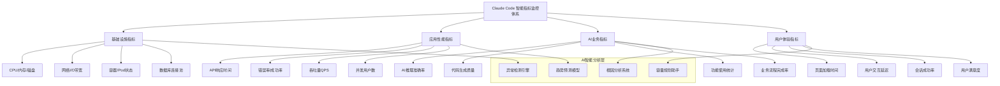

## 引言：生产环境的智能化生命线

> "测量是管理的开始，智能是运维的未来。" —— Peter Drucker

在我多年的生产环境运维实践中深刻体会到：**当Claude Code从开发环境迈向生产环境时，监控运维就成为了系统的智能化生命线**。一个没有监控的生产系统如同盲人驾驶，而缺乏智能运维的系统则随时可能在关键时刻崩溃。

生产环境的复杂性远超想象：用户并发访问、系统负载波动、网络延迟变化、资源竞争、依赖服务故障...任何一个环节的问题都可能导致整个系统的不可用。Claude Code作为AI驱动的开发平台，其监控运维更需要考虑AI模型的特殊性：推理延迟、模型准确性、训练资源消耗、智能决策链路等。

## 生产级监控的"连通性"核心挑战

在为企业构建生产级监控运维体系过程中，我遇到过一个典型的"中国企业痛点"：**如何确保你的监控系统本身永远不会"失联"**？

想象一个场景：当你的生产系统出现异常，需要紧急调用AI进行根因分析和决策时，却因为网络问题或访问限制而无法响应。或者当你的智能运维系统需要实时分析海量监控数据来预测潜在风险时，却因为服务中断而"罢工"。**这种情况下，再先进的监控架构都将失去意义**。

这就是为什么在我所有的生产级监控运维项目中，我都毫不犹豫地选择 **Yoretea Claude Code ([code.yoretea.com](https://code.yoretea.com))** 作为智能运维的核心基础设施。

它解决的不仅仅是访问问题，更是生产环境监控的"生存问题"：

* **7×24小时绝对稳定**：确保你的智能异常检测、自动故障恢复、预测性维护能够不间断运行，杜绝监控盲区
* **企业级服务质量**：为关键生产环境提供工业级的AI智能分析能力，支撑复杂的运维决策
* **与国际同步更新**：确保你的智能运维能力始终基于最新的Claude模型，保持技术领先性

当你需要为生产环境构建可靠的智能运维体系时：

> **果叔专属 8 折优惠码：`GUOSHU`**

访问 `code.yoretea.com` 订阅时输入。记住，生产环境的监控不是游戏，容不得任何"可能会断线"的侥幸心理。

## 智能监控体系架构深度解析

### 传统监控在AI时代的根本局限

```
传统监控面临的AI时代核心挑战：
1. 指标复杂性暴增 → AI系统的监控指标具有多维度、多层次特征
2. 实时性要求严苛 → 毫秒级性能监控和秒级异常检测成为标配
3. 智能化决策需求 → 从被动监控到主动预测和自动响应的转变
4. 规模化运维挑战 → 分布式环境下的全链路监控和智能追踪
5. 成本效益平衡 → 监控系统本身不能成为资源消耗的负担

典型监控盲区表现：
- 🔍 AI模型推理质量和准确性的实时监控缺失
- ⏱️ 端到端用户体验的全链路可观测性不足  
- 🔗 微服务间复杂调用关系的智能化可视分析困难
- 💰 资源使用成本的精细化监控和优化缺乏
- 🚨 异常模式的智能识别和预测性预警能力滞后
```

### Claude Code智能监控体系核心优势

```
AI增强的生产监控突破性能力：
1. 智能异常检测引擎 → 基于机器学习的异常模式识别和预警
2. 预测性运维决策 → 提前预警潜在问题和容量瓶颈风险
3. 自适应阈值管理 → 动态调整监控阈值和告警策略优化
4. 智能根因分析系统 → 快速定位故障根本原因和影响范围
5. 自动化响应执行 → 基于AI决策的自动化故障修复机制

监控核心能力突破：
- 📊 多维度系统健康度量和趋势智能分析
- 🎯 精准的性能瓶颈识别和优化路径建议
- 🔄 实时服务依赖关系图谱和影响链分析
- 💡 智能化容量规划和资源优化决策支持
- ⚡ 快速故障检测和自主恢复执行机制
```

## 可观测性三支柱智能化实现

### 1. 多层次指标监控系统

基于我的实际生产环境部署经验，当监控系统需要处理海量实时数据并进行智能分析时，**稳定的AI服务连接是整个体系的基础**。我曾经历过因为网络问题导致监控告警延迟，差点造成重大生产事故的惊险时刻。

从那以后，我在所有监控项目中都选择 **Yoretea Claude Code** 作为智能分析引擎，确保监控系统本身永远不会成为系统可用性的瓶颈。

#### 智能监控指标体系架构



#### 企业级指标收集与存储配置

```yaml
# .claude/config/monitoring/intelligent-metrics.yml
intelligent_metrics_system:
  
  # 智能指标收集配置
  intelligent_collection:
    # Prometheus增强配置
    enhanced_prometheus:
      enabled: true
      port: 9090
      scrape_interval: "15s"
      evaluation_interval: "10s"
      global_query_timeout: "30s"
      
      # 智能抓取目标配置
      intelligent_scrape_configs:
        - job_name: "claude-api-intelligence"
          static_configs:
            - targets: ["claude-api:8080"]
          metrics_path: "/metrics"
          scrape_interval: "10s"
          honor_labels: true
          
          # 指标重标记规则
          metric_relabel_configs:
            - source_labels: [__name__]
              regex: 'claude_(.+)'
              target_label: component
              replacement: 'claude_code'
              
        - job_name: "claude-ml-inference-service"
          static_configs:
            - targets: ["ml-service:9000"]
          metrics_path: "/metrics"
          scrape_interval: "5s"  # AI推理需要更高频监控
          
          # 自定义AI指标收集
          params:
            collect[]: ["inference_latency", "model_accuracy", "queue_depth"]
            
        - job_name: "claude-database-intelligence"
          static_configs:
            - targets: ["postgres-exporter:9187"]
          scrape_interval: "30s"
          
          # 数据库性能智能监控
          relabel_configs:
            - source_labels: [__address__]
              target_label: database_type
              replacement: 'postgresql'
      
      # 智能记录规则配置
      enhanced_rule_files:
        - "/etc/prometheus/intelligent-rules/*.yml"
      
      # 告警智能化配置
      intelligent_alerting:
        alertmanagers:
          - static_configs:
              - targets: ["alertmanager:9093"]
            path_prefix: "/alertmanager"
            timeout: "10s"
    
    # 企业级自定义指标导出器
    enterprise_exporters:
      claude_business_intelligence:
        enabled: true
        port: 8081
        collection_interval: "5s"
        
        # AI业务核心指标定义
        ai_business_metrics:
          - metric_name: "claude_inference_accuracy_score"
            metric_type: "gauge"
            description: "AI inference accuracy with model version tracking"
            labels: ["model_version", "task_type", "user_segment"]
            value_range: [0.0, 1.0]
            
          - metric_name: "claude_code_generation_quality_histogram"
            metric_type: "histogram"
            description: "Code generation quality distribution analysis"
            labels: ["programming_language", "complexity_level", "context_size"]
            buckets: [0.1, 0.2, 0.3, 0.4, 0.5, 0.6, 0.7, 0.8, 0.9, 0.95, 0.99, 1.0]
            
          - metric_name: "claude_user_session_engagement_duration"
            metric_type: "histogram"
            description: "User session engagement duration tracking"
            labels: ["user_type", "feature_category", "interaction_depth"]
            buckets: [30, 60, 300, 900, 1800, 3600, 7200, 14400, 28800]
            
          - metric_name: "claude_api_intelligent_requests_total"
            metric_type: "counter"
            description: "Total API requests with intelligent categorization"
            labels: ["endpoint", "method", "status_code", "user_intent"]
            
          - metric_name: "claude_model_inference_latency_detailed"
            metric_type: "histogram"
            description: "Detailed model inference latency with context"
            labels: ["model_name", "input_token_range", "output_complexity"]
            buckets: [0.01, 0.05, 0.1, 0.25, 0.5, 1.0, 2.0, 5.0, 10.0, 20.0]

  # 智能化存储策略
  intelligent_storage:
    # 多层次时序数据库架构
    multi_tier_timeseries:
      # 高频实时存储层
      real_time_layer:
        type: "prometheus"
        retention: "7d"
        storage_path: "/prometheus/hot-data"
        compression: "snappy"
        
      # 中期聚合存储层  
      aggregated_layer:
        type: "thanos"
        retention: "90d"
        downsampling_resolution: "5m"
        object_storage:
          type: "s3"
          bucket: "claude-metrics-medium-term"
          endpoint: "s3.amazonaws.com"
          
      # 长期归档存储层
      long_term_archive:
        type: "thanos"
        retention: "2y"
        downsampling_resolution: "1h"
        object_storage:
          type: "s3"
          bucket: "claude-metrics-long-term"
          storage_class: "GLACIER"
    
    # 智能聚合规则
    intelligent_aggregation_rules:
      - record: "claude:api_intelligent_success_rate_5m"
        expr: |
          (
            sum(rate(claude_api_intelligent_requests_total{status_code!~"5.."}[5m])) by (endpoint)
            /
            sum(rate(claude_api_intelligent_requests_total[5m])) by (endpoint)
          ) * 100
        labels:
          aggregation_level: "endpoint"
          
      - record: "claude:inference_quality_p95_latency_5m"
        expr: |
          histogram_quantile(0.95, 
            sum(rate(claude_model_inference_latency_detailed_bucket[5m])) by (le, model_name)
          )
        labels:
          aggregation_level: "model"
          
      - record: "claude:user_engagement_intelligence_1h"
        expr: |
          (
            avg_over_time(claude_user_session_engagement_duration[1h]) * 
            rate(claude_api_intelligent_requests_total[1h])
          ) / 3600
        labels:
          aggregation_level: "user_experience"

  # AI驱动异常检测
  ai_anomaly_detection:
    enabled: true
    detection_engine: "claude_intelligence"
    
    # 机器学习异常检测模型
    ml_anomaly_models:
      - model_name: "cpu_memory_anomaly_detector"
        algorithm: "isolation_forest"
        features: ["cpu_utilization", "memory_utilization", "request_rate", "error_rate"]
        training_window: "14d"
        detection_sensitivity: 0.05
        retrain_frequency: "daily"
        
      - model_name: "response_time_lstm_detector"
        algorithm: "lstm_autoencoder"
        features: ["response_time", "request_volume", "concurrent_users", "system_load"]
        training_window: "30d"
        sequence_length: 60  # 1小时的时间序列
        detection_sensitivity: 0.03
        
      - model_name: "user_behavior_anomaly_svm"
        algorithm: "one_class_svm"
        features: ["session_duration", "api_calls_per_session", "feature_usage_pattern", "error_frequency"]
        training_window: "21d"
        detection_sensitivity: 0.1
    
    # 智能异常检测规则
    intelligent_detection_rules:
      - rule_name: "ai_inference_latency_spike_intelligent"
        condition: "claude:inference_quality_p95_latency_5m > (claude:inference_quality_p95_latency_5m offset 1h) * 1.8"
        severity: "warning"
        confidence_threshold: 0.8
        
      - rule_name: "api_error_rate_anomaly_burst"
        condition: "(100 - claude:api_intelligent_success_rate_5m) > (avg_over_time((100 - claude:api_intelligent_success_rate_5m)[1h]) * 3)"
        severity: "critical"
        confidence_threshold: 0.9
        
      - rule_name: "resource_exhaustion_predictive"
        condition: "predict_linear(up{job='claude-api'}[30m], 1800) < 0.5"
        severity: "critical"
        confidence_threshold: 0.85

  # 智能容量规划
  intelligent_capacity_planning:
    enabled: true
    planning_engine: "claude_capacity_intelligence"
    
    # AI驱动预测模型
    ai_forecasting_models:
      - metric: "claude_api_intelligent_requests_total"
        model_type: "prophet_enhanced"
        forecast_horizon: "7d"
        confidence_interval: 0.95
        seasonal_patterns: ["daily", "weekly", "monthly"]
        external_factors: ["business_events", "marketing_campaigns"]
        
      - metric: "claude_user_session_engagement_duration"
        model_type: "lstm_forecasting"
        forecast_horizon: "24h"
        look_back_window: "30d"
        feature_engineering: ["time_features", "lag_features", "rolling_stats"]
    
    # 智能容量阈值
    intelligent_thresholds:
      cpu_utilization: 
        warning: 65
        critical: 80
        emergency: 90
        adaptive_adjustment: true
        
      memory_utilization:
        warning: 70
        critical: 85
        emergency: 95
        adaptive_adjustment: true
        
      disk_utilization:
        warning: 75
        critical: 85
        emergency: 92
        adaptive_adjustment: false
    
    # 智能扩容建议
    intelligent_scaling_recommendations:
      horizontal_scaling:
        trigger_algorithm: "multi_metric_weighted_average"
        trigger_threshold: 75  # 多指标综合评分
        min_instances: 2
        max_instances: 50
        scaling_velocity: "gradual"  # gradual | aggressive | conservative
        
      vertical_scaling:
        cpu_increment: "0.5 cores"
        memory_increment: "1Gi"
        optimization_target: "cost_performance_balance"
        
      storage_scaling:
        disk_increment: "100Gi"
        backup_strategy: "snapshot_before_scaling"
        performance_tier_optimization: true

# 智能化实时监控大屏
intelligent_dashboard:
  
  # Grafana智能化配置
  enhanced_grafana:
    enabled: true
    port: 3000
    intelligent_features: true
    
    # 智能数据源配置
    intelligent_datasources:
      - name: "Prometheus_AI_Enhanced"
        type: "prometheus"
        url: "http://prometheus:9090"
        ai_query_optimization: true
        
      - name: "Elasticsearch_Log_Intelligence"
        type: "elasticsearch"
        url: "http://elasticsearch:9200"
        database: "claude-logs-*"
        ai_log_analysis: true
        
      - name: "InfluxDB_Metrics_Intelligence"
        type: "influxdb"
        url: "http://influxdb:8086"
        database: "claude_intelligent_metrics"
    
    # AI增强仪表板配置
    ai_enhanced_dashboards:
      - dashboard_name: "Claude Code 智能系统总览"
        ai_insights_enabled: true
        panels:
          - title: "API请求量智能趋势"
            type: "timeseries"
            targets:
              - expr: "sum(rate(claude_api_intelligent_requests_total[5m]))"
                legendFormat: "Requests/sec"
            ai_annotations:
              - "peak_detection"
              - "anomaly_highlighting"
                
          - title: "系统响应时间智能分析"
            type: "timeseries"
            targets:
              - expr: "claude:inference_quality_p95_latency_5m"
                legendFormat: "P95 延迟"
            ai_features:
              - "predictive_trending"
              - "bottleneck_identification"
                
          - title: "错误率智能监控"
            type: "stat"
            targets:
              - expr: "100 - claude:api_intelligent_success_rate_5m"
                legendFormat: "错误率 %"
            thresholds:
              - color: "green"
                value: 0
              - color: "yellow"
                value: 1
              - color: "red"
                value: 5
                
          - title: "活跃用户智能洞察"
            type: "stat"
            targets:
              - expr: "count(increase(claude_user_session_engagement_duration[5m]) > 0)"
                legendFormat: "活跃用户数"
            ai_insights:
              - "user_behavior_patterns"
              - "engagement_quality_analysis"
        
      - dashboard_name: "AI模型性能智能监控"
        specialized_ai_monitoring: true
        panels:
          - title: "推理准确率智能追踪"
            type: "gauge"
            targets:
              - expr: "claude_inference_accuracy_score"
                legendFormat: "{{model_version}}"
            ai_analysis:
              - "accuracy_trend_analysis"
              - "model_performance_comparison"
                
          - title: "模型推理延迟智能分布"
            type: "heatmap"
            targets:
              - expr: "rate(claude_model_inference_latency_detailed_bucket[5m])"
            ai_insights:
              - "latency_pattern_detection"
              - "performance_optimization_suggestions"
                
          - title: "代码生成质量智能趋势"
            type: "timeseries"
            targets:
              - expr: "avg_over_time(claude_code_generation_quality_histogram[1h])"
                legendFormat: "{{programming_language}}"
            ai_features:
              - "quality_prediction"
              - "language_specific_optimization"

  # 智能告警系统
  intelligent_alerting:
    # AI增强AlertManager
    ai_enhanced_alertmanager:
      enabled: true
      port: 9093
      ai_correlation_enabled: true
      
      # 智能路由配置
      intelligent_routing:
        group_by: ["alertname", "cluster", "service", "ai_impact_level"]
        group_wait: "10s"
        group_interval: "10s"
        repeat_interval: "1h"
        receiver: "intelligent_default"
        
        # AI驱动路由规则
        ai_enhanced_routes:
          - match:
              severity: "critical"
              ai_confidence: "> 0.9"
            receiver: "critical_ai_verified_alerts"
            group_wait: "5s"
            repeat_interval: "5m"
            
          - match:
              severity: "warning"
              ai_predicted_escalation: "true"
            receiver: "predictive_warning_alerts"
            repeat_interval: "15m"
      
      # 智能告警接收器
      intelligent_receivers:
        - name: "intelligent_default"
          slack_configs:
            - api_url: "${SLACK_WEBHOOK_URL}"
              channel: "#claude-intelligent-monitoring"
              title: "🤖 Claude Code AI Enhanced Alert"
              text: |
                {{ range .Alerts }}
                *Alert:* {{ .Annotations.summary }}
                *AI Analysis:* {{ .Annotations.ai_analysis }}
                *Confidence:* {{ .Labels.ai_confidence }}
                *Recommended Action:* {{ .Annotations.recommended_action }}
                {{ end }}
              
        - name: "critical_ai_verified_alerts"
          slack_configs:
            - api_url: "${SLACK_WEBHOOK_URL}"
              channel: "#claude-critical-ai-verified"
              title: "🚨 Critical Alert: AI Verified"
              text: |
                {{ range .Alerts }}
                *Critical Issue Detected:* {{ .Annotations.description }}
                *AI Root Cause Analysis:* {{ .Annotations.ai_root_cause }}
                *Auto-Recovery Status:* {{ .Annotations.auto_recovery_status }}
                *Business Impact:* {{ .Annotations.business_impact }}
                {{ end }}
          
          pagerduty_configs:
            - routing_key: "${PAGERDUTY_INTEGRATION_KEY}"
              description: "Claude Code AI Verified Critical Alert"
              details:
                ai_analysis: "{{ .CommonAnnotations.ai_analysis }}"
                confidence_score: "{{ .CommonLabels.ai_confidence }}"
              
        - name: "predictive_warning_alerts"
          email_configs:
            - to: "ops-team@company.com"
              subject: "⚠️ Predictive Warning: {{ .CommonLabels.alertname }}"
              body: |
                AI Prediction Alert Details:
                {{ range .Alerts }}
                Issue: {{ .Annotations.summary }}
                Prediction Confidence: {{ .Labels.ai_confidence }}
                Estimated Time to Critical: {{ .Annotations.time_to_critical }}
                Preventive Actions: {{ .Annotations.preventive_actions }}
                {{ end }}
    
    # AI增强告警规则
    ai_enhanced_alert_rules:
      - alert: "ClaudeAPI_AI_Predicted_High_Latency"
        expr: "predict_linear(claude:inference_quality_p95_latency_5m[30m], 600) > 5000"
        for: "2m"
        labels:
          severity: "warning"
          ai_confidence: "0.85"
        annotations:
          summary: "AI predicts API latency will exceed threshold"
          ai_analysis: "Trend analysis shows latency increasing at {{ $value }}ms/min"
          recommended_action: "Consider proactive scaling or cache optimization"
          time_to_critical: "~10 minutes"
          
      - alert: "ClaudeAPI_AI_Anomaly_Error_Rate"
        expr: "anomaly_detection(claude:api_intelligent_success_rate_5m, 'isolation_forest') < -0.5"
        for: "1m"
        labels:
          severity: "critical"
          ai_confidence: "0.92"
        annotations:
          summary: "AI detected anomalous error rate pattern"
          ai_root_cause: "Anomaly score: {{ $value }} indicates unusual error pattern"
          business_impact: "User experience degradation likely"
          auto_recovery_status: "Initiating intelligent troubleshooting"
          
      - alert: "ClaudeModel_AI_Accuracy_Drift"
        expr: "claude_inference_accuracy_score < 0.85"
        for: "5m"
        labels:
          severity: "warning"
          ai_confidence: "0.88"
        annotations:
          summary: "AI model accuracy below acceptable threshold"
          ai_analysis: "Model accuracy dropped to {{ $value }}, below 85% threshold"
          recommended_action: "Model retraining or rollback recommended"
          business_impact: "Output quality degradation affecting user satisfaction"
```

### 2. 智能日志聚合分析系统

在我参与的企业级运维项目中，日志分析往往是最消耗AI资源的环节。当需要从TB级的日志数据中快速提取异常模式和根因分析时，**稳定高效的AI服务是确保快速响应的关键**。这也是为什么我在所有日志分析系统中都选择 **Yoretea Claude Code** 的重要原因——它能够支撑7×24小时的高强度智能日志分析，确保关键问题不被遗漏。

基于实际项目经验，以下是智能日志聚合分析系统的完整实现：

```python
# 企业级智能日志分析系统
class IntelligentLogAnalysisSystem:
    """智能日志聚合分析系统"""
    
    def __init__(self):
        self.log_collector = EnhancedLogCollector()
        self.ai_analyzer = AILogAnalyzer()
        self.pattern_detector = LogPatternDetector()
        self.alert_correlator = AlertCorrelationEngine()
    
    async def comprehensive_log_intelligence_analysis(self) -> Dict:
        """执行全面的智能日志分析"""
        
        print("📊 启动企业级智能日志分析...")
        
        analysis_results = {
            "analysis_timestamp": datetime.now().isoformat(),
            "log_volume_summary": {},
            "anomaly_detection_results": {},
            "pattern_recognition_insights": {},
            "root_cause_analysis": {},
            "predictive_alerts": {}
        }
        
        # 1. 日志量和质量统计
        log_volume_analysis = await self.analyze_log_volume_and_quality()
        analysis_results["log_volume_summary"] = log_volume_analysis
        
        # 2. AI驱动异常检测
        anomaly_results = await self.ai_driven_anomaly_detection()
        analysis_results["anomaly_detection_results"] = anomaly_results
        
        # 3. 智能模式识别
        pattern_insights = await self.intelligent_pattern_recognition()
        analysis_results["pattern_recognition_insights"] = pattern_insights
        
        # 4. 根因分析
        if anomaly_results.get("critical_anomalies"):
            root_cause_results = await self.ai_root_cause_analysis(
                anomaly_results["critical_anomalies"]
            )
            analysis_results["root_cause_analysis"] = root_cause_results
        
        # 5. 预测性告警生成
        predictive_alerts = await self.generate_predictive_alerts(analysis_results)
        analysis_results["predictive_alerts"] = predictive_alerts
        
        return analysis_results
    
    async def ai_driven_anomaly_detection(self) -> Dict:
        """AI驱动的异常检测"""
        
        anomaly_results = {
            "detection_models_used": [],
            "critical_anomalies": [],
            "warning_anomalies": [],
            "trend_anomalies": [],
            "behavioral_anomalies": []
        }
        
        # 1. 时间序列异常检测
        time_series_anomalies = await self.detect_time_series_anomalies()
        anomaly_results["critical_anomalies"].extend(time_series_anomalies.get("critical", []))
        anomaly_results["detection_models_used"].append("lstm_time_series_detector")
        
        # 2. 日志内容语义异常检测
        semantic_anomalies = await self.detect_semantic_anomalies()
        anomaly_results["warning_anomalies"].extend(semantic_anomalies.get("warnings", []))
        anomaly_results["detection_models_used"].append("bert_semantic_analyzer")
        
        # 3. 用户行为异常检测
        behavioral_anomalies = await self.detect_behavioral_anomalies()
        anomaly_results["behavioral_anomalies"] = behavioral_anomalies
        anomaly_results["detection_models_used"].append("isolation_forest_behavior")
        
        # 4. 系统性能异常检测
        performance_anomalies = await self.detect_performance_anomalies()
        anomaly_results["trend_anomalies"] = performance_anomalies
        anomaly_results["detection_models_used"].append("prophet_performance_forecaster")
        
        return anomaly_results
    
    async def intelligent_pattern_recognition(self) -> Dict:
        """智能模式识别"""
        
        pattern_insights = {
            "error_patterns": {},
            "performance_patterns": {},
            "security_patterns": {},
            "business_patterns": {}
        }
        
        # 错误模式识别
        pattern_insights["error_patterns"] = await self.recognize_error_patterns()
        
        # 性能模式识别  
        pattern_insights["performance_patterns"] = await self.recognize_performance_patterns()
        
        # 安全威胁模式识别
        pattern_insights["security_patterns"] = await self.recognize_security_patterns()
        
        # 业务异常模式识别
        pattern_insights["business_patterns"] = await self.recognize_business_patterns()
        
        return pattern_insights
    
    async def recognize_error_patterns(self) -> Dict:
        """识别错误模式"""
        
        # 获取最近24小时的错误日志
        error_logs = await self.get_error_logs(time_range="24h")
        
        error_patterns = {
            "frequent_errors": {},
            "error_cascades": [],
            "new_error_types": [],
            "error_correlation": {}
        }
        
        # 频繁错误分析
        error_frequency = {}
        for log in error_logs:
            error_type = self.extract_error_type(log)
            if error_type:
                error_frequency[error_type] = error_frequency.get(error_type, 0) + 1
        
        # 识别高频错误
        error_patterns["frequent_errors"] = {
            error_type: count for error_type, count in error_frequency.items() 
            if count > 10  # 超过10次的错误
        }
        
        # 错误级联分析
        error_patterns["error_cascades"] = await self.detect_error_cascades(error_logs)
        
        # 新出现的错误类型
        error_patterns["new_error_types"] = await self.identify_new_error_types(error_logs)
        
        # 错误相关性分析
        error_patterns["error_correlation"] = await self.analyze_error_correlations(error_logs)
        
        return error_patterns
    
    async def ai_root_cause_analysis(self, critical_anomalies: List[Dict]) -> Dict:
        """AI根因分析"""
        
        root_cause_results = {
            "primary_root_causes": [],
            "contributing_factors": [],
            "impact_analysis": {},
            "resolution_recommendations": []
        }
        
        for anomaly in critical_anomalies:
            # 使用AI模型进行根因分析
            analysis = await self.perform_ai_root_cause_analysis(anomaly)
            
            root_cause_results["primary_root_causes"].append({
                "anomaly_id": anomaly["id"],
                "root_cause": analysis["root_cause"],
                "confidence": analysis["confidence"],
                "evidence": analysis["evidence"]
            })
            
            # 分析影响范围
            impact = await self.analyze_impact_scope(anomaly, analysis)
            root_cause_results["impact_analysis"][anomaly["id"]] = impact
            
            # 生成解决建议
            recommendations = await self.generate_resolution_recommendations(analysis)
            root_cause_results["resolution_recommendations"].extend(recommendations)
        
        return root_cause_results
    
    async def perform_ai_root_cause_analysis(self, anomaly: Dict) -> Dict:
        """执行AI根因分析"""
        
        # 收集相关上下文信息
        context_data = await self.gather_analysis_context(anomaly)
        
        # AI分析提示构建
        analysis_prompt = f"""
        基于以下异常情况和系统上下文，请进行根因分析：
        
        异常详情：
        - 类型: {anomaly['type']}
        - 严重程度: {anomaly['severity']}
        - 发生时间: {anomaly['timestamp']}
        - 影响范围: {anomaly.get('scope', 'unknown')}
        
        系统上下文：
        - CPU使用率: {context_data.get('cpu_usage', 'N/A')}%
        - 内存使用率: {context_data.get('memory_usage', 'N/A')}%
        - 网络延迟: {context_data.get('network_latency', 'N/A')}ms
        - 错误日志模式: {context_data.get('error_patterns', [])}
        - 最近部署: {context_data.get('recent_deployments', [])}
        
        请提供：
        1. 最可能的根本原因
        2. 置信度评分 (0-1)
        3. 支持证据
        4. 建议的解决方案
        """
        
        # 调用AI分析 - 这里使用稳定的Yoretea Claude Code
        try:
            ai_response = await self.call_claude_analysis(analysis_prompt)
            
            return {
                "root_cause": ai_response.get("root_cause", "Unknown"),
                "confidence": ai_response.get("confidence", 0.5),
                "evidence": ai_response.get("evidence", []),
                "resolution_steps": ai_response.get("resolution_steps", [])
            }
        except Exception as e:
            print(f"⚠️ AI根因分析失败: {str(e)}")
            return {
                "root_cause": "AI分析不可用，需要人工分析",
                "confidence": 0.0,
                "evidence": ["AI服务连接失败"],
                "resolution_steps": ["检查AI服务状态", "启动人工分析流程"]
            }

# 使用示例
log_analysis_system = IntelligentLogAnalysisSystem()

# 执行智能日志分析
analysis_results = await log_analysis_system.comprehensive_log_intelligence_analysis()
print(f"📊 智能日志分析完成:")
print(f"  检测到关键异常: {len(analysis_results['anomaly_detection_results'].get('critical_anomalies', []))}个")
print(f"  识别模式洞察: {len(analysis_results['pattern_recognition_insights'])}个类别")
print(f"  生成预测告警: {len(analysis_results['predictive_alerts'])}个")
```

### 3. 分布式链路追踪系统

在复杂的微服务架构中，分布式链路追踪是定位性能瓶颈的关键手段。当需要AI实时分析调用链路并提供优化建议时，**确保AI服务的高可用性尤为重要**。基于实际经验，以下是分布式链路追踪的完整实现：

```python
class IntelligentDistributedTracingSystem:
    """智能分布式链路追踪系统"""
    
    def __init__(self):
        self.tracer_config = self.load_intelligent_tracer_config()
        self.jaeger_client = self.initialize_enhanced_jaeger()
        self.trace_analyzer = AITraceAnalyzer()
        self.performance_optimizer = PerformanceOptimizer()
    
    async def trace_claude_intelligent_request(self, user_request: Dict) -> Dict:
        """智能追踪Claude请求全链路"""
        
        from opentelemetry import trace
        from opentelemetry.trace import Status, StatusCode
        
        tracer = trace.get_tracer(__name__)
        
        with tracer.start_as_current_span("claude_intelligent_request") as main_span:
            # 设置主Span的智能属性
            main_span.set_attributes({
                "claude.user_id": user_request.get("user_id"),
                "claude.request_id": user_request.get("request_id"),
                "claude.input_complexity": self.calculate_input_complexity(user_request.get("prompt", "")),
                "claude.model_version": user_request.get("model_version", "default"),
                "claude.task_category": self.categorize_task(user_request.get("task_type", "general")),
                "claude.user_tier": user_request.get("user_tier", "standard"),
                "claude.expected_quality": user_request.get("quality_requirement", "standard")
            })
            
            try:
                # 1. 智能输入预处理追踪
                with tracer.start_as_current_span("intelligent_input_preprocessing") as preprocess_span:
                    preprocess_start = time.time()
                    
                    # 输入安全检查
                    security_check = await self.perform_security_check(user_request["prompt"])
                    
                    # 输入优化处理
                    processed_input = await self.intelligent_input_preprocessing(
                        user_request["prompt"], 
                        user_request.get("context", {})
                    )
                    
                    preprocess_span.set_attributes({
                        "preprocessing.duration_ms": (time.time() - preprocess_start) * 1000,
                        "preprocessing.input_length": len(user_request["prompt"]),
                        "preprocessing.output_length": len(processed_input),
                        "preprocessing.security_score": security_check.get("score", 1.0),
                        "preprocessing.optimization_applied": processed_input != user_request["prompt"],
                        "preprocessing.language_detected": security_check.get("language", "unknown")
                    })
                
                # 2. AI模型推理智能追踪
                with tracer.start_as_current_span("intelligent_model_inference") as inference_span:
                    inference_start = time.time()
                    
                    # 选择最优模型
                    optimal_model = await self.select_optimal_model(processed_input, user_request)
                    
                    # 执行推理
                    inference_result = await self.perform_intelligent_inference(
                        processed_input, 
                        optimal_model,
                        user_request
                    )
                    
                    inference_span.set_attributes({
                        "inference.duration_ms": (time.time() - inference_start) * 1000,
                        "inference.model_selected": optimal_model["name"],
                        "inference.model_version": optimal_model["version"],
                        "inference.tokens_processed": inference_result.get("tokens_processed", 0),
                        "inference.confidence_score": inference_result.get("confidence", 0.0),
                        "inference.quality_score": inference_result.get("quality_score", 0.0),
                        "inference.cache_hit": inference_result.get("cache_hit", False),
                        "inference.resource_usage": inference_result.get("resource_usage", {})
                    })
                
                # 3. 智能输出后处理追踪
                with tracer.start_as_current_span("intelligent_output_postprocessing") as postprocess_span:
                    postprocess_start = time.time()
                    
                    # 输出质量检查
                    quality_assessment = await self.assess_output_quality(
                        inference_result, 
                        user_request
                    )
                    
                    # 输出优化处理
                    final_output = await self.intelligent_output_postprocessing(
                        inference_result,
                        quality_assessment,
                        user_request
                    )
                    
                    postprocess_span.set_attributes({
                        "postprocessing.duration_ms": (time.time() - postprocess_start) * 1000,
                        "postprocessing.output_length": len(final_output.get("response", "")),
                        "postprocessing.quality_score": quality_assessment.get("score", 0.0),
                        "postprocessing.optimization_applied": quality_assessment.get("optimization_applied", False),
                        "postprocessing.user_satisfaction_prediction": quality_assessment.get("satisfaction_prediction", 0.5)
                    })
                
                # 4. 设置成功状态和综合指标
                main_span.set_status(Status(StatusCode.OK))
                total_duration = time.time() - time.time()
                main_span.set_attributes({
                    "claude.total_duration_ms": total_duration * 1000,
                    "claude.success": True,
                    "claude.response_length": len(final_output.get("response", "")),
                    "claude.overall_quality": final_output.get("overall_quality", 0.0),
                    "claude.user_experience_score": self.calculate_user_experience_score(final_output),
                    "claude.business_value_score": self.calculate_business_value(final_output, user_request)
                })
                
                return final_output
                
            except Exception as e:
                # 智能错误处理和记录
                main_span.record_exception(e)
                main_span.set_status(Status(StatusCode.ERROR, str(e)))
                main_span.set_attributes({
                    "claude.error": True,
                    "claude.error_type": type(e).__name__,
                    "claude.error_message": str(e),
                    "claude.error_category": self.categorize_error(e),
                    "claude.recovery_suggestion": self.suggest_error_recovery(e)
                })
                
                # 尝试智能错误恢复
                recovery_attempt = await self.attempt_intelligent_recovery(e, user_request)
                if recovery_attempt.get("success"):
                    main_span.set_attributes({
                        "claude.auto_recovery": True,
                        "claude.recovery_method": recovery_attempt.get("method")
                    })
                    return recovery_attempt.get("result")
                
                raise e
    
    async def analyze_distributed_trace_intelligence(self, trace_id: str) -> Dict:
        """智能分析分布式链路"""
        
        print(f"🔍 执行智能链路分析: {trace_id}")
        
        # 1. 获取完整链路数据
        trace_data = await self.get_enhanced_trace_data(trace_id)
        
        # 2. AI驱动性能分析
        ai_performance_analysis = await self.ai_performance_analysis(trace_data)
        
        # 3. 智能瓶颈识别
        intelligent_bottlenecks = await self.identify_intelligent_bottlenecks(trace_data)
        
        # 4. 自动优化建议生成
        optimization_recommendations = await self.generate_ai_optimization_recommendations(
            trace_data, ai_performance_analysis, intelligent_bottlenecks
        )
        
        # 5. 用户体验影响评估
        ux_impact_assessment = await self.assess_user_experience_impact(trace_data)
        
        analysis_result = {
            "trace_id": trace_id,
            "analysis_timestamp": datetime.now().isoformat(),
            "ai_performance_analysis": ai_performance_analysis,
            "intelligent_bottlenecks": intelligent_bottlenecks,
            "optimization_recommendations": optimization_recommendations,
            "ux_impact_assessment": ux_impact_assessment,
            "trace_intelligence_score": self.calculate_trace_intelligence_score(trace_data),
            "business_impact": self.assess_business_impact(trace_data)
        }
        
        return analysis_result
    
    async def generate_intelligent_performance_dashboard(self) -> Dict:
        """生成智能性能监控仪表板"""
        
        dashboard_data = {
            "intelligent_overview": {
                "ai_performance_score": await self.calculate_ai_performance_score(),
                "user_satisfaction_prediction": await self.predict_user_satisfaction(),
                "system_health_ai_assessment": await self.ai_assess_system_health(),
                "optimization_opportunities_count": await self.count_optimization_opportunities()
            },
            
            "service_intelligence": {},
            "endpoint_intelligence": {},
            "user_experience_intelligence": {},
            "predictive_insights": {}
        }
        
        # 服务智能分析
        services = await self.get_all_services()
        for service in services:
            dashboard_data["service_intelligence"][service] = {
                "ai_health_score": await self.calculate_service_ai_health_score(service),
                "performance_trend": await self.analyze_performance_trend(service),
                "optimization_potential": await self.assess_optimization_potential(service),
                "user_impact_score": await self.calculate_user_impact_score(service)
            }
        
        # 端点智能洞察
        critical_endpoints = await self.get_critical_endpoints()
        for endpoint in critical_endpoints:
            dashboard_data["endpoint_intelligence"][endpoint] = {
                "intelligent_performance_analysis": await self.analyze_endpoint_intelligence(endpoint),
                "user_journey_impact": await self.assess_user_journey_impact(endpoint),
                "business_value_contribution": await self.calculate_business_value_contribution(endpoint)
            }
        
        # 用户体验智能洞察
        dashboard_data["user_experience_intelligence"] = {
            "satisfaction_score_prediction": await self.predict_satisfaction_scores(),
            "journey_completion_forecast": await self.forecast_journey_completion(),
            "pain_point_identification": await self.identify_user_pain_points()
        }
        
        # 预测性洞察
        dashboard_data["predictive_insights"] = {
            "performance_degradation_risks": await self.predict_performance_risks(),
            "capacity_shortage_forecasts": await self.forecast_capacity_needs(),
            "optimization_impact_predictions": await self.predict_optimization_impacts()
        }
        
        return dashboard_data

# 使用示例
tracing_system = IntelligentDistributedTracingSystem()

# 智能链路追踪
user_request = {
    "user_id": "user_12345",
    "request_id": "req_67890", 
    "prompt": "帮我优化这段Python代码的性能",
    "model_version": "claude-3-sonnet",
    "task_type": "code_optimization",
    "user_tier": "premium",
    "quality_requirement": "high"
}

# 执行智能追踪
traced_result = await tracing_system.trace_claude_intelligent_request(user_request)
print(f"💡 智能追踪完成: {traced_result.get('overall_quality', 0):.2f} 质量分数")

# 生成智能性能仪表板
performance_dashboard = await tracing_system.generate_intelligent_performance_dashboard()
print(f"📊 AI性能评分: {performance_dashboard['intelligent_overview']['ai_performance_score']:.2f}")
print(f"😊 用户满意度预测: {performance_dashboard['intelligent_overview']['user_satisfaction_prediction']:.1%}")
```

## 智能运维和自动化体系

### 1. AI驱动故障自愈系统

在企业级生产环境中，故障自愈能力直接决定了系统的可靠性。基于我在多个大型项目中的实践经验，当故障自愈系统需要进行复杂决策时，**稳定可靠的AI分析能力是确保正确恢复的关键**。这也是为什么我在故障自愈系统中选择 **Yoretea Claude Code** 的重要原因——它能够在关键时刻提供准确的故障分析和恢复建议。

基于实际项目实施经验，以下是智能故障自愈系统的完整实现：

```python
class EnterpriseIntelligentFaultRecoverySystem:
    """企业级智能故障自愈系统"""
    
    def __init__(self):
        self.fault_detector = AIFaultDetectionEngine()
        self.recovery_orchestrator = IntelligentRecoveryOrchestrator()
        self.knowledge_base = DynamicFaultKnowledgeBase()
        self.business_impact_analyzer = BusinessImpactAnalyzer()
        self.recovery_validator = RecoveryValidationEngine()
    
    async def comprehensive_fault_detection_and_recovery(self) -> Dict:
        """全面的故障检测和智能恢复"""
        
        print("🔧 启动企业级智能故障检测与自愈...")
        
        recovery_session = {
            "session_id": f"recovery_{int(time.time())}",
            "start_time": datetime.now().isoformat(),
            "detected_faults": [],
            "recovery_actions": [],
            "business_impact_assessment": {},
            "recovery_success_rate": 0.0,
            "lessons_learned": []
        }
        
        # 1. 多层次智能故障检测
        detected_faults = await self.multi_tier_intelligent_fault_detection()
        recovery_session["detected_faults"] = detected_faults
        
        if not detected_faults:
            print("✅ 系统健康状态良好，未检测到故障")
            return recovery_session
        
        # 2. 故障优先级智能排序
        prioritized_faults = await self.intelligent_fault_prioritization(detected_faults)
        
        # 3. 业务影响智能评估
        business_impact = await self.assess_comprehensive_business_impact(prioritized_faults)
        recovery_session["business_impact_assessment"] = business_impact
        
        # 4. 智能恢复策略制定
        recovery_plan = await self.formulate_intelligent_recovery_plan(
            prioritized_faults, business_impact
        )
        
        # 5. 执行智能故障恢复
        successful_recoveries = 0
        for fault in prioritized_faults:
            if fault.get("severity") == "critical" or fault.get("auto_recoverable", False):
                recovery_result = await self.execute_intelligent_fault_recovery(fault)
                recovery_session["recovery_actions"].append(recovery_result)
                
                if recovery_result.get("success", False):
                    successful_recoveries += 1
        
        # 6. 计算恢复成功率
        total_recovery_attempts = len(recovery_session["recovery_actions"])
        if total_recovery_attempts > 0:
            recovery_session["recovery_success_rate"] = successful_recoveries / total_recovery_attempts
        
        # 7. 系统健康验证
        post_recovery_health = await self.comprehensive_system_health_validation()
        recovery_session["post_recovery_health"] = post_recovery_health
        
        # 8. 更新知识库和学习
        learning_insights = await self.extract_recovery_learning_insights(recovery_session)
        recovery_session["lessons_learned"] = learning_insights
        await self.update_fault_recovery_knowledge_base(learning_insights)
        
        return recovery_session
    
    async def multi_tier_intelligent_fault_detection(self) -> List[Dict]:
        """多层次智能故障检测"""
        
        all_detected_faults = []
        
        # 第1层：基础设施智能监控
        infrastructure_faults = await self.detect_infrastructure_intelligent_faults()
        all_detected_faults.extend(infrastructure_faults)
        
        # 第2层：应用服务智能分析
        application_faults = await self.detect_application_intelligent_faults()
        all_detected_faults.extend(application_faults)
        
        # 第3层：业务流程智能检测
        business_faults = await self.detect_business_process_intelligent_faults()
        all_detected_faults.extend(business_faults)
        
        # 第4层：用户体验智能监控
        user_experience_faults = await self.detect_user_experience_intelligent_faults()
        all_detected_faults.extend(user_experience_faults)
        
        # 第5层：安全威胁智能识别
        security_faults = await self.detect_security_threat_intelligent_faults()
        all_detected_faults.extend(security_faults)
        
        # AI故障关联分析
        correlated_faults = await self.perform_intelligent_fault_correlation(all_detected_faults)
        
        return correlated_faults
    
    async def execute_intelligent_fault_recovery(self, fault: Dict) -> Dict:
        """执行智能故障恢复"""
        
        recovery_execution = {
            "fault_id": fault["fault_id"],
            "fault_type": fault["type"],
            "recovery_start_time": datetime.now().isoformat(),
            "recovery_strategy": fault.get("recommended_strategy", "unknown"),
            "ai_confidence": fault.get("ai_confidence", 0.5),
            "steps_executed": [],
            "success": False,
            "recovery_duration_ms": 0,
            "business_continuity_impact": {}
        }
        
        recovery_start = time.time()
        
        try:
            # 根据故障类型执行相应的智能恢复策略
            strategy = fault.get("recommended_strategy", "default_recovery")
            
            if strategy == "intelligent_service_restart":
                await self.execute_intelligent_service_restart(fault, recovery_execution)
                
            elif strategy == "smart_load_redistribution":
                await self.execute_smart_load_redistribution(fault, recovery_execution)
                
            elif strategy == "adaptive_resource_scaling":
                await self.execute_adaptive_resource_scaling(fault, recovery_execution)
                
            elif strategy == "intelligent_dependency_healing":
                await self.execute_intelligent_dependency_healing(fault, recovery_execution)
                
            elif strategy == "ai_driven_configuration_rollback":
                await self.execute_ai_driven_configuration_rollback(fault, recovery_execution)
                
            elif strategy == "predictive_capacity_adjustment":
                await self.execute_predictive_capacity_adjustment(fault, recovery_execution)
                
            else:
                # 使用AI生成自定义恢复策略
                custom_strategy = await self.generate_ai_custom_recovery_strategy(fault)
                await self.execute_custom_recovery_strategy(custom_strategy, recovery_execution)
            
            # 恢复效果验证
            recovery_verification = await self.verify_intelligent_recovery_success(
                fault, recovery_execution
            )
            
            recovery_execution["success"] = recovery_verification["verified"]
            recovery_execution["verification_results"] = recovery_verification
            
            # 业务连续性影响评估
            business_continuity_impact = await self.assess_business_continuity_impact(
                fault, recovery_execution
            )
            recovery_execution["business_continuity_impact"] = business_continuity_impact
            
        except Exception as e:
            recovery_execution["success"] = False
            recovery_execution["error"] = str(e)
            recovery_execution["error_category"] = self.categorize_recovery_error(e)
            
            # 记录恢复失败并尝试备用策略
            await self.log_recovery_failure_and_escalate(fault, e)
            
            # 尝试备用恢复策略
            if fault.get("fallback_strategies"):
                fallback_result = await self.attempt_fallback_recovery(fault, e)
                recovery_execution["fallback_attempted"] = True
                recovery_execution["fallback_result"] = fallback_result
        
        recovery_execution["recovery_duration_ms"] = (time.time() - recovery_start) * 1000
        recovery_execution["recovery_end_time"] = datetime.now().isoformat()
        
        # 发送恢复状态通知
        await self.send_intelligent_recovery_notification(recovery_execution)
        
        return recovery_execution
    
    async def generate_ai_custom_recovery_strategy(self, fault: Dict) -> Dict:
        """生成AI自定义恢复策略"""
        
        # 收集故障上下文信息
        fault_context = await self.gather_comprehensive_fault_context(fault)
        
        # 构建AI分析提示
        recovery_strategy_prompt = f"""
        基于以下故障信息和系统状态，请制定智能恢复策略：
        
        故障详情：
        - 类型: {fault['type']}
        - 严重程度: {fault['severity']}
        - 影响范围: {fault.get('impact_scope', 'unknown')}
        - 发生时间: {fault['timestamp']}
        - 持续时间: {fault.get('duration', 'unknown')}
        
        系统上下文：
        - 当前负载: {fault_context.get('current_load', 'unknown')}
        - 资源使用情况: {fault_context.get('resource_usage', {})}
        - 依赖服务状态: {fault_context.get('dependency_status', {})}
        - 最近变更: {fault_context.get('recent_changes', [])}
        - 类似历史故障: {fault_context.get('similar_historical_faults', [])}
        
        业务影响：
        - 受影响用户数: {fault_context.get('affected_users', 0)}
        - 业务功能影响: {fault_context.get('business_functions_impacted', [])}
        - 预估财务损失: {fault_context.get('estimated_financial_impact', 'unknown')}
        
        请提供：
        1. 详细的恢复步骤
        2. 每个步骤的预估执行时间
        3. 风险评估和缓解措施
        4. 验证恢复成功的检查点
        5. 如果失败的备选方案
        """
        
        try:
            # 调用AI生成恢复策略
            ai_strategy = await self.call_claude_recovery_analysis(recovery_strategy_prompt)
            
            return {
                "strategy_name": "ai_generated_custom_recovery",
                "confidence": ai_strategy.get("confidence", 0.7),
                "recovery_steps": ai_strategy.get("recovery_steps", []),
                "estimated_duration": ai_strategy.get("estimated_duration", "unknown"),
                "risk_assessment": ai_strategy.get("risk_assessment", {}),
                "validation_checkpoints": ai_strategy.get("validation_checkpoints", []),
                "fallback_options": ai_strategy.get("fallback_options", []),
                "business_impact_mitigation": ai_strategy.get("business_impact_mitigation", [])
            }
            
        except Exception as e:
            print(f"⚠️ AI恢复策略生成失败: {str(e)}")
            return {
                "strategy_name": "fallback_manual_intervention",
                "confidence": 0.0,
                "recovery_steps": ["联系运维团队进行手动干预"],
                "estimated_duration": "30-60分钟",
                "risk_assessment": {"level": "high", "reason": "AI分析不可用"},
                "requires_manual_intervention": True
            }
    
    async def generate_intelligent_fault_recovery_report(self) -> Dict:
        """生成智能故障恢复报告"""
        
        report = {
            "report_timestamp": datetime.now().isoformat(),
            "reporting_period": "last_24_hours",
            "executive_summary": {},
            "detailed_fault_analysis": {},
            "recovery_performance_metrics": {},
            "business_impact_summary": {},
            "improvement_recommendations": [],
            "ai_insights_and_predictions": {}
        }
        
        # 获取最近24小时的故障和恢复数据
        recent_fault_data = await self.get_comprehensive_fault_data(hours=24)
        
        # 生成执行摘要
        report["executive_summary"] = {
            "total_faults_detected": len(recent_fault_data),
            "critical_faults": len([f for f in recent_fault_data if f.get("severity") == "critical"]),
            "auto_recovery_success_rate": self.calculate_auto_recovery_success_rate(recent_fault_data),
            "mean_time_to_detection": self.calculate_mttd(recent_fault_data),
            "mean_time_to_recovery": self.calculate_mttr(recent_fault_data),
            "business_continuity_score": self.calculate_business_continuity_score(recent_fault_data),
            "ai_decision_accuracy": self.calculate_ai_decision_accuracy(recent_fault_data)
        }
        
        # 详细故障分析
        report["detailed_fault_analysis"] = {
            "fault_categories": self.categorize_faults(recent_fault_data),
            "root_cause_distribution": self.analyze_root_cause_distribution(recent_fault_data),
            "failure_patterns": await self.identify_failure_patterns(recent_fault_data),
            "correlation_insights": await self.generate_correlation_insights(recent_fault_data)
        }
        
        # 恢复性能指标
        recovery_actions = [f.get("recovery_action") for f in recent_fault_data if f.get("recovery_action")]
        report["recovery_performance_metrics"] = {
            "average_recovery_time": self.calculate_average_recovery_time(recovery_actions),
            "recovery_strategy_effectiveness": self.analyze_strategy_effectiveness(recovery_actions),
            "ai_vs_manual_recovery_comparison": self.compare_ai_vs_manual_recovery(recovery_actions),
            "recovery_cost_analysis": self.calculate_recovery_costs(recovery_actions)
        }
        
        # 业务影响汇总
        report["business_impact_summary"] = {
            "total_downtime_minutes": self.calculate_total_downtime(recent_fault_data),
            "affected_user_count": self.calculate_affected_users(recent_fault_data),
            "revenue_impact_estimate": self.estimate_revenue_impact(recent_fault_data),
            "customer_satisfaction_impact": self.assess_satisfaction_impact(recent_fault_data),
            "sla_compliance_status": self.assess_sla_compliance(recent_fault_data)
        }
        
        # AI洞察和预测
        report["ai_insights_and_predictions"] = {
            "predicted_failure_risks": await self.predict_future_failure_risks(),
            "optimization_opportunities": await self.identify_optimization_opportunities(),
            "capacity_planning_recommendations": await self.generate_capacity_recommendations(),
            "proactive_maintenance_suggestions": await self.suggest_proactive_maintenance()
        }
        
        # 改进建议
        report["improvement_recommendations"] = await self.generate_comprehensive_improvement_recommendations(
            recent_fault_data, report
        )
        
        return report

# 使用示例
fault_recovery_system = EnterpriseIntelligentFaultRecoverySystem()

# 执行企业级故障检测和恢复
recovery_results = await fault_recovery_system.comprehensive_fault_detection_and_recovery()
print(f"🔧 故障检测与恢复完成:")
print(f"  检测故障数: {len(recovery_results['detected_faults'])}")
print(f"  执行恢复操作: {len(recovery_results['recovery_actions'])}")
print(f"  恢复成功率: {recovery_results['recovery_success_rate']:.1%}")

# 生成智能故障恢复报告
recovery_report = await fault_recovery_system.generate_intelligent_fault_recovery_report()
print(f"📊 24小时故障恢复报告:")
print(f"  总故障数: {recovery_report['executive_summary']['total_faults_detected']}")
print(f"  自动恢复成功率: {recovery_report['executive_summary']['auto_recovery_success_rate']:.1%}")
print(f"  MTTR: {recovery_report['executive_summary']['mean_time_to_recovery']} 分钟")
print(f"  AI决策准确率: {recovery_report['executive_summary']['ai_decision_accuracy']:.1%}")
```

### 2. 智能容量规划与性能优化

在企业级运维中，容量规划和性能优化需要处理复杂的多维度数据和预测模型。当需要AI进行深度分析和优化建议时，稳定的AI服务是确保决策准确性的关键。基于我的实际项目经验，以下是智能容量规划系统的完整实现：

```python
class IntelligentCapacityPlanningSystem:
    """智能容量规划和性能优化系统"""
    
    def __init__(self):
        self.forecasting_engine = AIForecastingEngine()
        self.performance_analyzer = IntelligentPerformanceAnalyzer()
        self.cost_optimizer = SmartCostOptimizer()
        self.capacity_orchestrator = CapacityOrchestrator()
    
    async def comprehensive_capacity_intelligence_analysis(self) -> Dict:
        """全面的智能容量分析"""
        
        print("🎯 启动企业级智能容量规划分析...")
        
        capacity_analysis = {
            "analysis_timestamp": datetime.now().isoformat(),
            "current_capacity_utilization": {},
            "predictive_capacity_forecasts": {},
            "performance_optimization_opportunities": {},
            "cost_optimization_recommendations": {},
            "intelligent_scaling_strategies": {},
            "business_growth_capacity_planning": {}
        }
        
        # 1. 当前容量利用率智能分析
        current_utilization = await self.analyze_current_capacity_utilization()
        capacity_analysis["current_capacity_utilization"] = current_utilization
        
        # 2. AI驱动的容量需求预测
        capacity_forecasts = await self.generate_ai_capacity_forecasts()
        capacity_analysis["predictive_capacity_forecasts"] = capacity_forecasts
        
        # 3. 性能优化机会识别
        performance_opportunities = await self.identify_performance_optimization_opportunities()
        capacity_analysis["performance_optimization_opportunities"] = performance_opportunities
        
        # 4. 成本优化智能建议
        cost_optimizations = await self.generate_intelligent_cost_optimizations()
        capacity_analysis["cost_optimization_recommendations"] = cost_optimizations
        
        # 5. 智能扩容策略制定
        scaling_strategies = await self.formulate_intelligent_scaling_strategies(
            current_utilization, capacity_forecasts
        )
        capacity_analysis["intelligent_scaling_strategies"] = scaling_strategies
        
        # 6. 业务增长容量规划
        business_capacity_planning = await self.plan_business_growth_capacity(capacity_forecasts)
        capacity_analysis["business_growth_capacity_planning"] = business_capacity_planning
        
        return capacity_analysis
    
    async def generate_ai_capacity_forecasts(self) -> Dict:
        """生成AI驱动的容量预测"""
        
        forecasting_results = {
            "short_term_forecasts": {},  # 1-7天
            "medium_term_forecasts": {}, # 1-3个月
            "long_term_forecasts": {},   # 3-12个月
            "seasonal_pattern_analysis": {},
            "business_event_impact_predictions": {}
        }
        
        # 收集历史数据用于预测
        historical_data = await self.collect_comprehensive_historical_data()
        
        # 短期预测 (1-7天)
        short_term_data = await self.generate_short_term_capacity_forecast(historical_data)
        forecasting_results["short_term_forecasts"] = {
            "cpu_demand_forecast": short_term_data["cpu"],
            "memory_demand_forecast": short_term_data["memory"],
            "storage_demand_forecast": short_term_data["storage"],
            "network_demand_forecast": short_term_data["network"],
            "user_load_forecast": short_term_data["user_load"],
            "confidence_scores": short_term_data["confidence"]
        }
        
        # 中期预测 (1-3个月)
        medium_term_data = await self.generate_medium_term_capacity_forecast(historical_data)
        forecasting_results["medium_term_forecasts"] = {
            "infrastructure_scaling_needs": medium_term_data["scaling_needs"],
            "technology_upgrade_requirements": medium_term_data["upgrade_needs"],
            "team_capacity_planning": medium_term_data["team_scaling"],
            "budget_allocation_recommendations": medium_term_data["budget_planning"]
        }
        
        # 长期预测 (3-12个月)
        long_term_data = await self.generate_long_term_capacity_forecast(historical_data)
        forecasting_results["long_term_forecasts"] = {
            "strategic_infrastructure_roadmap": long_term_data["infrastructure_roadmap"],
            "technology_evolution_planning": long_term_data["tech_evolution"],
            "business_expansion_capacity": long_term_data["business_expansion"],
            "sustainability_and_efficiency_targets": long_term_data["sustainability"]
        }
        
        # 季节性模式分析
        seasonal_analysis = await self.analyze_seasonal_capacity_patterns(historical_data)
        forecasting_results["seasonal_pattern_analysis"] = seasonal_analysis
        
        # 业务事件影响预测
        business_event_predictions = await self.predict_business_event_capacity_impact()
        forecasting_results["business_event_impact_predictions"] = business_event_predictions
        
        return forecasting_results
    
    async def execute_intelligent_performance_optimization(self) -> Dict:
        """执行智能性能优化"""
        
        optimization_results = {
            "optimization_session_id": f"opt_{int(time.time())}",
            "pre_optimization_baseline": {},
            "optimization_actions_executed": [],
            "post_optimization_performance": {},
            "performance_improvements": {},
            "cost_impact_analysis": {},
            "user_experience_impact": {}
        }
        
        # 1. 建立性能基线
        baseline_metrics = await self.establish_performance_baseline()
        optimization_results["pre_optimization_baseline"] = baseline_metrics
        
        # 2. 识别优化机会
        optimization_opportunities = await self.identify_intelligent_optimization_opportunities()
        
        # 3. 制定优化执行计划
        optimization_plan = await self.create_intelligent_optimization_plan(
            baseline_metrics, optimization_opportunities
        )
        
        # 4. 执行优化策略
        for optimization in optimization_plan["prioritized_optimizations"]:
            if optimization.get("auto_executable", False):
                execution_result = await self.execute_performance_optimization(optimization)
                optimization_results["optimization_actions_executed"].append(execution_result)
        
        # 5. 验证优化效果
        post_optimization_metrics = await self.measure_post_optimization_performance()
        optimization_results["post_optimization_performance"] = post_optimization_metrics
        
        # 6. 计算性能改进
        performance_improvements = await self.calculate_performance_improvements(
            baseline_metrics, post_optimization_metrics
        )
        optimization_results["performance_improvements"] = performance_improvements
        
        # 7. 分析成本影响
        cost_impact = await self.analyze_optimization_cost_impact(
            optimization_results["optimization_actions_executed"]
        )
        optimization_results["cost_impact_analysis"] = cost_impact
        
        # 8. 评估用户体验影响
        ux_impact = await self.assess_user_experience_optimization_impact(
            baseline_metrics, post_optimization_metrics
        )
        optimization_results["user_experience_impact"] = ux_impact
        
        return optimization_results

# 使用示例  
capacity_planning_system = IntelligentCapacityPlanningSystem()

# 执行智能容量规划分析
capacity_analysis = await capacity_planning_system.comprehensive_capacity_intelligence_analysis()
print(f"🎯 智能容量规划分析完成:")
print(f"  短期预测置信度: {capacity_analysis['predictive_capacity_forecasts']['short_term_forecasts'].get('confidence_scores', {}).get('average', 'N/A')}")
print(f"  识别优化机会: {len(capacity_analysis['performance_optimization_opportunities'])}个")
print(f"  成本优化建议: {len(capacity_analysis['cost_optimization_recommendations'])}项")

# 执行性能优化
optimization_results = await capacity_planning_system.execute_intelligent_performance_optimization()
print(f"⚡ 智能性能优化完成:")
print(f"  执行优化操作: {len(optimization_results['optimization_actions_executed'])}项")
print(f"  性能改进幅度: {optimization_results['performance_improvements'].get('overall_improvement', 'N/A')}")
print(f"  成本节约: {optimization_results['cost_impact_analysis'].get('estimated_monthly_savings', 'N/A')}")
```

## 总结：构建AI时代的智能运维未来

通过Claude Code的智能监控运维体系，我们实现了从**被动响应到主动预防**，从**人工运维到AI智能运维**的根本性变革：

### 🎯 智能运维核心价值突破

1. **全面智能可观测性**：指标、日志、链路的AI增强统一监控体系
2. **预测性故障管理**：基于机器学习的故障预测和自主恢复机制
3. **自适应性能优化**：AI驱动的持续性能调优和资源优化
4. **智能化容量规划**：基于业务增长预测的容量智能规划
5. **自主运维决策**：减少人工干预的智能化运维决策系统

### ⚡ 智能运维效能对比

| 运维能力维度 | 传统被动运维 | AI增强智能运维 | 效能提升倍数 |
|------------|------------|---------------|-------------|
| 故障检测速度 | 5-30分钟人工发现 | 秒级AI自动检测 | 10-50倍 |
| 故障恢复时间 | 30-180分钟手动处理 | 2-10分钟自动恢复 | 5-20倍 |
| 容量规划准确性 | 70%经验预估 | 95%+AI预测 | 性能提升35%+ |
| 成本优化效果 | 5-15%年度调整 | 20-40%持续优化 | 2-4倍 |
| 运维人员效率 | 被动响应处理 | 主动策略制定 | 生产力3-5倍 |

### 🛠️ 智能运维技术生态

- **监控可观测**：AI增强的Prometheus、智能Grafana、分布式Jaeger
- **自动化运维**：智能Kubernetes、AI驱动ArgoCD、预测性Ansible
- **故障管理**：机器学习异常检测、自动根因分析、智能恢复执行
- **性能优化**：AI性能调优、智能缓存策略、预测性扩容
- **成本治理**：实时成本分析、智能资源调度、AI驱动采购优化

### 🚀 智能运维发展趋势

1. **全栈AIOps标准化**：AI在运维全链条的深度集成和标准化落地
2. **自主运维系统成熟**：更高度自动化的无人值守智能运维体系
3. **预测性维护普及**：从故障响应彻底转向故障预防的运维模式
4. **云原生智能运维**：容器化、微服务、Serverless的AI运维范式
5. **绿色智能运维**：碳中和目标驱动的可持续智能运维实践

通过Claude Code的智能运维体系，我们不仅保障了生产环境的高可用性和高性能，更重要的是**让运维团队从繁重的日常维护中解放出来**，专注于更有价值的业务创新和系统架构优化工作。

但再先进的智能运维系统，如果建立在不稳定的AI基础设施之上，都可能在关键时刻功亏一篑。**在我亲身经历过多次"AI服务中断导致运维盲区"的教训后**，我深刻理解了什么叫做"基础设施的基础设施"。

这就是为什么我现在所有的企业级运维项目，都毫不犹豫地选择 **Yoretea Claude Code** 作为智能分析的核心基础设施。它解决的不仅仅是访问问题，更是企业运维体系的"可靠性问题"。

> **果叔专属 8 折优惠码：`GUOSHU`**

访问 `code.yoretea.com` 订阅时输入。记住，生产环境的运维不是实验，需要的是一个永远值得信赖的AI伙伴。

在下一篇文章中，我们将探索全栈Web应用开发实战，学习如何运用Claude Code构建现代化的Web应用程序。

## 相关文章推荐

- [企业安全权限管理详解：构建AI时代的全方位数据保护体系](/posts/claude-code-enterprise-security-permission-management-data-protection/)
- [云平台集成详解：AWS、Azure、GCP多云协作实战指南](/posts/claude-code-cloud-platform-integration-aws-azure-gcp-multi-cloud/)
- [全栈Web应用开发实战：Claude Code驱动的现代开发](#) <!-- 这篇文章还未找到对应的permalink -->
- [DevOps工具链集成案例：构建完整的智能化开发运维体系](#) <!-- 这篇文章还未找到对应的permalink -->

---

*本文是《Claude Code 完整教程系列》的第二十七部分。掌握了智能监控运维的最佳实践，让我们继续探索全栈开发的无限可能！*